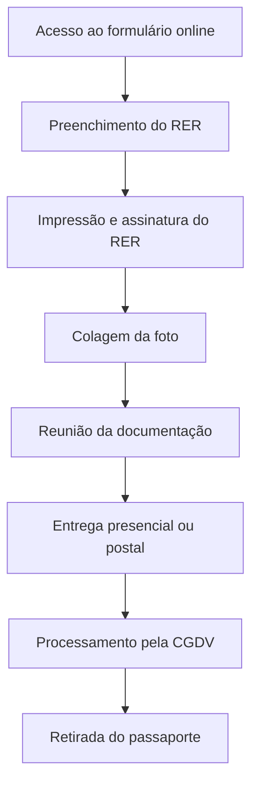

# Manual de Passaportes Oficiais e Diplomáticos

## TL;DR

**Resumo Executivo:** Para solicitar um passaporte oficial ou diplomático, você precisa de: RER online assinado, foto padrão ICAO, documentos de identidade, certidão eleitoral, ofício do órgão e passaporte anterior (se houver). Prazo mínimo: 5 dias úteis antes da viagem. Solicitação via formulário eletrônico no site do SERPRO.

---

## 1. Introdução

A concessão de Passaportes Oficiais e Diplomáticos é regulamentada pelo **Anexo ao Decreto 5.978/2006** e processada pela Coordenação-Geral de Documentos de Viagem do Ministério das Relações Exteriores (CGDV).

## 2. Documentação Obrigatória

Para o processamento do pedido, são necessários os seguintes documentos:

### 2.1 Documentos Principais

1. **Recibo de Entrega de Requerimento (RER)** online preenchido e assinado
2. **Fotografia recente** (máximo 6 meses) colorida com fundo branco
3. **Documentação de suporte** (detalhada na seção 4)
4. **Ofício** de órgão ou instituição governamental competente
5. **Passaporte oficial ou diplomático anterior** (se possuir, mesmo vencido)

!!! warning "Importante"
    Somente serão aceitos RERs originais. Não é necessária apresentação do Passaporte Comum.

## 3. Processo de Requerimento

### 3.1 Preenchimento do Formulário

O requerimento deve ser feito através do formulário eletrônico disponível em:
**http://formulario-autoridades.serpro.gov.br**

### 3.2 Prazos

- **Entrega da documentação:** até 30 dias após preenchimento do formulário
- **Antecedência mínima:** 5 dias úteis antes da data da viagem
- **Solicitações via postal:** recomenda-se 30 dias de antecedência

### 3.3 Locais de Entrega

A documentação pode ser entregue em:

- **CGDV - Brasília**
- **ERERIO - Rio de Janeiro**  
- **ERESP - São Paulo**

!!! info "Retirada"
    O passaporte deve ser retirado pessoalmente pelo titular ou por pessoa autorizada.

## 4. Especificações da Fotografia

### 4.1 Requisitos Gerais

- **Tamanho:** preferencialmente 5x7cm
- **Cor:** colorida, preferencialmente datada
- **Fundo:** branco
- **Idade:** máximo 6 meses

### 4.2 Requisitos do Rosto

- **Dimensões mínimas:** 3cm de altura por 2cm de largura
- **Posição:** centralizado, olhando diretamente para a câmera
- **Iluminação:** bem iluminado, sem reflexos, penumbras ou sombras
- **Expressão:** fisionomia neutra
- **Olhos:** abertos e visíveis

### 4.3 Restrições

| Permitido | Não Permitido |
|-----------|---------------|
| Óculos de grau (sem reflexo) | Óculos escuros |
| Itens religiosos (que não cubram o rosto) | Chapéus ou bonés |
| - | Armações grossas ou chamativas |
| - | Semi-perfil |

### 4.4 Regras para Crianças

!!! warning "Atenção"
    Crianças não podem aparecer com brinquedos, chupetas ou mãos de pessoas segurando-as.

## 5. Documentação de Suporte

### 5.1 Documento de Identidade

Cópia simples contendo:

- Nome completo
- Fotografia
- Cidade e estado de nascimento
- Data de nascimento
- Filiação completa

!!! note "Documentos Complementares"
    Se um único documento não contiver todas as informações, apresentar cópias adicionais para comprovar naturalidade e filiação completas.

### 5.2 Comprovação Eleitoral

**Opções aceitas:**
- Certidão de quitação eleitoral do TSE (www.tse.gov.br)
- Cópia do Título Eleitoral + comprovantes de votação da última eleição

!!! error "Não Aceito"
    Comprovante de Regularidade Eleitoral não será aceito.

### 5.3 Mudança de Nome

Para pessoas que modificaram o nome por casamento ou decisão judicial:
- **Obrigatório:** apresentar certidão de casamento comprovando a mudança

## 6. Ofício Institucional

### 6.1 Informações Obrigatórias

O ofício deve conter:

1. Nome completo do requerente
2. Número e tipo do documento anterior (se houver)
3. Objetivo da missão
4. Período da missão
5. Cidade e país de destino
6. Cargo ou emprego atual
7. Vínculo com a administração pública

### 6.2 Tipos de Vínculo

- Cargo comissionado sem outro vínculo
- Servidor público efetivo
- Contratado temporário (Lei nº 8.745/93)
- Empregado público (prazo determinado/indeterminado)
- Cargo eletivo
- Cargo de natureza especial do Poder Executivo
- Membro do Ministério Público ou Tribunal Superior
- Aposentado (até 5 anos da solicitação)

!!! warning "Prazo"
    A ausência dessas informações pode dilatar o prazo de entrega e comprometer a viagem.

### 6.3 Servidores do MRE

Devem apresentar:
- E-minimemo
- Minimemo
- Requerimento de próprio punho

## 7. Passaportes para Dependentes

### 7.1 Definição de Dependentes

- **Cônjuge ou companheiro(a)**
- **Filhos e enteados:** até 21 anos ou até 24 anos se estudante
- **Filhos inválidos:** qualquer idade
- **Filhos sob guarda:** menores de 21 anos com autorização judicial
- **Genitores:** sem economia própria, incluídos nos assentamentos funcionais

### 7.2 Condições Especiais

!!! info "Missões Longas"
    Passaportes oficiais para dependentes só são concedidos para missões superiores a 90 dias.

### 7.3 Documentação por Tipo de Dependente

#### Cônjuges
- Cópia da Certidão de Casamento

#### Companheiros
- Cópia da declaração de união estável (cartório)

#### Filhos Menores de 21 Anos
- Cópia da Certidão de Nascimento
- **Menores de 18 anos:** autorização de ambos os pais com firma reconhecida

#### Filhos de 21-24 Anos (Estudantes)
- Cópia da Certidão de Nascimento
- Declaração de Aluno Regular
- Documento com foto
- Certidão de quitação eleitoral

#### Menores sob Guarda
- Certidão de Nascimento
- Termo de Guarda ou autorização judicial

#### Enteados de 21-24 Anos
- Certidão de Nascimento
- Certidão de casamento/união estável dos responsáveis
- Declaração de Aluno Regular
- Documento com foto
- Certidão de quitação eleitoral

!!! warning "Cursos Não Aceitos"
    Cursinhos preparatórios, cursos de extensão e similares não são considerados ensino regular.

## 8. Passaportes Anteriores

- **Apresentação obrigatória** para cancelamento
- **Opção de devolução** ao titular
- **Destruição** se o titular não desejar a devolução
- **Não apensamento** do novo ao anterior

## 9. Contatos e Endereços

### 9.1 Coordenação-Geral de Documentos de Viagem (CGDV)

**Endereço:**
```
Ministério das Relações Exteriores
Esplanada dos Ministérios, Bloco H, anexo I, térreo
Brasília, DF - CEP 70170-900
```

**Contato:**
- Email: cgdv@itamaraty.gov.br
- Telefone: +55 61 2030-8850

**Responsáveis:**
- Coordenador-Geral: Cons. Luiz Otávio Monteiro Ortigão de Sampaio
- Coordenador-Geral Substituto: Cons. José Armando Zema Resende

### 9.2 Escritório do Rio de Janeiro (ERERIO)

**Endereço:**
```
Palácio Itamaraty
Av. Marechal Floriano, 196 - Centro
Rio de Janeiro/RJ - CEP 20080-002
```

**Contato:**
- Email: ererio.consular@itamaraty.gov.br
- Fax: (21) 2263-1532

### 9.3 Escritório de São Paulo (ERESP)

**Endereço:**
```
Rua Estados Unidos, 1342 - Jardim América
São Paulo/SP - CEP 01302-001
```

**Contato:**
- Email: eresp@itamaraty.gov.br
- Fax: (11) 5102-2526

## 10. Fluxo do Processo



## 11. Checklist Final

- [ ] RER online preenchido, impresso e assinado
- [ ] Foto padrão ICAO colada no RER
- [ ] Cópia do documento de identidade completo
- [ ] Certidão de quitação eleitoral do TSE
- [ ] Ofício institucional com todas as informações
- [ ] Passaporte anterior (se houver)
- [ ] Documentação específica para dependentes (se aplicável)
- [ ] Antecedência mínima de 5 dias úteis respeitada

---

*Manual baseado no Decreto 5.978/2006 e instruções da Coordenação-Geral de Documentos de Viagem do Ministério das Relações Exteriores.*