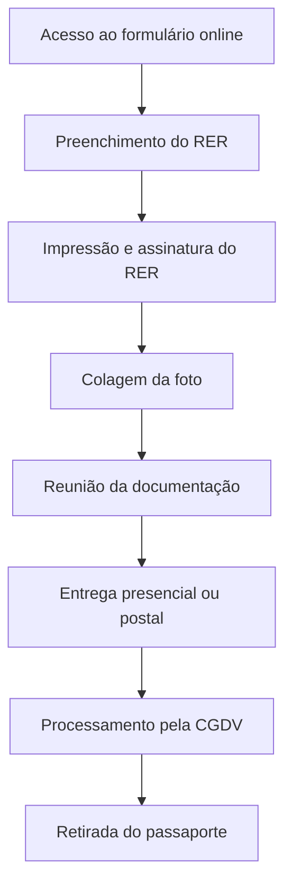

This file is a merged representation of the entire codebase, combined into a single document by Repomix.

# File Summary

## Purpose
This file contains a packed representation of the entire repository's contents.
It is designed to be easily consumable by AI systems for analysis, code review,
or other automated processes.

## File Format
The content is organized as follows:
1. This summary section
2. Repository information
3. Directory structure
4. Repository files (if enabled)
5. Multiple file entries, each consisting of:
  a. A header with the file path (## File: path/to/file)
  b. The full contents of the file in a code block

## Usage Guidelines
- This file should be treated as read-only. Any changes should be made to the
  original repository files, not this packed version.
- When processing this file, use the file path to distinguish
  between different files in the repository.
- Be aware that this file may contain sensitive information. Handle it with
  the same level of security as you would the original repository.

## Notes
- Some files may have been excluded based on .gitignore rules and Repomix's configuration
- Binary files are not included in this packed representation. Please refer to the Repository Structure section for a complete list of file paths, including binary files
- Files matching patterns in .gitignore are excluded
- Files matching default ignore patterns are excluded
- Files are sorted by Git change count (files with more changes are at the bottom)

# Directory Structure
```
docs/
  FAQ/
    manuais/
      deploy.md
    PADIP.md
  index.md
site/
  css/
    base.css
    bootstrap.min.css
    bootstrap.min.css.map
    brands.min.css
    fontawesome.min.css
    solid.min.css
    v4-font-face.min.css
  js/
    base.js
    bootstrap.bundle.min.js
    bootstrap.bundle.min.js.map
    darkmode.js
  manuais/
    deploy/
      index.html
  search/
    lunr.js
    main.js
    search_index.json
    worker.js
  404.html
  index.html
  sitemap.xml
mkdocs.yml
```

# Files

## File: docs/FAQ/manuais/deploy.md
````markdown
# Manual de Deploy via GitHub Pages

Este manual fornece instruções detalhadas para o processo de atualização de um site em produção utilizando o GitHub Pages (gh-deploy).

## 1. Preparação do Ambiente

### 1.1 Backup
- Realize um backup completo do repositório atual:
  ```bash
  git clone <url-do-repositorio> backup-site
  ```
- Documente a versão atual do site:
  ```bash
  git log -1 > versao_atual.txt
  ```

### 1.2 Testes Locais
- Execute os testes unitários:
  ```bash
  npm run test
  ```
- Verifique a build local:
  ```bash
  npm run build
  ```
- Teste o site localmente:
  ```bash
  npm run serve
  ```

### 1.3 Revisão de Código
- Verifique se todas as alterações foram commitadas
- Revise o histórico de commits recentes
- Confirme se não há conflitos pendentes
- Valide se todas as dependências estão atualizadas

## 2. Processo de Atualização

### 2.1 Preparação do Deploy
- Certifique-se de estar na branch principal:
  ```bash
  git checkout main
  ```
- Atualize a branch local:
  ```bash
  git pull origin main
  ```

### 2.2 Execução do Deploy
- Execute o comando de deploy:
  ```bash
  npm run deploy
  ```
  ou
  ```bash
  gh-pages -d dist
  ```

### 2.3 Verificação do Processo
- Monitore o progresso do deploy no GitHub Actions
- Verifique os logs de build
- Confirme se a branch gh-pages foi atualizada

## 3. Verificação e Testes Pós-Atualização

### 3.1 Validação do Site
- Acesse o site em produção
- Verifique se todas as páginas estão carregando corretamente
- Teste a navegação e funcionalidades principais
- Valide formulários e interações

### 3.2 Testes de Performance
- Utilize o Lighthouse para verificar:
  - Performance
  - Acessibilidade
  - SEO
  - Boas práticas
- Verifique o tempo de carregamento das páginas
- Teste em diferentes dispositivos e navegadores

### 3.3 Monitoramento
- Configure alertas de monitoramento
- Verifique logs de erro
- Monitore métricas de performance

## 4. Resolução de Problemas

### 4.1 Problemas Comuns

#### Deploy Falhou
- Verifique os logs de erro
- Confirme se todas as dependências estão instaladas
- Valide as configurações do GitHub Pages

#### Site Não Atualizado
- Limpe o cache do navegador
- Verifique se a branch gh-pages foi atualizada
- Confirme se o domínio está configurado corretamente

#### Erros de Build
- Revise as dependências
- Verifique a compatibilidade de versões
- Confirme as configurações do webpack

### 4.2 Rollback
- Em caso de problemas críticos:
  ```bash
  git checkout <commit-anterior>
  npm run deploy
  ```

## 5. Boas Práticas

### 5.1 Segurança
- Mantenha as dependências atualizadas
- Implemente HTTPS
- Configure headers de segurança
- Realize backups regulares

### 5.2 Performance
- Otimize imagens e assets
- Implemente cache adequado
- Utilize CDN quando possível
- Minimize recursos estáticos

### 5.3 Manutenção
- Mantenha documentação atualizada
- Realize deploys em horários de baixo tráfego
- Implemente CI/CD
- Mantenha um ambiente de staging

### 5.4 Monitoramento
- Configure alertas de disponibilidade
- Monitore métricas de performance
- Mantenha logs de erro
- Implemente analytics

## Conclusão

Seguir este manual garante um processo de deploy mais seguro e controlado. Lembre-se de sempre:
- Realizar backups antes de qualquer alteração
- Testar localmente antes do deploy
- Verificar o site após a atualização
- Manter documentação atualizada
- Seguir as boas práticas de segurança e performance
````

## File: docs/FAQ/PADIP.md
````markdown
# Manual de Passaportes Oficiais e Diplomáticos

## TL;DR

**Resumo Executivo:** Para solicitar um passaporte oficial ou diplomático, você precisa de: RER online assinado, foto padrão ICAO, documentos de identidade, certidão eleitoral, ofício do órgão e passaporte anterior (se houver). Prazo mínimo: 5 dias úteis antes da viagem. Solicitação via formulário eletrônico no site do SERPRO.

---

## 1. Introdução

A concessão de Passaportes Oficiais e Diplomáticos é regulamentada pelo **Anexo ao Decreto 5.978/2006** e processada pela Coordenação-Geral de Documentos de Viagem do Ministério das Relações Exteriores (CGDV).

## 2. Documentação Obrigatória

Para o processamento do pedido, são necessários os seguintes documentos:

### 2.1 Documentos Principais

1. **Recibo de Entrega de Requerimento (RER)** online preenchido e assinado
2. **Fotografia recente** (máximo 6 meses) colorida com fundo branco
3. **Documentação de suporte** (detalhada na seção 4)
4. **Ofício** de órgão ou instituição governamental competente
5. **Passaporte oficial ou diplomático anterior** (se possuir, mesmo vencido)

!!! warning "Importante"
    Somente serão aceitos RERs originais. Não é necessária apresentação do Passaporte Comum.

## 3. Processo de Requerimento

### 3.1 Preenchimento do Formulário

O requerimento deve ser feito através do formulário eletrônico disponível em:
**http://formulario-autoridades.serpro.gov.br**

### 3.2 Prazos

- **Entrega da documentação:** até 30 dias após preenchimento do formulário
- **Antecedência mínima:** 5 dias úteis antes da data da viagem
- **Solicitações via postal:** recomenda-se 30 dias de antecedência

### 3.3 Locais de Entrega

A documentação pode ser entregue em:

- **CGDV - Brasília**
- **ERERIO - Rio de Janeiro**  
- **ERESP - São Paulo**

!!! info "Retirada"
    O passaporte deve ser retirado pessoalmente pelo titular ou por pessoa autorizada.

## 4. Especificações da Fotografia

### 4.1 Requisitos Gerais

- **Tamanho:** preferencialmente 5x7cm
- **Cor:** colorida, preferencialmente datada
- **Fundo:** branco
- **Idade:** máximo 6 meses

### 4.2 Requisitos do Rosto

- **Dimensões mínimas:** 3cm de altura por 2cm de largura
- **Posição:** centralizado, olhando diretamente para a câmera
- **Iluminação:** bem iluminado, sem reflexos, penumbras ou sombras
- **Expressão:** fisionomia neutra
- **Olhos:** abertos e visíveis

### 4.3 Restrições

| Permitido | Não Permitido |
|-----------|---------------|
| Óculos de grau (sem reflexo) | Óculos escuros |
| Itens religiosos (que não cubram o rosto) | Chapéus ou bonés |
| - | Armações grossas ou chamativas |
| - | Semi-perfil |

### 4.4 Regras para Crianças

!!! warning "Atenção"
    Crianças não podem aparecer com brinquedos, chupetas ou mãos de pessoas segurando-as.

## 5. Documentação de Suporte

### 5.1 Documento de Identidade

Cópia simples contendo:

- Nome completo
- Fotografia
- Cidade e estado de nascimento
- Data de nascimento
- Filiação completa

!!! note "Documentos Complementares"
    Se um único documento não contiver todas as informações, apresentar cópias adicionais para comprovar naturalidade e filiação completas.

### 5.2 Comprovação Eleitoral

**Opções aceitas:**
- Certidão de quitação eleitoral do TSE (www.tse.gov.br)
- Cópia do Título Eleitoral + comprovantes de votação da última eleição

!!! error "Não Aceito"
    Comprovante de Regularidade Eleitoral não será aceito.

### 5.3 Mudança de Nome

Para pessoas que modificaram o nome por casamento ou decisão judicial:
- **Obrigatório:** apresentar certidão de casamento comprovando a mudança

## 6. Ofício Institucional

### 6.1 Informações Obrigatórias

O ofício deve conter:

1. Nome completo do requerente
2. Número e tipo do documento anterior (se houver)
3. Objetivo da missão
4. Período da missão
5. Cidade e país de destino
6. Cargo ou emprego atual
7. Vínculo com a administração pública

### 6.2 Tipos de Vínculo

- Cargo comissionado sem outro vínculo
- Servidor público efetivo
- Contratado temporário (Lei nº 8.745/93)
- Empregado público (prazo determinado/indeterminado)
- Cargo eletivo
- Cargo de natureza especial do Poder Executivo
- Membro do Ministério Público ou Tribunal Superior
- Aposentado (até 5 anos da solicitação)

!!! warning "Prazo"
    A ausência dessas informações pode dilatar o prazo de entrega e comprometer a viagem.

### 6.3 Servidores do MRE

Devem apresentar:
- E-minimemo
- Minimemo
- Requerimento de próprio punho

## 7. Passaportes para Dependentes

### 7.1 Definição de Dependentes

- **Cônjuge ou companheiro(a)**
- **Filhos e enteados:** até 21 anos ou até 24 anos se estudante
- **Filhos inválidos:** qualquer idade
- **Filhos sob guarda:** menores de 21 anos com autorização judicial
- **Genitores:** sem economia própria, incluídos nos assentamentos funcionais

### 7.2 Condições Especiais

!!! info "Missões Longas"
    Passaportes oficiais para dependentes só são concedidos para missões superiores a 90 dias.

### 7.3 Documentação por Tipo de Dependente

#### Cônjuges
- Cópia da Certidão de Casamento

#### Companheiros
- Cópia da declaração de união estável (cartório)

#### Filhos Menores de 21 Anos
- Cópia da Certidão de Nascimento
- **Menores de 18 anos:** autorização de ambos os pais com firma reconhecida

#### Filhos de 21-24 Anos (Estudantes)
- Cópia da Certidão de Nascimento
- Declaração de Aluno Regular
- Documento com foto
- Certidão de quitação eleitoral

#### Menores sob Guarda
- Certidão de Nascimento
- Termo de Guarda ou autorização judicial

#### Enteados de 21-24 Anos
- Certidão de Nascimento
- Certidão de casamento/união estável dos responsáveis
- Declaração de Aluno Regular
- Documento com foto
- Certidão de quitação eleitoral

!!! warning "Cursos Não Aceitos"
    Cursinhos preparatórios, cursos de extensão e similares não são considerados ensino regular.

## 8. Passaportes Anteriores

- **Apresentação obrigatória** para cancelamento
- **Opção de devolução** ao titular
- **Destruição** se o titular não desejar a devolução
- **Não apensamento** do novo ao anterior

## 9. Contatos e Endereços

### 9.1 Coordenação-Geral de Documentos de Viagem (CGDV)

**Endereço:**
```
Ministério das Relações Exteriores
Esplanada dos Ministérios, Bloco H, anexo I, térreo
Brasília, DF - CEP 70170-900
```

**Contato:**
- Email: cgdv@itamaraty.gov.br
- Telefone: +55 61 2030-8850

**Responsáveis:**
- Coordenador-Geral: Cons. Luiz Otávio Monteiro Ortigão de Sampaio
- Coordenador-Geral Substituto: Cons. José Armando Zema Resende

### 9.2 Escritório do Rio de Janeiro (ERERIO)

**Endereço:**
```
Palácio Itamaraty
Av. Marechal Floriano, 196 - Centro
Rio de Janeiro/RJ - CEP 20080-002
```

**Contato:**
- Email: ererio.consular@itamaraty.gov.br
- Fax: (21) 2263-1532

### 9.3 Escritório de São Paulo (ERESP)

**Endereço:**
```
Rua Estados Unidos, 1342 - Jardim América
São Paulo/SP - CEP 01302-001
```

**Contato:**
- Email: eresp@itamaraty.gov.br
- Fax: (11) 5102-2526

## 10. Fluxo do Processo



## 11. Checklist Final

- [ ] RER online preenchido, impresso e assinado
- [ ] Foto padrão ICAO colada no RER
- [ ] Cópia do documento de identidade completo
- [ ] Certidão de quitação eleitoral do TSE
- [ ] Ofício institucional com todas as informações
- [ ] Passaporte anterior (se houver)
- [ ] Documentação específica para dependentes (se aplicável)
- [ ] Antecedência mínima de 5 dias úteis respeitada

---

*Manual baseado no Decreto 5.978/2006 e instruções da Coordenação-Geral de Documentos de Viagem do Ministério das Relações Exteriores.*
````

## File: docs/index.md
````markdown
# Bem-vindo à Documentação ASOF

Este portal serve como repositório centralizado e dinâmico de documentação, processos e procedimentos da ASOF. Aqui você encontrará informações essenciais para:

- Diretoria Executiva
- Funcionários
- Colaboradores
- Stakeholders

Nossa documentação é constantemente atualizada para garantir que você tenha acesso às informações mais recentes e precisas.

---
Desenvolvido por: Gabriel Guimarães Ferreira de Carvalho Ramos
Última atualização: {{ date }}
````

## File: site/css/base.css
````css
html {
    /* The nav header is 3.5rem high, plus 20px for the margin-top of the
       main container. */
    scroll-padding-top: calc(3.5rem + 20px);
}

/* Replacement for `body { background-attachment: fixed; }`, which has
   performance issues when scrolling on large displays. See #1394. */
body::before {
    content: ' ';
    position: fixed;
    width: 100%;
    height: 100%;
    top: 0;
    left: 0;
    background-color: var(--bs-body-bg);
    background: url(../img/grid.png) repeat-x;
    will-change: transform;
    z-index: -1;
}

body > .container {
    margin-top: 20px;
    min-height: 400px;
}

.navbar.fixed-top {
    position: -webkit-sticky;
    position: sticky;
}

.source-links {
    float: right;
}

.col-md-9 img {
    max-width: 100%;
    display: inline-block;
    padding: 4px;
    line-height: 1.428571429;
    background-color: var(--bs-secondary-bg-subtle);
    border: 1px solid var(--bs-secondary-border-subtle);
    border-radius: 4px;
    margin: 20px auto 30px auto;
}

h1 {
    color: inherit;
    font-weight: 400;
    font-size: 42px;
}

h2, h3, h4, h5, h6 {
    color: inherit;
    font-weight: 300;
}

hr {
    border-top: 1px solid #aaa;
    opacity: 1;
}

pre, .rst-content tt {
    max-width: 100%;
    background-color: var(--bs-body-bg);
    border: solid 1px var(--bs-border-color);
    color: var(--bs-body-color);
    overflow-x: auto;
}

code.code-large, .rst-content tt.code-large {
    font-size: 90%;
}

code {
    padding: 2px 5px;
    background-color: rgba(var(--bs-body-bg-rgb), 0.75);
    border: solid 1px var(--bs-border-color);
    color: var(--bs-body-color);
    white-space: pre-wrap;
    word-wrap: break-word;
}

pre code {
    display: block;
    border: none;
    white-space: pre;
    word-wrap: normal;
    font-family: SFMono-Regular, Menlo, Monaco, Consolas, "Liberation Mono", "Courier New", monospace;
    font-size: 12px;
}

kbd {
    padding: 2px 4px;
    font-size: 90%;
    color: var(--bs-secondary-text-emphasis);
    background-color: var(--bs-secondary-bg-subtle);
    border-radius: 3px;
    -webkit-box-shadow: inset 0 -1px 0 rgba(0,0,0,.25);
    box-shadow: inset 0 -1px 0 rgba(0,0,0,.25);
}

a code {
    color: inherit;
}

a:hover code, a:focus code {
    color: inherit;
}

footer {
    margin-top: 30px;
    margin-bottom: 10px;
    text-align: center;
    font-weight: 200;
}

.modal-dialog {
    margin-top: 60px;
}

/*
 * Side navigation
 *
 * Scrollspy and affixed enhanced navigation to highlight sections and secondary
 * sections of docs content.
 */

.bs-sidebar.affix {
    position: -webkit-sticky;
    position: sticky;
    /* The nav header is 3.5rem high, plus 20px for the margin-top of the
       main container. */
    top: calc(3.5rem + 20px);
}

.bs-sidebar.card {
    padding: 0;
    max-height: 90%;
    overflow-y: auto;
}

/* Toggle (vertically flip) sidebar collapse icon */
.bs-sidebar .navbar-toggler span {
    -moz-transform: scale(1, -1);
    -webkit-transform: scale(1, -1);
    -o-transform: scale(1, -1);
    -ms-transform: scale(1, -1);
    transform: scale(1, -1);
}

.bs-sidebar .navbar-toggler.collapsed span {
    -moz-transform: scale(1, 1);
    -webkit-transform: scale(1, 1);
    -o-transform: scale(1, 1);
    -ms-transform: scale(1, 1);
    transform: scale(1, 1);
}

/* First level of nav */
.bs-sidebar > .navbar-collapse > .nav {
    padding-top:    10px;
    padding-bottom: 10px;
    border-radius: 5px;
    width: 100%;
}

/* All levels of nav */
.bs-sidebar .nav > li > a {
    display: block;
    padding: 5px 20px;
    z-index: 1;
}
.bs-sidebar .nav > li > a:hover,
.bs-sidebar .nav > li > a:focus {
    text-decoration: none;
    border-right: 1px solid;
}
.bs-sidebar .nav > li > a.active,
.bs-sidebar .nav > li > a.active:hover,
.bs-sidebar .nav > li > a.active:focus {
    font-weight: bold;
    background-color: transparent;
    border-right: 1px solid;
}

.bs-sidebar .nav .nav .nav {
    margin-left: 1em;
}

.bs-sidebar .nav > li > a {
    font-weight: bold;
}

.bs-sidebar .nav .nav > li > a {
    font-weight: normal;
}

.headerlink {
    font-family: FontAwesome;
    font-size: 14px;
    display: none;
    padding-left: .5em;
    text-decoration: none;
    vertical-align: middle;
}

h1:hover .headerlink, h2:hover .headerlink, h3:hover .headerlink, h4:hover .headerlink, h5:hover .headerlink, h6:hover .headerlink {
    display:inline-block;
}

blockquote {
    padding-left: 10px;
    border-left: 4px solid #e6e6e6;
}

.admonition, details {
    padding: 15px;
    margin-bottom: 20px;
    border: 1px solid transparent;
    border-radius: 4px;
    text-align: left;
}

.admonition.note, details.note {
    color: var(--bs-primary-text-emphasis);
    background-color: var(--bs-primary-bg-subtle);
    border-color: var(--bs-primary-border-subtle);
}

.admonition.note h1, .admonition.note h2, .admonition.note h3,
.admonition.note h4, .admonition.note h5, .admonition.note h6,
details.note h1, details.note h2, details.note h3,
details.note h4, details.note h5, details.note h6 {
    color: var(--bs-primary-text-emphasis);
}

.admonition.info, details.info {
    color: var(--bs-info-text-emphasis);
    background-color: var(--bs-info-bg-subtle);
    border-color: var(--bs-info-border-subtle);
}

.admonition.info h1, .admonition.info h2, .admonition.info h3,
.admonition.info h4, .admonition.info h5, .admonition.info h6,
details.info h1, details.info h2, details.info h3,
details.info h4, details.info h5, details.info h6 {
    color: var(--bs-info-text-emphasis);
}

.admonition.warning, details.warning {
    color: var(--bs-warning-text-emphasis);
    background-color: var(--bs-warning-bg-subtle);
    border-color: var(--bs-warning-border-subtle);
}

.admonition.warning h1, .admonition.warning h2, .admonition.warning h3,
.admonition.warning h4, .admonition.warning h5, .admonition.warning h6,
details.warning h1, details.warning h2, details.warning h3,
details.warning h4, details.warning h5, details.warning h6 {
    color: var(--bs-warning-text-emphasis);
}

.admonition.danger, details.danger {
    color: var(--bs-danger-text-emphasis);
    background-color: var(--bs-danger-bg-subtle);
    border-color: var(--bs-danger-border-subtle);
}

.admonition.danger h1, .admonition.danger h2, .admonition.danger h3,
.admonition.danger h4, .admonition.danger h5, .admonition.danger h6,
details.danger h1, details.danger h2, details.danger h3,
details.danger h4, details.danger h5, details.danger h6 {
    color: var(--bs-danger-text-emphasis);
}

.admonition, details {
    color: var(--bs-light-text-emphasis);
    background-color: var(--bs-light-bg-subtle);
    border-color: var(--bs-light-border-subtle);
}

.admonition h1, .admonition h2, .admonition h3,
.admonition h4, .admonition h5, .admonition h6,
details h1, details h2, details h3,
details h4, details h5, details h6 {
    color: var(--bs-light-text-emphasis);
}

.admonition-title, summary {
    font-weight: bold;
    text-align: left;
}

.admonition>p:last-child, details>p:last-child {
    margin-bottom: 0;
}

@media (max-width: 991.98px) {
    .navbar-collapse.show {
        overflow-y: auto;
        max-height: calc(100vh - 3.5rem);
    }
}

.dropdown-item.open {
    color: var(--bs-dropdown-link-active-color);
    background-color: var(--bs-dropdown-link-active-bg);
}

.dropdown-submenu > .dropdown-menu {
    margin: 0 0 0 1.5rem;
    padding: 0;
    border-width: 0;
}

.dropdown-submenu > a::after {
    display: block;
    content: " ";
    float: right;
    width: 0;
    height: 0;
    border-color: transparent;
    border-style: solid;
    border-width: 5px 0 5px 5px;
    border-left-color: var(--bs-dropdown-link-active-color);
    margin-top: 5px;
    margin-right: -10px;
}

.dropdown-submenu:hover > a::after {
    border-left-color: var(--bs-dropdown-link-active-color);
}

@media (min-width: 992px) {
    .dropdown-menu {
        overflow-y: auto;
        max-height: calc(100vh - 3.5rem);
    }

    .dropdown-submenu {
        position: relative;
    }

    .dropdown-submenu > .dropdown-menu {
        position: fixed !important;
        margin-top: -9px;
        margin-left: -2px;
        border-width: 1px;
        padding: 0.5rem 0;
    }

    .dropdown-submenu.pull-left {
        float: none;
    }

    .dropdown-submenu.pull-left > .dropdown-menu {
        left: -100%;
        margin-left: 10px;
    }
}

@media print {
    /* Remove sidebar when print */
    .col-md-3 { display: none; }
}
````

## File: site/css/bootstrap.min.css
````css
@charset "UTF-8";/*!
 * Bootswatch v5.3.2 (https://bootswatch.com)
 * Theme: cerulean
 * Copyright 2012-2023 Thomas Park
 * Licensed under MIT
 * Based on Bootstrap
*//*!
 * Bootstrap  v5.3.2 (https://getbootstrap.com/)
 * Copyright 2011-2023 The Bootstrap Authors
 * Licensed under MIT (https://github.com/twbs/bootstrap/blob/main/LICENSE)
 */:root,[data-bs-theme=light]{--bs-blue:#033c73;--bs-indigo:#6610f2;--bs-purple:#6f42c1;--bs-pink:#e83e8c;--bs-red:#c71c22;--bs-orange:#fd7e14;--bs-yellow:#dd5600;--bs-green:#73a839;--bs-teal:#20c997;--bs-cyan:#2fa4e7;--bs-black:#000;--bs-white:#fff;--bs-gray:#868e96;--bs-gray-dark:#343a40;--bs-gray-100:#f8f9fa;--bs-gray-200:#e9ecef;--bs-gray-300:#dee2e6;--bs-gray-400:#ced4da;--bs-gray-500:#adb5bd;--bs-gray-600:#868e96;--bs-gray-700:#495057;--bs-gray-800:#343a40;--bs-gray-900:#212529;--bs-primary:#2fa4e7;--bs-secondary:#e9ecef;--bs-success:#73a839;--bs-info:#033c73;--bs-warning:#dd5600;--bs-danger:#c71c22;--bs-light:#f8f9fa;--bs-dark:#343a40;--bs-primary-rgb:47,164,231;--bs-secondary-rgb:233,236,239;--bs-success-rgb:115,168,57;--bs-info-rgb:3,60,115;--bs-warning-rgb:221,86,0;--bs-danger-rgb:199,28,34;--bs-light-rgb:248,249,250;--bs-dark-rgb:52,58,64;--bs-primary-text-emphasis:#13425c;--bs-secondary-text-emphasis:#5d5e60;--bs-success-text-emphasis:#2e4317;--bs-info-text-emphasis:#01182e;--bs-warning-text-emphasis:#582200;--bs-danger-text-emphasis:#500b0e;--bs-light-text-emphasis:#495057;--bs-dark-text-emphasis:#495057;--bs-primary-bg-subtle:#d5edfa;--bs-secondary-bg-subtle:#fbfbfc;--bs-success-bg-subtle:#e3eed7;--bs-info-bg-subtle:#cdd8e3;--bs-warning-bg-subtle:#f8ddcc;--bs-danger-bg-subtle:#f4d2d3;--bs-light-bg-subtle:#fcfcfd;--bs-dark-bg-subtle:#ced4da;--bs-primary-border-subtle:#acdbf5;--bs-secondary-border-subtle:#f6f7f9;--bs-success-border-subtle:#c7dcb0;--bs-info-border-subtle:#9ab1c7;--bs-warning-border-subtle:#f1bb99;--bs-danger-border-subtle:#e9a4a7;--bs-light-border-subtle:#e9ecef;--bs-dark-border-subtle:#adb5bd;--bs-white-rgb:255,255,255;--bs-black-rgb:0,0,0;--bs-font-sans-serif:system-ui,-apple-system,"Segoe UI",Roboto,"Helvetica Neue","Noto Sans","Liberation Sans",Arial,sans-serif,"Apple Color Emoji","Segoe UI Emoji","Segoe UI Symbol","Noto Color Emoji";--bs-font-monospace:SFMono-Regular,Menlo,Monaco,Consolas,"Liberation Mono","Courier New",monospace;--bs-gradient:linear-gradient(180deg, rgba(255, 255, 255, 0.15), rgba(255, 255, 255, 0));--bs-body-font-family:var(--bs-font-sans-serif);--bs-body-font-size:1rem;--bs-body-font-weight:400;--bs-body-line-height:1.5;--bs-body-color:#495057;--bs-body-color-rgb:73,80,87;--bs-body-bg:#fff;--bs-body-bg-rgb:255,255,255;--bs-emphasis-color:#000;--bs-emphasis-color-rgb:0,0,0;--bs-secondary-color:rgba(73, 80, 87, 0.75);--bs-secondary-color-rgb:73,80,87;--bs-secondary-bg:#e9ecef;--bs-secondary-bg-rgb:233,236,239;--bs-tertiary-color:rgba(73, 80, 87, 0.5);--bs-tertiary-color-rgb:73,80,87;--bs-tertiary-bg:#f8f9fa;--bs-tertiary-bg-rgb:248,249,250;--bs-heading-color:#2fa4e7;--bs-link-color:#2fa4e7;--bs-link-color-rgb:47,164,231;--bs-link-decoration:underline;--bs-link-hover-color:#2683b9;--bs-link-hover-color-rgb:38,131,185;--bs-code-color:#e83e8c;--bs-highlight-color:#495057;--bs-highlight-bg:#f8ddcc;--bs-border-width:1px;--bs-border-style:solid;--bs-border-color:#dee2e6;--bs-border-color-translucent:rgba(0, 0, 0, 0.175);--bs-border-radius:0.375rem;--bs-border-radius-sm:0.25rem;--bs-border-radius-lg:0.5rem;--bs-border-radius-xl:1rem;--bs-border-radius-xxl:2rem;--bs-border-radius-2xl:var(--bs-border-radius-xxl);--bs-border-radius-pill:50rem;--bs-box-shadow:0 0.5rem 1rem rgba(0, 0, 0, 0.15);--bs-box-shadow-sm:0 0.125rem 0.25rem rgba(0, 0, 0, 0.075);--bs-box-shadow-lg:0 1rem 3rem rgba(0, 0, 0, 0.175);--bs-box-shadow-inset:inset 0 1px 2px rgba(0, 0, 0, 0.075);--bs-focus-ring-width:0.25rem;--bs-focus-ring-opacity:0.25;--bs-focus-ring-color:rgba(47, 164, 231, 0.25);--bs-form-valid-color:#73a839;--bs-form-valid-border-color:#73a839;--bs-form-invalid-color:#c71c22;--bs-form-invalid-border-color:#c71c22}[data-bs-theme=dark]{color-scheme:dark;--bs-body-color:#dee2e6;--bs-body-color-rgb:222,226,230;--bs-body-bg:#212529;--bs-body-bg-rgb:33,37,41;--bs-emphasis-color:#fff;--bs-emphasis-color-rgb:255,255,255;--bs-secondary-color:rgba(222, 226, 230, 0.75);--bs-secondary-color-rgb:222,226,230;--bs-secondary-bg:#343a40;--bs-secondary-bg-rgb:52,58,64;--bs-tertiary-color:rgba(222, 226, 230, 0.5);--bs-tertiary-color-rgb:222,226,230;--bs-tertiary-bg:#2b3035;--bs-tertiary-bg-rgb:43,48,53;--bs-primary-text-emphasis:#82c8f1;--bs-secondary-text-emphasis:#f2f4f5;--bs-success-text-emphasis:#abcb88;--bs-info-text-emphasis:#688aab;--bs-warning-text-emphasis:#eb9a66;--bs-danger-text-emphasis:#dd777a;--bs-light-text-emphasis:#f8f9fa;--bs-dark-text-emphasis:#dee2e6;--bs-primary-bg-subtle:#09212e;--bs-secondary-bg-subtle:#2f2f30;--bs-success-bg-subtle:#17220b;--bs-info-bg-subtle:#010c17;--bs-warning-bg-subtle:#2c1100;--bs-danger-bg-subtle:#280607;--bs-light-bg-subtle:#343a40;--bs-dark-bg-subtle:#1a1d20;--bs-primary-border-subtle:#1c628b;--bs-secondary-border-subtle:#8c8e8f;--bs-success-border-subtle:#456522;--bs-info-border-subtle:#022445;--bs-warning-border-subtle:#853400;--bs-danger-border-subtle:#771114;--bs-light-border-subtle:#495057;--bs-dark-border-subtle:#343a40;--bs-heading-color:inherit;--bs-link-color:#82c8f1;--bs-link-hover-color:#9bd3f4;--bs-link-color-rgb:130,200,241;--bs-link-hover-color-rgb:155,211,244;--bs-code-color:#f18bba;--bs-highlight-color:#dee2e6;--bs-highlight-bg:#582200;--bs-border-color:#495057;--bs-border-color-translucent:rgba(255, 255, 255, 0.15);--bs-form-valid-color:#abcb88;--bs-form-valid-border-color:#abcb88;--bs-form-invalid-color:#dd777a;--bs-form-invalid-border-color:#dd777a}*,::after,::before{box-sizing:border-box}@media (prefers-reduced-motion:no-preference){:root{scroll-behavior:smooth}}body{margin:0;font-family:var(--bs-body-font-family);font-size:var(--bs-body-font-size);font-weight:var(--bs-body-font-weight);line-height:var(--bs-body-line-height);color:var(--bs-body-color);text-align:var(--bs-body-text-align);background-color:var(--bs-body-bg);-webkit-text-size-adjust:100%;-webkit-tap-highlight-color:transparent}hr{margin:1rem 0;color:inherit;border:0;border-top:var(--bs-border-width) solid;opacity:.25}.h1,.h2,.h3,.h4,.h5,.h6,h1,h2,h3,h4,h5,h6{margin-top:0;margin-bottom:.5rem;font-weight:500;line-height:1.2;color:var(--bs-heading-color)}.h1,h1{font-size:calc(1.375rem + 1.5vw)}@media (min-width:1200px){.h1,h1{font-size:2.5rem}}.h2,h2{font-size:calc(1.325rem + .9vw)}@media (min-width:1200px){.h2,h2{font-size:2rem}}.h3,h3{font-size:calc(1.3rem + .6vw)}@media (min-width:1200px){.h3,h3{font-size:1.75rem}}.h4,h4{font-size:calc(1.275rem + .3vw)}@media (min-width:1200px){.h4,h4{font-size:1.5rem}}.h5,h5{font-size:1.25rem}.h6,h6{font-size:1rem}p{margin-top:0;margin-bottom:1rem}abbr[title]{-webkit-text-decoration:underline dotted;text-decoration:underline dotted;cursor:help;-webkit-text-decoration-skip-ink:none;text-decoration-skip-ink:none}address{margin-bottom:1rem;font-style:normal;line-height:inherit}ol,ul{padding-left:2rem}dl,ol,ul{margin-top:0;margin-bottom:1rem}ol ol,ol ul,ul ol,ul ul{margin-bottom:0}dt{font-weight:700}dd{margin-bottom:.5rem;margin-left:0}blockquote{margin:0 0 1rem}b,strong{font-weight:bolder}.small,small{font-size:.875em}.mark,mark{padding:.1875em;color:var(--bs-highlight-color);background-color:var(--bs-highlight-bg)}sub,sup{position:relative;font-size:.75em;line-height:0;vertical-align:baseline}sub{bottom:-.25em}sup{top:-.5em}a{color:rgba(var(--bs-link-color-rgb),var(--bs-link-opacity,1));text-decoration:underline}a:hover{--bs-link-color-rgb:var(--bs-link-hover-color-rgb)}a:not([href]):not([class]),a:not([href]):not([class]):hover{color:inherit;text-decoration:none}code,kbd,pre,samp{font-family:var(--bs-font-monospace);font-size:1em}pre{display:block;margin-top:0;margin-bottom:1rem;overflow:auto;font-size:.875em}pre code{font-size:inherit;color:inherit;word-break:normal}code{font-size:.875em;color:var(--bs-code-color);word-wrap:break-word}a>code{color:inherit}kbd{padding:.1875rem .375rem;font-size:.875em;color:var(--bs-body-bg);background-color:var(--bs-body-color);border-radius:.25rem}kbd kbd{padding:0;font-size:1em}figure{margin:0 0 1rem}img,svg{vertical-align:middle}table{caption-side:bottom;border-collapse:collapse}caption{padding-top:.5rem;padding-bottom:.5rem;color:var(--bs-secondary-color);text-align:left}th{text-align:inherit;text-align:-webkit-match-parent}tbody,td,tfoot,th,thead,tr{border-color:inherit;border-style:solid;border-width:0}label{display:inline-block}button{border-radius:0}button:focus:not(:focus-visible){outline:0}button,input,optgroup,select,textarea{margin:0;font-family:inherit;font-size:inherit;line-height:inherit}button,select{text-transform:none}[role=button]{cursor:pointer}select{word-wrap:normal}select:disabled{opacity:1}[list]:not([type=date]):not([type=datetime-local]):not([type=month]):not([type=week]):not([type=time])::-webkit-calendar-picker-indicator{display:none!important}[type=button],[type=reset],[type=submit],button{-webkit-appearance:button}[type=button]:not(:disabled),[type=reset]:not(:disabled),[type=submit]:not(:disabled),button:not(:disabled){cursor:pointer}::-moz-focus-inner{padding:0;border-style:none}textarea{resize:vertical}fieldset{min-width:0;padding:0;margin:0;border:0}legend{float:left;width:100%;padding:0;margin-bottom:.5rem;font-size:calc(1.275rem + .3vw);line-height:inherit}@media (min-width:1200px){legend{font-size:1.5rem}}legend+*{clear:left}::-webkit-datetime-edit-day-field,::-webkit-datetime-edit-fields-wrapper,::-webkit-datetime-edit-hour-field,::-webkit-datetime-edit-minute,::-webkit-datetime-edit-month-field,::-webkit-datetime-edit-text,::-webkit-datetime-edit-year-field{padding:0}::-webkit-inner-spin-button{height:auto}[type=search]{-webkit-appearance:textfield;outline-offset:-2px}::-webkit-search-decoration{-webkit-appearance:none}::-webkit-color-swatch-wrapper{padding:0}::-webkit-file-upload-button{font:inherit;-webkit-appearance:button}::file-selector-button{font:inherit;-webkit-appearance:button}output{display:inline-block}iframe{border:0}summary{display:list-item;cursor:pointer}progress{vertical-align:baseline}[hidden]{display:none!important}.lead{font-size:1.25rem;font-weight:300}.display-1{font-size:calc(1.625rem + 4.5vw);font-weight:300;line-height:1.2}@media (min-width:1200px){.display-1{font-size:5rem}}.display-2{font-size:calc(1.575rem + 3.9vw);font-weight:300;line-height:1.2}@media (min-width:1200px){.display-2{font-size:4.5rem}}.display-3{font-size:calc(1.525rem + 3.3vw);font-weight:300;line-height:1.2}@media (min-width:1200px){.display-3{font-size:4rem}}.display-4{font-size:calc(1.475rem + 2.7vw);font-weight:300;line-height:1.2}@media (min-width:1200px){.display-4{font-size:3.5rem}}.display-5{font-size:calc(1.425rem + 2.1vw);font-weight:300;line-height:1.2}@media (min-width:1200px){.display-5{font-size:3rem}}.display-6{font-size:calc(1.375rem + 1.5vw);font-weight:300;line-height:1.2}@media (min-width:1200px){.display-6{font-size:2.5rem}}.list-unstyled{padding-left:0;list-style:none}.list-inline{padding-left:0;list-style:none}.list-inline-item{display:inline-block}.list-inline-item:not(:last-child){margin-right:.5rem}.initialism{font-size:.875em;text-transform:uppercase}.blockquote{margin-bottom:1rem;font-size:1.25rem}.blockquote>:last-child{margin-bottom:0}.blockquote-footer{margin-top:-1rem;margin-bottom:1rem;font-size:.875em;color:#868e96}.blockquote-footer::before{content:"— "}.img-fluid{max-width:100%;height:auto}.img-thumbnail{padding:.25rem;background-color:var(--bs-body-bg);border:var(--bs-border-width) solid var(--bs-border-color);border-radius:var(--bs-border-radius);max-width:100%;height:auto}.figure{display:inline-block}.figure-img{margin-bottom:.5rem;line-height:1}.figure-caption{font-size:.875em;color:var(--bs-secondary-color)}.container,.container-fluid,.container-lg,.container-md,.container-sm,.container-xl,.container-xxl{--bs-gutter-x:1.5rem;--bs-gutter-y:0;width:100%;padding-right:calc(var(--bs-gutter-x) * .5);padding-left:calc(var(--bs-gutter-x) * .5);margin-right:auto;margin-left:auto}@media (min-width:576px){.container,.container-sm{max-width:540px}}@media (min-width:768px){.container,.container-md,.container-sm{max-width:720px}}@media (min-width:992px){.container,.container-lg,.container-md,.container-sm{max-width:960px}}@media (min-width:1200px){.container,.container-lg,.container-md,.container-sm,.container-xl{max-width:1140px}}@media (min-width:1400px){.container,.container-lg,.container-md,.container-sm,.container-xl,.container-xxl{max-width:1320px}}:root{--bs-breakpoint-xs:0;--bs-breakpoint-sm:576px;--bs-breakpoint-md:768px;--bs-breakpoint-lg:992px;--bs-breakpoint-xl:1200px;--bs-breakpoint-xxl:1400px}.row{--bs-gutter-x:1.5rem;--bs-gutter-y:0;display:flex;flex-wrap:wrap;margin-top:calc(-1 * var(--bs-gutter-y));margin-right:calc(-.5 * var(--bs-gutter-x));margin-left:calc(-.5 * var(--bs-gutter-x))}.row>*{flex-shrink:0;width:100%;max-width:100%;padding-right:calc(var(--bs-gutter-x) * .5);padding-left:calc(var(--bs-gutter-x) * .5);margin-top:var(--bs-gutter-y)}.col{flex:1 0 0%}.row-cols-auto>*{flex:0 0 auto;width:auto}.row-cols-1>*{flex:0 0 auto;width:100%}.row-cols-2>*{flex:0 0 auto;width:50%}.row-cols-3>*{flex:0 0 auto;width:33.33333333%}.row-cols-4>*{flex:0 0 auto;width:25%}.row-cols-5>*{flex:0 0 auto;width:20%}.row-cols-6>*{flex:0 0 auto;width:16.66666667%}.col-auto{flex:0 0 auto;width:auto}.col-1{flex:0 0 auto;width:8.33333333%}.col-2{flex:0 0 auto;width:16.66666667%}.col-3{flex:0 0 auto;width:25%}.col-4{flex:0 0 auto;width:33.33333333%}.col-5{flex:0 0 auto;width:41.66666667%}.col-6{flex:0 0 auto;width:50%}.col-7{flex:0 0 auto;width:58.33333333%}.col-8{flex:0 0 auto;width:66.66666667%}.col-9{flex:0 0 auto;width:75%}.col-10{flex:0 0 auto;width:83.33333333%}.col-11{flex:0 0 auto;width:91.66666667%}.col-12{flex:0 0 auto;width:100%}.offset-1{margin-left:8.33333333%}.offset-2{margin-left:16.66666667%}.offset-3{margin-left:25%}.offset-4{margin-left:33.33333333%}.offset-5{margin-left:41.66666667%}.offset-6{margin-left:50%}.offset-7{margin-left:58.33333333%}.offset-8{margin-left:66.66666667%}.offset-9{margin-left:75%}.offset-10{margin-left:83.33333333%}.offset-11{margin-left:91.66666667%}.g-0,.gx-0{--bs-gutter-x:0}.g-0,.gy-0{--bs-gutter-y:0}.g-1,.gx-1{--bs-gutter-x:0.25rem}.g-1,.gy-1{--bs-gutter-y:0.25rem}.g-2,.gx-2{--bs-gutter-x:0.5rem}.g-2,.gy-2{--bs-gutter-y:0.5rem}.g-3,.gx-3{--bs-gutter-x:1rem}.g-3,.gy-3{--bs-gutter-y:1rem}.g-4,.gx-4{--bs-gutter-x:1.5rem}.g-4,.gy-4{--bs-gutter-y:1.5rem}.g-5,.gx-5{--bs-gutter-x:3rem}.g-5,.gy-5{--bs-gutter-y:3rem}@media (min-width:576px){.col-sm{flex:1 0 0%}.row-cols-sm-auto>*{flex:0 0 auto;width:auto}.row-cols-sm-1>*{flex:0 0 auto;width:100%}.row-cols-sm-2>*{flex:0 0 auto;width:50%}.row-cols-sm-3>*{flex:0 0 auto;width:33.33333333%}.row-cols-sm-4>*{flex:0 0 auto;width:25%}.row-cols-sm-5>*{flex:0 0 auto;width:20%}.row-cols-sm-6>*{flex:0 0 auto;width:16.66666667%}.col-sm-auto{flex:0 0 auto;width:auto}.col-sm-1{flex:0 0 auto;width:8.33333333%}.col-sm-2{flex:0 0 auto;width:16.66666667%}.col-sm-3{flex:0 0 auto;width:25%}.col-sm-4{flex:0 0 auto;width:33.33333333%}.col-sm-5{flex:0 0 auto;width:41.66666667%}.col-sm-6{flex:0 0 auto;width:50%}.col-sm-7{flex:0 0 auto;width:58.33333333%}.col-sm-8{flex:0 0 auto;width:66.66666667%}.col-sm-9{flex:0 0 auto;width:75%}.col-sm-10{flex:0 0 auto;width:83.33333333%}.col-sm-11{flex:0 0 auto;width:91.66666667%}.col-sm-12{flex:0 0 auto;width:100%}.offset-sm-0{margin-left:0}.offset-sm-1{margin-left:8.33333333%}.offset-sm-2{margin-left:16.66666667%}.offset-sm-3{margin-left:25%}.offset-sm-4{margin-left:33.33333333%}.offset-sm-5{margin-left:41.66666667%}.offset-sm-6{margin-left:50%}.offset-sm-7{margin-left:58.33333333%}.offset-sm-8{margin-left:66.66666667%}.offset-sm-9{margin-left:75%}.offset-sm-10{margin-left:83.33333333%}.offset-sm-11{margin-left:91.66666667%}.g-sm-0,.gx-sm-0{--bs-gutter-x:0}.g-sm-0,.gy-sm-0{--bs-gutter-y:0}.g-sm-1,.gx-sm-1{--bs-gutter-x:0.25rem}.g-sm-1,.gy-sm-1{--bs-gutter-y:0.25rem}.g-sm-2,.gx-sm-2{--bs-gutter-x:0.5rem}.g-sm-2,.gy-sm-2{--bs-gutter-y:0.5rem}.g-sm-3,.gx-sm-3{--bs-gutter-x:1rem}.g-sm-3,.gy-sm-3{--bs-gutter-y:1rem}.g-sm-4,.gx-sm-4{--bs-gutter-x:1.5rem}.g-sm-4,.gy-sm-4{--bs-gutter-y:1.5rem}.g-sm-5,.gx-sm-5{--bs-gutter-x:3rem}.g-sm-5,.gy-sm-5{--bs-gutter-y:3rem}}@media (min-width:768px){.col-md{flex:1 0 0%}.row-cols-md-auto>*{flex:0 0 auto;width:auto}.row-cols-md-1>*{flex:0 0 auto;width:100%}.row-cols-md-2>*{flex:0 0 auto;width:50%}.row-cols-md-3>*{flex:0 0 auto;width:33.33333333%}.row-cols-md-4>*{flex:0 0 auto;width:25%}.row-cols-md-5>*{flex:0 0 auto;width:20%}.row-cols-md-6>*{flex:0 0 auto;width:16.66666667%}.col-md-auto{flex:0 0 auto;width:auto}.col-md-1{flex:0 0 auto;width:8.33333333%}.col-md-2{flex:0 0 auto;width:16.66666667%}.col-md-3{flex:0 0 auto;width:25%}.col-md-4{flex:0 0 auto;width:33.33333333%}.col-md-5{flex:0 0 auto;width:41.66666667%}.col-md-6{flex:0 0 auto;width:50%}.col-md-7{flex:0 0 auto;width:58.33333333%}.col-md-8{flex:0 0 auto;width:66.66666667%}.col-md-9{flex:0 0 auto;width:75%}.col-md-10{flex:0 0 auto;width:83.33333333%}.col-md-11{flex:0 0 auto;width:91.66666667%}.col-md-12{flex:0 0 auto;width:100%}.offset-md-0{margin-left:0}.offset-md-1{margin-left:8.33333333%}.offset-md-2{margin-left:16.66666667%}.offset-md-3{margin-left:25%}.offset-md-4{margin-left:33.33333333%}.offset-md-5{margin-left:41.66666667%}.offset-md-6{margin-left:50%}.offset-md-7{margin-left:58.33333333%}.offset-md-8{margin-left:66.66666667%}.offset-md-9{margin-left:75%}.offset-md-10{margin-left:83.33333333%}.offset-md-11{margin-left:91.66666667%}.g-md-0,.gx-md-0{--bs-gutter-x:0}.g-md-0,.gy-md-0{--bs-gutter-y:0}.g-md-1,.gx-md-1{--bs-gutter-x:0.25rem}.g-md-1,.gy-md-1{--bs-gutter-y:0.25rem}.g-md-2,.gx-md-2{--bs-gutter-x:0.5rem}.g-md-2,.gy-md-2{--bs-gutter-y:0.5rem}.g-md-3,.gx-md-3{--bs-gutter-x:1rem}.g-md-3,.gy-md-3{--bs-gutter-y:1rem}.g-md-4,.gx-md-4{--bs-gutter-x:1.5rem}.g-md-4,.gy-md-4{--bs-gutter-y:1.5rem}.g-md-5,.gx-md-5{--bs-gutter-x:3rem}.g-md-5,.gy-md-5{--bs-gutter-y:3rem}}@media (min-width:992px){.col-lg{flex:1 0 0%}.row-cols-lg-auto>*{flex:0 0 auto;width:auto}.row-cols-lg-1>*{flex:0 0 auto;width:100%}.row-cols-lg-2>*{flex:0 0 auto;width:50%}.row-cols-lg-3>*{flex:0 0 auto;width:33.33333333%}.row-cols-lg-4>*{flex:0 0 auto;width:25%}.row-cols-lg-5>*{flex:0 0 auto;width:20%}.row-cols-lg-6>*{flex:0 0 auto;width:16.66666667%}.col-lg-auto{flex:0 0 auto;width:auto}.col-lg-1{flex:0 0 auto;width:8.33333333%}.col-lg-2{flex:0 0 auto;width:16.66666667%}.col-lg-3{flex:0 0 auto;width:25%}.col-lg-4{flex:0 0 auto;width:33.33333333%}.col-lg-5{flex:0 0 auto;width:41.66666667%}.col-lg-6{flex:0 0 auto;width:50%}.col-lg-7{flex:0 0 auto;width:58.33333333%}.col-lg-8{flex:0 0 auto;width:66.66666667%}.col-lg-9{flex:0 0 auto;width:75%}.col-lg-10{flex:0 0 auto;width:83.33333333%}.col-lg-11{flex:0 0 auto;width:91.66666667%}.col-lg-12{flex:0 0 auto;width:100%}.offset-lg-0{margin-left:0}.offset-lg-1{margin-left:8.33333333%}.offset-lg-2{margin-left:16.66666667%}.offset-lg-3{margin-left:25%}.offset-lg-4{margin-left:33.33333333%}.offset-lg-5{margin-left:41.66666667%}.offset-lg-6{margin-left:50%}.offset-lg-7{margin-left:58.33333333%}.offset-lg-8{margin-left:66.66666667%}.offset-lg-9{margin-left:75%}.offset-lg-10{margin-left:83.33333333%}.offset-lg-11{margin-left:91.66666667%}.g-lg-0,.gx-lg-0{--bs-gutter-x:0}.g-lg-0,.gy-lg-0{--bs-gutter-y:0}.g-lg-1,.gx-lg-1{--bs-gutter-x:0.25rem}.g-lg-1,.gy-lg-1{--bs-gutter-y:0.25rem}.g-lg-2,.gx-lg-2{--bs-gutter-x:0.5rem}.g-lg-2,.gy-lg-2{--bs-gutter-y:0.5rem}.g-lg-3,.gx-lg-3{--bs-gutter-x:1rem}.g-lg-3,.gy-lg-3{--bs-gutter-y:1rem}.g-lg-4,.gx-lg-4{--bs-gutter-x:1.5rem}.g-lg-4,.gy-lg-4{--bs-gutter-y:1.5rem}.g-lg-5,.gx-lg-5{--bs-gutter-x:3rem}.g-lg-5,.gy-lg-5{--bs-gutter-y:3rem}}@media (min-width:1200px){.col-xl{flex:1 0 0%}.row-cols-xl-auto>*{flex:0 0 auto;width:auto}.row-cols-xl-1>*{flex:0 0 auto;width:100%}.row-cols-xl-2>*{flex:0 0 auto;width:50%}.row-cols-xl-3>*{flex:0 0 auto;width:33.33333333%}.row-cols-xl-4>*{flex:0 0 auto;width:25%}.row-cols-xl-5>*{flex:0 0 auto;width:20%}.row-cols-xl-6>*{flex:0 0 auto;width:16.66666667%}.col-xl-auto{flex:0 0 auto;width:auto}.col-xl-1{flex:0 0 auto;width:8.33333333%}.col-xl-2{flex:0 0 auto;width:16.66666667%}.col-xl-3{flex:0 0 auto;width:25%}.col-xl-4{flex:0 0 auto;width:33.33333333%}.col-xl-5{flex:0 0 auto;width:41.66666667%}.col-xl-6{flex:0 0 auto;width:50%}.col-xl-7{flex:0 0 auto;width:58.33333333%}.col-xl-8{flex:0 0 auto;width:66.66666667%}.col-xl-9{flex:0 0 auto;width:75%}.col-xl-10{flex:0 0 auto;width:83.33333333%}.col-xl-11{flex:0 0 auto;width:91.66666667%}.col-xl-12{flex:0 0 auto;width:100%}.offset-xl-0{margin-left:0}.offset-xl-1{margin-left:8.33333333%}.offset-xl-2{margin-left:16.66666667%}.offset-xl-3{margin-left:25%}.offset-xl-4{margin-left:33.33333333%}.offset-xl-5{margin-left:41.66666667%}.offset-xl-6{margin-left:50%}.offset-xl-7{margin-left:58.33333333%}.offset-xl-8{margin-left:66.66666667%}.offset-xl-9{margin-left:75%}.offset-xl-10{margin-left:83.33333333%}.offset-xl-11{margin-left:91.66666667%}.g-xl-0,.gx-xl-0{--bs-gutter-x:0}.g-xl-0,.gy-xl-0{--bs-gutter-y:0}.g-xl-1,.gx-xl-1{--bs-gutter-x:0.25rem}.g-xl-1,.gy-xl-1{--bs-gutter-y:0.25rem}.g-xl-2,.gx-xl-2{--bs-gutter-x:0.5rem}.g-xl-2,.gy-xl-2{--bs-gutter-y:0.5rem}.g-xl-3,.gx-xl-3{--bs-gutter-x:1rem}.g-xl-3,.gy-xl-3{--bs-gutter-y:1rem}.g-xl-4,.gx-xl-4{--bs-gutter-x:1.5rem}.g-xl-4,.gy-xl-4{--bs-gutter-y:1.5rem}.g-xl-5,.gx-xl-5{--bs-gutter-x:3rem}.g-xl-5,.gy-xl-5{--bs-gutter-y:3rem}}@media (min-width:1400px){.col-xxl{flex:1 0 0%}.row-cols-xxl-auto>*{flex:0 0 auto;width:auto}.row-cols-xxl-1>*{flex:0 0 auto;width:100%}.row-cols-xxl-2>*{flex:0 0 auto;width:50%}.row-cols-xxl-3>*{flex:0 0 auto;width:33.33333333%}.row-cols-xxl-4>*{flex:0 0 auto;width:25%}.row-cols-xxl-5>*{flex:0 0 auto;width:20%}.row-cols-xxl-6>*{flex:0 0 auto;width:16.66666667%}.col-xxl-auto{flex:0 0 auto;width:auto}.col-xxl-1{flex:0 0 auto;width:8.33333333%}.col-xxl-2{flex:0 0 auto;width:16.66666667%}.col-xxl-3{flex:0 0 auto;width:25%}.col-xxl-4{flex:0 0 auto;width:33.33333333%}.col-xxl-5{flex:0 0 auto;width:41.66666667%}.col-xxl-6{flex:0 0 auto;width:50%}.col-xxl-7{flex:0 0 auto;width:58.33333333%}.col-xxl-8{flex:0 0 auto;width:66.66666667%}.col-xxl-9{flex:0 0 auto;width:75%}.col-xxl-10{flex:0 0 auto;width:83.33333333%}.col-xxl-11{flex:0 0 auto;width:91.66666667%}.col-xxl-12{flex:0 0 auto;width:100%}.offset-xxl-0{margin-left:0}.offset-xxl-1{margin-left:8.33333333%}.offset-xxl-2{margin-left:16.66666667%}.offset-xxl-3{margin-left:25%}.offset-xxl-4{margin-left:33.33333333%}.offset-xxl-5{margin-left:41.66666667%}.offset-xxl-6{margin-left:50%}.offset-xxl-7{margin-left:58.33333333%}.offset-xxl-8{margin-left:66.66666667%}.offset-xxl-9{margin-left:75%}.offset-xxl-10{margin-left:83.33333333%}.offset-xxl-11{margin-left:91.66666667%}.g-xxl-0,.gx-xxl-0{--bs-gutter-x:0}.g-xxl-0,.gy-xxl-0{--bs-gutter-y:0}.g-xxl-1,.gx-xxl-1{--bs-gutter-x:0.25rem}.g-xxl-1,.gy-xxl-1{--bs-gutter-y:0.25rem}.g-xxl-2,.gx-xxl-2{--bs-gutter-x:0.5rem}.g-xxl-2,.gy-xxl-2{--bs-gutter-y:0.5rem}.g-xxl-3,.gx-xxl-3{--bs-gutter-x:1rem}.g-xxl-3,.gy-xxl-3{--bs-gutter-y:1rem}.g-xxl-4,.gx-xxl-4{--bs-gutter-x:1.5rem}.g-xxl-4,.gy-xxl-4{--bs-gutter-y:1.5rem}.g-xxl-5,.gx-xxl-5{--bs-gutter-x:3rem}.g-xxl-5,.gy-xxl-5{--bs-gutter-y:3rem}}.table{--bs-table-color-type:initial;--bs-table-bg-type:initial;--bs-table-color-state:initial;--bs-table-bg-state:initial;--bs-table-color:var(--bs-emphasis-color);--bs-table-bg:var(--bs-body-bg);--bs-table-border-color:var(--bs-border-color);--bs-table-accent-bg:transparent;--bs-table-striped-color:var(--bs-emphasis-color);--bs-table-striped-bg:rgba(var(--bs-emphasis-color-rgb), 0.05);--bs-table-active-color:var(--bs-emphasis-color);--bs-table-active-bg:rgba(var(--bs-emphasis-color-rgb), 0.1);--bs-table-hover-color:var(--bs-emphasis-color);--bs-table-hover-bg:rgba(var(--bs-emphasis-color-rgb), 0.075);width:100%;margin-bottom:1rem;vertical-align:top;border-color:var(--bs-table-border-color)}.table>:not(caption)>*>*{padding:.5rem .5rem;color:var(--bs-table-color-state,var(--bs-table-color-type,var(--bs-table-color)));background-color:var(--bs-table-bg);border-bottom-width:var(--bs-border-width);box-shadow:inset 0 0 0 9999px var(--bs-table-bg-state,var(--bs-table-bg-type,var(--bs-table-accent-bg)))}.table>tbody{vertical-align:inherit}.table>thead{vertical-align:bottom}.table-group-divider{border-top:calc(var(--bs-border-width) * 2) solid currentcolor}.caption-top{caption-side:top}.table-sm>:not(caption)>*>*{padding:.25rem .25rem}.table-bordered>:not(caption)>*{border-width:var(--bs-border-width) 0}.table-bordered>:not(caption)>*>*{border-width:0 var(--bs-border-width)}.table-borderless>:not(caption)>*>*{border-bottom-width:0}.table-borderless>:not(:first-child){border-top-width:0}.table-striped>tbody>tr:nth-of-type(odd)>*{--bs-table-color-type:var(--bs-table-striped-color);--bs-table-bg-type:var(--bs-table-striped-bg)}.table-striped-columns>:not(caption)>tr>:nth-child(2n){--bs-table-color-type:var(--bs-table-striped-color);--bs-table-bg-type:var(--bs-table-striped-bg)}.table-active{--bs-table-color-state:var(--bs-table-active-color);--bs-table-bg-state:var(--bs-table-active-bg)}.table-hover>tbody>tr:hover>*{--bs-table-color-state:var(--bs-table-hover-color);--bs-table-bg-state:var(--bs-table-hover-bg)}.table-primary{--bs-table-color:#000;--bs-table-bg:#d5edfa;--bs-table-border-color:#aabec8;--bs-table-striped-bg:#cae1ee;--bs-table-striped-color:#000;--bs-table-active-bg:#c0d5e1;--bs-table-active-color:#000;--bs-table-hover-bg:#c5dbe7;--bs-table-hover-color:#000;color:var(--bs-table-color);border-color:var(--bs-table-border-color)}.table-secondary{--bs-table-color:#000;--bs-table-bg:#fbfbfc;--bs-table-border-color:#c9c9ca;--bs-table-striped-bg:#eeeeef;--bs-table-striped-color:#000;--bs-table-active-bg:#e2e2e3;--bs-table-active-color:#000;--bs-table-hover-bg:#e8e8e9;--bs-table-hover-color:#000;color:var(--bs-table-color);border-color:var(--bs-table-border-color)}.table-success{--bs-table-color:#000;--bs-table-bg:#e3eed7;--bs-table-border-color:#b6beac;--bs-table-striped-bg:#d8e2cc;--bs-table-striped-color:#000;--bs-table-active-bg:#ccd6c2;--bs-table-active-color:#000;--bs-table-hover-bg:#d2dcc7;--bs-table-hover-color:#000;color:var(--bs-table-color);border-color:var(--bs-table-border-color)}.table-info{--bs-table-color:#000;--bs-table-bg:#cdd8e3;--bs-table-border-color:#a4adb6;--bs-table-striped-bg:#c3cdd8;--bs-table-striped-color:#000;--bs-table-active-bg:#b9c2cc;--bs-table-active-color:#000;--bs-table-hover-bg:#bec8d2;--bs-table-hover-color:#000;color:var(--bs-table-color);border-color:var(--bs-table-border-color)}.table-warning{--bs-table-color:#000;--bs-table-bg:#f8ddcc;--bs-table-border-color:#c6b1a3;--bs-table-striped-bg:#ecd2c2;--bs-table-striped-color:#000;--bs-table-active-bg:#dfc7b8;--bs-table-active-color:#000;--bs-table-hover-bg:#e5ccbd;--bs-table-hover-color:#000;color:var(--bs-table-color);border-color:var(--bs-table-border-color)}.table-danger{--bs-table-color:#000;--bs-table-bg:#f4d2d3;--bs-table-border-color:#c3a8a9;--bs-table-striped-bg:#e8c8c8;--bs-table-striped-color:#000;--bs-table-active-bg:#dcbdbe;--bs-table-active-color:#000;--bs-table-hover-bg:#e2c2c3;--bs-table-hover-color:#000;color:var(--bs-table-color);border-color:var(--bs-table-border-color)}.table-light{--bs-table-color:#000;--bs-table-bg:#f8f9fa;--bs-table-border-color:#c6c7c8;--bs-table-striped-bg:#ecedee;--bs-table-striped-color:#000;--bs-table-active-bg:#dfe0e1;--bs-table-active-color:#000;--bs-table-hover-bg:#e5e6e7;--bs-table-hover-color:#000;color:var(--bs-table-color);border-color:var(--bs-table-border-color)}.table-dark{--bs-table-color:#fff;--bs-table-bg:#343a40;--bs-table-border-color:#5d6166;--bs-table-striped-bg:#3e444a;--bs-table-striped-color:#fff;--bs-table-active-bg:#484e53;--bs-table-active-color:#fff;--bs-table-hover-bg:#43494e;--bs-table-hover-color:#fff;color:var(--bs-table-color);border-color:var(--bs-table-border-color)}.table-responsive{overflow-x:auto;-webkit-overflow-scrolling:touch}@media (max-width:575.98px){.table-responsive-sm{overflow-x:auto;-webkit-overflow-scrolling:touch}}@media (max-width:767.98px){.table-responsive-md{overflow-x:auto;-webkit-overflow-scrolling:touch}}@media (max-width:991.98px){.table-responsive-lg{overflow-x:auto;-webkit-overflow-scrolling:touch}}@media (max-width:1199.98px){.table-responsive-xl{overflow-x:auto;-webkit-overflow-scrolling:touch}}@media (max-width:1399.98px){.table-responsive-xxl{overflow-x:auto;-webkit-overflow-scrolling:touch}}.form-label{margin-bottom:.5rem}.col-form-label{padding-top:calc(.375rem + var(--bs-border-width));padding-bottom:calc(.375rem + var(--bs-border-width));margin-bottom:0;font-size:inherit;line-height:1.5}.col-form-label-lg{padding-top:calc(.5rem + var(--bs-border-width));padding-bottom:calc(.5rem + var(--bs-border-width));font-size:1.25rem}.col-form-label-sm{padding-top:calc(.25rem + var(--bs-border-width));padding-bottom:calc(.25rem + var(--bs-border-width));font-size:.875rem}.form-text{margin-top:.25rem;font-size:.875em;color:var(--bs-secondary-color)}.form-control{display:block;width:100%;padding:.375rem .75rem;font-size:1rem;font-weight:400;line-height:1.5;color:var(--bs-body-color);-webkit-appearance:none;-moz-appearance:none;appearance:none;background-color:var(--bs-body-bg);background-clip:padding-box;border:var(--bs-border-width) solid var(--bs-border-color);border-radius:var(--bs-border-radius);transition:border-color .15s ease-in-out,box-shadow .15s ease-in-out}@media (prefers-reduced-motion:reduce){.form-control{transition:none}}.form-control[type=file]{overflow:hidden}.form-control[type=file]:not(:disabled):not([readonly]){cursor:pointer}.form-control:focus{color:var(--bs-body-color);background-color:var(--bs-body-bg);border-color:#97d2f3;outline:0;box-shadow:0 0 0 .25rem rgba(47,164,231,.25)}.form-control::-webkit-date-and-time-value{min-width:85px;height:1.5em;margin:0}.form-control::-webkit-datetime-edit{display:block;padding:0}.form-control::-moz-placeholder{color:var(--bs-secondary-color);opacity:1}.form-control::placeholder{color:var(--bs-secondary-color);opacity:1}.form-control:disabled{background-color:var(--bs-secondary-bg);opacity:1}.form-control::-webkit-file-upload-button{padding:.375rem .75rem;margin:-.375rem -.75rem;-webkit-margin-end:.75rem;margin-inline-end:.75rem;color:var(--bs-body-color);background-color:var(--bs-tertiary-bg);pointer-events:none;border-color:inherit;border-style:solid;border-width:0;border-inline-end-width:var(--bs-border-width);border-radius:0;-webkit-transition:color .15s ease-in-out,background-color .15s ease-in-out,border-color .15s ease-in-out,box-shadow .15s ease-in-out;transition:color .15s ease-in-out,background-color .15s ease-in-out,border-color .15s ease-in-out,box-shadow .15s ease-in-out}.form-control::file-selector-button{padding:.375rem .75rem;margin:-.375rem -.75rem;-webkit-margin-end:.75rem;margin-inline-end:.75rem;color:var(--bs-body-color);background-color:var(--bs-tertiary-bg);pointer-events:none;border-color:inherit;border-style:solid;border-width:0;border-inline-end-width:var(--bs-border-width);border-radius:0;transition:color .15s ease-in-out,background-color .15s ease-in-out,border-color .15s ease-in-out,box-shadow .15s ease-in-out}@media (prefers-reduced-motion:reduce){.form-control::-webkit-file-upload-button{-webkit-transition:none;transition:none}.form-control::file-selector-button{transition:none}}.form-control:hover:not(:disabled):not([readonly])::-webkit-file-upload-button{background-color:var(--bs-secondary-bg)}.form-control:hover:not(:disabled):not([readonly])::file-selector-button{background-color:var(--bs-secondary-bg)}.form-control-plaintext{display:block;width:100%;padding:.375rem 0;margin-bottom:0;line-height:1.5;color:var(--bs-body-color);background-color:transparent;border:solid transparent;border-width:var(--bs-border-width) 0}.form-control-plaintext:focus{outline:0}.form-control-plaintext.form-control-lg,.form-control-plaintext.form-control-sm{padding-right:0;padding-left:0}.form-control-sm{min-height:calc(1.5em + .5rem + calc(var(--bs-border-width) * 2));padding:.25rem .5rem;font-size:.875rem;border-radius:var(--bs-border-radius-sm)}.form-control-sm::-webkit-file-upload-button{padding:.25rem .5rem;margin:-.25rem -.5rem;-webkit-margin-end:.5rem;margin-inline-end:.5rem}.form-control-sm::file-selector-button{padding:.25rem .5rem;margin:-.25rem -.5rem;-webkit-margin-end:.5rem;margin-inline-end:.5rem}.form-control-lg{min-height:calc(1.5em + 1rem + calc(var(--bs-border-width) * 2));padding:.5rem 1rem;font-size:1.25rem;border-radius:var(--bs-border-radius-lg)}.form-control-lg::-webkit-file-upload-button{padding:.5rem 1rem;margin:-.5rem -1rem;-webkit-margin-end:1rem;margin-inline-end:1rem}.form-control-lg::file-selector-button{padding:.5rem 1rem;margin:-.5rem -1rem;-webkit-margin-end:1rem;margin-inline-end:1rem}textarea.form-control{min-height:calc(1.5em + .75rem + calc(var(--bs-border-width) * 2))}textarea.form-control-sm{min-height:calc(1.5em + .5rem + calc(var(--bs-border-width) * 2))}textarea.form-control-lg{min-height:calc(1.5em + 1rem + calc(var(--bs-border-width) * 2))}.form-control-color{width:3rem;height:calc(1.5em + .75rem + calc(var(--bs-border-width) * 2));padding:.375rem}.form-control-color:not(:disabled):not([readonly]){cursor:pointer}.form-control-color::-moz-color-swatch{border:0!important;border-radius:var(--bs-border-radius)}.form-control-color::-webkit-color-swatch{border:0!important;border-radius:var(--bs-border-radius)}.form-control-color.form-control-sm{height:calc(1.5em + .5rem + calc(var(--bs-border-width) * 2))}.form-control-color.form-control-lg{height:calc(1.5em + 1rem + calc(var(--bs-border-width) * 2))}.form-select{--bs-form-select-bg-img:url("data:image/svg+xml,%3csvg xmlns='http://www.w3.org/2000/svg' viewBox='0 0 16 16'%3e%3cpath fill='none' stroke='%23343a40' stroke-linecap='round' stroke-linejoin='round' stroke-width='2' d='m2 5 6 6 6-6'/%3e%3c/svg%3e");display:block;width:100%;padding:.375rem 2.25rem .375rem .75rem;font-size:1rem;font-weight:400;line-height:1.5;color:var(--bs-body-color);-webkit-appearance:none;-moz-appearance:none;appearance:none;background-color:var(--bs-body-bg);background-image:var(--bs-form-select-bg-img),var(--bs-form-select-bg-icon,none);background-repeat:no-repeat;background-position:right .75rem center;background-size:16px 12px;border:var(--bs-border-width) solid var(--bs-border-color);border-radius:var(--bs-border-radius);transition:border-color .15s ease-in-out,box-shadow .15s ease-in-out}@media (prefers-reduced-motion:reduce){.form-select{transition:none}}.form-select:focus{border-color:#97d2f3;outline:0;box-shadow:0 0 0 .25rem rgba(47,164,231,.25)}.form-select[multiple],.form-select[size]:not([size="1"]){padding-right:.75rem;background-image:none}.form-select:disabled{background-color:var(--bs-secondary-bg)}.form-select:-moz-focusring{color:transparent;text-shadow:0 0 0 var(--bs-body-color)}.form-select-sm{padding-top:.25rem;padding-bottom:.25rem;padding-left:.5rem;font-size:.875rem;border-radius:var(--bs-border-radius-sm)}.form-select-lg{padding-top:.5rem;padding-bottom:.5rem;padding-left:1rem;font-size:1.25rem;border-radius:var(--bs-border-radius-lg)}[data-bs-theme=dark] .form-select{--bs-form-select-bg-img:url("data:image/svg+xml,%3csvg xmlns='http://www.w3.org/2000/svg' viewBox='0 0 16 16'%3e%3cpath fill='none' stroke='%23dee2e6' stroke-linecap='round' stroke-linejoin='round' stroke-width='2' d='m2 5 6 6 6-6'/%3e%3c/svg%3e")}.form-check{display:block;min-height:1.5rem;padding-left:1.5em;margin-bottom:.125rem}.form-check .form-check-input{float:left;margin-left:-1.5em}.form-check-reverse{padding-right:1.5em;padding-left:0;text-align:right}.form-check-reverse .form-check-input{float:right;margin-right:-1.5em;margin-left:0}.form-check-input{--bs-form-check-bg:var(--bs-body-bg);flex-shrink:0;width:1em;height:1em;margin-top:.25em;vertical-align:top;-webkit-appearance:none;-moz-appearance:none;appearance:none;background-color:var(--bs-form-check-bg);background-image:var(--bs-form-check-bg-image);background-repeat:no-repeat;background-position:center;background-size:contain;border:var(--bs-border-width) solid var(--bs-border-color);-webkit-print-color-adjust:exact;color-adjust:exact;print-color-adjust:exact}.form-check-input[type=checkbox]{border-radius:.25em}.form-check-input[type=radio]{border-radius:50%}.form-check-input:active{filter:brightness(90%)}.form-check-input:focus{border-color:#97d2f3;outline:0;box-shadow:0 0 0 .25rem rgba(47,164,231,.25)}.form-check-input:checked{background-color:#2fa4e7;border-color:#2fa4e7}.form-check-input:checked[type=checkbox]{--bs-form-check-bg-image:url("data:image/svg+xml,%3csvg xmlns='http://www.w3.org/2000/svg' viewBox='0 0 20 20'%3e%3cpath fill='none' stroke='%23fff' stroke-linecap='round' stroke-linejoin='round' stroke-width='3' d='m6 10 3 3 6-6'/%3e%3c/svg%3e")}.form-check-input:checked[type=radio]{--bs-form-check-bg-image:url("data:image/svg+xml,%3csvg xmlns='http://www.w3.org/2000/svg' viewBox='-4 -4 8 8'%3e%3ccircle r='2' fill='%23fff'/%3e%3c/svg%3e")}.form-check-input[type=checkbox]:indeterminate{background-color:#2fa4e7;border-color:#2fa4e7;--bs-form-check-bg-image:url("data:image/svg+xml,%3csvg xmlns='http://www.w3.org/2000/svg' viewBox='0 0 20 20'%3e%3cpath fill='none' stroke='%23fff' stroke-linecap='round' stroke-linejoin='round' stroke-width='3' d='M6 10h8'/%3e%3c/svg%3e")}.form-check-input:disabled{pointer-events:none;filter:none;opacity:.5}.form-check-input:disabled~.form-check-label,.form-check-input[disabled]~.form-check-label{cursor:default;opacity:.5}.form-switch{padding-left:2.5em}.form-switch .form-check-input{--bs-form-switch-bg:url("data:image/svg+xml,%3csvg xmlns='http://www.w3.org/2000/svg' viewBox='-4 -4 8 8'%3e%3ccircle r='3' fill='rgba%280, 0, 0, 0.25%29'/%3e%3c/svg%3e");width:2em;margin-left:-2.5em;background-image:var(--bs-form-switch-bg);background-position:left center;border-radius:2em;transition:background-position .15s ease-in-out}@media (prefers-reduced-motion:reduce){.form-switch .form-check-input{transition:none}}.form-switch .form-check-input:focus{--bs-form-switch-bg:url("data:image/svg+xml,%3csvg xmlns='http://www.w3.org/2000/svg' viewBox='-4 -4 8 8'%3e%3ccircle r='3' fill='%2397d2f3'/%3e%3c/svg%3e")}.form-switch .form-check-input:checked{background-position:right center;--bs-form-switch-bg:url("data:image/svg+xml,%3csvg xmlns='http://www.w3.org/2000/svg' viewBox='-4 -4 8 8'%3e%3ccircle r='3' fill='%23fff'/%3e%3c/svg%3e")}.form-switch.form-check-reverse{padding-right:2.5em;padding-left:0}.form-switch.form-check-reverse .form-check-input{margin-right:-2.5em;margin-left:0}.form-check-inline{display:inline-block;margin-right:1rem}.btn-check{position:absolute;clip:rect(0,0,0,0);pointer-events:none}.btn-check:disabled+.btn,.btn-check[disabled]+.btn{pointer-events:none;filter:none;opacity:.65}[data-bs-theme=dark] .form-switch .form-check-input:not(:checked):not(:focus){--bs-form-switch-bg:url("data:image/svg+xml,%3csvg xmlns='http://www.w3.org/2000/svg' viewBox='-4 -4 8 8'%3e%3ccircle r='3' fill='rgba%28255, 255, 255, 0.25%29'/%3e%3c/svg%3e")}.form-range{width:100%;height:1.5rem;padding:0;-webkit-appearance:none;-moz-appearance:none;appearance:none;background-color:transparent}.form-range:focus{outline:0}.form-range:focus::-webkit-slider-thumb{box-shadow:0 0 0 1px #fff,0 0 0 .25rem rgba(47,164,231,.25)}.form-range:focus::-moz-range-thumb{box-shadow:0 0 0 1px #fff,0 0 0 .25rem rgba(47,164,231,.25)}.form-range::-moz-focus-outer{border:0}.form-range::-webkit-slider-thumb{width:1rem;height:1rem;margin-top:-.25rem;-webkit-appearance:none;appearance:none;background-color:#2fa4e7;border:0;border-radius:1rem;-webkit-transition:background-color .15s ease-in-out,border-color .15s ease-in-out,box-shadow .15s ease-in-out;transition:background-color .15s ease-in-out,border-color .15s ease-in-out,box-shadow .15s ease-in-out}@media (prefers-reduced-motion:reduce){.form-range::-webkit-slider-thumb{-webkit-transition:none;transition:none}}.form-range::-webkit-slider-thumb:active{background-color:#c1e4f8}.form-range::-webkit-slider-runnable-track{width:100%;height:.5rem;color:transparent;cursor:pointer;background-color:var(--bs-secondary-bg);border-color:transparent;border-radius:1rem}.form-range::-moz-range-thumb{width:1rem;height:1rem;-moz-appearance:none;appearance:none;background-color:#2fa4e7;border:0;border-radius:1rem;-moz-transition:background-color .15s ease-in-out,border-color .15s ease-in-out,box-shadow .15s ease-in-out;transition:background-color .15s ease-in-out,border-color .15s ease-in-out,box-shadow .15s ease-in-out}@media (prefers-reduced-motion:reduce){.form-range::-moz-range-thumb{-moz-transition:none;transition:none}}.form-range::-moz-range-thumb:active{background-color:#c1e4f8}.form-range::-moz-range-track{width:100%;height:.5rem;color:transparent;cursor:pointer;background-color:var(--bs-secondary-bg);border-color:transparent;border-radius:1rem}.form-range:disabled{pointer-events:none}.form-range:disabled::-webkit-slider-thumb{background-color:var(--bs-secondary-color)}.form-range:disabled::-moz-range-thumb{background-color:var(--bs-secondary-color)}.form-floating{position:relative}.form-floating>.form-control,.form-floating>.form-control-plaintext,.form-floating>.form-select{height:calc(3.5rem + calc(var(--bs-border-width) * 2));min-height:calc(3.5rem + calc(var(--bs-border-width) * 2));line-height:1.25}.form-floating>label{position:absolute;top:0;left:0;z-index:2;height:100%;padding:1rem .75rem;overflow:hidden;text-align:start;text-overflow:ellipsis;white-space:nowrap;pointer-events:none;border:var(--bs-border-width) solid transparent;transform-origin:0 0;transition:opacity .1s ease-in-out,transform .1s ease-in-out}@media (prefers-reduced-motion:reduce){.form-floating>label{transition:none}}.form-floating>.form-control,.form-floating>.form-control-plaintext{padding:1rem .75rem}.form-floating>.form-control-plaintext::-moz-placeholder,.form-floating>.form-control::-moz-placeholder{color:transparent}.form-floating>.form-control-plaintext::placeholder,.form-floating>.form-control::placeholder{color:transparent}.form-floating>.form-control-plaintext:not(:-moz-placeholder-shown),.form-floating>.form-control:not(:-moz-placeholder-shown){padding-top:1.625rem;padding-bottom:.625rem}.form-floating>.form-control-plaintext:focus,.form-floating>.form-control-plaintext:not(:placeholder-shown),.form-floating>.form-control:focus,.form-floating>.form-control:not(:placeholder-shown){padding-top:1.625rem;padding-bottom:.625rem}.form-floating>.form-control-plaintext:-webkit-autofill,.form-floating>.form-control:-webkit-autofill{padding-top:1.625rem;padding-bottom:.625rem}.form-floating>.form-select{padding-top:1.625rem;padding-bottom:.625rem}.form-floating>.form-control:not(:-moz-placeholder-shown)~label{color:rgba(var(--bs-body-color-rgb),.65);transform:scale(.85) translateY(-.5rem) translateX(.15rem)}.form-floating>.form-control-plaintext~label,.form-floating>.form-control:focus~label,.form-floating>.form-control:not(:placeholder-shown)~label,.form-floating>.form-select~label{color:rgba(var(--bs-body-color-rgb),.65);transform:scale(.85) translateY(-.5rem) translateX(.15rem)}.form-floating>.form-control:not(:-moz-placeholder-shown)~label::after{position:absolute;inset:1rem 0.375rem;z-index:-1;height:1.5em;content:"";background-color:var(--bs-body-bg);border-radius:var(--bs-border-radius)}.form-floating>.form-control-plaintext~label::after,.form-floating>.form-control:focus~label::after,.form-floating>.form-control:not(:placeholder-shown)~label::after,.form-floating>.form-select~label::after{position:absolute;inset:1rem 0.375rem;z-index:-1;height:1.5em;content:"";background-color:var(--bs-body-bg);border-radius:var(--bs-border-radius)}.form-floating>.form-control:-webkit-autofill~label{color:rgba(var(--bs-body-color-rgb),.65);transform:scale(.85) translateY(-.5rem) translateX(.15rem)}.form-floating>.form-control-plaintext~label{border-width:var(--bs-border-width) 0}.form-floating>.form-control:disabled~label,.form-floating>:disabled~label{color:#868e96}.form-floating>.form-control:disabled~label::after,.form-floating>:disabled~label::after{background-color:var(--bs-secondary-bg)}.input-group{position:relative;display:flex;flex-wrap:wrap;align-items:stretch;width:100%}.input-group>.form-control,.input-group>.form-floating,.input-group>.form-select{position:relative;flex:1 1 auto;width:1%;min-width:0}.input-group>.form-control:focus,.input-group>.form-floating:focus-within,.input-group>.form-select:focus{z-index:5}.input-group .btn{position:relative;z-index:2}.input-group .btn:focus{z-index:5}.input-group-text{display:flex;align-items:center;padding:.375rem .75rem;font-size:1rem;font-weight:400;line-height:1.5;color:var(--bs-body-color);text-align:center;white-space:nowrap;background-color:var(--bs-tertiary-bg);border:var(--bs-border-width) solid var(--bs-border-color);border-radius:var(--bs-border-radius)}.input-group-lg>.btn,.input-group-lg>.form-control,.input-group-lg>.form-select,.input-group-lg>.input-group-text{padding:.5rem 1rem;font-size:1.25rem;border-radius:var(--bs-border-radius-lg)}.input-group-sm>.btn,.input-group-sm>.form-control,.input-group-sm>.form-select,.input-group-sm>.input-group-text{padding:.25rem .5rem;font-size:.875rem;border-radius:var(--bs-border-radius-sm)}.input-group-lg>.form-select,.input-group-sm>.form-select{padding-right:3rem}.input-group:not(.has-validation)>.dropdown-toggle:nth-last-child(n+3),.input-group:not(.has-validation)>.form-floating:not(:last-child)>.form-control,.input-group:not(.has-validation)>.form-floating:not(:last-child)>.form-select,.input-group:not(.has-validation)>:not(:last-child):not(.dropdown-toggle):not(.dropdown-menu):not(.form-floating){border-top-right-radius:0;border-bottom-right-radius:0}.input-group.has-validation>.dropdown-toggle:nth-last-child(n+4),.input-group.has-validation>.form-floating:nth-last-child(n+3)>.form-control,.input-group.has-validation>.form-floating:nth-last-child(n+3)>.form-select,.input-group.has-validation>:nth-last-child(n+3):not(.dropdown-toggle):not(.dropdown-menu):not(.form-floating){border-top-right-radius:0;border-bottom-right-radius:0}.input-group>:not(:first-child):not(.dropdown-menu):not(.valid-tooltip):not(.valid-feedback):not(.invalid-tooltip):not(.invalid-feedback){margin-left:calc(var(--bs-border-width) * -1);border-top-left-radius:0;border-bottom-left-radius:0}.input-group>.form-floating:not(:first-child)>.form-control,.input-group>.form-floating:not(:first-child)>.form-select{border-top-left-radius:0;border-bottom-left-radius:0}.valid-feedback{display:none;width:100%;margin-top:.25rem;font-size:.875em;color:var(--bs-form-valid-color)}.valid-tooltip{position:absolute;top:100%;z-index:5;display:none;max-width:100%;padding:.25rem .5rem;margin-top:.1rem;font-size:.875rem;color:#fff;background-color:var(--bs-success);border-radius:var(--bs-border-radius)}.is-valid~.valid-feedback,.is-valid~.valid-tooltip,.was-validated :valid~.valid-feedback,.was-validated :valid~.valid-tooltip{display:block}.form-control.is-valid,.was-validated .form-control:valid{border-color:var(--bs-form-valid-border-color);padding-right:calc(1.5em + .75rem);background-image:url("data:image/svg+xml,%3csvg xmlns='http://www.w3.org/2000/svg' viewBox='0 0 8 8'%3e%3cpath fill='%2373a839' d='M2.3 6.73.6 4.53c-.4-1.04.46-1.4 1.1-.8l1.1 1.4 3.4-3.8c.6-.63 1.6-.27 1.2.7l-4 4.6c-.43.5-.8.4-1.1.1z'/%3e%3c/svg%3e");background-repeat:no-repeat;background-position:right calc(.375em + .1875rem) center;background-size:calc(.75em + .375rem) calc(.75em + .375rem)}.form-control.is-valid:focus,.was-validated .form-control:valid:focus{border-color:var(--bs-form-valid-border-color);box-shadow:0 0 0 .25rem rgba(var(--bs-success-rgb),.25)}.was-validated textarea.form-control:valid,textarea.form-control.is-valid{padding-right:calc(1.5em + .75rem);background-position:top calc(.375em + .1875rem) right calc(.375em + .1875rem)}.form-select.is-valid,.was-validated .form-select:valid{border-color:var(--bs-form-valid-border-color)}.form-select.is-valid:not([multiple]):not([size]),.form-select.is-valid:not([multiple])[size="1"],.was-validated .form-select:valid:not([multiple]):not([size]),.was-validated .form-select:valid:not([multiple])[size="1"]{--bs-form-select-bg-icon:url("data:image/svg+xml,%3csvg xmlns='http://www.w3.org/2000/svg' viewBox='0 0 8 8'%3e%3cpath fill='%2373a839' d='M2.3 6.73.6 4.53c-.4-1.04.46-1.4 1.1-.8l1.1 1.4 3.4-3.8c.6-.63 1.6-.27 1.2.7l-4 4.6c-.43.5-.8.4-1.1.1z'/%3e%3c/svg%3e");padding-right:4.125rem;background-position:right .75rem center,center right 2.25rem;background-size:16px 12px,calc(.75em + .375rem) calc(.75em + .375rem)}.form-select.is-valid:focus,.was-validated .form-select:valid:focus{border-color:var(--bs-form-valid-border-color);box-shadow:0 0 0 .25rem rgba(var(--bs-success-rgb),.25)}.form-control-color.is-valid,.was-validated .form-control-color:valid{width:calc(3rem + calc(1.5em + .75rem))}.form-check-input.is-valid,.was-validated .form-check-input:valid{border-color:var(--bs-form-valid-border-color)}.form-check-input.is-valid:checked,.was-validated .form-check-input:valid:checked{background-color:var(--bs-form-valid-color)}.form-check-input.is-valid:focus,.was-validated .form-check-input:valid:focus{box-shadow:0 0 0 .25rem rgba(var(--bs-success-rgb),.25)}.form-check-input.is-valid~.form-check-label,.was-validated .form-check-input:valid~.form-check-label{color:var(--bs-form-valid-color)}.form-check-inline .form-check-input~.valid-feedback{margin-left:.5em}.input-group>.form-control:not(:focus).is-valid,.input-group>.form-floating:not(:focus-within).is-valid,.input-group>.form-select:not(:focus).is-valid,.was-validated .input-group>.form-control:not(:focus):valid,.was-validated .input-group>.form-floating:not(:focus-within):valid,.was-validated .input-group>.form-select:not(:focus):valid{z-index:3}.invalid-feedback{display:none;width:100%;margin-top:.25rem;font-size:.875em;color:var(--bs-form-invalid-color)}.invalid-tooltip{position:absolute;top:100%;z-index:5;display:none;max-width:100%;padding:.25rem .5rem;margin-top:.1rem;font-size:.875rem;color:#fff;background-color:var(--bs-danger);border-radius:var(--bs-border-radius)}.is-invalid~.invalid-feedback,.is-invalid~.invalid-tooltip,.was-validated :invalid~.invalid-feedback,.was-validated :invalid~.invalid-tooltip{display:block}.form-control.is-invalid,.was-validated .form-control:invalid{border-color:var(--bs-form-invalid-border-color);padding-right:calc(1.5em + .75rem);background-image:url("data:image/svg+xml,%3csvg xmlns='http://www.w3.org/2000/svg' viewBox='0 0 12 12' width='12' height='12' fill='none' stroke='%23c71c22'%3e%3ccircle cx='6' cy='6' r='4.5'/%3e%3cpath stroke-linejoin='round' d='M5.8 3.6h.4L6 6.5z'/%3e%3ccircle cx='6' cy='8.2' r='.6' fill='%23c71c22' stroke='none'/%3e%3c/svg%3e");background-repeat:no-repeat;background-position:right calc(.375em + .1875rem) center;background-size:calc(.75em + .375rem) calc(.75em + .375rem)}.form-control.is-invalid:focus,.was-validated .form-control:invalid:focus{border-color:var(--bs-form-invalid-border-color);box-shadow:0 0 0 .25rem rgba(var(--bs-danger-rgb),.25)}.was-validated textarea.form-control:invalid,textarea.form-control.is-invalid{padding-right:calc(1.5em + .75rem);background-position:top calc(.375em + .1875rem) right calc(.375em + .1875rem)}.form-select.is-invalid,.was-validated .form-select:invalid{border-color:var(--bs-form-invalid-border-color)}.form-select.is-invalid:not([multiple]):not([size]),.form-select.is-invalid:not([multiple])[size="1"],.was-validated .form-select:invalid:not([multiple]):not([size]),.was-validated .form-select:invalid:not([multiple])[size="1"]{--bs-form-select-bg-icon:url("data:image/svg+xml,%3csvg xmlns='http://www.w3.org/2000/svg' viewBox='0 0 12 12' width='12' height='12' fill='none' stroke='%23c71c22'%3e%3ccircle cx='6' cy='6' r='4.5'/%3e%3cpath stroke-linejoin='round' d='M5.8 3.6h.4L6 6.5z'/%3e%3ccircle cx='6' cy='8.2' r='.6' fill='%23c71c22' stroke='none'/%3e%3c/svg%3e");padding-right:4.125rem;background-position:right .75rem center,center right 2.25rem;background-size:16px 12px,calc(.75em + .375rem) calc(.75em + .375rem)}.form-select.is-invalid:focus,.was-validated .form-select:invalid:focus{border-color:var(--bs-form-invalid-border-color);box-shadow:0 0 0 .25rem rgba(var(--bs-danger-rgb),.25)}.form-control-color.is-invalid,.was-validated .form-control-color:invalid{width:calc(3rem + calc(1.5em + .75rem))}.form-check-input.is-invalid,.was-validated .form-check-input:invalid{border-color:var(--bs-form-invalid-border-color)}.form-check-input.is-invalid:checked,.was-validated .form-check-input:invalid:checked{background-color:var(--bs-form-invalid-color)}.form-check-input.is-invalid:focus,.was-validated .form-check-input:invalid:focus{box-shadow:0 0 0 .25rem rgba(var(--bs-danger-rgb),.25)}.form-check-input.is-invalid~.form-check-label,.was-validated .form-check-input:invalid~.form-check-label{color:var(--bs-form-invalid-color)}.form-check-inline .form-check-input~.invalid-feedback{margin-left:.5em}.input-group>.form-control:not(:focus).is-invalid,.input-group>.form-floating:not(:focus-within).is-invalid,.input-group>.form-select:not(:focus).is-invalid,.was-validated .input-group>.form-control:not(:focus):invalid,.was-validated .input-group>.form-floating:not(:focus-within):invalid,.was-validated .input-group>.form-select:not(:focus):invalid{z-index:4}.btn{--bs-btn-padding-x:0.75rem;--bs-btn-padding-y:0.375rem;--bs-btn-font-family: ;--bs-btn-font-size:1rem;--bs-btn-font-weight:400;--bs-btn-line-height:1.5;--bs-btn-color:var(--bs-body-color);--bs-btn-bg:transparent;--bs-btn-border-width:var(--bs-border-width);--bs-btn-border-color:transparent;--bs-btn-border-radius:var(--bs-border-radius);--bs-btn-hover-border-color:transparent;--bs-btn-box-shadow:inset 0 1px 0 rgba(255, 255, 255, 0.15),0 1px 1px rgba(0, 0, 0, 0.075);--bs-btn-disabled-opacity:0.65;--bs-btn-focus-box-shadow:0 0 0 0.25rem rgba(var(--bs-btn-focus-shadow-rgb), .5);display:inline-block;padding:var(--bs-btn-padding-y) var(--bs-btn-padding-x);font-family:var(--bs-btn-font-family);font-size:var(--bs-btn-font-size);font-weight:var(--bs-btn-font-weight);line-height:var(--bs-btn-line-height);color:var(--bs-btn-color);text-align:center;text-decoration:none;vertical-align:middle;cursor:pointer;-webkit-user-select:none;-moz-user-select:none;user-select:none;border:var(--bs-btn-border-width) solid var(--bs-btn-border-color);border-radius:var(--bs-btn-border-radius);background-color:var(--bs-btn-bg);transition:color .15s ease-in-out,background-color .15s ease-in-out,border-color .15s ease-in-out,box-shadow .15s ease-in-out}@media (prefers-reduced-motion:reduce){.btn{transition:none}}.btn:hover{color:var(--bs-btn-hover-color);background-color:var(--bs-btn-hover-bg);border-color:var(--bs-btn-hover-border-color)}.btn-check+.btn:hover{color:var(--bs-btn-color);background-color:var(--bs-btn-bg);border-color:var(--bs-btn-border-color)}.btn:focus-visible{color:var(--bs-btn-hover-color);background-color:var(--bs-btn-hover-bg);border-color:var(--bs-btn-hover-border-color);outline:0;box-shadow:var(--bs-btn-focus-box-shadow)}.btn-check:focus-visible+.btn{border-color:var(--bs-btn-hover-border-color);outline:0;box-shadow:var(--bs-btn-focus-box-shadow)}.btn-check:checked+.btn,.btn.active,.btn.show,.btn:first-child:active,:not(.btn-check)+.btn:active{color:var(--bs-btn-active-color);background-color:var(--bs-btn-active-bg);border-color:var(--bs-btn-active-border-color)}.btn-check:checked+.btn:focus-visible,.btn.active:focus-visible,.btn.show:focus-visible,.btn:first-child:active:focus-visible,:not(.btn-check)+.btn:active:focus-visible{box-shadow:var(--bs-btn-focus-box-shadow)}.btn.disabled,.btn:disabled,fieldset:disabled .btn{color:var(--bs-btn-disabled-color);pointer-events:none;background-color:var(--bs-btn-disabled-bg);border-color:var(--bs-btn-disabled-border-color);opacity:var(--bs-btn-disabled-opacity)}.btn-primary{--bs-btn-color:#fff;--bs-btn-bg:#2fa4e7;--bs-btn-border-color:#2fa4e7;--bs-btn-hover-color:#fff;--bs-btn-hover-bg:#288bc4;--bs-btn-hover-border-color:#2683b9;--bs-btn-focus-shadow-rgb:78,178,235;--bs-btn-active-color:#fff;--bs-btn-active-bg:#2683b9;--bs-btn-active-border-color:#237bad;--bs-btn-active-shadow:inset 0 3px 5px rgba(0, 0, 0, 0.125);--bs-btn-disabled-color:#fff;--bs-btn-disabled-bg:#2fa4e7;--bs-btn-disabled-border-color:#2fa4e7}.btn-secondary{--bs-btn-color:#000;--bs-btn-bg:#e9ecef;--bs-btn-border-color:#e9ecef;--bs-btn-hover-color:#000;--bs-btn-hover-bg:#eceff1;--bs-btn-hover-border-color:#ebeef1;--bs-btn-focus-shadow-rgb:198,201,203;--bs-btn-active-color:#000;--bs-btn-active-bg:#edf0f2;--bs-btn-active-border-color:#ebeef1;--bs-btn-active-shadow:inset 0 3px 5px rgba(0, 0, 0, 0.125);--bs-btn-disabled-color:#000;--bs-btn-disabled-bg:#e9ecef;--bs-btn-disabled-border-color:#e9ecef}.btn-success{--bs-btn-color:#fff;--bs-btn-bg:#73a839;--bs-btn-border-color:#73a839;--bs-btn-hover-color:#fff;--bs-btn-hover-bg:#628f30;--bs-btn-hover-border-color:#5c862e;--bs-btn-focus-shadow-rgb:136,181,87;--bs-btn-active-color:#fff;--bs-btn-active-bg:#5c862e;--bs-btn-active-border-color:#567e2b;--bs-btn-active-shadow:inset 0 3px 5px rgba(0, 0, 0, 0.125);--bs-btn-disabled-color:#fff;--bs-btn-disabled-bg:#73a839;--bs-btn-disabled-border-color:#73a839}.btn-info{--bs-btn-color:#fff;--bs-btn-bg:#033c73;--bs-btn-border-color:#033c73;--bs-btn-hover-color:#fff;--bs-btn-hover-bg:#033362;--bs-btn-hover-border-color:#02305c;--bs-btn-focus-shadow-rgb:41,89,136;--bs-btn-active-color:#fff;--bs-btn-active-bg:#02305c;--bs-btn-active-border-color:#022d56;--bs-btn-active-shadow:inset 0 3px 5px rgba(0, 0, 0, 0.125);--bs-btn-disabled-color:#fff;--bs-btn-disabled-bg:#033c73;--bs-btn-disabled-border-color:#033c73}.btn-warning{--bs-btn-color:#fff;--bs-btn-bg:#dd5600;--bs-btn-border-color:#dd5600;--bs-btn-hover-color:#fff;--bs-btn-hover-bg:#bc4900;--bs-btn-hover-border-color:#b14500;--bs-btn-focus-shadow-rgb:226,111,38;--bs-btn-active-color:#fff;--bs-btn-active-bg:#b14500;--bs-btn-active-border-color:#a64100;--bs-btn-active-shadow:inset 0 3px 5px rgba(0, 0, 0, 0.125);--bs-btn-disabled-color:#fff;--bs-btn-disabled-bg:#dd5600;--bs-btn-disabled-border-color:#dd5600}.btn-danger{--bs-btn-color:#fff;--bs-btn-bg:#c71c22;--bs-btn-border-color:#c71c22;--bs-btn-hover-color:#fff;--bs-btn-hover-bg:#a9181d;--bs-btn-hover-border-color:#9f161b;--bs-btn-focus-shadow-rgb:207,62,67;--bs-btn-active-color:#fff;--bs-btn-active-bg:#9f161b;--bs-btn-active-border-color:#95151a;--bs-btn-active-shadow:inset 0 3px 5px rgba(0, 0, 0, 0.125);--bs-btn-disabled-color:#fff;--bs-btn-disabled-bg:#c71c22;--bs-btn-disabled-border-color:#c71c22}.btn-light{--bs-btn-color:#000;--bs-btn-bg:#f8f9fa;--bs-btn-border-color:#f8f9fa;--bs-btn-hover-color:#000;--bs-btn-hover-bg:#d3d4d5;--bs-btn-hover-border-color:#c6c7c8;--bs-btn-focus-shadow-rgb:211,212,213;--bs-btn-active-color:#000;--bs-btn-active-bg:#c6c7c8;--bs-btn-active-border-color:#babbbc;--bs-btn-active-shadow:inset 0 3px 5px rgba(0, 0, 0, 0.125);--bs-btn-disabled-color:#000;--bs-btn-disabled-bg:#f8f9fa;--bs-btn-disabled-border-color:#f8f9fa}.btn-dark{--bs-btn-color:#fff;--bs-btn-bg:#343a40;--bs-btn-border-color:#343a40;--bs-btn-hover-color:#fff;--bs-btn-hover-bg:#52585d;--bs-btn-hover-border-color:#484e53;--bs-btn-focus-shadow-rgb:82,88,93;--bs-btn-active-color:#fff;--bs-btn-active-bg:#5d6166;--bs-btn-active-border-color:#484e53;--bs-btn-active-shadow:inset 0 3px 5px rgba(0, 0, 0, 0.125);--bs-btn-disabled-color:#fff;--bs-btn-disabled-bg:#343a40;--bs-btn-disabled-border-color:#343a40}.btn-outline-primary{--bs-btn-color:#2fa4e7;--bs-btn-border-color:#2fa4e7;--bs-btn-hover-color:#fff;--bs-btn-hover-bg:#2fa4e7;--bs-btn-hover-border-color:#2fa4e7;--bs-btn-focus-shadow-rgb:47,164,231;--bs-btn-active-color:#fff;--bs-btn-active-bg:#2fa4e7;--bs-btn-active-border-color:#2fa4e7;--bs-btn-active-shadow:inset 0 3px 5px rgba(0, 0, 0, 0.125);--bs-btn-disabled-color:#2fa4e7;--bs-btn-disabled-bg:transparent;--bs-btn-disabled-border-color:#2fa4e7;--bs-gradient:none}.btn-outline-secondary{--bs-btn-color:#e9ecef;--bs-btn-border-color:#e9ecef;--bs-btn-hover-color:#000;--bs-btn-hover-bg:#e9ecef;--bs-btn-hover-border-color:#e9ecef;--bs-btn-focus-shadow-rgb:233,236,239;--bs-btn-active-color:#000;--bs-btn-active-bg:#e9ecef;--bs-btn-active-border-color:#e9ecef;--bs-btn-active-shadow:inset 0 3px 5px rgba(0, 0, 0, 0.125);--bs-btn-disabled-color:#e9ecef;--bs-btn-disabled-bg:transparent;--bs-btn-disabled-border-color:#e9ecef;--bs-gradient:none}.btn-outline-success{--bs-btn-color:#73a839;--bs-btn-border-color:#73a839;--bs-btn-hover-color:#fff;--bs-btn-hover-bg:#73a839;--bs-btn-hover-border-color:#73a839;--bs-btn-focus-shadow-rgb:115,168,57;--bs-btn-active-color:#fff;--bs-btn-active-bg:#73a839;--bs-btn-active-border-color:#73a839;--bs-btn-active-shadow:inset 0 3px 5px rgba(0, 0, 0, 0.125);--bs-btn-disabled-color:#73a839;--bs-btn-disabled-bg:transparent;--bs-btn-disabled-border-color:#73a839;--bs-gradient:none}.btn-outline-info{--bs-btn-color:#033c73;--bs-btn-border-color:#033c73;--bs-btn-hover-color:#fff;--bs-btn-hover-bg:#033c73;--bs-btn-hover-border-color:#033c73;--bs-btn-focus-shadow-rgb:3,60,115;--bs-btn-active-color:#fff;--bs-btn-active-bg:#033c73;--bs-btn-active-border-color:#033c73;--bs-btn-active-shadow:inset 0 3px 5px rgba(0, 0, 0, 0.125);--bs-btn-disabled-color:#033c73;--bs-btn-disabled-bg:transparent;--bs-btn-disabled-border-color:#033c73;--bs-gradient:none}.btn-outline-warning{--bs-btn-color:#dd5600;--bs-btn-border-color:#dd5600;--bs-btn-hover-color:#fff;--bs-btn-hover-bg:#dd5600;--bs-btn-hover-border-color:#dd5600;--bs-btn-focus-shadow-rgb:221,86,0;--bs-btn-active-color:#fff;--bs-btn-active-bg:#dd5600;--bs-btn-active-border-color:#dd5600;--bs-btn-active-shadow:inset 0 3px 5px rgba(0, 0, 0, 0.125);--bs-btn-disabled-color:#dd5600;--bs-btn-disabled-bg:transparent;--bs-btn-disabled-border-color:#dd5600;--bs-gradient:none}.btn-outline-danger{--bs-btn-color:#c71c22;--bs-btn-border-color:#c71c22;--bs-btn-hover-color:#fff;--bs-btn-hover-bg:#c71c22;--bs-btn-hover-border-color:#c71c22;--bs-btn-focus-shadow-rgb:199,28,34;--bs-btn-active-color:#fff;--bs-btn-active-bg:#c71c22;--bs-btn-active-border-color:#c71c22;--bs-btn-active-shadow:inset 0 3px 5px rgba(0, 0, 0, 0.125);--bs-btn-disabled-color:#c71c22;--bs-btn-disabled-bg:transparent;--bs-btn-disabled-border-color:#c71c22;--bs-gradient:none}.btn-outline-light{--bs-btn-color:#f8f9fa;--bs-btn-border-color:#f8f9fa;--bs-btn-hover-color:#000;--bs-btn-hover-bg:#f8f9fa;--bs-btn-hover-border-color:#f8f9fa;--bs-btn-focus-shadow-rgb:248,249,250;--bs-btn-active-color:#000;--bs-btn-active-bg:#f8f9fa;--bs-btn-active-border-color:#f8f9fa;--bs-btn-active-shadow:inset 0 3px 5px rgba(0, 0, 0, 0.125);--bs-btn-disabled-color:#f8f9fa;--bs-btn-disabled-bg:transparent;--bs-btn-disabled-border-color:#f8f9fa;--bs-gradient:none}.btn-outline-dark{--bs-btn-color:#343a40;--bs-btn-border-color:#343a40;--bs-btn-hover-color:#fff;--bs-btn-hover-bg:#343a40;--bs-btn-hover-border-color:#343a40;--bs-btn-focus-shadow-rgb:52,58,64;--bs-btn-active-color:#fff;--bs-btn-active-bg:#343a40;--bs-btn-active-border-color:#343a40;--bs-btn-active-shadow:inset 0 3px 5px rgba(0, 0, 0, 0.125);--bs-btn-disabled-color:#343a40;--bs-btn-disabled-bg:transparent;--bs-btn-disabled-border-color:#343a40;--bs-gradient:none}.btn-link{--bs-btn-font-weight:400;--bs-btn-color:var(--bs-link-color);--bs-btn-bg:transparent;--bs-btn-border-color:transparent;--bs-btn-hover-color:var(--bs-link-hover-color);--bs-btn-hover-border-color:transparent;--bs-btn-active-color:var(--bs-link-hover-color);--bs-btn-active-border-color:transparent;--bs-btn-disabled-color:#868e96;--bs-btn-disabled-border-color:transparent;--bs-btn-box-shadow:0 0 0 #000;--bs-btn-focus-shadow-rgb:78,178,235;text-decoration:underline}.btn-link:focus-visible{color:var(--bs-btn-color)}.btn-link:hover{color:var(--bs-btn-hover-color)}.btn-group-lg>.btn,.btn-lg{--bs-btn-padding-y:0.5rem;--bs-btn-padding-x:1rem;--bs-btn-font-size:1.25rem;--bs-btn-border-radius:var(--bs-border-radius-lg)}.btn-group-sm>.btn,.btn-sm{--bs-btn-padding-y:0.25rem;--bs-btn-padding-x:0.5rem;--bs-btn-font-size:0.875rem;--bs-btn-border-radius:var(--bs-border-radius-sm)}.fade{transition:opacity .15s linear}@media (prefers-reduced-motion:reduce){.fade{transition:none}}.fade:not(.show){opacity:0}.collapse:not(.show){display:none}.collapsing{height:0;overflow:hidden;transition:height .35s ease}@media (prefers-reduced-motion:reduce){.collapsing{transition:none}}.collapsing.collapse-horizontal{width:0;height:auto;transition:width .35s ease}@media (prefers-reduced-motion:reduce){.collapsing.collapse-horizontal{transition:none}}.dropdown,.dropdown-center,.dropend,.dropstart,.dropup,.dropup-center{position:relative}.dropdown-toggle{white-space:nowrap}.dropdown-toggle::after{display:inline-block;margin-left:.255em;vertical-align:.255em;content:"";border-top:.3em solid;border-right:.3em solid transparent;border-bottom:0;border-left:.3em solid transparent}.dropdown-toggle:empty::after{margin-left:0}.dropdown-menu{--bs-dropdown-zindex:1000;--bs-dropdown-min-width:10rem;--bs-dropdown-padding-x:0;--bs-dropdown-padding-y:0.5rem;--bs-dropdown-spacer:0.125rem;--bs-dropdown-font-size:1rem;--bs-dropdown-color:var(--bs-body-color);--bs-dropdown-bg:var(--bs-body-bg);--bs-dropdown-border-color:var(--bs-border-color-translucent);--bs-dropdown-border-radius:var(--bs-border-radius);--bs-dropdown-border-width:var(--bs-border-width);--bs-dropdown-inner-border-radius:calc(var(--bs-border-radius) - var(--bs-border-width));--bs-dropdown-divider-bg:var(--bs-border-color-translucent);--bs-dropdown-divider-margin-y:0.5rem;--bs-dropdown-box-shadow:var(--bs-box-shadow);--bs-dropdown-link-color:var(--bs-body-color);--bs-dropdown-link-hover-color:#fff;--bs-dropdown-link-hover-bg:#2fa4e7;--bs-dropdown-link-active-color:#fff;--bs-dropdown-link-active-bg:#2fa4e7;--bs-dropdown-link-disabled-color:var(--bs-tertiary-color);--bs-dropdown-item-padding-x:1rem;--bs-dropdown-item-padding-y:0.25rem;--bs-dropdown-header-color:#868e96;--bs-dropdown-header-padding-x:1rem;--bs-dropdown-header-padding-y:0.5rem;position:absolute;z-index:var(--bs-dropdown-zindex);display:none;min-width:var(--bs-dropdown-min-width);padding:var(--bs-dropdown-padding-y) var(--bs-dropdown-padding-x);margin:0;font-size:var(--bs-dropdown-font-size);color:var(--bs-dropdown-color);text-align:left;list-style:none;background-color:var(--bs-dropdown-bg);background-clip:padding-box;border:var(--bs-dropdown-border-width) solid var(--bs-dropdown-border-color);border-radius:var(--bs-dropdown-border-radius)}.dropdown-menu[data-bs-popper]{top:100%;left:0;margin-top:var(--bs-dropdown-spacer)}.dropdown-menu-start{--bs-position:start}.dropdown-menu-start[data-bs-popper]{right:auto;left:0}.dropdown-menu-end{--bs-position:end}.dropdown-menu-end[data-bs-popper]{right:0;left:auto}@media (min-width:576px){.dropdown-menu-sm-start{--bs-position:start}.dropdown-menu-sm-start[data-bs-popper]{right:auto;left:0}.dropdown-menu-sm-end{--bs-position:end}.dropdown-menu-sm-end[data-bs-popper]{right:0;left:auto}}@media (min-width:768px){.dropdown-menu-md-start{--bs-position:start}.dropdown-menu-md-start[data-bs-popper]{right:auto;left:0}.dropdown-menu-md-end{--bs-position:end}.dropdown-menu-md-end[data-bs-popper]{right:0;left:auto}}@media (min-width:992px){.dropdown-menu-lg-start{--bs-position:start}.dropdown-menu-lg-start[data-bs-popper]{right:auto;left:0}.dropdown-menu-lg-end{--bs-position:end}.dropdown-menu-lg-end[data-bs-popper]{right:0;left:auto}}@media (min-width:1200px){.dropdown-menu-xl-start{--bs-position:start}.dropdown-menu-xl-start[data-bs-popper]{right:auto;left:0}.dropdown-menu-xl-end{--bs-position:end}.dropdown-menu-xl-end[data-bs-popper]{right:0;left:auto}}@media (min-width:1400px){.dropdown-menu-xxl-start{--bs-position:start}.dropdown-menu-xxl-start[data-bs-popper]{right:auto;left:0}.dropdown-menu-xxl-end{--bs-position:end}.dropdown-menu-xxl-end[data-bs-popper]{right:0;left:auto}}.dropup .dropdown-menu[data-bs-popper]{top:auto;bottom:100%;margin-top:0;margin-bottom:var(--bs-dropdown-spacer)}.dropup .dropdown-toggle::after{display:inline-block;margin-left:.255em;vertical-align:.255em;content:"";border-top:0;border-right:.3em solid transparent;border-bottom:.3em solid;border-left:.3em solid transparent}.dropup .dropdown-toggle:empty::after{margin-left:0}.dropend .dropdown-menu[data-bs-popper]{top:0;right:auto;left:100%;margin-top:0;margin-left:var(--bs-dropdown-spacer)}.dropend .dropdown-toggle::after{display:inline-block;margin-left:.255em;vertical-align:.255em;content:"";border-top:.3em solid transparent;border-right:0;border-bottom:.3em solid transparent;border-left:.3em solid}.dropend .dropdown-toggle:empty::after{margin-left:0}.dropend .dropdown-toggle::after{vertical-align:0}.dropstart .dropdown-menu[data-bs-popper]{top:0;right:100%;left:auto;margin-top:0;margin-right:var(--bs-dropdown-spacer)}.dropstart .dropdown-toggle::after{display:inline-block;margin-left:.255em;vertical-align:.255em;content:""}.dropstart .dropdown-toggle::after{display:none}.dropstart .dropdown-toggle::before{display:inline-block;margin-right:.255em;vertical-align:.255em;content:"";border-top:.3em solid transparent;border-right:.3em solid;border-bottom:.3em solid transparent}.dropstart .dropdown-toggle:empty::after{margin-left:0}.dropstart .dropdown-toggle::before{vertical-align:0}.dropdown-divider{height:0;margin:var(--bs-dropdown-divider-margin-y) 0;overflow:hidden;border-top:1px solid var(--bs-dropdown-divider-bg);opacity:1}.dropdown-item{display:block;width:100%;padding:var(--bs-dropdown-item-padding-y) var(--bs-dropdown-item-padding-x);clear:both;font-weight:400;color:var(--bs-dropdown-link-color);text-align:inherit;text-decoration:none;white-space:nowrap;background-color:transparent;border:0;border-radius:var(--bs-dropdown-item-border-radius,0)}.dropdown-item:focus,.dropdown-item:hover{color:var(--bs-dropdown-link-hover-color);background-color:var(--bs-dropdown-link-hover-bg)}.dropdown-item.active,.dropdown-item:active{color:var(--bs-dropdown-link-active-color);text-decoration:none;background-color:var(--bs-dropdown-link-active-bg)}.dropdown-item.disabled,.dropdown-item:disabled{color:var(--bs-dropdown-link-disabled-color);pointer-events:none;background-color:transparent}.dropdown-menu.show{display:block}.dropdown-header{display:block;padding:var(--bs-dropdown-header-padding-y) var(--bs-dropdown-header-padding-x);margin-bottom:0;font-size:.875rem;color:var(--bs-dropdown-header-color);white-space:nowrap}.dropdown-item-text{display:block;padding:var(--bs-dropdown-item-padding-y) var(--bs-dropdown-item-padding-x);color:var(--bs-dropdown-link-color)}.dropdown-menu-dark{--bs-dropdown-color:#dee2e6;--bs-dropdown-bg:#343a40;--bs-dropdown-border-color:var(--bs-border-color-translucent);--bs-dropdown-box-shadow: ;--bs-dropdown-link-color:#dee2e6;--bs-dropdown-link-hover-color:#fff;--bs-dropdown-divider-bg:var(--bs-border-color-translucent);--bs-dropdown-link-hover-bg:rgba(255, 255, 255, 0.15);--bs-dropdown-link-active-color:#fff;--bs-dropdown-link-active-bg:#2fa4e7;--bs-dropdown-link-disabled-color:#adb5bd;--bs-dropdown-header-color:#adb5bd}.btn-group,.btn-group-vertical{position:relative;display:inline-flex;vertical-align:middle}.btn-group-vertical>.btn,.btn-group>.btn{position:relative;flex:1 1 auto}.btn-group-vertical>.btn-check:checked+.btn,.btn-group-vertical>.btn-check:focus+.btn,.btn-group-vertical>.btn.active,.btn-group-vertical>.btn:active,.btn-group-vertical>.btn:focus,.btn-group-vertical>.btn:hover,.btn-group>.btn-check:checked+.btn,.btn-group>.btn-check:focus+.btn,.btn-group>.btn.active,.btn-group>.btn:active,.btn-group>.btn:focus,.btn-group>.btn:hover{z-index:1}.btn-toolbar{display:flex;flex-wrap:wrap;justify-content:flex-start}.btn-toolbar .input-group{width:auto}.btn-group{border-radius:var(--bs-border-radius)}.btn-group>.btn-group:not(:first-child),.btn-group>:not(.btn-check:first-child)+.btn{margin-left:calc(var(--bs-border-width) * -1)}.btn-group>.btn-group:not(:last-child)>.btn,.btn-group>.btn.dropdown-toggle-split:first-child,.btn-group>.btn:not(:last-child):not(.dropdown-toggle){border-top-right-radius:0;border-bottom-right-radius:0}.btn-group>.btn-group:not(:first-child)>.btn,.btn-group>.btn:nth-child(n+3),.btn-group>:not(.btn-check)+.btn{border-top-left-radius:0;border-bottom-left-radius:0}.dropdown-toggle-split{padding-right:.5625rem;padding-left:.5625rem}.dropdown-toggle-split::after,.dropend .dropdown-toggle-split::after,.dropup .dropdown-toggle-split::after{margin-left:0}.dropstart .dropdown-toggle-split::before{margin-right:0}.btn-group-sm>.btn+.dropdown-toggle-split,.btn-sm+.dropdown-toggle-split{padding-right:.375rem;padding-left:.375rem}.btn-group-lg>.btn+.dropdown-toggle-split,.btn-lg+.dropdown-toggle-split{padding-right:.75rem;padding-left:.75rem}.btn-group-vertical{flex-direction:column;align-items:flex-start;justify-content:center}.btn-group-vertical>.btn,.btn-group-vertical>.btn-group{width:100%}.btn-group-vertical>.btn-group:not(:first-child),.btn-group-vertical>.btn:not(:first-child){margin-top:calc(var(--bs-border-width) * -1)}.btn-group-vertical>.btn-group:not(:last-child)>.btn,.btn-group-vertical>.btn:not(:last-child):not(.dropdown-toggle){border-bottom-right-radius:0;border-bottom-left-radius:0}.btn-group-vertical>.btn-group:not(:first-child)>.btn,.btn-group-vertical>.btn~.btn{border-top-left-radius:0;border-top-right-radius:0}.nav{--bs-nav-link-padding-x:1rem;--bs-nav-link-padding-y:0.5rem;--bs-nav-link-font-weight: ;--bs-nav-link-color:var(--bs-link-color);--bs-nav-link-hover-color:var(--bs-link-hover-color);--bs-nav-link-disabled-color:var(--bs-secondary-color);display:flex;flex-wrap:wrap;padding-left:0;margin-bottom:0;list-style:none}.nav-link{display:block;padding:var(--bs-nav-link-padding-y) var(--bs-nav-link-padding-x);font-size:var(--bs-nav-link-font-size);font-weight:var(--bs-nav-link-font-weight);color:var(--bs-nav-link-color);text-decoration:none;background:0 0;border:0;transition:color .15s ease-in-out,background-color .15s ease-in-out,border-color .15s ease-in-out}@media (prefers-reduced-motion:reduce){.nav-link{transition:none}}.nav-link:focus,.nav-link:hover{color:var(--bs-nav-link-hover-color)}.nav-link:focus-visible{outline:0;box-shadow:0 0 0 .25rem rgba(47,164,231,.25)}.nav-link.disabled,.nav-link:disabled{color:var(--bs-nav-link-disabled-color);pointer-events:none;cursor:default}.nav-tabs{--bs-nav-tabs-border-width:var(--bs-border-width);--bs-nav-tabs-border-color:var(--bs-border-color);--bs-nav-tabs-border-radius:var(--bs-border-radius);--bs-nav-tabs-link-hover-border-color:var(--bs-secondary-bg) var(--bs-secondary-bg) var(--bs-border-color);--bs-nav-tabs-link-active-color:var(--bs-emphasis-color);--bs-nav-tabs-link-active-bg:var(--bs-body-bg);--bs-nav-tabs-link-active-border-color:var(--bs-border-color) var(--bs-border-color) var(--bs-body-bg);border-bottom:var(--bs-nav-tabs-border-width) solid var(--bs-nav-tabs-border-color)}.nav-tabs .nav-link{margin-bottom:calc(-1 * var(--bs-nav-tabs-border-width));border:var(--bs-nav-tabs-border-width) solid transparent;border-top-left-radius:var(--bs-nav-tabs-border-radius);border-top-right-radius:var(--bs-nav-tabs-border-radius)}.nav-tabs .nav-link:focus,.nav-tabs .nav-link:hover{isolation:isolate;border-color:var(--bs-nav-tabs-link-hover-border-color)}.nav-tabs .nav-item.show .nav-link,.nav-tabs .nav-link.active{color:var(--bs-nav-tabs-link-active-color);background-color:var(--bs-nav-tabs-link-active-bg);border-color:var(--bs-nav-tabs-link-active-border-color)}.nav-tabs .dropdown-menu{margin-top:calc(-1 * var(--bs-nav-tabs-border-width));border-top-left-radius:0;border-top-right-radius:0}.nav-pills{--bs-nav-pills-border-radius:var(--bs-border-radius);--bs-nav-pills-link-active-color:#fff;--bs-nav-pills-link-active-bg:#2fa4e7}.nav-pills .nav-link{border-radius:var(--bs-nav-pills-border-radius)}.nav-pills .nav-link.active,.nav-pills .show>.nav-link{color:var(--bs-nav-pills-link-active-color);background-color:var(--bs-nav-pills-link-active-bg)}.nav-underline{--bs-nav-underline-gap:1rem;--bs-nav-underline-border-width:0.125rem;--bs-nav-underline-link-active-color:var(--bs-emphasis-color);gap:var(--bs-nav-underline-gap)}.nav-underline .nav-link{padding-right:0;padding-left:0;border-bottom:var(--bs-nav-underline-border-width) solid transparent}.nav-underline .nav-link:focus,.nav-underline .nav-link:hover{border-bottom-color:currentcolor}.nav-underline .nav-link.active,.nav-underline .show>.nav-link{font-weight:700;color:var(--bs-nav-underline-link-active-color);border-bottom-color:currentcolor}.nav-fill .nav-item,.nav-fill>.nav-link{flex:1 1 auto;text-align:center}.nav-justified .nav-item,.nav-justified>.nav-link{flex-basis:0;flex-grow:1;text-align:center}.nav-fill .nav-item .nav-link,.nav-justified .nav-item .nav-link{width:100%}.tab-content>.tab-pane{display:none}.tab-content>.active{display:block}.navbar{--bs-navbar-padding-x:0;--bs-navbar-padding-y:0.5rem;--bs-navbar-color:rgba(var(--bs-emphasis-color-rgb), 0.65);--bs-navbar-hover-color:rgba(var(--bs-emphasis-color-rgb), 0.8);--bs-navbar-disabled-color:rgba(var(--bs-emphasis-color-rgb), 0.3);--bs-navbar-active-color:rgba(var(--bs-emphasis-color-rgb), 1);--bs-navbar-brand-padding-y:0.3125rem;--bs-navbar-brand-margin-end:1rem;--bs-navbar-brand-font-size:1.25rem;--bs-navbar-brand-color:rgba(var(--bs-emphasis-color-rgb), 1);--bs-navbar-brand-hover-color:rgba(var(--bs-emphasis-color-rgb), 1);--bs-navbar-nav-link-padding-x:0.5rem;--bs-navbar-toggler-padding-y:0.25rem;--bs-navbar-toggler-padding-x:0.75rem;--bs-navbar-toggler-font-size:1.25rem;--bs-navbar-toggler-icon-bg:url("data:image/svg+xml,%3csvg xmlns='http://www.w3.org/2000/svg' viewBox='0 0 30 30'%3e%3cpath stroke='rgba%2873, 80, 87, 0.75%29' stroke-linecap='round' stroke-miterlimit='10' stroke-width='2' d='M4 7h22M4 15h22M4 23h22'/%3e%3c/svg%3e");--bs-navbar-toggler-border-color:rgba(var(--bs-emphasis-color-rgb), 0.15);--bs-navbar-toggler-border-radius:var(--bs-border-radius);--bs-navbar-toggler-focus-width:0.25rem;--bs-navbar-toggler-transition:box-shadow 0.15s ease-in-out;position:relative;display:flex;flex-wrap:wrap;align-items:center;justify-content:space-between;padding:var(--bs-navbar-padding-y) var(--bs-navbar-padding-x)}.navbar>.container,.navbar>.container-fluid,.navbar>.container-lg,.navbar>.container-md,.navbar>.container-sm,.navbar>.container-xl,.navbar>.container-xxl{display:flex;flex-wrap:inherit;align-items:center;justify-content:space-between}.navbar-brand{padding-top:var(--bs-navbar-brand-padding-y);padding-bottom:var(--bs-navbar-brand-padding-y);margin-right:var(--bs-navbar-brand-margin-end);font-size:var(--bs-navbar-brand-font-size);color:var(--bs-navbar-brand-color);text-decoration:none;white-space:nowrap}.navbar-brand:focus,.navbar-brand:hover{color:var(--bs-navbar-brand-hover-color)}.navbar-nav{--bs-nav-link-padding-x:0;--bs-nav-link-padding-y:0.5rem;--bs-nav-link-font-weight: ;--bs-nav-link-color:var(--bs-navbar-color);--bs-nav-link-hover-color:var(--bs-navbar-hover-color);--bs-nav-link-disabled-color:var(--bs-navbar-disabled-color);display:flex;flex-direction:column;padding-left:0;margin-bottom:0;list-style:none}.navbar-nav .nav-link.active,.navbar-nav .nav-link.show{color:var(--bs-navbar-active-color)}.navbar-nav .dropdown-menu{position:static}.navbar-text{padding-top:.5rem;padding-bottom:.5rem;color:var(--bs-navbar-color)}.navbar-text a,.navbar-text a:focus,.navbar-text a:hover{color:var(--bs-navbar-active-color)}.navbar-collapse{flex-basis:100%;flex-grow:1;align-items:center}.navbar-toggler{padding:var(--bs-navbar-toggler-padding-y) var(--bs-navbar-toggler-padding-x);font-size:var(--bs-navbar-toggler-font-size);line-height:1;color:var(--bs-navbar-color);background-color:transparent;border:var(--bs-border-width) solid var(--bs-navbar-toggler-border-color);border-radius:var(--bs-navbar-toggler-border-radius);transition:var(--bs-navbar-toggler-transition)}@media (prefers-reduced-motion:reduce){.navbar-toggler{transition:none}}.navbar-toggler:hover{text-decoration:none}.navbar-toggler:focus{text-decoration:none;outline:0;box-shadow:0 0 0 var(--bs-navbar-toggler-focus-width)}.navbar-toggler-icon{display:inline-block;width:1.5em;height:1.5em;vertical-align:middle;background-image:var(--bs-navbar-toggler-icon-bg);background-repeat:no-repeat;background-position:center;background-size:100%}.navbar-nav-scroll{max-height:var(--bs-scroll-height,75vh);overflow-y:auto}@media (min-width:576px){.navbar-expand-sm{flex-wrap:nowrap;justify-content:flex-start}.navbar-expand-sm .navbar-nav{flex-direction:row}.navbar-expand-sm .navbar-nav .dropdown-menu{position:absolute}.navbar-expand-sm .navbar-nav .nav-link{padding-right:var(--bs-navbar-nav-link-padding-x);padding-left:var(--bs-navbar-nav-link-padding-x)}.navbar-expand-sm .navbar-nav-scroll{overflow:visible}.navbar-expand-sm .navbar-collapse{display:flex!important;flex-basis:auto}.navbar-expand-sm .navbar-toggler{display:none}.navbar-expand-sm .offcanvas{position:static;z-index:auto;flex-grow:1;width:auto!important;height:auto!important;visibility:visible!important;background-color:transparent!important;border:0!important;transform:none!important;transition:none}.navbar-expand-sm .offcanvas .offcanvas-header{display:none}.navbar-expand-sm .offcanvas .offcanvas-body{display:flex;flex-grow:0;padding:0;overflow-y:visible}}@media (min-width:768px){.navbar-expand-md{flex-wrap:nowrap;justify-content:flex-start}.navbar-expand-md .navbar-nav{flex-direction:row}.navbar-expand-md .navbar-nav .dropdown-menu{position:absolute}.navbar-expand-md .navbar-nav .nav-link{padding-right:var(--bs-navbar-nav-link-padding-x);padding-left:var(--bs-navbar-nav-link-padding-x)}.navbar-expand-md .navbar-nav-scroll{overflow:visible}.navbar-expand-md .navbar-collapse{display:flex!important;flex-basis:auto}.navbar-expand-md .navbar-toggler{display:none}.navbar-expand-md .offcanvas{position:static;z-index:auto;flex-grow:1;width:auto!important;height:auto!important;visibility:visible!important;background-color:transparent!important;border:0!important;transform:none!important;transition:none}.navbar-expand-md .offcanvas .offcanvas-header{display:none}.navbar-expand-md .offcanvas .offcanvas-body{display:flex;flex-grow:0;padding:0;overflow-y:visible}}@media (min-width:992px){.navbar-expand-lg{flex-wrap:nowrap;justify-content:flex-start}.navbar-expand-lg .navbar-nav{flex-direction:row}.navbar-expand-lg .navbar-nav .dropdown-menu{position:absolute}.navbar-expand-lg .navbar-nav .nav-link{padding-right:var(--bs-navbar-nav-link-padding-x);padding-left:var(--bs-navbar-nav-link-padding-x)}.navbar-expand-lg .navbar-nav-scroll{overflow:visible}.navbar-expand-lg .navbar-collapse{display:flex!important;flex-basis:auto}.navbar-expand-lg .navbar-toggler{display:none}.navbar-expand-lg .offcanvas{position:static;z-index:auto;flex-grow:1;width:auto!important;height:auto!important;visibility:visible!important;background-color:transparent!important;border:0!important;transform:none!important;transition:none}.navbar-expand-lg .offcanvas .offcanvas-header{display:none}.navbar-expand-lg .offcanvas .offcanvas-body{display:flex;flex-grow:0;padding:0;overflow-y:visible}}@media (min-width:1200px){.navbar-expand-xl{flex-wrap:nowrap;justify-content:flex-start}.navbar-expand-xl .navbar-nav{flex-direction:row}.navbar-expand-xl .navbar-nav .dropdown-menu{position:absolute}.navbar-expand-xl .navbar-nav .nav-link{padding-right:var(--bs-navbar-nav-link-padding-x);padding-left:var(--bs-navbar-nav-link-padding-x)}.navbar-expand-xl .navbar-nav-scroll{overflow:visible}.navbar-expand-xl .navbar-collapse{display:flex!important;flex-basis:auto}.navbar-expand-xl .navbar-toggler{display:none}.navbar-expand-xl .offcanvas{position:static;z-index:auto;flex-grow:1;width:auto!important;height:auto!important;visibility:visible!important;background-color:transparent!important;border:0!important;transform:none!important;transition:none}.navbar-expand-xl .offcanvas .offcanvas-header{display:none}.navbar-expand-xl .offcanvas .offcanvas-body{display:flex;flex-grow:0;padding:0;overflow-y:visible}}@media (min-width:1400px){.navbar-expand-xxl{flex-wrap:nowrap;justify-content:flex-start}.navbar-expand-xxl .navbar-nav{flex-direction:row}.navbar-expand-xxl .navbar-nav .dropdown-menu{position:absolute}.navbar-expand-xxl .navbar-nav .nav-link{padding-right:var(--bs-navbar-nav-link-padding-x);padding-left:var(--bs-navbar-nav-link-padding-x)}.navbar-expand-xxl .navbar-nav-scroll{overflow:visible}.navbar-expand-xxl .navbar-collapse{display:flex!important;flex-basis:auto}.navbar-expand-xxl .navbar-toggler{display:none}.navbar-expand-xxl .offcanvas{position:static;z-index:auto;flex-grow:1;width:auto!important;height:auto!important;visibility:visible!important;background-color:transparent!important;border:0!important;transform:none!important;transition:none}.navbar-expand-xxl .offcanvas .offcanvas-header{display:none}.navbar-expand-xxl .offcanvas .offcanvas-body{display:flex;flex-grow:0;padding:0;overflow-y:visible}}.navbar-expand{flex-wrap:nowrap;justify-content:flex-start}.navbar-expand .navbar-nav{flex-direction:row}.navbar-expand .navbar-nav .dropdown-menu{position:absolute}.navbar-expand .navbar-nav .nav-link{padding-right:var(--bs-navbar-nav-link-padding-x);padding-left:var(--bs-navbar-nav-link-padding-x)}.navbar-expand .navbar-nav-scroll{overflow:visible}.navbar-expand .navbar-collapse{display:flex!important;flex-basis:auto}.navbar-expand .navbar-toggler{display:none}.navbar-expand .offcanvas{position:static;z-index:auto;flex-grow:1;width:auto!important;height:auto!important;visibility:visible!important;background-color:transparent!important;border:0!important;transform:none!important;transition:none}.navbar-expand .offcanvas .offcanvas-header{display:none}.navbar-expand .offcanvas .offcanvas-body{display:flex;flex-grow:0;padding:0;overflow-y:visible}.navbar-dark,.navbar[data-bs-theme=dark]{--bs-navbar-color:rgba(255, 255, 255, 0.8);--bs-navbar-hover-color:#fff;--bs-navbar-disabled-color:rgba(255, 255, 255, 0.25);--bs-navbar-active-color:#fff;--bs-navbar-brand-color:#fff;--bs-navbar-brand-hover-color:#fff;--bs-navbar-toggler-border-color:rgba(255, 255, 255, 0.1);--bs-navbar-toggler-icon-bg:url("data:image/svg+xml,%3csvg xmlns='http://www.w3.org/2000/svg' viewBox='0 0 30 30'%3e%3cpath stroke='rgba%28255, 255, 255, 0.8%29' stroke-linecap='round' stroke-miterlimit='10' stroke-width='2' d='M4 7h22M4 15h22M4 23h22'/%3e%3c/svg%3e")}[data-bs-theme=dark] .navbar-toggler-icon{--bs-navbar-toggler-icon-bg:url("data:image/svg+xml,%3csvg xmlns='http://www.w3.org/2000/svg' viewBox='0 0 30 30'%3e%3cpath stroke='rgba%28255, 255, 255, 0.8%29' stroke-linecap='round' stroke-miterlimit='10' stroke-width='2' d='M4 7h22M4 15h22M4 23h22'/%3e%3c/svg%3e")}.card{--bs-card-spacer-y:1rem;--bs-card-spacer-x:1rem;--bs-card-title-spacer-y:0.5rem;--bs-card-title-color: ;--bs-card-subtitle-color: ;--bs-card-border-width:var(--bs-border-width);--bs-card-border-color:var(--bs-border-color-translucent);--bs-card-border-radius:var(--bs-border-radius);--bs-card-box-shadow: ;--bs-card-inner-border-radius:calc(var(--bs-border-radius) - (var(--bs-border-width)));--bs-card-cap-padding-y:0.5rem;--bs-card-cap-padding-x:1rem;--bs-card-cap-bg:rgba(var(--bs-body-color-rgb), 0.03);--bs-card-cap-color: ;--bs-card-height: ;--bs-card-color: ;--bs-card-bg:var(--bs-body-bg);--bs-card-img-overlay-padding:1rem;--bs-card-group-margin:0.75rem;position:relative;display:flex;flex-direction:column;min-width:0;height:var(--bs-card-height);color:var(--bs-body-color);word-wrap:break-word;background-color:var(--bs-card-bg);background-clip:border-box;border:var(--bs-card-border-width) solid var(--bs-card-border-color);border-radius:var(--bs-card-border-radius)}.card>hr{margin-right:0;margin-left:0}.card>.list-group{border-top:inherit;border-bottom:inherit}.card>.list-group:first-child{border-top-width:0;border-top-left-radius:var(--bs-card-inner-border-radius);border-top-right-radius:var(--bs-card-inner-border-radius)}.card>.list-group:last-child{border-bottom-width:0;border-bottom-right-radius:var(--bs-card-inner-border-radius);border-bottom-left-radius:var(--bs-card-inner-border-radius)}.card>.card-header+.list-group,.card>.list-group+.card-footer{border-top:0}.card-body{flex:1 1 auto;padding:var(--bs-card-spacer-y) var(--bs-card-spacer-x);color:var(--bs-card-color)}.card-title{margin-bottom:var(--bs-card-title-spacer-y);color:var(--bs-card-title-color)}.card-subtitle{margin-top:calc(-.5 * var(--bs-card-title-spacer-y));margin-bottom:0;color:var(--bs-card-subtitle-color)}.card-text:last-child{margin-bottom:0}.card-link+.card-link{margin-left:var(--bs-card-spacer-x)}.card-header{padding:var(--bs-card-cap-padding-y) var(--bs-card-cap-padding-x);margin-bottom:0;color:var(--bs-card-cap-color);background-color:var(--bs-card-cap-bg);border-bottom:var(--bs-card-border-width) solid var(--bs-card-border-color)}.card-header:first-child{border-radius:var(--bs-card-inner-border-radius) var(--bs-card-inner-border-radius) 0 0}.card-footer{padding:var(--bs-card-cap-padding-y) var(--bs-card-cap-padding-x);color:var(--bs-card-cap-color);background-color:var(--bs-card-cap-bg);border-top:var(--bs-card-border-width) solid var(--bs-card-border-color)}.card-footer:last-child{border-radius:0 0 var(--bs-card-inner-border-radius) var(--bs-card-inner-border-radius)}.card-header-tabs{margin-right:calc(-.5 * var(--bs-card-cap-padding-x));margin-bottom:calc(-1 * var(--bs-card-cap-padding-y));margin-left:calc(-.5 * var(--bs-card-cap-padding-x));border-bottom:0}.card-header-tabs .nav-link.active{background-color:var(--bs-card-bg);border-bottom-color:var(--bs-card-bg)}.card-header-pills{margin-right:calc(-.5 * var(--bs-card-cap-padding-x));margin-left:calc(-.5 * var(--bs-card-cap-padding-x))}.card-img-overlay{position:absolute;top:0;right:0;bottom:0;left:0;padding:var(--bs-card-img-overlay-padding);border-radius:var(--bs-card-inner-border-radius)}.card-img,.card-img-bottom,.card-img-top{width:100%}.card-img,.card-img-top{border-top-left-radius:var(--bs-card-inner-border-radius);border-top-right-radius:var(--bs-card-inner-border-radius)}.card-img,.card-img-bottom{border-bottom-right-radius:var(--bs-card-inner-border-radius);border-bottom-left-radius:var(--bs-card-inner-border-radius)}.card-group>.card{margin-bottom:var(--bs-card-group-margin)}@media (min-width:576px){.card-group{display:flex;flex-flow:row wrap}.card-group>.card{flex:1 0 0%;margin-bottom:0}.card-group>.card+.card{margin-left:0;border-left:0}.card-group>.card:not(:last-child){border-top-right-radius:0;border-bottom-right-radius:0}.card-group>.card:not(:last-child) .card-header,.card-group>.card:not(:last-child) .card-img-top{border-top-right-radius:0}.card-group>.card:not(:last-child) .card-footer,.card-group>.card:not(:last-child) .card-img-bottom{border-bottom-right-radius:0}.card-group>.card:not(:first-child){border-top-left-radius:0;border-bottom-left-radius:0}.card-group>.card:not(:first-child) .card-header,.card-group>.card:not(:first-child) .card-img-top{border-top-left-radius:0}.card-group>.card:not(:first-child) .card-footer,.card-group>.card:not(:first-child) .card-img-bottom{border-bottom-left-radius:0}}.accordion{--bs-accordion-color:var(--bs-body-color);--bs-accordion-bg:var(--bs-body-bg);--bs-accordion-transition:color 0.15s ease-in-out,background-color 0.15s ease-in-out,border-color 0.15s ease-in-out,box-shadow 0.15s ease-in-out,border-radius 0.15s ease;--bs-accordion-border-color:var(--bs-border-color);--bs-accordion-border-width:var(--bs-border-width);--bs-accordion-border-radius:var(--bs-border-radius);--bs-accordion-inner-border-radius:calc(var(--bs-border-radius) - (var(--bs-border-width)));--bs-accordion-btn-padding-x:1.25rem;--bs-accordion-btn-padding-y:1rem;--bs-accordion-btn-color:var(--bs-body-color);--bs-accordion-btn-bg:var(--bs-accordion-bg);--bs-accordion-btn-icon:url("data:image/svg+xml,%3csvg xmlns='http://www.w3.org/2000/svg' viewBox='0 0 16 16' fill='%23495057'%3e%3cpath fill-rule='evenodd' d='M1.646 4.646a.5.5 0 0 1 .708 0L8 10.293l5.646-5.647a.5.5 0 0 1 .708.708l-6 6a.5.5 0 0 1-.708 0l-6-6a.5.5 0 0 1 0-.708z'/%3e%3c/svg%3e");--bs-accordion-btn-icon-width:1.25rem;--bs-accordion-btn-icon-transform:rotate(-180deg);--bs-accordion-btn-icon-transition:transform 0.2s ease-in-out;--bs-accordion-btn-active-icon:url("data:image/svg+xml,%3csvg xmlns='http://www.w3.org/2000/svg' viewBox='0 0 16 16' fill='%2313425c'%3e%3cpath fill-rule='evenodd' d='M1.646 4.646a.5.5 0 0 1 .708 0L8 10.293l5.646-5.647a.5.5 0 0 1 .708.708l-6 6a.5.5 0 0 1-.708 0l-6-6a.5.5 0 0 1 0-.708z'/%3e%3c/svg%3e");--bs-accordion-btn-focus-border-color:#97d2f3;--bs-accordion-btn-focus-box-shadow:0 0 0 0.25rem rgba(47, 164, 231, 0.25);--bs-accordion-body-padding-x:1.25rem;--bs-accordion-body-padding-y:1rem;--bs-accordion-active-color:var(--bs-primary-text-emphasis);--bs-accordion-active-bg:var(--bs-primary-bg-subtle)}.accordion-button{position:relative;display:flex;align-items:center;width:100%;padding:var(--bs-accordion-btn-padding-y) var(--bs-accordion-btn-padding-x);font-size:1rem;color:var(--bs-accordion-btn-color);text-align:left;background-color:var(--bs-accordion-btn-bg);border:0;border-radius:0;overflow-anchor:none;transition:var(--bs-accordion-transition)}@media (prefers-reduced-motion:reduce){.accordion-button{transition:none}}.accordion-button:not(.collapsed){color:var(--bs-accordion-active-color);background-color:var(--bs-accordion-active-bg);box-shadow:inset 0 calc(-1 * var(--bs-accordion-border-width)) 0 var(--bs-accordion-border-color)}.accordion-button:not(.collapsed)::after{background-image:var(--bs-accordion-btn-active-icon);transform:var(--bs-accordion-btn-icon-transform)}.accordion-button::after{flex-shrink:0;width:var(--bs-accordion-btn-icon-width);height:var(--bs-accordion-btn-icon-width);margin-left:auto;content:"";background-image:var(--bs-accordion-btn-icon);background-repeat:no-repeat;background-size:var(--bs-accordion-btn-icon-width);transition:var(--bs-accordion-btn-icon-transition)}@media (prefers-reduced-motion:reduce){.accordion-button::after{transition:none}}.accordion-button:hover{z-index:2}.accordion-button:focus{z-index:3;border-color:var(--bs-accordion-btn-focus-border-color);outline:0;box-shadow:var(--bs-accordion-btn-focus-box-shadow)}.accordion-header{margin-bottom:0}.accordion-item{color:var(--bs-accordion-color);background-color:var(--bs-accordion-bg);border:var(--bs-accordion-border-width) solid var(--bs-accordion-border-color)}.accordion-item:first-of-type{border-top-left-radius:var(--bs-accordion-border-radius);border-top-right-radius:var(--bs-accordion-border-radius)}.accordion-item:first-of-type .accordion-button{border-top-left-radius:var(--bs-accordion-inner-border-radius);border-top-right-radius:var(--bs-accordion-inner-border-radius)}.accordion-item:not(:first-of-type){border-top:0}.accordion-item:last-of-type{border-bottom-right-radius:var(--bs-accordion-border-radius);border-bottom-left-radius:var(--bs-accordion-border-radius)}.accordion-item:last-of-type .accordion-button.collapsed{border-bottom-right-radius:var(--bs-accordion-inner-border-radius);border-bottom-left-radius:var(--bs-accordion-inner-border-radius)}.accordion-item:last-of-type .accordion-collapse{border-bottom-right-radius:var(--bs-accordion-border-radius);border-bottom-left-radius:var(--bs-accordion-border-radius)}.accordion-body{padding:var(--bs-accordion-body-padding-y) var(--bs-accordion-body-padding-x)}.accordion-flush .accordion-collapse{border-width:0}.accordion-flush .accordion-item{border-right:0;border-left:0;border-radius:0}.accordion-flush .accordion-item:first-child{border-top:0}.accordion-flush .accordion-item:last-child{border-bottom:0}.accordion-flush .accordion-item .accordion-button,.accordion-flush .accordion-item .accordion-button.collapsed{border-radius:0}[data-bs-theme=dark] .accordion-button::after{--bs-accordion-btn-icon:url("data:image/svg+xml,%3csvg xmlns='http://www.w3.org/2000/svg' viewBox='0 0 16 16' fill='%2382c8f1'%3e%3cpath fill-rule='evenodd' d='M1.646 4.646a.5.5 0 0 1 .708 0L8 10.293l5.646-5.647a.5.5 0 0 1 .708.708l-6 6a.5.5 0 0 1-.708 0l-6-6a.5.5 0 0 1 0-.708z'/%3e%3c/svg%3e");--bs-accordion-btn-active-icon:url("data:image/svg+xml,%3csvg xmlns='http://www.w3.org/2000/svg' viewBox='0 0 16 16' fill='%2382c8f1'%3e%3cpath fill-rule='evenodd' d='M1.646 4.646a.5.5 0 0 1 .708 0L8 10.293l5.646-5.647a.5.5 0 0 1 .708.708l-6 6a.5.5 0 0 1-.708 0l-6-6a.5.5 0 0 1 0-.708z'/%3e%3c/svg%3e")}.breadcrumb{--bs-breadcrumb-padding-x:0;--bs-breadcrumb-padding-y:0;--bs-breadcrumb-margin-bottom:1rem;--bs-breadcrumb-bg: ;--bs-breadcrumb-border-radius: ;--bs-breadcrumb-divider-color:var(--bs-secondary-color);--bs-breadcrumb-item-padding-x:0.5rem;--bs-breadcrumb-item-active-color:var(--bs-secondary-color);display:flex;flex-wrap:wrap;padding:var(--bs-breadcrumb-padding-y) var(--bs-breadcrumb-padding-x);margin-bottom:var(--bs-breadcrumb-margin-bottom);font-size:var(--bs-breadcrumb-font-size);list-style:none;background-color:var(--bs-breadcrumb-bg);border-radius:var(--bs-breadcrumb-border-radius)}.breadcrumb-item+.breadcrumb-item{padding-left:var(--bs-breadcrumb-item-padding-x)}.breadcrumb-item+.breadcrumb-item::before{float:left;padding-right:var(--bs-breadcrumb-item-padding-x);color:var(--bs-breadcrumb-divider-color);content:var(--bs-breadcrumb-divider, "/")}.breadcrumb-item.active{color:var(--bs-breadcrumb-item-active-color)}.pagination{--bs-pagination-padding-x:0.75rem;--bs-pagination-padding-y:0.375rem;--bs-pagination-font-size:1rem;--bs-pagination-color:var(--bs-link-color);--bs-pagination-bg:var(--bs-body-bg);--bs-pagination-border-width:var(--bs-border-width);--bs-pagination-border-color:var(--bs-border-color);--bs-pagination-border-radius:var(--bs-border-radius);--bs-pagination-hover-color:var(--bs-link-hover-color);--bs-pagination-hover-bg:var(--bs-tertiary-bg);--bs-pagination-hover-border-color:var(--bs-border-color);--bs-pagination-focus-color:var(--bs-link-hover-color);--bs-pagination-focus-bg:var(--bs-secondary-bg);--bs-pagination-focus-box-shadow:0 0 0 0.25rem rgba(47, 164, 231, 0.25);--bs-pagination-active-color:#fff;--bs-pagination-active-bg:#2fa4e7;--bs-pagination-active-border-color:#2fa4e7;--bs-pagination-disabled-color:var(--bs-secondary-color);--bs-pagination-disabled-bg:var(--bs-secondary-bg);--bs-pagination-disabled-border-color:var(--bs-border-color);display:flex;padding-left:0;list-style:none}.page-link{position:relative;display:block;padding:var(--bs-pagination-padding-y) var(--bs-pagination-padding-x);font-size:var(--bs-pagination-font-size);color:var(--bs-pagination-color);text-decoration:none;background-color:var(--bs-pagination-bg);border:var(--bs-pagination-border-width) solid var(--bs-pagination-border-color);transition:color .15s ease-in-out,background-color .15s ease-in-out,border-color .15s ease-in-out,box-shadow .15s ease-in-out}@media (prefers-reduced-motion:reduce){.page-link{transition:none}}.page-link:hover{z-index:2;color:var(--bs-pagination-hover-color);background-color:var(--bs-pagination-hover-bg);border-color:var(--bs-pagination-hover-border-color)}.page-link:focus{z-index:3;color:var(--bs-pagination-focus-color);background-color:var(--bs-pagination-focus-bg);outline:0;box-shadow:var(--bs-pagination-focus-box-shadow)}.active>.page-link,.page-link.active{z-index:3;color:var(--bs-pagination-active-color);background-color:var(--bs-pagination-active-bg);border-color:var(--bs-pagination-active-border-color)}.disabled>.page-link,.page-link.disabled{color:var(--bs-pagination-disabled-color);pointer-events:none;background-color:var(--bs-pagination-disabled-bg);border-color:var(--bs-pagination-disabled-border-color)}.page-item:not(:first-child) .page-link{margin-left:calc(var(--bs-border-width) * -1)}.page-item:first-child .page-link{border-top-left-radius:var(--bs-pagination-border-radius);border-bottom-left-radius:var(--bs-pagination-border-radius)}.page-item:last-child .page-link{border-top-right-radius:var(--bs-pagination-border-radius);border-bottom-right-radius:var(--bs-pagination-border-radius)}.pagination-lg{--bs-pagination-padding-x:1.5rem;--bs-pagination-padding-y:0.75rem;--bs-pagination-font-size:1.25rem;--bs-pagination-border-radius:var(--bs-border-radius-lg)}.pagination-sm{--bs-pagination-padding-x:0.5rem;--bs-pagination-padding-y:0.25rem;--bs-pagination-font-size:0.875rem;--bs-pagination-border-radius:var(--bs-border-radius-sm)}.badge{--bs-badge-padding-x:0.65em;--bs-badge-padding-y:0.35em;--bs-badge-font-size:0.75em;--bs-badge-font-weight:700;--bs-badge-color:#fff;--bs-badge-border-radius:var(--bs-border-radius);display:inline-block;padding:var(--bs-badge-padding-y) var(--bs-badge-padding-x);font-size:var(--bs-badge-font-size);font-weight:var(--bs-badge-font-weight);line-height:1;color:var(--bs-badge-color);text-align:center;white-space:nowrap;vertical-align:baseline;border-radius:var(--bs-badge-border-radius)}.badge:empty{display:none}.btn .badge{position:relative;top:-1px}.alert{--bs-alert-bg:transparent;--bs-alert-padding-x:1rem;--bs-alert-padding-y:1rem;--bs-alert-margin-bottom:1rem;--bs-alert-color:inherit;--bs-alert-border-color:transparent;--bs-alert-border:var(--bs-border-width) solid var(--bs-alert-border-color);--bs-alert-border-radius:var(--bs-border-radius);--bs-alert-link-color:inherit;position:relative;padding:var(--bs-alert-padding-y) var(--bs-alert-padding-x);margin-bottom:var(--bs-alert-margin-bottom);color:var(--bs-alert-color);background-color:var(--bs-alert-bg);border:var(--bs-alert-border);border-radius:var(--bs-alert-border-radius)}.alert-heading{color:inherit}.alert-link{font-weight:700;color:var(--bs-alert-link-color)}.alert-dismissible{padding-right:3rem}.alert-dismissible .btn-close{position:absolute;top:0;right:0;z-index:2;padding:1.25rem 1rem}.alert-primary{--bs-alert-color:var(--bs-primary-text-emphasis);--bs-alert-bg:var(--bs-primary-bg-subtle);--bs-alert-border-color:var(--bs-primary-border-subtle);--bs-alert-link-color:var(--bs-primary-text-emphasis)}.alert-secondary{--bs-alert-color:var(--bs-secondary-text-emphasis);--bs-alert-bg:var(--bs-secondary-bg-subtle);--bs-alert-border-color:var(--bs-secondary-border-subtle);--bs-alert-link-color:var(--bs-secondary-text-emphasis)}.alert-success{--bs-alert-color:var(--bs-success-text-emphasis);--bs-alert-bg:var(--bs-success-bg-subtle);--bs-alert-border-color:var(--bs-success-border-subtle);--bs-alert-link-color:var(--bs-success-text-emphasis)}.alert-info{--bs-alert-color:var(--bs-info-text-emphasis);--bs-alert-bg:var(--bs-info-bg-subtle);--bs-alert-border-color:var(--bs-info-border-subtle);--bs-alert-link-color:var(--bs-info-text-emphasis)}.alert-warning{--bs-alert-color:var(--bs-warning-text-emphasis);--bs-alert-bg:var(--bs-warning-bg-subtle);--bs-alert-border-color:var(--bs-warning-border-subtle);--bs-alert-link-color:var(--bs-warning-text-emphasis)}.alert-danger{--bs-alert-color:var(--bs-danger-text-emphasis);--bs-alert-bg:var(--bs-danger-bg-subtle);--bs-alert-border-color:var(--bs-danger-border-subtle);--bs-alert-link-color:var(--bs-danger-text-emphasis)}.alert-light{--bs-alert-color:var(--bs-light-text-emphasis);--bs-alert-bg:var(--bs-light-bg-subtle);--bs-alert-border-color:var(--bs-light-border-subtle);--bs-alert-link-color:var(--bs-light-text-emphasis)}.alert-dark{--bs-alert-color:var(--bs-dark-text-emphasis);--bs-alert-bg:var(--bs-dark-bg-subtle);--bs-alert-border-color:var(--bs-dark-border-subtle);--bs-alert-link-color:var(--bs-dark-text-emphasis)}@keyframes progress-bar-stripes{0%{background-position-x:1rem}}.progress,.progress-stacked{--bs-progress-height:1rem;--bs-progress-font-size:0.75rem;--bs-progress-bg:var(--bs-secondary-bg);--bs-progress-border-radius:var(--bs-border-radius);--bs-progress-box-shadow:var(--bs-box-shadow-inset);--bs-progress-bar-color:#fff;--bs-progress-bar-bg:#2fa4e7;--bs-progress-bar-transition:width 0.6s ease;display:flex;height:var(--bs-progress-height);overflow:hidden;font-size:var(--bs-progress-font-size);background-color:var(--bs-progress-bg);border-radius:var(--bs-progress-border-radius)}.progress-bar{display:flex;flex-direction:column;justify-content:center;overflow:hidden;color:var(--bs-progress-bar-color);text-align:center;white-space:nowrap;background-color:var(--bs-progress-bar-bg);transition:var(--bs-progress-bar-transition)}@media (prefers-reduced-motion:reduce){.progress-bar{transition:none}}.progress-bar-striped{background-image:linear-gradient(45deg,rgba(255,255,255,.15) 25%,transparent 25%,transparent 50%,rgba(255,255,255,.15) 50%,rgba(255,255,255,.15) 75%,transparent 75%,transparent);background-size:var(--bs-progress-height) var(--bs-progress-height)}.progress-stacked>.progress{overflow:visible}.progress-stacked>.progress>.progress-bar{width:100%}.progress-bar-animated{animation:1s linear infinite progress-bar-stripes}@media (prefers-reduced-motion:reduce){.progress-bar-animated{animation:none}}.list-group{--bs-list-group-color:var(--bs-body-color);--bs-list-group-bg:var(--bs-body-bg);--bs-list-group-border-color:var(--bs-border-color);--bs-list-group-border-width:var(--bs-border-width);--bs-list-group-border-radius:var(--bs-border-radius);--bs-list-group-item-padding-x:1rem;--bs-list-group-item-padding-y:0.5rem;--bs-list-group-action-color:var(--bs-secondary-color);--bs-list-group-action-hover-color:var(--bs-emphasis-color);--bs-list-group-action-hover-bg:var(--bs-tertiary-bg);--bs-list-group-action-active-color:var(--bs-body-color);--bs-list-group-action-active-bg:var(--bs-secondary-bg);--bs-list-group-disabled-color:var(--bs-secondary-color);--bs-list-group-disabled-bg:var(--bs-body-bg);--bs-list-group-active-color:#fff;--bs-list-group-active-bg:#2fa4e7;--bs-list-group-active-border-color:#2fa4e7;display:flex;flex-direction:column;padding-left:0;margin-bottom:0;border-radius:var(--bs-list-group-border-radius)}.list-group-numbered{list-style-type:none;counter-reset:section}.list-group-numbered>.list-group-item::before{content:counters(section, ".") ". ";counter-increment:section}.list-group-item-action{width:100%;color:var(--bs-list-group-action-color);text-align:inherit}.list-group-item-action:focus,.list-group-item-action:hover{z-index:1;color:var(--bs-list-group-action-hover-color);text-decoration:none;background-color:var(--bs-list-group-action-hover-bg)}.list-group-item-action:active{color:var(--bs-list-group-action-active-color);background-color:var(--bs-list-group-action-active-bg)}.list-group-item{position:relative;display:block;padding:var(--bs-list-group-item-padding-y) var(--bs-list-group-item-padding-x);color:var(--bs-list-group-color);text-decoration:none;background-color:var(--bs-list-group-bg);border:var(--bs-list-group-border-width) solid var(--bs-list-group-border-color)}.list-group-item:first-child{border-top-left-radius:inherit;border-top-right-radius:inherit}.list-group-item:last-child{border-bottom-right-radius:inherit;border-bottom-left-radius:inherit}.list-group-item.disabled,.list-group-item:disabled{color:var(--bs-list-group-disabled-color);pointer-events:none;background-color:var(--bs-list-group-disabled-bg)}.list-group-item.active{z-index:2;color:var(--bs-list-group-active-color);background-color:var(--bs-list-group-active-bg);border-color:var(--bs-list-group-active-border-color)}.list-group-item+.list-group-item{border-top-width:0}.list-group-item+.list-group-item.active{margin-top:calc(-1 * var(--bs-list-group-border-width));border-top-width:var(--bs-list-group-border-width)}.list-group-horizontal{flex-direction:row}.list-group-horizontal>.list-group-item:first-child:not(:last-child){border-bottom-left-radius:var(--bs-list-group-border-radius);border-top-right-radius:0}.list-group-horizontal>.list-group-item:last-child:not(:first-child){border-top-right-radius:var(--bs-list-group-border-radius);border-bottom-left-radius:0}.list-group-horizontal>.list-group-item.active{margin-top:0}.list-group-horizontal>.list-group-item+.list-group-item{border-top-width:var(--bs-list-group-border-width);border-left-width:0}.list-group-horizontal>.list-group-item+.list-group-item.active{margin-left:calc(-1 * var(--bs-list-group-border-width));border-left-width:var(--bs-list-group-border-width)}@media (min-width:576px){.list-group-horizontal-sm{flex-direction:row}.list-group-horizontal-sm>.list-group-item:first-child:not(:last-child){border-bottom-left-radius:var(--bs-list-group-border-radius);border-top-right-radius:0}.list-group-horizontal-sm>.list-group-item:last-child:not(:first-child){border-top-right-radius:var(--bs-list-group-border-radius);border-bottom-left-radius:0}.list-group-horizontal-sm>.list-group-item.active{margin-top:0}.list-group-horizontal-sm>.list-group-item+.list-group-item{border-top-width:var(--bs-list-group-border-width);border-left-width:0}.list-group-horizontal-sm>.list-group-item+.list-group-item.active{margin-left:calc(-1 * var(--bs-list-group-border-width));border-left-width:var(--bs-list-group-border-width)}}@media (min-width:768px){.list-group-horizontal-md{flex-direction:row}.list-group-horizontal-md>.list-group-item:first-child:not(:last-child){border-bottom-left-radius:var(--bs-list-group-border-radius);border-top-right-radius:0}.list-group-horizontal-md>.list-group-item:last-child:not(:first-child){border-top-right-radius:var(--bs-list-group-border-radius);border-bottom-left-radius:0}.list-group-horizontal-md>.list-group-item.active{margin-top:0}.list-group-horizontal-md>.list-group-item+.list-group-item{border-top-width:var(--bs-list-group-border-width);border-left-width:0}.list-group-horizontal-md>.list-group-item+.list-group-item.active{margin-left:calc(-1 * var(--bs-list-group-border-width));border-left-width:var(--bs-list-group-border-width)}}@media (min-width:992px){.list-group-horizontal-lg{flex-direction:row}.list-group-horizontal-lg>.list-group-item:first-child:not(:last-child){border-bottom-left-radius:var(--bs-list-group-border-radius);border-top-right-radius:0}.list-group-horizontal-lg>.list-group-item:last-child:not(:first-child){border-top-right-radius:var(--bs-list-group-border-radius);border-bottom-left-radius:0}.list-group-horizontal-lg>.list-group-item.active{margin-top:0}.list-group-horizontal-lg>.list-group-item+.list-group-item{border-top-width:var(--bs-list-group-border-width);border-left-width:0}.list-group-horizontal-lg>.list-group-item+.list-group-item.active{margin-left:calc(-1 * var(--bs-list-group-border-width));border-left-width:var(--bs-list-group-border-width)}}@media (min-width:1200px){.list-group-horizontal-xl{flex-direction:row}.list-group-horizontal-xl>.list-group-item:first-child:not(:last-child){border-bottom-left-radius:var(--bs-list-group-border-radius);border-top-right-radius:0}.list-group-horizontal-xl>.list-group-item:last-child:not(:first-child){border-top-right-radius:var(--bs-list-group-border-radius);border-bottom-left-radius:0}.list-group-horizontal-xl>.list-group-item.active{margin-top:0}.list-group-horizontal-xl>.list-group-item+.list-group-item{border-top-width:var(--bs-list-group-border-width);border-left-width:0}.list-group-horizontal-xl>.list-group-item+.list-group-item.active{margin-left:calc(-1 * var(--bs-list-group-border-width));border-left-width:var(--bs-list-group-border-width)}}@media (min-width:1400px){.list-group-horizontal-xxl{flex-direction:row}.list-group-horizontal-xxl>.list-group-item:first-child:not(:last-child){border-bottom-left-radius:var(--bs-list-group-border-radius);border-top-right-radius:0}.list-group-horizontal-xxl>.list-group-item:last-child:not(:first-child){border-top-right-radius:var(--bs-list-group-border-radius);border-bottom-left-radius:0}.list-group-horizontal-xxl>.list-group-item.active{margin-top:0}.list-group-horizontal-xxl>.list-group-item+.list-group-item{border-top-width:var(--bs-list-group-border-width);border-left-width:0}.list-group-horizontal-xxl>.list-group-item+.list-group-item.active{margin-left:calc(-1 * var(--bs-list-group-border-width));border-left-width:var(--bs-list-group-border-width)}}.list-group-flush{border-radius:0}.list-group-flush>.list-group-item{border-width:0 0 var(--bs-list-group-border-width)}.list-group-flush>.list-group-item:last-child{border-bottom-width:0}.list-group-item-primary{--bs-list-group-color:var(--bs-primary-text-emphasis);--bs-list-group-bg:var(--bs-primary-bg-subtle);--bs-list-group-border-color:var(--bs-primary-border-subtle);--bs-list-group-action-hover-color:var(--bs-emphasis-color);--bs-list-group-action-hover-bg:var(--bs-primary-border-subtle);--bs-list-group-action-active-color:var(--bs-emphasis-color);--bs-list-group-action-active-bg:var(--bs-primary-border-subtle);--bs-list-group-active-color:var(--bs-primary-bg-subtle);--bs-list-group-active-bg:var(--bs-primary-text-emphasis);--bs-list-group-active-border-color:var(--bs-primary-text-emphasis)}.list-group-item-secondary{--bs-list-group-color:var(--bs-secondary-text-emphasis);--bs-list-group-bg:var(--bs-secondary-bg-subtle);--bs-list-group-border-color:var(--bs-secondary-border-subtle);--bs-list-group-action-hover-color:var(--bs-emphasis-color);--bs-list-group-action-hover-bg:var(--bs-secondary-border-subtle);--bs-list-group-action-active-color:var(--bs-emphasis-color);--bs-list-group-action-active-bg:var(--bs-secondary-border-subtle);--bs-list-group-active-color:var(--bs-secondary-bg-subtle);--bs-list-group-active-bg:var(--bs-secondary-text-emphasis);--bs-list-group-active-border-color:var(--bs-secondary-text-emphasis)}.list-group-item-success{--bs-list-group-color:var(--bs-success-text-emphasis);--bs-list-group-bg:var(--bs-success-bg-subtle);--bs-list-group-border-color:var(--bs-success-border-subtle);--bs-list-group-action-hover-color:var(--bs-emphasis-color);--bs-list-group-action-hover-bg:var(--bs-success-border-subtle);--bs-list-group-action-active-color:var(--bs-emphasis-color);--bs-list-group-action-active-bg:var(--bs-success-border-subtle);--bs-list-group-active-color:var(--bs-success-bg-subtle);--bs-list-group-active-bg:var(--bs-success-text-emphasis);--bs-list-group-active-border-color:var(--bs-success-text-emphasis)}.list-group-item-info{--bs-list-group-color:var(--bs-info-text-emphasis);--bs-list-group-bg:var(--bs-info-bg-subtle);--bs-list-group-border-color:var(--bs-info-border-subtle);--bs-list-group-action-hover-color:var(--bs-emphasis-color);--bs-list-group-action-hover-bg:var(--bs-info-border-subtle);--bs-list-group-action-active-color:var(--bs-emphasis-color);--bs-list-group-action-active-bg:var(--bs-info-border-subtle);--bs-list-group-active-color:var(--bs-info-bg-subtle);--bs-list-group-active-bg:var(--bs-info-text-emphasis);--bs-list-group-active-border-color:var(--bs-info-text-emphasis)}.list-group-item-warning{--bs-list-group-color:var(--bs-warning-text-emphasis);--bs-list-group-bg:var(--bs-warning-bg-subtle);--bs-list-group-border-color:var(--bs-warning-border-subtle);--bs-list-group-action-hover-color:var(--bs-emphasis-color);--bs-list-group-action-hover-bg:var(--bs-warning-border-subtle);--bs-list-group-action-active-color:var(--bs-emphasis-color);--bs-list-group-action-active-bg:var(--bs-warning-border-subtle);--bs-list-group-active-color:var(--bs-warning-bg-subtle);--bs-list-group-active-bg:var(--bs-warning-text-emphasis);--bs-list-group-active-border-color:var(--bs-warning-text-emphasis)}.list-group-item-danger{--bs-list-group-color:var(--bs-danger-text-emphasis);--bs-list-group-bg:var(--bs-danger-bg-subtle);--bs-list-group-border-color:var(--bs-danger-border-subtle);--bs-list-group-action-hover-color:var(--bs-emphasis-color);--bs-list-group-action-hover-bg:var(--bs-danger-border-subtle);--bs-list-group-action-active-color:var(--bs-emphasis-color);--bs-list-group-action-active-bg:var(--bs-danger-border-subtle);--bs-list-group-active-color:var(--bs-danger-bg-subtle);--bs-list-group-active-bg:var(--bs-danger-text-emphasis);--bs-list-group-active-border-color:var(--bs-danger-text-emphasis)}.list-group-item-light{--bs-list-group-color:var(--bs-light-text-emphasis);--bs-list-group-bg:var(--bs-light-bg-subtle);--bs-list-group-border-color:var(--bs-light-border-subtle);--bs-list-group-action-hover-color:var(--bs-emphasis-color);--bs-list-group-action-hover-bg:var(--bs-light-border-subtle);--bs-list-group-action-active-color:var(--bs-emphasis-color);--bs-list-group-action-active-bg:var(--bs-light-border-subtle);--bs-list-group-active-color:var(--bs-light-bg-subtle);--bs-list-group-active-bg:var(--bs-light-text-emphasis);--bs-list-group-active-border-color:var(--bs-light-text-emphasis)}.list-group-item-dark{--bs-list-group-color:var(--bs-dark-text-emphasis);--bs-list-group-bg:var(--bs-dark-bg-subtle);--bs-list-group-border-color:var(--bs-dark-border-subtle);--bs-list-group-action-hover-color:var(--bs-emphasis-color);--bs-list-group-action-hover-bg:var(--bs-dark-border-subtle);--bs-list-group-action-active-color:var(--bs-emphasis-color);--bs-list-group-action-active-bg:var(--bs-dark-border-subtle);--bs-list-group-active-color:var(--bs-dark-bg-subtle);--bs-list-group-active-bg:var(--bs-dark-text-emphasis);--bs-list-group-active-border-color:var(--bs-dark-text-emphasis)}.btn-close{--bs-btn-close-color:#000;--bs-btn-close-bg:url("data:image/svg+xml,%3csvg xmlns='http://www.w3.org/2000/svg' viewBox='0 0 16 16' fill='%23000'%3e%3cpath d='M.293.293a1 1 0 0 1 1.414 0L8 6.586 14.293.293a1 1 0 1 1 1.414 1.414L9.414 8l6.293 6.293a1 1 0 0 1-1.414 1.414L8 9.414l-6.293 6.293a1 1 0 0 1-1.414-1.414L6.586 8 .293 1.707a1 1 0 0 1 0-1.414z'/%3e%3c/svg%3e");--bs-btn-close-opacity:0.5;--bs-btn-close-hover-opacity:0.75;--bs-btn-close-focus-shadow:0 0 0 0.25rem rgba(47, 164, 231, 0.25);--bs-btn-close-focus-opacity:1;--bs-btn-close-disabled-opacity:0.25;--bs-btn-close-white-filter:invert(1) grayscale(100%) brightness(200%);box-sizing:content-box;width:1em;height:1em;padding:.25em .25em;color:var(--bs-btn-close-color);background:transparent var(--bs-btn-close-bg) center/1em auto no-repeat;border:0;border-radius:.375rem;opacity:var(--bs-btn-close-opacity)}.btn-close:hover{color:var(--bs-btn-close-color);text-decoration:none;opacity:var(--bs-btn-close-hover-opacity)}.btn-close:focus{outline:0;box-shadow:var(--bs-btn-close-focus-shadow);opacity:var(--bs-btn-close-focus-opacity)}.btn-close.disabled,.btn-close:disabled{pointer-events:none;-webkit-user-select:none;-moz-user-select:none;user-select:none;opacity:var(--bs-btn-close-disabled-opacity)}.btn-close-white{filter:var(--bs-btn-close-white-filter)}[data-bs-theme=dark] .btn-close{filter:var(--bs-btn-close-white-filter)}.toast{--bs-toast-zindex:1090;--bs-toast-padding-x:0.75rem;--bs-toast-padding-y:0.5rem;--bs-toast-spacing:1.5rem;--bs-toast-max-width:350px;--bs-toast-font-size:0.875rem;--bs-toast-color: ;--bs-toast-bg:rgba(var(--bs-body-bg-rgb), 0.85);--bs-toast-border-width:var(--bs-border-width);--bs-toast-border-color:var(--bs-border-color-translucent);--bs-toast-border-radius:var(--bs-border-radius);--bs-toast-box-shadow:var(--bs-box-shadow);--bs-toast-header-color:var(--bs-secondary-color);--bs-toast-header-bg:rgba(var(--bs-body-bg-rgb), 0.85);--bs-toast-header-border-color:var(--bs-border-color-translucent);width:var(--bs-toast-max-width);max-width:100%;font-size:var(--bs-toast-font-size);color:var(--bs-toast-color);pointer-events:auto;background-color:var(--bs-toast-bg);background-clip:padding-box;border:var(--bs-toast-border-width) solid var(--bs-toast-border-color);box-shadow:var(--bs-toast-box-shadow);border-radius:var(--bs-toast-border-radius)}.toast.showing{opacity:0}.toast:not(.show){display:none}.toast-container{--bs-toast-zindex:1090;position:absolute;z-index:var(--bs-toast-zindex);width:-webkit-max-content;width:-moz-max-content;width:max-content;max-width:100%;pointer-events:none}.toast-container>:not(:last-child){margin-bottom:var(--bs-toast-spacing)}.toast-header{display:flex;align-items:center;padding:var(--bs-toast-padding-y) var(--bs-toast-padding-x);color:var(--bs-toast-header-color);background-color:var(--bs-toast-header-bg);background-clip:padding-box;border-bottom:var(--bs-toast-border-width) solid var(--bs-toast-header-border-color);border-top-left-radius:calc(var(--bs-toast-border-radius) - var(--bs-toast-border-width));border-top-right-radius:calc(var(--bs-toast-border-radius) - var(--bs-toast-border-width))}.toast-header .btn-close{margin-right:calc(-.5 * var(--bs-toast-padding-x));margin-left:var(--bs-toast-padding-x)}.toast-body{padding:var(--bs-toast-padding-x);word-wrap:break-word}.modal{--bs-modal-zindex:1055;--bs-modal-width:500px;--bs-modal-padding:1rem;--bs-modal-margin:0.5rem;--bs-modal-color: ;--bs-modal-bg:var(--bs-body-bg);--bs-modal-border-color:var(--bs-border-color-translucent);--bs-modal-border-width:var(--bs-border-width);--bs-modal-border-radius:var(--bs-border-radius-lg);--bs-modal-box-shadow:var(--bs-box-shadow-sm);--bs-modal-inner-border-radius:calc(var(--bs-border-radius-lg) - (var(--bs-border-width)));--bs-modal-header-padding-x:1rem;--bs-modal-header-padding-y:1rem;--bs-modal-header-padding:1rem 1rem;--bs-modal-header-border-color:var(--bs-border-color);--bs-modal-header-border-width:var(--bs-border-width);--bs-modal-title-line-height:1.5;--bs-modal-footer-gap:0.5rem;--bs-modal-footer-bg: ;--bs-modal-footer-border-color:var(--bs-border-color);--bs-modal-footer-border-width:var(--bs-border-width);position:fixed;top:0;left:0;z-index:var(--bs-modal-zindex);display:none;width:100%;height:100%;overflow-x:hidden;overflow-y:auto;outline:0}.modal-dialog{position:relative;width:auto;margin:var(--bs-modal-margin);pointer-events:none}.modal.fade .modal-dialog{transition:transform .3s ease-out;transform:translate(0,-50px)}@media (prefers-reduced-motion:reduce){.modal.fade .modal-dialog{transition:none}}.modal.show .modal-dialog{transform:none}.modal.modal-static .modal-dialog{transform:scale(1.02)}.modal-dialog-scrollable{height:calc(100% - var(--bs-modal-margin) * 2)}.modal-dialog-scrollable .modal-content{max-height:100%;overflow:hidden}.modal-dialog-scrollable .modal-body{overflow-y:auto}.modal-dialog-centered{display:flex;align-items:center;min-height:calc(100% - var(--bs-modal-margin) * 2)}.modal-content{position:relative;display:flex;flex-direction:column;width:100%;color:var(--bs-modal-color);pointer-events:auto;background-color:var(--bs-modal-bg);background-clip:padding-box;border:var(--bs-modal-border-width) solid var(--bs-modal-border-color);border-radius:var(--bs-modal-border-radius);outline:0}.modal-backdrop{--bs-backdrop-zindex:1050;--bs-backdrop-bg:#000;--bs-backdrop-opacity:0.5;position:fixed;top:0;left:0;z-index:var(--bs-backdrop-zindex);width:100vw;height:100vh;background-color:var(--bs-backdrop-bg)}.modal-backdrop.fade{opacity:0}.modal-backdrop.show{opacity:var(--bs-backdrop-opacity)}.modal-header{display:flex;flex-shrink:0;align-items:center;justify-content:space-between;padding:var(--bs-modal-header-padding);border-bottom:var(--bs-modal-header-border-width) solid var(--bs-modal-header-border-color);border-top-left-radius:var(--bs-modal-inner-border-radius);border-top-right-radius:var(--bs-modal-inner-border-radius)}.modal-header .btn-close{padding:calc(var(--bs-modal-header-padding-y) * .5) calc(var(--bs-modal-header-padding-x) * .5);margin:calc(-.5 * var(--bs-modal-header-padding-y)) calc(-.5 * var(--bs-modal-header-padding-x)) calc(-.5 * var(--bs-modal-header-padding-y)) auto}.modal-title{margin-bottom:0;line-height:var(--bs-modal-title-line-height)}.modal-body{position:relative;flex:1 1 auto;padding:var(--bs-modal-padding)}.modal-footer{display:flex;flex-shrink:0;flex-wrap:wrap;align-items:center;justify-content:flex-end;padding:calc(var(--bs-modal-padding) - var(--bs-modal-footer-gap) * .5);background-color:var(--bs-modal-footer-bg);border-top:var(--bs-modal-footer-border-width) solid var(--bs-modal-footer-border-color);border-bottom-right-radius:var(--bs-modal-inner-border-radius);border-bottom-left-radius:var(--bs-modal-inner-border-radius)}.modal-footer>*{margin:calc(var(--bs-modal-footer-gap) * .5)}@media (min-width:576px){.modal{--bs-modal-margin:1.75rem;--bs-modal-box-shadow:var(--bs-box-shadow)}.modal-dialog{max-width:var(--bs-modal-width);margin-right:auto;margin-left:auto}.modal-sm{--bs-modal-width:300px}}@media (min-width:992px){.modal-lg,.modal-xl{--bs-modal-width:800px}}@media (min-width:1200px){.modal-xl{--bs-modal-width:1140px}}.modal-fullscreen{width:100vw;max-width:none;height:100%;margin:0}.modal-fullscreen .modal-content{height:100%;border:0;border-radius:0}.modal-fullscreen .modal-footer,.modal-fullscreen .modal-header{border-radius:0}.modal-fullscreen .modal-body{overflow-y:auto}@media (max-width:575.98px){.modal-fullscreen-sm-down{width:100vw;max-width:none;height:100%;margin:0}.modal-fullscreen-sm-down .modal-content{height:100%;border:0;border-radius:0}.modal-fullscreen-sm-down .modal-footer,.modal-fullscreen-sm-down .modal-header{border-radius:0}.modal-fullscreen-sm-down .modal-body{overflow-y:auto}}@media (max-width:767.98px){.modal-fullscreen-md-down{width:100vw;max-width:none;height:100%;margin:0}.modal-fullscreen-md-down .modal-content{height:100%;border:0;border-radius:0}.modal-fullscreen-md-down .modal-footer,.modal-fullscreen-md-down .modal-header{border-radius:0}.modal-fullscreen-md-down .modal-body{overflow-y:auto}}@media (max-width:991.98px){.modal-fullscreen-lg-down{width:100vw;max-width:none;height:100%;margin:0}.modal-fullscreen-lg-down .modal-content{height:100%;border:0;border-radius:0}.modal-fullscreen-lg-down .modal-footer,.modal-fullscreen-lg-down .modal-header{border-radius:0}.modal-fullscreen-lg-down .modal-body{overflow-y:auto}}@media (max-width:1199.98px){.modal-fullscreen-xl-down{width:100vw;max-width:none;height:100%;margin:0}.modal-fullscreen-xl-down .modal-content{height:100%;border:0;border-radius:0}.modal-fullscreen-xl-down .modal-footer,.modal-fullscreen-xl-down .modal-header{border-radius:0}.modal-fullscreen-xl-down .modal-body{overflow-y:auto}}@media (max-width:1399.98px){.modal-fullscreen-xxl-down{width:100vw;max-width:none;height:100%;margin:0}.modal-fullscreen-xxl-down .modal-content{height:100%;border:0;border-radius:0}.modal-fullscreen-xxl-down .modal-footer,.modal-fullscreen-xxl-down .modal-header{border-radius:0}.modal-fullscreen-xxl-down .modal-body{overflow-y:auto}}.tooltip{--bs-tooltip-zindex:1080;--bs-tooltip-max-width:200px;--bs-tooltip-padding-x:0.5rem;--bs-tooltip-padding-y:0.25rem;--bs-tooltip-margin: ;--bs-tooltip-font-size:0.875rem;--bs-tooltip-color:var(--bs-body-bg);--bs-tooltip-bg:var(--bs-emphasis-color);--bs-tooltip-border-radius:var(--bs-border-radius);--bs-tooltip-opacity:0.9;--bs-tooltip-arrow-width:0.8rem;--bs-tooltip-arrow-height:0.4rem;z-index:var(--bs-tooltip-zindex);display:block;margin:var(--bs-tooltip-margin);font-family:var(--bs-font-sans-serif);font-style:normal;font-weight:400;line-height:1.5;text-align:left;text-align:start;text-decoration:none;text-shadow:none;text-transform:none;letter-spacing:normal;word-break:normal;white-space:normal;word-spacing:normal;line-break:auto;font-size:var(--bs-tooltip-font-size);word-wrap:break-word;opacity:0}.tooltip.show{opacity:var(--bs-tooltip-opacity)}.tooltip .tooltip-arrow{display:block;width:var(--bs-tooltip-arrow-width);height:var(--bs-tooltip-arrow-height)}.tooltip .tooltip-arrow::before{position:absolute;content:"";border-color:transparent;border-style:solid}.bs-tooltip-auto[data-popper-placement^=top] .tooltip-arrow,.bs-tooltip-top .tooltip-arrow{bottom:calc(-1 * var(--bs-tooltip-arrow-height))}.bs-tooltip-auto[data-popper-placement^=top] .tooltip-arrow::before,.bs-tooltip-top .tooltip-arrow::before{top:-1px;border-width:var(--bs-tooltip-arrow-height) calc(var(--bs-tooltip-arrow-width) * .5) 0;border-top-color:var(--bs-tooltip-bg)}.bs-tooltip-auto[data-popper-placement^=right] .tooltip-arrow,.bs-tooltip-end .tooltip-arrow{left:calc(-1 * var(--bs-tooltip-arrow-height));width:var(--bs-tooltip-arrow-height);height:var(--bs-tooltip-arrow-width)}.bs-tooltip-auto[data-popper-placement^=right] .tooltip-arrow::before,.bs-tooltip-end .tooltip-arrow::before{right:-1px;border-width:calc(var(--bs-tooltip-arrow-width) * .5) var(--bs-tooltip-arrow-height) calc(var(--bs-tooltip-arrow-width) * .5) 0;border-right-color:var(--bs-tooltip-bg)}.bs-tooltip-auto[data-popper-placement^=bottom] .tooltip-arrow,.bs-tooltip-bottom .tooltip-arrow{top:calc(-1 * var(--bs-tooltip-arrow-height))}.bs-tooltip-auto[data-popper-placement^=bottom] .tooltip-arrow::before,.bs-tooltip-bottom .tooltip-arrow::before{bottom:-1px;border-width:0 calc(var(--bs-tooltip-arrow-width) * .5) var(--bs-tooltip-arrow-height);border-bottom-color:var(--bs-tooltip-bg)}.bs-tooltip-auto[data-popper-placement^=left] .tooltip-arrow,.bs-tooltip-start .tooltip-arrow{right:calc(-1 * var(--bs-tooltip-arrow-height));width:var(--bs-tooltip-arrow-height);height:var(--bs-tooltip-arrow-width)}.bs-tooltip-auto[data-popper-placement^=left] .tooltip-arrow::before,.bs-tooltip-start .tooltip-arrow::before{left:-1px;border-width:calc(var(--bs-tooltip-arrow-width) * .5) 0 calc(var(--bs-tooltip-arrow-width) * .5) var(--bs-tooltip-arrow-height);border-left-color:var(--bs-tooltip-bg)}.tooltip-inner{max-width:var(--bs-tooltip-max-width);padding:var(--bs-tooltip-padding-y) var(--bs-tooltip-padding-x);color:var(--bs-tooltip-color);text-align:center;background-color:var(--bs-tooltip-bg);border-radius:var(--bs-tooltip-border-radius)}.popover{--bs-popover-zindex:1070;--bs-popover-max-width:276px;--bs-popover-font-size:0.875rem;--bs-popover-bg:var(--bs-body-bg);--bs-popover-border-width:var(--bs-border-width);--bs-popover-border-color:var(--bs-border-color-translucent);--bs-popover-border-radius:var(--bs-border-radius-lg);--bs-popover-inner-border-radius:calc(var(--bs-border-radius-lg) - var(--bs-border-width));--bs-popover-box-shadow:var(--bs-box-shadow);--bs-popover-header-padding-x:1rem;--bs-popover-header-padding-y:0.5rem;--bs-popover-header-font-size:1rem;--bs-popover-header-color:#2fa4e7;--bs-popover-header-bg:var(--bs-secondary-bg);--bs-popover-body-padding-x:1rem;--bs-popover-body-padding-y:1rem;--bs-popover-body-color:var(--bs-body-color);--bs-popover-arrow-width:1rem;--bs-popover-arrow-height:0.5rem;--bs-popover-arrow-border:var(--bs-popover-border-color);z-index:var(--bs-popover-zindex);display:block;max-width:var(--bs-popover-max-width);font-family:var(--bs-font-sans-serif);font-style:normal;font-weight:400;line-height:1.5;text-align:left;text-align:start;text-decoration:none;text-shadow:none;text-transform:none;letter-spacing:normal;word-break:normal;white-space:normal;word-spacing:normal;line-break:auto;font-size:var(--bs-popover-font-size);word-wrap:break-word;background-color:var(--bs-popover-bg);background-clip:padding-box;border:var(--bs-popover-border-width) solid var(--bs-popover-border-color);border-radius:var(--bs-popover-border-radius)}.popover .popover-arrow{display:block;width:var(--bs-popover-arrow-width);height:var(--bs-popover-arrow-height)}.popover .popover-arrow::after,.popover .popover-arrow::before{position:absolute;display:block;content:"";border-color:transparent;border-style:solid;border-width:0}.bs-popover-auto[data-popper-placement^=top]>.popover-arrow,.bs-popover-top>.popover-arrow{bottom:calc(-1 * (var(--bs-popover-arrow-height)) - var(--bs-popover-border-width))}.bs-popover-auto[data-popper-placement^=top]>.popover-arrow::after,.bs-popover-auto[data-popper-placement^=top]>.popover-arrow::before,.bs-popover-top>.popover-arrow::after,.bs-popover-top>.popover-arrow::before{border-width:var(--bs-popover-arrow-height) calc(var(--bs-popover-arrow-width) * .5) 0}.bs-popover-auto[data-popper-placement^=top]>.popover-arrow::before,.bs-popover-top>.popover-arrow::before{bottom:0;border-top-color:var(--bs-popover-arrow-border)}.bs-popover-auto[data-popper-placement^=top]>.popover-arrow::after,.bs-popover-top>.popover-arrow::after{bottom:var(--bs-popover-border-width);border-top-color:var(--bs-popover-bg)}.bs-popover-auto[data-popper-placement^=right]>.popover-arrow,.bs-popover-end>.popover-arrow{left:calc(-1 * (var(--bs-popover-arrow-height)) - var(--bs-popover-border-width));width:var(--bs-popover-arrow-height);height:var(--bs-popover-arrow-width)}.bs-popover-auto[data-popper-placement^=right]>.popover-arrow::after,.bs-popover-auto[data-popper-placement^=right]>.popover-arrow::before,.bs-popover-end>.popover-arrow::after,.bs-popover-end>.popover-arrow::before{border-width:calc(var(--bs-popover-arrow-width) * .5) var(--bs-popover-arrow-height) calc(var(--bs-popover-arrow-width) * .5) 0}.bs-popover-auto[data-popper-placement^=right]>.popover-arrow::before,.bs-popover-end>.popover-arrow::before{left:0;border-right-color:var(--bs-popover-arrow-border)}.bs-popover-auto[data-popper-placement^=right]>.popover-arrow::after,.bs-popover-end>.popover-arrow::after{left:var(--bs-popover-border-width);border-right-color:var(--bs-popover-bg)}.bs-popover-auto[data-popper-placement^=bottom]>.popover-arrow,.bs-popover-bottom>.popover-arrow{top:calc(-1 * (var(--bs-popover-arrow-height)) - var(--bs-popover-border-width))}.bs-popover-auto[data-popper-placement^=bottom]>.popover-arrow::after,.bs-popover-auto[data-popper-placement^=bottom]>.popover-arrow::before,.bs-popover-bottom>.popover-arrow::after,.bs-popover-bottom>.popover-arrow::before{border-width:0 calc(var(--bs-popover-arrow-width) * .5) var(--bs-popover-arrow-height)}.bs-popover-auto[data-popper-placement^=bottom]>.popover-arrow::before,.bs-popover-bottom>.popover-arrow::before{top:0;border-bottom-color:var(--bs-popover-arrow-border)}.bs-popover-auto[data-popper-placement^=bottom]>.popover-arrow::after,.bs-popover-bottom>.popover-arrow::after{top:var(--bs-popover-border-width);border-bottom-color:var(--bs-popover-bg)}.bs-popover-auto[data-popper-placement^=bottom] .popover-header::before,.bs-popover-bottom .popover-header::before{position:absolute;top:0;left:50%;display:block;width:var(--bs-popover-arrow-width);margin-left:calc(-.5 * var(--bs-popover-arrow-width));content:"";border-bottom:var(--bs-popover-border-width) solid var(--bs-popover-header-bg)}.bs-popover-auto[data-popper-placement^=left]>.popover-arrow,.bs-popover-start>.popover-arrow{right:calc(-1 * (var(--bs-popover-arrow-height)) - var(--bs-popover-border-width));width:var(--bs-popover-arrow-height);height:var(--bs-popover-arrow-width)}.bs-popover-auto[data-popper-placement^=left]>.popover-arrow::after,.bs-popover-auto[data-popper-placement^=left]>.popover-arrow::before,.bs-popover-start>.popover-arrow::after,.bs-popover-start>.popover-arrow::before{border-width:calc(var(--bs-popover-arrow-width) * .5) 0 calc(var(--bs-popover-arrow-width) * .5) var(--bs-popover-arrow-height)}.bs-popover-auto[data-popper-placement^=left]>.popover-arrow::before,.bs-popover-start>.popover-arrow::before{right:0;border-left-color:var(--bs-popover-arrow-border)}.bs-popover-auto[data-popper-placement^=left]>.popover-arrow::after,.bs-popover-start>.popover-arrow::after{right:var(--bs-popover-border-width);border-left-color:var(--bs-popover-bg)}.popover-header{padding:var(--bs-popover-header-padding-y) var(--bs-popover-header-padding-x);margin-bottom:0;font-size:var(--bs-popover-header-font-size);color:var(--bs-popover-header-color);background-color:var(--bs-popover-header-bg);border-bottom:var(--bs-popover-border-width) solid var(--bs-popover-border-color);border-top-left-radius:var(--bs-popover-inner-border-radius);border-top-right-radius:var(--bs-popover-inner-border-radius)}.popover-header:empty{display:none}.popover-body{padding:var(--bs-popover-body-padding-y) var(--bs-popover-body-padding-x);color:var(--bs-popover-body-color)}.carousel{position:relative}.carousel.pointer-event{touch-action:pan-y}.carousel-inner{position:relative;width:100%;overflow:hidden}.carousel-inner::after{display:block;clear:both;content:""}.carousel-item{position:relative;display:none;float:left;width:100%;margin-right:-100%;-webkit-backface-visibility:hidden;backface-visibility:hidden;transition:transform .6s ease-in-out}@media (prefers-reduced-motion:reduce){.carousel-item{transition:none}}.carousel-item-next,.carousel-item-prev,.carousel-item.active{display:block}.active.carousel-item-end,.carousel-item-next:not(.carousel-item-start){transform:translateX(100%)}.active.carousel-item-start,.carousel-item-prev:not(.carousel-item-end){transform:translateX(-100%)}.carousel-fade .carousel-item{opacity:0;transition-property:opacity;transform:none}.carousel-fade .carousel-item-next.carousel-item-start,.carousel-fade .carousel-item-prev.carousel-item-end,.carousel-fade .carousel-item.active{z-index:1;opacity:1}.carousel-fade .active.carousel-item-end,.carousel-fade .active.carousel-item-start{z-index:0;opacity:0;transition:opacity 0s .6s}@media (prefers-reduced-motion:reduce){.carousel-fade .active.carousel-item-end,.carousel-fade .active.carousel-item-start{transition:none}}.carousel-control-next,.carousel-control-prev{position:absolute;top:0;bottom:0;z-index:1;display:flex;align-items:center;justify-content:center;width:15%;padding:0;color:#fff;text-align:center;background:0 0;border:0;opacity:.5;transition:opacity .15s ease}@media (prefers-reduced-motion:reduce){.carousel-control-next,.carousel-control-prev{transition:none}}.carousel-control-next:focus,.carousel-control-next:hover,.carousel-control-prev:focus,.carousel-control-prev:hover{color:#fff;text-decoration:none;outline:0;opacity:.9}.carousel-control-prev{left:0}.carousel-control-next{right:0}.carousel-control-next-icon,.carousel-control-prev-icon{display:inline-block;width:2rem;height:2rem;background-repeat:no-repeat;background-position:50%;background-size:100% 100%}.carousel-control-prev-icon{background-image:url("data:image/svg+xml,%3csvg xmlns='http://www.w3.org/2000/svg' viewBox='0 0 16 16' fill='%23fff'%3e%3cpath d='M11.354 1.646a.5.5 0 0 1 0 .708L5.707 8l5.647 5.646a.5.5 0 0 1-.708.708l-6-6a.5.5 0 0 1 0-.708l6-6a.5.5 0 0 1 .708 0z'/%3e%3c/svg%3e")}.carousel-control-next-icon{background-image:url("data:image/svg+xml,%3csvg xmlns='http://www.w3.org/2000/svg' viewBox='0 0 16 16' fill='%23fff'%3e%3cpath d='M4.646 1.646a.5.5 0 0 1 .708 0l6 6a.5.5 0 0 1 0 .708l-6 6a.5.5 0 0 1-.708-.708L10.293 8 4.646 2.354a.5.5 0 0 1 0-.708z'/%3e%3c/svg%3e")}.carousel-indicators{position:absolute;right:0;bottom:0;left:0;z-index:2;display:flex;justify-content:center;padding:0;margin-right:15%;margin-bottom:1rem;margin-left:15%}.carousel-indicators [data-bs-target]{box-sizing:content-box;flex:0 1 auto;width:30px;height:3px;padding:0;margin-right:3px;margin-left:3px;text-indent:-999px;cursor:pointer;background-color:#fff;background-clip:padding-box;border:0;border-top:10px solid transparent;border-bottom:10px solid transparent;opacity:.5;transition:opacity .6s ease}@media (prefers-reduced-motion:reduce){.carousel-indicators [data-bs-target]{transition:none}}.carousel-indicators .active{opacity:1}.carousel-caption{position:absolute;right:15%;bottom:1.25rem;left:15%;padding-top:1.25rem;padding-bottom:1.25rem;color:#fff;text-align:center}.carousel-dark .carousel-control-next-icon,.carousel-dark .carousel-control-prev-icon{filter:invert(1) grayscale(100)}.carousel-dark .carousel-indicators [data-bs-target]{background-color:#000}.carousel-dark .carousel-caption{color:#000}[data-bs-theme=dark] .carousel .carousel-control-next-icon,[data-bs-theme=dark] .carousel .carousel-control-prev-icon,[data-bs-theme=dark].carousel .carousel-control-next-icon,[data-bs-theme=dark].carousel .carousel-control-prev-icon{filter:invert(1) grayscale(100)}[data-bs-theme=dark] .carousel .carousel-indicators [data-bs-target],[data-bs-theme=dark].carousel .carousel-indicators [data-bs-target]{background-color:#000}[data-bs-theme=dark] .carousel .carousel-caption,[data-bs-theme=dark].carousel .carousel-caption{color:#000}.spinner-border,.spinner-grow{display:inline-block;width:var(--bs-spinner-width);height:var(--bs-spinner-height);vertical-align:var(--bs-spinner-vertical-align);border-radius:50%;animation:var(--bs-spinner-animation-speed) linear infinite var(--bs-spinner-animation-name)}@keyframes spinner-border{to{transform:rotate(360deg)}}.spinner-border{--bs-spinner-width:2rem;--bs-spinner-height:2rem;--bs-spinner-vertical-align:-0.125em;--bs-spinner-border-width:0.25em;--bs-spinner-animation-speed:0.75s;--bs-spinner-animation-name:spinner-border;border:var(--bs-spinner-border-width) solid currentcolor;border-right-color:transparent}.spinner-border-sm{--bs-spinner-width:1rem;--bs-spinner-height:1rem;--bs-spinner-border-width:0.2em}@keyframes spinner-grow{0%{transform:scale(0)}50%{opacity:1;transform:none}}.spinner-grow{--bs-spinner-width:2rem;--bs-spinner-height:2rem;--bs-spinner-vertical-align:-0.125em;--bs-spinner-animation-speed:0.75s;--bs-spinner-animation-name:spinner-grow;background-color:currentcolor;opacity:0}.spinner-grow-sm{--bs-spinner-width:1rem;--bs-spinner-height:1rem}@media (prefers-reduced-motion:reduce){.spinner-border,.spinner-grow{--bs-spinner-animation-speed:1.5s}}.offcanvas,.offcanvas-lg,.offcanvas-md,.offcanvas-sm,.offcanvas-xl,.offcanvas-xxl{--bs-offcanvas-zindex:1045;--bs-offcanvas-width:400px;--bs-offcanvas-height:30vh;--bs-offcanvas-padding-x:1rem;--bs-offcanvas-padding-y:1rem;--bs-offcanvas-color:var(--bs-body-color);--bs-offcanvas-bg:var(--bs-body-bg);--bs-offcanvas-border-width:var(--bs-border-width);--bs-offcanvas-border-color:var(--bs-border-color-translucent);--bs-offcanvas-box-shadow:var(--bs-box-shadow-sm);--bs-offcanvas-transition:transform 0.3s ease-in-out;--bs-offcanvas-title-line-height:1.5}@media (max-width:575.98px){.offcanvas-sm{position:fixed;bottom:0;z-index:var(--bs-offcanvas-zindex);display:flex;flex-direction:column;max-width:100%;color:var(--bs-offcanvas-color);visibility:hidden;background-color:var(--bs-offcanvas-bg);background-clip:padding-box;outline:0;transition:var(--bs-offcanvas-transition)}}@media (max-width:575.98px) and (prefers-reduced-motion:reduce){.offcanvas-sm{transition:none}}@media (max-width:575.98px){.offcanvas-sm.offcanvas-start{top:0;left:0;width:var(--bs-offcanvas-width);border-right:var(--bs-offcanvas-border-width) solid var(--bs-offcanvas-border-color);transform:translateX(-100%)}.offcanvas-sm.offcanvas-end{top:0;right:0;width:var(--bs-offcanvas-width);border-left:var(--bs-offcanvas-border-width) solid var(--bs-offcanvas-border-color);transform:translateX(100%)}.offcanvas-sm.offcanvas-top{top:0;right:0;left:0;height:var(--bs-offcanvas-height);max-height:100%;border-bottom:var(--bs-offcanvas-border-width) solid var(--bs-offcanvas-border-color);transform:translateY(-100%)}.offcanvas-sm.offcanvas-bottom{right:0;left:0;height:var(--bs-offcanvas-height);max-height:100%;border-top:var(--bs-offcanvas-border-width) solid var(--bs-offcanvas-border-color);transform:translateY(100%)}.offcanvas-sm.show:not(.hiding),.offcanvas-sm.showing{transform:none}.offcanvas-sm.hiding,.offcanvas-sm.show,.offcanvas-sm.showing{visibility:visible}}@media (min-width:576px){.offcanvas-sm{--bs-offcanvas-height:auto;--bs-offcanvas-border-width:0;background-color:transparent!important}.offcanvas-sm .offcanvas-header{display:none}.offcanvas-sm .offcanvas-body{display:flex;flex-grow:0;padding:0;overflow-y:visible;background-color:transparent!important}}@media (max-width:767.98px){.offcanvas-md{position:fixed;bottom:0;z-index:var(--bs-offcanvas-zindex);display:flex;flex-direction:column;max-width:100%;color:var(--bs-offcanvas-color);visibility:hidden;background-color:var(--bs-offcanvas-bg);background-clip:padding-box;outline:0;transition:var(--bs-offcanvas-transition)}}@media (max-width:767.98px) and (prefers-reduced-motion:reduce){.offcanvas-md{transition:none}}@media (max-width:767.98px){.offcanvas-md.offcanvas-start{top:0;left:0;width:var(--bs-offcanvas-width);border-right:var(--bs-offcanvas-border-width) solid var(--bs-offcanvas-border-color);transform:translateX(-100%)}.offcanvas-md.offcanvas-end{top:0;right:0;width:var(--bs-offcanvas-width);border-left:var(--bs-offcanvas-border-width) solid var(--bs-offcanvas-border-color);transform:translateX(100%)}.offcanvas-md.offcanvas-top{top:0;right:0;left:0;height:var(--bs-offcanvas-height);max-height:100%;border-bottom:var(--bs-offcanvas-border-width) solid var(--bs-offcanvas-border-color);transform:translateY(-100%)}.offcanvas-md.offcanvas-bottom{right:0;left:0;height:var(--bs-offcanvas-height);max-height:100%;border-top:var(--bs-offcanvas-border-width) solid var(--bs-offcanvas-border-color);transform:translateY(100%)}.offcanvas-md.show:not(.hiding),.offcanvas-md.showing{transform:none}.offcanvas-md.hiding,.offcanvas-md.show,.offcanvas-md.showing{visibility:visible}}@media (min-width:768px){.offcanvas-md{--bs-offcanvas-height:auto;--bs-offcanvas-border-width:0;background-color:transparent!important}.offcanvas-md .offcanvas-header{display:none}.offcanvas-md .offcanvas-body{display:flex;flex-grow:0;padding:0;overflow-y:visible;background-color:transparent!important}}@media (max-width:991.98px){.offcanvas-lg{position:fixed;bottom:0;z-index:var(--bs-offcanvas-zindex);display:flex;flex-direction:column;max-width:100%;color:var(--bs-offcanvas-color);visibility:hidden;background-color:var(--bs-offcanvas-bg);background-clip:padding-box;outline:0;transition:var(--bs-offcanvas-transition)}}@media (max-width:991.98px) and (prefers-reduced-motion:reduce){.offcanvas-lg{transition:none}}@media (max-width:991.98px){.offcanvas-lg.offcanvas-start{top:0;left:0;width:var(--bs-offcanvas-width);border-right:var(--bs-offcanvas-border-width) solid var(--bs-offcanvas-border-color);transform:translateX(-100%)}.offcanvas-lg.offcanvas-end{top:0;right:0;width:var(--bs-offcanvas-width);border-left:var(--bs-offcanvas-border-width) solid var(--bs-offcanvas-border-color);transform:translateX(100%)}.offcanvas-lg.offcanvas-top{top:0;right:0;left:0;height:var(--bs-offcanvas-height);max-height:100%;border-bottom:var(--bs-offcanvas-border-width) solid var(--bs-offcanvas-border-color);transform:translateY(-100%)}.offcanvas-lg.offcanvas-bottom{right:0;left:0;height:var(--bs-offcanvas-height);max-height:100%;border-top:var(--bs-offcanvas-border-width) solid var(--bs-offcanvas-border-color);transform:translateY(100%)}.offcanvas-lg.show:not(.hiding),.offcanvas-lg.showing{transform:none}.offcanvas-lg.hiding,.offcanvas-lg.show,.offcanvas-lg.showing{visibility:visible}}@media (min-width:992px){.offcanvas-lg{--bs-offcanvas-height:auto;--bs-offcanvas-border-width:0;background-color:transparent!important}.offcanvas-lg .offcanvas-header{display:none}.offcanvas-lg .offcanvas-body{display:flex;flex-grow:0;padding:0;overflow-y:visible;background-color:transparent!important}}@media (max-width:1199.98px){.offcanvas-xl{position:fixed;bottom:0;z-index:var(--bs-offcanvas-zindex);display:flex;flex-direction:column;max-width:100%;color:var(--bs-offcanvas-color);visibility:hidden;background-color:var(--bs-offcanvas-bg);background-clip:padding-box;outline:0;transition:var(--bs-offcanvas-transition)}}@media (max-width:1199.98px) and (prefers-reduced-motion:reduce){.offcanvas-xl{transition:none}}@media (max-width:1199.98px){.offcanvas-xl.offcanvas-start{top:0;left:0;width:var(--bs-offcanvas-width);border-right:var(--bs-offcanvas-border-width) solid var(--bs-offcanvas-border-color);transform:translateX(-100%)}.offcanvas-xl.offcanvas-end{top:0;right:0;width:var(--bs-offcanvas-width);border-left:var(--bs-offcanvas-border-width) solid var(--bs-offcanvas-border-color);transform:translateX(100%)}.offcanvas-xl.offcanvas-top{top:0;right:0;left:0;height:var(--bs-offcanvas-height);max-height:100%;border-bottom:var(--bs-offcanvas-border-width) solid var(--bs-offcanvas-border-color);transform:translateY(-100%)}.offcanvas-xl.offcanvas-bottom{right:0;left:0;height:var(--bs-offcanvas-height);max-height:100%;border-top:var(--bs-offcanvas-border-width) solid var(--bs-offcanvas-border-color);transform:translateY(100%)}.offcanvas-xl.show:not(.hiding),.offcanvas-xl.showing{transform:none}.offcanvas-xl.hiding,.offcanvas-xl.show,.offcanvas-xl.showing{visibility:visible}}@media (min-width:1200px){.offcanvas-xl{--bs-offcanvas-height:auto;--bs-offcanvas-border-width:0;background-color:transparent!important}.offcanvas-xl .offcanvas-header{display:none}.offcanvas-xl .offcanvas-body{display:flex;flex-grow:0;padding:0;overflow-y:visible;background-color:transparent!important}}@media (max-width:1399.98px){.offcanvas-xxl{position:fixed;bottom:0;z-index:var(--bs-offcanvas-zindex);display:flex;flex-direction:column;max-width:100%;color:var(--bs-offcanvas-color);visibility:hidden;background-color:var(--bs-offcanvas-bg);background-clip:padding-box;outline:0;transition:var(--bs-offcanvas-transition)}}@media (max-width:1399.98px) and (prefers-reduced-motion:reduce){.offcanvas-xxl{transition:none}}@media (max-width:1399.98px){.offcanvas-xxl.offcanvas-start{top:0;left:0;width:var(--bs-offcanvas-width);border-right:var(--bs-offcanvas-border-width) solid var(--bs-offcanvas-border-color);transform:translateX(-100%)}.offcanvas-xxl.offcanvas-end{top:0;right:0;width:var(--bs-offcanvas-width);border-left:var(--bs-offcanvas-border-width) solid var(--bs-offcanvas-border-color);transform:translateX(100%)}.offcanvas-xxl.offcanvas-top{top:0;right:0;left:0;height:var(--bs-offcanvas-height);max-height:100%;border-bottom:var(--bs-offcanvas-border-width) solid var(--bs-offcanvas-border-color);transform:translateY(-100%)}.offcanvas-xxl.offcanvas-bottom{right:0;left:0;height:var(--bs-offcanvas-height);max-height:100%;border-top:var(--bs-offcanvas-border-width) solid var(--bs-offcanvas-border-color);transform:translateY(100%)}.offcanvas-xxl.show:not(.hiding),.offcanvas-xxl.showing{transform:none}.offcanvas-xxl.hiding,.offcanvas-xxl.show,.offcanvas-xxl.showing{visibility:visible}}@media (min-width:1400px){.offcanvas-xxl{--bs-offcanvas-height:auto;--bs-offcanvas-border-width:0;background-color:transparent!important}.offcanvas-xxl .offcanvas-header{display:none}.offcanvas-xxl .offcanvas-body{display:flex;flex-grow:0;padding:0;overflow-y:visible;background-color:transparent!important}}.offcanvas{position:fixed;bottom:0;z-index:var(--bs-offcanvas-zindex);display:flex;flex-direction:column;max-width:100%;color:var(--bs-offcanvas-color);visibility:hidden;background-color:var(--bs-offcanvas-bg);background-clip:padding-box;outline:0;transition:var(--bs-offcanvas-transition)}@media (prefers-reduced-motion:reduce){.offcanvas{transition:none}}.offcanvas.offcanvas-start{top:0;left:0;width:var(--bs-offcanvas-width);border-right:var(--bs-offcanvas-border-width) solid var(--bs-offcanvas-border-color);transform:translateX(-100%)}.offcanvas.offcanvas-end{top:0;right:0;width:var(--bs-offcanvas-width);border-left:var(--bs-offcanvas-border-width) solid var(--bs-offcanvas-border-color);transform:translateX(100%)}.offcanvas.offcanvas-top{top:0;right:0;left:0;height:var(--bs-offcanvas-height);max-height:100%;border-bottom:var(--bs-offcanvas-border-width) solid var(--bs-offcanvas-border-color);transform:translateY(-100%)}.offcanvas.offcanvas-bottom{right:0;left:0;height:var(--bs-offcanvas-height);max-height:100%;border-top:var(--bs-offcanvas-border-width) solid var(--bs-offcanvas-border-color);transform:translateY(100%)}.offcanvas.show:not(.hiding),.offcanvas.showing{transform:none}.offcanvas.hiding,.offcanvas.show,.offcanvas.showing{visibility:visible}.offcanvas-backdrop{position:fixed;top:0;left:0;z-index:1040;width:100vw;height:100vh;background-color:#000}.offcanvas-backdrop.fade{opacity:0}.offcanvas-backdrop.show{opacity:.5}.offcanvas-header{display:flex;align-items:center;justify-content:space-between;padding:var(--bs-offcanvas-padding-y) var(--bs-offcanvas-padding-x)}.offcanvas-header .btn-close{padding:calc(var(--bs-offcanvas-padding-y) * .5) calc(var(--bs-offcanvas-padding-x) * .5);margin-top:calc(-.5 * var(--bs-offcanvas-padding-y));margin-right:calc(-.5 * var(--bs-offcanvas-padding-x));margin-bottom:calc(-.5 * var(--bs-offcanvas-padding-y))}.offcanvas-title{margin-bottom:0;line-height:var(--bs-offcanvas-title-line-height)}.offcanvas-body{flex-grow:1;padding:var(--bs-offcanvas-padding-y) var(--bs-offcanvas-padding-x);overflow-y:auto}.placeholder{display:inline-block;min-height:1em;vertical-align:middle;cursor:wait;background-color:currentcolor;opacity:.5}.placeholder.btn::before{display:inline-block;content:""}.placeholder-xs{min-height:.6em}.placeholder-sm{min-height:.8em}.placeholder-lg{min-height:1.2em}.placeholder-glow .placeholder{animation:placeholder-glow 2s ease-in-out infinite}@keyframes placeholder-glow{50%{opacity:.2}}.placeholder-wave{-webkit-mask-image:linear-gradient(130deg,#000 55%,rgba(0,0,0,0.8) 75%,#000 95%);mask-image:linear-gradient(130deg,#000 55%,rgba(0,0,0,0.8) 75%,#000 95%);-webkit-mask-size:200% 100%;mask-size:200% 100%;animation:placeholder-wave 2s linear infinite}@keyframes placeholder-wave{100%{-webkit-mask-position:-200% 0%;mask-position:-200% 0%}}.clearfix::after{display:block;clear:both;content:""}.text-bg-primary{color:#fff!important;background-color:RGBA(var(--bs-primary-rgb),var(--bs-bg-opacity,1))!important}.text-bg-secondary{color:#000!important;background-color:RGBA(var(--bs-secondary-rgb),var(--bs-bg-opacity,1))!important}.text-bg-success{color:#fff!important;background-color:RGBA(var(--bs-success-rgb),var(--bs-bg-opacity,1))!important}.text-bg-info{color:#fff!important;background-color:RGBA(var(--bs-info-rgb),var(--bs-bg-opacity,1))!important}.text-bg-warning{color:#fff!important;background-color:RGBA(var(--bs-warning-rgb),var(--bs-bg-opacity,1))!important}.text-bg-danger{color:#fff!important;background-color:RGBA(var(--bs-danger-rgb),var(--bs-bg-opacity,1))!important}.text-bg-light{color:#000!important;background-color:RGBA(var(--bs-light-rgb),var(--bs-bg-opacity,1))!important}.text-bg-dark{color:#fff!important;background-color:RGBA(var(--bs-dark-rgb),var(--bs-bg-opacity,1))!important}.link-primary{color:RGBA(var(--bs-primary-rgb),var(--bs-link-opacity,1))!important;-webkit-text-decoration-color:RGBA(var(--bs-primary-rgb),var(--bs-link-underline-opacity,1))!important;text-decoration-color:RGBA(var(--bs-primary-rgb),var(--bs-link-underline-opacity,1))!important}.link-primary:focus,.link-primary:hover{color:RGBA(38,131,185,var(--bs-link-opacity,1))!important;-webkit-text-decoration-color:RGBA(38,131,185,var(--bs-link-underline-opacity,1))!important;text-decoration-color:RGBA(38,131,185,var(--bs-link-underline-opacity,1))!important}.link-secondary{color:RGBA(var(--bs-secondary-rgb),var(--bs-link-opacity,1))!important;-webkit-text-decoration-color:RGBA(var(--bs-secondary-rgb),var(--bs-link-underline-opacity,1))!important;text-decoration-color:RGBA(var(--bs-secondary-rgb),var(--bs-link-underline-opacity,1))!important}.link-secondary:focus,.link-secondary:hover{color:RGBA(237,240,242,var(--bs-link-opacity,1))!important;-webkit-text-decoration-color:RGBA(237,240,242,var(--bs-link-underline-opacity,1))!important;text-decoration-color:RGBA(237,240,242,var(--bs-link-underline-opacity,1))!important}.link-success{color:RGBA(var(--bs-success-rgb),var(--bs-link-opacity,1))!important;-webkit-text-decoration-color:RGBA(var(--bs-success-rgb),var(--bs-link-underline-opacity,1))!important;text-decoration-color:RGBA(var(--bs-success-rgb),var(--bs-link-underline-opacity,1))!important}.link-success:focus,.link-success:hover{color:RGBA(92,134,46,var(--bs-link-opacity,1))!important;-webkit-text-decoration-color:RGBA(92,134,46,var(--bs-link-underline-opacity,1))!important;text-decoration-color:RGBA(92,134,46,var(--bs-link-underline-opacity,1))!important}.link-info{color:RGBA(var(--bs-info-rgb),var(--bs-link-opacity,1))!important;-webkit-text-decoration-color:RGBA(var(--bs-info-rgb),var(--bs-link-underline-opacity,1))!important;text-decoration-color:RGBA(var(--bs-info-rgb),var(--bs-link-underline-opacity,1))!important}.link-info:focus,.link-info:hover{color:RGBA(2,48,92,var(--bs-link-opacity,1))!important;-webkit-text-decoration-color:RGBA(2,48,92,var(--bs-link-underline-opacity,1))!important;text-decoration-color:RGBA(2,48,92,var(--bs-link-underline-opacity,1))!important}.link-warning{color:RGBA(var(--bs-warning-rgb),var(--bs-link-opacity,1))!important;-webkit-text-decoration-color:RGBA(var(--bs-warning-rgb),var(--bs-link-underline-opacity,1))!important;text-decoration-color:RGBA(var(--bs-warning-rgb),var(--bs-link-underline-opacity,1))!important}.link-warning:focus,.link-warning:hover{color:RGBA(177,69,0,var(--bs-link-opacity,1))!important;-webkit-text-decoration-color:RGBA(177,69,0,var(--bs-link-underline-opacity,1))!important;text-decoration-color:RGBA(177,69,0,var(--bs-link-underline-opacity,1))!important}.link-danger{color:RGBA(var(--bs-danger-rgb),var(--bs-link-opacity,1))!important;-webkit-text-decoration-color:RGBA(var(--bs-danger-rgb),var(--bs-link-underline-opacity,1))!important;text-decoration-color:RGBA(var(--bs-danger-rgb),var(--bs-link-underline-opacity,1))!important}.link-danger:focus,.link-danger:hover{color:RGBA(159,22,27,var(--bs-link-opacity,1))!important;-webkit-text-decoration-color:RGBA(159,22,27,var(--bs-link-underline-opacity,1))!important;text-decoration-color:RGBA(159,22,27,var(--bs-link-underline-opacity,1))!important}.link-light{color:RGBA(var(--bs-light-rgb),var(--bs-link-opacity,1))!important;-webkit-text-decoration-color:RGBA(var(--bs-light-rgb),var(--bs-link-underline-opacity,1))!important;text-decoration-color:RGBA(var(--bs-light-rgb),var(--bs-link-underline-opacity,1))!important}.link-light:focus,.link-light:hover{color:RGBA(249,250,251,var(--bs-link-opacity,1))!important;-webkit-text-decoration-color:RGBA(249,250,251,var(--bs-link-underline-opacity,1))!important;text-decoration-color:RGBA(249,250,251,var(--bs-link-underline-opacity,1))!important}.link-dark{color:RGBA(var(--bs-dark-rgb),var(--bs-link-opacity,1))!important;-webkit-text-decoration-color:RGBA(var(--bs-dark-rgb),var(--bs-link-underline-opacity,1))!important;text-decoration-color:RGBA(var(--bs-dark-rgb),var(--bs-link-underline-opacity,1))!important}.link-dark:focus,.link-dark:hover{color:RGBA(42,46,51,var(--bs-link-opacity,1))!important;-webkit-text-decoration-color:RGBA(42,46,51,var(--bs-link-underline-opacity,1))!important;text-decoration-color:RGBA(42,46,51,var(--bs-link-underline-opacity,1))!important}.link-body-emphasis{color:RGBA(var(--bs-emphasis-color-rgb),var(--bs-link-opacity,1))!important;-webkit-text-decoration-color:RGBA(var(--bs-emphasis-color-rgb),var(--bs-link-underline-opacity,1))!important;text-decoration-color:RGBA(var(--bs-emphasis-color-rgb),var(--bs-link-underline-opacity,1))!important}.link-body-emphasis:focus,.link-body-emphasis:hover{color:RGBA(var(--bs-emphasis-color-rgb),var(--bs-link-opacity,.75))!important;-webkit-text-decoration-color:RGBA(var(--bs-emphasis-color-rgb),var(--bs-link-underline-opacity,0.75))!important;text-decoration-color:RGBA(var(--bs-emphasis-color-rgb),var(--bs-link-underline-opacity,0.75))!important}.focus-ring:focus{outline:0;box-shadow:var(--bs-focus-ring-x,0) var(--bs-focus-ring-y,0) var(--bs-focus-ring-blur,0) var(--bs-focus-ring-width) var(--bs-focus-ring-color)}.icon-link{display:inline-flex;gap:.375rem;align-items:center;-webkit-text-decoration-color:rgba(var(--bs-link-color-rgb),var(--bs-link-opacity,0.5));text-decoration-color:rgba(var(--bs-link-color-rgb),var(--bs-link-opacity,0.5));text-underline-offset:0.25em;-webkit-backface-visibility:hidden;backface-visibility:hidden}.icon-link>.bi{flex-shrink:0;width:1em;height:1em;fill:currentcolor;transition:.2s ease-in-out transform}@media (prefers-reduced-motion:reduce){.icon-link>.bi{transition:none}}.icon-link-hover:focus-visible>.bi,.icon-link-hover:hover>.bi{transform:var(--bs-icon-link-transform,translate3d(.25em,0,0))}.ratio{position:relative;width:100%}.ratio::before{display:block;padding-top:var(--bs-aspect-ratio);content:""}.ratio>*{position:absolute;top:0;left:0;width:100%;height:100%}.ratio-1x1{--bs-aspect-ratio:100%}.ratio-4x3{--bs-aspect-ratio:75%}.ratio-16x9{--bs-aspect-ratio:56.25%}.ratio-21x9{--bs-aspect-ratio:42.8571428571%}.fixed-top{position:fixed;top:0;right:0;left:0;z-index:1030}.fixed-bottom{position:fixed;right:0;bottom:0;left:0;z-index:1030}.sticky-top{position:-webkit-sticky;position:sticky;top:0;z-index:1020}.sticky-bottom{position:-webkit-sticky;position:sticky;bottom:0;z-index:1020}@media (min-width:576px){.sticky-sm-top{position:-webkit-sticky;position:sticky;top:0;z-index:1020}.sticky-sm-bottom{position:-webkit-sticky;position:sticky;bottom:0;z-index:1020}}@media (min-width:768px){.sticky-md-top{position:-webkit-sticky;position:sticky;top:0;z-index:1020}.sticky-md-bottom{position:-webkit-sticky;position:sticky;bottom:0;z-index:1020}}@media (min-width:992px){.sticky-lg-top{position:-webkit-sticky;position:sticky;top:0;z-index:1020}.sticky-lg-bottom{position:-webkit-sticky;position:sticky;bottom:0;z-index:1020}}@media (min-width:1200px){.sticky-xl-top{position:-webkit-sticky;position:sticky;top:0;z-index:1020}.sticky-xl-bottom{position:-webkit-sticky;position:sticky;bottom:0;z-index:1020}}@media (min-width:1400px){.sticky-xxl-top{position:-webkit-sticky;position:sticky;top:0;z-index:1020}.sticky-xxl-bottom{position:-webkit-sticky;position:sticky;bottom:0;z-index:1020}}.hstack{display:flex;flex-direction:row;align-items:center;align-self:stretch}.vstack{display:flex;flex:1 1 auto;flex-direction:column;align-self:stretch}.visually-hidden,.visually-hidden-focusable:not(:focus):not(:focus-within){width:1px!important;height:1px!important;padding:0!important;margin:-1px!important;overflow:hidden!important;clip:rect(0,0,0,0)!important;white-space:nowrap!important;border:0!important}.visually-hidden-focusable:not(:focus):not(:focus-within):not(caption),.visually-hidden:not(caption){position:absolute!important}.stretched-link::after{position:absolute;top:0;right:0;bottom:0;left:0;z-index:1;content:""}.text-truncate{overflow:hidden;text-overflow:ellipsis;white-space:nowrap}.vr{display:inline-block;align-self:stretch;width:var(--bs-border-width);min-height:1em;background-color:currentcolor;opacity:.25}.align-baseline{vertical-align:baseline!important}.align-top{vertical-align:top!important}.align-middle{vertical-align:middle!important}.align-bottom{vertical-align:bottom!important}.align-text-bottom{vertical-align:text-bottom!important}.align-text-top{vertical-align:text-top!important}.float-start{float:left!important}.float-end{float:right!important}.float-none{float:none!important}.object-fit-contain{-o-object-fit:contain!important;object-fit:contain!important}.object-fit-cover{-o-object-fit:cover!important;object-fit:cover!important}.object-fit-fill{-o-object-fit:fill!important;object-fit:fill!important}.object-fit-scale{-o-object-fit:scale-down!important;object-fit:scale-down!important}.object-fit-none{-o-object-fit:none!important;object-fit:none!important}.opacity-0{opacity:0!important}.opacity-25{opacity:.25!important}.opacity-50{opacity:.5!important}.opacity-75{opacity:.75!important}.opacity-100{opacity:1!important}.overflow-auto{overflow:auto!important}.overflow-hidden{overflow:hidden!important}.overflow-visible{overflow:visible!important}.overflow-scroll{overflow:scroll!important}.overflow-x-auto{overflow-x:auto!important}.overflow-x-hidden{overflow-x:hidden!important}.overflow-x-visible{overflow-x:visible!important}.overflow-x-scroll{overflow-x:scroll!important}.overflow-y-auto{overflow-y:auto!important}.overflow-y-hidden{overflow-y:hidden!important}.overflow-y-visible{overflow-y:visible!important}.overflow-y-scroll{overflow-y:scroll!important}.d-inline{display:inline!important}.d-inline-block{display:inline-block!important}.d-block{display:block!important}.d-grid{display:grid!important}.d-inline-grid{display:inline-grid!important}.d-table{display:table!important}.d-table-row{display:table-row!important}.d-table-cell{display:table-cell!important}.d-flex{display:flex!important}.d-inline-flex{display:inline-flex!important}.d-none{display:none!important}.shadow{box-shadow:var(--bs-box-shadow)!important}.shadow-sm{box-shadow:var(--bs-box-shadow-sm)!important}.shadow-lg{box-shadow:var(--bs-box-shadow-lg)!important}.shadow-none{box-shadow:none!important}.focus-ring-primary{--bs-focus-ring-color:rgba(var(--bs-primary-rgb), var(--bs-focus-ring-opacity))}.focus-ring-secondary{--bs-focus-ring-color:rgba(var(--bs-secondary-rgb), var(--bs-focus-ring-opacity))}.focus-ring-success{--bs-focus-ring-color:rgba(var(--bs-success-rgb), var(--bs-focus-ring-opacity))}.focus-ring-info{--bs-focus-ring-color:rgba(var(--bs-info-rgb), var(--bs-focus-ring-opacity))}.focus-ring-warning{--bs-focus-ring-color:rgba(var(--bs-warning-rgb), var(--bs-focus-ring-opacity))}.focus-ring-danger{--bs-focus-ring-color:rgba(var(--bs-danger-rgb), var(--bs-focus-ring-opacity))}.focus-ring-light{--bs-focus-ring-color:rgba(var(--bs-light-rgb), var(--bs-focus-ring-opacity))}.focus-ring-dark{--bs-focus-ring-color:rgba(var(--bs-dark-rgb), var(--bs-focus-ring-opacity))}.position-static{position:static!important}.position-relative{position:relative!important}.position-absolute{position:absolute!important}.position-fixed{position:fixed!important}.position-sticky{position:-webkit-sticky!important;position:sticky!important}.top-0{top:0!important}.top-50{top:50%!important}.top-100{top:100%!important}.bottom-0{bottom:0!important}.bottom-50{bottom:50%!important}.bottom-100{bottom:100%!important}.start-0{left:0!important}.start-50{left:50%!important}.start-100{left:100%!important}.end-0{right:0!important}.end-50{right:50%!important}.end-100{right:100%!important}.translate-middle{transform:translate(-50%,-50%)!important}.translate-middle-x{transform:translateX(-50%)!important}.translate-middle-y{transform:translateY(-50%)!important}.border{border:var(--bs-border-width) var(--bs-border-style) var(--bs-border-color)!important}.border-0{border:0!important}.border-top{border-top:var(--bs-border-width) var(--bs-border-style) var(--bs-border-color)!important}.border-top-0{border-top:0!important}.border-end{border-right:var(--bs-border-width) var(--bs-border-style) var(--bs-border-color)!important}.border-end-0{border-right:0!important}.border-bottom{border-bottom:var(--bs-border-width) var(--bs-border-style) var(--bs-border-color)!important}.border-bottom-0{border-bottom:0!important}.border-start{border-left:var(--bs-border-width) var(--bs-border-style) var(--bs-border-color)!important}.border-start-0{border-left:0!important}.border-primary{--bs-border-opacity:1;border-color:rgba(var(--bs-primary-rgb),var(--bs-border-opacity))!important}.border-secondary{--bs-border-opacity:1;border-color:rgba(var(--bs-secondary-rgb),var(--bs-border-opacity))!important}.border-success{--bs-border-opacity:1;border-color:rgba(var(--bs-success-rgb),var(--bs-border-opacity))!important}.border-info{--bs-border-opacity:1;border-color:rgba(var(--bs-info-rgb),var(--bs-border-opacity))!important}.border-warning{--bs-border-opacity:1;border-color:rgba(var(--bs-warning-rgb),var(--bs-border-opacity))!important}.border-danger{--bs-border-opacity:1;border-color:rgba(var(--bs-danger-rgb),var(--bs-border-opacity))!important}.border-light{--bs-border-opacity:1;border-color:rgba(var(--bs-light-rgb),var(--bs-border-opacity))!important}.border-dark{--bs-border-opacity:1;border-color:rgba(var(--bs-dark-rgb),var(--bs-border-opacity))!important}.border-black{--bs-border-opacity:1;border-color:rgba(var(--bs-black-rgb),var(--bs-border-opacity))!important}.border-white{--bs-border-opacity:1;border-color:rgba(var(--bs-white-rgb),var(--bs-border-opacity))!important}.border-primary-subtle{border-color:var(--bs-primary-border-subtle)!important}.border-secondary-subtle{border-color:var(--bs-secondary-border-subtle)!important}.border-success-subtle{border-color:var(--bs-success-border-subtle)!important}.border-info-subtle{border-color:var(--bs-info-border-subtle)!important}.border-warning-subtle{border-color:var(--bs-warning-border-subtle)!important}.border-danger-subtle{border-color:var(--bs-danger-border-subtle)!important}.border-light-subtle{border-color:var(--bs-light-border-subtle)!important}.border-dark-subtle{border-color:var(--bs-dark-border-subtle)!important}.border-1{border-width:1px!important}.border-2{border-width:2px!important}.border-3{border-width:3px!important}.border-4{border-width:4px!important}.border-5{border-width:5px!important}.border-opacity-10{--bs-border-opacity:0.1}.border-opacity-25{--bs-border-opacity:0.25}.border-opacity-50{--bs-border-opacity:0.5}.border-opacity-75{--bs-border-opacity:0.75}.border-opacity-100{--bs-border-opacity:1}.w-25{width:25%!important}.w-50{width:50%!important}.w-75{width:75%!important}.w-100{width:100%!important}.w-auto{width:auto!important}.mw-100{max-width:100%!important}.vw-100{width:100vw!important}.min-vw-100{min-width:100vw!important}.h-25{height:25%!important}.h-50{height:50%!important}.h-75{height:75%!important}.h-100{height:100%!important}.h-auto{height:auto!important}.mh-100{max-height:100%!important}.vh-100{height:100vh!important}.min-vh-100{min-height:100vh!important}.flex-fill{flex:1 1 auto!important}.flex-row{flex-direction:row!important}.flex-column{flex-direction:column!important}.flex-row-reverse{flex-direction:row-reverse!important}.flex-column-reverse{flex-direction:column-reverse!important}.flex-grow-0{flex-grow:0!important}.flex-grow-1{flex-grow:1!important}.flex-shrink-0{flex-shrink:0!important}.flex-shrink-1{flex-shrink:1!important}.flex-wrap{flex-wrap:wrap!important}.flex-nowrap{flex-wrap:nowrap!important}.flex-wrap-reverse{flex-wrap:wrap-reverse!important}.justify-content-start{justify-content:flex-start!important}.justify-content-end{justify-content:flex-end!important}.justify-content-center{justify-content:center!important}.justify-content-between{justify-content:space-between!important}.justify-content-around{justify-content:space-around!important}.justify-content-evenly{justify-content:space-evenly!important}.align-items-start{align-items:flex-start!important}.align-items-end{align-items:flex-end!important}.align-items-center{align-items:center!important}.align-items-baseline{align-items:baseline!important}.align-items-stretch{align-items:stretch!important}.align-content-start{align-content:flex-start!important}.align-content-end{align-content:flex-end!important}.align-content-center{align-content:center!important}.align-content-between{align-content:space-between!important}.align-content-around{align-content:space-around!important}.align-content-stretch{align-content:stretch!important}.align-self-auto{align-self:auto!important}.align-self-start{align-self:flex-start!important}.align-self-end{align-self:flex-end!important}.align-self-center{align-self:center!important}.align-self-baseline{align-self:baseline!important}.align-self-stretch{align-self:stretch!important}.order-first{order:-1!important}.order-0{order:0!important}.order-1{order:1!important}.order-2{order:2!important}.order-3{order:3!important}.order-4{order:4!important}.order-5{order:5!important}.order-last{order:6!important}.m-0{margin:0!important}.m-1{margin:.25rem!important}.m-2{margin:.5rem!important}.m-3{margin:1rem!important}.m-4{margin:1.5rem!important}.m-5{margin:3rem!important}.m-auto{margin:auto!important}.mx-0{margin-right:0!important;margin-left:0!important}.mx-1{margin-right:.25rem!important;margin-left:.25rem!important}.mx-2{margin-right:.5rem!important;margin-left:.5rem!important}.mx-3{margin-right:1rem!important;margin-left:1rem!important}.mx-4{margin-right:1.5rem!important;margin-left:1.5rem!important}.mx-5{margin-right:3rem!important;margin-left:3rem!important}.mx-auto{margin-right:auto!important;margin-left:auto!important}.my-0{margin-top:0!important;margin-bottom:0!important}.my-1{margin-top:.25rem!important;margin-bottom:.25rem!important}.my-2{margin-top:.5rem!important;margin-bottom:.5rem!important}.my-3{margin-top:1rem!important;margin-bottom:1rem!important}.my-4{margin-top:1.5rem!important;margin-bottom:1.5rem!important}.my-5{margin-top:3rem!important;margin-bottom:3rem!important}.my-auto{margin-top:auto!important;margin-bottom:auto!important}.mt-0{margin-top:0!important}.mt-1{margin-top:.25rem!important}.mt-2{margin-top:.5rem!important}.mt-3{margin-top:1rem!important}.mt-4{margin-top:1.5rem!important}.mt-5{margin-top:3rem!important}.mt-auto{margin-top:auto!important}.me-0{margin-right:0!important}.me-1{margin-right:.25rem!important}.me-2{margin-right:.5rem!important}.me-3{margin-right:1rem!important}.me-4{margin-right:1.5rem!important}.me-5{margin-right:3rem!important}.me-auto{margin-right:auto!important}.mb-0{margin-bottom:0!important}.mb-1{margin-bottom:.25rem!important}.mb-2{margin-bottom:.5rem!important}.mb-3{margin-bottom:1rem!important}.mb-4{margin-bottom:1.5rem!important}.mb-5{margin-bottom:3rem!important}.mb-auto{margin-bottom:auto!important}.ms-0{margin-left:0!important}.ms-1{margin-left:.25rem!important}.ms-2{margin-left:.5rem!important}.ms-3{margin-left:1rem!important}.ms-4{margin-left:1.5rem!important}.ms-5{margin-left:3rem!important}.ms-auto{margin-left:auto!important}.p-0{padding:0!important}.p-1{padding:.25rem!important}.p-2{padding:.5rem!important}.p-3{padding:1rem!important}.p-4{padding:1.5rem!important}.p-5{padding:3rem!important}.px-0{padding-right:0!important;padding-left:0!important}.px-1{padding-right:.25rem!important;padding-left:.25rem!important}.px-2{padding-right:.5rem!important;padding-left:.5rem!important}.px-3{padding-right:1rem!important;padding-left:1rem!important}.px-4{padding-right:1.5rem!important;padding-left:1.5rem!important}.px-5{padding-right:3rem!important;padding-left:3rem!important}.py-0{padding-top:0!important;padding-bottom:0!important}.py-1{padding-top:.25rem!important;padding-bottom:.25rem!important}.py-2{padding-top:.5rem!important;padding-bottom:.5rem!important}.py-3{padding-top:1rem!important;padding-bottom:1rem!important}.py-4{padding-top:1.5rem!important;padding-bottom:1.5rem!important}.py-5{padding-top:3rem!important;padding-bottom:3rem!important}.pt-0{padding-top:0!important}.pt-1{padding-top:.25rem!important}.pt-2{padding-top:.5rem!important}.pt-3{padding-top:1rem!important}.pt-4{padding-top:1.5rem!important}.pt-5{padding-top:3rem!important}.pe-0{padding-right:0!important}.pe-1{padding-right:.25rem!important}.pe-2{padding-right:.5rem!important}.pe-3{padding-right:1rem!important}.pe-4{padding-right:1.5rem!important}.pe-5{padding-right:3rem!important}.pb-0{padding-bottom:0!important}.pb-1{padding-bottom:.25rem!important}.pb-2{padding-bottom:.5rem!important}.pb-3{padding-bottom:1rem!important}.pb-4{padding-bottom:1.5rem!important}.pb-5{padding-bottom:3rem!important}.ps-0{padding-left:0!important}.ps-1{padding-left:.25rem!important}.ps-2{padding-left:.5rem!important}.ps-3{padding-left:1rem!important}.ps-4{padding-left:1.5rem!important}.ps-5{padding-left:3rem!important}.gap-0{gap:0!important}.gap-1{gap:.25rem!important}.gap-2{gap:.5rem!important}.gap-3{gap:1rem!important}.gap-4{gap:1.5rem!important}.gap-5{gap:3rem!important}.row-gap-0{row-gap:0!important}.row-gap-1{row-gap:.25rem!important}.row-gap-2{row-gap:.5rem!important}.row-gap-3{row-gap:1rem!important}.row-gap-4{row-gap:1.5rem!important}.row-gap-5{row-gap:3rem!important}.column-gap-0{-moz-column-gap:0!important;column-gap:0!important}.column-gap-1{-moz-column-gap:0.25rem!important;column-gap:.25rem!important}.column-gap-2{-moz-column-gap:0.5rem!important;column-gap:.5rem!important}.column-gap-3{-moz-column-gap:1rem!important;column-gap:1rem!important}.column-gap-4{-moz-column-gap:1.5rem!important;column-gap:1.5rem!important}.column-gap-5{-moz-column-gap:3rem!important;column-gap:3rem!important}.font-monospace{font-family:var(--bs-font-monospace)!important}.fs-1{font-size:calc(1.375rem + 1.5vw)!important}.fs-2{font-size:calc(1.325rem + .9vw)!important}.fs-3{font-size:calc(1.3rem + .6vw)!important}.fs-4{font-size:calc(1.275rem + .3vw)!important}.fs-5{font-size:1.25rem!important}.fs-6{font-size:1rem!important}.fst-italic{font-style:italic!important}.fst-normal{font-style:normal!important}.fw-lighter{font-weight:lighter!important}.fw-light{font-weight:300!important}.fw-normal{font-weight:400!important}.fw-medium{font-weight:500!important}.fw-semibold{font-weight:600!important}.fw-bold{font-weight:700!important}.fw-bolder{font-weight:bolder!important}.lh-1{line-height:1!important}.lh-sm{line-height:1.25!important}.lh-base{line-height:1.5!important}.lh-lg{line-height:2!important}.text-start{text-align:left!important}.text-end{text-align:right!important}.text-center{text-align:center!important}.text-decoration-none{text-decoration:none!important}.text-decoration-underline{text-decoration:underline!important}.text-decoration-line-through{text-decoration:line-through!important}.text-lowercase{text-transform:lowercase!important}.text-uppercase{text-transform:uppercase!important}.text-capitalize{text-transform:capitalize!important}.text-wrap{white-space:normal!important}.text-nowrap{white-space:nowrap!important}.text-break{word-wrap:break-word!important;word-break:break-word!important}.text-primary{--bs-text-opacity:1;color:rgba(var(--bs-primary-rgb),var(--bs-text-opacity))!important}.text-secondary{--bs-text-opacity:1;color:rgba(var(--bs-secondary-rgb),var(--bs-text-opacity))!important}.text-success{--bs-text-opacity:1;color:rgba(var(--bs-success-rgb),var(--bs-text-opacity))!important}.text-info{--bs-text-opacity:1;color:rgba(var(--bs-info-rgb),var(--bs-text-opacity))!important}.text-warning{--bs-text-opacity:1;color:rgba(var(--bs-warning-rgb),var(--bs-text-opacity))!important}.text-danger{--bs-text-opacity:1;color:rgba(var(--bs-danger-rgb),var(--bs-text-opacity))!important}.text-light{--bs-text-opacity:1;color:rgba(var(--bs-light-rgb),var(--bs-text-opacity))!important}.text-dark{--bs-text-opacity:1;color:rgba(var(--bs-dark-rgb),var(--bs-text-opacity))!important}.text-black{--bs-text-opacity:1;color:rgba(var(--bs-black-rgb),var(--bs-text-opacity))!important}.text-white{--bs-text-opacity:1;color:rgba(var(--bs-white-rgb),var(--bs-text-opacity))!important}.text-body{--bs-text-opacity:1;color:rgba(var(--bs-body-color-rgb),var(--bs-text-opacity))!important}.text-muted{--bs-text-opacity:1;color:var(--bs-secondary-color)!important}.text-black-50{--bs-text-opacity:1;color:rgba(0,0,0,.5)!important}.text-white-50{--bs-text-opacity:1;color:rgba(255,255,255,.5)!important}.text-body-secondary{--bs-text-opacity:1;color:var(--bs-secondary-color)!important}.text-body-tertiary{--bs-text-opacity:1;color:var(--bs-tertiary-color)!important}.text-body-emphasis{--bs-text-opacity:1;color:var(--bs-emphasis-color)!important}.text-reset{--bs-text-opacity:1;color:inherit!important}.text-opacity-25{--bs-text-opacity:0.25}.text-opacity-50{--bs-text-opacity:0.5}.text-opacity-75{--bs-text-opacity:0.75}.text-opacity-100{--bs-text-opacity:1}.text-primary-emphasis{color:var(--bs-primary-text-emphasis)!important}.text-secondary-emphasis{color:var(--bs-secondary-text-emphasis)!important}.text-success-emphasis{color:var(--bs-success-text-emphasis)!important}.text-info-emphasis{color:var(--bs-info-text-emphasis)!important}.text-warning-emphasis{color:var(--bs-warning-text-emphasis)!important}.text-danger-emphasis{color:var(--bs-danger-text-emphasis)!important}.text-light-emphasis{color:var(--bs-light-text-emphasis)!important}.text-dark-emphasis{color:var(--bs-dark-text-emphasis)!important}.link-opacity-10{--bs-link-opacity:0.1}.link-opacity-10-hover:hover{--bs-link-opacity:0.1}.link-opacity-25{--bs-link-opacity:0.25}.link-opacity-25-hover:hover{--bs-link-opacity:0.25}.link-opacity-50{--bs-link-opacity:0.5}.link-opacity-50-hover:hover{--bs-link-opacity:0.5}.link-opacity-75{--bs-link-opacity:0.75}.link-opacity-75-hover:hover{--bs-link-opacity:0.75}.link-opacity-100{--bs-link-opacity:1}.link-opacity-100-hover:hover{--bs-link-opacity:1}.link-offset-1{text-underline-offset:0.125em!important}.link-offset-1-hover:hover{text-underline-offset:0.125em!important}.link-offset-2{text-underline-offset:0.25em!important}.link-offset-2-hover:hover{text-underline-offset:0.25em!important}.link-offset-3{text-underline-offset:0.375em!important}.link-offset-3-hover:hover{text-underline-offset:0.375em!important}.link-underline-primary{--bs-link-underline-opacity:1;-webkit-text-decoration-color:rgba(var(--bs-primary-rgb),var(--bs-link-underline-opacity))!important;text-decoration-color:rgba(var(--bs-primary-rgb),var(--bs-link-underline-opacity))!important}.link-underline-secondary{--bs-link-underline-opacity:1;-webkit-text-decoration-color:rgba(var(--bs-secondary-rgb),var(--bs-link-underline-opacity))!important;text-decoration-color:rgba(var(--bs-secondary-rgb),var(--bs-link-underline-opacity))!important}.link-underline-success{--bs-link-underline-opacity:1;-webkit-text-decoration-color:rgba(var(--bs-success-rgb),var(--bs-link-underline-opacity))!important;text-decoration-color:rgba(var(--bs-success-rgb),var(--bs-link-underline-opacity))!important}.link-underline-info{--bs-link-underline-opacity:1;-webkit-text-decoration-color:rgba(var(--bs-info-rgb),var(--bs-link-underline-opacity))!important;text-decoration-color:rgba(var(--bs-info-rgb),var(--bs-link-underline-opacity))!important}.link-underline-warning{--bs-link-underline-opacity:1;-webkit-text-decoration-color:rgba(var(--bs-warning-rgb),var(--bs-link-underline-opacity))!important;text-decoration-color:rgba(var(--bs-warning-rgb),var(--bs-link-underline-opacity))!important}.link-underline-danger{--bs-link-underline-opacity:1;-webkit-text-decoration-color:rgba(var(--bs-danger-rgb),var(--bs-link-underline-opacity))!important;text-decoration-color:rgba(var(--bs-danger-rgb),var(--bs-link-underline-opacity))!important}.link-underline-light{--bs-link-underline-opacity:1;-webkit-text-decoration-color:rgba(var(--bs-light-rgb),var(--bs-link-underline-opacity))!important;text-decoration-color:rgba(var(--bs-light-rgb),var(--bs-link-underline-opacity))!important}.link-underline-dark{--bs-link-underline-opacity:1;-webkit-text-decoration-color:rgba(var(--bs-dark-rgb),var(--bs-link-underline-opacity))!important;text-decoration-color:rgba(var(--bs-dark-rgb),var(--bs-link-underline-opacity))!important}.link-underline{--bs-link-underline-opacity:1;-webkit-text-decoration-color:rgba(var(--bs-link-color-rgb),var(--bs-link-underline-opacity,1))!important;text-decoration-color:rgba(var(--bs-link-color-rgb),var(--bs-link-underline-opacity,1))!important}.link-underline-opacity-0{--bs-link-underline-opacity:0}.link-underline-opacity-0-hover:hover{--bs-link-underline-opacity:0}.link-underline-opacity-10{--bs-link-underline-opacity:0.1}.link-underline-opacity-10-hover:hover{--bs-link-underline-opacity:0.1}.link-underline-opacity-25{--bs-link-underline-opacity:0.25}.link-underline-opacity-25-hover:hover{--bs-link-underline-opacity:0.25}.link-underline-opacity-50{--bs-link-underline-opacity:0.5}.link-underline-opacity-50-hover:hover{--bs-link-underline-opacity:0.5}.link-underline-opacity-75{--bs-link-underline-opacity:0.75}.link-underline-opacity-75-hover:hover{--bs-link-underline-opacity:0.75}.link-underline-opacity-100{--bs-link-underline-opacity:1}.link-underline-opacity-100-hover:hover{--bs-link-underline-opacity:1}.bg-primary{--bs-bg-opacity:1;background-color:rgba(var(--bs-primary-rgb),var(--bs-bg-opacity))!important}.bg-secondary{--bs-bg-opacity:1;background-color:rgba(var(--bs-secondary-rgb),var(--bs-bg-opacity))!important}.bg-success{--bs-bg-opacity:1;background-color:rgba(var(--bs-success-rgb),var(--bs-bg-opacity))!important}.bg-info{--bs-bg-opacity:1;background-color:rgba(var(--bs-info-rgb),var(--bs-bg-opacity))!important}.bg-warning{--bs-bg-opacity:1;background-color:rgba(var(--bs-warning-rgb),var(--bs-bg-opacity))!important}.bg-danger{--bs-bg-opacity:1;background-color:rgba(var(--bs-danger-rgb),var(--bs-bg-opacity))!important}.bg-light{--bs-bg-opacity:1;background-color:rgba(var(--bs-light-rgb),var(--bs-bg-opacity))!important}.bg-dark{--bs-bg-opacity:1;background-color:rgba(var(--bs-dark-rgb),var(--bs-bg-opacity))!important}.bg-black{--bs-bg-opacity:1;background-color:rgba(var(--bs-black-rgb),var(--bs-bg-opacity))!important}.bg-white{--bs-bg-opacity:1;background-color:rgba(var(--bs-white-rgb),var(--bs-bg-opacity))!important}.bg-body{--bs-bg-opacity:1;background-color:rgba(var(--bs-body-bg-rgb),var(--bs-bg-opacity))!important}.bg-transparent{--bs-bg-opacity:1;background-color:transparent!important}.bg-body-secondary{--bs-bg-opacity:1;background-color:rgba(var(--bs-secondary-bg-rgb),var(--bs-bg-opacity))!important}.bg-body-tertiary{--bs-bg-opacity:1;background-color:rgba(var(--bs-tertiary-bg-rgb),var(--bs-bg-opacity))!important}.bg-opacity-10{--bs-bg-opacity:0.1}.bg-opacity-25{--bs-bg-opacity:0.25}.bg-opacity-50{--bs-bg-opacity:0.5}.bg-opacity-75{--bs-bg-opacity:0.75}.bg-opacity-100{--bs-bg-opacity:1}.bg-primary-subtle{background-color:var(--bs-primary-bg-subtle)!important}.bg-secondary-subtle{background-color:var(--bs-secondary-bg-subtle)!important}.bg-success-subtle{background-color:var(--bs-success-bg-subtle)!important}.bg-info-subtle{background-color:var(--bs-info-bg-subtle)!important}.bg-warning-subtle{background-color:var(--bs-warning-bg-subtle)!important}.bg-danger-subtle{background-color:var(--bs-danger-bg-subtle)!important}.bg-light-subtle{background-color:var(--bs-light-bg-subtle)!important}.bg-dark-subtle{background-color:var(--bs-dark-bg-subtle)!important}.bg-gradient{background-image:var(--bs-gradient)!important}.user-select-all{-webkit-user-select:all!important;-moz-user-select:all!important;user-select:all!important}.user-select-auto{-webkit-user-select:auto!important;-moz-user-select:auto!important;user-select:auto!important}.user-select-none{-webkit-user-select:none!important;-moz-user-select:none!important;user-select:none!important}.pe-none{pointer-events:none!important}.pe-auto{pointer-events:auto!important}.rounded{border-radius:var(--bs-border-radius)!important}.rounded-0{border-radius:0!important}.rounded-1{border-radius:var(--bs-border-radius-sm)!important}.rounded-2{border-radius:var(--bs-border-radius)!important}.rounded-3{border-radius:var(--bs-border-radius-lg)!important}.rounded-4{border-radius:var(--bs-border-radius-xl)!important}.rounded-5{border-radius:var(--bs-border-radius-xxl)!important}.rounded-circle{border-radius:50%!important}.rounded-pill{border-radius:var(--bs-border-radius-pill)!important}.rounded-top{border-top-left-radius:var(--bs-border-radius)!important;border-top-right-radius:var(--bs-border-radius)!important}.rounded-top-0{border-top-left-radius:0!important;border-top-right-radius:0!important}.rounded-top-1{border-top-left-radius:var(--bs-border-radius-sm)!important;border-top-right-radius:var(--bs-border-radius-sm)!important}.rounded-top-2{border-top-left-radius:var(--bs-border-radius)!important;border-top-right-radius:var(--bs-border-radius)!important}.rounded-top-3{border-top-left-radius:var(--bs-border-radius-lg)!important;border-top-right-radius:var(--bs-border-radius-lg)!important}.rounded-top-4{border-top-left-radius:var(--bs-border-radius-xl)!important;border-top-right-radius:var(--bs-border-radius-xl)!important}.rounded-top-5{border-top-left-radius:var(--bs-border-radius-xxl)!important;border-top-right-radius:var(--bs-border-radius-xxl)!important}.rounded-top-circle{border-top-left-radius:50%!important;border-top-right-radius:50%!important}.rounded-top-pill{border-top-left-radius:var(--bs-border-radius-pill)!important;border-top-right-radius:var(--bs-border-radius-pill)!important}.rounded-end{border-top-right-radius:var(--bs-border-radius)!important;border-bottom-right-radius:var(--bs-border-radius)!important}.rounded-end-0{border-top-right-radius:0!important;border-bottom-right-radius:0!important}.rounded-end-1{border-top-right-radius:var(--bs-border-radius-sm)!important;border-bottom-right-radius:var(--bs-border-radius-sm)!important}.rounded-end-2{border-top-right-radius:var(--bs-border-radius)!important;border-bottom-right-radius:var(--bs-border-radius)!important}.rounded-end-3{border-top-right-radius:var(--bs-border-radius-lg)!important;border-bottom-right-radius:var(--bs-border-radius-lg)!important}.rounded-end-4{border-top-right-radius:var(--bs-border-radius-xl)!important;border-bottom-right-radius:var(--bs-border-radius-xl)!important}.rounded-end-5{border-top-right-radius:var(--bs-border-radius-xxl)!important;border-bottom-right-radius:var(--bs-border-radius-xxl)!important}.rounded-end-circle{border-top-right-radius:50%!important;border-bottom-right-radius:50%!important}.rounded-end-pill{border-top-right-radius:var(--bs-border-radius-pill)!important;border-bottom-right-radius:var(--bs-border-radius-pill)!important}.rounded-bottom{border-bottom-right-radius:var(--bs-border-radius)!important;border-bottom-left-radius:var(--bs-border-radius)!important}.rounded-bottom-0{border-bottom-right-radius:0!important;border-bottom-left-radius:0!important}.rounded-bottom-1{border-bottom-right-radius:var(--bs-border-radius-sm)!important;border-bottom-left-radius:var(--bs-border-radius-sm)!important}.rounded-bottom-2{border-bottom-right-radius:var(--bs-border-radius)!important;border-bottom-left-radius:var(--bs-border-radius)!important}.rounded-bottom-3{border-bottom-right-radius:var(--bs-border-radius-lg)!important;border-bottom-left-radius:var(--bs-border-radius-lg)!important}.rounded-bottom-4{border-bottom-right-radius:var(--bs-border-radius-xl)!important;border-bottom-left-radius:var(--bs-border-radius-xl)!important}.rounded-bottom-5{border-bottom-right-radius:var(--bs-border-radius-xxl)!important;border-bottom-left-radius:var(--bs-border-radius-xxl)!important}.rounded-bottom-circle{border-bottom-right-radius:50%!important;border-bottom-left-radius:50%!important}.rounded-bottom-pill{border-bottom-right-radius:var(--bs-border-radius-pill)!important;border-bottom-left-radius:var(--bs-border-radius-pill)!important}.rounded-start{border-bottom-left-radius:var(--bs-border-radius)!important;border-top-left-radius:var(--bs-border-radius)!important}.rounded-start-0{border-bottom-left-radius:0!important;border-top-left-radius:0!important}.rounded-start-1{border-bottom-left-radius:var(--bs-border-radius-sm)!important;border-top-left-radius:var(--bs-border-radius-sm)!important}.rounded-start-2{border-bottom-left-radius:var(--bs-border-radius)!important;border-top-left-radius:var(--bs-border-radius)!important}.rounded-start-3{border-bottom-left-radius:var(--bs-border-radius-lg)!important;border-top-left-radius:var(--bs-border-radius-lg)!important}.rounded-start-4{border-bottom-left-radius:var(--bs-border-radius-xl)!important;border-top-left-radius:var(--bs-border-radius-xl)!important}.rounded-start-5{border-bottom-left-radius:var(--bs-border-radius-xxl)!important;border-top-left-radius:var(--bs-border-radius-xxl)!important}.rounded-start-circle{border-bottom-left-radius:50%!important;border-top-left-radius:50%!important}.rounded-start-pill{border-bottom-left-radius:var(--bs-border-radius-pill)!important;border-top-left-radius:var(--bs-border-radius-pill)!important}.visible{visibility:visible!important}.invisible{visibility:hidden!important}.z-n1{z-index:-1!important}.z-0{z-index:0!important}.z-1{z-index:1!important}.z-2{z-index:2!important}.z-3{z-index:3!important}@media (min-width:576px){.float-sm-start{float:left!important}.float-sm-end{float:right!important}.float-sm-none{float:none!important}.object-fit-sm-contain{-o-object-fit:contain!important;object-fit:contain!important}.object-fit-sm-cover{-o-object-fit:cover!important;object-fit:cover!important}.object-fit-sm-fill{-o-object-fit:fill!important;object-fit:fill!important}.object-fit-sm-scale{-o-object-fit:scale-down!important;object-fit:scale-down!important}.object-fit-sm-none{-o-object-fit:none!important;object-fit:none!important}.d-sm-inline{display:inline!important}.d-sm-inline-block{display:inline-block!important}.d-sm-block{display:block!important}.d-sm-grid{display:grid!important}.d-sm-inline-grid{display:inline-grid!important}.d-sm-table{display:table!important}.d-sm-table-row{display:table-row!important}.d-sm-table-cell{display:table-cell!important}.d-sm-flex{display:flex!important}.d-sm-inline-flex{display:inline-flex!important}.d-sm-none{display:none!important}.flex-sm-fill{flex:1 1 auto!important}.flex-sm-row{flex-direction:row!important}.flex-sm-column{flex-direction:column!important}.flex-sm-row-reverse{flex-direction:row-reverse!important}.flex-sm-column-reverse{flex-direction:column-reverse!important}.flex-sm-grow-0{flex-grow:0!important}.flex-sm-grow-1{flex-grow:1!important}.flex-sm-shrink-0{flex-shrink:0!important}.flex-sm-shrink-1{flex-shrink:1!important}.flex-sm-wrap{flex-wrap:wrap!important}.flex-sm-nowrap{flex-wrap:nowrap!important}.flex-sm-wrap-reverse{flex-wrap:wrap-reverse!important}.justify-content-sm-start{justify-content:flex-start!important}.justify-content-sm-end{justify-content:flex-end!important}.justify-content-sm-center{justify-content:center!important}.justify-content-sm-between{justify-content:space-between!important}.justify-content-sm-around{justify-content:space-around!important}.justify-content-sm-evenly{justify-content:space-evenly!important}.align-items-sm-start{align-items:flex-start!important}.align-items-sm-end{align-items:flex-end!important}.align-items-sm-center{align-items:center!important}.align-items-sm-baseline{align-items:baseline!important}.align-items-sm-stretch{align-items:stretch!important}.align-content-sm-start{align-content:flex-start!important}.align-content-sm-end{align-content:flex-end!important}.align-content-sm-center{align-content:center!important}.align-content-sm-between{align-content:space-between!important}.align-content-sm-around{align-content:space-around!important}.align-content-sm-stretch{align-content:stretch!important}.align-self-sm-auto{align-self:auto!important}.align-self-sm-start{align-self:flex-start!important}.align-self-sm-end{align-self:flex-end!important}.align-self-sm-center{align-self:center!important}.align-self-sm-baseline{align-self:baseline!important}.align-self-sm-stretch{align-self:stretch!important}.order-sm-first{order:-1!important}.order-sm-0{order:0!important}.order-sm-1{order:1!important}.order-sm-2{order:2!important}.order-sm-3{order:3!important}.order-sm-4{order:4!important}.order-sm-5{order:5!important}.order-sm-last{order:6!important}.m-sm-0{margin:0!important}.m-sm-1{margin:.25rem!important}.m-sm-2{margin:.5rem!important}.m-sm-3{margin:1rem!important}.m-sm-4{margin:1.5rem!important}.m-sm-5{margin:3rem!important}.m-sm-auto{margin:auto!important}.mx-sm-0{margin-right:0!important;margin-left:0!important}.mx-sm-1{margin-right:.25rem!important;margin-left:.25rem!important}.mx-sm-2{margin-right:.5rem!important;margin-left:.5rem!important}.mx-sm-3{margin-right:1rem!important;margin-left:1rem!important}.mx-sm-4{margin-right:1.5rem!important;margin-left:1.5rem!important}.mx-sm-5{margin-right:3rem!important;margin-left:3rem!important}.mx-sm-auto{margin-right:auto!important;margin-left:auto!important}.my-sm-0{margin-top:0!important;margin-bottom:0!important}.my-sm-1{margin-top:.25rem!important;margin-bottom:.25rem!important}.my-sm-2{margin-top:.5rem!important;margin-bottom:.5rem!important}.my-sm-3{margin-top:1rem!important;margin-bottom:1rem!important}.my-sm-4{margin-top:1.5rem!important;margin-bottom:1.5rem!important}.my-sm-5{margin-top:3rem!important;margin-bottom:3rem!important}.my-sm-auto{margin-top:auto!important;margin-bottom:auto!important}.mt-sm-0{margin-top:0!important}.mt-sm-1{margin-top:.25rem!important}.mt-sm-2{margin-top:.5rem!important}.mt-sm-3{margin-top:1rem!important}.mt-sm-4{margin-top:1.5rem!important}.mt-sm-5{margin-top:3rem!important}.mt-sm-auto{margin-top:auto!important}.me-sm-0{margin-right:0!important}.me-sm-1{margin-right:.25rem!important}.me-sm-2{margin-right:.5rem!important}.me-sm-3{margin-right:1rem!important}.me-sm-4{margin-right:1.5rem!important}.me-sm-5{margin-right:3rem!important}.me-sm-auto{margin-right:auto!important}.mb-sm-0{margin-bottom:0!important}.mb-sm-1{margin-bottom:.25rem!important}.mb-sm-2{margin-bottom:.5rem!important}.mb-sm-3{margin-bottom:1rem!important}.mb-sm-4{margin-bottom:1.5rem!important}.mb-sm-5{margin-bottom:3rem!important}.mb-sm-auto{margin-bottom:auto!important}.ms-sm-0{margin-left:0!important}.ms-sm-1{margin-left:.25rem!important}.ms-sm-2{margin-left:.5rem!important}.ms-sm-3{margin-left:1rem!important}.ms-sm-4{margin-left:1.5rem!important}.ms-sm-5{margin-left:3rem!important}.ms-sm-auto{margin-left:auto!important}.p-sm-0{padding:0!important}.p-sm-1{padding:.25rem!important}.p-sm-2{padding:.5rem!important}.p-sm-3{padding:1rem!important}.p-sm-4{padding:1.5rem!important}.p-sm-5{padding:3rem!important}.px-sm-0{padding-right:0!important;padding-left:0!important}.px-sm-1{padding-right:.25rem!important;padding-left:.25rem!important}.px-sm-2{padding-right:.5rem!important;padding-left:.5rem!important}.px-sm-3{padding-right:1rem!important;padding-left:1rem!important}.px-sm-4{padding-right:1.5rem!important;padding-left:1.5rem!important}.px-sm-5{padding-right:3rem!important;padding-left:3rem!important}.py-sm-0{padding-top:0!important;padding-bottom:0!important}.py-sm-1{padding-top:.25rem!important;padding-bottom:.25rem!important}.py-sm-2{padding-top:.5rem!important;padding-bottom:.5rem!important}.py-sm-3{padding-top:1rem!important;padding-bottom:1rem!important}.py-sm-4{padding-top:1.5rem!important;padding-bottom:1.5rem!important}.py-sm-5{padding-top:3rem!important;padding-bottom:3rem!important}.pt-sm-0{padding-top:0!important}.pt-sm-1{padding-top:.25rem!important}.pt-sm-2{padding-top:.5rem!important}.pt-sm-3{padding-top:1rem!important}.pt-sm-4{padding-top:1.5rem!important}.pt-sm-5{padding-top:3rem!important}.pe-sm-0{padding-right:0!important}.pe-sm-1{padding-right:.25rem!important}.pe-sm-2{padding-right:.5rem!important}.pe-sm-3{padding-right:1rem!important}.pe-sm-4{padding-right:1.5rem!important}.pe-sm-5{padding-right:3rem!important}.pb-sm-0{padding-bottom:0!important}.pb-sm-1{padding-bottom:.25rem!important}.pb-sm-2{padding-bottom:.5rem!important}.pb-sm-3{padding-bottom:1rem!important}.pb-sm-4{padding-bottom:1.5rem!important}.pb-sm-5{padding-bottom:3rem!important}.ps-sm-0{padding-left:0!important}.ps-sm-1{padding-left:.25rem!important}.ps-sm-2{padding-left:.5rem!important}.ps-sm-3{padding-left:1rem!important}.ps-sm-4{padding-left:1.5rem!important}.ps-sm-5{padding-left:3rem!important}.gap-sm-0{gap:0!important}.gap-sm-1{gap:.25rem!important}.gap-sm-2{gap:.5rem!important}.gap-sm-3{gap:1rem!important}.gap-sm-4{gap:1.5rem!important}.gap-sm-5{gap:3rem!important}.row-gap-sm-0{row-gap:0!important}.row-gap-sm-1{row-gap:.25rem!important}.row-gap-sm-2{row-gap:.5rem!important}.row-gap-sm-3{row-gap:1rem!important}.row-gap-sm-4{row-gap:1.5rem!important}.row-gap-sm-5{row-gap:3rem!important}.column-gap-sm-0{-moz-column-gap:0!important;column-gap:0!important}.column-gap-sm-1{-moz-column-gap:0.25rem!important;column-gap:.25rem!important}.column-gap-sm-2{-moz-column-gap:0.5rem!important;column-gap:.5rem!important}.column-gap-sm-3{-moz-column-gap:1rem!important;column-gap:1rem!important}.column-gap-sm-4{-moz-column-gap:1.5rem!important;column-gap:1.5rem!important}.column-gap-sm-5{-moz-column-gap:3rem!important;column-gap:3rem!important}.text-sm-start{text-align:left!important}.text-sm-end{text-align:right!important}.text-sm-center{text-align:center!important}}@media (min-width:768px){.float-md-start{float:left!important}.float-md-end{float:right!important}.float-md-none{float:none!important}.object-fit-md-contain{-o-object-fit:contain!important;object-fit:contain!important}.object-fit-md-cover{-o-object-fit:cover!important;object-fit:cover!important}.object-fit-md-fill{-o-object-fit:fill!important;object-fit:fill!important}.object-fit-md-scale{-o-object-fit:scale-down!important;object-fit:scale-down!important}.object-fit-md-none{-o-object-fit:none!important;object-fit:none!important}.d-md-inline{display:inline!important}.d-md-inline-block{display:inline-block!important}.d-md-block{display:block!important}.d-md-grid{display:grid!important}.d-md-inline-grid{display:inline-grid!important}.d-md-table{display:table!important}.d-md-table-row{display:table-row!important}.d-md-table-cell{display:table-cell!important}.d-md-flex{display:flex!important}.d-md-inline-flex{display:inline-flex!important}.d-md-none{display:none!important}.flex-md-fill{flex:1 1 auto!important}.flex-md-row{flex-direction:row!important}.flex-md-column{flex-direction:column!important}.flex-md-row-reverse{flex-direction:row-reverse!important}.flex-md-column-reverse{flex-direction:column-reverse!important}.flex-md-grow-0{flex-grow:0!important}.flex-md-grow-1{flex-grow:1!important}.flex-md-shrink-0{flex-shrink:0!important}.flex-md-shrink-1{flex-shrink:1!important}.flex-md-wrap{flex-wrap:wrap!important}.flex-md-nowrap{flex-wrap:nowrap!important}.flex-md-wrap-reverse{flex-wrap:wrap-reverse!important}.justify-content-md-start{justify-content:flex-start!important}.justify-content-md-end{justify-content:flex-end!important}.justify-content-md-center{justify-content:center!important}.justify-content-md-between{justify-content:space-between!important}.justify-content-md-around{justify-content:space-around!important}.justify-content-md-evenly{justify-content:space-evenly!important}.align-items-md-start{align-items:flex-start!important}.align-items-md-end{align-items:flex-end!important}.align-items-md-center{align-items:center!important}.align-items-md-baseline{align-items:baseline!important}.align-items-md-stretch{align-items:stretch!important}.align-content-md-start{align-content:flex-start!important}.align-content-md-end{align-content:flex-end!important}.align-content-md-center{align-content:center!important}.align-content-md-between{align-content:space-between!important}.align-content-md-around{align-content:space-around!important}.align-content-md-stretch{align-content:stretch!important}.align-self-md-auto{align-self:auto!important}.align-self-md-start{align-self:flex-start!important}.align-self-md-end{align-self:flex-end!important}.align-self-md-center{align-self:center!important}.align-self-md-baseline{align-self:baseline!important}.align-self-md-stretch{align-self:stretch!important}.order-md-first{order:-1!important}.order-md-0{order:0!important}.order-md-1{order:1!important}.order-md-2{order:2!important}.order-md-3{order:3!important}.order-md-4{order:4!important}.order-md-5{order:5!important}.order-md-last{order:6!important}.m-md-0{margin:0!important}.m-md-1{margin:.25rem!important}.m-md-2{margin:.5rem!important}.m-md-3{margin:1rem!important}.m-md-4{margin:1.5rem!important}.m-md-5{margin:3rem!important}.m-md-auto{margin:auto!important}.mx-md-0{margin-right:0!important;margin-left:0!important}.mx-md-1{margin-right:.25rem!important;margin-left:.25rem!important}.mx-md-2{margin-right:.5rem!important;margin-left:.5rem!important}.mx-md-3{margin-right:1rem!important;margin-left:1rem!important}.mx-md-4{margin-right:1.5rem!important;margin-left:1.5rem!important}.mx-md-5{margin-right:3rem!important;margin-left:3rem!important}.mx-md-auto{margin-right:auto!important;margin-left:auto!important}.my-md-0{margin-top:0!important;margin-bottom:0!important}.my-md-1{margin-top:.25rem!important;margin-bottom:.25rem!important}.my-md-2{margin-top:.5rem!important;margin-bottom:.5rem!important}.my-md-3{margin-top:1rem!important;margin-bottom:1rem!important}.my-md-4{margin-top:1.5rem!important;margin-bottom:1.5rem!important}.my-md-5{margin-top:3rem!important;margin-bottom:3rem!important}.my-md-auto{margin-top:auto!important;margin-bottom:auto!important}.mt-md-0{margin-top:0!important}.mt-md-1{margin-top:.25rem!important}.mt-md-2{margin-top:.5rem!important}.mt-md-3{margin-top:1rem!important}.mt-md-4{margin-top:1.5rem!important}.mt-md-5{margin-top:3rem!important}.mt-md-auto{margin-top:auto!important}.me-md-0{margin-right:0!important}.me-md-1{margin-right:.25rem!important}.me-md-2{margin-right:.5rem!important}.me-md-3{margin-right:1rem!important}.me-md-4{margin-right:1.5rem!important}.me-md-5{margin-right:3rem!important}.me-md-auto{margin-right:auto!important}.mb-md-0{margin-bottom:0!important}.mb-md-1{margin-bottom:.25rem!important}.mb-md-2{margin-bottom:.5rem!important}.mb-md-3{margin-bottom:1rem!important}.mb-md-4{margin-bottom:1.5rem!important}.mb-md-5{margin-bottom:3rem!important}.mb-md-auto{margin-bottom:auto!important}.ms-md-0{margin-left:0!important}.ms-md-1{margin-left:.25rem!important}.ms-md-2{margin-left:.5rem!important}.ms-md-3{margin-left:1rem!important}.ms-md-4{margin-left:1.5rem!important}.ms-md-5{margin-left:3rem!important}.ms-md-auto{margin-left:auto!important}.p-md-0{padding:0!important}.p-md-1{padding:.25rem!important}.p-md-2{padding:.5rem!important}.p-md-3{padding:1rem!important}.p-md-4{padding:1.5rem!important}.p-md-5{padding:3rem!important}.px-md-0{padding-right:0!important;padding-left:0!important}.px-md-1{padding-right:.25rem!important;padding-left:.25rem!important}.px-md-2{padding-right:.5rem!important;padding-left:.5rem!important}.px-md-3{padding-right:1rem!important;padding-left:1rem!important}.px-md-4{padding-right:1.5rem!important;padding-left:1.5rem!important}.px-md-5{padding-right:3rem!important;padding-left:3rem!important}.py-md-0{padding-top:0!important;padding-bottom:0!important}.py-md-1{padding-top:.25rem!important;padding-bottom:.25rem!important}.py-md-2{padding-top:.5rem!important;padding-bottom:.5rem!important}.py-md-3{padding-top:1rem!important;padding-bottom:1rem!important}.py-md-4{padding-top:1.5rem!important;padding-bottom:1.5rem!important}.py-md-5{padding-top:3rem!important;padding-bottom:3rem!important}.pt-md-0{padding-top:0!important}.pt-md-1{padding-top:.25rem!important}.pt-md-2{padding-top:.5rem!important}.pt-md-3{padding-top:1rem!important}.pt-md-4{padding-top:1.5rem!important}.pt-md-5{padding-top:3rem!important}.pe-md-0{padding-right:0!important}.pe-md-1{padding-right:.25rem!important}.pe-md-2{padding-right:.5rem!important}.pe-md-3{padding-right:1rem!important}.pe-md-4{padding-right:1.5rem!important}.pe-md-5{padding-right:3rem!important}.pb-md-0{padding-bottom:0!important}.pb-md-1{padding-bottom:.25rem!important}.pb-md-2{padding-bottom:.5rem!important}.pb-md-3{padding-bottom:1rem!important}.pb-md-4{padding-bottom:1.5rem!important}.pb-md-5{padding-bottom:3rem!important}.ps-md-0{padding-left:0!important}.ps-md-1{padding-left:.25rem!important}.ps-md-2{padding-left:.5rem!important}.ps-md-3{padding-left:1rem!important}.ps-md-4{padding-left:1.5rem!important}.ps-md-5{padding-left:3rem!important}.gap-md-0{gap:0!important}.gap-md-1{gap:.25rem!important}.gap-md-2{gap:.5rem!important}.gap-md-3{gap:1rem!important}.gap-md-4{gap:1.5rem!important}.gap-md-5{gap:3rem!important}.row-gap-md-0{row-gap:0!important}.row-gap-md-1{row-gap:.25rem!important}.row-gap-md-2{row-gap:.5rem!important}.row-gap-md-3{row-gap:1rem!important}.row-gap-md-4{row-gap:1.5rem!important}.row-gap-md-5{row-gap:3rem!important}.column-gap-md-0{-moz-column-gap:0!important;column-gap:0!important}.column-gap-md-1{-moz-column-gap:0.25rem!important;column-gap:.25rem!important}.column-gap-md-2{-moz-column-gap:0.5rem!important;column-gap:.5rem!important}.column-gap-md-3{-moz-column-gap:1rem!important;column-gap:1rem!important}.column-gap-md-4{-moz-column-gap:1.5rem!important;column-gap:1.5rem!important}.column-gap-md-5{-moz-column-gap:3rem!important;column-gap:3rem!important}.text-md-start{text-align:left!important}.text-md-end{text-align:right!important}.text-md-center{text-align:center!important}}@media (min-width:992px){.float-lg-start{float:left!important}.float-lg-end{float:right!important}.float-lg-none{float:none!important}.object-fit-lg-contain{-o-object-fit:contain!important;object-fit:contain!important}.object-fit-lg-cover{-o-object-fit:cover!important;object-fit:cover!important}.object-fit-lg-fill{-o-object-fit:fill!important;object-fit:fill!important}.object-fit-lg-scale{-o-object-fit:scale-down!important;object-fit:scale-down!important}.object-fit-lg-none{-o-object-fit:none!important;object-fit:none!important}.d-lg-inline{display:inline!important}.d-lg-inline-block{display:inline-block!important}.d-lg-block{display:block!important}.d-lg-grid{display:grid!important}.d-lg-inline-grid{display:inline-grid!important}.d-lg-table{display:table!important}.d-lg-table-row{display:table-row!important}.d-lg-table-cell{display:table-cell!important}.d-lg-flex{display:flex!important}.d-lg-inline-flex{display:inline-flex!important}.d-lg-none{display:none!important}.flex-lg-fill{flex:1 1 auto!important}.flex-lg-row{flex-direction:row!important}.flex-lg-column{flex-direction:column!important}.flex-lg-row-reverse{flex-direction:row-reverse!important}.flex-lg-column-reverse{flex-direction:column-reverse!important}.flex-lg-grow-0{flex-grow:0!important}.flex-lg-grow-1{flex-grow:1!important}.flex-lg-shrink-0{flex-shrink:0!important}.flex-lg-shrink-1{flex-shrink:1!important}.flex-lg-wrap{flex-wrap:wrap!important}.flex-lg-nowrap{flex-wrap:nowrap!important}.flex-lg-wrap-reverse{flex-wrap:wrap-reverse!important}.justify-content-lg-start{justify-content:flex-start!important}.justify-content-lg-end{justify-content:flex-end!important}.justify-content-lg-center{justify-content:center!important}.justify-content-lg-between{justify-content:space-between!important}.justify-content-lg-around{justify-content:space-around!important}.justify-content-lg-evenly{justify-content:space-evenly!important}.align-items-lg-start{align-items:flex-start!important}.align-items-lg-end{align-items:flex-end!important}.align-items-lg-center{align-items:center!important}.align-items-lg-baseline{align-items:baseline!important}.align-items-lg-stretch{align-items:stretch!important}.align-content-lg-start{align-content:flex-start!important}.align-content-lg-end{align-content:flex-end!important}.align-content-lg-center{align-content:center!important}.align-content-lg-between{align-content:space-between!important}.align-content-lg-around{align-content:space-around!important}.align-content-lg-stretch{align-content:stretch!important}.align-self-lg-auto{align-self:auto!important}.align-self-lg-start{align-self:flex-start!important}.align-self-lg-end{align-self:flex-end!important}.align-self-lg-center{align-self:center!important}.align-self-lg-baseline{align-self:baseline!important}.align-self-lg-stretch{align-self:stretch!important}.order-lg-first{order:-1!important}.order-lg-0{order:0!important}.order-lg-1{order:1!important}.order-lg-2{order:2!important}.order-lg-3{order:3!important}.order-lg-4{order:4!important}.order-lg-5{order:5!important}.order-lg-last{order:6!important}.m-lg-0{margin:0!important}.m-lg-1{margin:.25rem!important}.m-lg-2{margin:.5rem!important}.m-lg-3{margin:1rem!important}.m-lg-4{margin:1.5rem!important}.m-lg-5{margin:3rem!important}.m-lg-auto{margin:auto!important}.mx-lg-0{margin-right:0!important;margin-left:0!important}.mx-lg-1{margin-right:.25rem!important;margin-left:.25rem!important}.mx-lg-2{margin-right:.5rem!important;margin-left:.5rem!important}.mx-lg-3{margin-right:1rem!important;margin-left:1rem!important}.mx-lg-4{margin-right:1.5rem!important;margin-left:1.5rem!important}.mx-lg-5{margin-right:3rem!important;margin-left:3rem!important}.mx-lg-auto{margin-right:auto!important;margin-left:auto!important}.my-lg-0{margin-top:0!important;margin-bottom:0!important}.my-lg-1{margin-top:.25rem!important;margin-bottom:.25rem!important}.my-lg-2{margin-top:.5rem!important;margin-bottom:.5rem!important}.my-lg-3{margin-top:1rem!important;margin-bottom:1rem!important}.my-lg-4{margin-top:1.5rem!important;margin-bottom:1.5rem!important}.my-lg-5{margin-top:3rem!important;margin-bottom:3rem!important}.my-lg-auto{margin-top:auto!important;margin-bottom:auto!important}.mt-lg-0{margin-top:0!important}.mt-lg-1{margin-top:.25rem!important}.mt-lg-2{margin-top:.5rem!important}.mt-lg-3{margin-top:1rem!important}.mt-lg-4{margin-top:1.5rem!important}.mt-lg-5{margin-top:3rem!important}.mt-lg-auto{margin-top:auto!important}.me-lg-0{margin-right:0!important}.me-lg-1{margin-right:.25rem!important}.me-lg-2{margin-right:.5rem!important}.me-lg-3{margin-right:1rem!important}.me-lg-4{margin-right:1.5rem!important}.me-lg-5{margin-right:3rem!important}.me-lg-auto{margin-right:auto!important}.mb-lg-0{margin-bottom:0!important}.mb-lg-1{margin-bottom:.25rem!important}.mb-lg-2{margin-bottom:.5rem!important}.mb-lg-3{margin-bottom:1rem!important}.mb-lg-4{margin-bottom:1.5rem!important}.mb-lg-5{margin-bottom:3rem!important}.mb-lg-auto{margin-bottom:auto!important}.ms-lg-0{margin-left:0!important}.ms-lg-1{margin-left:.25rem!important}.ms-lg-2{margin-left:.5rem!important}.ms-lg-3{margin-left:1rem!important}.ms-lg-4{margin-left:1.5rem!important}.ms-lg-5{margin-left:3rem!important}.ms-lg-auto{margin-left:auto!important}.p-lg-0{padding:0!important}.p-lg-1{padding:.25rem!important}.p-lg-2{padding:.5rem!important}.p-lg-3{padding:1rem!important}.p-lg-4{padding:1.5rem!important}.p-lg-5{padding:3rem!important}.px-lg-0{padding-right:0!important;padding-left:0!important}.px-lg-1{padding-right:.25rem!important;padding-left:.25rem!important}.px-lg-2{padding-right:.5rem!important;padding-left:.5rem!important}.px-lg-3{padding-right:1rem!important;padding-left:1rem!important}.px-lg-4{padding-right:1.5rem!important;padding-left:1.5rem!important}.px-lg-5{padding-right:3rem!important;padding-left:3rem!important}.py-lg-0{padding-top:0!important;padding-bottom:0!important}.py-lg-1{padding-top:.25rem!important;padding-bottom:.25rem!important}.py-lg-2{padding-top:.5rem!important;padding-bottom:.5rem!important}.py-lg-3{padding-top:1rem!important;padding-bottom:1rem!important}.py-lg-4{padding-top:1.5rem!important;padding-bottom:1.5rem!important}.py-lg-5{padding-top:3rem!important;padding-bottom:3rem!important}.pt-lg-0{padding-top:0!important}.pt-lg-1{padding-top:.25rem!important}.pt-lg-2{padding-top:.5rem!important}.pt-lg-3{padding-top:1rem!important}.pt-lg-4{padding-top:1.5rem!important}.pt-lg-5{padding-top:3rem!important}.pe-lg-0{padding-right:0!important}.pe-lg-1{padding-right:.25rem!important}.pe-lg-2{padding-right:.5rem!important}.pe-lg-3{padding-right:1rem!important}.pe-lg-4{padding-right:1.5rem!important}.pe-lg-5{padding-right:3rem!important}.pb-lg-0{padding-bottom:0!important}.pb-lg-1{padding-bottom:.25rem!important}.pb-lg-2{padding-bottom:.5rem!important}.pb-lg-3{padding-bottom:1rem!important}.pb-lg-4{padding-bottom:1.5rem!important}.pb-lg-5{padding-bottom:3rem!important}.ps-lg-0{padding-left:0!important}.ps-lg-1{padding-left:.25rem!important}.ps-lg-2{padding-left:.5rem!important}.ps-lg-3{padding-left:1rem!important}.ps-lg-4{padding-left:1.5rem!important}.ps-lg-5{padding-left:3rem!important}.gap-lg-0{gap:0!important}.gap-lg-1{gap:.25rem!important}.gap-lg-2{gap:.5rem!important}.gap-lg-3{gap:1rem!important}.gap-lg-4{gap:1.5rem!important}.gap-lg-5{gap:3rem!important}.row-gap-lg-0{row-gap:0!important}.row-gap-lg-1{row-gap:.25rem!important}.row-gap-lg-2{row-gap:.5rem!important}.row-gap-lg-3{row-gap:1rem!important}.row-gap-lg-4{row-gap:1.5rem!important}.row-gap-lg-5{row-gap:3rem!important}.column-gap-lg-0{-moz-column-gap:0!important;column-gap:0!important}.column-gap-lg-1{-moz-column-gap:0.25rem!important;column-gap:.25rem!important}.column-gap-lg-2{-moz-column-gap:0.5rem!important;column-gap:.5rem!important}.column-gap-lg-3{-moz-column-gap:1rem!important;column-gap:1rem!important}.column-gap-lg-4{-moz-column-gap:1.5rem!important;column-gap:1.5rem!important}.column-gap-lg-5{-moz-column-gap:3rem!important;column-gap:3rem!important}.text-lg-start{text-align:left!important}.text-lg-end{text-align:right!important}.text-lg-center{text-align:center!important}}@media (min-width:1200px){.float-xl-start{float:left!important}.float-xl-end{float:right!important}.float-xl-none{float:none!important}.object-fit-xl-contain{-o-object-fit:contain!important;object-fit:contain!important}.object-fit-xl-cover{-o-object-fit:cover!important;object-fit:cover!important}.object-fit-xl-fill{-o-object-fit:fill!important;object-fit:fill!important}.object-fit-xl-scale{-o-object-fit:scale-down!important;object-fit:scale-down!important}.object-fit-xl-none{-o-object-fit:none!important;object-fit:none!important}.d-xl-inline{display:inline!important}.d-xl-inline-block{display:inline-block!important}.d-xl-block{display:block!important}.d-xl-grid{display:grid!important}.d-xl-inline-grid{display:inline-grid!important}.d-xl-table{display:table!important}.d-xl-table-row{display:table-row!important}.d-xl-table-cell{display:table-cell!important}.d-xl-flex{display:flex!important}.d-xl-inline-flex{display:inline-flex!important}.d-xl-none{display:none!important}.flex-xl-fill{flex:1 1 auto!important}.flex-xl-row{flex-direction:row!important}.flex-xl-column{flex-direction:column!important}.flex-xl-row-reverse{flex-direction:row-reverse!important}.flex-xl-column-reverse{flex-direction:column-reverse!important}.flex-xl-grow-0{flex-grow:0!important}.flex-xl-grow-1{flex-grow:1!important}.flex-xl-shrink-0{flex-shrink:0!important}.flex-xl-shrink-1{flex-shrink:1!important}.flex-xl-wrap{flex-wrap:wrap!important}.flex-xl-nowrap{flex-wrap:nowrap!important}.flex-xl-wrap-reverse{flex-wrap:wrap-reverse!important}.justify-content-xl-start{justify-content:flex-start!important}.justify-content-xl-end{justify-content:flex-end!important}.justify-content-xl-center{justify-content:center!important}.justify-content-xl-between{justify-content:space-between!important}.justify-content-xl-around{justify-content:space-around!important}.justify-content-xl-evenly{justify-content:space-evenly!important}.align-items-xl-start{align-items:flex-start!important}.align-items-xl-end{align-items:flex-end!important}.align-items-xl-center{align-items:center!important}.align-items-xl-baseline{align-items:baseline!important}.align-items-xl-stretch{align-items:stretch!important}.align-content-xl-start{align-content:flex-start!important}.align-content-xl-end{align-content:flex-end!important}.align-content-xl-center{align-content:center!important}.align-content-xl-between{align-content:space-between!important}.align-content-xl-around{align-content:space-around!important}.align-content-xl-stretch{align-content:stretch!important}.align-self-xl-auto{align-self:auto!important}.align-self-xl-start{align-self:flex-start!important}.align-self-xl-end{align-self:flex-end!important}.align-self-xl-center{align-self:center!important}.align-self-xl-baseline{align-self:baseline!important}.align-self-xl-stretch{align-self:stretch!important}.order-xl-first{order:-1!important}.order-xl-0{order:0!important}.order-xl-1{order:1!important}.order-xl-2{order:2!important}.order-xl-3{order:3!important}.order-xl-4{order:4!important}.order-xl-5{order:5!important}.order-xl-last{order:6!important}.m-xl-0{margin:0!important}.m-xl-1{margin:.25rem!important}.m-xl-2{margin:.5rem!important}.m-xl-3{margin:1rem!important}.m-xl-4{margin:1.5rem!important}.m-xl-5{margin:3rem!important}.m-xl-auto{margin:auto!important}.mx-xl-0{margin-right:0!important;margin-left:0!important}.mx-xl-1{margin-right:.25rem!important;margin-left:.25rem!important}.mx-xl-2{margin-right:.5rem!important;margin-left:.5rem!important}.mx-xl-3{margin-right:1rem!important;margin-left:1rem!important}.mx-xl-4{margin-right:1.5rem!important;margin-left:1.5rem!important}.mx-xl-5{margin-right:3rem!important;margin-left:3rem!important}.mx-xl-auto{margin-right:auto!important;margin-left:auto!important}.my-xl-0{margin-top:0!important;margin-bottom:0!important}.my-xl-1{margin-top:.25rem!important;margin-bottom:.25rem!important}.my-xl-2{margin-top:.5rem!important;margin-bottom:.5rem!important}.my-xl-3{margin-top:1rem!important;margin-bottom:1rem!important}.my-xl-4{margin-top:1.5rem!important;margin-bottom:1.5rem!important}.my-xl-5{margin-top:3rem!important;margin-bottom:3rem!important}.my-xl-auto{margin-top:auto!important;margin-bottom:auto!important}.mt-xl-0{margin-top:0!important}.mt-xl-1{margin-top:.25rem!important}.mt-xl-2{margin-top:.5rem!important}.mt-xl-3{margin-top:1rem!important}.mt-xl-4{margin-top:1.5rem!important}.mt-xl-5{margin-top:3rem!important}.mt-xl-auto{margin-top:auto!important}.me-xl-0{margin-right:0!important}.me-xl-1{margin-right:.25rem!important}.me-xl-2{margin-right:.5rem!important}.me-xl-3{margin-right:1rem!important}.me-xl-4{margin-right:1.5rem!important}.me-xl-5{margin-right:3rem!important}.me-xl-auto{margin-right:auto!important}.mb-xl-0{margin-bottom:0!important}.mb-xl-1{margin-bottom:.25rem!important}.mb-xl-2{margin-bottom:.5rem!important}.mb-xl-3{margin-bottom:1rem!important}.mb-xl-4{margin-bottom:1.5rem!important}.mb-xl-5{margin-bottom:3rem!important}.mb-xl-auto{margin-bottom:auto!important}.ms-xl-0{margin-left:0!important}.ms-xl-1{margin-left:.25rem!important}.ms-xl-2{margin-left:.5rem!important}.ms-xl-3{margin-left:1rem!important}.ms-xl-4{margin-left:1.5rem!important}.ms-xl-5{margin-left:3rem!important}.ms-xl-auto{margin-left:auto!important}.p-xl-0{padding:0!important}.p-xl-1{padding:.25rem!important}.p-xl-2{padding:.5rem!important}.p-xl-3{padding:1rem!important}.p-xl-4{padding:1.5rem!important}.p-xl-5{padding:3rem!important}.px-xl-0{padding-right:0!important;padding-left:0!important}.px-xl-1{padding-right:.25rem!important;padding-left:.25rem!important}.px-xl-2{padding-right:.5rem!important;padding-left:.5rem!important}.px-xl-3{padding-right:1rem!important;padding-left:1rem!important}.px-xl-4{padding-right:1.5rem!important;padding-left:1.5rem!important}.px-xl-5{padding-right:3rem!important;padding-left:3rem!important}.py-xl-0{padding-top:0!important;padding-bottom:0!important}.py-xl-1{padding-top:.25rem!important;padding-bottom:.25rem!important}.py-xl-2{padding-top:.5rem!important;padding-bottom:.5rem!important}.py-xl-3{padding-top:1rem!important;padding-bottom:1rem!important}.py-xl-4{padding-top:1.5rem!important;padding-bottom:1.5rem!important}.py-xl-5{padding-top:3rem!important;padding-bottom:3rem!important}.pt-xl-0{padding-top:0!important}.pt-xl-1{padding-top:.25rem!important}.pt-xl-2{padding-top:.5rem!important}.pt-xl-3{padding-top:1rem!important}.pt-xl-4{padding-top:1.5rem!important}.pt-xl-5{padding-top:3rem!important}.pe-xl-0{padding-right:0!important}.pe-xl-1{padding-right:.25rem!important}.pe-xl-2{padding-right:.5rem!important}.pe-xl-3{padding-right:1rem!important}.pe-xl-4{padding-right:1.5rem!important}.pe-xl-5{padding-right:3rem!important}.pb-xl-0{padding-bottom:0!important}.pb-xl-1{padding-bottom:.25rem!important}.pb-xl-2{padding-bottom:.5rem!important}.pb-xl-3{padding-bottom:1rem!important}.pb-xl-4{padding-bottom:1.5rem!important}.pb-xl-5{padding-bottom:3rem!important}.ps-xl-0{padding-left:0!important}.ps-xl-1{padding-left:.25rem!important}.ps-xl-2{padding-left:.5rem!important}.ps-xl-3{padding-left:1rem!important}.ps-xl-4{padding-left:1.5rem!important}.ps-xl-5{padding-left:3rem!important}.gap-xl-0{gap:0!important}.gap-xl-1{gap:.25rem!important}.gap-xl-2{gap:.5rem!important}.gap-xl-3{gap:1rem!important}.gap-xl-4{gap:1.5rem!important}.gap-xl-5{gap:3rem!important}.row-gap-xl-0{row-gap:0!important}.row-gap-xl-1{row-gap:.25rem!important}.row-gap-xl-2{row-gap:.5rem!important}.row-gap-xl-3{row-gap:1rem!important}.row-gap-xl-4{row-gap:1.5rem!important}.row-gap-xl-5{row-gap:3rem!important}.column-gap-xl-0{-moz-column-gap:0!important;column-gap:0!important}.column-gap-xl-1{-moz-column-gap:0.25rem!important;column-gap:.25rem!important}.column-gap-xl-2{-moz-column-gap:0.5rem!important;column-gap:.5rem!important}.column-gap-xl-3{-moz-column-gap:1rem!important;column-gap:1rem!important}.column-gap-xl-4{-moz-column-gap:1.5rem!important;column-gap:1.5rem!important}.column-gap-xl-5{-moz-column-gap:3rem!important;column-gap:3rem!important}.text-xl-start{text-align:left!important}.text-xl-end{text-align:right!important}.text-xl-center{text-align:center!important}}@media (min-width:1400px){.float-xxl-start{float:left!important}.float-xxl-end{float:right!important}.float-xxl-none{float:none!important}.object-fit-xxl-contain{-o-object-fit:contain!important;object-fit:contain!important}.object-fit-xxl-cover{-o-object-fit:cover!important;object-fit:cover!important}.object-fit-xxl-fill{-o-object-fit:fill!important;object-fit:fill!important}.object-fit-xxl-scale{-o-object-fit:scale-down!important;object-fit:scale-down!important}.object-fit-xxl-none{-o-object-fit:none!important;object-fit:none!important}.d-xxl-inline{display:inline!important}.d-xxl-inline-block{display:inline-block!important}.d-xxl-block{display:block!important}.d-xxl-grid{display:grid!important}.d-xxl-inline-grid{display:inline-grid!important}.d-xxl-table{display:table!important}.d-xxl-table-row{display:table-row!important}.d-xxl-table-cell{display:table-cell!important}.d-xxl-flex{display:flex!important}.d-xxl-inline-flex{display:inline-flex!important}.d-xxl-none{display:none!important}.flex-xxl-fill{flex:1 1 auto!important}.flex-xxl-row{flex-direction:row!important}.flex-xxl-column{flex-direction:column!important}.flex-xxl-row-reverse{flex-direction:row-reverse!important}.flex-xxl-column-reverse{flex-direction:column-reverse!important}.flex-xxl-grow-0{flex-grow:0!important}.flex-xxl-grow-1{flex-grow:1!important}.flex-xxl-shrink-0{flex-shrink:0!important}.flex-xxl-shrink-1{flex-shrink:1!important}.flex-xxl-wrap{flex-wrap:wrap!important}.flex-xxl-nowrap{flex-wrap:nowrap!important}.flex-xxl-wrap-reverse{flex-wrap:wrap-reverse!important}.justify-content-xxl-start{justify-content:flex-start!important}.justify-content-xxl-end{justify-content:flex-end!important}.justify-content-xxl-center{justify-content:center!important}.justify-content-xxl-between{justify-content:space-between!important}.justify-content-xxl-around{justify-content:space-around!important}.justify-content-xxl-evenly{justify-content:space-evenly!important}.align-items-xxl-start{align-items:flex-start!important}.align-items-xxl-end{align-items:flex-end!important}.align-items-xxl-center{align-items:center!important}.align-items-xxl-baseline{align-items:baseline!important}.align-items-xxl-stretch{align-items:stretch!important}.align-content-xxl-start{align-content:flex-start!important}.align-content-xxl-end{align-content:flex-end!important}.align-content-xxl-center{align-content:center!important}.align-content-xxl-between{align-content:space-between!important}.align-content-xxl-around{align-content:space-around!important}.align-content-xxl-stretch{align-content:stretch!important}.align-self-xxl-auto{align-self:auto!important}.align-self-xxl-start{align-self:flex-start!important}.align-self-xxl-end{align-self:flex-end!important}.align-self-xxl-center{align-self:center!important}.align-self-xxl-baseline{align-self:baseline!important}.align-self-xxl-stretch{align-self:stretch!important}.order-xxl-first{order:-1!important}.order-xxl-0{order:0!important}.order-xxl-1{order:1!important}.order-xxl-2{order:2!important}.order-xxl-3{order:3!important}.order-xxl-4{order:4!important}.order-xxl-5{order:5!important}.order-xxl-last{order:6!important}.m-xxl-0{margin:0!important}.m-xxl-1{margin:.25rem!important}.m-xxl-2{margin:.5rem!important}.m-xxl-3{margin:1rem!important}.m-xxl-4{margin:1.5rem!important}.m-xxl-5{margin:3rem!important}.m-xxl-auto{margin:auto!important}.mx-xxl-0{margin-right:0!important;margin-left:0!important}.mx-xxl-1{margin-right:.25rem!important;margin-left:.25rem!important}.mx-xxl-2{margin-right:.5rem!important;margin-left:.5rem!important}.mx-xxl-3{margin-right:1rem!important;margin-left:1rem!important}.mx-xxl-4{margin-right:1.5rem!important;margin-left:1.5rem!important}.mx-xxl-5{margin-right:3rem!important;margin-left:3rem!important}.mx-xxl-auto{margin-right:auto!important;margin-left:auto!important}.my-xxl-0{margin-top:0!important;margin-bottom:0!important}.my-xxl-1{margin-top:.25rem!important;margin-bottom:.25rem!important}.my-xxl-2{margin-top:.5rem!important;margin-bottom:.5rem!important}.my-xxl-3{margin-top:1rem!important;margin-bottom:1rem!important}.my-xxl-4{margin-top:1.5rem!important;margin-bottom:1.5rem!important}.my-xxl-5{margin-top:3rem!important;margin-bottom:3rem!important}.my-xxl-auto{margin-top:auto!important;margin-bottom:auto!important}.mt-xxl-0{margin-top:0!important}.mt-xxl-1{margin-top:.25rem!important}.mt-xxl-2{margin-top:.5rem!important}.mt-xxl-3{margin-top:1rem!important}.mt-xxl-4{margin-top:1.5rem!important}.mt-xxl-5{margin-top:3rem!important}.mt-xxl-auto{margin-top:auto!important}.me-xxl-0{margin-right:0!important}.me-xxl-1{margin-right:.25rem!important}.me-xxl-2{margin-right:.5rem!important}.me-xxl-3{margin-right:1rem!important}.me-xxl-4{margin-right:1.5rem!important}.me-xxl-5{margin-right:3rem!important}.me-xxl-auto{margin-right:auto!important}.mb-xxl-0{margin-bottom:0!important}.mb-xxl-1{margin-bottom:.25rem!important}.mb-xxl-2{margin-bottom:.5rem!important}.mb-xxl-3{margin-bottom:1rem!important}.mb-xxl-4{margin-bottom:1.5rem!important}.mb-xxl-5{margin-bottom:3rem!important}.mb-xxl-auto{margin-bottom:auto!important}.ms-xxl-0{margin-left:0!important}.ms-xxl-1{margin-left:.25rem!important}.ms-xxl-2{margin-left:.5rem!important}.ms-xxl-3{margin-left:1rem!important}.ms-xxl-4{margin-left:1.5rem!important}.ms-xxl-5{margin-left:3rem!important}.ms-xxl-auto{margin-left:auto!important}.p-xxl-0{padding:0!important}.p-xxl-1{padding:.25rem!important}.p-xxl-2{padding:.5rem!important}.p-xxl-3{padding:1rem!important}.p-xxl-4{padding:1.5rem!important}.p-xxl-5{padding:3rem!important}.px-xxl-0{padding-right:0!important;padding-left:0!important}.px-xxl-1{padding-right:.25rem!important;padding-left:.25rem!important}.px-xxl-2{padding-right:.5rem!important;padding-left:.5rem!important}.px-xxl-3{padding-right:1rem!important;padding-left:1rem!important}.px-xxl-4{padding-right:1.5rem!important;padding-left:1.5rem!important}.px-xxl-5{padding-right:3rem!important;padding-left:3rem!important}.py-xxl-0{padding-top:0!important;padding-bottom:0!important}.py-xxl-1{padding-top:.25rem!important;padding-bottom:.25rem!important}.py-xxl-2{padding-top:.5rem!important;padding-bottom:.5rem!important}.py-xxl-3{padding-top:1rem!important;padding-bottom:1rem!important}.py-xxl-4{padding-top:1.5rem!important;padding-bottom:1.5rem!important}.py-xxl-5{padding-top:3rem!important;padding-bottom:3rem!important}.pt-xxl-0{padding-top:0!important}.pt-xxl-1{padding-top:.25rem!important}.pt-xxl-2{padding-top:.5rem!important}.pt-xxl-3{padding-top:1rem!important}.pt-xxl-4{padding-top:1.5rem!important}.pt-xxl-5{padding-top:3rem!important}.pe-xxl-0{padding-right:0!important}.pe-xxl-1{padding-right:.25rem!important}.pe-xxl-2{padding-right:.5rem!important}.pe-xxl-3{padding-right:1rem!important}.pe-xxl-4{padding-right:1.5rem!important}.pe-xxl-5{padding-right:3rem!important}.pb-xxl-0{padding-bottom:0!important}.pb-xxl-1{padding-bottom:.25rem!important}.pb-xxl-2{padding-bottom:.5rem!important}.pb-xxl-3{padding-bottom:1rem!important}.pb-xxl-4{padding-bottom:1.5rem!important}.pb-xxl-5{padding-bottom:3rem!important}.ps-xxl-0{padding-left:0!important}.ps-xxl-1{padding-left:.25rem!important}.ps-xxl-2{padding-left:.5rem!important}.ps-xxl-3{padding-left:1rem!important}.ps-xxl-4{padding-left:1.5rem!important}.ps-xxl-5{padding-left:3rem!important}.gap-xxl-0{gap:0!important}.gap-xxl-1{gap:.25rem!important}.gap-xxl-2{gap:.5rem!important}.gap-xxl-3{gap:1rem!important}.gap-xxl-4{gap:1.5rem!important}.gap-xxl-5{gap:3rem!important}.row-gap-xxl-0{row-gap:0!important}.row-gap-xxl-1{row-gap:.25rem!important}.row-gap-xxl-2{row-gap:.5rem!important}.row-gap-xxl-3{row-gap:1rem!important}.row-gap-xxl-4{row-gap:1.5rem!important}.row-gap-xxl-5{row-gap:3rem!important}.column-gap-xxl-0{-moz-column-gap:0!important;column-gap:0!important}.column-gap-xxl-1{-moz-column-gap:0.25rem!important;column-gap:.25rem!important}.column-gap-xxl-2{-moz-column-gap:0.5rem!important;column-gap:.5rem!important}.column-gap-xxl-3{-moz-column-gap:1rem!important;column-gap:1rem!important}.column-gap-xxl-4{-moz-column-gap:1.5rem!important;column-gap:1.5rem!important}.column-gap-xxl-5{-moz-column-gap:3rem!important;column-gap:3rem!important}.text-xxl-start{text-align:left!important}.text-xxl-end{text-align:right!important}.text-xxl-center{text-align:center!important}}@media (min-width:1200px){.fs-1{font-size:2.5rem!important}.fs-2{font-size:2rem!important}.fs-3{font-size:1.75rem!important}.fs-4{font-size:1.5rem!important}}@media print{.d-print-inline{display:inline!important}.d-print-inline-block{display:inline-block!important}.d-print-block{display:block!important}.d-print-grid{display:grid!important}.d-print-inline-grid{display:inline-grid!important}.d-print-table{display:table!important}.d-print-table-row{display:table-row!important}.d-print-table-cell{display:table-cell!important}.d-print-flex{display:flex!important}.d-print-inline-flex{display:inline-flex!important}.d-print-none{display:none!important}}.navbar.bg-primary{background-image:linear-gradient(#50b3eb,#2fa4e7 60%,#2c9ad9)}.navbar.bg-secondary{background-image:linear-gradient(#edeff2,#e9ecef 60%,#dbdee1)}.navbar.bg-success{background-image:linear-gradient(#89b659,#73a839 60%,#6c9e36)}.navbar.bg-info{background-image:linear-gradient(#2b5b89,#033c73 60%,#03386c)}.navbar.bg-warning{background-image:linear-gradient(#e27129,#dd5600 60%,#d05100)}.navbar.bg-danger{background-image:linear-gradient(#d04045,#c71c22 60%,#bb1a20)}.navbar.bg-light{background-image:linear-gradient(#f9fafb,#f8f9fa 60%,#e9eaeb)}.navbar.bg-dark{background-image:linear-gradient(#545a5f,#343a40 60%,#31373c)}.nav-link,.navbar-brand{text-shadow:0 1px 0 rgba(0,0,0,.05)}.btn{text-shadow:0 1px 0 rgba(0,0,0,.05)}.btn-outline-secondary,.btn-secondary{color:#495057}.btn-primary{background-image:linear-gradient(#50b3eb,#2fa4e7 60%,#2c9ad9)}.btn-secondary{background-image:linear-gradient(#edeff2,#e9ecef 60%,#dbdee1)}.btn-success{background-image:linear-gradient(#89b659,#73a839 60%,#6c9e36)}.btn-info{background-image:linear-gradient(#2b5b89,#033c73 60%,#03386c)}.btn-warning{background-image:linear-gradient(#e27129,#dd5600 60%,#d05100)}.btn-danger{background-image:linear-gradient(#d04045,#c71c22 60%,#bb1a20)}.btn-light{background-image:linear-gradient(#f9fafb,#f8f9fa 60%,#e9eaeb)}.btn-dark{background-image:linear-gradient(#545a5f,#343a40 60%,#31373c)}.text-secondary{color:#adb5bd!important}.bg-danger .h1,.bg-danger .h2,.bg-danger .h3,.bg-danger .h4,.bg-danger .h5,.bg-danger .h6,.bg-danger h1,.bg-danger h2,.bg-danger h3,.bg-danger h4,.bg-danger h5,.bg-danger h6,.bg-dark .h1,.bg-dark .h2,.bg-dark .h3,.bg-dark .h4,.bg-dark .h5,.bg-dark .h6,.bg-dark h1,.bg-dark h2,.bg-dark h3,.bg-dark h4,.bg-dark h5,.bg-dark h6,.bg-info .h1,.bg-info .h2,.bg-info .h3,.bg-info .h4,.bg-info .h5,.bg-info .h6,.bg-info h1,.bg-info h2,.bg-info h3,.bg-info h4,.bg-info h5,.bg-info h6,.bg-primary .h1,.bg-primary .h2,.bg-primary .h3,.bg-primary .h4,.bg-primary .h5,.bg-primary .h6,.bg-primary h1,.bg-primary h2,.bg-primary h3,.bg-primary h4,.bg-primary h5,.bg-primary h6,.bg-success .h1,.bg-success .h2,.bg-success .h3,.bg-success .h4,.bg-success .h5,.bg-success .h6,.bg-success h1,.bg-success h2,.bg-success h3,.bg-success h4,.bg-success h5,.bg-success h6,.bg-warning .h1,.bg-warning .h2,.bg-warning .h3,.bg-warning .h4,.bg-warning .h5,.bg-warning .h6,.bg-warning h1,.bg-warning h2,.bg-warning h3,.bg-warning h4,.bg-warning h5,.bg-warning h6{color:#fff}.dropdown-menu .dropdown-header{color:#868e96}.badge.bg-light,.badge.bg-secondary{color:#343a40}
/*# sourceMappingURL=bootstrap.min.css.map */
````

## File: site/css/bootstrap.min.css.map
````
{"version":3,"sources":["dist/cerulean/bootstrap.css"],"names":[],"mappings":"iBACA;;;;;;AAOA;;;;AAKA,MACA,sBACE,UAAW,QACX,YAAa,QACb,YAAa,QACb,UAAW,QACX,SAAU,QACV,YAAa,QACb,YAAa,QACb,WAAY,QACZ,UAAW,QACX,UAAW,QACX,WAAY,KACZ,WAAY,KACZ,UAAW,QACX,eAAgB,QAChB,cAAe,QACf,cAAe,QACf,cAAe,QACf,cAAe,QACf,cAAe,QACf,cAAe,QACf,cAAe,QACf,cAAe,QACf,cAAe,QACf,aAAc,QACd,eAAgB,QAChB,aAAc,QACd,UAAW,QACX,aAAc,QACd,YAAa,QACb,WAAY,QACZ,UAAW,QACX,iBAAkB,EAAE,CAAE,GAAG,CAAE,IAC3B,mBAAoB,GAAG,CAAE,GAAG,CAAE,IAC9B,iBAAkB,GAAG,CAAE,GAAG,CAAE,GAC5B,cAAe,CAAC,CAAE,EAAE,CAAE,IACtB,iBAAkB,GAAG,CAAE,EAAE,CAAE,EAC3B,gBAAiB,GAAG,CAAE,EAAE,CAAE,GAC1B,eAAgB,GAAG,CAAE,GAAG,CAAE,IAC1B,cAAe,EAAE,CAAE,EAAE,CAAE,GACvB,2BAA4B,QAC5B,6BAA8B,QAC9B,2BAA4B,QAC5B,wBAAyB,QACzB,2BAA4B,QAC5B,0BAA2B,QAC3B,yBAA0B,QAC1B,wBAAyB,QACzB,uBAAwB,QACxB,yBAA0B,QAC1B,uBAAwB,QACxB,oBAAqB,QACrB,uBAAwB,QACxB,sBAAuB,QACvB,qBAAsB,QACtB,oBAAqB,QACrB,2BAA4B,QAC5B,6BAA8B,QAC9B,2BAA4B,QAC5B,wBAAyB,QACzB,2BAA4B,QAC5B,0BAA2B,QAC3B,yBAA0B,QAC1B,wBAAyB,QACzB,eAAgB,GAAG,CAAE,GAAG,CAAE,IAC1B,eAAgB,CAAC,CAAE,CAAC,CAAE,EACtB,qBAAsB,SAAS,CAAE,aAAa,CAAE,UAAU,CAAE,MAAM,CAAE,gBAAgB,CAAE,WAAW,CAAE,iBAAiB,CAAE,KAAK,CAAE,UAAU,CAAE,mBAAmB,CAAE,gBAAgB,CAAE,iBAAiB,CAAE,mBACnM,oBAAqB,cAAc,CAAE,KAAK,CAAE,MAAM,CAAE,QAAQ,CAAE,iBAAiB,CAAE,aAAa,CAAE,UAChG,cAAe,2EACf,sBAAuB,0BACvB,oBAAqB,KACrB,sBAAuB,IACvB,sBAAuB,IACvB,gBAAiB,QACjB,oBAAqB,EAAE,CAAE,EAAE,CAAE,GAC7B,aAAc,KACd,iBAAkB,GAAG,CAAE,GAAG,CAAE,IAC5B,oBAAqB,KACrB,wBAAyB,CAAC,CAAE,CAAC,CAAE,EAC/B,qBAAsB,uBACtB,yBAA0B,EAAE,CAAE,EAAE,CAAE,GAClC,kBAAmB,QACnB,sBAAuB,GAAG,CAAE,GAAG,CAAE,IACjC,oBAAqB,sBACrB,wBAAyB,EAAE,CAAE,EAAE,CAAE,GACjC,iBAAkB,QAClB,qBAAsB,GAAG,CAAE,GAAG,CAAE,IAChC,mBAAoB,QACpB,gBAAiB,QACjB,oBAAqB,EAAE,CAAE,GAAG,CAAE,IAC9B,qBAAsB,UACtB,sBAAuB,QACvB,0BAA2B,EAAE,CAAE,GAAG,CAAE,IACpC,gBAAiB,QACjB,qBAAsB,QACtB,kBAAmB,QACnB,kBAAmB,IACnB,kBAAmB,MACnB,kBAAmB,QACnB,8BAA+B,qBAC/B,mBAAoB,SACpB,sBAAuB,QACvB,sBAAuB,OACvB,sBAAuB,KACvB,uBAAwB,KACxB,uBAAwB,4BACxB,wBAAyB,MACzB,gBAAiB,EAAE,OAAO,KAAK,oBAC/B,mBAAoB,EAAE,SAAS,QAAQ,qBACvC,mBAAoB,EAAE,KAAK,KAAK,qBAChC,sBAAuB,MAAM,EAAE,IAAI,IAAI,qBACvC,sBAAuB,QACvB,wBAAyB,KACzB,sBAAuB,yBACvB,sBAAuB,QACvB,6BAA8B,QAC9B,wBAAyB,QACzB,+BAAgC,QAGlC,qBACE,aAAc,KACd,gBAAiB,QACjB,oBAAqB,GAAG,CAAE,GAAG,CAAE,IAC/B,aAAc,QACd,iBAAkB,EAAE,CAAE,EAAE,CAAE,GAC1B,oBAAqB,KACrB,wBAAyB,GAAG,CAAE,GAAG,CAAE,IACnC,qBAAsB,0BACtB,yBAA0B,GAAG,CAAE,GAAG,CAAE,IACpC,kBAAmB,QACnB,sBAAuB,EAAE,CAAE,EAAE,CAAE,GAC/B,oBAAqB,yBACrB,wBAAyB,GAAG,CAAE,GAAG,CAAE,IACnC,iBAAkB,QAClB,qBAAsB,EAAE,CAAE,EAAE,CAAE,GAC9B,2BAA4B,QAC5B,6BAA8B,QAC9B,2BAA4B,QAC5B,wBAAyB,QACzB,2BAA4B,QAC5B,0BAA2B,QAC3B,yBAA0B,QAC1B,wBAAyB,QACzB,uBAAwB,QACxB,yBAA0B,QAC1B,uBAAwB,QACxB,oBAAqB,QACrB,uBAAwB,QACxB,sBAAuB,QACvB,qBAAsB,QACtB,oBAAqB,QACrB,2BAA4B,QAC5B,6BAA8B,QAC9B,2BAA4B,QAC5B,wBAAyB,QACzB,2BAA4B,QAC5B,0BAA2B,QAC3B,yBAA0B,QAC1B,wBAAyB,QACzB,mBAAoB,QACpB,gBAAiB,QACjB,sBAAuB,QACvB,oBAAqB,GAAG,CAAE,GAAG,CAAE,IAC/B,0BAA2B,GAAG,CAAE,GAAG,CAAE,IACrC,gBAAiB,QACjB,qBAAsB,QACtB,kBAAmB,QACnB,kBAAmB,QACnB,8BAA+B,0BAC/B,sBAAuB,QACvB,6BAA8B,QAC9B,wBAAyB,QACzB,+BAAgC,QAGlC,EAEA,QADA,SAEE,WAAY,WAGd,8CACE,MACE,gBAAiB,QAIrB,KACE,OAAQ,EACR,YAAa,2BACb,UAAW,yBACX,YAAa,2BACb,YAAa,2BACb,MAAO,qBACP,WAAY,0BACZ,iBAAkB,kBAClB,yBAA0B,KAC1B,4BAA6B,YAG/B,GACE,OAAQ,KAAK,EACb,MAAO,QACP,OAAQ,EACR,WAAY,uBAAuB,MACnC,QAAS,IAGsC,IAAT,IAAT,IAAT,IAAT,IAAT,IAAyC,GAAT,GAAT,GAAT,GAAT,GAAT,GACE,WAAY,EACZ,cAAe,MACf,YAAa,IACb,YAAa,IACb,MAAO,wBAGL,IAAJ,GACE,UAAW,uBAEb,0BACM,IAAJ,GACE,UAAW,QAIX,IAAJ,GACE,UAAW,sBAEb,0BACM,IAAJ,GACE,UAAW,MAIX,IAAJ,GACE,UAAW,oBAEb,0BACM,IAAJ,GACE,UAAW,SAIX,IAAJ,GACE,UAAW,sBAEb,0BACM,IAAJ,GACE,UAAW,QAIX,IAAJ,GACE,UAAW,QAGT,IAAJ,GACE,UAAW,KAGb,EACE,WAAY,EACZ,cAAe,KAGjB,YACE,wBAAyB,UAAU,OACnC,gBAAiB,UAAU,OAC3B,OAAQ,KACR,iCAAkC,KAClC,yBAA0B,KAG5B,QACE,cAAe,KACf,WAAY,OACZ,YAAa,QAGf,GACA,GACE,aAAc,KAKhB,GAFA,GACA,GAEE,WAAY,EACZ,cAAe,KAGjB,MAEA,MACA,MAFA,MAGE,cAAe,EAGjB,GACE,YAAa,IAGf,GACE,cAAe,MACf,YAAa,EAGf,WACE,OAAQ,EAAE,EAAE,KAGd,EACA,OACE,YAAa,OAGR,OAAP,MACE,UAAW,OAGP,MAAN,KACE,QAAS,QACT,MAAO,0BACP,iBAAkB,uBAGpB,IACA,IACE,SAAU,SACV,UAAW,MACX,YAAa,EACb,eAAgB,SAGlB,IACE,OAAQ,OAGV,IACE,IAAK,MAGP,EACE,MAAO,wDACP,gBAAiB,UAEnB,QACE,oBAAqB,+BAGvB,2BAA4B,iCAC1B,MAAO,QACP,gBAAiB,KAInB,KACA,IAFA,IAGA,KACE,YAAa,yBACb,UAAW,IAGb,IACE,QAAS,MACT,WAAY,EACZ,cAAe,KACf,SAAU,KACV,UAAW,OAEb,SACE,UAAW,QACX,MAAO,QACP,WAAY,OAGd,KACE,UAAW,OACX,MAAO,qBACP,UAAW,WAEb,OACE,MAAO,QAGT,IACE,QAAS,SAAU,QACnB,UAAW,OACX,MAAO,kBACP,iBAAkB,qBAClB,cAAe,OAEjB,QACE,QAAS,EACT,UAAW,IAGb,OACE,OAAQ,EAAE,EAAE,KAGd,IACA,IACE,eAAgB,OAGlB,MACE,aAAc,OACd,gBAAiB,SAGnB,QACE,YAAa,MACb,eAAgB,MAChB,MAAO,0BACP,WAAY,KAGd,GACE,WAAY,QACZ,WAAY,qBAId,MAGA,GAFA,MAGA,GALA,MAGA,GAGE,aAAc,QACd,aAAc,MACd,aAAc,EAGhB,MACE,QAAS,aAGX,OACE,cAAe,EAGjB,iCACE,QAAS,EAIX,OADA,MAGA,SADA,OAEA,SACE,OAAQ,EACR,YAAa,QACb,UAAW,QACX,YAAa,QAGf,OACA,OACE,eAAgB,KAGlB,cACE,OAAQ,QAGV,OACE,UAAW,OAEb,gBACE,QAAS,EAGX,0IACE,QAAS,eAIX,cACA,aACA,cAHA,OAIE,mBAAoB,OAGtB,6BACA,4BACA,6BAHA,sBAIE,OAAQ,QAGV,mBACE,QAAS,EACT,aAAc,KAGhB,SACE,OAAQ,SAGV,SACE,UAAW,EACX,QAAS,EACT,OAAQ,EACR,OAAQ,EAGV,OACE,MAAO,KACP,MAAO,KACP,QAAS,EACT,cAAe,MACf,UAAW,sBACX,YAAa,QAEf,0BACE,OACE,UAAW,QAGf,SACE,MAAO,KAOT,kCAJA,uCAGA,mCADA,+BAGA,oCAJA,6BAKA,mCACE,QAAS,EAGX,4BACE,OAAQ,KAGV,cACE,mBAAoB,UACpB,eAAgB,KAWlB,4BACE,mBAAoB,KAGtB,+BACE,QAAS,EAGX,6BACE,KAAM,QACN,mBAAoB,OAGtB,uBACE,KAAM,QACN,mBAAoB,OAGtB,OACE,QAAS,aAGX,OACE,OAAQ,EAGV,QACE,QAAS,UACT,OAAQ,QAGV,SACE,eAAgB,SAGlB,SACE,QAAS,eAGX,MACE,UAAW,QACX,YAAa,IAGf,WACE,UAAW,uBACX,YAAa,IACb,YAAa,IAEf,0BACE,WACE,UAAW,MAIf,WACE,UAAW,uBACX,YAAa,IACb,YAAa,IAEf,0BACE,WACE,UAAW,QAIf,WACE,UAAW,uBACX,YAAa,IACb,YAAa,IAEf,0BACE,WACE,UAAW,MAIf,WACE,UAAW,uBACX,YAAa,IACb,YAAa,IAEf,0BACE,WACE,UAAW,QAIf,WACE,UAAW,uBACX,YAAa,IACb,YAAa,IAEf,0BACE,WACE,UAAW,MAIf,WACE,UAAW,uBACX,YAAa,IACb,YAAa,IAEf,0BACE,WACE,UAAW,QAIf,eACE,aAAc,EACd,WAAY,KAGd,aACE,aAAc,EACd,WAAY,KAGd,kBACE,QAAS,aAEX,mCACE,aAAc,MAGhB,YACE,UAAW,OACX,eAAgB,UAGlB,YACE,cAAe,KACf,UAAW,QAEb,wBACE,cAAe,EAGjB,mBACE,WAAY,MACZ,cAAe,KACf,UAAW,OACX,MAAO,QAET,2BACE,QAAS,KAGX,WACE,UAAW,KACX,OAAQ,KAGV,eACE,QAAS,OACT,iBAAkB,kBAClB,OAAQ,uBAAuB,MAAM,uBACrC,cAAe,wBACf,UAAW,KACX,OAAQ,KAGV,QACE,QAAS,aAGX,YACE,cAAe,MACf,YAAa,EAGf,gBACE,UAAW,OACX,MAAO,0BAGT,WACA,iBAGA,cACA,cACA,cAHA,cADA,eAKE,cAAe,OACf,cAAe,EACf,MAAO,KACP,cAAe,8BACf,aAAc,8BACd,aAAc,KACd,YAAa,KAGf,yBACiB,WAAf,cACE,UAAW,OAGf,yBACgC,WAA9B,cAAe,cACb,UAAW,OAGf,yBAC+C,WAA7C,cAAe,cAAe,cAC5B,UAAW,OAGf,0BAC8D,WAA7C,cAAe,cAAe,cAA7C,cACE,UAAW,QAGf,0BAC8E,WAA7C,cAAe,cAAe,cAA7C,cAAhB,eACE,UAAW,QAGf,MACE,mBAAoB,EACpB,mBAAoB,MACpB,mBAAoB,MACpB,mBAAoB,MACpB,mBAAoB,OACpB,oBAAqB,OAGvB,KACE,cAAe,OACf,cAAe,EACf,QAAS,KACT,UAAW,KACX,WAAY,8BACZ,aAAc,+BACd,YAAa,+BAEf,OACE,YAAa,EACb,MAAO,KACP,UAAW,KACX,cAAe,8BACf,aAAc,8BACd,WAAY,mBAGd,KACE,KAAM,EAAE,EAAE,GAGZ,iBACE,KAAM,EAAE,EAAE,KACV,MAAO,KAGT,cACE,KAAM,EAAE,EAAE,KACV,MAAO,KAGT,cACE,KAAM,EAAE,EAAE,KACV,MAAO,IAGT,cACE,KAAM,EAAE,EAAE,KACV,MAAO,aAGT,cACE,KAAM,EAAE,EAAE,KACV,MAAO,IAGT,cACE,KAAM,EAAE,EAAE,KACV,MAAO,IAGT,cACE,KAAM,EAAE,EAAE,KACV,MAAO,aAGT,UACE,KAAM,EAAE,EAAE,KACV,MAAO,KAGT,OACE,KAAM,EAAE,EAAE,KACV,MAAO,YAGT,OACE,KAAM,EAAE,EAAE,KACV,MAAO,aAGT,OACE,KAAM,EAAE,EAAE,KACV,MAAO,IAGT,OACE,KAAM,EAAE,EAAE,KACV,MAAO,aAGT,OACE,KAAM,EAAE,EAAE,KACV,MAAO,aAGT,OACE,KAAM,EAAE,EAAE,KACV,MAAO,IAGT,OACE,KAAM,EAAE,EAAE,KACV,MAAO,aAGT,OACE,KAAM,EAAE,EAAE,KACV,MAAO,aAGT,OACE,KAAM,EAAE,EAAE,KACV,MAAO,IAGT,QACE,KAAM,EAAE,EAAE,KACV,MAAO,aAGT,QACE,KAAM,EAAE,EAAE,KACV,MAAO,aAGT,QACE,KAAM,EAAE,EAAE,KACV,MAAO,KAGT,UACE,YAAa,YAGf,UACE,YAAa,aAGf,UACE,YAAa,IAGf,UACE,YAAa,aAGf,UACE,YAAa,aAGf,UACE,YAAa,IAGf,UACE,YAAa,aAGf,UACE,YAAa,aAGf,UACE,YAAa,IAGf,WACE,YAAa,aAGf,WACE,YAAa,aAGf,KACA,MACE,cAAe,EAGjB,KACA,MACE,cAAe,EAGjB,KACA,MACE,cAAe,QAGjB,KACA,MACE,cAAe,QAGjB,KACA,MACE,cAAe,OAGjB,KACA,MACE,cAAe,OAGjB,KACA,MACE,cAAe,KAGjB,KACA,MACE,cAAe,KAGjB,KACA,MACE,cAAe,OAGjB,KACA,MACE,cAAe,OAGjB,KACA,MACE,cAAe,KAGjB,KACA,MACE,cAAe,KAGjB,yBACE,QACE,KAAM,EAAE,EAAE,GAEZ,oBACE,KAAM,EAAE,EAAE,KACV,MAAO,KAET,iBACE,KAAM,EAAE,EAAE,KACV,MAAO,KAET,iBACE,KAAM,EAAE,EAAE,KACV,MAAO,IAET,iBACE,KAAM,EAAE,EAAE,KACV,MAAO,aAET,iBACE,KAAM,EAAE,EAAE,KACV,MAAO,IAET,iBACE,KAAM,EAAE,EAAE,KACV,MAAO,IAET,iBACE,KAAM,EAAE,EAAE,KACV,MAAO,aAET,aACE,KAAM,EAAE,EAAE,KACV,MAAO,KAET,UACE,KAAM,EAAE,EAAE,KACV,MAAO,YAET,UACE,KAAM,EAAE,EAAE,KACV,MAAO,aAET,UACE,KAAM,EAAE,EAAE,KACV,MAAO,IAET,UACE,KAAM,EAAE,EAAE,KACV,MAAO,aAET,UACE,KAAM,EAAE,EAAE,KACV,MAAO,aAET,UACE,KAAM,EAAE,EAAE,KACV,MAAO,IAET,UACE,KAAM,EAAE,EAAE,KACV,MAAO,aAET,UACE,KAAM,EAAE,EAAE,KACV,MAAO,aAET,UACE,KAAM,EAAE,EAAE,KACV,MAAO,IAET,WACE,KAAM,EAAE,EAAE,KACV,MAAO,aAET,WACE,KAAM,EAAE,EAAE,KACV,MAAO,aAET,WACE,KAAM,EAAE,EAAE,KACV,MAAO,KAET,aACE,YAAa,EAEf,aACE,YAAa,YAEf,aACE,YAAa,aAEf,aACE,YAAa,IAEf,aACE,YAAa,aAEf,aACE,YAAa,aAEf,aACE,YAAa,IAEf,aACE,YAAa,aAEf,aACE,YAAa,aAEf,aACE,YAAa,IAEf,cACE,YAAa,aAEf,cACE,YAAa,aAEf,QACA,SACE,cAAe,EAEjB,QACA,SACE,cAAe,EAEjB,QACA,SACE,cAAe,QAEjB,QACA,SACE,cAAe,QAEjB,QACA,SACE,cAAe,OAEjB,QACA,SACE,cAAe,OAEjB,QACA,SACE,cAAe,KAEjB,QACA,SACE,cAAe,KAEjB,QACA,SACE,cAAe,OAEjB,QACA,SACE,cAAe,OAEjB,QACA,SACE,cAAe,KAEjB,QACA,SACE,cAAe,MAGnB,yBACE,QACE,KAAM,EAAE,EAAE,GAEZ,oBACE,KAAM,EAAE,EAAE,KACV,MAAO,KAET,iBACE,KAAM,EAAE,EAAE,KACV,MAAO,KAET,iBACE,KAAM,EAAE,EAAE,KACV,MAAO,IAET,iBACE,KAAM,EAAE,EAAE,KACV,MAAO,aAET,iBACE,KAAM,EAAE,EAAE,KACV,MAAO,IAET,iBACE,KAAM,EAAE,EAAE,KACV,MAAO,IAET,iBACE,KAAM,EAAE,EAAE,KACV,MAAO,aAET,aACE,KAAM,EAAE,EAAE,KACV,MAAO,KAET,UACE,KAAM,EAAE,EAAE,KACV,MAAO,YAET,UACE,KAAM,EAAE,EAAE,KACV,MAAO,aAET,UACE,KAAM,EAAE,EAAE,KACV,MAAO,IAET,UACE,KAAM,EAAE,EAAE,KACV,MAAO,aAET,UACE,KAAM,EAAE,EAAE,KACV,MAAO,aAET,UACE,KAAM,EAAE,EAAE,KACV,MAAO,IAET,UACE,KAAM,EAAE,EAAE,KACV,MAAO,aAET,UACE,KAAM,EAAE,EAAE,KACV,MAAO,aAET,UACE,KAAM,EAAE,EAAE,KACV,MAAO,IAET,WACE,KAAM,EAAE,EAAE,KACV,MAAO,aAET,WACE,KAAM,EAAE,EAAE,KACV,MAAO,aAET,WACE,KAAM,EAAE,EAAE,KACV,MAAO,KAET,aACE,YAAa,EAEf,aACE,YAAa,YAEf,aACE,YAAa,aAEf,aACE,YAAa,IAEf,aACE,YAAa,aAEf,aACE,YAAa,aAEf,aACE,YAAa,IAEf,aACE,YAAa,aAEf,aACE,YAAa,aAEf,aACE,YAAa,IAEf,cACE,YAAa,aAEf,cACE,YAAa,aAEf,QACA,SACE,cAAe,EAEjB,QACA,SACE,cAAe,EAEjB,QACA,SACE,cAAe,QAEjB,QACA,SACE,cAAe,QAEjB,QACA,SACE,cAAe,OAEjB,QACA,SACE,cAAe,OAEjB,QACA,SACE,cAAe,KAEjB,QACA,SACE,cAAe,KAEjB,QACA,SACE,cAAe,OAEjB,QACA,SACE,cAAe,OAEjB,QACA,SACE,cAAe,KAEjB,QACA,SACE,cAAe,MAGnB,yBACE,QACE,KAAM,EAAE,EAAE,GAEZ,oBACE,KAAM,EAAE,EAAE,KACV,MAAO,KAET,iBACE,KAAM,EAAE,EAAE,KACV,MAAO,KAET,iBACE,KAAM,EAAE,EAAE,KACV,MAAO,IAET,iBACE,KAAM,EAAE,EAAE,KACV,MAAO,aAET,iBACE,KAAM,EAAE,EAAE,KACV,MAAO,IAET,iBACE,KAAM,EAAE,EAAE,KACV,MAAO,IAET,iBACE,KAAM,EAAE,EAAE,KACV,MAAO,aAET,aACE,KAAM,EAAE,EAAE,KACV,MAAO,KAET,UACE,KAAM,EAAE,EAAE,KACV,MAAO,YAET,UACE,KAAM,EAAE,EAAE,KACV,MAAO,aAET,UACE,KAAM,EAAE,EAAE,KACV,MAAO,IAET,UACE,KAAM,EAAE,EAAE,KACV,MAAO,aAET,UACE,KAAM,EAAE,EAAE,KACV,MAAO,aAET,UACE,KAAM,EAAE,EAAE,KACV,MAAO,IAET,UACE,KAAM,EAAE,EAAE,KACV,MAAO,aAET,UACE,KAAM,EAAE,EAAE,KACV,MAAO,aAET,UACE,KAAM,EAAE,EAAE,KACV,MAAO,IAET,WACE,KAAM,EAAE,EAAE,KACV,MAAO,aAET,WACE,KAAM,EAAE,EAAE,KACV,MAAO,aAET,WACE,KAAM,EAAE,EAAE,KACV,MAAO,KAET,aACE,YAAa,EAEf,aACE,YAAa,YAEf,aACE,YAAa,aAEf,aACE,YAAa,IAEf,aACE,YAAa,aAEf,aACE,YAAa,aAEf,aACE,YAAa,IAEf,aACE,YAAa,aAEf,aACE,YAAa,aAEf,aACE,YAAa,IAEf,cACE,YAAa,aAEf,cACE,YAAa,aAEf,QACA,SACE,cAAe,EAEjB,QACA,SACE,cAAe,EAEjB,QACA,SACE,cAAe,QAEjB,QACA,SACE,cAAe,QAEjB,QACA,SACE,cAAe,OAEjB,QACA,SACE,cAAe,OAEjB,QACA,SACE,cAAe,KAEjB,QACA,SACE,cAAe,KAEjB,QACA,SACE,cAAe,OAEjB,QACA,SACE,cAAe,OAEjB,QACA,SACE,cAAe,KAEjB,QACA,SACE,cAAe,MAGnB,0BACE,QACE,KAAM,EAAE,EAAE,GAEZ,oBACE,KAAM,EAAE,EAAE,KACV,MAAO,KAET,iBACE,KAAM,EAAE,EAAE,KACV,MAAO,KAET,iBACE,KAAM,EAAE,EAAE,KACV,MAAO,IAET,iBACE,KAAM,EAAE,EAAE,KACV,MAAO,aAET,iBACE,KAAM,EAAE,EAAE,KACV,MAAO,IAET,iBACE,KAAM,EAAE,EAAE,KACV,MAAO,IAET,iBACE,KAAM,EAAE,EAAE,KACV,MAAO,aAET,aACE,KAAM,EAAE,EAAE,KACV,MAAO,KAET,UACE,KAAM,EAAE,EAAE,KACV,MAAO,YAET,UACE,KAAM,EAAE,EAAE,KACV,MAAO,aAET,UACE,KAAM,EAAE,EAAE,KACV,MAAO,IAET,UACE,KAAM,EAAE,EAAE,KACV,MAAO,aAET,UACE,KAAM,EAAE,EAAE,KACV,MAAO,aAET,UACE,KAAM,EAAE,EAAE,KACV,MAAO,IAET,UACE,KAAM,EAAE,EAAE,KACV,MAAO,aAET,UACE,KAAM,EAAE,EAAE,KACV,MAAO,aAET,UACE,KAAM,EAAE,EAAE,KACV,MAAO,IAET,WACE,KAAM,EAAE,EAAE,KACV,MAAO,aAET,WACE,KAAM,EAAE,EAAE,KACV,MAAO,aAET,WACE,KAAM,EAAE,EAAE,KACV,MAAO,KAET,aACE,YAAa,EAEf,aACE,YAAa,YAEf,aACE,YAAa,aAEf,aACE,YAAa,IAEf,aACE,YAAa,aAEf,aACE,YAAa,aAEf,aACE,YAAa,IAEf,aACE,YAAa,aAEf,aACE,YAAa,aAEf,aACE,YAAa,IAEf,cACE,YAAa,aAEf,cACE,YAAa,aAEf,QACA,SACE,cAAe,EAEjB,QACA,SACE,cAAe,EAEjB,QACA,SACE,cAAe,QAEjB,QACA,SACE,cAAe,QAEjB,QACA,SACE,cAAe,OAEjB,QACA,SACE,cAAe,OAEjB,QACA,SACE,cAAe,KAEjB,QACA,SACE,cAAe,KAEjB,QACA,SACE,cAAe,OAEjB,QACA,SACE,cAAe,OAEjB,QACA,SACE,cAAe,KAEjB,QACA,SACE,cAAe,MAGnB,0BACE,SACE,KAAM,EAAE,EAAE,GAEZ,qBACE,KAAM,EAAE,EAAE,KACV,MAAO,KAET,kBACE,KAAM,EAAE,EAAE,KACV,MAAO,KAET,kBACE,KAAM,EAAE,EAAE,KACV,MAAO,IAET,kBACE,KAAM,EAAE,EAAE,KACV,MAAO,aAET,kBACE,KAAM,EAAE,EAAE,KACV,MAAO,IAET,kBACE,KAAM,EAAE,EAAE,KACV,MAAO,IAET,kBACE,KAAM,EAAE,EAAE,KACV,MAAO,aAET,cACE,KAAM,EAAE,EAAE,KACV,MAAO,KAET,WACE,KAAM,EAAE,EAAE,KACV,MAAO,YAET,WACE,KAAM,EAAE,EAAE,KACV,MAAO,aAET,WACE,KAAM,EAAE,EAAE,KACV,MAAO,IAET,WACE,KAAM,EAAE,EAAE,KACV,MAAO,aAET,WACE,KAAM,EAAE,EAAE,KACV,MAAO,aAET,WACE,KAAM,EAAE,EAAE,KACV,MAAO,IAET,WACE,KAAM,EAAE,EAAE,KACV,MAAO,aAET,WACE,KAAM,EAAE,EAAE,KACV,MAAO,aAET,WACE,KAAM,EAAE,EAAE,KACV,MAAO,IAET,YACE,KAAM,EAAE,EAAE,KACV,MAAO,aAET,YACE,KAAM,EAAE,EAAE,KACV,MAAO,aAET,YACE,KAAM,EAAE,EAAE,KACV,MAAO,KAET,cACE,YAAa,EAEf,cACE,YAAa,YAEf,cACE,YAAa,aAEf,cACE,YAAa,IAEf,cACE,YAAa,aAEf,cACE,YAAa,aAEf,cACE,YAAa,IAEf,cACE,YAAa,aAEf,cACE,YAAa,aAEf,cACE,YAAa,IAEf,eACE,YAAa,aAEf,eACE,YAAa,aAEf,SACA,UACE,cAAe,EAEjB,SACA,UACE,cAAe,EAEjB,SACA,UACE,cAAe,QAEjB,SACA,UACE,cAAe,QAEjB,SACA,UACE,cAAe,OAEjB,SACA,UACE,cAAe,OAEjB,SACA,UACE,cAAe,KAEjB,SACA,UACE,cAAe,KAEjB,SACA,UACE,cAAe,OAEjB,SACA,UACE,cAAe,OAEjB,SACA,UACE,cAAe,KAEjB,SACA,UACE,cAAe,MAGnB,OACE,sBAAuB,QACvB,mBAAoB,QACpB,uBAAwB,QACxB,oBAAqB,QACrB,iBAAkB,yBAClB,cAAe,kBACf,wBAAyB,uBACzB,qBAAsB,YACtB,yBAA0B,yBAC1B,sBAAuB,yCACvB,wBAAyB,yBACzB,qBAAsB,wCACtB,uBAAwB,yBACxB,oBAAqB,0CACrB,MAAO,KACP,cAAe,KACf,eAAgB,IAChB,aAAc,6BAEhB,yBACE,QAAS,MAAO,MAChB,MAAO,6EACP,iBAAkB,mBAClB,oBAAqB,uBACrB,WAAY,MAAM,EAAE,EAAE,EAAE,OAAO,2EAEjC,aACE,eAAgB,QAElB,aACE,eAAgB,OAGlB,qBACE,WAAY,iCAAiC,MAAM,aAGrD,aACE,aAAc,IAGhB,4BACE,QAAS,OAAQ,OAGnB,gCACE,aAAc,uBAAuB,EAEvC,kCACE,aAAc,EAAE,uBAGlB,oCACE,oBAAqB,EAEvB,qCACE,iBAAkB,EAGpB,2CACE,sBAAuB,8BACvB,mBAAoB,2BAGtB,uDACE,sBAAuB,8BACvB,mBAAoB,2BAGtB,cACE,uBAAwB,6BACxB,oBAAqB,0BAGvB,8BACE,uBAAwB,4BACxB,oBAAqB,yBAGvB,eACE,iBAAkB,KAClB,cAAe,QACf,wBAAyB,QACzB,sBAAuB,QACvB,yBAA0B,KAC1B,qBAAsB,QACtB,wBAAyB,KACzB,oBAAqB,QACrB,uBAAwB,KACxB,MAAO,sBACP,aAAc,6BAGhB,iBACE,iBAAkB,KAClB,cAAe,QACf,wBAAyB,QACzB,sBAAuB,QACvB,yBAA0B,KAC1B,qBAAsB,QACtB,wBAAyB,KACzB,oBAAqB,QACrB,uBAAwB,KACxB,MAAO,sBACP,aAAc,6BAGhB,eACE,iBAAkB,KAClB,cAAe,QACf,wBAAyB,QACzB,sBAAuB,QACvB,yBAA0B,KAC1B,qBAAsB,QACtB,wBAAyB,KACzB,oBAAqB,QACrB,uBAAwB,KACxB,MAAO,sBACP,aAAc,6BAGhB,YACE,iBAAkB,KAClB,cAAe,QACf,wBAAyB,QACzB,sBAAuB,QACvB,yBAA0B,KAC1B,qBAAsB,QACtB,wBAAyB,KACzB,oBAAqB,QACrB,uBAAwB,KACxB,MAAO,sBACP,aAAc,6BAGhB,eACE,iBAAkB,KAClB,cAAe,QACf,wBAAyB,QACzB,sBAAuB,QACvB,yBAA0B,KAC1B,qBAAsB,QACtB,wBAAyB,KACzB,oBAAqB,QACrB,uBAAwB,KACxB,MAAO,sBACP,aAAc,6BAGhB,cACE,iBAAkB,KAClB,cAAe,QACf,wBAAyB,QACzB,sBAAuB,QACvB,yBAA0B,KAC1B,qBAAsB,QACtB,wBAAyB,KACzB,oBAAqB,QACrB,uBAAwB,KACxB,MAAO,sBACP,aAAc,6BAGhB,aACE,iBAAkB,KAClB,cAAe,QACf,wBAAyB,QACzB,sBAAuB,QACvB,yBAA0B,KAC1B,qBAAsB,QACtB,wBAAyB,KACzB,oBAAqB,QACrB,uBAAwB,KACxB,MAAO,sBACP,aAAc,6BAGhB,YACE,iBAAkB,KAClB,cAAe,QACf,wBAAyB,QACzB,sBAAuB,QACvB,yBAA0B,KAC1B,qBAAsB,QACtB,wBAAyB,KACzB,oBAAqB,QACrB,uBAAwB,KACxB,MAAO,sBACP,aAAc,6BAGhB,kBACE,WAAY,KACZ,2BAA4B,MAG9B,4BACE,qBACE,WAAY,KACZ,2BAA4B,OAGhC,4BACE,qBACE,WAAY,KACZ,2BAA4B,OAGhC,4BACE,qBACE,WAAY,KACZ,2BAA4B,OAGhC,6BACE,qBACE,WAAY,KACZ,2BAA4B,OAGhC,6BACE,sBACE,WAAY,KACZ,2BAA4B,OAGhC,YACE,cAAe,MAGjB,gBACE,YAAa,uCACb,eAAgB,uCAChB,cAAe,EACf,UAAW,QACX,YAAa,IAGf,mBACE,YAAa,qCACb,eAAgB,qCAChB,UAAW,QAGb,mBACE,YAAa,sCACb,eAAgB,sCAChB,UAAW,QAGb,WACE,WAAY,OACZ,UAAW,OACX,MAAO,0BAGT,cACE,QAAS,MACT,MAAO,KACP,QAAS,QAAS,OAClB,UAAW,KACX,YAAa,IACb,YAAa,IACb,MAAO,qBACP,mBAAoB,KACpB,gBAAiB,KACjB,WAAY,KACZ,iBAAkB,kBAClB,gBAAiB,YACjB,OAAQ,uBAAuB,MAAM,uBACrC,cAAe,wBACf,WAAY,aAAa,KAAM,WAAW,CAAE,WAAW,KAAM,YAE/D,uCACE,cACE,WAAY,MAGhB,yBACE,SAAU,OAEZ,wDACE,OAAQ,QAEV,oBACE,MAAO,qBACP,iBAAkB,kBAClB,aAAc,QACd,QAAS,EACT,WAAY,EAAE,EAAE,EAAE,OAAQ,qBAE5B,2CACE,UAAW,KACX,OAAQ,MACR,OAAQ,EAEV,qCACE,QAAS,MACT,QAAS,EAEX,gCACE,MAAO,0BACP,QAAS,EAEX,2BACE,MAAO,0BACP,QAAS,EAEX,uBACE,iBAAkB,uBAClB,QAAS,EAEX,0CACE,QAAS,QAAS,OAClB,OAAQ,SAAU,QAClB,mBAAoB,OACpB,kBAAmB,OACnB,MAAO,qBACP,iBAAkB,sBAClB,eAAgB,KAChB,aAAc,QACd,aAAc,MACd,aAAc,EACd,wBAAyB,uBACzB,cAAe,EACf,mBAAoB,MAAM,KAAM,WAAW,CAAE,iBAAiB,KAAM,WAAW,CAAE,aAAa,KAAM,WAAW,CAAE,WAAW,KAAM,YAClI,WAAY,MAAM,KAAM,WAAW,CAAE,iBAAiB,KAAM,WAAW,CAAE,aAAa,KAAM,WAAW,CAAE,WAAW,KAAM,YAE5H,oCACE,QAAS,QAAS,OAClB,OAAQ,SAAU,QAClB,mBAAoB,OACpB,kBAAmB,OACnB,MAAO,qBACP,iBAAkB,sBAClB,eAAgB,KAChB,aAAc,QACd,aAAc,MACd,aAAc,EACd,wBAAyB,uBACzB,cAAe,EACf,WAAY,MAAM,KAAM,WAAW,CAAE,iBAAiB,KAAM,WAAW,CAAE,aAAa,KAAM,WAAW,CAAE,WAAW,KAAM,YAE5H,uCACE,0CACE,mBAAoB,KACpB,WAAY,KAEd,oCACE,WAAY,MAGhB,+EACE,iBAAkB,uBAEpB,yEACE,iBAAkB,uBAGpB,wBACE,QAAS,MACT,MAAO,KACP,QAAS,QAAS,EAClB,cAAe,EACf,YAAa,IACb,MAAO,qBACP,iBAAkB,YAClB,OAAQ,MAAM,YACd,aAAc,uBAAuB,EAEvC,8BACE,QAAS,EAE8B,wCAAzC,wCACE,cAAe,EACf,aAAc,EAGhB,iBACE,WAAY,uDACZ,QAAS,OAAQ,MACjB,UAAW,QACX,cAAe,2BAEjB,6CACE,QAAS,OAAQ,MACjB,OAAQ,QAAS,OACjB,mBAAoB,MACpB,kBAAmB,MAErB,uCACE,QAAS,OAAQ,MACjB,OAAQ,QAAS,OACjB,mBAAoB,MACpB,kBAAmB,MAGrB,iBACE,WAAY,sDACZ,QAAS,MAAO,KAChB,UAAW,QACX,cAAe,2BAEjB,6CACE,QAAS,MAAO,KAChB,OAAQ,OAAQ,MAChB,mBAAoB,KACpB,kBAAmB,KAErB,uCACE,QAAS,MAAO,KAChB,OAAQ,OAAQ,MAChB,mBAAoB,KACpB,kBAAmB,KAGrB,sBACE,WAAY,wDAEd,yBACE,WAAY,uDAEd,yBACE,WAAY,sDAGd,oBACE,MAAO,KACP,OAAQ,wDACR,QAAS,QAEX,mDACE,OAAQ,QAEV,uCACE,OAAQ,YACR,cAAe,wBAEjB,0CACE,OAAQ,YACR,cAAe,wBAEjB,oCACE,OAAQ,uDAEV,oCACE,OAAQ,sDAGV,aACE,wBAAyB,gOACzB,QAAS,MACT,MAAO,KACP,QAAS,QAAS,QAAQ,QAAS,OACnC,UAAW,KACX,YAAa,IACb,YAAa,IACb,MAAO,qBACP,mBAAoB,KACpB,gBAAiB,KACjB,WAAY,KACZ,iBAAkB,kBAClB,iBAAkB,4BAA4B,CAAE,mCAChD,kBAAmB,UACnB,oBAAqB,MAAM,OAAQ,OACnC,gBAAiB,KAAK,KACtB,OAAQ,uBAAuB,MAAM,uBACrC,cAAe,wBACf,WAAY,aAAa,KAAM,WAAW,CAAE,WAAW,KAAM,YAE/D,uCACE,aACE,WAAY,MAGhB,mBACE,aAAc,QACd,QAAS,EACT,WAAY,EAAE,EAAE,EAAE,OAAQ,qBAE5B,uBAAwB,mCACtB,cAAe,OACf,iBAAkB,KAEpB,sBACE,iBAAkB,uBAEpB,4BACE,MAAO,YACP,YAAa,EAAE,EAAE,EAAE,qBAGrB,gBACE,YAAa,OACb,eAAgB,OAChB,aAAc,MACd,UAAW,QACX,cAAe,2BAGjB,gBACE,YAAa,MACb,eAAgB,MAChB,aAAc,KACd,UAAW,QACX,cAAe,2BAGjB,kCACE,wBAAyB,gOAG3B,YACE,QAAS,MACT,WAAY,OACZ,aAAc,MACd,cAAe,QAEjB,8BACE,MAAO,KACP,YAAa,OAGf,oBACE,cAAe,MACf,aAAc,EACd,WAAY,MAEd,sCACE,MAAO,MACP,aAAc,OACd,YAAa,EAGf,kBACE,mBAAoB,kBACpB,YAAa,EACb,MAAO,IACP,OAAQ,IACR,WAAY,MACZ,eAAgB,IAChB,mBAAoB,KACpB,gBAAiB,KACjB,WAAY,KACZ,iBAAkB,wBAClB,iBAAkB,8BAClB,kBAAmB,UACnB,oBAAqB,OACrB,gBAAiB,QACjB,OAAQ,uBAAuB,MAAM,uBACrC,2BAA4B,MAC5B,aAAc,MACd,mBAAoB,MAEtB,iCACE,cAAe,MAEjB,8BACE,cAAe,IAEjB,yBACE,OAAQ,gBAEV,wBACE,aAAc,QACd,QAAS,EACT,WAAY,EAAE,EAAE,EAAE,OAAQ,qBAE5B,0BACE,iBAAkB,QAClB,aAAc,QAEhB,yCACE,yBAA0B,8NAE5B,sCACE,yBAA0B,sIAE5B,+CACE,iBAAkB,QAClB,aAAc,QACd,yBAA0B,wNAE5B,2BACE,eAAgB,KAChB,OAAQ,KACR,QAAS,GAEsC,6CAAjD,8CACE,OAAQ,QACR,QAAS,GAGX,aACE,aAAc,MAEhB,+BACE,oBAAqB,uJACrB,MAAO,IACP,YAAa,OACb,iBAAkB,yBAClB,oBAAqB,KAAK,OAC1B,cAAe,IACf,WAAY,oBAAoB,KAAM,YAExC,uCACE,+BACE,WAAY,MAGhB,qCACE,oBAAqB,yIAEvB,uCACE,oBAAqB,MAAM,OAC3B,oBAAqB,sIAEvB,gCACE,cAAe,MACf,aAAc,EAEhB,kDACE,aAAc,OACd,YAAa,EAGf,mBACE,QAAS,aACT,aAAc,KAGhB,WACE,SAAU,SACV,KAAM,cACN,eAAgB,KAEW,yBAA7B,0BACE,eAAgB,KAChB,OAAQ,KACR,QAAS,IAGX,8EACE,oBAAqB,6JAGvB,YACE,MAAO,KACP,OAAQ,OACR,QAAS,EACT,mBAAoB,KACpB,gBAAiB,KACjB,WAAY,KACZ,iBAAkB,YAEpB,kBACE,QAAS,EAEX,wCACE,WAAY,EAAE,EAAE,EAAE,IAAI,IAAI,CAAE,EAAE,EAAE,EAAE,OAAQ,qBAE5C,oCACE,WAAY,EAAE,EAAE,EAAE,IAAI,IAAI,CAAE,EAAE,EAAE,EAAE,OAAQ,qBAE5C,8BACE,OAAQ,EAEV,kCACE,MAAO,KACP,OAAQ,KACR,WAAY,QACZ,mBAAoB,KACpB,WAAY,KACZ,iBAAkB,QAClB,OAAQ,EACR,cAAe,KACf,mBAAoB,iBAAiB,KAAM,WAAW,CAAE,aAAa,KAAM,WAAW,CAAE,WAAW,KAAM,YACzG,WAAY,iBAAiB,KAAM,WAAW,CAAE,aAAa,KAAM,WAAW,CAAE,WAAW,KAAM,YAEnG,uCACE,kCACE,mBAAoB,KACpB,WAAY,MAGhB,yCACE,iBAAkB,QAEpB,2CACE,MAAO,KACP,OAAQ,MACR,MAAO,YACP,OAAQ,QACR,iBAAkB,uBAClB,aAAc,YACd,cAAe,KAEjB,8BACE,MAAO,KACP,OAAQ,KACR,gBAAiB,KACjB,WAAY,KACZ,iBAAkB,QAClB,OAAQ,EACR,cAAe,KACf,gBAAiB,iBAAiB,KAAM,WAAW,CAAE,aAAa,KAAM,WAAW,CAAE,WAAW,KAAM,YACtG,WAAY,iBAAiB,KAAM,WAAW,CAAE,aAAa,KAAM,WAAW,CAAE,WAAW,KAAM,YAEnG,uCACE,8BACE,gBAAiB,KACjB,WAAY,MAGhB,qCACE,iBAAkB,QAEpB,8BACE,MAAO,KACP,OAAQ,MACR,MAAO,YACP,OAAQ,QACR,iBAAkB,uBAClB,aAAc,YACd,cAAe,KAEjB,qBACE,eAAgB,KAElB,2CACE,iBAAkB,0BAEpB,uCACE,iBAAkB,0BAGpB,eACE,SAAU,SAEZ,6BACA,uCACA,4BACE,OAAQ,gDACR,WAAY,gDACZ,YAAa,KAEf,qBACE,SAAU,SACV,IAAK,EACL,KAAM,EACN,QAAS,EACT,OAAQ,KACR,QAAS,KAAK,OACd,SAAU,OACV,WAAY,MACZ,cAAe,SACf,YAAa,OACb,eAAgB,KAChB,OAAQ,uBAAuB,MAAM,YACrC,iBAAkB,EAAE,EACpB,WAAY,QAAQ,IAAK,WAAW,CAAE,UAAU,IAAK,YAEvD,uCACE,qBACE,WAAY,MAGhB,6BACA,uCACE,QAAS,KAAK,OAEkC,yDAAlD,+CACE,MAAO,YAGT,oDADA,0CAEE,MAAO,YAEoD,oEAA7D,0DACE,YAAa,SACb,eAAgB,QAGlB,6CACA,+DAFA,mCAAsC,qDAGpC,YAAa,SACb,eAAgB,QAGlB,wDADA,8CAEE,YAAa,SACb,eAAgB,QAElB,4BACE,YAAa,SACb,eAAgB,QAElB,gEACE,MAAO,mCACP,UAAW,WAAY,mBAAoB,mBAI7C,6CAFA,yCACA,2DAEA,kCACE,MAAO,mCACP,UAAW,WAAY,mBAAoB,mBAE7C,uEACE,SAAU,SACV,MAAO,KAAK,SACZ,QAAS,GACT,OAAQ,MACR,QAAS,GACT,iBAAkB,kBAClB,cAAe,wBAIjB,oDAFA,gDACA,kEAEA,yCACE,SAAU,SACV,MAAO,KAAK,SACZ,QAAS,GACT,OAAQ,MACR,QAAS,GACT,iBAAkB,kBAClB,cAAe,wBAEjB,oDACE,MAAO,mCACP,UAAW,WAAY,mBAAoB,mBAE7C,6CACE,aAAc,uBAAuB,EAGvC,4CADA,+BAEE,MAAO,QAGT,mDADA,sCAEE,iBAAkB,uBAGpB,aACE,SAAU,SACV,QAAS,KACT,UAAW,KACX,YAAa,QACb,MAAO,KAET,2BAEA,4BADA,0BAEE,SAAU,SACV,KAAM,EAAE,EAAE,KACV,MAAO,GACP,UAAW,EAEb,iCAEA,yCADA,gCAEE,QAAS,EAEX,kBACE,SAAU,SACV,QAAS,EAEX,wBACE,QAAS,EAGX,kBACE,QAAS,KACT,YAAa,OACb,QAAS,QAAS,OAClB,UAAW,KACX,YAAa,IACb,YAAa,IACb,MAAO,qBACP,WAAY,OACZ,YAAa,OACb,iBAAkB,sBAClB,OAAQ,uBAAuB,MAAM,uBACrC,cAAe,wBAMjB,qBAHA,8BACA,6BACA,kCAEE,QAAS,MAAO,KAChB,UAAW,QACX,cAAe,2BAMjB,qBAHA,8BACA,6BACA,kCAEE,QAAS,OAAQ,MACjB,UAAW,QACX,cAAe,2BAGjB,6BACA,6BACE,cAAe,KAIjB,uEACA,gFACA,+EAHA,kHAIE,wBAAyB,EACzB,2BAA4B,EAG9B,iEACA,6EACA,4EAHA,+GAIE,wBAAyB,EACzB,2BAA4B,EAE9B,0IACE,YAAa,kCACb,uBAAwB,EACxB,0BAA2B,EAE7B,4DACA,2DACE,uBAAwB,EACxB,0BAA2B,EAG7B,gBACE,QAAS,KACT,MAAO,KACP,WAAY,OACZ,UAAW,OACX,MAAO,2BAGT,eACE,SAAU,SACV,IAAK,KACL,QAAS,EACT,QAAS,KACT,UAAW,KACX,QAAS,OAAQ,MACjB,WAAY,MACZ,UAAW,QACX,MAAO,KACP,iBAAkB,kBAClB,cAAe,wBAKjB,0BACA,yBAHA,sCACA,qCAGE,QAAS,MAGyB,uBAApC,mCACE,aAAc,kCACd,cAAe,qBACf,iBAAkB,0OAClB,kBAAmB,UACnB,oBAAqB,MAAM,wBAA0B,OACrD,gBAAiB,sBAAwB,sBAED,6BAA1C,yCACE,aAAc,kCACd,WAAY,EAAE,EAAE,EAAE,OAAQ,gCAG5B,2CAA4C,+BAC1C,cAAe,qBACf,oBAAqB,IAAI,wBAA0B,MAAM,wBAGxB,sBAAnC,kCACE,aAAc,kCAE4G,kDAAmD,gDAA/K,8DAA+D,4DAC7D,yBAA0B,0OAC1B,cAAe,SACf,oBAAqB,MAAM,OAAQ,MAAM,CAAE,OAAO,MAAM,QACxD,gBAAiB,KAAK,IAAI,CAAE,sBAAwB,sBAEb,4BAAzC,wCACE,aAAc,kCACd,WAAY,EAAE,EAAE,EAAE,OAAQ,gCAGc,6BAA1C,yCACE,MAAO,kCAG+B,2BAAxC,uCACE,aAAc,kCAEgC,mCAAhD,+CACE,iBAAkB,2BAE0B,iCAA9C,6CACE,WAAY,EAAE,EAAE,EAAE,OAAQ,gCAEgC,6CAA5D,yDACE,MAAO,2BAGT,qDACE,YAAa,KAGgD,gDAI/D,wDAFA,+CAFA,4DAGA,oEAFA,2DAIE,QAAS,EAGX,kBACE,QAAS,KACT,MAAO,KACP,WAAY,OACZ,UAAW,OACX,MAAO,6BAGT,iBACE,SAAU,SACV,IAAK,KACL,QAAS,EACT,QAAS,KACT,UAAW,KACX,QAAS,OAAQ,MACjB,WAAY,MACZ,UAAW,QACX,MAAO,KACP,iBAAkB,iBAClB,cAAe,wBAKjB,8BACA,6BAHA,0CACA,yCAGE,QAAS,MAG2B,yBAAtC,qCACE,aAAc,oCACd,cAAe,qBACf,iBAAkB,2TAClB,kBAAmB,UACnB,oBAAqB,MAAM,wBAA0B,OACrD,gBAAiB,sBAAwB,sBAEC,+BAA5C,2CACE,aAAc,oCACd,WAAY,EAAE,EAAE,EAAE,OAAQ,+BAG5B,6CAA8C,iCAC5C,cAAe,qBACf,oBAAqB,IAAI,wBAA0B,MAAM,wBAGtB,wBAArC,oCACE,aAAc,oCAEgH,oDAAqD,kDAArL,gEAAiE,8DAC/D,yBAA0B,2TAC1B,cAAe,SACf,oBAAqB,MAAM,OAAQ,MAAM,CAAE,OAAO,MAAM,QACxD,gBAAiB,KAAK,IAAI,CAAE,sBAAwB,sBAEX,8BAA3C,0CACE,aAAc,oCACd,WAAY,EAAE,EAAE,EAAE,OAAQ,+BAGgB,+BAA5C,2CACE,MAAO,kCAGiC,6BAA1C,yCACE,aAAc,oCAEkC,qCAAlD,iDACE,iBAAkB,6BAE4B,mCAAhD,+CACE,WAAY,EAAE,EAAE,EAAE,OAAQ,+BAEkC,+CAA9D,2DACE,MAAO,6BAGT,uDACE,YAAa,KAGkD,kDAIjE,0DAFA,iDAFA,8DAGA,sEAFA,6DAIE,QAAS,EAGX,KACE,mBAAoB,QACpB,mBAAoB,SACpB,qBAAsB,EACtB,mBAAoB,KACpB,qBAAsB,IACtB,qBAAsB,IACtB,eAAgB,qBAChB,YAAa,YACb,sBAAuB,uBACvB,sBAAuB,YACvB,uBAAwB,wBACxB,4BAA6B,YAC7B,oBAAqB,MAAM,EAAE,IAAI,EAAE,yBAAyB,CAAE,EAAE,IAAI,IAAI,qBACxE,0BAA2B,KAC3B,0BAA2B,EAAE,EAAE,EAAE,QAAQ,yCACzC,QAAS,aACT,QAAS,wBAAwB,wBACjC,YAAa,0BACb,UAAW,wBACX,YAAa,0BACb,YAAa,0BACb,MAAO,oBACP,WAAY,OACZ,gBAAiB,KACjB,eAAgB,OAChB,OAAQ,QACR,oBAAqB,KACrB,iBAAkB,KAClB,YAAa,KACb,OAAQ,2BAA2B,MAAM,2BACzC,cAAe,4BACf,iBAAkB,iBAClB,WAAY,MAAM,KAAM,WAAW,CAAE,iBAAiB,KAAM,WAAW,CAAE,aAAa,KAAM,WAAW,CAAE,WAAW,KAAM,YAE5H,uCACE,KACE,WAAY,MAGhB,WACE,MAAO,0BACP,iBAAkB,uBAClB,aAAc,iCAEhB,sBACE,MAAO,oBACP,iBAAkB,iBAClB,aAAc,2BAEhB,mBACE,MAAO,0BACP,iBAAkB,uBAClB,aAAc,iCACd,QAAS,EACT,WAAY,+BAEd,8BACE,aAAc,iCACd,QAAS,EACT,WAAY,+BAEd,wBAAoF,YAAa,UAAtC,wBAAhC,6BACzB,MAAO,2BACP,iBAAkB,wBAClB,aAAc,kCAEhB,sCAA8H,0BAA2B,wBAAlE,sCAA9C,2CACvC,WAAY,+BAEC,cAAf,cAA8B,uBAC5B,MAAO,6BACP,eAAgB,KAChB,iBAAkB,0BAClB,aAAc,oCACd,QAAS,+BAGX,aACE,eAAgB,KAChB,YAAa,QACb,sBAAuB,QACvB,qBAAsB,KACtB,kBAAmB,QACnB,4BAA6B,QAC7B,0BAA2B,EAAE,CAAE,GAAG,CAAE,IACpC,sBAAuB,KACvB,mBAAoB,QACpB,6BAA8B,QAC9B,uBAAwB,MAAM,EAAE,IAAI,IAAI,qBACxC,wBAAyB,KACzB,qBAAsB,QACtB,+BAAgC,QAGlC,eACE,eAAgB,KAChB,YAAa,QACb,sBAAuB,QACvB,qBAAsB,KACtB,kBAAmB,QACnB,4BAA6B,QAC7B,0BAA2B,GAAG,CAAE,GAAG,CAAE,IACrC,sBAAuB,KACvB,mBAAoB,QACpB,6BAA8B,QAC9B,uBAAwB,MAAM,EAAE,IAAI,IAAI,qBACxC,wBAAyB,KACzB,qBAAsB,QACtB,+BAAgC,QAGlC,aACE,eAAgB,KAChB,YAAa,QACb,sBAAuB,QACvB,qBAAsB,KACtB,kBAAmB,QACnB,4BAA6B,QAC7B,0BAA2B,GAAG,CAAE,GAAG,CAAE,GACrC,sBAAuB,KACvB,mBAAoB,QACpB,6BAA8B,QAC9B,uBAAwB,MAAM,EAAE,IAAI,IAAI,qBACxC,wBAAyB,KACzB,qBAAsB,QACtB,+BAAgC,QAGlC,UACE,eAAgB,KAChB,YAAa,QACb,sBAAuB,QACvB,qBAAsB,KACtB,kBAAmB,QACnB,4BAA6B,QAC7B,0BAA2B,EAAE,CAAE,EAAE,CAAE,IACnC,sBAAuB,KACvB,mBAAoB,QACpB,6BAA8B,QAC9B,uBAAwB,MAAM,EAAE,IAAI,IAAI,qBACxC,wBAAyB,KACzB,qBAAsB,QACtB,+BAAgC,QAGlC,aACE,eAAgB,KAChB,YAAa,QACb,sBAAuB,QACvB,qBAAsB,KACtB,kBAAmB,QACnB,4BAA6B,QAC7B,0BAA2B,GAAG,CAAE,GAAG,CAAE,GACrC,sBAAuB,KACvB,mBAAoB,QACpB,6BAA8B,QAC9B,uBAAwB,MAAM,EAAE,IAAI,IAAI,qBACxC,wBAAyB,KACzB,qBAAsB,QACtB,+BAAgC,QAGlC,YACE,eAAgB,KAChB,YAAa,QACb,sBAAuB,QACvB,qBAAsB,KACtB,kBAAmB,QACnB,4BAA6B,QAC7B,0BAA2B,GAAG,CAAE,EAAE,CAAE,GACpC,sBAAuB,KACvB,mBAAoB,QACpB,6BAA8B,QAC9B,uBAAwB,MAAM,EAAE,IAAI,IAAI,qBACxC,wBAAyB,KACzB,qBAAsB,QACtB,+BAAgC,QAGlC,WACE,eAAgB,KAChB,YAAa,QACb,sBAAuB,QACvB,qBAAsB,KACtB,kBAAmB,QACnB,4BAA6B,QAC7B,0BAA2B,GAAG,CAAE,GAAG,CAAE,IACrC,sBAAuB,KACvB,mBAAoB,QACpB,6BAA8B,QAC9B,uBAAwB,MAAM,EAAE,IAAI,IAAI,qBACxC,wBAAyB,KACzB,qBAAsB,QACtB,+BAAgC,QAGlC,UACE,eAAgB,KAChB,YAAa,QACb,sBAAuB,QACvB,qBAAsB,KACtB,kBAAmB,QACnB,4BAA6B,QAC7B,0BAA2B,EAAE,CAAE,EAAE,CAAE,GACnC,sBAAuB,KACvB,mBAAoB,QACpB,6BAA8B,QAC9B,uBAAwB,MAAM,EAAE,IAAI,IAAI,qBACxC,wBAAyB,KACzB,qBAAsB,QACtB,+BAAgC,QAGlC,qBACE,eAAgB,QAChB,sBAAuB,QACvB,qBAAsB,KACtB,kBAAmB,QACnB,4BAA6B,QAC7B,0BAA2B,EAAE,CAAE,GAAG,CAAE,IACpC,sBAAuB,KACvB,mBAAoB,QACpB,6BAA8B,QAC9B,uBAAwB,MAAM,EAAE,IAAI,IAAI,qBACxC,wBAAyB,QACzB,qBAAsB,YACtB,+BAAgC,QAChC,cAAe,KAGjB,uBACE,eAAgB,QAChB,sBAAuB,QACvB,qBAAsB,KACtB,kBAAmB,QACnB,4BAA6B,QAC7B,0BAA2B,GAAG,CAAE,GAAG,CAAE,IACrC,sBAAuB,KACvB,mBAAoB,QACpB,6BAA8B,QAC9B,uBAAwB,MAAM,EAAE,IAAI,IAAI,qBACxC,wBAAyB,QACzB,qBAAsB,YACtB,+BAAgC,QAChC,cAAe,KAGjB,qBACE,eAAgB,QAChB,sBAAuB,QACvB,qBAAsB,KACtB,kBAAmB,QACnB,4BAA6B,QAC7B,0BAA2B,GAAG,CAAE,GAAG,CAAE,GACrC,sBAAuB,KACvB,mBAAoB,QACpB,6BAA8B,QAC9B,uBAAwB,MAAM,EAAE,IAAI,IAAI,qBACxC,wBAAyB,QACzB,qBAAsB,YACtB,+BAAgC,QAChC,cAAe,KAGjB,kBACE,eAAgB,QAChB,sBAAuB,QACvB,qBAAsB,KACtB,kBAAmB,QACnB,4BAA6B,QAC7B,0BAA2B,CAAC,CAAE,EAAE,CAAE,IAClC,sBAAuB,KACvB,mBAAoB,QACpB,6BAA8B,QAC9B,uBAAwB,MAAM,EAAE,IAAI,IAAI,qBACxC,wBAAyB,QACzB,qBAAsB,YACtB,+BAAgC,QAChC,cAAe,KAGjB,qBACE,eAAgB,QAChB,sBAAuB,QACvB,qBAAsB,KACtB,kBAAmB,QACnB,4BAA6B,QAC7B,0BAA2B,GAAG,CAAE,EAAE,CAAE,EACpC,sBAAuB,KACvB,mBAAoB,QACpB,6BAA8B,QAC9B,uBAAwB,MAAM,EAAE,IAAI,IAAI,qBACxC,wBAAyB,QACzB,qBAAsB,YACtB,+BAAgC,QAChC,cAAe,KAGjB,oBACE,eAAgB,QAChB,sBAAuB,QACvB,qBAAsB,KACtB,kBAAmB,QACnB,4BAA6B,QAC7B,0BAA2B,GAAG,CAAE,EAAE,CAAE,GACpC,sBAAuB,KACvB,mBAAoB,QACpB,6BAA8B,QAC9B,uBAAwB,MAAM,EAAE,IAAI,IAAI,qBACxC,wBAAyB,QACzB,qBAAsB,YACtB,+BAAgC,QAChC,cAAe,KAGjB,mBACE,eAAgB,QAChB,sBAAuB,QACvB,qBAAsB,KACtB,kBAAmB,QACnB,4BAA6B,QAC7B,0BAA2B,GAAG,CAAE,GAAG,CAAE,IACrC,sBAAuB,KACvB,mBAAoB,QACpB,6BAA8B,QAC9B,uBAAwB,MAAM,EAAE,IAAI,IAAI,qBACxC,wBAAyB,QACzB,qBAAsB,YACtB,+BAAgC,QAChC,cAAe,KAGjB,kBACE,eAAgB,QAChB,sBAAuB,QACvB,qBAAsB,KACtB,kBAAmB,QACnB,4BAA6B,QAC7B,0BAA2B,EAAE,CAAE,EAAE,CAAE,GACnC,sBAAuB,KACvB,mBAAoB,QACpB,6BAA8B,QAC9B,uBAAwB,MAAM,EAAE,IAAI,IAAI,qBACxC,wBAAyB,QACzB,qBAAsB,YACtB,+BAAgC,QAChC,cAAe,KAGjB,UACE,qBAAsB,IACtB,eAAgB,qBAChB,YAAa,YACb,sBAAuB,YACvB,qBAAsB,2BACtB,4BAA6B,YAC7B,sBAAuB,2BACvB,6BAA8B,YAC9B,wBAAyB,QACzB,+BAAgC,YAChC,oBAAqB,EAAE,EAAE,EAAE,KAC3B,0BAA2B,EAAE,CAAE,GAAG,CAAE,IACpC,gBAAiB,UAEnB,wBACE,MAAO,oBAET,gBACE,MAAO,0BAGA,mBAAT,QACE,mBAAoB,OACpB,mBAAoB,KACpB,mBAAoB,QACpB,uBAAwB,2BAGjB,mBAAT,QACE,mBAAoB,QACpB,mBAAoB,OACpB,mBAAoB,SACpB,uBAAwB,2BAG1B,MACE,WAAY,QAAQ,KAAM,OAE5B,uCACE,MACE,WAAY,MAGhB,iBACE,QAAS,EAGX,qBACE,QAAS,KAGX,YACE,OAAQ,EACR,SAAU,OACV,WAAY,OAAO,KAAM,KAE3B,uCACE,YACE,WAAY,MAGhB,gCACE,MAAO,EACP,OAAQ,KACR,WAAY,MAAM,KAAM,KAE1B,uCACE,gCACE,WAAY,MAMhB,UAGA,iBAJA,SAEA,WAHA,QAIA,eAEE,SAAU,SAGZ,iBACE,YAAa,OAEf,wBACE,QAAS,aACT,YAAa,OACb,eAAgB,OAChB,QAAS,GACT,WAAY,KAAM,MAClB,aAAc,KAAM,MAAM,YAC1B,cAAe,EACf,YAAa,KAAM,MAAM,YAE3B,8BACE,YAAa,EAGf,eACE,qBAAsB,KACtB,wBAAyB,MACzB,wBAAyB,EACzB,wBAAyB,OACzB,qBAAsB,SACtB,wBAAyB,KACzB,oBAAqB,qBACrB,iBAAkB,kBAClB,2BAA4B,mCAC5B,4BAA6B,wBAC7B,2BAA4B,uBAC5B,kCAAmC,uDACnC,yBAA0B,mCAC1B,+BAAgC,OAChC,yBAA0B,qBAC1B,yBAA0B,qBAC1B,+BAAgC,KAChC,4BAA6B,QAC7B,gCAAiC,KACjC,6BAA8B,QAC9B,kCAAmC,yBACnC,6BAA8B,KAC9B,6BAA8B,QAC9B,2BAA4B,QAC5B,+BAAgC,KAChC,+BAAgC,OAChC,SAAU,SACV,QAAS,0BACT,QAAS,KACT,UAAW,6BACX,QAAS,6BAA6B,6BACtC,OAAQ,EACR,UAAW,6BACX,MAAO,yBACP,WAAY,KACZ,WAAY,KACZ,iBAAkB,sBAClB,gBAAiB,YACjB,OAAQ,gCAAgC,MAAM,gCAC9C,cAAe,iCAEjB,+BACE,IAAK,KACL,KAAM,EACN,WAAY,0BAGd,qBACE,cAAe,MAEjB,qCACE,MAAO,KACP,KAAM,EAGR,mBACE,cAAe,IAEjB,mCACE,MAAO,EACP,KAAM,KAGR,yBACE,wBACE,cAAe,MAEjB,wCACE,MAAO,KACP,KAAM,EAER,sBACE,cAAe,IAEjB,sCACE,MAAO,EACP,KAAM,MAGV,yBACE,wBACE,cAAe,MAEjB,wCACE,MAAO,KACP,KAAM,EAER,sBACE,cAAe,IAEjB,sCACE,MAAO,EACP,KAAM,MAGV,yBACE,wBACE,cAAe,MAEjB,wCACE,MAAO,KACP,KAAM,EAER,sBACE,cAAe,IAEjB,sCACE,MAAO,EACP,KAAM,MAGV,0BACE,wBACE,cAAe,MAEjB,wCACE,MAAO,KACP,KAAM,EAER,sBACE,cAAe,IAEjB,sCACE,MAAO,EACP,KAAM,MAGV,0BACE,yBACE,cAAe,MAEjB,yCACE,MAAO,KACP,KAAM,EAER,uBACE,cAAe,IAEjB,uCACE,MAAO,EACP,KAAM,MAGV,uCACE,IAAK,KACL,OAAQ,KACR,WAAY,EACZ,cAAe,0BAEjB,gCACE,QAAS,aACT,YAAa,OACb,eAAgB,OAChB,QAAS,GACT,WAAY,EACZ,aAAc,KAAM,MAAM,YAC1B,cAAe,KAAM,MACrB,YAAa,KAAM,MAAM,YAE3B,sCACE,YAAa,EAGf,wCACE,IAAK,EACL,MAAO,KACP,KAAM,KACN,WAAY,EACZ,YAAa,0BAEf,iCACE,QAAS,aACT,YAAa,OACb,eAAgB,OAChB,QAAS,GACT,WAAY,KAAM,MAAM,YACxB,aAAc,EACd,cAAe,KAAM,MAAM,YAC3B,YAAa,KAAM,MAErB,uCACE,YAAa,EAEf,iCACE,eAAgB,EAGlB,0CACE,IAAK,EACL,MAAO,KACP,KAAM,KACN,WAAY,EACZ,aAAc,0BAEhB,mCACE,QAAS,aACT,YAAa,OACb,eAAgB,OAChB,QAAS,GAEX,mCACE,QAAS,KAEX,oCACE,QAAS,aACT,aAAc,OACd,eAAgB,OAChB,QAAS,GACT,WAAY,KAAM,MAAM,YACxB,aAAc,KAAM,MACpB,cAAe,KAAM,MAAM,YAE7B,yCACE,YAAa,EAEf,oCACE,eAAgB,EAGlB,kBACE,OAAQ,EACR,OAAQ,oCAAoC,EAC5C,SAAU,OACV,WAAY,IAAI,MAAM,8BACtB,QAAS,EAGX,eACE,QAAS,MACT,MAAO,KACP,QAAS,kCAAkC,kCAC3C,MAAO,KACP,YAAa,IACb,MAAO,8BACP,WAAY,QACZ,gBAAiB,KACjB,YAAa,OACb,iBAAkB,YAClB,OAAQ,EACR,cAAe,wCAEK,qBAAtB,qBACE,MAAO,oCACP,iBAAkB,iCAEpB,sBAAuB,sBACrB,MAAO,qCACP,gBAAiB,KACjB,iBAAkB,kCAEpB,wBAAyB,wBACvB,MAAO,uCACP,eAAgB,KAChB,iBAAkB,YAGpB,oBACE,QAAS,MAGX,iBACE,QAAS,MACT,QAAS,oCAAoC,oCAC7C,cAAe,EACf,UAAW,QACX,MAAO,gCACP,YAAa,OAGf,oBACE,QAAS,MACT,QAAS,kCAAkC,kCAC3C,MAAO,8BAGT,oBACE,oBAAqB,QACrB,iBAAkB,QAClB,2BAA4B,mCAC5B,yBAA0B,EAC1B,yBAA0B,QAC1B,+BAAgC,KAChC,yBAA0B,mCAC1B,4BAA6B,0BAC7B,gCAAiC,KACjC,6BAA8B,QAC9B,kCAAmC,QACnC,2BAA4B,QAG9B,WACA,oBACE,SAAU,SACV,QAAS,YACT,eAAgB,OAGlB,yBADA,gBAEE,SAAU,SACV,KAAM,EAAE,EAAE,KAQZ,4CACA,0CAIA,gCADA,gCADA,+BADA,+BARA,mCACA,iCAIA,uBADA,uBADA,sBADA,sBAUE,QAAS,EAGX,aACE,QAAS,KACT,UAAW,KACX,gBAAiB,WAEnB,0BACE,MAAO,KAGT,WACE,cAAe,wBAGjB,wCADA,6CAEE,YAAa,kCAIf,4CADA,kDADA,uDAGE,wBAAyB,EACzB,2BAA4B,EAI9B,6CAFA,+BACA,iCAEE,uBAAwB,EACxB,0BAA2B,EAG7B,uBACE,cAAe,SACf,aAAc,SAEhB,8BAAsE,uCAAvC,sCAC7B,YAAa,EAEf,0CACE,aAAc,EAGkB,0CAAlC,+BACE,cAAe,QACf,aAAc,QAGkB,0CAAlC,+BACE,cAAe,OACf,aAAc,OAGhB,oBACE,eAAgB,OAChB,YAAa,WACb,gBAAiB,OAEnB,yBACA,+BACE,MAAO,KAGT,iDADA,2CAEE,WAAY,kCAGd,qDADA,gEAEE,2BAA4B,EAC5B,0BAA2B,EAG7B,sDADA,8BAEE,uBAAwB,EACxB,wBAAyB,EAG3B,KACE,wBAAyB,KACzB,wBAAyB,OACzB,0BAA2B,EAC3B,oBAAqB,qBACrB,0BAA2B,2BAC3B,6BAA8B,0BAC9B,QAAS,KACT,UAAW,KACX,aAAc,EACd,cAAe,EACf,WAAY,KAGd,UACE,QAAS,MACT,QAAS,6BAA6B,6BACtC,UAAW,6BACX,YAAa,+BACb,MAAO,yBACP,gBAAiB,KACjB,WAAY,IACZ,OAAQ,EACR,WAAY,MAAM,KAAM,WAAW,CAAE,iBAAiB,KAAM,WAAW,CAAE,aAAa,KAAM,YAE9F,uCACE,UACE,WAAY,MAGC,gBAAjB,gBACE,MAAO,+BAET,wBACE,QAAS,EACT,WAAY,EAAE,EAAE,EAAE,OAAQ,qBAE5B,mBAAoB,mBAClB,MAAO,kCACP,eAAgB,KAChB,OAAQ,QAGV,UACE,2BAA4B,uBAC5B,2BAA4B,uBAC5B,4BAA6B,wBAC7B,sCAAuC,uBAAuB,uBAAuB,uBACrF,gCAAiC,yBACjC,6BAA8B,kBAC9B,uCAAwC,uBAAuB,uBAAuB,kBACtF,cAAe,gCAAgC,MAAM,gCAEvD,oBACE,cAAe,2CACf,OAAQ,gCAAgC,MAAM,YAC9C,uBAAwB,iCACxB,wBAAyB,iCAEA,0BAA3B,0BACE,UAAW,QACX,aAAc,2CAGhB,mCADA,2BAEE,MAAO,qCACP,iBAAkB,kCAClB,aAAc,4CAEhB,yBACE,WAAY,2CACZ,uBAAwB,EACxB,wBAAyB,EAG3B,WACE,6BAA8B,wBAC9B,iCAAkC,KAClC,8BAA+B,QAEjC,qBACE,cAAe,kCAEjB,4BACA,2BACE,MAAO,sCACP,iBAAkB,mCAGpB,eACE,uBAAwB,KACxB,gCAAiC,SACjC,qCAAsC,yBACtC,IAAK,4BAEP,yBACE,cAAe,EACf,aAAc,EACd,cAAe,qCAAqC,MAAM,YAE5B,+BAAhC,+BACE,oBAAqB,aAEvB,gCACA,+BACE,YAAa,IACb,MAAO,0CACP,oBAAqB,aAIvB,oBADA,oBAEE,KAAM,EAAE,EAAE,KACV,WAAY,OAId,yBADA,yBAEE,WAAY,EACZ,UAAW,EACX,WAAY,OAGd,8BACA,mCACE,MAAO,KAGT,uBACE,QAAS,KAEX,qBACE,QAAS,MAGX,QACE,sBAAuB,EACvB,sBAAuB,OACvB,kBAAmB,yCACnB,wBAAyB,wCACzB,2BAA4B,wCAC5B,yBAA0B,sCAC1B,4BAA6B,UAC7B,6BAA8B,KAC9B,4BAA6B,QAC7B,wBAAyB,sCACzB,8BAA+B,sCAC/B,+BAAgC,OAChC,8BAA+B,QAC/B,8BAA+B,QAC/B,8BAA+B,QAC/B,4BAA6B,+OAC7B,iCAAkC,yCAClC,kCAAmC,wBACnC,gCAAiC,QACjC,+BAAgC,WAAW,MAAM,YACjD,SAAU,SACV,QAAS,KACT,UAAW,KACX,YAAa,OACb,gBAAiB,cACjB,QAAS,2BAA2B,2BAEtC,mBACA,yBAGA,sBADA,sBADA,sBAGA,sBACA,uBACE,QAAS,KACT,UAAW,QACX,YAAa,OACb,gBAAiB,cAEnB,cACE,YAAa,iCACb,eAAgB,iCAChB,aAAc,kCACd,UAAW,iCACX,MAAO,6BACP,gBAAiB,KACjB,YAAa,OAEM,oBAArB,oBACE,MAAO,mCAGT,YACE,wBAAyB,EACzB,wBAAyB,OACzB,0BAA2B,EAC3B,oBAAqB,uBACrB,0BAA2B,6BAC3B,6BAA8B,gCAC9B,QAAS,KACT,eAAgB,OAChB,aAAc,EACd,cAAe,EACf,WAAY,KAEd,6BAA8B,2BAC5B,MAAO,8BAET,2BACE,SAAU,OAGZ,aACE,YAAa,MACb,eAAgB,MAChB,MAAO,uBAET,eAEA,qBADA,qBAEE,MAAO,8BAGT,iBACE,WAAY,KACZ,UAAW,EACX,YAAa,OAGf,gBACE,QAAS,mCAAmC,mCAC5C,UAAW,mCACX,YAAa,EACb,MAAO,uBACP,iBAAkB,YAClB,OAAQ,uBAAuB,MAAM,sCACrC,cAAe,uCACf,WAAY,oCAEd,uCACE,gBACE,WAAY,MAGhB,sBACE,gBAAiB,KAEnB,sBACE,gBAAiB,KACjB,QAAS,EACT,WAAY,EAAE,EAAE,EAAE,qCAGpB,qBACE,QAAS,aACT,MAAO,MACP,OAAQ,MACR,eAAgB,OAChB,iBAAkB,iCAClB,kBAAmB,UACnB,oBAAqB,OACrB,gBAAiB,KAGnB,mBACE,WAAY,6BACZ,WAAY,KAGd,yBACE,kBACE,UAAW,OACX,gBAAiB,WAEnB,8BACE,eAAgB,IAElB,6CACE,SAAU,SAEZ,wCACE,cAAe,oCACf,aAAc,oCAEhB,qCACE,SAAU,QAEZ,mCACE,QAAS,eACT,WAAY,KAEd,kCACE,QAAS,KAEX,6BACE,SAAU,OACV,QAAS,KACT,UAAW,EACX,MAAO,eACP,OAAQ,eACR,WAAY,kBACZ,iBAAkB,sBAClB,OAAQ,YACR,UAAW,eACX,WAAY,KAEd,+CACE,QAAS,KAEX,6CACE,QAAS,KACT,UAAW,EACX,QAAS,EACT,WAAY,SAGhB,yBACE,kBACE,UAAW,OACX,gBAAiB,WAEnB,8BACE,eAAgB,IAElB,6CACE,SAAU,SAEZ,wCACE,cAAe,oCACf,aAAc,oCAEhB,qCACE,SAAU,QAEZ,mCACE,QAAS,eACT,WAAY,KAEd,kCACE,QAAS,KAEX,6BACE,SAAU,OACV,QAAS,KACT,UAAW,EACX,MAAO,eACP,OAAQ,eACR,WAAY,kBACZ,iBAAkB,sBAClB,OAAQ,YACR,UAAW,eACX,WAAY,KAEd,+CACE,QAAS,KAEX,6CACE,QAAS,KACT,UAAW,EACX,QAAS,EACT,WAAY,SAGhB,yBACE,kBACE,UAAW,OACX,gBAAiB,WAEnB,8BACE,eAAgB,IAElB,6CACE,SAAU,SAEZ,wCACE,cAAe,oCACf,aAAc,oCAEhB,qCACE,SAAU,QAEZ,mCACE,QAAS,eACT,WAAY,KAEd,kCACE,QAAS,KAEX,6BACE,SAAU,OACV,QAAS,KACT,UAAW,EACX,MAAO,eACP,OAAQ,eACR,WAAY,kBACZ,iBAAkB,sBAClB,OAAQ,YACR,UAAW,eACX,WAAY,KAEd,+CACE,QAAS,KAEX,6CACE,QAAS,KACT,UAAW,EACX,QAAS,EACT,WAAY,SAGhB,0BACE,kBACE,UAAW,OACX,gBAAiB,WAEnB,8BACE,eAAgB,IAElB,6CACE,SAAU,SAEZ,wCACE,cAAe,oCACf,aAAc,oCAEhB,qCACE,SAAU,QAEZ,mCACE,QAAS,eACT,WAAY,KAEd,kCACE,QAAS,KAEX,6BACE,SAAU,OACV,QAAS,KACT,UAAW,EACX,MAAO,eACP,OAAQ,eACR,WAAY,kBACZ,iBAAkB,sBAClB,OAAQ,YACR,UAAW,eACX,WAAY,KAEd,+CACE,QAAS,KAEX,6CACE,QAAS,KACT,UAAW,EACX,QAAS,EACT,WAAY,SAGhB,0BACE,mBACE,UAAW,OACX,gBAAiB,WAEnB,+BACE,eAAgB,IAElB,8CACE,SAAU,SAEZ,yCACE,cAAe,oCACf,aAAc,oCAEhB,sCACE,SAAU,QAEZ,oCACE,QAAS,eACT,WAAY,KAEd,mCACE,QAAS,KAEX,8BACE,SAAU,OACV,QAAS,KACT,UAAW,EACX,MAAO,eACP,OAAQ,eACR,WAAY,kBACZ,iBAAkB,sBAClB,OAAQ,YACR,UAAW,eACX,WAAY,KAEd,gDACE,QAAS,KAEX,8CACE,QAAS,KACT,UAAW,EACX,QAAS,EACT,WAAY,SAGhB,eACE,UAAW,OACX,gBAAiB,WAEnB,2BACE,eAAgB,IAElB,0CACE,SAAU,SAEZ,qCACE,cAAe,oCACf,aAAc,oCAEhB,kCACE,SAAU,QAEZ,gCACE,QAAS,eACT,WAAY,KAEd,+BACE,QAAS,KAEX,0BACE,SAAU,OACV,QAAS,KACT,UAAW,EACX,MAAO,eACP,OAAQ,eACR,WAAY,kBACZ,iBAAkB,sBAClB,OAAQ,YACR,UAAW,eACX,WAAY,KAEd,4CACE,QAAS,KAEX,0CACE,QAAS,KACT,UAAW,EACX,QAAS,EACT,WAAY,QAGd,aACA,4BACE,kBAAmB,yBACnB,wBAAyB,KACzB,2BAA4B,0BAC5B,yBAA0B,KAC1B,wBAAyB,KACzB,8BAA+B,KAC/B,iCAAkC,yBAClC,4BAA6B,iPAG/B,0CACE,4BAA6B,iPAG/B,MACE,mBAAoB,KACpB,mBAAoB,KACpB,yBAA0B,OAC1B,sBAAuB,EACvB,yBAA0B,EAC1B,uBAAwB,uBACxB,uBAAwB,mCACxB,wBAAyB,wBACzB,qBAAsB,EACtB,8BAA+B,yDAC/B,wBAAyB,OACzB,wBAAyB,KACzB,iBAAkB,qCAClB,oBAAqB,EACrB,iBAAkB,EAClB,gBAAiB,EACjB,aAAc,kBACd,8BAA+B,KAC/B,uBAAwB,QACxB,SAAU,SACV,QAAS,KACT,eAAgB,OAChB,UAAW,EACX,OAAQ,sBACR,MAAO,qBACP,UAAW,WACX,iBAAkB,kBAClB,gBAAiB,WACjB,OAAQ,4BAA4B,MAAM,4BAC1C,cAAe,6BAEjB,SACE,aAAc,EACd,YAAa,EAEf,kBACE,WAAY,QACZ,cAAe,QAEjB,8BACE,iBAAkB,EAClB,uBAAwB,mCACxB,wBAAyB,mCAE3B,6BACE,oBAAqB,EACrB,2BAA4B,mCAC5B,0BAA2B,mCAE7B,+BACA,+BACE,WAAY,EAGd,WACE,KAAM,EAAE,EAAE,KACV,QAAS,wBAAwB,wBACjC,MAAO,qBAGT,YACE,cAAe,8BACf,MAAO,2BAGT,eACE,WAAY,0CACZ,cAAe,EACf,MAAO,8BAGT,sBACE,cAAe,EAGjB,sBACE,YAAa,wBAGf,aACE,QAAS,6BAA6B,6BACtC,cAAe,EACf,MAAO,yBACP,iBAAkB,sBAClB,cAAe,4BAA4B,MAAM,4BAEnD,yBACE,cAAe,mCAAmC,mCAAmC,EAAE,EAGzF,aACE,QAAS,6BAA6B,6BACtC,MAAO,yBACP,iBAAkB,sBAClB,WAAY,4BAA4B,MAAM,4BAEhD,wBACE,cAAe,EAAE,EAAE,mCAAmC,mCAGxD,kBACE,aAAc,yCACd,cAAe,wCACf,YAAa,yCACb,cAAe,EAEjB,mCACE,iBAAkB,kBAClB,oBAAqB,kBAGvB,mBACE,aAAc,yCACd,YAAa,yCAGf,kBACE,SAAU,SACV,IAAK,EACL,MAAO,EACP,OAAQ,EACR,KAAM,EACN,QAAS,mCACT,cAAe,mCAGjB,UAEA,iBADA,cAEE,MAAO,KAGT,UACA,cACE,uBAAwB,mCACxB,wBAAyB,mCAG3B,UACA,iBACE,2BAA4B,mCAC5B,0BAA2B,mCAG7B,kBACE,cAAe,4BAEjB,yBACE,YACE,QAAS,KACT,UAAW,IAAI,KAEjB,kBACE,KAAM,EAAE,EAAE,GACV,cAAe,EAEjB,wBACE,YAAa,EACb,YAAa,EAEf,mCACE,wBAAyB,EACzB,2BAA4B,EAG9B,gDADA,iDAEE,wBAAyB,EAG3B,gDADA,oDAEE,2BAA4B,EAE9B,oCACE,uBAAwB,EACxB,0BAA2B,EAG7B,iDADA,kDAEE,uBAAwB,EAG1B,iDADA,qDAEE,0BAA2B,GAI/B,WACE,qBAAsB,qBACtB,kBAAmB,kBACnB,0BAA2B,MAAM,MAAM,WAAW,CAAE,iBAAiB,MAAM,WAAW,CAAE,aAAa,MAAM,WAAW,CAAE,WAAW,MAAM,WAAW,CAAE,cAAc,MAAM,KAC1K,4BAA6B,uBAC7B,4BAA6B,uBAC7B,6BAA8B,wBAC9B,mCAAoC,yDACpC,6BAA8B,QAC9B,6BAA8B,KAC9B,yBAA0B,qBAC1B,sBAAuB,uBACvB,wBAAyB,gRACzB,8BAA+B,QAC/B,kCAAmC,gBACnC,mCAAoC,UAAU,KAAK,YACnD,+BAAgC,gRAChC,sCAAuC,QACvC,oCAAqC,EAAE,EAAE,EAAE,QAAQ,yBACnD,8BAA+B,QAC/B,8BAA+B,KAC/B,4BAA6B,gCAC7B,yBAA0B,4BAG5B,kBACE,SAAU,SACV,QAAS,KACT,YAAa,OACb,MAAO,KACP,QAAS,kCAAkC,kCAC3C,UAAW,KACX,MAAO,8BACP,WAAY,KACZ,iBAAkB,2BAClB,OAAQ,EACR,cAAe,EACf,gBAAiB,KACjB,WAAY,+BAEd,uCACE,kBACE,WAAY,MAGhB,kCACE,MAAO,iCACP,iBAAkB,8BAClB,WAAY,MAAM,EAAE,4CAA4C,EAAE,iCAEpE,yCACE,iBAAkB,oCAClB,UAAW,uCAEb,yBACE,YAAa,EACb,MAAO,mCACP,OAAQ,mCACR,YAAa,KACb,QAAS,GACT,iBAAkB,6BAClB,kBAAmB,UACnB,gBAAiB,mCACjB,WAAY,wCAEd,uCACE,yBACE,WAAY,MAGhB,wBACE,QAAS,EAEX,wBACE,QAAS,EACT,aAAc,2CACd,QAAS,EACT,WAAY,yCAGd,kBACE,cAAe,EAGjB,gBACE,MAAO,0BACP,iBAAkB,uBAClB,OAAQ,iCAAiC,MAAM,iCAEjD,8BACE,uBAAwB,kCACxB,wBAAyB,kCAE3B,gDACE,uBAAwB,wCACxB,wBAAyB,wCAE3B,oCACE,WAAY,EAEd,6BACE,2BAA4B,kCAC5B,0BAA2B,kCAE7B,yDACE,2BAA4B,wCAC5B,0BAA2B,wCAE7B,iDACE,2BAA4B,kCAC5B,0BAA2B,kCAG7B,gBACE,QAAS,mCAAmC,mCAG9C,qCACE,aAAc,EAEhB,iCACE,aAAc,EACd,YAAa,EACb,cAAe,EAEjB,6CACE,WAAY,EAEd,4CACE,cAAe,EAEjB,mDAAoD,6DAClD,cAAe,EAGjB,8CACE,wBAAyB,gRACzB,+BAAgC,gRAGlC,YACE,0BAA2B,EAC3B,0BAA2B,EAC3B,8BAA+B,KAC/B,mBAAoB,EACpB,8BAA+B,EAC/B,8BAA+B,0BAC/B,+BAAgC,OAChC,kCAAmC,0BACnC,QAAS,KACT,UAAW,KACX,QAAS,+BAA+B,+BACxC,cAAe,mCACf,UAAW,+BACX,WAAY,KACZ,iBAAkB,wBAClB,cAAe,mCAGjB,kCACE,aAAc,oCAEhB,0CACE,MAAO,KACP,cAAe,oCACf,MAAO,mCACP,QAAS,kCAEX,wBACE,MAAO,uCAGT,YACE,0BAA2B,QAC3B,0BAA2B,SAC3B,0BAA2B,KAC3B,sBAAuB,qBACvB,mBAAoB,kBACpB,6BAA8B,uBAC9B,6BAA8B,uBAC9B,8BAA+B,wBAC/B,4BAA6B,2BAC7B,yBAA0B,sBAC1B,mCAAoC,uBACpC,4BAA6B,2BAC7B,yBAA0B,uBAC1B,iCAAkC,EAAE,EAAE,EAAE,QAAQ,yBAChD,6BAA8B,KAC9B,0BAA2B,QAC3B,oCAAqC,QACrC,+BAAgC,0BAChC,4BAA6B,uBAC7B,sCAAuC,uBACvC,QAAS,KACT,aAAc,EACd,WAAY,KAGd,WACE,SAAU,SACV,QAAS,MACT,QAAS,+BAA+B,+BACxC,UAAW,+BACX,MAAO,2BACP,gBAAiB,KACjB,iBAAkB,wBAClB,OAAQ,kCAAkC,MAAM,kCAChD,WAAY,MAAM,KAAM,WAAW,CAAE,iBAAiB,KAAM,WAAW,CAAE,aAAa,KAAM,WAAW,CAAE,WAAW,KAAM,YAE5H,uCACE,WACE,WAAY,MAGhB,iBACE,QAAS,EACT,MAAO,iCACP,iBAAkB,8BAClB,aAAc,wCAEhB,iBACE,QAAS,EACT,MAAO,iCACP,iBAAkB,8BAClB,QAAS,EACT,WAAY,sCAEK,mBAAnB,kBACE,QAAS,EACT,MAAO,kCACP,iBAAkB,+BAClB,aAAc,yCAEK,qBAArB,oBACE,MAAO,oCACP,eAAgB,KAChB,iBAAkB,iCAClB,aAAc,2CAGhB,wCACE,YAAa,kCAEf,kCACE,uBAAwB,mCACxB,0BAA2B,mCAE7B,iCACE,wBAAyB,mCACzB,2BAA4B,mCAG9B,eACE,0BAA2B,OAC3B,0BAA2B,QAC3B,0BAA2B,QAC3B,8BAA+B,2BAGjC,eACE,0BAA2B,OAC3B,0BAA2B,QAC3B,0BAA2B,SAC3B,8BAA+B,2BAGjC,OACE,qBAAsB,OACtB,qBAAsB,OACtB,qBAAsB,OACtB,uBAAwB,IACxB,iBAAkB,KAClB,yBAA0B,wBAC1B,QAAS,aACT,QAAS,0BAA0B,0BACnC,UAAW,0BACX,YAAa,4BACb,YAAa,EACb,MAAO,sBACP,WAAY,OACZ,YAAa,OACb,eAAgB,SAChB,cAAe,8BAEjB,aACE,QAAS,KAGX,YACE,SAAU,SACV,IAAK,KAGP,OACE,cAAe,YACf,qBAAsB,KACtB,qBAAsB,KACtB,yBAA0B,KAC1B,iBAAkB,QAClB,wBAAyB,YACzB,kBAAmB,uBAAuB,MAAM,6BAChD,yBAA0B,wBAC1B,sBAAuB,QACvB,SAAU,SACV,QAAS,0BAA0B,0BACnC,cAAe,8BACf,MAAO,sBACP,iBAAkB,mBAClB,OAAQ,uBACR,cAAe,8BAGjB,eACE,MAAO,QAGT,YACE,YAAa,IACb,MAAO,2BAGT,mBACE,cAAe,KAEjB,8BACE,SAAU,SACV,IAAK,EACL,MAAO,EACP,QAAS,EACT,QAAS,QAAQ,KAGnB,eACE,iBAAkB,gCAClB,cAAe,4BACf,wBAAyB,gCACzB,sBAAuB,gCAGzB,iBACE,iBAAkB,kCAClB,cAAe,8BACf,wBAAyB,kCACzB,sBAAuB,kCAGzB,eACE,iBAAkB,gCAClB,cAAe,4BACf,wBAAyB,gCACzB,sBAAuB,gCAGzB,YACE,iBAAkB,6BAClB,cAAe,yBACf,wBAAyB,6BACzB,sBAAuB,6BAGzB,eACE,iBAAkB,gCAClB,cAAe,4BACf,wBAAyB,gCACzB,sBAAuB,gCAGzB,cACE,iBAAkB,+BAClB,cAAe,2BACf,wBAAyB,+BACzB,sBAAuB,+BAGzB,aACE,iBAAkB,8BAClB,cAAe,0BACf,wBAAyB,8BACzB,sBAAuB,8BAGzB,YACE,iBAAkB,6BAClB,cAAe,yBACf,wBAAyB,6BACzB,sBAAuB,6BAGzB,gCACE,GACE,sBAAuB,MAG3B,UACA,kBACE,qBAAsB,KACtB,wBAAyB,QACzB,iBAAkB,uBAClB,4BAA6B,wBAC7B,yBAA0B,2BAC1B,wBAAyB,KACzB,qBAAsB,QACtB,6BAA8B,MAAM,KAAK,KACzC,QAAS,KACT,OAAQ,0BACR,SAAU,OACV,UAAW,6BACX,iBAAkB,sBAClB,cAAe,iCAGjB,cACE,QAAS,KACT,eAAgB,OAChB,gBAAiB,OACjB,SAAU,OACV,MAAO,6BACP,WAAY,OACZ,YAAa,OACb,iBAAkB,0BAClB,WAAY,kCAEd,uCACE,cACE,WAAY,MAIhB,sBACE,iBAAkB,iKAClB,gBAAiB,0BAA0B,0BAG7C,4BACE,SAAU,QAGZ,0CACE,MAAO,KAGT,uBACE,UAAW,GAAG,OAAO,SAAS,qBAEhC,uCACE,uBACE,UAAW,MAIf,YACE,sBAAuB,qBACvB,mBAAoB,kBACpB,6BAA8B,uBAC9B,6BAA8B,uBAC9B,8BAA+B,wBAC/B,+BAAgC,KAChC,+BAAgC,OAChC,6BAA8B,0BAC9B,mCAAoC,yBACpC,gCAAiC,sBACjC,oCAAqC,qBACrC,iCAAkC,uBAClC,+BAAgC,0BAChC,4BAA6B,kBAC7B,6BAA8B,KAC9B,0BAA2B,QAC3B,oCAAqC,QACrC,QAAS,KACT,eAAgB,OAChB,aAAc,EACd,cAAe,EACf,cAAe,mCAGjB,qBACE,gBAAiB,KACjB,cAAe,QAEjB,8CACE,QAAS,uBAAuB,KAChC,kBAAmB,QAGrB,wBACE,MAAO,KACP,MAAO,kCACP,WAAY,QAEiB,8BAA/B,8BACE,QAAS,EACT,MAAO,wCACP,gBAAiB,KACjB,iBAAkB,qCAEpB,+BACE,MAAO,yCACP,iBAAkB,sCAGpB,iBACE,SAAU,SACV,QAAS,MACT,QAAS,oCAAoC,oCAC7C,MAAO,2BACP,gBAAiB,KACjB,iBAAkB,wBAClB,OAAQ,kCAAkC,MAAM,kCAElD,6BACE,uBAAwB,QACxB,wBAAyB,QAE3B,4BACE,2BAA4B,QAC5B,0BAA2B,QAE7B,0BAA2B,0BACzB,MAAO,oCACP,eAAgB,KAChB,iBAAkB,iCAEpB,wBACE,QAAS,EACT,MAAO,kCACP,iBAAkB,+BAClB,aAAc,yCAEhB,kCACE,iBAAkB,EAEpB,yCACE,WAAY,6CACZ,iBAAkB,kCAGpB,uBACE,eAAgB,IAElB,qEACE,0BAA2B,mCAC3B,wBAAyB,EAE3B,qEACE,wBAAyB,mCACzB,0BAA2B,EAE7B,+CACE,WAAY,EAEd,yDACE,iBAAkB,kCAClB,kBAAmB,EAErB,gEACE,YAAa,6CACb,kBAAmB,kCAGrB,yBACE,0BACE,eAAgB,IAElB,wEACE,0BAA2B,mCAC3B,wBAAyB,EAE3B,wEACE,wBAAyB,mCACzB,0BAA2B,EAE7B,kDACE,WAAY,EAEd,4DACE,iBAAkB,kCAClB,kBAAmB,EAErB,mEACE,YAAa,6CACb,kBAAmB,mCAGvB,yBACE,0BACE,eAAgB,IAElB,wEACE,0BAA2B,mCAC3B,wBAAyB,EAE3B,wEACE,wBAAyB,mCACzB,0BAA2B,EAE7B,kDACE,WAAY,EAEd,4DACE,iBAAkB,kCAClB,kBAAmB,EAErB,mEACE,YAAa,6CACb,kBAAmB,mCAGvB,yBACE,0BACE,eAAgB,IAElB,wEACE,0BAA2B,mCAC3B,wBAAyB,EAE3B,wEACE,wBAAyB,mCACzB,0BAA2B,EAE7B,kDACE,WAAY,EAEd,4DACE,iBAAkB,kCAClB,kBAAmB,EAErB,mEACE,YAAa,6CACb,kBAAmB,mCAGvB,0BACE,0BACE,eAAgB,IAElB,wEACE,0BAA2B,mCAC3B,wBAAyB,EAE3B,wEACE,wBAAyB,mCACzB,0BAA2B,EAE7B,kDACE,WAAY,EAEd,4DACE,iBAAkB,kCAClB,kBAAmB,EAErB,mEACE,YAAa,6CACb,kBAAmB,mCAGvB,0BACE,2BACE,eAAgB,IAElB,yEACE,0BAA2B,mCAC3B,wBAAyB,EAE3B,yEACE,wBAAyB,mCACzB,0BAA2B,EAE7B,mDACE,WAAY,EAEd,6DACE,iBAAkB,kCAClB,kBAAmB,EAErB,oEACE,YAAa,6CACb,kBAAmB,mCAGvB,kBACE,cAAe,EAEjB,mCACE,aAAc,EAAE,EAAE,kCAEpB,8CACE,oBAAqB,EAGvB,yBACE,sBAAuB,gCACvB,mBAAoB,4BACpB,6BAA8B,gCAC9B,mCAAoC,yBACpC,gCAAiC,gCACjC,oCAAqC,yBACrC,iCAAkC,gCAClC,6BAA8B,4BAC9B,0BAA2B,gCAC3B,oCAAqC,gCAGvC,2BACE,sBAAuB,kCACvB,mBAAoB,8BACpB,6BAA8B,kCAC9B,mCAAoC,yBACpC,gCAAiC,kCACjC,oCAAqC,yBACrC,iCAAkC,kCAClC,6BAA8B,8BAC9B,0BAA2B,kCAC3B,oCAAqC,kCAGvC,yBACE,sBAAuB,gCACvB,mBAAoB,4BACpB,6BAA8B,gCAC9B,mCAAoC,yBACpC,gCAAiC,gCACjC,oCAAqC,yBACrC,iCAAkC,gCAClC,6BAA8B,4BAC9B,0BAA2B,gCAC3B,oCAAqC,gCAGvC,sBACE,sBAAuB,6BACvB,mBAAoB,yBACpB,6BAA8B,6BAC9B,mCAAoC,yBACpC,gCAAiC,6BACjC,oCAAqC,yBACrC,iCAAkC,6BAClC,6BAA8B,yBAC9B,0BAA2B,6BAC3B,oCAAqC,6BAGvC,yBACE,sBAAuB,gCACvB,mBAAoB,4BACpB,6BAA8B,gCAC9B,mCAAoC,yBACpC,gCAAiC,gCACjC,oCAAqC,yBACrC,iCAAkC,gCAClC,6BAA8B,4BAC9B,0BAA2B,gCAC3B,oCAAqC,gCAGvC,wBACE,sBAAuB,+BACvB,mBAAoB,2BACpB,6BAA8B,+BAC9B,mCAAoC,yBACpC,gCAAiC,+BACjC,oCAAqC,yBACrC,iCAAkC,+BAClC,6BAA8B,2BAC9B,0BAA2B,+BAC3B,oCAAqC,+BAGvC,uBACE,sBAAuB,8BACvB,mBAAoB,0BACpB,6BAA8B,8BAC9B,mCAAoC,yBACpC,gCAAiC,8BACjC,oCAAqC,yBACrC,iCAAkC,8BAClC,6BAA8B,0BAC9B,0BAA2B,8BAC3B,oCAAqC,8BAGvC,sBACE,sBAAuB,6BACvB,mBAAoB,yBACpB,6BAA8B,6BAC9B,mCAAoC,yBACpC,gCAAiC,6BACjC,oCAAqC,yBACrC,iCAAkC,6BAClC,6BAA8B,yBAC9B,0BAA2B,6BAC3B,oCAAqC,6BAGvC,WACE,qBAAsB,KACtB,kBAAmB,kUACnB,uBAAwB,IACxB,6BAA8B,KAC9B,4BAA6B,EAAE,EAAE,EAAE,QAAQ,yBAC3C,6BAA8B,EAC9B,gCAAiC,KACjC,4BAA6B,UAAU,gBAAgB,iBACvD,WAAY,YACZ,MAAO,IACP,OAAQ,IACR,QAAS,MAAO,MAChB,MAAO,0BACP,WAAY,YAAY,uBAAuB,MAAM,CAAC,IAAI,KAAK,UAC/D,OAAQ,EACR,cAAe,QACf,QAAS,4BAEX,iBACE,MAAO,0BACP,gBAAiB,KACjB,QAAS,kCAEX,iBACE,QAAS,EACT,WAAY,iCACZ,QAAS,kCAEU,oBAArB,oBACE,eAAgB,KAChB,oBAAqB,KACrB,iBAAkB,KAClB,YAAa,KACb,QAAS,qCAGX,iBACE,OAAQ,iCAGV,gCACE,OAAQ,iCAGV,OACE,kBAAmB,KACnB,qBAAsB,QACtB,qBAAsB,OACtB,mBAAoB,OACpB,qBAAsB,MACtB,qBAAsB,SACtB,iBAAkB,EAClB,cAAe,kCACf,wBAAyB,uBACzB,wBAAyB,mCACzB,yBAA0B,wBAC1B,sBAAuB,qBACvB,wBAAyB,0BACzB,qBAAsB,kCACtB,+BAAgC,mCAChC,MAAO,0BACP,UAAW,KACX,UAAW,0BACX,MAAO,sBACP,eAAgB,KAChB,iBAAkB,mBAClB,gBAAiB,YACjB,OAAQ,6BAA6B,MAAM,6BAC3C,WAAY,2BACZ,cAAe,8BAEjB,eACE,QAAS,EAEX,kBACE,QAAS,KAGX,iBACE,kBAAmB,KACnB,SAAU,SACV,QAAS,uBACT,MAAO,oBACP,MAAO,iBACP,MAAO,YACP,UAAW,KACX,eAAgB,KAElB,mCACE,cAAe,wBAGjB,cACE,QAAS,KACT,YAAa,OACb,QAAS,0BAA0B,0BACnC,MAAO,6BACP,iBAAkB,0BAClB,gBAAiB,YACjB,cAAe,6BAA6B,MAAM,oCAClD,uBAAwB,mEACxB,wBAAyB,mEAE3B,yBACE,aAAc,sCACd,YAAa,0BAGf,YACE,QAAS,0BACT,UAAW,WAGb,OACE,kBAAmB,KACnB,iBAAkB,MAClB,mBAAoB,KACpB,kBAAmB,OACnB,iBAAkB,EAClB,cAAe,kBACf,wBAAyB,mCACzB,wBAAyB,uBACzB,yBAA0B,2BAC1B,sBAAuB,wBACvB,+BAAgC,4DAChC,4BAA6B,KAC7B,4BAA6B,KAC7B,0BAA2B,KAAK,KAChC,+BAAgC,uBAChC,+BAAgC,uBAChC,6BAA8B,IAC9B,sBAAuB,OACvB,qBAAsB,EACtB,+BAAgC,uBAChC,+BAAgC,uBAChC,SAAU,MACV,IAAK,EACL,KAAM,EACN,QAAS,uBACT,QAAS,KACT,MAAO,KACP,OAAQ,KACR,WAAY,OACZ,WAAY,KACZ,QAAS,EAGX,cACE,SAAU,SACV,MAAO,KACP,OAAQ,uBACR,eAAgB,KAElB,0BACE,WAAY,UAAU,IAAK,SAC3B,UAAW,mBAEb,uCACE,0BACE,WAAY,MAGhB,0BACE,UAAW,KAEb,kCACE,UAAW,YAGb,yBACE,OAAQ,wCAEV,wCACE,WAAY,KACZ,SAAU,OAEZ,qCACE,WAAY,KAGd,uBACE,QAAS,KACT,YAAa,OACb,WAAY,wCAGd,eACE,SAAU,SACV,QAAS,KACT,eAAgB,OAChB,MAAO,KACP,MAAO,sBACP,eAAgB,KAChB,iBAAkB,mBAClB,gBAAiB,YACjB,OAAQ,6BAA6B,MAAM,6BAC3C,cAAe,8BACf,QAAS,EAGX,gBACE,qBAAsB,KACtB,iBAAkB,KAClB,sBAAuB,IACvB,SAAU,MACV,IAAK,EACL,KAAM,EACN,QAAS,0BACT,MAAO,MACP,OAAQ,MACR,iBAAkB,sBAEpB,qBACE,QAAS,EAEX,qBACE,QAAS,2BAGX,cACE,QAAS,KACT,YAAa,EACb,YAAa,OACb,gBAAiB,cACjB,QAAS,+BACT,cAAe,oCAAoC,MAAM,oCACzD,uBAAwB,oCACxB,wBAAyB,oCAE3B,yBACE,QAAS,4CAA6C,4CACtD,OAAQ,6CAA8C,6CAA8C,6CAA8C,KAGpJ,aACE,cAAe,EACf,YAAa,kCAGf,YACE,SAAU,SACV,KAAM,EAAE,EAAE,KACV,QAAS,wBAGX,cACE,QAAS,KACT,YAAa,EACb,UAAW,KACX,YAAa,OACb,gBAAiB,SACjB,QAAS,gEACT,iBAAkB,0BAClB,WAAY,oCAAoC,MAAM,oCACtD,2BAA4B,oCAC5B,0BAA2B,oCAE7B,gBACE,OAAQ,sCAGV,yBACE,OACE,kBAAmB,QACnB,sBAAuB,qBAEzB,cACE,UAAW,sBACX,aAAc,KACd,YAAa,KAEf,UACE,iBAAkB,OAGtB,yBACE,UACA,UACE,iBAAkB,OAGtB,0BACE,UACE,iBAAkB,QAGtB,kBACE,MAAO,MACP,UAAW,KACX,OAAQ,KACR,OAAQ,EAEV,iCACE,OAAQ,KACR,OAAQ,EACR,cAAe,EAGjB,gCADA,gCAEE,cAAe,EAEjB,8BACE,WAAY,KAGd,4BACE,0BACE,MAAO,MACP,UAAW,KACX,OAAQ,KACR,OAAQ,EAEV,yCACE,OAAQ,KACR,OAAQ,EACR,cAAe,EAGjB,wCADA,wCAEE,cAAe,EAEjB,sCACE,WAAY,MAGhB,4BACE,0BACE,MAAO,MACP,UAAW,KACX,OAAQ,KACR,OAAQ,EAEV,yCACE,OAAQ,KACR,OAAQ,EACR,cAAe,EAGjB,wCADA,wCAEE,cAAe,EAEjB,sCACE,WAAY,MAGhB,4BACE,0BACE,MAAO,MACP,UAAW,KACX,OAAQ,KACR,OAAQ,EAEV,yCACE,OAAQ,KACR,OAAQ,EACR,cAAe,EAGjB,wCADA,wCAEE,cAAe,EAEjB,sCACE,WAAY,MAGhB,6BACE,0BACE,MAAO,MACP,UAAW,KACX,OAAQ,KACR,OAAQ,EAEV,yCACE,OAAQ,KACR,OAAQ,EACR,cAAe,EAGjB,wCADA,wCAEE,cAAe,EAEjB,sCACE,WAAY,MAGhB,6BACE,2BACE,MAAO,MACP,UAAW,KACX,OAAQ,KACR,OAAQ,EAEV,0CACE,OAAQ,KACR,OAAQ,EACR,cAAe,EAGjB,yCADA,yCAEE,cAAe,EAEjB,uCACE,WAAY,MAGhB,SACE,oBAAqB,KACrB,uBAAwB,MACxB,uBAAwB,OACxB,uBAAwB,QACxB,oBAAqB,EACrB,uBAAwB,SACxB,mBAAoB,kBACpB,gBAAiB,yBACjB,2BAA4B,wBAC5B,qBAAsB,IACtB,yBAA0B,OAC1B,0BAA2B,OAC3B,QAAS,yBACT,QAAS,MACT,OAAQ,yBACR,YAAa,0BACb,WAAY,OACZ,YAAa,IACb,YAAa,IACb,WAAY,KACZ,WAAY,MACZ,gBAAiB,KACjB,YAAa,KACb,eAAgB,KAChB,eAAgB,OAChB,WAAY,OACZ,YAAa,OACb,aAAc,OACd,WAAY,KACZ,UAAW,4BACX,UAAW,WACX,QAAS,EAEX,cACE,QAAS,0BAEX,wBACE,QAAS,MACT,MAAO,8BACP,OAAQ,+BAEV,gCACE,SAAU,SACV,QAAS,GACT,aAAc,YACd,aAAc,MAGgB,4DAAhC,+BACE,OAAQ,0CAE8B,oEAAxC,uCACE,IAAK,KACL,aAAc,+BAA+B,yCAA0C,EACvF,iBAAkB,qBAIY,8DAAhC,+BACE,KAAM,0CACN,MAAO,+BACP,OAAQ,8BAE8B,sEAAxC,uCACE,MAAO,KACP,aAAc,yCAA0C,+BAA+B,yCAA0C,EACjI,mBAAoB,qBAIa,+DAAnC,kCACE,IAAK,0CAEoC,uEAA3C,0CACE,OAAQ,KACR,aAAc,EAAE,yCAA0C,+BAC1D,oBAAqB,qBAIW,6DAAlC,iCACE,MAAO,0CACP,MAAO,+BACP,OAAQ,8BAEgC,qEAA1C,yCACE,KAAM,KACN,aAAc,yCAA0C,EAAE,yCAA0C,+BACpG,kBAAmB,qBAIrB,eACE,UAAW,4BACX,QAAS,4BAA4B,4BACrC,MAAO,wBACP,WAAY,OACZ,iBAAkB,qBAClB,cAAe,gCAGjB,SACE,oBAAqB,KACrB,uBAAwB,MACxB,uBAAwB,SACxB,gBAAiB,kBACjB,0BAA2B,uBAC3B,0BAA2B,mCAC3B,2BAA4B,2BAC5B,iCAAkC,0DAClC,wBAAyB,qBACzB,8BAA+B,KAC/B,8BAA+B,OAC/B,8BAA+B,KAC/B,0BAA2B,QAC3B,uBAAwB,uBACxB,4BAA6B,KAC7B,4BAA6B,KAC7B,wBAAyB,qBACzB,yBAA0B,KAC1B,0BAA2B,OAC3B,0BAA2B,+BAC3B,QAAS,yBACT,QAAS,MACT,UAAW,4BACX,YAAa,0BACb,WAAY,OACZ,YAAa,IACb,YAAa,IACb,WAAY,KACZ,WAAY,MACZ,gBAAiB,KACjB,YAAa,KACb,eAAgB,KAChB,eAAgB,OAChB,WAAY,OACZ,YAAa,OACb,aAAc,OACd,WAAY,KACZ,UAAW,4BACX,UAAW,WACX,iBAAkB,qBAClB,gBAAiB,YACjB,OAAQ,+BAA+B,MAAM,+BAC7C,cAAe,gCAEjB,wBACE,QAAS,MACT,MAAO,8BACP,OAAQ,+BAEuB,+BAAjC,gCACE,SAAU,SACV,QAAS,MACT,QAAS,GACT,aAAc,YACd,aAAc,MACd,aAAc,EAGkB,4DAAlC,+BACE,OAAQ,6EAEgJ,mEAAhH,oEAAuE,sCAAjH,uCACE,aAAc,+BAA+B,yCAA0C,EAE/C,oEAA1C,uCACE,OAAQ,EACR,iBAAkB,+BAEqB,mEAAzC,sCACE,OAAQ,+BACR,iBAAkB,qBAIc,8DAAlC,+BACE,KAAM,6EACN,MAAO,+BACP,OAAQ,8BAEkJ,qEAAlH,sEAAyE,sCAAnH,uCACE,aAAc,yCAA0C,+BAA+B,yCAA0C,EAEzF,sEAA1C,uCACE,KAAM,EACN,mBAAoB,+BAEmB,qEAAzC,sCACE,KAAM,+BACN,mBAAoB,qBAIe,+DAArC,kCACE,IAAK,6EAE4J,sEAAtH,uEAA0E,yCAAvH,0CACE,aAAc,EAAE,yCAA0C,+BAEf,uEAA7C,0CACE,IAAK,EACL,oBAAqB,+BAEqB,sEAA5C,yCACE,IAAK,+BACL,oBAAqB,qBAEqB,wEAA5C,2CACE,SAAU,SACV,IAAK,EACL,KAAM,IACN,QAAS,MACT,MAAO,8BACP,YAAa,0CACb,QAAS,GACT,cAAe,+BAA+B,MAAM,4BAIlB,6DAApC,iCACE,MAAO,6EACP,MAAO,+BACP,OAAQ,8BAEqJ,oEAAnH,qEAAwE,wCAApH,yCACE,aAAc,yCAA0C,EAAE,yCAA0C,+BAE1D,qEAA5C,yCACE,MAAO,EACP,kBAAmB,+BAEsB,oEAA3C,wCACE,MAAO,+BACP,kBAAmB,qBAIrB,gBACE,QAAS,mCAAmC,mCAC5C,cAAe,EACf,UAAW,mCACX,MAAO,+BACP,iBAAkB,4BAClB,cAAe,+BAA+B,MAAM,+BACpD,uBAAwB,sCACxB,wBAAyB,sCAE3B,sBACE,QAAS,KAGX,cACE,QAAS,iCAAiC,iCAC1C,MAAO,6BAGT,UACE,SAAU,SAGZ,wBACE,aAAc,MAGhB,gBACE,SAAU,SACV,MAAO,KACP,SAAU,OAEZ,uBACE,QAAS,MACT,MAAO,KACP,QAAS,GAGX,eACE,SAAU,SACV,QAAS,KACT,MAAO,KACP,MAAO,KACP,aAAc,MACd,4BAA6B,OAC7B,oBAAqB,OACrB,WAAY,UAAU,IAAK,YAE7B,uCACE,eACE,WAAY,MAKhB,oBACA,oBAFA,sBAGE,QAAS,MAIX,0BADA,8CAEE,UAAW,iBAIb,4BADA,4CAEE,UAAW,kBAGb,8BACE,QAAS,EACT,oBAAqB,QACrB,UAAW,KAGb,uDACA,qDAFA,qCAGE,QAAS,EACT,QAAS,EAGX,yCADA,2CAEE,QAAS,EACT,QAAS,EACT,WAAY,QAAQ,GAAG,IAEzB,uCAEE,yCADA,2CAEE,WAAY,MAKhB,uBADA,uBAEE,SAAU,SACV,IAAK,EACL,OAAQ,EACR,QAAS,EACT,QAAS,KACT,YAAa,OACb,gBAAiB,OACjB,MAAO,IACP,QAAS,EACT,MAAO,KACP,WAAY,OACZ,WAAY,IACZ,OAAQ,EACR,QAAS,GACT,WAAY,QAAQ,KAAM,KAE5B,uCAEE,uBADA,uBAEE,WAAY,MAKhB,6BADA,6BAD8B,6BAA9B,6BAGE,MAAO,KACP,gBAAiB,KACjB,QAAS,EACT,QAAS,GAGX,uBACE,KAAM,EAGR,uBACE,MAAO,EAIT,4BADA,4BAEE,QAAS,aACT,MAAO,KACP,OAAQ,KACR,kBAAmB,UACnB,oBAAqB,IACrB,gBAAiB,KAAK,KAWxB,4BACE,iBAAkB,wPAGpB,4BACE,iBAAkB,yPAGpB,qBACE,SAAU,SACV,MAAO,EACP,OAAQ,EACR,KAAM,EACN,QAAS,EACT,QAAS,KACT,gBAAiB,OACjB,QAAS,EACT,aAAc,IACd,cAAe,KACf,YAAa,IAEf,sCACE,WAAY,YACZ,KAAM,EAAE,EAAE,KACV,MAAO,KACP,OAAQ,IACR,QAAS,EACT,aAAc,IACd,YAAa,IACb,YAAa,OACb,OAAQ,QACR,iBAAkB,KAClB,gBAAiB,YACjB,OAAQ,EACR,WAAY,KAAK,MAAM,YACvB,cAAe,KAAK,MAAM,YAC1B,QAAS,GACT,WAAY,QAAQ,IAAK,KAE3B,uCACE,sCACE,WAAY,MAGhB,6BACE,QAAS,EAGX,kBACE,SAAU,SACV,MAAO,IACP,OAAQ,QACR,KAAM,IACN,YAAa,QACb,eAAgB,QAChB,MAAO,KACP,WAAY,OAId,2CADA,2CAEE,OAAQ,UAAU,eAEpB,qDACE,iBAAkB,KAEpB,iCACE,MAAO,KAIT,2DADA,2DAEA,0DAD4D,0DAE1D,OAAQ,UAAU,eAEpB,qEAAsE,oEACpE,iBAAkB,KAEpB,iDAAkD,gDAChD,MAAO,KAIT,gBADA,cAEE,QAAS,aACT,MAAO,wBACP,OAAQ,yBACR,eAAgB,iCAChB,cAAe,IACf,UAAW,kCAAkC,OAAO,SAAS,iCAG/D,0BACE,GACE,UAAW,gBAGf,gBACE,mBAAoB,KACpB,oBAAqB,KACrB,4BAA6B,SAC7B,0BAA2B,OAC3B,6BAA8B,MAC9B,4BAA6B,eAC7B,OAAQ,+BAA+B,MAAM,aAC7C,mBAAoB,YAGtB,mBACE,mBAAoB,KACpB,oBAAqB,KACrB,0BAA2B,MAG7B,wBACE,GACE,UAAW,SAEb,IACE,QAAS,EACT,UAAW,MAGf,cACE,mBAAoB,KACpB,oBAAqB,KACrB,4BAA6B,SAC7B,6BAA8B,MAC9B,4BAA6B,aAC7B,iBAAkB,aAClB,QAAS,EAGX,iBACE,mBAAoB,KACpB,oBAAqB,KAGvB,uCACE,gBACA,cACE,6BAA8B,MAGlC,WAA2C,cAAe,cAAe,cAA7C,cAAhB,eACV,sBAAuB,KACvB,qBAAsB,MACtB,sBAAuB,KACvB,yBAA0B,KAC1B,yBAA0B,KAC1B,qBAAsB,qBACtB,kBAAmB,kBACnB,4BAA6B,uBAC7B,4BAA6B,mCAC7B,0BAA2B,wBAC3B,0BAA2B,UAAU,KAAK,YAC1C,iCAAkC,IAGpC,4BACE,cACE,SAAU,MACV,OAAQ,EACR,QAAS,2BACT,QAAS,KACT,eAAgB,OAChB,UAAW,KACX,MAAO,0BACP,WAAY,OACZ,iBAAkB,uBAClB,gBAAiB,YACjB,QAAS,EACT,WAAY,gCAGhB,gEACE,cACE,WAAY,MAGhB,4BACE,8BACE,IAAK,EACL,KAAM,EACN,MAAO,0BACP,aAAc,iCAAiC,MAAM,iCACrD,UAAW,kBAEb,4BACE,IAAK,EACL,MAAO,EACP,MAAO,0BACP,YAAa,iCAAiC,MAAM,iCACpD,UAAW,iBAEb,4BACE,IAAK,EACL,MAAO,EACP,KAAM,EACN,OAAQ,2BACR,WAAY,KACZ,cAAe,iCAAiC,MAAM,iCACtD,UAAW,kBAEb,+BACE,MAAO,EACP,KAAM,EACN,OAAQ,2BACR,WAAY,KACZ,WAAY,iCAAiC,MAAM,iCACnD,UAAW,iBAEU,gCAAvB,sBACE,UAAW,KAEU,qBAAsB,mBAA7C,sBACE,WAAY,SAGhB,yBACE,cACE,sBAAuB,KACvB,4BAA6B,EAC7B,iBAAkB,sBAEpB,gCACE,QAAS,KAEX,8BACE,QAAS,KACT,UAAW,EACX,QAAS,EACT,WAAY,QACZ,iBAAkB,uBAItB,4BACE,cACE,SAAU,MACV,OAAQ,EACR,QAAS,2BACT,QAAS,KACT,eAAgB,OAChB,UAAW,KACX,MAAO,0BACP,WAAY,OACZ,iBAAkB,uBAClB,gBAAiB,YACjB,QAAS,EACT,WAAY,gCAGhB,gEACE,cACE,WAAY,MAGhB,4BACE,8BACE,IAAK,EACL,KAAM,EACN,MAAO,0BACP,aAAc,iCAAiC,MAAM,iCACrD,UAAW,kBAEb,4BACE,IAAK,EACL,MAAO,EACP,MAAO,0BACP,YAAa,iCAAiC,MAAM,iCACpD,UAAW,iBAEb,4BACE,IAAK,EACL,MAAO,EACP,KAAM,EACN,OAAQ,2BACR,WAAY,KACZ,cAAe,iCAAiC,MAAM,iCACtD,UAAW,kBAEb,+BACE,MAAO,EACP,KAAM,EACN,OAAQ,2BACR,WAAY,KACZ,WAAY,iCAAiC,MAAM,iCACnD,UAAW,iBAEU,gCAAvB,sBACE,UAAW,KAEU,qBAAsB,mBAA7C,sBACE,WAAY,SAGhB,yBACE,cACE,sBAAuB,KACvB,4BAA6B,EAC7B,iBAAkB,sBAEpB,gCACE,QAAS,KAEX,8BACE,QAAS,KACT,UAAW,EACX,QAAS,EACT,WAAY,QACZ,iBAAkB,uBAItB,4BACE,cACE,SAAU,MACV,OAAQ,EACR,QAAS,2BACT,QAAS,KACT,eAAgB,OAChB,UAAW,KACX,MAAO,0BACP,WAAY,OACZ,iBAAkB,uBAClB,gBAAiB,YACjB,QAAS,EACT,WAAY,gCAGhB,gEACE,cACE,WAAY,MAGhB,4BACE,8BACE,IAAK,EACL,KAAM,EACN,MAAO,0BACP,aAAc,iCAAiC,MAAM,iCACrD,UAAW,kBAEb,4BACE,IAAK,EACL,MAAO,EACP,MAAO,0BACP,YAAa,iCAAiC,MAAM,iCACpD,UAAW,iBAEb,4BACE,IAAK,EACL,MAAO,EACP,KAAM,EACN,OAAQ,2BACR,WAAY,KACZ,cAAe,iCAAiC,MAAM,iCACtD,UAAW,kBAEb,+BACE,MAAO,EACP,KAAM,EACN,OAAQ,2BACR,WAAY,KACZ,WAAY,iCAAiC,MAAM,iCACnD,UAAW,iBAEU,gCAAvB,sBACE,UAAW,KAEU,qBAAsB,mBAA7C,sBACE,WAAY,SAGhB,yBACE,cACE,sBAAuB,KACvB,4BAA6B,EAC7B,iBAAkB,sBAEpB,gCACE,QAAS,KAEX,8BACE,QAAS,KACT,UAAW,EACX,QAAS,EACT,WAAY,QACZ,iBAAkB,uBAItB,6BACE,cACE,SAAU,MACV,OAAQ,EACR,QAAS,2BACT,QAAS,KACT,eAAgB,OAChB,UAAW,KACX,MAAO,0BACP,WAAY,OACZ,iBAAkB,uBAClB,gBAAiB,YACjB,QAAS,EACT,WAAY,gCAGhB,iEACE,cACE,WAAY,MAGhB,6BACE,8BACE,IAAK,EACL,KAAM,EACN,MAAO,0BACP,aAAc,iCAAiC,MAAM,iCACrD,UAAW,kBAEb,4BACE,IAAK,EACL,MAAO,EACP,MAAO,0BACP,YAAa,iCAAiC,MAAM,iCACpD,UAAW,iBAEb,4BACE,IAAK,EACL,MAAO,EACP,KAAM,EACN,OAAQ,2BACR,WAAY,KACZ,cAAe,iCAAiC,MAAM,iCACtD,UAAW,kBAEb,+BACE,MAAO,EACP,KAAM,EACN,OAAQ,2BACR,WAAY,KACZ,WAAY,iCAAiC,MAAM,iCACnD,UAAW,iBAEU,gCAAvB,sBACE,UAAW,KAEU,qBAAsB,mBAA7C,sBACE,WAAY,SAGhB,0BACE,cACE,sBAAuB,KACvB,4BAA6B,EAC7B,iBAAkB,sBAEpB,gCACE,QAAS,KAEX,8BACE,QAAS,KACT,UAAW,EACX,QAAS,EACT,WAAY,QACZ,iBAAkB,uBAItB,6BACE,eACE,SAAU,MACV,OAAQ,EACR,QAAS,2BACT,QAAS,KACT,eAAgB,OAChB,UAAW,KACX,MAAO,0BACP,WAAY,OACZ,iBAAkB,uBAClB,gBAAiB,YACjB,QAAS,EACT,WAAY,gCAGhB,iEACE,eACE,WAAY,MAGhB,6BACE,+BACE,IAAK,EACL,KAAM,EACN,MAAO,0BACP,aAAc,iCAAiC,MAAM,iCACrD,UAAW,kBAEb,6BACE,IAAK,EACL,MAAO,EACP,MAAO,0BACP,YAAa,iCAAiC,MAAM,iCACpD,UAAW,iBAEb,6BACE,IAAK,EACL,MAAO,EACP,KAAM,EACN,OAAQ,2BACR,WAAY,KACZ,cAAe,iCAAiC,MAAM,iCACtD,UAAW,kBAEb,gCACE,MAAO,EACP,KAAM,EACN,OAAQ,2BACR,WAAY,KACZ,WAAY,iCAAiC,MAAM,iCACnD,UAAW,iBAEW,iCAAxB,uBACE,UAAW,KAEW,sBAAuB,oBAA/C,uBACE,WAAY,SAGhB,0BACE,eACE,sBAAuB,KACvB,4BAA6B,EAC7B,iBAAkB,sBAEpB,iCACE,QAAS,KAEX,+BACE,QAAS,KACT,UAAW,EACX,QAAS,EACT,WAAY,QACZ,iBAAkB,uBAItB,WACE,SAAU,MACV,OAAQ,EACR,QAAS,2BACT,QAAS,KACT,eAAgB,OAChB,UAAW,KACX,MAAO,0BACP,WAAY,OACZ,iBAAkB,uBAClB,gBAAiB,YACjB,QAAS,EACT,WAAY,+BAEd,uCACE,WACE,WAAY,MAGhB,2BACE,IAAK,EACL,KAAM,EACN,MAAO,0BACP,aAAc,iCAAiC,MAAM,iCACrD,UAAW,kBAEb,yBACE,IAAK,EACL,MAAO,EACP,MAAO,0BACP,YAAa,iCAAiC,MAAM,iCACpD,UAAW,iBAEb,yBACE,IAAK,EACL,MAAO,EACP,KAAM,EACN,OAAQ,2BACR,WAAY,KACZ,cAAe,iCAAiC,MAAM,iCACtD,UAAW,kBAEb,4BACE,MAAO,EACP,KAAM,EACN,OAAQ,2BACR,WAAY,KACZ,WAAY,iCAAiC,MAAM,iCACnD,UAAW,iBAEO,6BAApB,mBACE,UAAW,KAEO,kBAAmB,gBAAvC,mBACE,WAAY,QAGd,oBACE,SAAU,MACV,IAAK,EACL,KAAM,EACN,QAAS,KACT,MAAO,MACP,OAAQ,MACR,iBAAkB,KAEpB,yBACE,QAAS,EAEX,yBACE,QAAS,GAGX,kBACE,QAAS,KACT,YAAa,OACb,gBAAiB,cACjB,QAAS,8BAA8B,8BAEzC,6BACE,QAAS,yCAA0C,yCACnD,WAAY,0CACZ,aAAc,0CACd,cAAe,0CAGjB,iBACE,cAAe,EACf,YAAa,sCAGf,gBACE,UAAW,EACX,QAAS,8BAA8B,8BACvC,WAAY,KAGd,aACE,QAAS,aACT,WAAY,IACZ,eAAgB,OAChB,OAAQ,KACR,iBAAkB,aAClB,QAAS,GAEX,yBACE,QAAS,aACT,QAAS,GAGX,gBACE,WAAY,KAGd,gBACE,WAAY,KAGd,gBACE,WAAY,MAGd,+BACE,UAAW,iBAAiB,GAAG,YAAY,SAG7C,4BACE,IACE,QAAS,IAGb,kBACE,mBAAoB,8DACpB,WAAY,8DACZ,kBAAmB,KAAK,KACxB,UAAW,KAAK,KAChB,UAAW,iBAAiB,GAAG,OAAO,SAGxC,4BACE,KACE,sBAAuB,MAAM,GAC7B,cAAe,MAAM,IAGzB,iBACE,QAAS,MACT,MAAO,KACP,QAAS,GAGX,iBACE,MAAO,eACP,iBAAkB,6DAGpB,mBACE,MAAO,eACP,iBAAkB,+DAGpB,iBACE,MAAO,eACP,iBAAkB,6DAGpB,cACE,MAAO,eACP,iBAAkB,0DAGpB,iBACE,MAAO,eACP,iBAAkB,6DAGpB,gBACE,MAAO,eACP,iBAAkB,4DAGpB,eACE,MAAO,eACP,iBAAkB,2DAGpB,cACE,MAAO,eACP,iBAAkB,0DAGpB,cACE,MAAO,+DACP,8BAA+B,yEAC/B,sBAAuB,yEAEJ,oBAArB,oBACE,MAAO,oDACP,8BAA+B,8DAC/B,sBAAuB,8DAGzB,gBACE,MAAO,iEACP,8BAA+B,2EAC/B,sBAAuB,2EAEF,sBAAvB,sBACE,MAAO,qDACP,8BAA+B,+DAC/B,sBAAuB,+DAGzB,cACE,MAAO,+DACP,8BAA+B,yEAC/B,sBAAuB,yEAEJ,oBAArB,oBACE,MAAO,mDACP,8BAA+B,6DAC/B,sBAAuB,6DAGzB,WACE,MAAO,4DACP,8BAA+B,sEAC/B,sBAAuB,sEAEP,iBAAlB,iBACE,MAAO,iDACP,8BAA+B,2DAC/B,sBAAuB,2DAGzB,cACE,MAAO,+DACP,8BAA+B,yEAC/B,sBAAuB,yEAEJ,oBAArB,oBACE,MAAO,kDACP,8BAA+B,4DAC/B,sBAAuB,4DAGzB,aACE,MAAO,8DACP,8BAA+B,wEAC/B,sBAAuB,wEAEL,mBAApB,mBACE,MAAO,mDACP,8BAA+B,6DAC/B,sBAAuB,6DAGzB,YACE,MAAO,6DACP,8BAA+B,uEAC/B,sBAAuB,uEAEN,kBAAnB,kBACE,MAAO,qDACP,8BAA+B,+DAC/B,sBAAuB,+DAGzB,WACE,MAAO,4DACP,8BAA+B,sEAC/B,sBAAuB,sEAEP,iBAAlB,iBACE,MAAO,kDACP,8BAA+B,4DAC/B,sBAAuB,4DAGzB,oBACE,MAAO,sEACP,8BAA+B,gFAC/B,sBAAuB,gFAEE,0BAA3B,0BACE,MAAO,wEACP,8BAA+B,mFAC/B,sBAAuB,mFAGzB,kBACE,QAAS,EACT,WAAY,yBAA0B,yBAA0B,4BAA6B,2BAA2B,2BAG1H,WACE,QAAS,YACT,IAAK,QACL,YAAa,OACb,8BAA+B,0DAC/B,sBAAuB,0DACvB,sBAAuB,OACvB,4BAA6B,OAC7B,oBAAqB,OAEvB,eACE,YAAa,EACb,MAAO,IACP,OAAQ,IACR,KAAM,aACN,WAAY,IAAK,YAAY,UAE/B,uCACE,eACE,WAAY,MAIc,mCAA9B,2BACE,UAAW,qDAGb,OACE,SAAU,SACV,MAAO,KAET,eACE,QAAS,MACT,YAAa,uBACb,QAAS,GAEX,SACE,SAAU,SACV,IAAK,EACL,KAAM,EACN,MAAO,KACP,OAAQ,KAGV,WACE,kBAAmB,KAGrB,WACE,kBAAmB,IAGrB,YACE,kBAAmB,OAGrB,YACE,kBAAmB,eAGrB,WACE,SAAU,MACV,IAAK,EACL,MAAO,EACP,KAAM,EACN,QAAS,KAGX,cACE,SAAU,MACV,MAAO,EACP,OAAQ,EACR,KAAM,EACN,QAAS,KAGX,YACE,SAAU,eACV,SAAU,OACV,IAAK,EACL,QAAS,KAGX,eACE,SAAU,eACV,SAAU,OACV,OAAQ,EACR,QAAS,KAGX,yBACE,eACE,SAAU,eACV,SAAU,OACV,IAAK,EACL,QAAS,KAEX,kBACE,SAAU,eACV,SAAU,OACV,OAAQ,EACR,QAAS,MAGb,yBACE,eACE,SAAU,eACV,SAAU,OACV,IAAK,EACL,QAAS,KAEX,kBACE,SAAU,eACV,SAAU,OACV,OAAQ,EACR,QAAS,MAGb,yBACE,eACE,SAAU,eACV,SAAU,OACV,IAAK,EACL,QAAS,KAEX,kBACE,SAAU,eACV,SAAU,OACV,OAAQ,EACR,QAAS,MAGb,0BACE,eACE,SAAU,eACV,SAAU,OACV,IAAK,EACL,QAAS,KAEX,kBACE,SAAU,eACV,SAAU,OACV,OAAQ,EACR,QAAS,MAGb,0BACE,gBACE,SAAU,eACV,SAAU,OACV,IAAK,EACL,QAAS,KAEX,mBACE,SAAU,eACV,SAAU,OACV,OAAQ,EACR,QAAS,MAGb,QACE,QAAS,KACT,eAAgB,IAChB,YAAa,OACb,WAAY,QAGd,QACE,QAAS,KACT,KAAM,EAAE,EAAE,KACV,eAAgB,OAChB,WAAY,QAGd,iBACA,0DACE,MAAO,cACP,OAAQ,cACR,QAAS,YACT,OAAQ,eACR,SAAU,iBACV,KAAM,wBACN,YAAa,iBACb,OAAQ,YAGV,uEADA,8BAEE,SAAU,mBAGZ,uBACE,SAAU,SACV,IAAK,EACL,MAAO,EACP,OAAQ,EACR,KAAM,EACN,QAAS,EACT,QAAS,GAGX,eACE,SAAU,OACV,cAAe,SACf,YAAa,OAGf,IACE,QAAS,aACT,WAAY,QACZ,MAAO,uBACP,WAAY,IACZ,iBAAkB,aAClB,QAAS,IAGX,gBACE,eAAgB,mBAGlB,WACE,eAAgB,cAGlB,cACE,eAAgB,iBAGlB,cACE,eAAgB,iBAGlB,mBACE,eAAgB,sBAGlB,gBACE,eAAgB,mBAGlB,aACE,MAAO,eAGT,WACE,MAAO,gBAGT,YACE,MAAO,eAGT,oBACE,cAAe,kBACf,WAAY,kBAGd,kBACE,cAAe,gBACf,WAAY,gBAGd,iBACE,cAAe,eACf,WAAY,eAGd,kBACE,cAAe,qBACf,WAAY,qBAGd,iBACE,cAAe,eACf,WAAY,eAGd,WACE,QAAS,YAGX,YACE,QAAS,cAGX,YACE,QAAS,aAGX,YACE,QAAS,cAGX,aACE,QAAS,YAGX,eACE,SAAU,eAGZ,iBACE,SAAU,iBAGZ,kBACE,SAAU,kBAGZ,iBACE,SAAU,iBAGZ,iBACE,WAAY,eAGd,mBACE,WAAY,iBAGd,oBACE,WAAY,kBAGd,mBACE,WAAY,iBAGd,iBACE,WAAY,eAGd,mBACE,WAAY,iBAGd,oBACE,WAAY,kBAGd,mBACE,WAAY,iBAGd,UACE,QAAS,iBAGX,gBACE,QAAS,uBAGX,SACE,QAAS,gBAGX,QACE,QAAS,eAGX,eACE,QAAS,sBAGX,SACE,QAAS,gBAGX,aACE,QAAS,oBAGX,cACE,QAAS,qBAGX,QACE,QAAS,eAGX,eACE,QAAS,sBAGX,QACE,QAAS,eAGX,QACE,WAAY,+BAGd,WACE,WAAY,kCAGd,WACE,WAAY,kCAGd,aACE,WAAY,eAGd,oBACE,sBAAuB,0DAGzB,sBACE,sBAAuB,4DAGzB,oBACE,sBAAuB,0DAGzB,iBACE,sBAAuB,uDAGzB,oBACE,sBAAuB,0DAGzB,mBACE,sBAAuB,yDAGzB,kBACE,sBAAuB,wDAGzB,iBACE,sBAAuB,uDAGzB,iBACE,SAAU,iBAGZ,mBACE,SAAU,mBAGZ,mBACE,SAAU,mBAGZ,gBACE,SAAU,gBAGZ,iBACE,SAAU,yBACV,SAAU,iBAGZ,OACE,IAAK,YAGP,QACE,IAAK,cAGP,SACE,IAAK,eAGP,UACE,OAAQ,YAGV,WACE,OAAQ,cAGV,YACE,OAAQ,eAGV,SACE,KAAM,YAGR,UACE,KAAM,cAGR,WACE,KAAM,eAGR,OACE,MAAO,YAGT,QACE,MAAO,cAGT,SACE,MAAO,eAGT,kBACE,UAAW,+BAGb,oBACE,UAAW,2BAGb,oBACE,UAAW,2BAGb,QACE,OAAQ,uBAAuB,uBAAuB,iCAGxD,UACE,OAAQ,YAGV,YACE,WAAY,uBAAuB,uBAAuB,iCAG5D,cACE,WAAY,YAGd,YACE,aAAc,uBAAuB,uBAAuB,iCAG9D,cACE,aAAc,YAGhB,eACE,cAAe,uBAAuB,uBAAuB,iCAG/D,iBACE,cAAe,YAGjB,cACE,YAAa,uBAAuB,uBAAuB,iCAG7D,gBACE,YAAa,YAGf,gBACE,oBAAqB,EACrB,aAAc,+DAGhB,kBACE,oBAAqB,EACrB,aAAc,iEAGhB,gBACE,oBAAqB,EACrB,aAAc,+DAGhB,aACE,oBAAqB,EACrB,aAAc,4DAGhB,gBACE,oBAAqB,EACrB,aAAc,+DAGhB,eACE,oBAAqB,EACrB,aAAc,8DAGhB,cACE,oBAAqB,EACrB,aAAc,6DAGhB,aACE,oBAAqB,EACrB,aAAc,4DAGhB,cACE,oBAAqB,EACrB,aAAc,6DAGhB,cACE,oBAAqB,EACrB,aAAc,6DAGhB,uBACE,aAAc,0CAGhB,yBACE,aAAc,4CAGhB,uBACE,aAAc,0CAGhB,oBACE,aAAc,uCAGhB,uBACE,aAAc,0CAGhB,sBACE,aAAc,yCAGhB,qBACE,aAAc,wCAGhB,oBACE,aAAc,uCAGhB,UACE,aAAc,cAGhB,UACE,aAAc,cAGhB,UACE,aAAc,cAGhB,UACE,aAAc,cAGhB,UACE,aAAc,cAGhB,mBACE,oBAAqB,IAGvB,mBACE,oBAAqB,KAGvB,mBACE,oBAAqB,IAGvB,mBACE,oBAAqB,KAGvB,oBACE,oBAAqB,EAGvB,MACE,MAAO,cAGT,MACE,MAAO,cAGT,MACE,MAAO,cAGT,OACE,MAAO,eAGT,QACE,MAAO,eAGT,QACE,UAAW,eAGb,QACE,MAAO,gBAGT,YACE,UAAW,gBAGb,MACE,OAAQ,cAGV,MACE,OAAQ,cAGV,MACE,OAAQ,cAGV,OACE,OAAQ,eAGV,QACE,OAAQ,eAGV,QACE,WAAY,eAGd,QACE,OAAQ,gBAGV,YACE,WAAY,gBAGd,WACE,KAAM,EAAE,EAAE,eAGZ,UACE,eAAgB,cAGlB,aACE,eAAgB,iBAGlB,kBACE,eAAgB,sBAGlB,qBACE,eAAgB,yBAGlB,aACE,UAAW,YAGb,aACE,UAAW,YAGb,eACE,YAAa,YAGf,eACE,YAAa,YAGf,WACE,UAAW,eAGb,aACE,UAAW,iBAGb,mBACE,UAAW,uBAGb,uBACE,gBAAiB,qBAGnB,qBACE,gBAAiB,mBAGnB,wBACE,gBAAiB,iBAGnB,yBACE,gBAAiB,wBAGnB,wBACE,gBAAiB,uBAGnB,wBACE,gBAAiB,uBAGnB,mBACE,YAAa,qBAGf,iBACE,YAAa,mBAGf,oBACE,YAAa,iBAGf,sBACE,YAAa,mBAGf,qBACE,YAAa,kBAGf,qBACE,cAAe,qBAGjB,mBACE,cAAe,mBAGjB,sBACE,cAAe,iBAGjB,uBACE,cAAe,wBAGjB,sBACE,cAAe,uBAGjB,uBACE,cAAe,kBAGjB,iBACE,WAAY,eAGd,kBACE,WAAY,qBAGd,gBACE,WAAY,mBAGd,mBACE,WAAY,iBAGd,qBACE,WAAY,mBAGd,oBACE,WAAY,kBAGd,aACE,MAAO,aAGT,SACE,MAAO,YAGT,SACE,MAAO,YAGT,SACE,MAAO,YAGT,SACE,MAAO,YAGT,SACE,MAAO,YAGT,SACE,MAAO,YAGT,YACE,MAAO,YAGT,KACE,OAAQ,YAGV,KACE,OAAQ,iBAGV,KACE,OAAQ,gBAGV,KACE,OAAQ,eAGV,KACE,OAAQ,iBAGV,KACE,OAAQ,eAGV,QACE,OAAQ,eAGV,MACE,aAAc,YACd,YAAa,YAGf,MACE,aAAc,iBACd,YAAa,iBAGf,MACE,aAAc,gBACd,YAAa,gBAGf,MACE,aAAc,eACd,YAAa,eAGf,MACE,aAAc,iBACd,YAAa,iBAGf,MACE,aAAc,eACd,YAAa,eAGf,SACE,aAAc,eACd,YAAa,eAGf,MACE,WAAY,YACZ,cAAe,YAGjB,MACE,WAAY,iBACZ,cAAe,iBAGjB,MACE,WAAY,gBACZ,cAAe,gBAGjB,MACE,WAAY,eACZ,cAAe,eAGjB,MACE,WAAY,iBACZ,cAAe,iBAGjB,MACE,WAAY,eACZ,cAAe,eAGjB,SACE,WAAY,eACZ,cAAe,eAGjB,MACE,WAAY,YAGd,MACE,WAAY,iBAGd,MACE,WAAY,gBAGd,MACE,WAAY,eAGd,MACE,WAAY,iBAGd,MACE,WAAY,eAGd,SACE,WAAY,eAGd,MACE,aAAc,YAGhB,MACE,aAAc,iBAGhB,MACE,aAAc,gBAGhB,MACE,aAAc,eAGhB,MACE,aAAc,iBAGhB,MACE,aAAc,eAGhB,SACE,aAAc,eAGhB,MACE,cAAe,YAGjB,MACE,cAAe,iBAGjB,MACE,cAAe,gBAGjB,MACE,cAAe,eAGjB,MACE,cAAe,iBAGjB,MACE,cAAe,eAGjB,SACE,cAAe,eAGjB,MACE,YAAa,YAGf,MACE,YAAa,iBAGf,MACE,YAAa,gBAGf,MACE,YAAa,eAGf,MACE,YAAa,iBAGf,MACE,YAAa,eAGf,SACE,YAAa,eAGf,KACE,QAAS,YAGX,KACE,QAAS,iBAGX,KACE,QAAS,gBAGX,KACE,QAAS,eAGX,KACE,QAAS,iBAGX,KACE,QAAS,eAGX,MACE,cAAe,YACf,aAAc,YAGhB,MACE,cAAe,iBACf,aAAc,iBAGhB,MACE,cAAe,gBACf,aAAc,gBAGhB,MACE,cAAe,eACf,aAAc,eAGhB,MACE,cAAe,iBACf,aAAc,iBAGhB,MACE,cAAe,eACf,aAAc,eAGhB,MACE,YAAa,YACb,eAAgB,YAGlB,MACE,YAAa,iBACb,eAAgB,iBAGlB,MACE,YAAa,gBACb,eAAgB,gBAGlB,MACE,YAAa,eACb,eAAgB,eAGlB,MACE,YAAa,iBACb,eAAgB,iBAGlB,MACE,YAAa,eACb,eAAgB,eAGlB,MACE,YAAa,YAGf,MACE,YAAa,iBAGf,MACE,YAAa,gBAGf,MACE,YAAa,eAGf,MACE,YAAa,iBAGf,MACE,YAAa,eAGf,MACE,cAAe,YAGjB,MACE,cAAe,iBAGjB,MACE,cAAe,gBAGjB,MACE,cAAe,eAGjB,MACE,cAAe,iBAGjB,MACE,cAAe,eAGjB,MACE,eAAgB,YAGlB,MACE,eAAgB,iBAGlB,MACE,eAAgB,gBAGlB,MACE,eAAgB,eAGlB,MACE,eAAgB,iBAGlB,MACE,eAAgB,eAGlB,MACE,aAAc,YAGhB,MACE,aAAc,iBAGhB,MACE,aAAc,gBAGhB,MACE,aAAc,eAGhB,MACE,aAAc,iBAGhB,MACE,aAAc,eAGhB,OACE,IAAK,YAGP,OACE,IAAK,iBAGP,OACE,IAAK,gBAGP,OACE,IAAK,eAGP,OACE,IAAK,iBAGP,OACE,IAAK,eAGP,WACE,QAAS,YAGX,WACE,QAAS,iBAGX,WACE,QAAS,gBAGX,WACE,QAAS,eAGX,WACE,QAAS,iBAGX,WACE,QAAS,eAGX,cACE,gBAAiB,YACjB,WAAY,YAGd,cACE,gBAAiB,kBACjB,WAAY,iBAGd,cACE,gBAAiB,iBACjB,WAAY,gBAGd,cACE,gBAAiB,eACjB,WAAY,eAGd,cACE,gBAAiB,iBACjB,WAAY,iBAGd,cACE,gBAAiB,eACjB,WAAY,eAGd,gBACE,YAAa,mCAGf,MACE,UAAW,iCAGb,MACE,UAAW,gCAGb,MACE,UAAW,8BAGb,MACE,UAAW,gCAGb,MACE,UAAW,kBAGb,MACE,UAAW,eAGb,YACE,WAAY,iBAGd,YACE,WAAY,iBAGd,YACE,YAAa,kBAGf,UACE,YAAa,cAGf,WACE,YAAa,cAGf,WACE,YAAa,cAGf,aACE,YAAa,cAGf,SACE,YAAa,cAGf,WACE,YAAa,iBAGf,MACE,YAAa,YAGf,OACE,YAAa,eAGf,SACE,YAAa,cAGf,OACE,YAAa,YAGf,YACE,WAAY,eAGd,UACE,WAAY,gBAGd,aACE,WAAY,iBAGd,sBACE,gBAAiB,eAGnB,2BACE,gBAAiB,oBAGnB,8BACE,gBAAiB,uBAGnB,gBACE,eAAgB,oBAGlB,gBACE,eAAgB,oBAGlB,iBACE,eAAgB,qBAGlB,WACE,YAAa,iBAGf,aACE,YAAa,iBAIf,YACE,UAAW,qBACX,WAAY,qBAId,cACE,kBAAmB,EACnB,MAAO,6DAGT,gBACE,kBAAmB,EACnB,MAAO,+DAGT,cACE,kBAAmB,EACnB,MAAO,6DAGT,WACE,kBAAmB,EACnB,MAAO,0DAGT,cACE,kBAAmB,EACnB,MAAO,6DAGT,aACE,kBAAmB,EACnB,MAAO,4DAGT,YACE,kBAAmB,EACnB,MAAO,2DAGT,WACE,kBAAmB,EACnB,MAAO,0DAGT,YACE,kBAAmB,EACnB,MAAO,2DAGT,YACE,kBAAmB,EACnB,MAAO,2DAGT,WACE,kBAAmB,EACnB,MAAO,gEAGT,YACE,kBAAmB,EACnB,MAAO,oCAGT,eACE,kBAAmB,EACnB,MAAO,yBAGT,eACE,kBAAmB,EACnB,MAAO,+BAGT,qBACE,kBAAmB,EACnB,MAAO,oCAGT,oBACE,kBAAmB,EACnB,MAAO,mCAGT,oBACE,kBAAmB,EACnB,MAAO,mCAGT,YACE,kBAAmB,EACnB,MAAO,kBAGT,iBACE,kBAAmB,KAGrB,iBACE,kBAAmB,IAGrB,iBACE,kBAAmB,KAGrB,kBACE,kBAAmB,EAGrB,uBACE,MAAO,0CAGT,yBACE,MAAO,4CAGT,uBACE,MAAO,0CAGT,oBACE,MAAO,uCAGT,uBACE,MAAO,0CAGT,sBACE,MAAO,yCAGT,qBACE,MAAO,wCAGT,oBACE,MAAO,uCAGT,iBACE,kBAAmB,IAGrB,6BACE,kBAAmB,IAGrB,iBACE,kBAAmB,KAGrB,6BACE,kBAAmB,KAGrB,iBACE,kBAAmB,IAGrB,6BACE,kBAAmB,IAGrB,iBACE,kBAAmB,KAGrB,6BACE,kBAAmB,KAGrB,kBACE,kBAAmB,EAGrB,8BACE,kBAAmB,EAGrB,eACE,sBAAuB,kBAGzB,2BACE,sBAAuB,kBAGzB,eACE,sBAAuB,iBAGzB,2BACE,sBAAuB,iBAGzB,eACE,sBAAuB,kBAGzB,2BACE,sBAAuB,kBAGzB,wBACE,4BAA6B,EAC7B,8BAA+B,uEAC/B,sBAAuB,uEAGzB,0BACE,4BAA6B,EAC7B,8BAA+B,yEAC/B,sBAAuB,yEAGzB,wBACE,4BAA6B,EAC7B,8BAA+B,uEAC/B,sBAAuB,uEAGzB,qBACE,4BAA6B,EAC7B,8BAA+B,oEAC/B,sBAAuB,oEAGzB,wBACE,4BAA6B,EAC7B,8BAA+B,uEAC/B,sBAAuB,uEAGzB,uBACE,4BAA6B,EAC7B,8BAA+B,sEAC/B,sBAAuB,sEAGzB,sBACE,4BAA6B,EAC7B,8BAA+B,qEAC/B,sBAAuB,qEAGzB,qBACE,4BAA6B,EAC7B,8BAA+B,oEAC/B,sBAAuB,oEAGzB,gBACE,4BAA6B,EAC7B,8BAA+B,4EAC/B,sBAAuB,4EAGzB,0BACE,4BAA6B,EAG/B,sCACE,4BAA6B,EAG/B,2BACE,4BAA6B,IAG/B,uCACE,4BAA6B,IAG/B,2BACE,4BAA6B,KAG/B,uCACE,4BAA6B,KAG/B,2BACE,4BAA6B,IAG/B,uCACE,4BAA6B,IAG/B,2BACE,4BAA6B,KAG/B,uCACE,4BAA6B,KAG/B,4BACE,4BAA6B,EAG/B,wCACE,4BAA6B,EAG/B,YACE,gBAAiB,EACjB,iBAAkB,2DAGpB,cACE,gBAAiB,EACjB,iBAAkB,6DAGpB,YACE,gBAAiB,EACjB,iBAAkB,2DAGpB,SACE,gBAAiB,EACjB,iBAAkB,wDAGpB,YACE,gBAAiB,EACjB,iBAAkB,2DAGpB,WACE,gBAAiB,EACjB,iBAAkB,0DAGpB,UACE,gBAAiB,EACjB,iBAAkB,yDAGpB,SACE,gBAAiB,EACjB,iBAAkB,wDAGpB,UACE,gBAAiB,EACjB,iBAAkB,yDAGpB,UACE,gBAAiB,EACjB,iBAAkB,yDAGpB,SACE,gBAAiB,EACjB,iBAAkB,2DAGpB,gBACE,gBAAiB,EACjB,iBAAkB,sBAGpB,mBACE,gBAAiB,EACjB,iBAAkB,gEAGpB,kBACE,gBAAiB,EACjB,iBAAkB,+DAGpB,eACE,gBAAiB,IAGnB,eACE,gBAAiB,KAGnB,eACE,gBAAiB,IAGnB,eACE,gBAAiB,KAGnB,gBACE,gBAAiB,EAGnB,mBACE,iBAAkB,sCAGpB,qBACE,iBAAkB,wCAGpB,mBACE,iBAAkB,sCAGpB,gBACE,iBAAkB,mCAGpB,mBACE,iBAAkB,sCAGpB,kBACE,iBAAkB,qCAGpB,iBACE,iBAAkB,oCAGpB,gBACE,iBAAkB,mCAGpB,aACE,iBAAkB,6BAGpB,iBACE,oBAAqB,cACrB,iBAAkB,cAClB,YAAa,cAGf,kBACE,oBAAqB,eACrB,iBAAkB,eAClB,YAAa,eAGf,kBACE,oBAAqB,eACrB,iBAAkB,eAClB,YAAa,eAGf,SACE,eAAgB,eAGlB,SACE,eAAgB,eAGlB,SACE,cAAe,kCAGjB,WACE,cAAe,YAGjB,WACE,cAAe,qCAGjB,WACE,cAAe,kCAGjB,WACE,cAAe,qCAGjB,WACE,cAAe,qCAGjB,WACE,cAAe,sCAGjB,gBACE,cAAe,cAGjB,cACE,cAAe,uCAGjB,aACE,uBAAwB,kCACxB,wBAAyB,kCAG3B,eACE,uBAAwB,YACxB,wBAAyB,YAG3B,eACE,uBAAwB,qCACxB,wBAAyB,qCAG3B,eACE,uBAAwB,kCACxB,wBAAyB,kCAG3B,eACE,uBAAwB,qCACxB,wBAAyB,qCAG3B,eACE,uBAAwB,qCACxB,wBAAyB,qCAG3B,eACE,uBAAwB,sCACxB,wBAAyB,sCAG3B,oBACE,uBAAwB,cACxB,wBAAyB,cAG3B,kBACE,uBAAwB,uCACxB,wBAAyB,uCAG3B,aACE,wBAAyB,kCACzB,2BAA4B,kCAG9B,eACE,wBAAyB,YACzB,2BAA4B,YAG9B,eACE,wBAAyB,qCACzB,2BAA4B,qCAG9B,eACE,wBAAyB,kCACzB,2BAA4B,kCAG9B,eACE,wBAAyB,qCACzB,2BAA4B,qCAG9B,eACE,wBAAyB,qCACzB,2BAA4B,qCAG9B,eACE,wBAAyB,sCACzB,2BAA4B,sCAG9B,oBACE,wBAAyB,cACzB,2BAA4B,cAG9B,kBACE,wBAAyB,uCACzB,2BAA4B,uCAG9B,gBACE,2BAA4B,kCAC5B,0BAA2B,kCAG7B,kBACE,2BAA4B,YAC5B,0BAA2B,YAG7B,kBACE,2BAA4B,qCAC5B,0BAA2B,qCAG7B,kBACE,2BAA4B,kCAC5B,0BAA2B,kCAG7B,kBACE,2BAA4B,qCAC5B,0BAA2B,qCAG7B,kBACE,2BAA4B,qCAC5B,0BAA2B,qCAG7B,kBACE,2BAA4B,sCAC5B,0BAA2B,sCAG7B,uBACE,2BAA4B,cAC5B,0BAA2B,cAG7B,qBACE,2BAA4B,uCAC5B,0BAA2B,uCAG7B,eACE,0BAA2B,kCAC3B,uBAAwB,kCAG1B,iBACE,0BAA2B,YAC3B,uBAAwB,YAG1B,iBACE,0BAA2B,qCAC3B,uBAAwB,qCAG1B,iBACE,0BAA2B,kCAC3B,uBAAwB,kCAG1B,iBACE,0BAA2B,qCAC3B,uBAAwB,qCAG1B,iBACE,0BAA2B,qCAC3B,uBAAwB,qCAG1B,iBACE,0BAA2B,sCAC3B,uBAAwB,sCAG1B,sBACE,0BAA2B,cAC3B,uBAAwB,cAG1B,oBACE,0BAA2B,uCAC3B,uBAAwB,uCAG1B,SACE,WAAY,kBAGd,WACE,WAAY,iBAGd,MACE,QAAS,aAGX,KACE,QAAS,YAGX,KACE,QAAS,YAGX,KACE,QAAS,YAGX,KACE,QAAS,YAGX,yBACE,gBACE,MAAO,eAET,cACE,MAAO,gBAET,eACE,MAAO,eAET,uBACE,cAAe,kBACf,WAAY,kBAEd,qBACE,cAAe,gBACf,WAAY,gBAEd,oBACE,cAAe,eACf,WAAY,eAEd,qBACE,cAAe,qBACf,WAAY,qBAEd,oBACE,cAAe,eACf,WAAY,eAEd,aACE,QAAS,iBAEX,mBACE,QAAS,uBAEX,YACE,QAAS,gBAEX,WACE,QAAS,eAEX,kBACE,QAAS,sBAEX,YACE,QAAS,gBAEX,gBACE,QAAS,oBAEX,iBACE,QAAS,qBAEX,WACE,QAAS,eAEX,kBACE,QAAS,sBAEX,WACE,QAAS,eAEX,cACE,KAAM,EAAE,EAAE,eAEZ,aACE,eAAgB,cAElB,gBACE,eAAgB,iBAElB,qBACE,eAAgB,sBAElB,wBACE,eAAgB,yBAElB,gBACE,UAAW,YAEb,gBACE,UAAW,YAEb,kBACE,YAAa,YAEf,kBACE,YAAa,YAEf,cACE,UAAW,eAEb,gBACE,UAAW,iBAEb,sBACE,UAAW,uBAEb,0BACE,gBAAiB,qBAEnB,wBACE,gBAAiB,mBAEnB,2BACE,gBAAiB,iBAEnB,4BACE,gBAAiB,wBAEnB,2BACE,gBAAiB,uBAEnB,2BACE,gBAAiB,uBAEnB,sBACE,YAAa,qBAEf,oBACE,YAAa,mBAEf,uBACE,YAAa,iBAEf,yBACE,YAAa,mBAEf,wBACE,YAAa,kBAEf,wBACE,cAAe,qBAEjB,sBACE,cAAe,mBAEjB,yBACE,cAAe,iBAEjB,0BACE,cAAe,wBAEjB,yBACE,cAAe,uBAEjB,0BACE,cAAe,kBAEjB,oBACE,WAAY,eAEd,qBACE,WAAY,qBAEd,mBACE,WAAY,mBAEd,sBACE,WAAY,iBAEd,wBACE,WAAY,mBAEd,uBACE,WAAY,kBAEd,gBACE,MAAO,aAET,YACE,MAAO,YAET,YACE,MAAO,YAET,YACE,MAAO,YAET,YACE,MAAO,YAET,YACE,MAAO,YAET,YACE,MAAO,YAET,eACE,MAAO,YAET,QACE,OAAQ,YAEV,QACE,OAAQ,iBAEV,QACE,OAAQ,gBAEV,QACE,OAAQ,eAEV,QACE,OAAQ,iBAEV,QACE,OAAQ,eAEV,WACE,OAAQ,eAEV,SACE,aAAc,YACd,YAAa,YAEf,SACE,aAAc,iBACd,YAAa,iBAEf,SACE,aAAc,gBACd,YAAa,gBAEf,SACE,aAAc,eACd,YAAa,eAEf,SACE,aAAc,iBACd,YAAa,iBAEf,SACE,aAAc,eACd,YAAa,eAEf,YACE,aAAc,eACd,YAAa,eAEf,SACE,WAAY,YACZ,cAAe,YAEjB,SACE,WAAY,iBACZ,cAAe,iBAEjB,SACE,WAAY,gBACZ,cAAe,gBAEjB,SACE,WAAY,eACZ,cAAe,eAEjB,SACE,WAAY,iBACZ,cAAe,iBAEjB,SACE,WAAY,eACZ,cAAe,eAEjB,YACE,WAAY,eACZ,cAAe,eAEjB,SACE,WAAY,YAEd,SACE,WAAY,iBAEd,SACE,WAAY,gBAEd,SACE,WAAY,eAEd,SACE,WAAY,iBAEd,SACE,WAAY,eAEd,YACE,WAAY,eAEd,SACE,aAAc,YAEhB,SACE,aAAc,iBAEhB,SACE,aAAc,gBAEhB,SACE,aAAc,eAEhB,SACE,aAAc,iBAEhB,SACE,aAAc,eAEhB,YACE,aAAc,eAEhB,SACE,cAAe,YAEjB,SACE,cAAe,iBAEjB,SACE,cAAe,gBAEjB,SACE,cAAe,eAEjB,SACE,cAAe,iBAEjB,SACE,cAAe,eAEjB,YACE,cAAe,eAEjB,SACE,YAAa,YAEf,SACE,YAAa,iBAEf,SACE,YAAa,gBAEf,SACE,YAAa,eAEf,SACE,YAAa,iBAEf,SACE,YAAa,eAEf,YACE,YAAa,eAEf,QACE,QAAS,YAEX,QACE,QAAS,iBAEX,QACE,QAAS,gBAEX,QACE,QAAS,eAEX,QACE,QAAS,iBAEX,QACE,QAAS,eAEX,SACE,cAAe,YACf,aAAc,YAEhB,SACE,cAAe,iBACf,aAAc,iBAEhB,SACE,cAAe,gBACf,aAAc,gBAEhB,SACE,cAAe,eACf,aAAc,eAEhB,SACE,cAAe,iBACf,aAAc,iBAEhB,SACE,cAAe,eACf,aAAc,eAEhB,SACE,YAAa,YACb,eAAgB,YAElB,SACE,YAAa,iBACb,eAAgB,iBAElB,SACE,YAAa,gBACb,eAAgB,gBAElB,SACE,YAAa,eACb,eAAgB,eAElB,SACE,YAAa,iBACb,eAAgB,iBAElB,SACE,YAAa,eACb,eAAgB,eAElB,SACE,YAAa,YAEf,SACE,YAAa,iBAEf,SACE,YAAa,gBAEf,SACE,YAAa,eAEf,SACE,YAAa,iBAEf,SACE,YAAa,eAEf,SACE,cAAe,YAEjB,SACE,cAAe,iBAEjB,SACE,cAAe,gBAEjB,SACE,cAAe,eAEjB,SACE,cAAe,iBAEjB,SACE,cAAe,eAEjB,SACE,eAAgB,YAElB,SACE,eAAgB,iBAElB,SACE,eAAgB,gBAElB,SACE,eAAgB,eAElB,SACE,eAAgB,iBAElB,SACE,eAAgB,eAElB,SACE,aAAc,YAEhB,SACE,aAAc,iBAEhB,SACE,aAAc,gBAEhB,SACE,aAAc,eAEhB,SACE,aAAc,iBAEhB,SACE,aAAc,eAEhB,UACE,IAAK,YAEP,UACE,IAAK,iBAEP,UACE,IAAK,gBAEP,UACE,IAAK,eAEP,UACE,IAAK,iBAEP,UACE,IAAK,eAEP,cACE,QAAS,YAEX,cACE,QAAS,iBAEX,cACE,QAAS,gBAEX,cACE,QAAS,eAEX,cACE,QAAS,iBAEX,cACE,QAAS,eAEX,iBACE,gBAAiB,YACjB,WAAY,YAEd,iBACE,gBAAiB,kBACjB,WAAY,iBAEd,iBACE,gBAAiB,iBACjB,WAAY,gBAEd,iBACE,gBAAiB,eACjB,WAAY,eAEd,iBACE,gBAAiB,iBACjB,WAAY,iBAEd,iBACE,gBAAiB,eACjB,WAAY,eAEd,eACE,WAAY,eAEd,aACE,WAAY,gBAEd,gBACE,WAAY,kBAGhB,yBACE,gBACE,MAAO,eAET,cACE,MAAO,gBAET,eACE,MAAO,eAET,uBACE,cAAe,kBACf,WAAY,kBAEd,qBACE,cAAe,gBACf,WAAY,gBAEd,oBACE,cAAe,eACf,WAAY,eAEd,qBACE,cAAe,qBACf,WAAY,qBAEd,oBACE,cAAe,eACf,WAAY,eAEd,aACE,QAAS,iBAEX,mBACE,QAAS,uBAEX,YACE,QAAS,gBAEX,WACE,QAAS,eAEX,kBACE,QAAS,sBAEX,YACE,QAAS,gBAEX,gBACE,QAAS,oBAEX,iBACE,QAAS,qBAEX,WACE,QAAS,eAEX,kBACE,QAAS,sBAEX,WACE,QAAS,eAEX,cACE,KAAM,EAAE,EAAE,eAEZ,aACE,eAAgB,cAElB,gBACE,eAAgB,iBAElB,qBACE,eAAgB,sBAElB,wBACE,eAAgB,yBAElB,gBACE,UAAW,YAEb,gBACE,UAAW,YAEb,kBACE,YAAa,YAEf,kBACE,YAAa,YAEf,cACE,UAAW,eAEb,gBACE,UAAW,iBAEb,sBACE,UAAW,uBAEb,0BACE,gBAAiB,qBAEnB,wBACE,gBAAiB,mBAEnB,2BACE,gBAAiB,iBAEnB,4BACE,gBAAiB,wBAEnB,2BACE,gBAAiB,uBAEnB,2BACE,gBAAiB,uBAEnB,sBACE,YAAa,qBAEf,oBACE,YAAa,mBAEf,uBACE,YAAa,iBAEf,yBACE,YAAa,mBAEf,wBACE,YAAa,kBAEf,wBACE,cAAe,qBAEjB,sBACE,cAAe,mBAEjB,yBACE,cAAe,iBAEjB,0BACE,cAAe,wBAEjB,yBACE,cAAe,uBAEjB,0BACE,cAAe,kBAEjB,oBACE,WAAY,eAEd,qBACE,WAAY,qBAEd,mBACE,WAAY,mBAEd,sBACE,WAAY,iBAEd,wBACE,WAAY,mBAEd,uBACE,WAAY,kBAEd,gBACE,MAAO,aAET,YACE,MAAO,YAET,YACE,MAAO,YAET,YACE,MAAO,YAET,YACE,MAAO,YAET,YACE,MAAO,YAET,YACE,MAAO,YAET,eACE,MAAO,YAET,QACE,OAAQ,YAEV,QACE,OAAQ,iBAEV,QACE,OAAQ,gBAEV,QACE,OAAQ,eAEV,QACE,OAAQ,iBAEV,QACE,OAAQ,eAEV,WACE,OAAQ,eAEV,SACE,aAAc,YACd,YAAa,YAEf,SACE,aAAc,iBACd,YAAa,iBAEf,SACE,aAAc,gBACd,YAAa,gBAEf,SACE,aAAc,eACd,YAAa,eAEf,SACE,aAAc,iBACd,YAAa,iBAEf,SACE,aAAc,eACd,YAAa,eAEf,YACE,aAAc,eACd,YAAa,eAEf,SACE,WAAY,YACZ,cAAe,YAEjB,SACE,WAAY,iBACZ,cAAe,iBAEjB,SACE,WAAY,gBACZ,cAAe,gBAEjB,SACE,WAAY,eACZ,cAAe,eAEjB,SACE,WAAY,iBACZ,cAAe,iBAEjB,SACE,WAAY,eACZ,cAAe,eAEjB,YACE,WAAY,eACZ,cAAe,eAEjB,SACE,WAAY,YAEd,SACE,WAAY,iBAEd,SACE,WAAY,gBAEd,SACE,WAAY,eAEd,SACE,WAAY,iBAEd,SACE,WAAY,eAEd,YACE,WAAY,eAEd,SACE,aAAc,YAEhB,SACE,aAAc,iBAEhB,SACE,aAAc,gBAEhB,SACE,aAAc,eAEhB,SACE,aAAc,iBAEhB,SACE,aAAc,eAEhB,YACE,aAAc,eAEhB,SACE,cAAe,YAEjB,SACE,cAAe,iBAEjB,SACE,cAAe,gBAEjB,SACE,cAAe,eAEjB,SACE,cAAe,iBAEjB,SACE,cAAe,eAEjB,YACE,cAAe,eAEjB,SACE,YAAa,YAEf,SACE,YAAa,iBAEf,SACE,YAAa,gBAEf,SACE,YAAa,eAEf,SACE,YAAa,iBAEf,SACE,YAAa,eAEf,YACE,YAAa,eAEf,QACE,QAAS,YAEX,QACE,QAAS,iBAEX,QACE,QAAS,gBAEX,QACE,QAAS,eAEX,QACE,QAAS,iBAEX,QACE,QAAS,eAEX,SACE,cAAe,YACf,aAAc,YAEhB,SACE,cAAe,iBACf,aAAc,iBAEhB,SACE,cAAe,gBACf,aAAc,gBAEhB,SACE,cAAe,eACf,aAAc,eAEhB,SACE,cAAe,iBACf,aAAc,iBAEhB,SACE,cAAe,eACf,aAAc,eAEhB,SACE,YAAa,YACb,eAAgB,YAElB,SACE,YAAa,iBACb,eAAgB,iBAElB,SACE,YAAa,gBACb,eAAgB,gBAElB,SACE,YAAa,eACb,eAAgB,eAElB,SACE,YAAa,iBACb,eAAgB,iBAElB,SACE,YAAa,eACb,eAAgB,eAElB,SACE,YAAa,YAEf,SACE,YAAa,iBAEf,SACE,YAAa,gBAEf,SACE,YAAa,eAEf,SACE,YAAa,iBAEf,SACE,YAAa,eAEf,SACE,cAAe,YAEjB,SACE,cAAe,iBAEjB,SACE,cAAe,gBAEjB,SACE,cAAe,eAEjB,SACE,cAAe,iBAEjB,SACE,cAAe,eAEjB,SACE,eAAgB,YAElB,SACE,eAAgB,iBAElB,SACE,eAAgB,gBAElB,SACE,eAAgB,eAElB,SACE,eAAgB,iBAElB,SACE,eAAgB,eAElB,SACE,aAAc,YAEhB,SACE,aAAc,iBAEhB,SACE,aAAc,gBAEhB,SACE,aAAc,eAEhB,SACE,aAAc,iBAEhB,SACE,aAAc,eAEhB,UACE,IAAK,YAEP,UACE,IAAK,iBAEP,UACE,IAAK,gBAEP,UACE,IAAK,eAEP,UACE,IAAK,iBAEP,UACE,IAAK,eAEP,cACE,QAAS,YAEX,cACE,QAAS,iBAEX,cACE,QAAS,gBAEX,cACE,QAAS,eAEX,cACE,QAAS,iBAEX,cACE,QAAS,eAEX,iBACE,gBAAiB,YACjB,WAAY,YAEd,iBACE,gBAAiB,kBACjB,WAAY,iBAEd,iBACE,gBAAiB,iBACjB,WAAY,gBAEd,iBACE,gBAAiB,eACjB,WAAY,eAEd,iBACE,gBAAiB,iBACjB,WAAY,iBAEd,iBACE,gBAAiB,eACjB,WAAY,eAEd,eACE,WAAY,eAEd,aACE,WAAY,gBAEd,gBACE,WAAY,kBAGhB,yBACE,gBACE,MAAO,eAET,cACE,MAAO,gBAET,eACE,MAAO,eAET,uBACE,cAAe,kBACf,WAAY,kBAEd,qBACE,cAAe,gBACf,WAAY,gBAEd,oBACE,cAAe,eACf,WAAY,eAEd,qBACE,cAAe,qBACf,WAAY,qBAEd,oBACE,cAAe,eACf,WAAY,eAEd,aACE,QAAS,iBAEX,mBACE,QAAS,uBAEX,YACE,QAAS,gBAEX,WACE,QAAS,eAEX,kBACE,QAAS,sBAEX,YACE,QAAS,gBAEX,gBACE,QAAS,oBAEX,iBACE,QAAS,qBAEX,WACE,QAAS,eAEX,kBACE,QAAS,sBAEX,WACE,QAAS,eAEX,cACE,KAAM,EAAE,EAAE,eAEZ,aACE,eAAgB,cAElB,gBACE,eAAgB,iBAElB,qBACE,eAAgB,sBAElB,wBACE,eAAgB,yBAElB,gBACE,UAAW,YAEb,gBACE,UAAW,YAEb,kBACE,YAAa,YAEf,kBACE,YAAa,YAEf,cACE,UAAW,eAEb,gBACE,UAAW,iBAEb,sBACE,UAAW,uBAEb,0BACE,gBAAiB,qBAEnB,wBACE,gBAAiB,mBAEnB,2BACE,gBAAiB,iBAEnB,4BACE,gBAAiB,wBAEnB,2BACE,gBAAiB,uBAEnB,2BACE,gBAAiB,uBAEnB,sBACE,YAAa,qBAEf,oBACE,YAAa,mBAEf,uBACE,YAAa,iBAEf,yBACE,YAAa,mBAEf,wBACE,YAAa,kBAEf,wBACE,cAAe,qBAEjB,sBACE,cAAe,mBAEjB,yBACE,cAAe,iBAEjB,0BACE,cAAe,wBAEjB,yBACE,cAAe,uBAEjB,0BACE,cAAe,kBAEjB,oBACE,WAAY,eAEd,qBACE,WAAY,qBAEd,mBACE,WAAY,mBAEd,sBACE,WAAY,iBAEd,wBACE,WAAY,mBAEd,uBACE,WAAY,kBAEd,gBACE,MAAO,aAET,YACE,MAAO,YAET,YACE,MAAO,YAET,YACE,MAAO,YAET,YACE,MAAO,YAET,YACE,MAAO,YAET,YACE,MAAO,YAET,eACE,MAAO,YAET,QACE,OAAQ,YAEV,QACE,OAAQ,iBAEV,QACE,OAAQ,gBAEV,QACE,OAAQ,eAEV,QACE,OAAQ,iBAEV,QACE,OAAQ,eAEV,WACE,OAAQ,eAEV,SACE,aAAc,YACd,YAAa,YAEf,SACE,aAAc,iBACd,YAAa,iBAEf,SACE,aAAc,gBACd,YAAa,gBAEf,SACE,aAAc,eACd,YAAa,eAEf,SACE,aAAc,iBACd,YAAa,iBAEf,SACE,aAAc,eACd,YAAa,eAEf,YACE,aAAc,eACd,YAAa,eAEf,SACE,WAAY,YACZ,cAAe,YAEjB,SACE,WAAY,iBACZ,cAAe,iBAEjB,SACE,WAAY,gBACZ,cAAe,gBAEjB,SACE,WAAY,eACZ,cAAe,eAEjB,SACE,WAAY,iBACZ,cAAe,iBAEjB,SACE,WAAY,eACZ,cAAe,eAEjB,YACE,WAAY,eACZ,cAAe,eAEjB,SACE,WAAY,YAEd,SACE,WAAY,iBAEd,SACE,WAAY,gBAEd,SACE,WAAY,eAEd,SACE,WAAY,iBAEd,SACE,WAAY,eAEd,YACE,WAAY,eAEd,SACE,aAAc,YAEhB,SACE,aAAc,iBAEhB,SACE,aAAc,gBAEhB,SACE,aAAc,eAEhB,SACE,aAAc,iBAEhB,SACE,aAAc,eAEhB,YACE,aAAc,eAEhB,SACE,cAAe,YAEjB,SACE,cAAe,iBAEjB,SACE,cAAe,gBAEjB,SACE,cAAe,eAEjB,SACE,cAAe,iBAEjB,SACE,cAAe,eAEjB,YACE,cAAe,eAEjB,SACE,YAAa,YAEf,SACE,YAAa,iBAEf,SACE,YAAa,gBAEf,SACE,YAAa,eAEf,SACE,YAAa,iBAEf,SACE,YAAa,eAEf,YACE,YAAa,eAEf,QACE,QAAS,YAEX,QACE,QAAS,iBAEX,QACE,QAAS,gBAEX,QACE,QAAS,eAEX,QACE,QAAS,iBAEX,QACE,QAAS,eAEX,SACE,cAAe,YACf,aAAc,YAEhB,SACE,cAAe,iBACf,aAAc,iBAEhB,SACE,cAAe,gBACf,aAAc,gBAEhB,SACE,cAAe,eACf,aAAc,eAEhB,SACE,cAAe,iBACf,aAAc,iBAEhB,SACE,cAAe,eACf,aAAc,eAEhB,SACE,YAAa,YACb,eAAgB,YAElB,SACE,YAAa,iBACb,eAAgB,iBAElB,SACE,YAAa,gBACb,eAAgB,gBAElB,SACE,YAAa,eACb,eAAgB,eAElB,SACE,YAAa,iBACb,eAAgB,iBAElB,SACE,YAAa,eACb,eAAgB,eAElB,SACE,YAAa,YAEf,SACE,YAAa,iBAEf,SACE,YAAa,gBAEf,SACE,YAAa,eAEf,SACE,YAAa,iBAEf,SACE,YAAa,eAEf,SACE,cAAe,YAEjB,SACE,cAAe,iBAEjB,SACE,cAAe,gBAEjB,SACE,cAAe,eAEjB,SACE,cAAe,iBAEjB,SACE,cAAe,eAEjB,SACE,eAAgB,YAElB,SACE,eAAgB,iBAElB,SACE,eAAgB,gBAElB,SACE,eAAgB,eAElB,SACE,eAAgB,iBAElB,SACE,eAAgB,eAElB,SACE,aAAc,YAEhB,SACE,aAAc,iBAEhB,SACE,aAAc,gBAEhB,SACE,aAAc,eAEhB,SACE,aAAc,iBAEhB,SACE,aAAc,eAEhB,UACE,IAAK,YAEP,UACE,IAAK,iBAEP,UACE,IAAK,gBAEP,UACE,IAAK,eAEP,UACE,IAAK,iBAEP,UACE,IAAK,eAEP,cACE,QAAS,YAEX,cACE,QAAS,iBAEX,cACE,QAAS,gBAEX,cACE,QAAS,eAEX,cACE,QAAS,iBAEX,cACE,QAAS,eAEX,iBACE,gBAAiB,YACjB,WAAY,YAEd,iBACE,gBAAiB,kBACjB,WAAY,iBAEd,iBACE,gBAAiB,iBACjB,WAAY,gBAEd,iBACE,gBAAiB,eACjB,WAAY,eAEd,iBACE,gBAAiB,iBACjB,WAAY,iBAEd,iBACE,gBAAiB,eACjB,WAAY,eAEd,eACE,WAAY,eAEd,aACE,WAAY,gBAEd,gBACE,WAAY,kBAGhB,0BACE,gBACE,MAAO,eAET,cACE,MAAO,gBAET,eACE,MAAO,eAET,uBACE,cAAe,kBACf,WAAY,kBAEd,qBACE,cAAe,gBACf,WAAY,gBAEd,oBACE,cAAe,eACf,WAAY,eAEd,qBACE,cAAe,qBACf,WAAY,qBAEd,oBACE,cAAe,eACf,WAAY,eAEd,aACE,QAAS,iBAEX,mBACE,QAAS,uBAEX,YACE,QAAS,gBAEX,WACE,QAAS,eAEX,kBACE,QAAS,sBAEX,YACE,QAAS,gBAEX,gBACE,QAAS,oBAEX,iBACE,QAAS,qBAEX,WACE,QAAS,eAEX,kBACE,QAAS,sBAEX,WACE,QAAS,eAEX,cACE,KAAM,EAAE,EAAE,eAEZ,aACE,eAAgB,cAElB,gBACE,eAAgB,iBAElB,qBACE,eAAgB,sBAElB,wBACE,eAAgB,yBAElB,gBACE,UAAW,YAEb,gBACE,UAAW,YAEb,kBACE,YAAa,YAEf,kBACE,YAAa,YAEf,cACE,UAAW,eAEb,gBACE,UAAW,iBAEb,sBACE,UAAW,uBAEb,0BACE,gBAAiB,qBAEnB,wBACE,gBAAiB,mBAEnB,2BACE,gBAAiB,iBAEnB,4BACE,gBAAiB,wBAEnB,2BACE,gBAAiB,uBAEnB,2BACE,gBAAiB,uBAEnB,sBACE,YAAa,qBAEf,oBACE,YAAa,mBAEf,uBACE,YAAa,iBAEf,yBACE,YAAa,mBAEf,wBACE,YAAa,kBAEf,wBACE,cAAe,qBAEjB,sBACE,cAAe,mBAEjB,yBACE,cAAe,iBAEjB,0BACE,cAAe,wBAEjB,yBACE,cAAe,uBAEjB,0BACE,cAAe,kBAEjB,oBACE,WAAY,eAEd,qBACE,WAAY,qBAEd,mBACE,WAAY,mBAEd,sBACE,WAAY,iBAEd,wBACE,WAAY,mBAEd,uBACE,WAAY,kBAEd,gBACE,MAAO,aAET,YACE,MAAO,YAET,YACE,MAAO,YAET,YACE,MAAO,YAET,YACE,MAAO,YAET,YACE,MAAO,YAET,YACE,MAAO,YAET,eACE,MAAO,YAET,QACE,OAAQ,YAEV,QACE,OAAQ,iBAEV,QACE,OAAQ,gBAEV,QACE,OAAQ,eAEV,QACE,OAAQ,iBAEV,QACE,OAAQ,eAEV,WACE,OAAQ,eAEV,SACE,aAAc,YACd,YAAa,YAEf,SACE,aAAc,iBACd,YAAa,iBAEf,SACE,aAAc,gBACd,YAAa,gBAEf,SACE,aAAc,eACd,YAAa,eAEf,SACE,aAAc,iBACd,YAAa,iBAEf,SACE,aAAc,eACd,YAAa,eAEf,YACE,aAAc,eACd,YAAa,eAEf,SACE,WAAY,YACZ,cAAe,YAEjB,SACE,WAAY,iBACZ,cAAe,iBAEjB,SACE,WAAY,gBACZ,cAAe,gBAEjB,SACE,WAAY,eACZ,cAAe,eAEjB,SACE,WAAY,iBACZ,cAAe,iBAEjB,SACE,WAAY,eACZ,cAAe,eAEjB,YACE,WAAY,eACZ,cAAe,eAEjB,SACE,WAAY,YAEd,SACE,WAAY,iBAEd,SACE,WAAY,gBAEd,SACE,WAAY,eAEd,SACE,WAAY,iBAEd,SACE,WAAY,eAEd,YACE,WAAY,eAEd,SACE,aAAc,YAEhB,SACE,aAAc,iBAEhB,SACE,aAAc,gBAEhB,SACE,aAAc,eAEhB,SACE,aAAc,iBAEhB,SACE,aAAc,eAEhB,YACE,aAAc,eAEhB,SACE,cAAe,YAEjB,SACE,cAAe,iBAEjB,SACE,cAAe,gBAEjB,SACE,cAAe,eAEjB,SACE,cAAe,iBAEjB,SACE,cAAe,eAEjB,YACE,cAAe,eAEjB,SACE,YAAa,YAEf,SACE,YAAa,iBAEf,SACE,YAAa,gBAEf,SACE,YAAa,eAEf,SACE,YAAa,iBAEf,SACE,YAAa,eAEf,YACE,YAAa,eAEf,QACE,QAAS,YAEX,QACE,QAAS,iBAEX,QACE,QAAS,gBAEX,QACE,QAAS,eAEX,QACE,QAAS,iBAEX,QACE,QAAS,eAEX,SACE,cAAe,YACf,aAAc,YAEhB,SACE,cAAe,iBACf,aAAc,iBAEhB,SACE,cAAe,gBACf,aAAc,gBAEhB,SACE,cAAe,eACf,aAAc,eAEhB,SACE,cAAe,iBACf,aAAc,iBAEhB,SACE,cAAe,eACf,aAAc,eAEhB,SACE,YAAa,YACb,eAAgB,YAElB,SACE,YAAa,iBACb,eAAgB,iBAElB,SACE,YAAa,gBACb,eAAgB,gBAElB,SACE,YAAa,eACb,eAAgB,eAElB,SACE,YAAa,iBACb,eAAgB,iBAElB,SACE,YAAa,eACb,eAAgB,eAElB,SACE,YAAa,YAEf,SACE,YAAa,iBAEf,SACE,YAAa,gBAEf,SACE,YAAa,eAEf,SACE,YAAa,iBAEf,SACE,YAAa,eAEf,SACE,cAAe,YAEjB,SACE,cAAe,iBAEjB,SACE,cAAe,gBAEjB,SACE,cAAe,eAEjB,SACE,cAAe,iBAEjB,SACE,cAAe,eAEjB,SACE,eAAgB,YAElB,SACE,eAAgB,iBAElB,SACE,eAAgB,gBAElB,SACE,eAAgB,eAElB,SACE,eAAgB,iBAElB,SACE,eAAgB,eAElB,SACE,aAAc,YAEhB,SACE,aAAc,iBAEhB,SACE,aAAc,gBAEhB,SACE,aAAc,eAEhB,SACE,aAAc,iBAEhB,SACE,aAAc,eAEhB,UACE,IAAK,YAEP,UACE,IAAK,iBAEP,UACE,IAAK,gBAEP,UACE,IAAK,eAEP,UACE,IAAK,iBAEP,UACE,IAAK,eAEP,cACE,QAAS,YAEX,cACE,QAAS,iBAEX,cACE,QAAS,gBAEX,cACE,QAAS,eAEX,cACE,QAAS,iBAEX,cACE,QAAS,eAEX,iBACE,gBAAiB,YACjB,WAAY,YAEd,iBACE,gBAAiB,kBACjB,WAAY,iBAEd,iBACE,gBAAiB,iBACjB,WAAY,gBAEd,iBACE,gBAAiB,eACjB,WAAY,eAEd,iBACE,gBAAiB,iBACjB,WAAY,iBAEd,iBACE,gBAAiB,eACjB,WAAY,eAEd,eACE,WAAY,eAEd,aACE,WAAY,gBAEd,gBACE,WAAY,kBAGhB,0BACE,iBACE,MAAO,eAET,eACE,MAAO,gBAET,gBACE,MAAO,eAET,wBACE,cAAe,kBACf,WAAY,kBAEd,sBACE,cAAe,gBACf,WAAY,gBAEd,qBACE,cAAe,eACf,WAAY,eAEd,sBACE,cAAe,qBACf,WAAY,qBAEd,qBACE,cAAe,eACf,WAAY,eAEd,cACE,QAAS,iBAEX,oBACE,QAAS,uBAEX,aACE,QAAS,gBAEX,YACE,QAAS,eAEX,mBACE,QAAS,sBAEX,aACE,QAAS,gBAEX,iBACE,QAAS,oBAEX,kBACE,QAAS,qBAEX,YACE,QAAS,eAEX,mBACE,QAAS,sBAEX,YACE,QAAS,eAEX,eACE,KAAM,EAAE,EAAE,eAEZ,cACE,eAAgB,cAElB,iBACE,eAAgB,iBAElB,sBACE,eAAgB,sBAElB,yBACE,eAAgB,yBAElB,iBACE,UAAW,YAEb,iBACE,UAAW,YAEb,mBACE,YAAa,YAEf,mBACE,YAAa,YAEf,eACE,UAAW,eAEb,iBACE,UAAW,iBAEb,uBACE,UAAW,uBAEb,2BACE,gBAAiB,qBAEnB,yBACE,gBAAiB,mBAEnB,4BACE,gBAAiB,iBAEnB,6BACE,gBAAiB,wBAEnB,4BACE,gBAAiB,uBAEnB,4BACE,gBAAiB,uBAEnB,uBACE,YAAa,qBAEf,qBACE,YAAa,mBAEf,wBACE,YAAa,iBAEf,0BACE,YAAa,mBAEf,yBACE,YAAa,kBAEf,yBACE,cAAe,qBAEjB,uBACE,cAAe,mBAEjB,0BACE,cAAe,iBAEjB,2BACE,cAAe,wBAEjB,0BACE,cAAe,uBAEjB,2BACE,cAAe,kBAEjB,qBACE,WAAY,eAEd,sBACE,WAAY,qBAEd,oBACE,WAAY,mBAEd,uBACE,WAAY,iBAEd,yBACE,WAAY,mBAEd,wBACE,WAAY,kBAEd,iBACE,MAAO,aAET,aACE,MAAO,YAET,aACE,MAAO,YAET,aACE,MAAO,YAET,aACE,MAAO,YAET,aACE,MAAO,YAET,aACE,MAAO,YAET,gBACE,MAAO,YAET,SACE,OAAQ,YAEV,SACE,OAAQ,iBAEV,SACE,OAAQ,gBAEV,SACE,OAAQ,eAEV,SACE,OAAQ,iBAEV,SACE,OAAQ,eAEV,YACE,OAAQ,eAEV,UACE,aAAc,YACd,YAAa,YAEf,UACE,aAAc,iBACd,YAAa,iBAEf,UACE,aAAc,gBACd,YAAa,gBAEf,UACE,aAAc,eACd,YAAa,eAEf,UACE,aAAc,iBACd,YAAa,iBAEf,UACE,aAAc,eACd,YAAa,eAEf,aACE,aAAc,eACd,YAAa,eAEf,UACE,WAAY,YACZ,cAAe,YAEjB,UACE,WAAY,iBACZ,cAAe,iBAEjB,UACE,WAAY,gBACZ,cAAe,gBAEjB,UACE,WAAY,eACZ,cAAe,eAEjB,UACE,WAAY,iBACZ,cAAe,iBAEjB,UACE,WAAY,eACZ,cAAe,eAEjB,aACE,WAAY,eACZ,cAAe,eAEjB,UACE,WAAY,YAEd,UACE,WAAY,iBAEd,UACE,WAAY,gBAEd,UACE,WAAY,eAEd,UACE,WAAY,iBAEd,UACE,WAAY,eAEd,aACE,WAAY,eAEd,UACE,aAAc,YAEhB,UACE,aAAc,iBAEhB,UACE,aAAc,gBAEhB,UACE,aAAc,eAEhB,UACE,aAAc,iBAEhB,UACE,aAAc,eAEhB,aACE,aAAc,eAEhB,UACE,cAAe,YAEjB,UACE,cAAe,iBAEjB,UACE,cAAe,gBAEjB,UACE,cAAe,eAEjB,UACE,cAAe,iBAEjB,UACE,cAAe,eAEjB,aACE,cAAe,eAEjB,UACE,YAAa,YAEf,UACE,YAAa,iBAEf,UACE,YAAa,gBAEf,UACE,YAAa,eAEf,UACE,YAAa,iBAEf,UACE,YAAa,eAEf,aACE,YAAa,eAEf,SACE,QAAS,YAEX,SACE,QAAS,iBAEX,SACE,QAAS,gBAEX,SACE,QAAS,eAEX,SACE,QAAS,iBAEX,SACE,QAAS,eAEX,UACE,cAAe,YACf,aAAc,YAEhB,UACE,cAAe,iBACf,aAAc,iBAEhB,UACE,cAAe,gBACf,aAAc,gBAEhB,UACE,cAAe,eACf,aAAc,eAEhB,UACE,cAAe,iBACf,aAAc,iBAEhB,UACE,cAAe,eACf,aAAc,eAEhB,UACE,YAAa,YACb,eAAgB,YAElB,UACE,YAAa,iBACb,eAAgB,iBAElB,UACE,YAAa,gBACb,eAAgB,gBAElB,UACE,YAAa,eACb,eAAgB,eAElB,UACE,YAAa,iBACb,eAAgB,iBAElB,UACE,YAAa,eACb,eAAgB,eAElB,UACE,YAAa,YAEf,UACE,YAAa,iBAEf,UACE,YAAa,gBAEf,UACE,YAAa,eAEf,UACE,YAAa,iBAEf,UACE,YAAa,eAEf,UACE,cAAe,YAEjB,UACE,cAAe,iBAEjB,UACE,cAAe,gBAEjB,UACE,cAAe,eAEjB,UACE,cAAe,iBAEjB,UACE,cAAe,eAEjB,UACE,eAAgB,YAElB,UACE,eAAgB,iBAElB,UACE,eAAgB,gBAElB,UACE,eAAgB,eAElB,UACE,eAAgB,iBAElB,UACE,eAAgB,eAElB,UACE,aAAc,YAEhB,UACE,aAAc,iBAEhB,UACE,aAAc,gBAEhB,UACE,aAAc,eAEhB,UACE,aAAc,iBAEhB,UACE,aAAc,eAEhB,WACE,IAAK,YAEP,WACE,IAAK,iBAEP,WACE,IAAK,gBAEP,WACE,IAAK,eAEP,WACE,IAAK,iBAEP,WACE,IAAK,eAEP,eACE,QAAS,YAEX,eACE,QAAS,iBAEX,eACE,QAAS,gBAEX,eACE,QAAS,eAEX,eACE,QAAS,iBAEX,eACE,QAAS,eAEX,kBACE,gBAAiB,YACjB,WAAY,YAEd,kBACE,gBAAiB,kBACjB,WAAY,iBAEd,kBACE,gBAAiB,iBACjB,WAAY,gBAEd,kBACE,gBAAiB,eACjB,WAAY,eAEd,kBACE,gBAAiB,iBACjB,WAAY,iBAEd,kBACE,gBAAiB,eACjB,WAAY,eAEd,gBACE,WAAY,eAEd,cACE,WAAY,gBAEd,iBACE,WAAY,kBAGhB,0BACE,MACE,UAAW,iBAEb,MACE,UAAW,eAEb,MACE,UAAW,kBAEb,MACE,UAAW,kBAGf,aACE,gBACE,QAAS,iBAEX,sBACE,QAAS,uBAEX,eACE,QAAS,gBAEX,cACE,QAAS,eAEX,qBACE,QAAS,sBAEX,eACE,QAAS,gBAEX,mBACE,QAAS,oBAEX,oBACE,QAAS,qBAEX,cACE,QAAS,eAEX,qBACE,QAAS,sBAEX,cACE,QAAS,gBAGb,mBACE,iBAAkB,6CAEpB,qBACE,iBAAkB,6CAEpB,mBACE,iBAAkB,6CAEpB,gBACE,iBAAkB,6CAEpB,mBACE,iBAAkB,6CAEpB,kBACE,iBAAkB,6CAEpB,iBACE,iBAAkB,6CAEpB,gBACE,iBAAkB,6CAIpB,UADA,cAEE,YAAa,EAAE,IAAI,EAAE,gBAGvB,KACE,YAAa,EAAE,IAAI,EAAE,gBAIvB,uBADA,eAEE,MAAO,QAGT,aACE,iBAAkB,6CAGpB,mBACE,iBAAkB,6CAGpB,oBACE,iBAAkB,6CAGpB,gCACE,iBAAkB,6CAGpB,eACE,iBAAkB,6CAGpB,qBACE,iBAAkB,6CAGpB,sBACE,iBAAkB,6CAGpB,kCACE,iBAAkB,6CAGpB,aACE,iBAAkB,6CAGpB,mBACE,iBAAkB,6CAGpB,oBACE,iBAAkB,6CAGpB,gCACE,iBAAkB,6CAGpB,UACE,iBAAkB,6CAGpB,gBACE,iBAAkB,6CAGpB,iBACE,iBAAkB,6CAGpB,6BACE,iBAAkB,6CAGpB,aACE,iBAAkB,6CAGpB,mBACE,iBAAkB,6CAGpB,oBACE,iBAAkB,6CAGpB,gCACE,iBAAkB,6CAGpB,YACE,iBAAkB,6CAGpB,kBACE,iBAAkB,6CAGpB,mBACE,iBAAkB,6CAGpB,+BACE,iBAAkB,6CAGpB,WACE,iBAAkB,6CAGpB,iBACE,iBAAkB,6CAGpB,kBACE,iBAAkB,6CAGpB,8BACE,iBAAkB,6CAGpB,UACE,iBAAkB,6CAGpB,gBACE,iBAAkB,6CAGpB,iBACE,iBAAkB,6CAGpB,6BACE,iBAAkB,6CAGpB,gBACE,MAAO,kBAmDT,eAEA,eAEA,eAEA,eAEA,eAEA,eAXA,cAEA,cAEA,cAEA,cAEA,cAEA,cAGA,aAEA,aAEA,aAEA,aAEA,aAEA,aAXA,YAEA,YAEA,YAEA,YAEA,YAEA,YA7CA,aAEA,aAEA,aAEA,aAEA,aAEA,aAXA,YAEA,YAEA,YAEA,YAEA,YAEA,YAjCgB,gBAEhB,gBAEA,gBAEA,gBAEA,gBAEA,gBAVA,eACA,eAEA,eAEA,eAEA,eAEA,eAGA,gBAEA,gBAEA,gBAEA,gBAEA,gBAEA,gBAXA,eAEA,eAEA,eAEA,eAEA,eAEA,eAeA,gBAEA,gBAEA,gBAEA,gBAEA,gBAEA,gBAXA,eAEA,eAEA,eAEA,eAEA,eAEA,eA0BE,MAAO,KAGT,gCACE,MAAO,QAGY,gBAArB,oBACE,MAAO"}
````

## File: site/css/brands.min.css
````css
/*!
 * Font Awesome Free 6.5.1 by @fontawesome - https://fontawesome.com
 * License - https://fontawesome.com/license/free (Icons: CC BY 4.0, Fonts: SIL OFL 1.1, Code: MIT License)
 * Copyright 2023 Fonticons, Inc.
 */
:host,:root{--fa-style-family-brands:"Font Awesome 6 Brands";--fa-font-brands:normal 400 1em/1 "Font Awesome 6 Brands"}@font-face{font-family:"Font Awesome 6 Brands";font-style:normal;font-weight:400;font-display:block;src:url(../webfonts/fa-brands-400.woff2) format("woff2"),url(../webfonts/fa-brands-400.ttf) format("truetype")}.fa-brands,.fab{font-weight:400}.fa-monero:before{content:"\f3d0"}.fa-hooli:before{content:"\f427"}.fa-yelp:before{content:"\f1e9"}.fa-cc-visa:before{content:"\f1f0"}.fa-lastfm:before{content:"\f202"}.fa-shopware:before{content:"\f5b5"}.fa-creative-commons-nc:before{content:"\f4e8"}.fa-aws:before{content:"\f375"}.fa-redhat:before{content:"\f7bc"}.fa-yoast:before{content:"\f2b1"}.fa-cloudflare:before{content:"\e07d"}.fa-ups:before{content:"\f7e0"}.fa-pixiv:before{content:"\e640"}.fa-wpexplorer:before{content:"\f2de"}.fa-dyalog:before{content:"\f399"}.fa-bity:before{content:"\f37a"}.fa-stackpath:before{content:"\f842"}.fa-buysellads:before{content:"\f20d"}.fa-first-order:before{content:"\f2b0"}.fa-modx:before{content:"\f285"}.fa-guilded:before{content:"\e07e"}.fa-vnv:before{content:"\f40b"}.fa-js-square:before,.fa-square-js:before{content:"\f3b9"}.fa-microsoft:before{content:"\f3ca"}.fa-qq:before{content:"\f1d6"}.fa-orcid:before{content:"\f8d2"}.fa-java:before{content:"\f4e4"}.fa-invision:before{content:"\f7b0"}.fa-creative-commons-pd-alt:before{content:"\f4ed"}.fa-centercode:before{content:"\f380"}.fa-glide-g:before{content:"\f2a6"}.fa-drupal:before{content:"\f1a9"}.fa-hire-a-helper:before{content:"\f3b0"}.fa-creative-commons-by:before{content:"\f4e7"}.fa-unity:before{content:"\e049"}.fa-whmcs:before{content:"\f40d"}.fa-rocketchat:before{content:"\f3e8"}.fa-vk:before{content:"\f189"}.fa-untappd:before{content:"\f405"}.fa-mailchimp:before{content:"\f59e"}.fa-css3-alt:before{content:"\f38b"}.fa-reddit-square:before,.fa-square-reddit:before{content:"\f1a2"}.fa-vimeo-v:before{content:"\f27d"}.fa-contao:before{content:"\f26d"}.fa-square-font-awesome:before{content:"\e5ad"}.fa-deskpro:before{content:"\f38f"}.fa-brave:before{content:"\e63c"}.fa-sistrix:before{content:"\f3ee"}.fa-instagram-square:before,.fa-square-instagram:before{content:"\e055"}.fa-battle-net:before{content:"\f835"}.fa-the-red-yeti:before{content:"\f69d"}.fa-hacker-news-square:before,.fa-square-hacker-news:before{content:"\f3af"}.fa-edge:before{content:"\f282"}.fa-threads:before{content:"\e618"}.fa-napster:before{content:"\f3d2"}.fa-snapchat-square:before,.fa-square-snapchat:before{content:"\f2ad"}.fa-google-plus-g:before{content:"\f0d5"}.fa-artstation:before{content:"\f77a"}.fa-markdown:before{content:"\f60f"}.fa-sourcetree:before{content:"\f7d3"}.fa-google-plus:before{content:"\f2b3"}.fa-diaspora:before{content:"\f791"}.fa-foursquare:before{content:"\f180"}.fa-stack-overflow:before{content:"\f16c"}.fa-github-alt:before{content:"\f113"}.fa-phoenix-squadron:before{content:"\f511"}.fa-pagelines:before{content:"\f18c"}.fa-algolia:before{content:"\f36c"}.fa-red-river:before{content:"\f3e3"}.fa-creative-commons-sa:before{content:"\f4ef"}.fa-safari:before{content:"\f267"}.fa-google:before{content:"\f1a0"}.fa-font-awesome-alt:before,.fa-square-font-awesome-stroke:before{content:"\f35c"}.fa-atlassian:before{content:"\f77b"}.fa-linkedin-in:before{content:"\f0e1"}.fa-digital-ocean:before{content:"\f391"}.fa-nimblr:before{content:"\f5a8"}.fa-chromecast:before{content:"\f838"}.fa-evernote:before{content:"\f839"}.fa-hacker-news:before{content:"\f1d4"}.fa-creative-commons-sampling:before{content:"\f4f0"}.fa-adversal:before{content:"\f36a"}.fa-creative-commons:before{content:"\f25e"}.fa-watchman-monitoring:before{content:"\e087"}.fa-fonticons:before{content:"\f280"}.fa-weixin:before{content:"\f1d7"}.fa-shirtsinbulk:before{content:"\f214"}.fa-codepen:before{content:"\f1cb"}.fa-git-alt:before{content:"\f841"}.fa-lyft:before{content:"\f3c3"}.fa-rev:before{content:"\f5b2"}.fa-windows:before{content:"\f17a"}.fa-wizards-of-the-coast:before{content:"\f730"}.fa-square-viadeo:before,.fa-viadeo-square:before{content:"\f2aa"}.fa-meetup:before{content:"\f2e0"}.fa-centos:before{content:"\f789"}.fa-adn:before{content:"\f170"}.fa-cloudsmith:before{content:"\f384"}.fa-opensuse:before{content:"\e62b"}.fa-pied-piper-alt:before{content:"\f1a8"}.fa-dribbble-square:before,.fa-square-dribbble:before{content:"\f397"}.fa-codiepie:before{content:"\f284"}.fa-node:before{content:"\f419"}.fa-mix:before{content:"\f3cb"}.fa-steam:before{content:"\f1b6"}.fa-cc-apple-pay:before{content:"\f416"}.fa-scribd:before{content:"\f28a"}.fa-debian:before{content:"\e60b"}.fa-openid:before{content:"\f19b"}.fa-instalod:before{content:"\e081"}.fa-expeditedssl:before{content:"\f23e"}.fa-sellcast:before{content:"\f2da"}.fa-square-twitter:before,.fa-twitter-square:before{content:"\f081"}.fa-r-project:before{content:"\f4f7"}.fa-delicious:before{content:"\f1a5"}.fa-freebsd:before{content:"\f3a4"}.fa-vuejs:before{content:"\f41f"}.fa-accusoft:before{content:"\f369"}.fa-ioxhost:before{content:"\f208"}.fa-fonticons-fi:before{content:"\f3a2"}.fa-app-store:before{content:"\f36f"}.fa-cc-mastercard:before{content:"\f1f1"}.fa-itunes-note:before{content:"\f3b5"}.fa-golang:before{content:"\e40f"}.fa-kickstarter:before{content:"\f3bb"}.fa-grav:before{content:"\f2d6"}.fa-weibo:before{content:"\f18a"}.fa-uncharted:before{content:"\e084"}.fa-firstdraft:before{content:"\f3a1"}.fa-square-youtube:before,.fa-youtube-square:before{content:"\f431"}.fa-wikipedia-w:before{content:"\f266"}.fa-rendact:before,.fa-wpressr:before{content:"\f3e4"}.fa-angellist:before{content:"\f209"}.fa-galactic-republic:before{content:"\f50c"}.fa-nfc-directional:before{content:"\e530"}.fa-skype:before{content:"\f17e"}.fa-joget:before{content:"\f3b7"}.fa-fedora:before{content:"\f798"}.fa-stripe-s:before{content:"\f42a"}.fa-meta:before{content:"\e49b"}.fa-laravel:before{content:"\f3bd"}.fa-hotjar:before{content:"\f3b1"}.fa-bluetooth-b:before{content:"\f294"}.fa-square-letterboxd:before{content:"\e62e"}.fa-sticker-mule:before{content:"\f3f7"}.fa-creative-commons-zero:before{content:"\f4f3"}.fa-hips:before{content:"\f452"}.fa-behance:before{content:"\f1b4"}.fa-reddit:before{content:"\f1a1"}.fa-discord:before{content:"\f392"}.fa-chrome:before{content:"\f268"}.fa-app-store-ios:before{content:"\f370"}.fa-cc-discover:before{content:"\f1f2"}.fa-wpbeginner:before{content:"\f297"}.fa-confluence:before{content:"\f78d"}.fa-shoelace:before{content:"\e60c"}.fa-mdb:before{content:"\f8ca"}.fa-dochub:before{content:"\f394"}.fa-accessible-icon:before{content:"\f368"}.fa-ebay:before{content:"\f4f4"}.fa-amazon:before{content:"\f270"}.fa-unsplash:before{content:"\e07c"}.fa-yarn:before{content:"\f7e3"}.fa-square-steam:before,.fa-steam-square:before{content:"\f1b7"}.fa-500px:before{content:"\f26e"}.fa-square-vimeo:before,.fa-vimeo-square:before{content:"\f194"}.fa-asymmetrik:before{content:"\f372"}.fa-font-awesome-flag:before,.fa-font-awesome-logo-full:before,.fa-font-awesome:before{content:"\f2b4"}.fa-gratipay:before{content:"\f184"}.fa-apple:before{content:"\f179"}.fa-hive:before{content:"\e07f"}.fa-gitkraken:before{content:"\f3a6"}.fa-keybase:before{content:"\f4f5"}.fa-apple-pay:before{content:"\f415"}.fa-padlet:before{content:"\e4a0"}.fa-amazon-pay:before{content:"\f42c"}.fa-github-square:before,.fa-square-github:before{content:"\f092"}.fa-stumbleupon:before{content:"\f1a4"}.fa-fedex:before{content:"\f797"}.fa-phoenix-framework:before{content:"\f3dc"}.fa-shopify:before{content:"\e057"}.fa-neos:before{content:"\f612"}.fa-square-threads:before{content:"\e619"}.fa-hackerrank:before{content:"\f5f7"}.fa-researchgate:before{content:"\f4f8"}.fa-swift:before{content:"\f8e1"}.fa-angular:before{content:"\f420"}.fa-speakap:before{content:"\f3f3"}.fa-angrycreative:before{content:"\f36e"}.fa-y-combinator:before{content:"\f23b"}.fa-empire:before{content:"\f1d1"}.fa-envira:before{content:"\f299"}.fa-google-scholar:before{content:"\e63b"}.fa-gitlab-square:before,.fa-square-gitlab:before{content:"\e5ae"}.fa-studiovinari:before{content:"\f3f8"}.fa-pied-piper:before{content:"\f2ae"}.fa-wordpress:before{content:"\f19a"}.fa-product-hunt:before{content:"\f288"}.fa-firefox:before{content:"\f269"}.fa-linode:before{content:"\f2b8"}.fa-goodreads:before{content:"\f3a8"}.fa-odnoklassniki-square:before,.fa-square-odnoklassniki:before{content:"\f264"}.fa-jsfiddle:before{content:"\f1cc"}.fa-sith:before{content:"\f512"}.fa-themeisle:before{content:"\f2b2"}.fa-page4:before{content:"\f3d7"}.fa-hashnode:before{content:"\e499"}.fa-react:before{content:"\f41b"}.fa-cc-paypal:before{content:"\f1f4"}.fa-squarespace:before{content:"\f5be"}.fa-cc-stripe:before{content:"\f1f5"}.fa-creative-commons-share:before{content:"\f4f2"}.fa-bitcoin:before{content:"\f379"}.fa-keycdn:before{content:"\f3ba"}.fa-opera:before{content:"\f26a"}.fa-itch-io:before{content:"\f83a"}.fa-umbraco:before{content:"\f8e8"}.fa-galactic-senate:before{content:"\f50d"}.fa-ubuntu:before{content:"\f7df"}.fa-draft2digital:before{content:"\f396"}.fa-stripe:before{content:"\f429"}.fa-houzz:before{content:"\f27c"}.fa-gg:before{content:"\f260"}.fa-dhl:before{content:"\f790"}.fa-pinterest-square:before,.fa-square-pinterest:before{content:"\f0d3"}.fa-xing:before{content:"\f168"}.fa-blackberry:before{content:"\f37b"}.fa-creative-commons-pd:before{content:"\f4ec"}.fa-playstation:before{content:"\f3df"}.fa-quinscape:before{content:"\f459"}.fa-less:before{content:"\f41d"}.fa-blogger-b:before{content:"\f37d"}.fa-opencart:before{content:"\f23d"}.fa-vine:before{content:"\f1ca"}.fa-signal-messenger:before{content:"\e663"}.fa-paypal:before{content:"\f1ed"}.fa-gitlab:before{content:"\f296"}.fa-typo3:before{content:"\f42b"}.fa-reddit-alien:before{content:"\f281"}.fa-yahoo:before{content:"\f19e"}.fa-dailymotion:before{content:"\e052"}.fa-affiliatetheme:before{content:"\f36b"}.fa-pied-piper-pp:before{content:"\f1a7"}.fa-bootstrap:before{content:"\f836"}.fa-odnoklassniki:before{content:"\f263"}.fa-nfc-symbol:before{content:"\e531"}.fa-mintbit:before{content:"\e62f"}.fa-ethereum:before{content:"\f42e"}.fa-speaker-deck:before{content:"\f83c"}.fa-creative-commons-nc-eu:before{content:"\f4e9"}.fa-patreon:before{content:"\f3d9"}.fa-avianex:before{content:"\f374"}.fa-ello:before{content:"\f5f1"}.fa-gofore:before{content:"\f3a7"}.fa-bimobject:before{content:"\f378"}.fa-brave-reverse:before{content:"\e63d"}.fa-facebook-f:before{content:"\f39e"}.fa-google-plus-square:before,.fa-square-google-plus:before{content:"\f0d4"}.fa-mandalorian:before{content:"\f50f"}.fa-first-order-alt:before{content:"\f50a"}.fa-osi:before{content:"\f41a"}.fa-google-wallet:before{content:"\f1ee"}.fa-d-and-d-beyond:before{content:"\f6ca"}.fa-periscope:before{content:"\f3da"}.fa-fulcrum:before{content:"\f50b"}.fa-cloudscale:before{content:"\f383"}.fa-forumbee:before{content:"\f211"}.fa-mizuni:before{content:"\f3cc"}.fa-schlix:before{content:"\f3ea"}.fa-square-xing:before,.fa-xing-square:before{content:"\f169"}.fa-bandcamp:before{content:"\f2d5"}.fa-wpforms:before{content:"\f298"}.fa-cloudversify:before{content:"\f385"}.fa-usps:before{content:"\f7e1"}.fa-megaport:before{content:"\f5a3"}.fa-magento:before{content:"\f3c4"}.fa-spotify:before{content:"\f1bc"}.fa-optin-monster:before{content:"\f23c"}.fa-fly:before{content:"\f417"}.fa-aviato:before{content:"\f421"}.fa-itunes:before{content:"\f3b4"}.fa-cuttlefish:before{content:"\f38c"}.fa-blogger:before{content:"\f37c"}.fa-flickr:before{content:"\f16e"}.fa-viber:before{content:"\f409"}.fa-soundcloud:before{content:"\f1be"}.fa-digg:before{content:"\f1a6"}.fa-tencent-weibo:before{content:"\f1d5"}.fa-letterboxd:before{content:"\e62d"}.fa-symfony:before{content:"\f83d"}.fa-maxcdn:before{content:"\f136"}.fa-etsy:before{content:"\f2d7"}.fa-facebook-messenger:before{content:"\f39f"}.fa-audible:before{content:"\f373"}.fa-think-peaks:before{content:"\f731"}.fa-bilibili:before{content:"\e3d9"}.fa-erlang:before{content:"\f39d"}.fa-x-twitter:before{content:"\e61b"}.fa-cotton-bureau:before{content:"\f89e"}.fa-dashcube:before{content:"\f210"}.fa-42-group:before,.fa-innosoft:before{content:"\e080"}.fa-stack-exchange:before{content:"\f18d"}.fa-elementor:before{content:"\f430"}.fa-pied-piper-square:before,.fa-square-pied-piper:before{content:"\e01e"}.fa-creative-commons-nd:before{content:"\f4eb"}.fa-palfed:before{content:"\f3d8"}.fa-superpowers:before{content:"\f2dd"}.fa-resolving:before{content:"\f3e7"}.fa-xbox:before{content:"\f412"}.fa-searchengin:before{content:"\f3eb"}.fa-tiktok:before{content:"\e07b"}.fa-facebook-square:before,.fa-square-facebook:before{content:"\f082"}.fa-renren:before{content:"\f18b"}.fa-linux:before{content:"\f17c"}.fa-glide:before{content:"\f2a5"}.fa-linkedin:before{content:"\f08c"}.fa-hubspot:before{content:"\f3b2"}.fa-deploydog:before{content:"\f38e"}.fa-twitch:before{content:"\f1e8"}.fa-ravelry:before{content:"\f2d9"}.fa-mixer:before{content:"\e056"}.fa-lastfm-square:before,.fa-square-lastfm:before{content:"\f203"}.fa-vimeo:before{content:"\f40a"}.fa-mendeley:before{content:"\f7b3"}.fa-uniregistry:before{content:"\f404"}.fa-figma:before{content:"\f799"}.fa-creative-commons-remix:before{content:"\f4ee"}.fa-cc-amazon-pay:before{content:"\f42d"}.fa-dropbox:before{content:"\f16b"}.fa-instagram:before{content:"\f16d"}.fa-cmplid:before{content:"\e360"}.fa-upwork:before{content:"\e641"}.fa-facebook:before{content:"\f09a"}.fa-gripfire:before{content:"\f3ac"}.fa-jedi-order:before{content:"\f50e"}.fa-uikit:before{content:"\f403"}.fa-fort-awesome-alt:before{content:"\f3a3"}.fa-phabricator:before{content:"\f3db"}.fa-ussunnah:before{content:"\f407"}.fa-earlybirds:before{content:"\f39a"}.fa-trade-federation:before{content:"\f513"}.fa-autoprefixer:before{content:"\f41c"}.fa-whatsapp:before{content:"\f232"}.fa-slideshare:before{content:"\f1e7"}.fa-google-play:before{content:"\f3ab"}.fa-viadeo:before{content:"\f2a9"}.fa-line:before{content:"\f3c0"}.fa-google-drive:before{content:"\f3aa"}.fa-servicestack:before{content:"\f3ec"}.fa-simplybuilt:before{content:"\f215"}.fa-bitbucket:before{content:"\f171"}.fa-imdb:before{content:"\f2d8"}.fa-deezer:before{content:"\e077"}.fa-raspberry-pi:before{content:"\f7bb"}.fa-jira:before{content:"\f7b1"}.fa-docker:before{content:"\f395"}.fa-screenpal:before{content:"\e570"}.fa-bluetooth:before{content:"\f293"}.fa-gitter:before{content:"\f426"}.fa-d-and-d:before{content:"\f38d"}.fa-microblog:before{content:"\e01a"}.fa-cc-diners-club:before{content:"\f24c"}.fa-gg-circle:before{content:"\f261"}.fa-pied-piper-hat:before{content:"\f4e5"}.fa-kickstarter-k:before{content:"\f3bc"}.fa-yandex:before{content:"\f413"}.fa-readme:before{content:"\f4d5"}.fa-html5:before{content:"\f13b"}.fa-sellsy:before{content:"\f213"}.fa-sass:before{content:"\f41e"}.fa-wirsindhandwerk:before,.fa-wsh:before{content:"\e2d0"}.fa-buromobelexperte:before{content:"\f37f"}.fa-salesforce:before{content:"\f83b"}.fa-octopus-deploy:before{content:"\e082"}.fa-medapps:before{content:"\f3c6"}.fa-ns8:before{content:"\f3d5"}.fa-pinterest-p:before{content:"\f231"}.fa-apper:before{content:"\f371"}.fa-fort-awesome:before{content:"\f286"}.fa-waze:before{content:"\f83f"}.fa-cc-jcb:before{content:"\f24b"}.fa-snapchat-ghost:before,.fa-snapchat:before{content:"\f2ab"}.fa-fantasy-flight-games:before{content:"\f6dc"}.fa-rust:before{content:"\e07a"}.fa-wix:before{content:"\f5cf"}.fa-behance-square:before,.fa-square-behance:before{content:"\f1b5"}.fa-supple:before{content:"\f3f9"}.fa-webflow:before{content:"\e65c"}.fa-rebel:before{content:"\f1d0"}.fa-css3:before{content:"\f13c"}.fa-staylinked:before{content:"\f3f5"}.fa-kaggle:before{content:"\f5fa"}.fa-space-awesome:before{content:"\e5ac"}.fa-deviantart:before{content:"\f1bd"}.fa-cpanel:before{content:"\f388"}.fa-goodreads-g:before{content:"\f3a9"}.fa-git-square:before,.fa-square-git:before{content:"\f1d2"}.fa-square-tumblr:before,.fa-tumblr-square:before{content:"\f174"}.fa-trello:before{content:"\f181"}.fa-creative-commons-nc-jp:before{content:"\f4ea"}.fa-get-pocket:before{content:"\f265"}.fa-perbyte:before{content:"\e083"}.fa-grunt:before{content:"\f3ad"}.fa-weebly:before{content:"\f5cc"}.fa-connectdevelop:before{content:"\f20e"}.fa-leanpub:before{content:"\f212"}.fa-black-tie:before{content:"\f27e"}.fa-themeco:before{content:"\f5c6"}.fa-python:before{content:"\f3e2"}.fa-android:before{content:"\f17b"}.fa-bots:before{content:"\e340"}.fa-free-code-camp:before{content:"\f2c5"}.fa-hornbill:before{content:"\f592"}.fa-js:before{content:"\f3b8"}.fa-ideal:before{content:"\e013"}.fa-git:before{content:"\f1d3"}.fa-dev:before{content:"\f6cc"}.fa-sketch:before{content:"\f7c6"}.fa-yandex-international:before{content:"\f414"}.fa-cc-amex:before{content:"\f1f3"}.fa-uber:before{content:"\f402"}.fa-github:before{content:"\f09b"}.fa-php:before{content:"\f457"}.fa-alipay:before{content:"\f642"}.fa-youtube:before{content:"\f167"}.fa-skyatlas:before{content:"\f216"}.fa-firefox-browser:before{content:"\e007"}.fa-replyd:before{content:"\f3e6"}.fa-suse:before{content:"\f7d6"}.fa-jenkins:before{content:"\f3b6"}.fa-twitter:before{content:"\f099"}.fa-rockrms:before{content:"\f3e9"}.fa-pinterest:before{content:"\f0d2"}.fa-buffer:before{content:"\f837"}.fa-npm:before{content:"\f3d4"}.fa-yammer:before{content:"\f840"}.fa-btc:before{content:"\f15a"}.fa-dribbble:before{content:"\f17d"}.fa-stumbleupon-circle:before{content:"\f1a3"}.fa-internet-explorer:before{content:"\f26b"}.fa-stubber:before{content:"\e5c7"}.fa-telegram-plane:before,.fa-telegram:before{content:"\f2c6"}.fa-old-republic:before{content:"\f510"}.fa-odysee:before{content:"\e5c6"}.fa-square-whatsapp:before,.fa-whatsapp-square:before{content:"\f40c"}.fa-node-js:before{content:"\f3d3"}.fa-edge-legacy:before{content:"\e078"}.fa-slack-hash:before,.fa-slack:before{content:"\f198"}.fa-medrt:before{content:"\f3c8"}.fa-usb:before{content:"\f287"}.fa-tumblr:before{content:"\f173"}.fa-vaadin:before{content:"\f408"}.fa-quora:before{content:"\f2c4"}.fa-square-x-twitter:before{content:"\e61a"}.fa-reacteurope:before{content:"\f75d"}.fa-medium-m:before,.fa-medium:before{content:"\f23a"}.fa-amilia:before{content:"\f36d"}.fa-mixcloud:before{content:"\f289"}.fa-flipboard:before{content:"\f44d"}.fa-viacoin:before{content:"\f237"}.fa-critical-role:before{content:"\f6c9"}.fa-sitrox:before{content:"\e44a"}.fa-discourse:before{content:"\f393"}.fa-joomla:before{content:"\f1aa"}.fa-mastodon:before{content:"\f4f6"}.fa-airbnb:before{content:"\f834"}.fa-wolf-pack-battalion:before{content:"\f514"}.fa-buy-n-large:before{content:"\f8a6"}.fa-gulp:before{content:"\f3ae"}.fa-creative-commons-sampling-plus:before{content:"\f4f1"}.fa-strava:before{content:"\f428"}.fa-ember:before{content:"\f423"}.fa-canadian-maple-leaf:before{content:"\f785"}.fa-teamspeak:before{content:"\f4f9"}.fa-pushed:before{content:"\f3e1"}.fa-wordpress-simple:before{content:"\f411"}.fa-nutritionix:before{content:"\f3d6"}.fa-wodu:before{content:"\e088"}.fa-google-pay:before{content:"\e079"}.fa-intercom:before{content:"\f7af"}.fa-zhihu:before{content:"\f63f"}.fa-korvue:before{content:"\f42f"}.fa-pix:before{content:"\e43a"}.fa-steam-symbol:before{content:"\f3f6"}
````

## File: site/css/fontawesome.min.css
````css
/*!
 * Font Awesome Free 6.5.1 by @fontawesome - https://fontawesome.com
 * License - https://fontawesome.com/license/free (Icons: CC BY 4.0, Fonts: SIL OFL 1.1, Code: MIT License)
 * Copyright 2023 Fonticons, Inc.
 */
.fa{font-family:var(--fa-style-family,"Font Awesome 6 Free");font-weight:var(--fa-style,900)}.fa,.fa-brands,.fa-classic,.fa-regular,.fa-sharp,.fa-solid,.fab,.far,.fas{-moz-osx-font-smoothing:grayscale;-webkit-font-smoothing:antialiased;display:var(--fa-display,inline-block);font-style:normal;font-variant:normal;line-height:1;text-rendering:auto}.fa-classic,.fa-regular,.fa-solid,.far,.fas{font-family:"Font Awesome 6 Free"}.fa-brands,.fab{font-family:"Font Awesome 6 Brands"}.fa-1x{font-size:1em}.fa-2x{font-size:2em}.fa-3x{font-size:3em}.fa-4x{font-size:4em}.fa-5x{font-size:5em}.fa-6x{font-size:6em}.fa-7x{font-size:7em}.fa-8x{font-size:8em}.fa-9x{font-size:9em}.fa-10x{font-size:10em}.fa-2xs{font-size:.625em;line-height:.1em;vertical-align:.225em}.fa-xs{font-size:.75em;line-height:.08333em;vertical-align:.125em}.fa-sm{font-size:.875em;line-height:.07143em;vertical-align:.05357em}.fa-lg{font-size:1.25em;line-height:.05em;vertical-align:-.075em}.fa-xl{font-size:1.5em;line-height:.04167em;vertical-align:-.125em}.fa-2xl{font-size:2em;line-height:.03125em;vertical-align:-.1875em}.fa-fw{text-align:center;width:1.25em}.fa-ul{list-style-type:none;margin-left:var(--fa-li-margin,2.5em);padding-left:0}.fa-ul>li{position:relative}.fa-li{left:calc(var(--fa-li-width, 2em)*-1);position:absolute;text-align:center;width:var(--fa-li-width,2em);line-height:inherit}.fa-border{border-radius:var(--fa-border-radius,.1em);border:var(--fa-border-width,.08em) var(--fa-border-style,solid) var(--fa-border-color,#eee);padding:var(--fa-border-padding,.2em .25em .15em)}.fa-pull-left{float:left;margin-right:var(--fa-pull-margin,.3em)}.fa-pull-right{float:right;margin-left:var(--fa-pull-margin,.3em)}.fa-beat{-webkit-animation-name:fa-beat;animation-name:fa-beat;-webkit-animation-delay:var(--fa-animation-delay,0s);animation-delay:var(--fa-animation-delay,0s);-webkit-animation-direction:var(--fa-animation-direction,normal);animation-direction:var(--fa-animation-direction,normal);-webkit-animation-duration:var(--fa-animation-duration,1s);animation-duration:var(--fa-animation-duration,1s);-webkit-animation-iteration-count:var(--fa-animation-iteration-count,infinite);animation-iteration-count:var(--fa-animation-iteration-count,infinite);-webkit-animation-timing-function:var(--fa-animation-timing,ease-in-out);animation-timing-function:var(--fa-animation-timing,ease-in-out)}.fa-bounce{-webkit-animation-name:fa-bounce;animation-name:fa-bounce;-webkit-animation-delay:var(--fa-animation-delay,0s);animation-delay:var(--fa-animation-delay,0s);-webkit-animation-direction:var(--fa-animation-direction,normal);animation-direction:var(--fa-animation-direction,normal);-webkit-animation-duration:var(--fa-animation-duration,1s);animation-duration:var(--fa-animation-duration,1s);-webkit-animation-iteration-count:var(--fa-animation-iteration-count,infinite);animation-iteration-count:var(--fa-animation-iteration-count,infinite);-webkit-animation-timing-function:var(--fa-animation-timing,cubic-bezier(.28,.84,.42,1));animation-timing-function:var(--fa-animation-timing,cubic-bezier(.28,.84,.42,1))}.fa-fade{-webkit-animation-name:fa-fade;animation-name:fa-fade;-webkit-animation-iteration-count:var(--fa-animation-iteration-count,infinite);animation-iteration-count:var(--fa-animation-iteration-count,infinite);-webkit-animation-timing-function:var(--fa-animation-timing,cubic-bezier(.4,0,.6,1));animation-timing-function:var(--fa-animation-timing,cubic-bezier(.4,0,.6,1))}.fa-beat-fade,.fa-fade{-webkit-animation-delay:var(--fa-animation-delay,0s);animation-delay:var(--fa-animation-delay,0s);-webkit-animation-direction:var(--fa-animation-direction,normal);animation-direction:var(--fa-animation-direction,normal);-webkit-animation-duration:var(--fa-animation-duration,1s);animation-duration:var(--fa-animation-duration,1s)}.fa-beat-fade{-webkit-animation-name:fa-beat-fade;animation-name:fa-beat-fade;-webkit-animation-iteration-count:var(--fa-animation-iteration-count,infinite);animation-iteration-count:var(--fa-animation-iteration-count,infinite);-webkit-animation-timing-function:var(--fa-animation-timing,cubic-bezier(.4,0,.6,1));animation-timing-function:var(--fa-animation-timing,cubic-bezier(.4,0,.6,1))}.fa-flip{-webkit-animation-name:fa-flip;animation-name:fa-flip;-webkit-animation-delay:var(--fa-animation-delay,0s);animation-delay:var(--fa-animation-delay,0s);-webkit-animation-direction:var(--fa-animation-direction,normal);animation-direction:var(--fa-animation-direction,normal);-webkit-animation-duration:var(--fa-animation-duration,1s);animation-duration:var(--fa-animation-duration,1s);-webkit-animation-iteration-count:var(--fa-animation-iteration-count,infinite);animation-iteration-count:var(--fa-animation-iteration-count,infinite);-webkit-animation-timing-function:var(--fa-animation-timing,ease-in-out);animation-timing-function:var(--fa-animation-timing,ease-in-out)}.fa-shake{-webkit-animation-name:fa-shake;animation-name:fa-shake;-webkit-animation-duration:var(--fa-animation-duration,1s);animation-duration:var(--fa-animation-duration,1s);-webkit-animation-iteration-count:var(--fa-animation-iteration-count,infinite);animation-iteration-count:var(--fa-animation-iteration-count,infinite);-webkit-animation-timing-function:var(--fa-animation-timing,linear);animation-timing-function:var(--fa-animation-timing,linear)}.fa-shake,.fa-spin{-webkit-animation-delay:var(--fa-animation-delay,0s);animation-delay:var(--fa-animation-delay,0s);-webkit-animation-direction:var(--fa-animation-direction,normal);animation-direction:var(--fa-animation-direction,normal)}.fa-spin{-webkit-animation-name:fa-spin;animation-name:fa-spin;-webkit-animation-duration:var(--fa-animation-duration,2s);animation-duration:var(--fa-animation-duration,2s);-webkit-animation-iteration-count:var(--fa-animation-iteration-count,infinite);animation-iteration-count:var(--fa-animation-iteration-count,infinite);-webkit-animation-timing-function:var(--fa-animation-timing,linear);animation-timing-function:var(--fa-animation-timing,linear)}.fa-spin-reverse{--fa-animation-direction:reverse}.fa-pulse,.fa-spin-pulse{-webkit-animation-name:fa-spin;animation-name:fa-spin;-webkit-animation-direction:var(--fa-animation-direction,normal);animation-direction:var(--fa-animation-direction,normal);-webkit-animation-duration:var(--fa-animation-duration,1s);animation-duration:var(--fa-animation-duration,1s);-webkit-animation-iteration-count:var(--fa-animation-iteration-count,infinite);animation-iteration-count:var(--fa-animation-iteration-count,infinite);-webkit-animation-timing-function:var(--fa-animation-timing,steps(8));animation-timing-function:var(--fa-animation-timing,steps(8))}@media (prefers-reduced-motion:reduce){.fa-beat,.fa-beat-fade,.fa-bounce,.fa-fade,.fa-flip,.fa-pulse,.fa-shake,.fa-spin,.fa-spin-pulse{-webkit-animation-delay:-1ms;animation-delay:-1ms;-webkit-animation-duration:1ms;animation-duration:1ms;-webkit-animation-iteration-count:1;animation-iteration-count:1;-webkit-transition-delay:0s;transition-delay:0s;-webkit-transition-duration:0s;transition-duration:0s}}@-webkit-keyframes fa-beat{0%,90%{-webkit-transform:scale(1);transform:scale(1)}45%{-webkit-transform:scale(var(--fa-beat-scale,1.25));transform:scale(var(--fa-beat-scale,1.25))}}@keyframes fa-beat{0%,90%{-webkit-transform:scale(1);transform:scale(1)}45%{-webkit-transform:scale(var(--fa-beat-scale,1.25));transform:scale(var(--fa-beat-scale,1.25))}}@-webkit-keyframes fa-bounce{0%{-webkit-transform:scale(1) translateY(0);transform:scale(1) translateY(0)}10%{-webkit-transform:scale(var(--fa-bounce-start-scale-x,1.1),var(--fa-bounce-start-scale-y,.9)) translateY(0);transform:scale(var(--fa-bounce-start-scale-x,1.1),var(--fa-bounce-start-scale-y,.9)) translateY(0)}30%{-webkit-transform:scale(var(--fa-bounce-jump-scale-x,.9),var(--fa-bounce-jump-scale-y,1.1)) translateY(var(--fa-bounce-height,-.5em));transform:scale(var(--fa-bounce-jump-scale-x,.9),var(--fa-bounce-jump-scale-y,1.1)) translateY(var(--fa-bounce-height,-.5em))}50%{-webkit-transform:scale(var(--fa-bounce-land-scale-x,1.05),var(--fa-bounce-land-scale-y,.95)) translateY(0);transform:scale(var(--fa-bounce-land-scale-x,1.05),var(--fa-bounce-land-scale-y,.95)) translateY(0)}57%{-webkit-transform:scale(1) translateY(var(--fa-bounce-rebound,-.125em));transform:scale(1) translateY(var(--fa-bounce-rebound,-.125em))}64%{-webkit-transform:scale(1) translateY(0);transform:scale(1) translateY(0)}to{-webkit-transform:scale(1) translateY(0);transform:scale(1) translateY(0)}}@keyframes fa-bounce{0%{-webkit-transform:scale(1) translateY(0);transform:scale(1) translateY(0)}10%{-webkit-transform:scale(var(--fa-bounce-start-scale-x,1.1),var(--fa-bounce-start-scale-y,.9)) translateY(0);transform:scale(var(--fa-bounce-start-scale-x,1.1),var(--fa-bounce-start-scale-y,.9)) translateY(0)}30%{-webkit-transform:scale(var(--fa-bounce-jump-scale-x,.9),var(--fa-bounce-jump-scale-y,1.1)) translateY(var(--fa-bounce-height,-.5em));transform:scale(var(--fa-bounce-jump-scale-x,.9),var(--fa-bounce-jump-scale-y,1.1)) translateY(var(--fa-bounce-height,-.5em))}50%{-webkit-transform:scale(var(--fa-bounce-land-scale-x,1.05),var(--fa-bounce-land-scale-y,.95)) translateY(0);transform:scale(var(--fa-bounce-land-scale-x,1.05),var(--fa-bounce-land-scale-y,.95)) translateY(0)}57%{-webkit-transform:scale(1) translateY(var(--fa-bounce-rebound,-.125em));transform:scale(1) translateY(var(--fa-bounce-rebound,-.125em))}64%{-webkit-transform:scale(1) translateY(0);transform:scale(1) translateY(0)}to{-webkit-transform:scale(1) translateY(0);transform:scale(1) translateY(0)}}@-webkit-keyframes fa-fade{50%{opacity:var(--fa-fade-opacity,.4)}}@keyframes fa-fade{50%{opacity:var(--fa-fade-opacity,.4)}}@-webkit-keyframes fa-beat-fade{0%,to{opacity:var(--fa-beat-fade-opacity,.4);-webkit-transform:scale(1);transform:scale(1)}50%{opacity:1;-webkit-transform:scale(var(--fa-beat-fade-scale,1.125));transform:scale(var(--fa-beat-fade-scale,1.125))}}@keyframes fa-beat-fade{0%,to{opacity:var(--fa-beat-fade-opacity,.4);-webkit-transform:scale(1);transform:scale(1)}50%{opacity:1;-webkit-transform:scale(var(--fa-beat-fade-scale,1.125));transform:scale(var(--fa-beat-fade-scale,1.125))}}@-webkit-keyframes fa-flip{50%{-webkit-transform:rotate3d(var(--fa-flip-x,0),var(--fa-flip-y,1),var(--fa-flip-z,0),var(--fa-flip-angle,-180deg));transform:rotate3d(var(--fa-flip-x,0),var(--fa-flip-y,1),var(--fa-flip-z,0),var(--fa-flip-angle,-180deg))}}@keyframes fa-flip{50%{-webkit-transform:rotate3d(var(--fa-flip-x,0),var(--fa-flip-y,1),var(--fa-flip-z,0),var(--fa-flip-angle,-180deg));transform:rotate3d(var(--fa-flip-x,0),var(--fa-flip-y,1),var(--fa-flip-z,0),var(--fa-flip-angle,-180deg))}}@-webkit-keyframes fa-shake{0%{-webkit-transform:rotate(-15deg);transform:rotate(-15deg)}4%{-webkit-transform:rotate(15deg);transform:rotate(15deg)}8%,24%{-webkit-transform:rotate(-18deg);transform:rotate(-18deg)}12%,28%{-webkit-transform:rotate(18deg);transform:rotate(18deg)}16%{-webkit-transform:rotate(-22deg);transform:rotate(-22deg)}20%{-webkit-transform:rotate(22deg);transform:rotate(22deg)}32%{-webkit-transform:rotate(-12deg);transform:rotate(-12deg)}36%{-webkit-transform:rotate(12deg);transform:rotate(12deg)}40%,to{-webkit-transform:rotate(0deg);transform:rotate(0deg)}}@keyframes fa-shake{0%{-webkit-transform:rotate(-15deg);transform:rotate(-15deg)}4%{-webkit-transform:rotate(15deg);transform:rotate(15deg)}8%,24%{-webkit-transform:rotate(-18deg);transform:rotate(-18deg)}12%,28%{-webkit-transform:rotate(18deg);transform:rotate(18deg)}16%{-webkit-transform:rotate(-22deg);transform:rotate(-22deg)}20%{-webkit-transform:rotate(22deg);transform:rotate(22deg)}32%{-webkit-transform:rotate(-12deg);transform:rotate(-12deg)}36%{-webkit-transform:rotate(12deg);transform:rotate(12deg)}40%,to{-webkit-transform:rotate(0deg);transform:rotate(0deg)}}@-webkit-keyframes fa-spin{0%{-webkit-transform:rotate(0deg);transform:rotate(0deg)}to{-webkit-transform:rotate(1turn);transform:rotate(1turn)}}@keyframes fa-spin{0%{-webkit-transform:rotate(0deg);transform:rotate(0deg)}to{-webkit-transform:rotate(1turn);transform:rotate(1turn)}}.fa-rotate-90{-webkit-transform:rotate(90deg);transform:rotate(90deg)}.fa-rotate-180{-webkit-transform:rotate(180deg);transform:rotate(180deg)}.fa-rotate-270{-webkit-transform:rotate(270deg);transform:rotate(270deg)}.fa-flip-horizontal{-webkit-transform:scaleX(-1);transform:scaleX(-1)}.fa-flip-vertical{-webkit-transform:scaleY(-1);transform:scaleY(-1)}.fa-flip-both,.fa-flip-horizontal.fa-flip-vertical{-webkit-transform:scale(-1);transform:scale(-1)}.fa-rotate-by{-webkit-transform:rotate(var(--fa-rotate-angle,none));transform:rotate(var(--fa-rotate-angle,none))}.fa-stack{display:inline-block;height:2em;line-height:2em;position:relative;vertical-align:middle;width:2.5em}.fa-stack-1x,.fa-stack-2x{left:0;position:absolute;text-align:center;width:100%;z-index:var(--fa-stack-z-index,auto)}.fa-stack-1x{line-height:inherit}.fa-stack-2x{font-size:2em}.fa-inverse{color:var(--fa-inverse,#fff)}

.fa-0:before{content:"\30"}.fa-1:before{content:"\31"}.fa-2:before{content:"\32"}.fa-3:before{content:"\33"}.fa-4:before{content:"\34"}.fa-5:before{content:"\35"}.fa-6:before{content:"\36"}.fa-7:before{content:"\37"}.fa-8:before{content:"\38"}.fa-9:before{content:"\39"}.fa-fill-drip:before{content:"\f576"}.fa-arrows-to-circle:before{content:"\e4bd"}.fa-chevron-circle-right:before,.fa-circle-chevron-right:before{content:"\f138"}.fa-at:before{content:"\40"}.fa-trash-alt:before,.fa-trash-can:before{content:"\f2ed"}.fa-text-height:before{content:"\f034"}.fa-user-times:before,.fa-user-xmark:before{content:"\f235"}.fa-stethoscope:before{content:"\f0f1"}.fa-comment-alt:before,.fa-message:before{content:"\f27a"}.fa-info:before{content:"\f129"}.fa-compress-alt:before,.fa-down-left-and-up-right-to-center:before{content:"\f422"}.fa-explosion:before{content:"\e4e9"}.fa-file-alt:before,.fa-file-lines:before,.fa-file-text:before{content:"\f15c"}.fa-wave-square:before{content:"\f83e"}.fa-ring:before{content:"\f70b"}.fa-building-un:before{content:"\e4d9"}.fa-dice-three:before{content:"\f527"}.fa-calendar-alt:before,.fa-calendar-days:before{content:"\f073"}.fa-anchor-circle-check:before{content:"\e4aa"}.fa-building-circle-arrow-right:before{content:"\e4d1"}.fa-volleyball-ball:before,.fa-volleyball:before{content:"\f45f"}.fa-arrows-up-to-line:before{content:"\e4c2"}.fa-sort-desc:before,.fa-sort-down:before{content:"\f0dd"}.fa-circle-minus:before,.fa-minus-circle:before{content:"\f056"}.fa-door-open:before{content:"\f52b"}.fa-right-from-bracket:before,.fa-sign-out-alt:before{content:"\f2f5"}.fa-atom:before{content:"\f5d2"}.fa-soap:before{content:"\e06e"}.fa-heart-music-camera-bolt:before,.fa-icons:before{content:"\f86d"}.fa-microphone-alt-slash:before,.fa-microphone-lines-slash:before{content:"\f539"}.fa-bridge-circle-check:before{content:"\e4c9"}.fa-pump-medical:before{content:"\e06a"}.fa-fingerprint:before{content:"\f577"}.fa-hand-point-right:before{content:"\f0a4"}.fa-magnifying-glass-location:before,.fa-search-location:before{content:"\f689"}.fa-forward-step:before,.fa-step-forward:before{content:"\f051"}.fa-face-smile-beam:before,.fa-smile-beam:before{content:"\f5b8"}.fa-flag-checkered:before{content:"\f11e"}.fa-football-ball:before,.fa-football:before{content:"\f44e"}.fa-school-circle-exclamation:before{content:"\e56c"}.fa-crop:before{content:"\f125"}.fa-angle-double-down:before,.fa-angles-down:before{content:"\f103"}.fa-users-rectangle:before{content:"\e594"}.fa-people-roof:before{content:"\e537"}.fa-people-line:before{content:"\e534"}.fa-beer-mug-empty:before,.fa-beer:before{content:"\f0fc"}.fa-diagram-predecessor:before{content:"\e477"}.fa-arrow-up-long:before,.fa-long-arrow-up:before{content:"\f176"}.fa-burn:before,.fa-fire-flame-simple:before{content:"\f46a"}.fa-male:before,.fa-person:before{content:"\f183"}.fa-laptop:before{content:"\f109"}.fa-file-csv:before{content:"\f6dd"}.fa-menorah:before{content:"\f676"}.fa-truck-plane:before{content:"\e58f"}.fa-record-vinyl:before{content:"\f8d9"}.fa-face-grin-stars:before,.fa-grin-stars:before{content:"\f587"}.fa-bong:before{content:"\f55c"}.fa-pastafarianism:before,.fa-spaghetti-monster-flying:before{content:"\f67b"}.fa-arrow-down-up-across-line:before{content:"\e4af"}.fa-spoon:before,.fa-utensil-spoon:before{content:"\f2e5"}.fa-jar-wheat:before{content:"\e517"}.fa-envelopes-bulk:before,.fa-mail-bulk:before{content:"\f674"}.fa-file-circle-exclamation:before{content:"\e4eb"}.fa-circle-h:before,.fa-hospital-symbol:before{content:"\f47e"}.fa-pager:before{content:"\f815"}.fa-address-book:before,.fa-contact-book:before{content:"\f2b9"}.fa-strikethrough:before{content:"\f0cc"}.fa-k:before{content:"\4b"}.fa-landmark-flag:before{content:"\e51c"}.fa-pencil-alt:before,.fa-pencil:before{content:"\f303"}.fa-backward:before{content:"\f04a"}.fa-caret-right:before{content:"\f0da"}.fa-comments:before{content:"\f086"}.fa-file-clipboard:before,.fa-paste:before{content:"\f0ea"}.fa-code-pull-request:before{content:"\e13c"}.fa-clipboard-list:before{content:"\f46d"}.fa-truck-loading:before,.fa-truck-ramp-box:before{content:"\f4de"}.fa-user-check:before{content:"\f4fc"}.fa-vial-virus:before{content:"\e597"}.fa-sheet-plastic:before{content:"\e571"}.fa-blog:before{content:"\f781"}.fa-user-ninja:before{content:"\f504"}.fa-person-arrow-up-from-line:before{content:"\e539"}.fa-scroll-torah:before,.fa-torah:before{content:"\f6a0"}.fa-broom-ball:before,.fa-quidditch-broom-ball:before,.fa-quidditch:before{content:"\f458"}.fa-toggle-off:before{content:"\f204"}.fa-archive:before,.fa-box-archive:before{content:"\f187"}.fa-person-drowning:before{content:"\e545"}.fa-arrow-down-9-1:before,.fa-sort-numeric-desc:before,.fa-sort-numeric-down-alt:before{content:"\f886"}.fa-face-grin-tongue-squint:before,.fa-grin-tongue-squint:before{content:"\f58a"}.fa-spray-can:before{content:"\f5bd"}.fa-truck-monster:before{content:"\f63b"}.fa-w:before{content:"\57"}.fa-earth-africa:before,.fa-globe-africa:before{content:"\f57c"}.fa-rainbow:before{content:"\f75b"}.fa-circle-notch:before{content:"\f1ce"}.fa-tablet-alt:before,.fa-tablet-screen-button:before{content:"\f3fa"}.fa-paw:before{content:"\f1b0"}.fa-cloud:before{content:"\f0c2"}.fa-trowel-bricks:before{content:"\e58a"}.fa-face-flushed:before,.fa-flushed:before{content:"\f579"}.fa-hospital-user:before{content:"\f80d"}.fa-tent-arrow-left-right:before{content:"\e57f"}.fa-gavel:before,.fa-legal:before{content:"\f0e3"}.fa-binoculars:before{content:"\f1e5"}.fa-microphone-slash:before{content:"\f131"}.fa-box-tissue:before{content:"\e05b"}.fa-motorcycle:before{content:"\f21c"}.fa-bell-concierge:before,.fa-concierge-bell:before{content:"\f562"}.fa-pen-ruler:before,.fa-pencil-ruler:before{content:"\f5ae"}.fa-people-arrows-left-right:before,.fa-people-arrows:before{content:"\e068"}.fa-mars-and-venus-burst:before{content:"\e523"}.fa-caret-square-right:before,.fa-square-caret-right:before{content:"\f152"}.fa-cut:before,.fa-scissors:before{content:"\f0c4"}.fa-sun-plant-wilt:before{content:"\e57a"}.fa-toilets-portable:before{content:"\e584"}.fa-hockey-puck:before{content:"\f453"}.fa-table:before{content:"\f0ce"}.fa-magnifying-glass-arrow-right:before{content:"\e521"}.fa-digital-tachograph:before,.fa-tachograph-digital:before{content:"\f566"}.fa-users-slash:before{content:"\e073"}.fa-clover:before{content:"\e139"}.fa-mail-reply:before,.fa-reply:before{content:"\f3e5"}.fa-star-and-crescent:before{content:"\f699"}.fa-house-fire:before{content:"\e50c"}.fa-minus-square:before,.fa-square-minus:before{content:"\f146"}.fa-helicopter:before{content:"\f533"}.fa-compass:before{content:"\f14e"}.fa-caret-square-down:before,.fa-square-caret-down:before{content:"\f150"}.fa-file-circle-question:before{content:"\e4ef"}.fa-laptop-code:before{content:"\f5fc"}.fa-swatchbook:before{content:"\f5c3"}.fa-prescription-bottle:before{content:"\f485"}.fa-bars:before,.fa-navicon:before{content:"\f0c9"}.fa-people-group:before{content:"\e533"}.fa-hourglass-3:before,.fa-hourglass-end:before{content:"\f253"}.fa-heart-broken:before,.fa-heart-crack:before{content:"\f7a9"}.fa-external-link-square-alt:before,.fa-square-up-right:before{content:"\f360"}.fa-face-kiss-beam:before,.fa-kiss-beam:before{content:"\f597"}.fa-film:before{content:"\f008"}.fa-ruler-horizontal:before{content:"\f547"}.fa-people-robbery:before{content:"\e536"}.fa-lightbulb:before{content:"\f0eb"}.fa-caret-left:before{content:"\f0d9"}.fa-circle-exclamation:before,.fa-exclamation-circle:before{content:"\f06a"}.fa-school-circle-xmark:before{content:"\e56d"}.fa-arrow-right-from-bracket:before,.fa-sign-out:before{content:"\f08b"}.fa-chevron-circle-down:before,.fa-circle-chevron-down:before{content:"\f13a"}.fa-unlock-alt:before,.fa-unlock-keyhole:before{content:"\f13e"}.fa-cloud-showers-heavy:before{content:"\f740"}.fa-headphones-alt:before,.fa-headphones-simple:before{content:"\f58f"}.fa-sitemap:before{content:"\f0e8"}.fa-circle-dollar-to-slot:before,.fa-donate:before{content:"\f4b9"}.fa-memory:before{content:"\f538"}.fa-road-spikes:before{content:"\e568"}.fa-fire-burner:before{content:"\e4f1"}.fa-flag:before{content:"\f024"}.fa-hanukiah:before{content:"\f6e6"}.fa-feather:before{content:"\f52d"}.fa-volume-down:before,.fa-volume-low:before{content:"\f027"}.fa-comment-slash:before{content:"\f4b3"}.fa-cloud-sun-rain:before{content:"\f743"}.fa-compress:before{content:"\f066"}.fa-wheat-alt:before,.fa-wheat-awn:before{content:"\e2cd"}.fa-ankh:before{content:"\f644"}.fa-hands-holding-child:before{content:"\e4fa"}.fa-asterisk:before{content:"\2a"}.fa-check-square:before,.fa-square-check:before{content:"\f14a"}.fa-peseta-sign:before{content:"\e221"}.fa-header:before,.fa-heading:before{content:"\f1dc"}.fa-ghost:before{content:"\f6e2"}.fa-list-squares:before,.fa-list:before{content:"\f03a"}.fa-phone-square-alt:before,.fa-square-phone-flip:before{content:"\f87b"}.fa-cart-plus:before{content:"\f217"}.fa-gamepad:before{content:"\f11b"}.fa-circle-dot:before,.fa-dot-circle:before{content:"\f192"}.fa-dizzy:before,.fa-face-dizzy:before{content:"\f567"}.fa-egg:before{content:"\f7fb"}.fa-house-medical-circle-xmark:before{content:"\e513"}.fa-campground:before{content:"\f6bb"}.fa-folder-plus:before{content:"\f65e"}.fa-futbol-ball:before,.fa-futbol:before,.fa-soccer-ball:before{content:"\f1e3"}.fa-paint-brush:before,.fa-paintbrush:before{content:"\f1fc"}.fa-lock:before{content:"\f023"}.fa-gas-pump:before{content:"\f52f"}.fa-hot-tub-person:before,.fa-hot-tub:before{content:"\f593"}.fa-map-location:before,.fa-map-marked:before{content:"\f59f"}.fa-house-flood-water:before{content:"\e50e"}.fa-tree:before{content:"\f1bb"}.fa-bridge-lock:before{content:"\e4cc"}.fa-sack-dollar:before{content:"\f81d"}.fa-edit:before,.fa-pen-to-square:before{content:"\f044"}.fa-car-side:before{content:"\f5e4"}.fa-share-alt:before,.fa-share-nodes:before{content:"\f1e0"}.fa-heart-circle-minus:before{content:"\e4ff"}.fa-hourglass-2:before,.fa-hourglass-half:before{content:"\f252"}.fa-microscope:before{content:"\f610"}.fa-sink:before{content:"\e06d"}.fa-bag-shopping:before,.fa-shopping-bag:before{content:"\f290"}.fa-arrow-down-z-a:before,.fa-sort-alpha-desc:before,.fa-sort-alpha-down-alt:before{content:"\f881"}.fa-mitten:before{content:"\f7b5"}.fa-person-rays:before{content:"\e54d"}.fa-users:before{content:"\f0c0"}.fa-eye-slash:before{content:"\f070"}.fa-flask-vial:before{content:"\e4f3"}.fa-hand-paper:before,.fa-hand:before{content:"\f256"}.fa-om:before{content:"\f679"}.fa-worm:before{content:"\e599"}.fa-house-circle-xmark:before{content:"\e50b"}.fa-plug:before{content:"\f1e6"}.fa-chevron-up:before{content:"\f077"}.fa-hand-spock:before{content:"\f259"}.fa-stopwatch:before{content:"\f2f2"}.fa-face-kiss:before,.fa-kiss:before{content:"\f596"}.fa-bridge-circle-xmark:before{content:"\e4cb"}.fa-face-grin-tongue:before,.fa-grin-tongue:before{content:"\f589"}.fa-chess-bishop:before{content:"\f43a"}.fa-face-grin-wink:before,.fa-grin-wink:before{content:"\f58c"}.fa-deaf:before,.fa-deafness:before,.fa-ear-deaf:before,.fa-hard-of-hearing:before{content:"\f2a4"}.fa-road-circle-check:before{content:"\e564"}.fa-dice-five:before{content:"\f523"}.fa-rss-square:before,.fa-square-rss:before{content:"\f143"}.fa-land-mine-on:before{content:"\e51b"}.fa-i-cursor:before{content:"\f246"}.fa-stamp:before{content:"\f5bf"}.fa-stairs:before{content:"\e289"}.fa-i:before{content:"\49"}.fa-hryvnia-sign:before,.fa-hryvnia:before{content:"\f6f2"}.fa-pills:before{content:"\f484"}.fa-face-grin-wide:before,.fa-grin-alt:before{content:"\f581"}.fa-tooth:before{content:"\f5c9"}.fa-v:before{content:"\56"}.fa-bangladeshi-taka-sign:before{content:"\e2e6"}.fa-bicycle:before{content:"\f206"}.fa-rod-asclepius:before,.fa-rod-snake:before,.fa-staff-aesculapius:before,.fa-staff-snake:before{content:"\e579"}.fa-head-side-cough-slash:before{content:"\e062"}.fa-ambulance:before,.fa-truck-medical:before{content:"\f0f9"}.fa-wheat-awn-circle-exclamation:before{content:"\e598"}.fa-snowman:before{content:"\f7d0"}.fa-mortar-pestle:before{content:"\f5a7"}.fa-road-barrier:before{content:"\e562"}.fa-school:before{content:"\f549"}.fa-igloo:before{content:"\f7ae"}.fa-joint:before{content:"\f595"}.fa-angle-right:before{content:"\f105"}.fa-horse:before{content:"\f6f0"}.fa-q:before{content:"\51"}.fa-g:before{content:"\47"}.fa-notes-medical:before{content:"\f481"}.fa-temperature-2:before,.fa-temperature-half:before,.fa-thermometer-2:before,.fa-thermometer-half:before{content:"\f2c9"}.fa-dong-sign:before{content:"\e169"}.fa-capsules:before{content:"\f46b"}.fa-poo-bolt:before,.fa-poo-storm:before{content:"\f75a"}.fa-face-frown-open:before,.fa-frown-open:before{content:"\f57a"}.fa-hand-point-up:before{content:"\f0a6"}.fa-money-bill:before{content:"\f0d6"}.fa-bookmark:before{content:"\f02e"}.fa-align-justify:before{content:"\f039"}.fa-umbrella-beach:before{content:"\f5ca"}.fa-helmet-un:before{content:"\e503"}.fa-bullseye:before{content:"\f140"}.fa-bacon:before{content:"\f7e5"}.fa-hand-point-down:before{content:"\f0a7"}.fa-arrow-up-from-bracket:before{content:"\e09a"}.fa-folder-blank:before,.fa-folder:before{content:"\f07b"}.fa-file-medical-alt:before,.fa-file-waveform:before{content:"\f478"}.fa-radiation:before{content:"\f7b9"}.fa-chart-simple:before{content:"\e473"}.fa-mars-stroke:before{content:"\f229"}.fa-vial:before{content:"\f492"}.fa-dashboard:before,.fa-gauge-med:before,.fa-gauge:before,.fa-tachometer-alt-average:before{content:"\f624"}.fa-magic-wand-sparkles:before,.fa-wand-magic-sparkles:before{content:"\e2ca"}.fa-e:before{content:"\45"}.fa-pen-alt:before,.fa-pen-clip:before{content:"\f305"}.fa-bridge-circle-exclamation:before{content:"\e4ca"}.fa-user:before{content:"\f007"}.fa-school-circle-check:before{content:"\e56b"}.fa-dumpster:before{content:"\f793"}.fa-shuttle-van:before,.fa-van-shuttle:before{content:"\f5b6"}.fa-building-user:before{content:"\e4da"}.fa-caret-square-left:before,.fa-square-caret-left:before{content:"\f191"}.fa-highlighter:before{content:"\f591"}.fa-key:before{content:"\f084"}.fa-bullhorn:before{content:"\f0a1"}.fa-globe:before{content:"\f0ac"}.fa-synagogue:before{content:"\f69b"}.fa-person-half-dress:before{content:"\e548"}.fa-road-bridge:before{content:"\e563"}.fa-location-arrow:before{content:"\f124"}.fa-c:before{content:"\43"}.fa-tablet-button:before{content:"\f10a"}.fa-building-lock:before{content:"\e4d6"}.fa-pizza-slice:before{content:"\f818"}.fa-money-bill-wave:before{content:"\f53a"}.fa-area-chart:before,.fa-chart-area:before{content:"\f1fe"}.fa-house-flag:before{content:"\e50d"}.fa-person-circle-minus:before{content:"\e540"}.fa-ban:before,.fa-cancel:before{content:"\f05e"}.fa-camera-rotate:before{content:"\e0d8"}.fa-air-freshener:before,.fa-spray-can-sparkles:before{content:"\f5d0"}.fa-star:before{content:"\f005"}.fa-repeat:before{content:"\f363"}.fa-cross:before{content:"\f654"}.fa-box:before{content:"\f466"}.fa-venus-mars:before{content:"\f228"}.fa-arrow-pointer:before,.fa-mouse-pointer:before{content:"\f245"}.fa-expand-arrows-alt:before,.fa-maximize:before{content:"\f31e"}.fa-charging-station:before{content:"\f5e7"}.fa-shapes:before,.fa-triangle-circle-square:before{content:"\f61f"}.fa-random:before,.fa-shuffle:before{content:"\f074"}.fa-person-running:before,.fa-running:before{content:"\f70c"}.fa-mobile-retro:before{content:"\e527"}.fa-grip-lines-vertical:before{content:"\f7a5"}.fa-spider:before{content:"\f717"}.fa-hands-bound:before{content:"\e4f9"}.fa-file-invoice-dollar:before{content:"\f571"}.fa-plane-circle-exclamation:before{content:"\e556"}.fa-x-ray:before{content:"\f497"}.fa-spell-check:before{content:"\f891"}.fa-slash:before{content:"\f715"}.fa-computer-mouse:before,.fa-mouse:before{content:"\f8cc"}.fa-arrow-right-to-bracket:before,.fa-sign-in:before{content:"\f090"}.fa-shop-slash:before,.fa-store-alt-slash:before{content:"\e070"}.fa-server:before{content:"\f233"}.fa-virus-covid-slash:before{content:"\e4a9"}.fa-shop-lock:before{content:"\e4a5"}.fa-hourglass-1:before,.fa-hourglass-start:before{content:"\f251"}.fa-blender-phone:before{content:"\f6b6"}.fa-building-wheat:before{content:"\e4db"}.fa-person-breastfeeding:before{content:"\e53a"}.fa-right-to-bracket:before,.fa-sign-in-alt:before{content:"\f2f6"}.fa-venus:before{content:"\f221"}.fa-passport:before{content:"\f5ab"}.fa-heart-pulse:before,.fa-heartbeat:before{content:"\f21e"}.fa-people-carry-box:before,.fa-people-carry:before{content:"\f4ce"}.fa-temperature-high:before{content:"\f769"}.fa-microchip:before{content:"\f2db"}.fa-crown:before{content:"\f521"}.fa-weight-hanging:before{content:"\f5cd"}.fa-xmarks-lines:before{content:"\e59a"}.fa-file-prescription:before{content:"\f572"}.fa-weight-scale:before,.fa-weight:before{content:"\f496"}.fa-user-friends:before,.fa-user-group:before{content:"\f500"}.fa-arrow-up-a-z:before,.fa-sort-alpha-up:before{content:"\f15e"}.fa-chess-knight:before{content:"\f441"}.fa-face-laugh-squint:before,.fa-laugh-squint:before{content:"\f59b"}.fa-wheelchair:before{content:"\f193"}.fa-arrow-circle-up:before,.fa-circle-arrow-up:before{content:"\f0aa"}.fa-toggle-on:before{content:"\f205"}.fa-person-walking:before,.fa-walking:before{content:"\f554"}.fa-l:before{content:"\4c"}.fa-fire:before{content:"\f06d"}.fa-bed-pulse:before,.fa-procedures:before{content:"\f487"}.fa-shuttle-space:before,.fa-space-shuttle:before{content:"\f197"}.fa-face-laugh:before,.fa-laugh:before{content:"\f599"}.fa-folder-open:before{content:"\f07c"}.fa-heart-circle-plus:before{content:"\e500"}.fa-code-fork:before{content:"\e13b"}.fa-city:before{content:"\f64f"}.fa-microphone-alt:before,.fa-microphone-lines:before{content:"\f3c9"}.fa-pepper-hot:before{content:"\f816"}.fa-unlock:before{content:"\f09c"}.fa-colon-sign:before{content:"\e140"}.fa-headset:before{content:"\f590"}.fa-store-slash:before{content:"\e071"}.fa-road-circle-xmark:before{content:"\e566"}.fa-user-minus:before{content:"\f503"}.fa-mars-stroke-up:before,.fa-mars-stroke-v:before{content:"\f22a"}.fa-champagne-glasses:before,.fa-glass-cheers:before{content:"\f79f"}.fa-clipboard:before{content:"\f328"}.fa-house-circle-exclamation:before{content:"\e50a"}.fa-file-arrow-up:before,.fa-file-upload:before{content:"\f574"}.fa-wifi-3:before,.fa-wifi-strong:before,.fa-wifi:before{content:"\f1eb"}.fa-bath:before,.fa-bathtub:before{content:"\f2cd"}.fa-underline:before{content:"\f0cd"}.fa-user-edit:before,.fa-user-pen:before{content:"\f4ff"}.fa-signature:before{content:"\f5b7"}.fa-stroopwafel:before{content:"\f551"}.fa-bold:before{content:"\f032"}.fa-anchor-lock:before{content:"\e4ad"}.fa-building-ngo:before{content:"\e4d7"}.fa-manat-sign:before{content:"\e1d5"}.fa-not-equal:before{content:"\f53e"}.fa-border-style:before,.fa-border-top-left:before{content:"\f853"}.fa-map-location-dot:before,.fa-map-marked-alt:before{content:"\f5a0"}.fa-jedi:before{content:"\f669"}.fa-poll:before,.fa-square-poll-vertical:before{content:"\f681"}.fa-mug-hot:before{content:"\f7b6"}.fa-battery-car:before,.fa-car-battery:before{content:"\f5df"}.fa-gift:before{content:"\f06b"}.fa-dice-two:before{content:"\f528"}.fa-chess-queen:before{content:"\f445"}.fa-glasses:before{content:"\f530"}.fa-chess-board:before{content:"\f43c"}.fa-building-circle-check:before{content:"\e4d2"}.fa-person-chalkboard:before{content:"\e53d"}.fa-mars-stroke-h:before,.fa-mars-stroke-right:before{content:"\f22b"}.fa-hand-back-fist:before,.fa-hand-rock:before{content:"\f255"}.fa-caret-square-up:before,.fa-square-caret-up:before{content:"\f151"}.fa-cloud-showers-water:before{content:"\e4e4"}.fa-bar-chart:before,.fa-chart-bar:before{content:"\f080"}.fa-hands-bubbles:before,.fa-hands-wash:before{content:"\e05e"}.fa-less-than-equal:before{content:"\f537"}.fa-train:before{content:"\f238"}.fa-eye-low-vision:before,.fa-low-vision:before{content:"\f2a8"}.fa-crow:before{content:"\f520"}.fa-sailboat:before{content:"\e445"}.fa-window-restore:before{content:"\f2d2"}.fa-plus-square:before,.fa-square-plus:before{content:"\f0fe"}.fa-torii-gate:before{content:"\f6a1"}.fa-frog:before{content:"\f52e"}.fa-bucket:before{content:"\e4cf"}.fa-image:before{content:"\f03e"}.fa-microphone:before{content:"\f130"}.fa-cow:before{content:"\f6c8"}.fa-caret-up:before{content:"\f0d8"}.fa-screwdriver:before{content:"\f54a"}.fa-folder-closed:before{content:"\e185"}.fa-house-tsunami:before{content:"\e515"}.fa-square-nfi:before{content:"\e576"}.fa-arrow-up-from-ground-water:before{content:"\e4b5"}.fa-glass-martini-alt:before,.fa-martini-glass:before{content:"\f57b"}.fa-rotate-back:before,.fa-rotate-backward:before,.fa-rotate-left:before,.fa-undo-alt:before{content:"\f2ea"}.fa-columns:before,.fa-table-columns:before{content:"\f0db"}.fa-lemon:before{content:"\f094"}.fa-head-side-mask:before{content:"\e063"}.fa-handshake:before{content:"\f2b5"}.fa-gem:before{content:"\f3a5"}.fa-dolly-box:before,.fa-dolly:before{content:"\f472"}.fa-smoking:before{content:"\f48d"}.fa-compress-arrows-alt:before,.fa-minimize:before{content:"\f78c"}.fa-monument:before{content:"\f5a6"}.fa-snowplow:before{content:"\f7d2"}.fa-angle-double-right:before,.fa-angles-right:before{content:"\f101"}.fa-cannabis:before{content:"\f55f"}.fa-circle-play:before,.fa-play-circle:before{content:"\f144"}.fa-tablets:before{content:"\f490"}.fa-ethernet:before{content:"\f796"}.fa-eur:before,.fa-euro-sign:before,.fa-euro:before{content:"\f153"}.fa-chair:before{content:"\f6c0"}.fa-check-circle:before,.fa-circle-check:before{content:"\f058"}.fa-circle-stop:before,.fa-stop-circle:before{content:"\f28d"}.fa-compass-drafting:before,.fa-drafting-compass:before{content:"\f568"}.fa-plate-wheat:before{content:"\e55a"}.fa-icicles:before{content:"\f7ad"}.fa-person-shelter:before{content:"\e54f"}.fa-neuter:before{content:"\f22c"}.fa-id-badge:before{content:"\f2c1"}.fa-marker:before{content:"\f5a1"}.fa-face-laugh-beam:before,.fa-laugh-beam:before{content:"\f59a"}.fa-helicopter-symbol:before{content:"\e502"}.fa-universal-access:before{content:"\f29a"}.fa-chevron-circle-up:before,.fa-circle-chevron-up:before{content:"\f139"}.fa-lari-sign:before{content:"\e1c8"}.fa-volcano:before{content:"\f770"}.fa-person-walking-dashed-line-arrow-right:before{content:"\e553"}.fa-gbp:before,.fa-pound-sign:before,.fa-sterling-sign:before{content:"\f154"}.fa-viruses:before{content:"\e076"}.fa-square-person-confined:before{content:"\e577"}.fa-user-tie:before{content:"\f508"}.fa-arrow-down-long:before,.fa-long-arrow-down:before{content:"\f175"}.fa-tent-arrow-down-to-line:before{content:"\e57e"}.fa-certificate:before{content:"\f0a3"}.fa-mail-reply-all:before,.fa-reply-all:before{content:"\f122"}.fa-suitcase:before{content:"\f0f2"}.fa-person-skating:before,.fa-skating:before{content:"\f7c5"}.fa-filter-circle-dollar:before,.fa-funnel-dollar:before{content:"\f662"}.fa-camera-retro:before{content:"\f083"}.fa-arrow-circle-down:before,.fa-circle-arrow-down:before{content:"\f0ab"}.fa-arrow-right-to-file:before,.fa-file-import:before{content:"\f56f"}.fa-external-link-square:before,.fa-square-arrow-up-right:before{content:"\f14c"}.fa-box-open:before{content:"\f49e"}.fa-scroll:before{content:"\f70e"}.fa-spa:before{content:"\f5bb"}.fa-location-pin-lock:before{content:"\e51f"}.fa-pause:before{content:"\f04c"}.fa-hill-avalanche:before{content:"\e507"}.fa-temperature-0:before,.fa-temperature-empty:before,.fa-thermometer-0:before,.fa-thermometer-empty:before{content:"\f2cb"}.fa-bomb:before{content:"\f1e2"}.fa-registered:before{content:"\f25d"}.fa-address-card:before,.fa-contact-card:before,.fa-vcard:before{content:"\f2bb"}.fa-balance-scale-right:before,.fa-scale-unbalanced-flip:before{content:"\f516"}.fa-subscript:before{content:"\f12c"}.fa-diamond-turn-right:before,.fa-directions:before{content:"\f5eb"}.fa-burst:before{content:"\e4dc"}.fa-house-laptop:before,.fa-laptop-house:before{content:"\e066"}.fa-face-tired:before,.fa-tired:before{content:"\f5c8"}.fa-money-bills:before{content:"\e1f3"}.fa-smog:before{content:"\f75f"}.fa-crutch:before{content:"\f7f7"}.fa-cloud-arrow-up:before,.fa-cloud-upload-alt:before,.fa-cloud-upload:before{content:"\f0ee"}.fa-palette:before{content:"\f53f"}.fa-arrows-turn-right:before{content:"\e4c0"}.fa-vest:before{content:"\e085"}.fa-ferry:before{content:"\e4ea"}.fa-arrows-down-to-people:before{content:"\e4b9"}.fa-seedling:before,.fa-sprout:before{content:"\f4d8"}.fa-arrows-alt-h:before,.fa-left-right:before{content:"\f337"}.fa-boxes-packing:before{content:"\e4c7"}.fa-arrow-circle-left:before,.fa-circle-arrow-left:before{content:"\f0a8"}.fa-group-arrows-rotate:before{content:"\e4f6"}.fa-bowl-food:before{content:"\e4c6"}.fa-candy-cane:before{content:"\f786"}.fa-arrow-down-wide-short:before,.fa-sort-amount-asc:before,.fa-sort-amount-down:before{content:"\f160"}.fa-cloud-bolt:before,.fa-thunderstorm:before{content:"\f76c"}.fa-remove-format:before,.fa-text-slash:before{content:"\f87d"}.fa-face-smile-wink:before,.fa-smile-wink:before{content:"\f4da"}.fa-file-word:before{content:"\f1c2"}.fa-file-powerpoint:before{content:"\f1c4"}.fa-arrows-h:before,.fa-arrows-left-right:before{content:"\f07e"}.fa-house-lock:before{content:"\e510"}.fa-cloud-arrow-down:before,.fa-cloud-download-alt:before,.fa-cloud-download:before{content:"\f0ed"}.fa-children:before{content:"\e4e1"}.fa-blackboard:before,.fa-chalkboard:before{content:"\f51b"}.fa-user-alt-slash:before,.fa-user-large-slash:before{content:"\f4fa"}.fa-envelope-open:before{content:"\f2b6"}.fa-handshake-alt-slash:before,.fa-handshake-simple-slash:before{content:"\e05f"}.fa-mattress-pillow:before{content:"\e525"}.fa-guarani-sign:before{content:"\e19a"}.fa-arrows-rotate:before,.fa-refresh:before,.fa-sync:before{content:"\f021"}.fa-fire-extinguisher:before{content:"\f134"}.fa-cruzeiro-sign:before{content:"\e152"}.fa-greater-than-equal:before{content:"\f532"}.fa-shield-alt:before,.fa-shield-halved:before{content:"\f3ed"}.fa-atlas:before,.fa-book-atlas:before{content:"\f558"}.fa-virus:before{content:"\e074"}.fa-envelope-circle-check:before{content:"\e4e8"}.fa-layer-group:before{content:"\f5fd"}.fa-arrows-to-dot:before{content:"\e4be"}.fa-archway:before{content:"\f557"}.fa-heart-circle-check:before{content:"\e4fd"}.fa-house-chimney-crack:before,.fa-house-damage:before{content:"\f6f1"}.fa-file-archive:before,.fa-file-zipper:before{content:"\f1c6"}.fa-square:before{content:"\f0c8"}.fa-glass-martini:before,.fa-martini-glass-empty:before{content:"\f000"}.fa-couch:before{content:"\f4b8"}.fa-cedi-sign:before{content:"\e0df"}.fa-italic:before{content:"\f033"}.fa-church:before{content:"\f51d"}.fa-comments-dollar:before{content:"\f653"}.fa-democrat:before{content:"\f747"}.fa-z:before{content:"\5a"}.fa-person-skiing:before,.fa-skiing:before{content:"\f7c9"}.fa-road-lock:before{content:"\e567"}.fa-a:before{content:"\41"}.fa-temperature-arrow-down:before,.fa-temperature-down:before{content:"\e03f"}.fa-feather-alt:before,.fa-feather-pointed:before{content:"\f56b"}.fa-p:before{content:"\50"}.fa-snowflake:before{content:"\f2dc"}.fa-newspaper:before{content:"\f1ea"}.fa-ad:before,.fa-rectangle-ad:before{content:"\f641"}.fa-arrow-circle-right:before,.fa-circle-arrow-right:before{content:"\f0a9"}.fa-filter-circle-xmark:before{content:"\e17b"}.fa-locust:before{content:"\e520"}.fa-sort:before,.fa-unsorted:before{content:"\f0dc"}.fa-list-1-2:before,.fa-list-numeric:before,.fa-list-ol:before{content:"\f0cb"}.fa-person-dress-burst:before{content:"\e544"}.fa-money-check-alt:before,.fa-money-check-dollar:before{content:"\f53d"}.fa-vector-square:before{content:"\f5cb"}.fa-bread-slice:before{content:"\f7ec"}.fa-language:before{content:"\f1ab"}.fa-face-kiss-wink-heart:before,.fa-kiss-wink-heart:before{content:"\f598"}.fa-filter:before{content:"\f0b0"}.fa-question:before{content:"\3f"}.fa-file-signature:before{content:"\f573"}.fa-arrows-alt:before,.fa-up-down-left-right:before{content:"\f0b2"}.fa-house-chimney-user:before{content:"\e065"}.fa-hand-holding-heart:before{content:"\f4be"}.fa-puzzle-piece:before{content:"\f12e"}.fa-money-check:before{content:"\f53c"}.fa-star-half-alt:before,.fa-star-half-stroke:before{content:"\f5c0"}.fa-code:before{content:"\f121"}.fa-glass-whiskey:before,.fa-whiskey-glass:before{content:"\f7a0"}.fa-building-circle-exclamation:before{content:"\e4d3"}.fa-magnifying-glass-chart:before{content:"\e522"}.fa-arrow-up-right-from-square:before,.fa-external-link:before{content:"\f08e"}.fa-cubes-stacked:before{content:"\e4e6"}.fa-krw:before,.fa-won-sign:before,.fa-won:before{content:"\f159"}.fa-virus-covid:before{content:"\e4a8"}.fa-austral-sign:before{content:"\e0a9"}.fa-f:before{content:"\46"}.fa-leaf:before{content:"\f06c"}.fa-road:before{content:"\f018"}.fa-cab:before,.fa-taxi:before{content:"\f1ba"}.fa-person-circle-plus:before{content:"\e541"}.fa-chart-pie:before,.fa-pie-chart:before{content:"\f200"}.fa-bolt-lightning:before{content:"\e0b7"}.fa-sack-xmark:before{content:"\e56a"}.fa-file-excel:before{content:"\f1c3"}.fa-file-contract:before{content:"\f56c"}.fa-fish-fins:before{content:"\e4f2"}.fa-building-flag:before{content:"\e4d5"}.fa-face-grin-beam:before,.fa-grin-beam:before{content:"\f582"}.fa-object-ungroup:before{content:"\f248"}.fa-poop:before{content:"\f619"}.fa-location-pin:before,.fa-map-marker:before{content:"\f041"}.fa-kaaba:before{content:"\f66b"}.fa-toilet-paper:before{content:"\f71e"}.fa-hard-hat:before,.fa-hat-hard:before,.fa-helmet-safety:before{content:"\f807"}.fa-eject:before{content:"\f052"}.fa-arrow-alt-circle-right:before,.fa-circle-right:before{content:"\f35a"}.fa-plane-circle-check:before{content:"\e555"}.fa-face-rolling-eyes:before,.fa-meh-rolling-eyes:before{content:"\f5a5"}.fa-object-group:before{content:"\f247"}.fa-chart-line:before,.fa-line-chart:before{content:"\f201"}.fa-mask-ventilator:before{content:"\e524"}.fa-arrow-right:before{content:"\f061"}.fa-map-signs:before,.fa-signs-post:before{content:"\f277"}.fa-cash-register:before{content:"\f788"}.fa-person-circle-question:before{content:"\e542"}.fa-h:before{content:"\48"}.fa-tarp:before{content:"\e57b"}.fa-screwdriver-wrench:before,.fa-tools:before{content:"\f7d9"}.fa-arrows-to-eye:before{content:"\e4bf"}.fa-plug-circle-bolt:before{content:"\e55b"}.fa-heart:before{content:"\f004"}.fa-mars-and-venus:before{content:"\f224"}.fa-home-user:before,.fa-house-user:before{content:"\e1b0"}.fa-dumpster-fire:before{content:"\f794"}.fa-house-crack:before{content:"\e3b1"}.fa-cocktail:before,.fa-martini-glass-citrus:before{content:"\f561"}.fa-face-surprise:before,.fa-surprise:before{content:"\f5c2"}.fa-bottle-water:before{content:"\e4c5"}.fa-circle-pause:before,.fa-pause-circle:before{content:"\f28b"}.fa-toilet-paper-slash:before{content:"\e072"}.fa-apple-alt:before,.fa-apple-whole:before{content:"\f5d1"}.fa-kitchen-set:before{content:"\e51a"}.fa-r:before{content:"\52"}.fa-temperature-1:before,.fa-temperature-quarter:before,.fa-thermometer-1:before,.fa-thermometer-quarter:before{content:"\f2ca"}.fa-cube:before{content:"\f1b2"}.fa-bitcoin-sign:before{content:"\e0b4"}.fa-shield-dog:before{content:"\e573"}.fa-solar-panel:before{content:"\f5ba"}.fa-lock-open:before{content:"\f3c1"}.fa-elevator:before{content:"\e16d"}.fa-money-bill-transfer:before{content:"\e528"}.fa-money-bill-trend-up:before{content:"\e529"}.fa-house-flood-water-circle-arrow-right:before{content:"\e50f"}.fa-poll-h:before,.fa-square-poll-horizontal:before{content:"\f682"}.fa-circle:before{content:"\f111"}.fa-backward-fast:before,.fa-fast-backward:before{content:"\f049"}.fa-recycle:before{content:"\f1b8"}.fa-user-astronaut:before{content:"\f4fb"}.fa-plane-slash:before{content:"\e069"}.fa-trademark:before{content:"\f25c"}.fa-basketball-ball:before,.fa-basketball:before{content:"\f434"}.fa-satellite-dish:before{content:"\f7c0"}.fa-arrow-alt-circle-up:before,.fa-circle-up:before{content:"\f35b"}.fa-mobile-alt:before,.fa-mobile-screen-button:before{content:"\f3cd"}.fa-volume-high:before,.fa-volume-up:before{content:"\f028"}.fa-users-rays:before{content:"\e593"}.fa-wallet:before{content:"\f555"}.fa-clipboard-check:before{content:"\f46c"}.fa-file-audio:before{content:"\f1c7"}.fa-burger:before,.fa-hamburger:before{content:"\f805"}.fa-wrench:before{content:"\f0ad"}.fa-bugs:before{content:"\e4d0"}.fa-rupee-sign:before,.fa-rupee:before{content:"\f156"}.fa-file-image:before{content:"\f1c5"}.fa-circle-question:before,.fa-question-circle:before{content:"\f059"}.fa-plane-departure:before{content:"\f5b0"}.fa-handshake-slash:before{content:"\e060"}.fa-book-bookmark:before{content:"\e0bb"}.fa-code-branch:before{content:"\f126"}.fa-hat-cowboy:before{content:"\f8c0"}.fa-bridge:before{content:"\e4c8"}.fa-phone-alt:before,.fa-phone-flip:before{content:"\f879"}.fa-truck-front:before{content:"\e2b7"}.fa-cat:before{content:"\f6be"}.fa-anchor-circle-exclamation:before{content:"\e4ab"}.fa-truck-field:before{content:"\e58d"}.fa-route:before{content:"\f4d7"}.fa-clipboard-question:before{content:"\e4e3"}.fa-panorama:before{content:"\e209"}.fa-comment-medical:before{content:"\f7f5"}.fa-teeth-open:before{content:"\f62f"}.fa-file-circle-minus:before{content:"\e4ed"}.fa-tags:before{content:"\f02c"}.fa-wine-glass:before{content:"\f4e3"}.fa-fast-forward:before,.fa-forward-fast:before{content:"\f050"}.fa-face-meh-blank:before,.fa-meh-blank:before{content:"\f5a4"}.fa-parking:before,.fa-square-parking:before{content:"\f540"}.fa-house-signal:before{content:"\e012"}.fa-bars-progress:before,.fa-tasks-alt:before{content:"\f828"}.fa-faucet-drip:before{content:"\e006"}.fa-cart-flatbed:before,.fa-dolly-flatbed:before{content:"\f474"}.fa-ban-smoking:before,.fa-smoking-ban:before{content:"\f54d"}.fa-terminal:before{content:"\f120"}.fa-mobile-button:before{content:"\f10b"}.fa-house-medical-flag:before{content:"\e514"}.fa-basket-shopping:before,.fa-shopping-basket:before{content:"\f291"}.fa-tape:before{content:"\f4db"}.fa-bus-alt:before,.fa-bus-simple:before{content:"\f55e"}.fa-eye:before{content:"\f06e"}.fa-face-sad-cry:before,.fa-sad-cry:before{content:"\f5b3"}.fa-audio-description:before{content:"\f29e"}.fa-person-military-to-person:before{content:"\e54c"}.fa-file-shield:before{content:"\e4f0"}.fa-user-slash:before{content:"\f506"}.fa-pen:before{content:"\f304"}.fa-tower-observation:before{content:"\e586"}.fa-file-code:before{content:"\f1c9"}.fa-signal-5:before,.fa-signal-perfect:before,.fa-signal:before{content:"\f012"}.fa-bus:before{content:"\f207"}.fa-heart-circle-xmark:before{content:"\e501"}.fa-home-lg:before,.fa-house-chimney:before{content:"\e3af"}.fa-window-maximize:before{content:"\f2d0"}.fa-face-frown:before,.fa-frown:before{content:"\f119"}.fa-prescription:before{content:"\f5b1"}.fa-shop:before,.fa-store-alt:before{content:"\f54f"}.fa-floppy-disk:before,.fa-save:before{content:"\f0c7"}.fa-vihara:before{content:"\f6a7"}.fa-balance-scale-left:before,.fa-scale-unbalanced:before{content:"\f515"}.fa-sort-asc:before,.fa-sort-up:before{content:"\f0de"}.fa-comment-dots:before,.fa-commenting:before{content:"\f4ad"}.fa-plant-wilt:before{content:"\e5aa"}.fa-diamond:before{content:"\f219"}.fa-face-grin-squint:before,.fa-grin-squint:before{content:"\f585"}.fa-hand-holding-dollar:before,.fa-hand-holding-usd:before{content:"\f4c0"}.fa-bacterium:before{content:"\e05a"}.fa-hand-pointer:before{content:"\f25a"}.fa-drum-steelpan:before{content:"\f56a"}.fa-hand-scissors:before{content:"\f257"}.fa-hands-praying:before,.fa-praying-hands:before{content:"\f684"}.fa-arrow-right-rotate:before,.fa-arrow-rotate-forward:before,.fa-arrow-rotate-right:before,.fa-redo:before{content:"\f01e"}.fa-biohazard:before{content:"\f780"}.fa-location-crosshairs:before,.fa-location:before{content:"\f601"}.fa-mars-double:before{content:"\f227"}.fa-child-dress:before{content:"\e59c"}.fa-users-between-lines:before{content:"\e591"}.fa-lungs-virus:before{content:"\e067"}.fa-face-grin-tears:before,.fa-grin-tears:before{content:"\f588"}.fa-phone:before{content:"\f095"}.fa-calendar-times:before,.fa-calendar-xmark:before{content:"\f273"}.fa-child-reaching:before{content:"\e59d"}.fa-head-side-virus:before{content:"\e064"}.fa-user-cog:before,.fa-user-gear:before{content:"\f4fe"}.fa-arrow-up-1-9:before,.fa-sort-numeric-up:before{content:"\f163"}.fa-door-closed:before{content:"\f52a"}.fa-shield-virus:before{content:"\e06c"}.fa-dice-six:before{content:"\f526"}.fa-mosquito-net:before{content:"\e52c"}.fa-bridge-water:before{content:"\e4ce"}.fa-person-booth:before{content:"\f756"}.fa-text-width:before{content:"\f035"}.fa-hat-wizard:before{content:"\f6e8"}.fa-pen-fancy:before{content:"\f5ac"}.fa-digging:before,.fa-person-digging:before{content:"\f85e"}.fa-trash:before{content:"\f1f8"}.fa-gauge-simple-med:before,.fa-gauge-simple:before,.fa-tachometer-average:before{content:"\f629"}.fa-book-medical:before{content:"\f7e6"}.fa-poo:before{content:"\f2fe"}.fa-quote-right-alt:before,.fa-quote-right:before{content:"\f10e"}.fa-shirt:before,.fa-t-shirt:before,.fa-tshirt:before{content:"\f553"}.fa-cubes:before{content:"\f1b3"}.fa-divide:before{content:"\f529"}.fa-tenge-sign:before,.fa-tenge:before{content:"\f7d7"}.fa-headphones:before{content:"\f025"}.fa-hands-holding:before{content:"\f4c2"}.fa-hands-clapping:before{content:"\e1a8"}.fa-republican:before{content:"\f75e"}.fa-arrow-left:before{content:"\f060"}.fa-person-circle-xmark:before{content:"\e543"}.fa-ruler:before{content:"\f545"}.fa-align-left:before{content:"\f036"}.fa-dice-d6:before{content:"\f6d1"}.fa-restroom:before{content:"\f7bd"}.fa-j:before{content:"\4a"}.fa-users-viewfinder:before{content:"\e595"}.fa-file-video:before{content:"\f1c8"}.fa-external-link-alt:before,.fa-up-right-from-square:before{content:"\f35d"}.fa-table-cells:before,.fa-th:before{content:"\f00a"}.fa-file-pdf:before{content:"\f1c1"}.fa-bible:before,.fa-book-bible:before{content:"\f647"}.fa-o:before{content:"\4f"}.fa-medkit:before,.fa-suitcase-medical:before{content:"\f0fa"}.fa-user-secret:before{content:"\f21b"}.fa-otter:before{content:"\f700"}.fa-female:before,.fa-person-dress:before{content:"\f182"}.fa-comment-dollar:before{content:"\f651"}.fa-briefcase-clock:before,.fa-business-time:before{content:"\f64a"}.fa-table-cells-large:before,.fa-th-large:before{content:"\f009"}.fa-book-tanakh:before,.fa-tanakh:before{content:"\f827"}.fa-phone-volume:before,.fa-volume-control-phone:before{content:"\f2a0"}.fa-hat-cowboy-side:before{content:"\f8c1"}.fa-clipboard-user:before{content:"\f7f3"}.fa-child:before{content:"\f1ae"}.fa-lira-sign:before{content:"\f195"}.fa-satellite:before{content:"\f7bf"}.fa-plane-lock:before{content:"\e558"}.fa-tag:before{content:"\f02b"}.fa-comment:before{content:"\f075"}.fa-birthday-cake:before,.fa-cake-candles:before,.fa-cake:before{content:"\f1fd"}.fa-envelope:before{content:"\f0e0"}.fa-angle-double-up:before,.fa-angles-up:before{content:"\f102"}.fa-paperclip:before{content:"\f0c6"}.fa-arrow-right-to-city:before{content:"\e4b3"}.fa-ribbon:before{content:"\f4d6"}.fa-lungs:before{content:"\f604"}.fa-arrow-up-9-1:before,.fa-sort-numeric-up-alt:before{content:"\f887"}.fa-litecoin-sign:before{content:"\e1d3"}.fa-border-none:before{content:"\f850"}.fa-circle-nodes:before{content:"\e4e2"}.fa-parachute-box:before{content:"\f4cd"}.fa-indent:before{content:"\f03c"}.fa-truck-field-un:before{content:"\e58e"}.fa-hourglass-empty:before,.fa-hourglass:before{content:"\f254"}.fa-mountain:before{content:"\f6fc"}.fa-user-doctor:before,.fa-user-md:before{content:"\f0f0"}.fa-circle-info:before,.fa-info-circle:before{content:"\f05a"}.fa-cloud-meatball:before{content:"\f73b"}.fa-camera-alt:before,.fa-camera:before{content:"\f030"}.fa-square-virus:before{content:"\e578"}.fa-meteor:before{content:"\f753"}.fa-car-on:before{content:"\e4dd"}.fa-sleigh:before{content:"\f7cc"}.fa-arrow-down-1-9:before,.fa-sort-numeric-asc:before,.fa-sort-numeric-down:before{content:"\f162"}.fa-hand-holding-droplet:before,.fa-hand-holding-water:before{content:"\f4c1"}.fa-water:before{content:"\f773"}.fa-calendar-check:before{content:"\f274"}.fa-braille:before{content:"\f2a1"}.fa-prescription-bottle-alt:before,.fa-prescription-bottle-medical:before{content:"\f486"}.fa-landmark:before{content:"\f66f"}.fa-truck:before{content:"\f0d1"}.fa-crosshairs:before{content:"\f05b"}.fa-person-cane:before{content:"\e53c"}.fa-tent:before{content:"\e57d"}.fa-vest-patches:before{content:"\e086"}.fa-check-double:before{content:"\f560"}.fa-arrow-down-a-z:before,.fa-sort-alpha-asc:before,.fa-sort-alpha-down:before{content:"\f15d"}.fa-money-bill-wheat:before{content:"\e52a"}.fa-cookie:before{content:"\f563"}.fa-arrow-left-rotate:before,.fa-arrow-rotate-back:before,.fa-arrow-rotate-backward:before,.fa-arrow-rotate-left:before,.fa-undo:before{content:"\f0e2"}.fa-hard-drive:before,.fa-hdd:before{content:"\f0a0"}.fa-face-grin-squint-tears:before,.fa-grin-squint-tears:before{content:"\f586"}.fa-dumbbell:before{content:"\f44b"}.fa-list-alt:before,.fa-rectangle-list:before{content:"\f022"}.fa-tarp-droplet:before{content:"\e57c"}.fa-house-medical-circle-check:before{content:"\e511"}.fa-person-skiing-nordic:before,.fa-skiing-nordic:before{content:"\f7ca"}.fa-calendar-plus:before{content:"\f271"}.fa-plane-arrival:before{content:"\f5af"}.fa-arrow-alt-circle-left:before,.fa-circle-left:before{content:"\f359"}.fa-subway:before,.fa-train-subway:before{content:"\f239"}.fa-chart-gantt:before{content:"\e0e4"}.fa-indian-rupee-sign:before,.fa-indian-rupee:before,.fa-inr:before{content:"\e1bc"}.fa-crop-alt:before,.fa-crop-simple:before{content:"\f565"}.fa-money-bill-1:before,.fa-money-bill-alt:before{content:"\f3d1"}.fa-left-long:before,.fa-long-arrow-alt-left:before{content:"\f30a"}.fa-dna:before{content:"\f471"}.fa-virus-slash:before{content:"\e075"}.fa-minus:before,.fa-subtract:before{content:"\f068"}.fa-chess:before{content:"\f439"}.fa-arrow-left-long:before,.fa-long-arrow-left:before{content:"\f177"}.fa-plug-circle-check:before{content:"\e55c"}.fa-street-view:before{content:"\f21d"}.fa-franc-sign:before{content:"\e18f"}.fa-volume-off:before{content:"\f026"}.fa-american-sign-language-interpreting:before,.fa-asl-interpreting:before,.fa-hands-american-sign-language-interpreting:before,.fa-hands-asl-interpreting:before{content:"\f2a3"}.fa-cog:before,.fa-gear:before{content:"\f013"}.fa-droplet-slash:before,.fa-tint-slash:before{content:"\f5c7"}.fa-mosque:before{content:"\f678"}.fa-mosquito:before{content:"\e52b"}.fa-star-of-david:before{content:"\f69a"}.fa-person-military-rifle:before{content:"\e54b"}.fa-cart-shopping:before,.fa-shopping-cart:before{content:"\f07a"}.fa-vials:before{content:"\f493"}.fa-plug-circle-plus:before{content:"\e55f"}.fa-place-of-worship:before{content:"\f67f"}.fa-grip-vertical:before{content:"\f58e"}.fa-arrow-turn-up:before,.fa-level-up:before{content:"\f148"}.fa-u:before{content:"\55"}.fa-square-root-alt:before,.fa-square-root-variable:before{content:"\f698"}.fa-clock-four:before,.fa-clock:before{content:"\f017"}.fa-backward-step:before,.fa-step-backward:before{content:"\f048"}.fa-pallet:before{content:"\f482"}.fa-faucet:before{content:"\e005"}.fa-baseball-bat-ball:before{content:"\f432"}.fa-s:before{content:"\53"}.fa-timeline:before{content:"\e29c"}.fa-keyboard:before{content:"\f11c"}.fa-caret-down:before{content:"\f0d7"}.fa-clinic-medical:before,.fa-house-chimney-medical:before{content:"\f7f2"}.fa-temperature-3:before,.fa-temperature-three-quarters:before,.fa-thermometer-3:before,.fa-thermometer-three-quarters:before{content:"\f2c8"}.fa-mobile-android-alt:before,.fa-mobile-screen:before{content:"\f3cf"}.fa-plane-up:before{content:"\e22d"}.fa-piggy-bank:before{content:"\f4d3"}.fa-battery-3:before,.fa-battery-half:before{content:"\f242"}.fa-mountain-city:before{content:"\e52e"}.fa-coins:before{content:"\f51e"}.fa-khanda:before{content:"\f66d"}.fa-sliders-h:before,.fa-sliders:before{content:"\f1de"}.fa-folder-tree:before{content:"\f802"}.fa-network-wired:before{content:"\f6ff"}.fa-map-pin:before{content:"\f276"}.fa-hamsa:before{content:"\f665"}.fa-cent-sign:before{content:"\e3f5"}.fa-flask:before{content:"\f0c3"}.fa-person-pregnant:before{content:"\e31e"}.fa-wand-sparkles:before{content:"\f72b"}.fa-ellipsis-v:before,.fa-ellipsis-vertical:before{content:"\f142"}.fa-ticket:before{content:"\f145"}.fa-power-off:before{content:"\f011"}.fa-long-arrow-alt-right:before,.fa-right-long:before{content:"\f30b"}.fa-flag-usa:before{content:"\f74d"}.fa-laptop-file:before{content:"\e51d"}.fa-teletype:before,.fa-tty:before{content:"\f1e4"}.fa-diagram-next:before{content:"\e476"}.fa-person-rifle:before{content:"\e54e"}.fa-house-medical-circle-exclamation:before{content:"\e512"}.fa-closed-captioning:before{content:"\f20a"}.fa-hiking:before,.fa-person-hiking:before{content:"\f6ec"}.fa-venus-double:before{content:"\f226"}.fa-images:before{content:"\f302"}.fa-calculator:before{content:"\f1ec"}.fa-people-pulling:before{content:"\e535"}.fa-n:before{content:"\4e"}.fa-cable-car:before,.fa-tram:before{content:"\f7da"}.fa-cloud-rain:before{content:"\f73d"}.fa-building-circle-xmark:before{content:"\e4d4"}.fa-ship:before{content:"\f21a"}.fa-arrows-down-to-line:before{content:"\e4b8"}.fa-download:before{content:"\f019"}.fa-face-grin:before,.fa-grin:before{content:"\f580"}.fa-backspace:before,.fa-delete-left:before{content:"\f55a"}.fa-eye-dropper-empty:before,.fa-eye-dropper:before,.fa-eyedropper:before{content:"\f1fb"}.fa-file-circle-check:before{content:"\e5a0"}.fa-forward:before{content:"\f04e"}.fa-mobile-android:before,.fa-mobile-phone:before,.fa-mobile:before{content:"\f3ce"}.fa-face-meh:before,.fa-meh:before{content:"\f11a"}.fa-align-center:before{content:"\f037"}.fa-book-dead:before,.fa-book-skull:before{content:"\f6b7"}.fa-drivers-license:before,.fa-id-card:before{content:"\f2c2"}.fa-dedent:before,.fa-outdent:before{content:"\f03b"}.fa-heart-circle-exclamation:before{content:"\e4fe"}.fa-home-alt:before,.fa-home-lg-alt:before,.fa-home:before,.fa-house:before{content:"\f015"}.fa-calendar-week:before{content:"\f784"}.fa-laptop-medical:before{content:"\f812"}.fa-b:before{content:"\42"}.fa-file-medical:before{content:"\f477"}.fa-dice-one:before{content:"\f525"}.fa-kiwi-bird:before{content:"\f535"}.fa-arrow-right-arrow-left:before,.fa-exchange:before{content:"\f0ec"}.fa-redo-alt:before,.fa-rotate-forward:before,.fa-rotate-right:before{content:"\f2f9"}.fa-cutlery:before,.fa-utensils:before{content:"\f2e7"}.fa-arrow-up-wide-short:before,.fa-sort-amount-up:before{content:"\f161"}.fa-mill-sign:before{content:"\e1ed"}.fa-bowl-rice:before{content:"\e2eb"}.fa-skull:before{content:"\f54c"}.fa-broadcast-tower:before,.fa-tower-broadcast:before{content:"\f519"}.fa-truck-pickup:before{content:"\f63c"}.fa-long-arrow-alt-up:before,.fa-up-long:before{content:"\f30c"}.fa-stop:before{content:"\f04d"}.fa-code-merge:before{content:"\f387"}.fa-upload:before{content:"\f093"}.fa-hurricane:before{content:"\f751"}.fa-mound:before{content:"\e52d"}.fa-toilet-portable:before{content:"\e583"}.fa-compact-disc:before{content:"\f51f"}.fa-file-arrow-down:before,.fa-file-download:before{content:"\f56d"}.fa-caravan:before{content:"\f8ff"}.fa-shield-cat:before{content:"\e572"}.fa-bolt:before,.fa-zap:before{content:"\f0e7"}.fa-glass-water:before{content:"\e4f4"}.fa-oil-well:before{content:"\e532"}.fa-vault:before{content:"\e2c5"}.fa-mars:before{content:"\f222"}.fa-toilet:before{content:"\f7d8"}.fa-plane-circle-xmark:before{content:"\e557"}.fa-cny:before,.fa-jpy:before,.fa-rmb:before,.fa-yen-sign:before,.fa-yen:before{content:"\f157"}.fa-rouble:before,.fa-rub:before,.fa-ruble-sign:before,.fa-ruble:before{content:"\f158"}.fa-sun:before{content:"\f185"}.fa-guitar:before{content:"\f7a6"}.fa-face-laugh-wink:before,.fa-laugh-wink:before{content:"\f59c"}.fa-horse-head:before{content:"\f7ab"}.fa-bore-hole:before{content:"\e4c3"}.fa-industry:before{content:"\f275"}.fa-arrow-alt-circle-down:before,.fa-circle-down:before{content:"\f358"}.fa-arrows-turn-to-dots:before{content:"\e4c1"}.fa-florin-sign:before{content:"\e184"}.fa-arrow-down-short-wide:before,.fa-sort-amount-desc:before,.fa-sort-amount-down-alt:before{content:"\f884"}.fa-less-than:before{content:"\3c"}.fa-angle-down:before{content:"\f107"}.fa-car-tunnel:before{content:"\e4de"}.fa-head-side-cough:before{content:"\e061"}.fa-grip-lines:before{content:"\f7a4"}.fa-thumbs-down:before{content:"\f165"}.fa-user-lock:before{content:"\f502"}.fa-arrow-right-long:before,.fa-long-arrow-right:before{content:"\f178"}.fa-anchor-circle-xmark:before{content:"\e4ac"}.fa-ellipsis-h:before,.fa-ellipsis:before{content:"\f141"}.fa-chess-pawn:before{content:"\f443"}.fa-first-aid:before,.fa-kit-medical:before{content:"\f479"}.fa-person-through-window:before{content:"\e5a9"}.fa-toolbox:before{content:"\f552"}.fa-hands-holding-circle:before{content:"\e4fb"}.fa-bug:before{content:"\f188"}.fa-credit-card-alt:before,.fa-credit-card:before{content:"\f09d"}.fa-automobile:before,.fa-car:before{content:"\f1b9"}.fa-hand-holding-hand:before{content:"\e4f7"}.fa-book-open-reader:before,.fa-book-reader:before{content:"\f5da"}.fa-mountain-sun:before{content:"\e52f"}.fa-arrows-left-right-to-line:before{content:"\e4ba"}.fa-dice-d20:before{content:"\f6cf"}.fa-truck-droplet:before{content:"\e58c"}.fa-file-circle-xmark:before{content:"\e5a1"}.fa-temperature-arrow-up:before,.fa-temperature-up:before{content:"\e040"}.fa-medal:before{content:"\f5a2"}.fa-bed:before{content:"\f236"}.fa-h-square:before,.fa-square-h:before{content:"\f0fd"}.fa-podcast:before{content:"\f2ce"}.fa-temperature-4:before,.fa-temperature-full:before,.fa-thermometer-4:before,.fa-thermometer-full:before{content:"\f2c7"}.fa-bell:before{content:"\f0f3"}.fa-superscript:before{content:"\f12b"}.fa-plug-circle-xmark:before{content:"\e560"}.fa-star-of-life:before{content:"\f621"}.fa-phone-slash:before{content:"\f3dd"}.fa-paint-roller:before{content:"\f5aa"}.fa-hands-helping:before,.fa-handshake-angle:before{content:"\f4c4"}.fa-location-dot:before,.fa-map-marker-alt:before{content:"\f3c5"}.fa-file:before{content:"\f15b"}.fa-greater-than:before{content:"\3e"}.fa-person-swimming:before,.fa-swimmer:before{content:"\f5c4"}.fa-arrow-down:before{content:"\f063"}.fa-droplet:before,.fa-tint:before{content:"\f043"}.fa-eraser:before{content:"\f12d"}.fa-earth-america:before,.fa-earth-americas:before,.fa-earth:before,.fa-globe-americas:before{content:"\f57d"}.fa-person-burst:before{content:"\e53b"}.fa-dove:before{content:"\f4ba"}.fa-battery-0:before,.fa-battery-empty:before{content:"\f244"}.fa-socks:before{content:"\f696"}.fa-inbox:before{content:"\f01c"}.fa-section:before{content:"\e447"}.fa-gauge-high:before,.fa-tachometer-alt-fast:before,.fa-tachometer-alt:before{content:"\f625"}.fa-envelope-open-text:before{content:"\f658"}.fa-hospital-alt:before,.fa-hospital-wide:before,.fa-hospital:before{content:"\f0f8"}.fa-wine-bottle:before{content:"\f72f"}.fa-chess-rook:before{content:"\f447"}.fa-bars-staggered:before,.fa-reorder:before,.fa-stream:before{content:"\f550"}.fa-dharmachakra:before{content:"\f655"}.fa-hotdog:before{content:"\f80f"}.fa-blind:before,.fa-person-walking-with-cane:before{content:"\f29d"}.fa-drum:before{content:"\f569"}.fa-ice-cream:before{content:"\f810"}.fa-heart-circle-bolt:before{content:"\e4fc"}.fa-fax:before{content:"\f1ac"}.fa-paragraph:before{content:"\f1dd"}.fa-check-to-slot:before,.fa-vote-yea:before{content:"\f772"}.fa-star-half:before{content:"\f089"}.fa-boxes-alt:before,.fa-boxes-stacked:before,.fa-boxes:before{content:"\f468"}.fa-chain:before,.fa-link:before{content:"\f0c1"}.fa-assistive-listening-systems:before,.fa-ear-listen:before{content:"\f2a2"}.fa-tree-city:before{content:"\e587"}.fa-play:before{content:"\f04b"}.fa-font:before{content:"\f031"}.fa-rupiah-sign:before{content:"\e23d"}.fa-magnifying-glass:before,.fa-search:before{content:"\f002"}.fa-ping-pong-paddle-ball:before,.fa-table-tennis-paddle-ball:before,.fa-table-tennis:before{content:"\f45d"}.fa-diagnoses:before,.fa-person-dots-from-line:before{content:"\f470"}.fa-trash-can-arrow-up:before,.fa-trash-restore-alt:before{content:"\f82a"}.fa-naira-sign:before{content:"\e1f6"}.fa-cart-arrow-down:before{content:"\f218"}.fa-walkie-talkie:before{content:"\f8ef"}.fa-file-edit:before,.fa-file-pen:before{content:"\f31c"}.fa-receipt:before{content:"\f543"}.fa-pen-square:before,.fa-pencil-square:before,.fa-square-pen:before{content:"\f14b"}.fa-suitcase-rolling:before{content:"\f5c1"}.fa-person-circle-exclamation:before{content:"\e53f"}.fa-chevron-down:before{content:"\f078"}.fa-battery-5:before,.fa-battery-full:before,.fa-battery:before{content:"\f240"}.fa-skull-crossbones:before{content:"\f714"}.fa-code-compare:before{content:"\e13a"}.fa-list-dots:before,.fa-list-ul:before{content:"\f0ca"}.fa-school-lock:before{content:"\e56f"}.fa-tower-cell:before{content:"\e585"}.fa-down-long:before,.fa-long-arrow-alt-down:before{content:"\f309"}.fa-ranking-star:before{content:"\e561"}.fa-chess-king:before{content:"\f43f"}.fa-person-harassing:before{content:"\e549"}.fa-brazilian-real-sign:before{content:"\e46c"}.fa-landmark-alt:before,.fa-landmark-dome:before{content:"\f752"}.fa-arrow-up:before{content:"\f062"}.fa-television:before,.fa-tv-alt:before,.fa-tv:before{content:"\f26c"}.fa-shrimp:before{content:"\e448"}.fa-list-check:before,.fa-tasks:before{content:"\f0ae"}.fa-jug-detergent:before{content:"\e519"}.fa-circle-user:before,.fa-user-circle:before{content:"\f2bd"}.fa-user-shield:before{content:"\f505"}.fa-wind:before{content:"\f72e"}.fa-car-burst:before,.fa-car-crash:before{content:"\f5e1"}.fa-y:before{content:"\59"}.fa-person-snowboarding:before,.fa-snowboarding:before{content:"\f7ce"}.fa-shipping-fast:before,.fa-truck-fast:before{content:"\f48b"}.fa-fish:before{content:"\f578"}.fa-user-graduate:before{content:"\f501"}.fa-adjust:before,.fa-circle-half-stroke:before{content:"\f042"}.fa-clapperboard:before{content:"\e131"}.fa-circle-radiation:before,.fa-radiation-alt:before{content:"\f7ba"}.fa-baseball-ball:before,.fa-baseball:before{content:"\f433"}.fa-jet-fighter-up:before{content:"\e518"}.fa-diagram-project:before,.fa-project-diagram:before{content:"\f542"}.fa-copy:before{content:"\f0c5"}.fa-volume-mute:before,.fa-volume-times:before,.fa-volume-xmark:before{content:"\f6a9"}.fa-hand-sparkles:before{content:"\e05d"}.fa-grip-horizontal:before,.fa-grip:before{content:"\f58d"}.fa-share-from-square:before,.fa-share-square:before{content:"\f14d"}.fa-child-combatant:before,.fa-child-rifle:before{content:"\e4e0"}.fa-gun:before{content:"\e19b"}.fa-phone-square:before,.fa-square-phone:before{content:"\f098"}.fa-add:before,.fa-plus:before{content:"\2b"}.fa-expand:before{content:"\f065"}.fa-computer:before{content:"\e4e5"}.fa-close:before,.fa-multiply:before,.fa-remove:before,.fa-times:before,.fa-xmark:before{content:"\f00d"}.fa-arrows-up-down-left-right:before,.fa-arrows:before{content:"\f047"}.fa-chalkboard-teacher:before,.fa-chalkboard-user:before{content:"\f51c"}.fa-peso-sign:before{content:"\e222"}.fa-building-shield:before{content:"\e4d8"}.fa-baby:before{content:"\f77c"}.fa-users-line:before{content:"\e592"}.fa-quote-left-alt:before,.fa-quote-left:before{content:"\f10d"}.fa-tractor:before{content:"\f722"}.fa-trash-arrow-up:before,.fa-trash-restore:before{content:"\f829"}.fa-arrow-down-up-lock:before{content:"\e4b0"}.fa-lines-leaning:before{content:"\e51e"}.fa-ruler-combined:before{content:"\f546"}.fa-copyright:before{content:"\f1f9"}.fa-equals:before{content:"\3d"}.fa-blender:before{content:"\f517"}.fa-teeth:before{content:"\f62e"}.fa-ils:before,.fa-shekel-sign:before,.fa-shekel:before,.fa-sheqel-sign:before,.fa-sheqel:before{content:"\f20b"}.fa-map:before{content:"\f279"}.fa-rocket:before{content:"\f135"}.fa-photo-film:before,.fa-photo-video:before{content:"\f87c"}.fa-folder-minus:before{content:"\f65d"}.fa-store:before{content:"\f54e"}.fa-arrow-trend-up:before{content:"\e098"}.fa-plug-circle-minus:before{content:"\e55e"}.fa-sign-hanging:before,.fa-sign:before{content:"\f4d9"}.fa-bezier-curve:before{content:"\f55b"}.fa-bell-slash:before{content:"\f1f6"}.fa-tablet-android:before,.fa-tablet:before{content:"\f3fb"}.fa-school-flag:before{content:"\e56e"}.fa-fill:before{content:"\f575"}.fa-angle-up:before{content:"\f106"}.fa-drumstick-bite:before{content:"\f6d7"}.fa-holly-berry:before{content:"\f7aa"}.fa-chevron-left:before{content:"\f053"}.fa-bacteria:before{content:"\e059"}.fa-hand-lizard:before{content:"\f258"}.fa-notdef:before{content:"\e1fe"}.fa-disease:before{content:"\f7fa"}.fa-briefcase-medical:before{content:"\f469"}.fa-genderless:before{content:"\f22d"}.fa-chevron-right:before{content:"\f054"}.fa-retweet:before{content:"\f079"}.fa-car-alt:before,.fa-car-rear:before{content:"\f5de"}.fa-pump-soap:before{content:"\e06b"}.fa-video-slash:before{content:"\f4e2"}.fa-battery-2:before,.fa-battery-quarter:before{content:"\f243"}.fa-radio:before{content:"\f8d7"}.fa-baby-carriage:before,.fa-carriage-baby:before{content:"\f77d"}.fa-traffic-light:before{content:"\f637"}.fa-thermometer:before{content:"\f491"}.fa-vr-cardboard:before{content:"\f729"}.fa-hand-middle-finger:before{content:"\f806"}.fa-percent:before,.fa-percentage:before{content:"\25"}.fa-truck-moving:before{content:"\f4df"}.fa-glass-water-droplet:before{content:"\e4f5"}.fa-display:before{content:"\e163"}.fa-face-smile:before,.fa-smile:before{content:"\f118"}.fa-thumb-tack:before,.fa-thumbtack:before{content:"\f08d"}.fa-trophy:before{content:"\f091"}.fa-person-praying:before,.fa-pray:before{content:"\f683"}.fa-hammer:before{content:"\f6e3"}.fa-hand-peace:before{content:"\f25b"}.fa-rotate:before,.fa-sync-alt:before{content:"\f2f1"}.fa-spinner:before{content:"\f110"}.fa-robot:before{content:"\f544"}.fa-peace:before{content:"\f67c"}.fa-cogs:before,.fa-gears:before{content:"\f085"}.fa-warehouse:before{content:"\f494"}.fa-arrow-up-right-dots:before{content:"\e4b7"}.fa-splotch:before{content:"\f5bc"}.fa-face-grin-hearts:before,.fa-grin-hearts:before{content:"\f584"}.fa-dice-four:before{content:"\f524"}.fa-sim-card:before{content:"\f7c4"}.fa-transgender-alt:before,.fa-transgender:before{content:"\f225"}.fa-mercury:before{content:"\f223"}.fa-arrow-turn-down:before,.fa-level-down:before{content:"\f149"}.fa-person-falling-burst:before{content:"\e547"}.fa-award:before{content:"\f559"}.fa-ticket-alt:before,.fa-ticket-simple:before{content:"\f3ff"}.fa-building:before{content:"\f1ad"}.fa-angle-double-left:before,.fa-angles-left:before{content:"\f100"}.fa-qrcode:before{content:"\f029"}.fa-clock-rotate-left:before,.fa-history:before{content:"\f1da"}.fa-face-grin-beam-sweat:before,.fa-grin-beam-sweat:before{content:"\f583"}.fa-arrow-right-from-file:before,.fa-file-export:before{content:"\f56e"}.fa-shield-blank:before,.fa-shield:before{content:"\f132"}.fa-arrow-up-short-wide:before,.fa-sort-amount-up-alt:before{content:"\f885"}.fa-house-medical:before{content:"\e3b2"}.fa-golf-ball-tee:before,.fa-golf-ball:before{content:"\f450"}.fa-chevron-circle-left:before,.fa-circle-chevron-left:before{content:"\f137"}.fa-house-chimney-window:before{content:"\e00d"}.fa-pen-nib:before{content:"\f5ad"}.fa-tent-arrow-turn-left:before{content:"\e580"}.fa-tents:before{content:"\e582"}.fa-magic:before,.fa-wand-magic:before{content:"\f0d0"}.fa-dog:before{content:"\f6d3"}.fa-carrot:before{content:"\f787"}.fa-moon:before{content:"\f186"}.fa-wine-glass-alt:before,.fa-wine-glass-empty:before{content:"\f5ce"}.fa-cheese:before{content:"\f7ef"}.fa-yin-yang:before{content:"\f6ad"}.fa-music:before{content:"\f001"}.fa-code-commit:before{content:"\f386"}.fa-temperature-low:before{content:"\f76b"}.fa-biking:before,.fa-person-biking:before{content:"\f84a"}.fa-broom:before{content:"\f51a"}.fa-shield-heart:before{content:"\e574"}.fa-gopuram:before{content:"\f664"}.fa-earth-oceania:before,.fa-globe-oceania:before{content:"\e47b"}.fa-square-xmark:before,.fa-times-square:before,.fa-xmark-square:before{content:"\f2d3"}.fa-hashtag:before{content:"\23"}.fa-expand-alt:before,.fa-up-right-and-down-left-from-center:before{content:"\f424"}.fa-oil-can:before{content:"\f613"}.fa-t:before{content:"\54"}.fa-hippo:before{content:"\f6ed"}.fa-chart-column:before{content:"\e0e3"}.fa-infinity:before{content:"\f534"}.fa-vial-circle-check:before{content:"\e596"}.fa-person-arrow-down-to-line:before{content:"\e538"}.fa-voicemail:before{content:"\f897"}.fa-fan:before{content:"\f863"}.fa-person-walking-luggage:before{content:"\e554"}.fa-arrows-alt-v:before,.fa-up-down:before{content:"\f338"}.fa-cloud-moon-rain:before{content:"\f73c"}.fa-calendar:before{content:"\f133"}.fa-trailer:before{content:"\e041"}.fa-bahai:before,.fa-haykal:before{content:"\f666"}.fa-sd-card:before{content:"\f7c2"}.fa-dragon:before{content:"\f6d5"}.fa-shoe-prints:before{content:"\f54b"}.fa-circle-plus:before,.fa-plus-circle:before{content:"\f055"}.fa-face-grin-tongue-wink:before,.fa-grin-tongue-wink:before{content:"\f58b"}.fa-hand-holding:before{content:"\f4bd"}.fa-plug-circle-exclamation:before{content:"\e55d"}.fa-chain-broken:before,.fa-chain-slash:before,.fa-link-slash:before,.fa-unlink:before{content:"\f127"}.fa-clone:before{content:"\f24d"}.fa-person-walking-arrow-loop-left:before{content:"\e551"}.fa-arrow-up-z-a:before,.fa-sort-alpha-up-alt:before{content:"\f882"}.fa-fire-alt:before,.fa-fire-flame-curved:before{content:"\f7e4"}.fa-tornado:before{content:"\f76f"}.fa-file-circle-plus:before{content:"\e494"}.fa-book-quran:before,.fa-quran:before{content:"\f687"}.fa-anchor:before{content:"\f13d"}.fa-border-all:before{content:"\f84c"}.fa-angry:before,.fa-face-angry:before{content:"\f556"}.fa-cookie-bite:before{content:"\f564"}.fa-arrow-trend-down:before{content:"\e097"}.fa-feed:before,.fa-rss:before{content:"\f09e"}.fa-draw-polygon:before{content:"\f5ee"}.fa-balance-scale:before,.fa-scale-balanced:before{content:"\f24e"}.fa-gauge-simple-high:before,.fa-tachometer-fast:before,.fa-tachometer:before{content:"\f62a"}.fa-shower:before{content:"\f2cc"}.fa-desktop-alt:before,.fa-desktop:before{content:"\f390"}.fa-m:before{content:"\4d"}.fa-table-list:before,.fa-th-list:before{content:"\f00b"}.fa-comment-sms:before,.fa-sms:before{content:"\f7cd"}.fa-book:before{content:"\f02d"}.fa-user-plus:before{content:"\f234"}.fa-check:before{content:"\f00c"}.fa-battery-4:before,.fa-battery-three-quarters:before{content:"\f241"}.fa-house-circle-check:before{content:"\e509"}.fa-angle-left:before{content:"\f104"}.fa-diagram-successor:before{content:"\e47a"}.fa-truck-arrow-right:before{content:"\e58b"}.fa-arrows-split-up-and-left:before{content:"\e4bc"}.fa-fist-raised:before,.fa-hand-fist:before{content:"\f6de"}.fa-cloud-moon:before{content:"\f6c3"}.fa-briefcase:before{content:"\f0b1"}.fa-person-falling:before{content:"\e546"}.fa-image-portrait:before,.fa-portrait:before{content:"\f3e0"}.fa-user-tag:before{content:"\f507"}.fa-rug:before{content:"\e569"}.fa-earth-europe:before,.fa-globe-europe:before{content:"\f7a2"}.fa-cart-flatbed-suitcase:before,.fa-luggage-cart:before{content:"\f59d"}.fa-rectangle-times:before,.fa-rectangle-xmark:before,.fa-times-rectangle:before,.fa-window-close:before{content:"\f410"}.fa-baht-sign:before{content:"\e0ac"}.fa-book-open:before{content:"\f518"}.fa-book-journal-whills:before,.fa-journal-whills:before{content:"\f66a"}.fa-handcuffs:before{content:"\e4f8"}.fa-exclamation-triangle:before,.fa-triangle-exclamation:before,.fa-warning:before{content:"\f071"}.fa-database:before{content:"\f1c0"}.fa-mail-forward:before,.fa-share:before{content:"\f064"}.fa-bottle-droplet:before{content:"\e4c4"}.fa-mask-face:before{content:"\e1d7"}.fa-hill-rockslide:before{content:"\e508"}.fa-exchange-alt:before,.fa-right-left:before{content:"\f362"}.fa-paper-plane:before{content:"\f1d8"}.fa-road-circle-exclamation:before{content:"\e565"}.fa-dungeon:before{content:"\f6d9"}.fa-align-right:before{content:"\f038"}.fa-money-bill-1-wave:before,.fa-money-bill-wave-alt:before{content:"\f53b"}.fa-life-ring:before{content:"\f1cd"}.fa-hands:before,.fa-sign-language:before,.fa-signing:before{content:"\f2a7"}.fa-calendar-day:before{content:"\f783"}.fa-ladder-water:before,.fa-swimming-pool:before,.fa-water-ladder:before{content:"\f5c5"}.fa-arrows-up-down:before,.fa-arrows-v:before{content:"\f07d"}.fa-face-grimace:before,.fa-grimace:before{content:"\f57f"}.fa-wheelchair-alt:before,.fa-wheelchair-move:before{content:"\e2ce"}.fa-level-down-alt:before,.fa-turn-down:before{content:"\f3be"}.fa-person-walking-arrow-right:before{content:"\e552"}.fa-envelope-square:before,.fa-square-envelope:before{content:"\f199"}.fa-dice:before{content:"\f522"}.fa-bowling-ball:before{content:"\f436"}.fa-brain:before{content:"\f5dc"}.fa-band-aid:before,.fa-bandage:before{content:"\f462"}.fa-calendar-minus:before{content:"\f272"}.fa-circle-xmark:before,.fa-times-circle:before,.fa-xmark-circle:before{content:"\f057"}.fa-gifts:before{content:"\f79c"}.fa-hotel:before{content:"\f594"}.fa-earth-asia:before,.fa-globe-asia:before{content:"\f57e"}.fa-id-card-alt:before,.fa-id-card-clip:before{content:"\f47f"}.fa-magnifying-glass-plus:before,.fa-search-plus:before{content:"\f00e"}.fa-thumbs-up:before{content:"\f164"}.fa-user-clock:before{content:"\f4fd"}.fa-allergies:before,.fa-hand-dots:before{content:"\f461"}.fa-file-invoice:before{content:"\f570"}.fa-window-minimize:before{content:"\f2d1"}.fa-coffee:before,.fa-mug-saucer:before{content:"\f0f4"}.fa-brush:before{content:"\f55d"}.fa-mask:before{content:"\f6fa"}.fa-magnifying-glass-minus:before,.fa-search-minus:before{content:"\f010"}.fa-ruler-vertical:before{content:"\f548"}.fa-user-alt:before,.fa-user-large:before{content:"\f406"}.fa-train-tram:before{content:"\e5b4"}.fa-user-nurse:before{content:"\f82f"}.fa-syringe:before{content:"\f48e"}.fa-cloud-sun:before{content:"\f6c4"}.fa-stopwatch-20:before{content:"\e06f"}.fa-square-full:before{content:"\f45c"}.fa-magnet:before{content:"\f076"}.fa-jar:before{content:"\e516"}.fa-note-sticky:before,.fa-sticky-note:before{content:"\f249"}.fa-bug-slash:before{content:"\e490"}.fa-arrow-up-from-water-pump:before{content:"\e4b6"}.fa-bone:before{content:"\f5d7"}.fa-user-injured:before{content:"\f728"}.fa-face-sad-tear:before,.fa-sad-tear:before{content:"\f5b4"}.fa-plane:before{content:"\f072"}.fa-tent-arrows-down:before{content:"\e581"}.fa-exclamation:before{content:"\21"}.fa-arrows-spin:before{content:"\e4bb"}.fa-print:before{content:"\f02f"}.fa-try:before,.fa-turkish-lira-sign:before,.fa-turkish-lira:before{content:"\e2bb"}.fa-dollar-sign:before,.fa-dollar:before,.fa-usd:before{content:"\24"}.fa-x:before{content:"\58"}.fa-magnifying-glass-dollar:before,.fa-search-dollar:before{content:"\f688"}.fa-users-cog:before,.fa-users-gear:before{content:"\f509"}.fa-person-military-pointing:before{content:"\e54a"}.fa-bank:before,.fa-building-columns:before,.fa-institution:before,.fa-museum:before,.fa-university:before{content:"\f19c"}.fa-umbrella:before{content:"\f0e9"}.fa-trowel:before{content:"\e589"}.fa-d:before{content:"\44"}.fa-stapler:before{content:"\e5af"}.fa-masks-theater:before,.fa-theater-masks:before{content:"\f630"}.fa-kip-sign:before{content:"\e1c4"}.fa-hand-point-left:before{content:"\f0a5"}.fa-handshake-alt:before,.fa-handshake-simple:before{content:"\f4c6"}.fa-fighter-jet:before,.fa-jet-fighter:before{content:"\f0fb"}.fa-share-alt-square:before,.fa-square-share-nodes:before{content:"\f1e1"}.fa-barcode:before{content:"\f02a"}.fa-plus-minus:before{content:"\e43c"}.fa-video-camera:before,.fa-video:before{content:"\f03d"}.fa-graduation-cap:before,.fa-mortar-board:before{content:"\f19d"}.fa-hand-holding-medical:before{content:"\e05c"}.fa-person-circle-check:before{content:"\e53e"}.fa-level-up-alt:before,.fa-turn-up:before{content:"\f3bf"}
.fa-sr-only,.fa-sr-only-focusable:not(:focus),.sr-only,.sr-only-focusable:not(:focus){position:absolute;width:1px;height:1px;padding:0;margin:-1px;overflow:hidden;clip:rect(0,0,0,0);white-space:nowrap;border-width:0}
````

## File: site/css/solid.min.css
````css
/*!
 * Font Awesome Free 6.5.1 by @fontawesome - https://fontawesome.com
 * License - https://fontawesome.com/license/free (Icons: CC BY 4.0, Fonts: SIL OFL 1.1, Code: MIT License)
 * Copyright 2023 Fonticons, Inc.
 */
:host,:root{--fa-style-family-classic:"Font Awesome 6 Free";--fa-font-solid:normal 900 1em/1 "Font Awesome 6 Free"}@font-face{font-family:"Font Awesome 6 Free";font-style:normal;font-weight:900;font-display:block;src:url(../webfonts/fa-solid-900.woff2) format("woff2"),url(../webfonts/fa-solid-900.ttf) format("truetype")}.fa-solid,.fas{font-weight:900}
````

## File: site/css/v4-font-face.min.css
````css
/*!
 * Font Awesome Free 6.5.1 by @fontawesome - https://fontawesome.com
 * License - https://fontawesome.com/license/free (Icons: CC BY 4.0, Fonts: SIL OFL 1.1, Code: MIT License)
 * Copyright 2023 Fonticons, Inc.
 */
@font-face{font-family:"FontAwesome";font-display:block;src:url(../webfonts/fa-solid-900.woff2) format("woff2"),url(../webfonts/fa-solid-900.ttf) format("truetype")}@font-face{font-family:"FontAwesome";font-display:block;src:url(../webfonts/fa-brands-400.woff2) format("woff2"),url(../webfonts/fa-brands-400.ttf) format("truetype")}@font-face{font-family:"FontAwesome";font-display:block;src:url(../webfonts/fa-regular-400.woff2) format("woff2"),url(../webfonts/fa-regular-400.ttf) format("truetype");unicode-range:u+f003,u+f006,u+f014,u+f016-f017,u+f01a-f01b,u+f01d,u+f022,u+f03e,u+f044,u+f046,u+f05c-f05d,u+f06e,u+f070,u+f087-f088,u+f08a,u+f094,u+f096-f097,u+f09d,u+f0a0,u+f0a2,u+f0a4-f0a7,u+f0c5,u+f0c7,u+f0e5-f0e6,u+f0eb,u+f0f6-f0f8,u+f10c,u+f114-f115,u+f118-f11a,u+f11c-f11d,u+f133,u+f147,u+f14e,u+f150-f152,u+f185-f186,u+f18e,u+f190-f192,u+f196,u+f1c1-f1c9,u+f1d9,u+f1db,u+f1e3,u+f1ea,u+f1f7,u+f1f9,u+f20a,u+f247-f248,u+f24a,u+f24d,u+f255-f25b,u+f25d,u+f271-f274,u+f278,u+f27b,u+f28c,u+f28e,u+f29c,u+f2b5,u+f2b7,u+f2ba,u+f2bc,u+f2be,u+f2c0-f2c1,u+f2c3,u+f2d0,u+f2d2,u+f2d4,u+f2dc}@font-face{font-family:"FontAwesome";font-display:block;src:url(../webfonts/fa-v4compatibility.woff2) format("woff2"),url(../webfonts/fa-v4compatibility.ttf) format("truetype");unicode-range:u+f041,u+f047,u+f065-f066,u+f07d-f07e,u+f080,u+f08b,u+f08e,u+f090,u+f09a,u+f0ac,u+f0ae,u+f0b2,u+f0d0,u+f0d6,u+f0e4,u+f0ec,u+f10a-f10b,u+f123,u+f13e,u+f148-f149,u+f14c,u+f156,u+f15e,u+f160-f161,u+f163,u+f175-f178,u+f195,u+f1f8,u+f219,u+f27a}
````

## File: site/js/base.js
````javascript
function getSearchTerm() {
    var sPageURL = window.location.search.substring(1);
    var sURLVariables = sPageURL.split('&');
    for (var i = 0; i < sURLVariables.length; i++) {
        var sParameterName = sURLVariables[i].split('=');
        if (sParameterName[0] == 'q') {
            return sParameterName[1];
        }
    }
}

function applyTopPadding() {
    // Update various absolute positions to match where the main container
    // starts. This is necessary for handling multi-line nav headers, since
    // that pushes the main container down.
    var container = document.querySelector('body > .container');
    var offset = container.offsetTop;

    document.documentElement.style.scrollPaddingTop = offset + 'px';
    document.querySelectorAll('.bs-sidebar.affix').forEach(function(sidebar) {
        sidebar.style.top = offset + 'px';
    });
}

document.addEventListener("DOMContentLoaded", function () {
    var search_term = getSearchTerm();
    var search_modal = new bootstrap.Modal(document.getElementById('mkdocs_search_modal'));
    var keyboard_modal = new bootstrap.Modal(document.getElementById('mkdocs_keyboard_modal'));

    if (search_term) {
        search_modal.show();
    }

    // make sure search input gets autofocus every time modal opens.
    document.getElementById('mkdocs_search_modal').addEventListener('shown.bs.modal', function() {
        document.getElementById('mkdocs-search-query').focus();
    });

    // Close search modal when result is selected
    // The links get added later so listen to parent
    document.getElementById('mkdocs-search-results').addEventListener('click', function(e) {
        if (e.target.tagName === 'A') {
            search_modal.hide();
        }
    });

    // Populate keyboard modal with proper Keys
    document.querySelector('.help.shortcut kbd').innerHTML = keyCodes[shortcuts.help];
    document.querySelector('.prev.shortcut kbd').innerHTML = keyCodes[shortcuts.previous];
    document.querySelector('.next.shortcut kbd').innerHTML = keyCodes[shortcuts.next];
    document.querySelector('.search.shortcut kbd').innerHTML = keyCodes[shortcuts.search];

    // Keyboard navigation
    document.addEventListener("keydown", function(e) {
      if (e.target.tagName === 'INPUT' || e.target.tagName === 'TEXTAREA') return true;
      var key = e.which || e.keyCode || window.event && window.event.keyCode;
      var page;
      switch (key) {
          case shortcuts.next:
              page = document.querySelector('.navbar a[rel="next"]');
              break;
          case shortcuts.previous:
              page = document.querySelector('.navbar a[rel="prev"]');
              break;
          case shortcuts.search:
              e.preventDefault();
              keyboard_modal.hide();
              search_modal.show();
              document.getElementById('mkdocs-search-query').focus();
              break;
          case shortcuts.help:
              search_modal.hide();
              keyboard_modal.show();
              break;
          default: break;
      }
      if (page && page.hasAttribute('href')) {
          keyboard_modal.hide();
          window.location.href = page.getAttribute('href');
      }
    });

    document.querySelectorAll('table').forEach(function(table) {
      table.classList.add('table', 'table-striped', 'table-hover');
    });

    function showInnerDropdown(item) {
      var popup = item.nextElementSibling;
      popup.classList.add('show');
      item.classList.add('open');

      // First, close any sibling dropdowns.
      var container = item.parentElement.parentElement;
      container.querySelectorAll(':scope > .dropdown-submenu > a').forEach(function(el) {
          if (el !== item) {
              hideInnerDropdown(el);
          }
      });

      var popupMargin = 10;
      var maxBottom = window.innerHeight - popupMargin;
      var bounds = item.getBoundingClientRect();

      popup.style.left = bounds.right + 'px';
      if (bounds.top + popup.clientHeight > maxBottom &&
          bounds.top > window.innerHeight / 2) {
          popup.style.top = (bounds.bottom - popup.clientHeight) + 'px';
          popup.style.maxHeight = (bounds.bottom - popupMargin) + 'px';
      } else {
          popup.style.top = bounds.top + 'px';
          popup.style.maxHeight = (maxBottom - bounds.top) + 'px';
      }
    }

    function hideInnerDropdown(item) {
        var popup = item.nextElementSibling;
        popup.classList.remove('show');
        item.classList.remove('open');

        popup.scrollTop = 0;
        var menu = popup.querySelector('.dropdown-menu');
        if (menu) {
            menu.scrollTop = 0;
        }
        var dropdown = popup.querySelector('.dropdown-submenu > a');
        if (dropdown) {
            dropdown.classList.remove('open');
        }
    }

    document.querySelectorAll('.dropdown-submenu > a').forEach(function(item) {
        item.addEventListener('click', function(e) {
            if (item.nextElementSibling.classList.contains('show')) {
                hideInnerDropdown(item);
            } else {
                showInnerDropdown(item);
            }

            e.stopPropagation();
            e.preventDefault();
        });
    });

    document.querySelectorAll('.dropdown-menu').forEach(function(menu) {
        menu.parentElement.addEventListener('hide.bs.dropdown', function() {
            menu.scrollTop = 0;
            var dropdown = menu.querySelector('.dropdown-submenu > a');
            if (dropdown) {
                dropdown.classList.remove('open');
            }
            menu.querySelectorAll('.dropdown-menu .dropdown-menu').forEach(function(submenu) {
                submenu.classList.remove('show');
            });
        });
    });

    applyTopPadding();
});

window.addEventListener('resize', applyTopPadding);

var scrollSpy = new bootstrap.ScrollSpy(document.body, {
    target: '.bs-sidebar'
});

/* Prevent disabled links from causing a page reload */
document.querySelectorAll("li.disabled a").forEach(function(item) {
    item.addEventListener("click", function(event) {
        event.preventDefault();
    });
});

// See https://www.cambiaresearch.com/articles/15/javascript-char-codes-key-codes
// We only list common keys below. Obscure keys are omitted and their use is discouraged.
var keyCodes = {
    8: 'backspace',
    9: 'tab',
    13: 'enter',
    16: 'shift',
    17: 'ctrl',
    18: 'alt',
    19: 'pause/break',
    20: 'caps lock',
    27: 'escape',
    32: 'spacebar',
    33: 'page up',
    34: 'page down',
    35: 'end',
    36: 'home',
    37: '&larr;',
    38: '&uarr;',
    39: '&rarr;',
    40: '&darr;',
    45: 'insert',
    46: 'delete',
    48: '0',
    49: '1',
    50: '2',
    51: '3',
    52: '4',
    53: '5',
    54: '6',
    55: '7',
    56: '8',
    57: '9',
    65: 'a',
    66: 'b',
    67: 'c',
    68: 'd',
    69: 'e',
    70: 'f',
    71: 'g',
    72: 'h',
    73: 'i',
    74: 'j',
    75: 'k',
    76: 'l',
    77: 'm',
    78: 'n',
    79: 'o',
    80: 'p',
    81: 'q',
    82: 'r',
    83: 's',
    84: 't',
    85: 'u',
    86: 'v',
    87: 'w',
    88: 'x',
    89: 'y',
    90: 'z',
    91: 'Left Windows Key / Left ⌘',
    92: 'Right Windows Key',
    93: 'Windows Menu / Right ⌘',
    96: 'numpad 0',
    97: 'numpad 1',
    98: 'numpad 2',
    99: 'numpad 3',
    100: 'numpad 4',
    101: 'numpad 5',
    102: 'numpad 6',
    103: 'numpad 7',
    104: 'numpad 8',
    105: 'numpad 9',
    106: 'multiply',
    107: 'add',
    109: 'subtract',
    110: 'decimal point',
    111: 'divide',
    112: 'f1',
    113: 'f2',
    114: 'f3',
    115: 'f4',
    116: 'f5',
    117: 'f6',
    118: 'f7',
    119: 'f8',
    120: 'f9',
    121: 'f10',
    122: 'f11',
    123: 'f12',
    124: 'f13',
    125: 'f14',
    126: 'f15',
    127: 'f16',
    128: 'f17',
    129: 'f18',
    130: 'f19',
    131: 'f20',
    132: 'f21',
    133: 'f22',
    134: 'f23',
    135: 'f24',
    144: 'num lock',
    145: 'scroll lock',
    186: '&semi;',
    187: '&equals;',
    188: '&comma;',
    189: '&hyphen;',
    190: '&period;',
    191: '&quest;',
    192: '&grave;',
    219: '&lsqb;',
    220: '&bsol;',
    221: '&rsqb;',
    222: '&apos;',
};
````

## File: site/js/bootstrap.bundle.min.js
````javascript
/*!
  * Bootstrap v5.3.2 (https://getbootstrap.com/)
  * Copyright 2011-2023 The Bootstrap Authors (https://github.com/twbs/bootstrap/graphs/contributors)
  * Licensed under MIT (https://github.com/twbs/bootstrap/blob/main/LICENSE)
  */
!function(t,e){"object"==typeof exports&&"undefined"!=typeof module?module.exports=e():"function"==typeof define&&define.amd?define(e):(t="undefined"!=typeof globalThis?globalThis:t||self).bootstrap=e()}(this,(function(){"use strict";const t=new Map,e={set(e,i,n){t.has(e)||t.set(e,new Map);const s=t.get(e);s.has(i)||0===s.size?s.set(i,n):console.error(`Bootstrap doesn't allow more than one instance per element. Bound instance: ${Array.from(s.keys())[0]}.`)},get:(e,i)=>t.has(e)&&t.get(e).get(i)||null,remove(e,i){if(!t.has(e))return;const n=t.get(e);n.delete(i),0===n.size&&t.delete(e)}},i="transitionend",n=t=>(t&&window.CSS&&window.CSS.escape&&(t=t.replace(/#([^\s"#']+)/g,((t,e)=>`#${CSS.escape(e)}`))),t),s=t=>{t.dispatchEvent(new Event(i))},o=t=>!(!t||"object"!=typeof t)&&(void 0!==t.jquery&&(t=t[0]),void 0!==t.nodeType),r=t=>o(t)?t.jquery?t[0]:t:"string"==typeof t&&t.length>0?document.querySelector(n(t)):null,a=t=>{if(!o(t)||0===t.getClientRects().length)return!1;const e="visible"===getComputedStyle(t).getPropertyValue("visibility"),i=t.closest("details:not([open])");if(!i)return e;if(i!==t){const e=t.closest("summary");if(e&&e.parentNode!==i)return!1;if(null===e)return!1}return e},l=t=>!t||t.nodeType!==Node.ELEMENT_NODE||!!t.classList.contains("disabled")||(void 0!==t.disabled?t.disabled:t.hasAttribute("disabled")&&"false"!==t.getAttribute("disabled")),c=t=>{if(!document.documentElement.attachShadow)return null;if("function"==typeof t.getRootNode){const e=t.getRootNode();return e instanceof ShadowRoot?e:null}return t instanceof ShadowRoot?t:t.parentNode?c(t.parentNode):null},h=()=>{},d=t=>{t.offsetHeight},u=()=>window.jQuery&&!document.body.hasAttribute("data-bs-no-jquery")?window.jQuery:null,f=[],p=()=>"rtl"===document.documentElement.dir,m=t=>{var e;e=()=>{const e=u();if(e){const i=t.NAME,n=e.fn[i];e.fn[i]=t.jQueryInterface,e.fn[i].Constructor=t,e.fn[i].noConflict=()=>(e.fn[i]=n,t.jQueryInterface)}},"loading"===document.readyState?(f.length||document.addEventListener("DOMContentLoaded",(()=>{for(const t of f)t()})),f.push(e)):e()},g=(t,e=[],i=t)=>"function"==typeof t?t(...e):i,_=(t,e,n=!0)=>{if(!n)return void g(t);const o=(t=>{if(!t)return 0;let{transitionDuration:e,transitionDelay:i}=window.getComputedStyle(t);const n=Number.parseFloat(e),s=Number.parseFloat(i);return n||s?(e=e.split(",")[0],i=i.split(",")[0],1e3*(Number.parseFloat(e)+Number.parseFloat(i))):0})(e)+5;let r=!1;const a=({target:n})=>{n===e&&(r=!0,e.removeEventListener(i,a),g(t))};e.addEventListener(i,a),setTimeout((()=>{r||s(e)}),o)},b=(t,e,i,n)=>{const s=t.length;let o=t.indexOf(e);return-1===o?!i&&n?t[s-1]:t[0]:(o+=i?1:-1,n&&(o=(o+s)%s),t[Math.max(0,Math.min(o,s-1))])},v=/[^.]*(?=\..*)\.|.*/,y=/\..*/,w=/::\d+$/,A={};let E=1;const T={mouseenter:"mouseover",mouseleave:"mouseout"},C=new Set(["click","dblclick","mouseup","mousedown","contextmenu","mousewheel","DOMMouseScroll","mouseover","mouseout","mousemove","selectstart","selectend","keydown","keypress","keyup","orientationchange","touchstart","touchmove","touchend","touchcancel","pointerdown","pointermove","pointerup","pointerleave","pointercancel","gesturestart","gesturechange","gestureend","focus","blur","change","reset","select","submit","focusin","focusout","load","unload","beforeunload","resize","move","DOMContentLoaded","readystatechange","error","abort","scroll"]);function O(t,e){return e&&`${e}::${E++}`||t.uidEvent||E++}function x(t){const e=O(t);return t.uidEvent=e,A[e]=A[e]||{},A[e]}function k(t,e,i=null){return Object.values(t).find((t=>t.callable===e&&t.delegationSelector===i))}function L(t,e,i){const n="string"==typeof e,s=n?i:e||i;let o=I(t);return C.has(o)||(o=t),[n,s,o]}function S(t,e,i,n,s){if("string"!=typeof e||!t)return;let[o,r,a]=L(e,i,n);if(e in T){const t=t=>function(e){if(!e.relatedTarget||e.relatedTarget!==e.delegateTarget&&!e.delegateTarget.contains(e.relatedTarget))return t.call(this,e)};r=t(r)}const l=x(t),c=l[a]||(l[a]={}),h=k(c,r,o?i:null);if(h)return void(h.oneOff=h.oneOff&&s);const d=O(r,e.replace(v,"")),u=o?function(t,e,i){return function n(s){const o=t.querySelectorAll(e);for(let{target:r}=s;r&&r!==this;r=r.parentNode)for(const a of o)if(a===r)return P(s,{delegateTarget:r}),n.oneOff&&N.off(t,s.type,e,i),i.apply(r,[s])}}(t,i,r):function(t,e){return function i(n){return P(n,{delegateTarget:t}),i.oneOff&&N.off(t,n.type,e),e.apply(t,[n])}}(t,r);u.delegationSelector=o?i:null,u.callable=r,u.oneOff=s,u.uidEvent=d,c[d]=u,t.addEventListener(a,u,o)}function D(t,e,i,n,s){const o=k(e[i],n,s);o&&(t.removeEventListener(i,o,Boolean(s)),delete e[i][o.uidEvent])}function $(t,e,i,n){const s=e[i]||{};for(const[o,r]of Object.entries(s))o.includes(n)&&D(t,e,i,r.callable,r.delegationSelector)}function I(t){return t=t.replace(y,""),T[t]||t}const N={on(t,e,i,n){S(t,e,i,n,!1)},one(t,e,i,n){S(t,e,i,n,!0)},off(t,e,i,n){if("string"!=typeof e||!t)return;const[s,o,r]=L(e,i,n),a=r!==e,l=x(t),c=l[r]||{},h=e.startsWith(".");if(void 0===o){if(h)for(const i of Object.keys(l))$(t,l,i,e.slice(1));for(const[i,n]of Object.entries(c)){const s=i.replace(w,"");a&&!e.includes(s)||D(t,l,r,n.callable,n.delegationSelector)}}else{if(!Object.keys(c).length)return;D(t,l,r,o,s?i:null)}},trigger(t,e,i){if("string"!=typeof e||!t)return null;const n=u();let s=null,o=!0,r=!0,a=!1;e!==I(e)&&n&&(s=n.Event(e,i),n(t).trigger(s),o=!s.isPropagationStopped(),r=!s.isImmediatePropagationStopped(),a=s.isDefaultPrevented());const l=P(new Event(e,{bubbles:o,cancelable:!0}),i);return a&&l.preventDefault(),r&&t.dispatchEvent(l),l.defaultPrevented&&s&&s.preventDefault(),l}};function P(t,e={}){for(const[i,n]of Object.entries(e))try{t[i]=n}catch(e){Object.defineProperty(t,i,{configurable:!0,get:()=>n})}return t}function M(t){if("true"===t)return!0;if("false"===t)return!1;if(t===Number(t).toString())return Number(t);if(""===t||"null"===t)return null;if("string"!=typeof t)return t;try{return JSON.parse(decodeURIComponent(t))}catch(e){return t}}function j(t){return t.replace(/[A-Z]/g,(t=>`-${t.toLowerCase()}`))}const F={setDataAttribute(t,e,i){t.setAttribute(`data-bs-${j(e)}`,i)},removeDataAttribute(t,e){t.removeAttribute(`data-bs-${j(e)}`)},getDataAttributes(t){if(!t)return{};const e={},i=Object.keys(t.dataset).filter((t=>t.startsWith("bs")&&!t.startsWith("bsConfig")));for(const n of i){let i=n.replace(/^bs/,"");i=i.charAt(0).toLowerCase()+i.slice(1,i.length),e[i]=M(t.dataset[n])}return e},getDataAttribute:(t,e)=>M(t.getAttribute(`data-bs-${j(e)}`))};class H{static get Default(){return{}}static get DefaultType(){return{}}static get NAME(){throw new Error('You have to implement the static method "NAME", for each component!')}_getConfig(t){return t=this._mergeConfigObj(t),t=this._configAfterMerge(t),this._typeCheckConfig(t),t}_configAfterMerge(t){return t}_mergeConfigObj(t,e){const i=o(e)?F.getDataAttribute(e,"config"):{};return{...this.constructor.Default,..."object"==typeof i?i:{},...o(e)?F.getDataAttributes(e):{},..."object"==typeof t?t:{}}}_typeCheckConfig(t,e=this.constructor.DefaultType){for(const[n,s]of Object.entries(e)){const e=t[n],r=o(e)?"element":null==(i=e)?`${i}`:Object.prototype.toString.call(i).match(/\s([a-z]+)/i)[1].toLowerCase();if(!new RegExp(s).test(r))throw new TypeError(`${this.constructor.NAME.toUpperCase()}: Option "${n}" provided type "${r}" but expected type "${s}".`)}var i}}class W extends H{constructor(t,i){super(),(t=r(t))&&(this._element=t,this._config=this._getConfig(i),e.set(this._element,this.constructor.DATA_KEY,this))}dispose(){e.remove(this._element,this.constructor.DATA_KEY),N.off(this._element,this.constructor.EVENT_KEY);for(const t of Object.getOwnPropertyNames(this))this[t]=null}_queueCallback(t,e,i=!0){_(t,e,i)}_getConfig(t){return t=this._mergeConfigObj(t,this._element),t=this._configAfterMerge(t),this._typeCheckConfig(t),t}static getInstance(t){return e.get(r(t),this.DATA_KEY)}static getOrCreateInstance(t,e={}){return this.getInstance(t)||new this(t,"object"==typeof e?e:null)}static get VERSION(){return"5.3.2"}static get DATA_KEY(){return`bs.${this.NAME}`}static get EVENT_KEY(){return`.${this.DATA_KEY}`}static eventName(t){return`${t}${this.EVENT_KEY}`}}const B=t=>{let e=t.getAttribute("data-bs-target");if(!e||"#"===e){let i=t.getAttribute("href");if(!i||!i.includes("#")&&!i.startsWith("."))return null;i.includes("#")&&!i.startsWith("#")&&(i=`#${i.split("#")[1]}`),e=i&&"#"!==i?n(i.trim()):null}return e},z={find:(t,e=document.documentElement)=>[].concat(...Element.prototype.querySelectorAll.call(e,t)),findOne:(t,e=document.documentElement)=>Element.prototype.querySelector.call(e,t),children:(t,e)=>[].concat(...t.children).filter((t=>t.matches(e))),parents(t,e){const i=[];let n=t.parentNode.closest(e);for(;n;)i.push(n),n=n.parentNode.closest(e);return i},prev(t,e){let i=t.previousElementSibling;for(;i;){if(i.matches(e))return[i];i=i.previousElementSibling}return[]},next(t,e){let i=t.nextElementSibling;for(;i;){if(i.matches(e))return[i];i=i.nextElementSibling}return[]},focusableChildren(t){const e=["a","button","input","textarea","select","details","[tabindex]",'[contenteditable="true"]'].map((t=>`${t}:not([tabindex^="-"])`)).join(",");return this.find(e,t).filter((t=>!l(t)&&a(t)))},getSelectorFromElement(t){const e=B(t);return e&&z.findOne(e)?e:null},getElementFromSelector(t){const e=B(t);return e?z.findOne(e):null},getMultipleElementsFromSelector(t){const e=B(t);return e?z.find(e):[]}},R=(t,e="hide")=>{const i=`click.dismiss${t.EVENT_KEY}`,n=t.NAME;N.on(document,i,`[data-bs-dismiss="${n}"]`,(function(i){if(["A","AREA"].includes(this.tagName)&&i.preventDefault(),l(this))return;const s=z.getElementFromSelector(this)||this.closest(`.${n}`);t.getOrCreateInstance(s)[e]()}))},q=".bs.alert",V=`close${q}`,K=`closed${q}`;class Q extends W{static get NAME(){return"alert"}close(){if(N.trigger(this._element,V).defaultPrevented)return;this._element.classList.remove("show");const t=this._element.classList.contains("fade");this._queueCallback((()=>this._destroyElement()),this._element,t)}_destroyElement(){this._element.remove(),N.trigger(this._element,K),this.dispose()}static jQueryInterface(t){return this.each((function(){const e=Q.getOrCreateInstance(this);if("string"==typeof t){if(void 0===e[t]||t.startsWith("_")||"constructor"===t)throw new TypeError(`No method named "${t}"`);e[t](this)}}))}}R(Q,"close"),m(Q);const X='[data-bs-toggle="button"]';class Y extends W{static get NAME(){return"button"}toggle(){this._element.setAttribute("aria-pressed",this._element.classList.toggle("active"))}static jQueryInterface(t){return this.each((function(){const e=Y.getOrCreateInstance(this);"toggle"===t&&e[t]()}))}}N.on(document,"click.bs.button.data-api",X,(t=>{t.preventDefault();const e=t.target.closest(X);Y.getOrCreateInstance(e).toggle()})),m(Y);const U=".bs.swipe",G=`touchstart${U}`,J=`touchmove${U}`,Z=`touchend${U}`,tt=`pointerdown${U}`,et=`pointerup${U}`,it={endCallback:null,leftCallback:null,rightCallback:null},nt={endCallback:"(function|null)",leftCallback:"(function|null)",rightCallback:"(function|null)"};class st extends H{constructor(t,e){super(),this._element=t,t&&st.isSupported()&&(this._config=this._getConfig(e),this._deltaX=0,this._supportPointerEvents=Boolean(window.PointerEvent),this._initEvents())}static get Default(){return it}static get DefaultType(){return nt}static get NAME(){return"swipe"}dispose(){N.off(this._element,U)}_start(t){this._supportPointerEvents?this._eventIsPointerPenTouch(t)&&(this._deltaX=t.clientX):this._deltaX=t.touches[0].clientX}_end(t){this._eventIsPointerPenTouch(t)&&(this._deltaX=t.clientX-this._deltaX),this._handleSwipe(),g(this._config.endCallback)}_move(t){this._deltaX=t.touches&&t.touches.length>1?0:t.touches[0].clientX-this._deltaX}_handleSwipe(){const t=Math.abs(this._deltaX);if(t<=40)return;const e=t/this._deltaX;this._deltaX=0,e&&g(e>0?this._config.rightCallback:this._config.leftCallback)}_initEvents(){this._supportPointerEvents?(N.on(this._element,tt,(t=>this._start(t))),N.on(this._element,et,(t=>this._end(t))),this._element.classList.add("pointer-event")):(N.on(this._element,G,(t=>this._start(t))),N.on(this._element,J,(t=>this._move(t))),N.on(this._element,Z,(t=>this._end(t))))}_eventIsPointerPenTouch(t){return this._supportPointerEvents&&("pen"===t.pointerType||"touch"===t.pointerType)}static isSupported(){return"ontouchstart"in document.documentElement||navigator.maxTouchPoints>0}}const ot=".bs.carousel",rt=".data-api",at="next",lt="prev",ct="left",ht="right",dt=`slide${ot}`,ut=`slid${ot}`,ft=`keydown${ot}`,pt=`mouseenter${ot}`,mt=`mouseleave${ot}`,gt=`dragstart${ot}`,_t=`load${ot}${rt}`,bt=`click${ot}${rt}`,vt="carousel",yt="active",wt=".active",At=".carousel-item",Et=wt+At,Tt={ArrowLeft:ht,ArrowRight:ct},Ct={interval:5e3,keyboard:!0,pause:"hover",ride:!1,touch:!0,wrap:!0},Ot={interval:"(number|boolean)",keyboard:"boolean",pause:"(string|boolean)",ride:"(boolean|string)",touch:"boolean",wrap:"boolean"};class xt extends W{constructor(t,e){super(t,e),this._interval=null,this._activeElement=null,this._isSliding=!1,this.touchTimeout=null,this._swipeHelper=null,this._indicatorsElement=z.findOne(".carousel-indicators",this._element),this._addEventListeners(),this._config.ride===vt&&this.cycle()}static get Default(){return Ct}static get DefaultType(){return Ot}static get NAME(){return"carousel"}next(){this._slide(at)}nextWhenVisible(){!document.hidden&&a(this._element)&&this.next()}prev(){this._slide(lt)}pause(){this._isSliding&&s(this._element),this._clearInterval()}cycle(){this._clearInterval(),this._updateInterval(),this._interval=setInterval((()=>this.nextWhenVisible()),this._config.interval)}_maybeEnableCycle(){this._config.ride&&(this._isSliding?N.one(this._element,ut,(()=>this.cycle())):this.cycle())}to(t){const e=this._getItems();if(t>e.length-1||t<0)return;if(this._isSliding)return void N.one(this._element,ut,(()=>this.to(t)));const i=this._getItemIndex(this._getActive());if(i===t)return;const n=t>i?at:lt;this._slide(n,e[t])}dispose(){this._swipeHelper&&this._swipeHelper.dispose(),super.dispose()}_configAfterMerge(t){return t.defaultInterval=t.interval,t}_addEventListeners(){this._config.keyboard&&N.on(this._element,ft,(t=>this._keydown(t))),"hover"===this._config.pause&&(N.on(this._element,pt,(()=>this.pause())),N.on(this._element,mt,(()=>this._maybeEnableCycle()))),this._config.touch&&st.isSupported()&&this._addTouchEventListeners()}_addTouchEventListeners(){for(const t of z.find(".carousel-item img",this._element))N.on(t,gt,(t=>t.preventDefault()));const t={leftCallback:()=>this._slide(this._directionToOrder(ct)),rightCallback:()=>this._slide(this._directionToOrder(ht)),endCallback:()=>{"hover"===this._config.pause&&(this.pause(),this.touchTimeout&&clearTimeout(this.touchTimeout),this.touchTimeout=setTimeout((()=>this._maybeEnableCycle()),500+this._config.interval))}};this._swipeHelper=new st(this._element,t)}_keydown(t){if(/input|textarea/i.test(t.target.tagName))return;const e=Tt[t.key];e&&(t.preventDefault(),this._slide(this._directionToOrder(e)))}_getItemIndex(t){return this._getItems().indexOf(t)}_setActiveIndicatorElement(t){if(!this._indicatorsElement)return;const e=z.findOne(wt,this._indicatorsElement);e.classList.remove(yt),e.removeAttribute("aria-current");const i=z.findOne(`[data-bs-slide-to="${t}"]`,this._indicatorsElement);i&&(i.classList.add(yt),i.setAttribute("aria-current","true"))}_updateInterval(){const t=this._activeElement||this._getActive();if(!t)return;const e=Number.parseInt(t.getAttribute("data-bs-interval"),10);this._config.interval=e||this._config.defaultInterval}_slide(t,e=null){if(this._isSliding)return;const i=this._getActive(),n=t===at,s=e||b(this._getItems(),i,n,this._config.wrap);if(s===i)return;const o=this._getItemIndex(s),r=e=>N.trigger(this._element,e,{relatedTarget:s,direction:this._orderToDirection(t),from:this._getItemIndex(i),to:o});if(r(dt).defaultPrevented)return;if(!i||!s)return;const a=Boolean(this._interval);this.pause(),this._isSliding=!0,this._setActiveIndicatorElement(o),this._activeElement=s;const l=n?"carousel-item-start":"carousel-item-end",c=n?"carousel-item-next":"carousel-item-prev";s.classList.add(c),d(s),i.classList.add(l),s.classList.add(l),this._queueCallback((()=>{s.classList.remove(l,c),s.classList.add(yt),i.classList.remove(yt,c,l),this._isSliding=!1,r(ut)}),i,this._isAnimated()),a&&this.cycle()}_isAnimated(){return this._element.classList.contains("slide")}_getActive(){return z.findOne(Et,this._element)}_getItems(){return z.find(At,this._element)}_clearInterval(){this._interval&&(clearInterval(this._interval),this._interval=null)}_directionToOrder(t){return p()?t===ct?lt:at:t===ct?at:lt}_orderToDirection(t){return p()?t===lt?ct:ht:t===lt?ht:ct}static jQueryInterface(t){return this.each((function(){const e=xt.getOrCreateInstance(this,t);if("number"!=typeof t){if("string"==typeof t){if(void 0===e[t]||t.startsWith("_")||"constructor"===t)throw new TypeError(`No method named "${t}"`);e[t]()}}else e.to(t)}))}}N.on(document,bt,"[data-bs-slide], [data-bs-slide-to]",(function(t){const e=z.getElementFromSelector(this);if(!e||!e.classList.contains(vt))return;t.preventDefault();const i=xt.getOrCreateInstance(e),n=this.getAttribute("data-bs-slide-to");return n?(i.to(n),void i._maybeEnableCycle()):"next"===F.getDataAttribute(this,"slide")?(i.next(),void i._maybeEnableCycle()):(i.prev(),void i._maybeEnableCycle())})),N.on(window,_t,(()=>{const t=z.find('[data-bs-ride="carousel"]');for(const e of t)xt.getOrCreateInstance(e)})),m(xt);const kt=".bs.collapse",Lt=`show${kt}`,St=`shown${kt}`,Dt=`hide${kt}`,$t=`hidden${kt}`,It=`click${kt}.data-api`,Nt="show",Pt="collapse",Mt="collapsing",jt=`:scope .${Pt} .${Pt}`,Ft='[data-bs-toggle="collapse"]',Ht={parent:null,toggle:!0},Wt={parent:"(null|element)",toggle:"boolean"};class Bt extends W{constructor(t,e){super(t,e),this._isTransitioning=!1,this._triggerArray=[];const i=z.find(Ft);for(const t of i){const e=z.getSelectorFromElement(t),i=z.find(e).filter((t=>t===this._element));null!==e&&i.length&&this._triggerArray.push(t)}this._initializeChildren(),this._config.parent||this._addAriaAndCollapsedClass(this._triggerArray,this._isShown()),this._config.toggle&&this.toggle()}static get Default(){return Ht}static get DefaultType(){return Wt}static get NAME(){return"collapse"}toggle(){this._isShown()?this.hide():this.show()}show(){if(this._isTransitioning||this._isShown())return;let t=[];if(this._config.parent&&(t=this._getFirstLevelChildren(".collapse.show, .collapse.collapsing").filter((t=>t!==this._element)).map((t=>Bt.getOrCreateInstance(t,{toggle:!1})))),t.length&&t[0]._isTransitioning)return;if(N.trigger(this._element,Lt).defaultPrevented)return;for(const e of t)e.hide();const e=this._getDimension();this._element.classList.remove(Pt),this._element.classList.add(Mt),this._element.style[e]=0,this._addAriaAndCollapsedClass(this._triggerArray,!0),this._isTransitioning=!0;const i=`scroll${e[0].toUpperCase()+e.slice(1)}`;this._queueCallback((()=>{this._isTransitioning=!1,this._element.classList.remove(Mt),this._element.classList.add(Pt,Nt),this._element.style[e]="",N.trigger(this._element,St)}),this._element,!0),this._element.style[e]=`${this._element[i]}px`}hide(){if(this._isTransitioning||!this._isShown())return;if(N.trigger(this._element,Dt).defaultPrevented)return;const t=this._getDimension();this._element.style[t]=`${this._element.getBoundingClientRect()[t]}px`,d(this._element),this._element.classList.add(Mt),this._element.classList.remove(Pt,Nt);for(const t of this._triggerArray){const e=z.getElementFromSelector(t);e&&!this._isShown(e)&&this._addAriaAndCollapsedClass([t],!1)}this._isTransitioning=!0,this._element.style[t]="",this._queueCallback((()=>{this._isTransitioning=!1,this._element.classList.remove(Mt),this._element.classList.add(Pt),N.trigger(this._element,$t)}),this._element,!0)}_isShown(t=this._element){return t.classList.contains(Nt)}_configAfterMerge(t){return t.toggle=Boolean(t.toggle),t.parent=r(t.parent),t}_getDimension(){return this._element.classList.contains("collapse-horizontal")?"width":"height"}_initializeChildren(){if(!this._config.parent)return;const t=this._getFirstLevelChildren(Ft);for(const e of t){const t=z.getElementFromSelector(e);t&&this._addAriaAndCollapsedClass([e],this._isShown(t))}}_getFirstLevelChildren(t){const e=z.find(jt,this._config.parent);return z.find(t,this._config.parent).filter((t=>!e.includes(t)))}_addAriaAndCollapsedClass(t,e){if(t.length)for(const i of t)i.classList.toggle("collapsed",!e),i.setAttribute("aria-expanded",e)}static jQueryInterface(t){const e={};return"string"==typeof t&&/show|hide/.test(t)&&(e.toggle=!1),this.each((function(){const i=Bt.getOrCreateInstance(this,e);if("string"==typeof t){if(void 0===i[t])throw new TypeError(`No method named "${t}"`);i[t]()}}))}}N.on(document,It,Ft,(function(t){("A"===t.target.tagName||t.delegateTarget&&"A"===t.delegateTarget.tagName)&&t.preventDefault();for(const t of z.getMultipleElementsFromSelector(this))Bt.getOrCreateInstance(t,{toggle:!1}).toggle()})),m(Bt);var zt="top",Rt="bottom",qt="right",Vt="left",Kt="auto",Qt=[zt,Rt,qt,Vt],Xt="start",Yt="end",Ut="clippingParents",Gt="viewport",Jt="popper",Zt="reference",te=Qt.reduce((function(t,e){return t.concat([e+"-"+Xt,e+"-"+Yt])}),[]),ee=[].concat(Qt,[Kt]).reduce((function(t,e){return t.concat([e,e+"-"+Xt,e+"-"+Yt])}),[]),ie="beforeRead",ne="read",se="afterRead",oe="beforeMain",re="main",ae="afterMain",le="beforeWrite",ce="write",he="afterWrite",de=[ie,ne,se,oe,re,ae,le,ce,he];function ue(t){return t?(t.nodeName||"").toLowerCase():null}function fe(t){if(null==t)return window;if("[object Window]"!==t.toString()){var e=t.ownerDocument;return e&&e.defaultView||window}return t}function pe(t){return t instanceof fe(t).Element||t instanceof Element}function me(t){return t instanceof fe(t).HTMLElement||t instanceof HTMLElement}function ge(t){return"undefined"!=typeof ShadowRoot&&(t instanceof fe(t).ShadowRoot||t instanceof ShadowRoot)}const _e={name:"applyStyles",enabled:!0,phase:"write",fn:function(t){var e=t.state;Object.keys(e.elements).forEach((function(t){var i=e.styles[t]||{},n=e.attributes[t]||{},s=e.elements[t];me(s)&&ue(s)&&(Object.assign(s.style,i),Object.keys(n).forEach((function(t){var e=n[t];!1===e?s.removeAttribute(t):s.setAttribute(t,!0===e?"":e)})))}))},effect:function(t){var e=t.state,i={popper:{position:e.options.strategy,left:"0",top:"0",margin:"0"},arrow:{position:"absolute"},reference:{}};return Object.assign(e.elements.popper.style,i.popper),e.styles=i,e.elements.arrow&&Object.assign(e.elements.arrow.style,i.arrow),function(){Object.keys(e.elements).forEach((function(t){var n=e.elements[t],s=e.attributes[t]||{},o=Object.keys(e.styles.hasOwnProperty(t)?e.styles[t]:i[t]).reduce((function(t,e){return t[e]="",t}),{});me(n)&&ue(n)&&(Object.assign(n.style,o),Object.keys(s).forEach((function(t){n.removeAttribute(t)})))}))}},requires:["computeStyles"]};function be(t){return t.split("-")[0]}var ve=Math.max,ye=Math.min,we=Math.round;function Ae(){var t=navigator.userAgentData;return null!=t&&t.brands&&Array.isArray(t.brands)?t.brands.map((function(t){return t.brand+"/"+t.version})).join(" "):navigator.userAgent}function Ee(){return!/^((?!chrome|android).)*safari/i.test(Ae())}function Te(t,e,i){void 0===e&&(e=!1),void 0===i&&(i=!1);var n=t.getBoundingClientRect(),s=1,o=1;e&&me(t)&&(s=t.offsetWidth>0&&we(n.width)/t.offsetWidth||1,o=t.offsetHeight>0&&we(n.height)/t.offsetHeight||1);var r=(pe(t)?fe(t):window).visualViewport,a=!Ee()&&i,l=(n.left+(a&&r?r.offsetLeft:0))/s,c=(n.top+(a&&r?r.offsetTop:0))/o,h=n.width/s,d=n.height/o;return{width:h,height:d,top:c,right:l+h,bottom:c+d,left:l,x:l,y:c}}function Ce(t){var e=Te(t),i=t.offsetWidth,n=t.offsetHeight;return Math.abs(e.width-i)<=1&&(i=e.width),Math.abs(e.height-n)<=1&&(n=e.height),{x:t.offsetLeft,y:t.offsetTop,width:i,height:n}}function Oe(t,e){var i=e.getRootNode&&e.getRootNode();if(t.contains(e))return!0;if(i&&ge(i)){var n=e;do{if(n&&t.isSameNode(n))return!0;n=n.parentNode||n.host}while(n)}return!1}function xe(t){return fe(t).getComputedStyle(t)}function ke(t){return["table","td","th"].indexOf(ue(t))>=0}function Le(t){return((pe(t)?t.ownerDocument:t.document)||window.document).documentElement}function Se(t){return"html"===ue(t)?t:t.assignedSlot||t.parentNode||(ge(t)?t.host:null)||Le(t)}function De(t){return me(t)&&"fixed"!==xe(t).position?t.offsetParent:null}function $e(t){for(var e=fe(t),i=De(t);i&&ke(i)&&"static"===xe(i).position;)i=De(i);return i&&("html"===ue(i)||"body"===ue(i)&&"static"===xe(i).position)?e:i||function(t){var e=/firefox/i.test(Ae());if(/Trident/i.test(Ae())&&me(t)&&"fixed"===xe(t).position)return null;var i=Se(t);for(ge(i)&&(i=i.host);me(i)&&["html","body"].indexOf(ue(i))<0;){var n=xe(i);if("none"!==n.transform||"none"!==n.perspective||"paint"===n.contain||-1!==["transform","perspective"].indexOf(n.willChange)||e&&"filter"===n.willChange||e&&n.filter&&"none"!==n.filter)return i;i=i.parentNode}return null}(t)||e}function Ie(t){return["top","bottom"].indexOf(t)>=0?"x":"y"}function Ne(t,e,i){return ve(t,ye(e,i))}function Pe(t){return Object.assign({},{top:0,right:0,bottom:0,left:0},t)}function Me(t,e){return e.reduce((function(e,i){return e[i]=t,e}),{})}const je={name:"arrow",enabled:!0,phase:"main",fn:function(t){var e,i=t.state,n=t.name,s=t.options,o=i.elements.arrow,r=i.modifiersData.popperOffsets,a=be(i.placement),l=Ie(a),c=[Vt,qt].indexOf(a)>=0?"height":"width";if(o&&r){var h=function(t,e){return Pe("number"!=typeof(t="function"==typeof t?t(Object.assign({},e.rects,{placement:e.placement})):t)?t:Me(t,Qt))}(s.padding,i),d=Ce(o),u="y"===l?zt:Vt,f="y"===l?Rt:qt,p=i.rects.reference[c]+i.rects.reference[l]-r[l]-i.rects.popper[c],m=r[l]-i.rects.reference[l],g=$e(o),_=g?"y"===l?g.clientHeight||0:g.clientWidth||0:0,b=p/2-m/2,v=h[u],y=_-d[c]-h[f],w=_/2-d[c]/2+b,A=Ne(v,w,y),E=l;i.modifiersData[n]=((e={})[E]=A,e.centerOffset=A-w,e)}},effect:function(t){var e=t.state,i=t.options.element,n=void 0===i?"[data-popper-arrow]":i;null!=n&&("string"!=typeof n||(n=e.elements.popper.querySelector(n)))&&Oe(e.elements.popper,n)&&(e.elements.arrow=n)},requires:["popperOffsets"],requiresIfExists:["preventOverflow"]};function Fe(t){return t.split("-")[1]}var He={top:"auto",right:"auto",bottom:"auto",left:"auto"};function We(t){var e,i=t.popper,n=t.popperRect,s=t.placement,o=t.variation,r=t.offsets,a=t.position,l=t.gpuAcceleration,c=t.adaptive,h=t.roundOffsets,d=t.isFixed,u=r.x,f=void 0===u?0:u,p=r.y,m=void 0===p?0:p,g="function"==typeof h?h({x:f,y:m}):{x:f,y:m};f=g.x,m=g.y;var _=r.hasOwnProperty("x"),b=r.hasOwnProperty("y"),v=Vt,y=zt,w=window;if(c){var A=$e(i),E="clientHeight",T="clientWidth";A===fe(i)&&"static"!==xe(A=Le(i)).position&&"absolute"===a&&(E="scrollHeight",T="scrollWidth"),(s===zt||(s===Vt||s===qt)&&o===Yt)&&(y=Rt,m-=(d&&A===w&&w.visualViewport?w.visualViewport.height:A[E])-n.height,m*=l?1:-1),s!==Vt&&(s!==zt&&s!==Rt||o!==Yt)||(v=qt,f-=(d&&A===w&&w.visualViewport?w.visualViewport.width:A[T])-n.width,f*=l?1:-1)}var C,O=Object.assign({position:a},c&&He),x=!0===h?function(t,e){var i=t.x,n=t.y,s=e.devicePixelRatio||1;return{x:we(i*s)/s||0,y:we(n*s)/s||0}}({x:f,y:m},fe(i)):{x:f,y:m};return f=x.x,m=x.y,l?Object.assign({},O,((C={})[y]=b?"0":"",C[v]=_?"0":"",C.transform=(w.devicePixelRatio||1)<=1?"translate("+f+"px, "+m+"px)":"translate3d("+f+"px, "+m+"px, 0)",C)):Object.assign({},O,((e={})[y]=b?m+"px":"",e[v]=_?f+"px":"",e.transform="",e))}const Be={name:"computeStyles",enabled:!0,phase:"beforeWrite",fn:function(t){var e=t.state,i=t.options,n=i.gpuAcceleration,s=void 0===n||n,o=i.adaptive,r=void 0===o||o,a=i.roundOffsets,l=void 0===a||a,c={placement:be(e.placement),variation:Fe(e.placement),popper:e.elements.popper,popperRect:e.rects.popper,gpuAcceleration:s,isFixed:"fixed"===e.options.strategy};null!=e.modifiersData.popperOffsets&&(e.styles.popper=Object.assign({},e.styles.popper,We(Object.assign({},c,{offsets:e.modifiersData.popperOffsets,position:e.options.strategy,adaptive:r,roundOffsets:l})))),null!=e.modifiersData.arrow&&(e.styles.arrow=Object.assign({},e.styles.arrow,We(Object.assign({},c,{offsets:e.modifiersData.arrow,position:"absolute",adaptive:!1,roundOffsets:l})))),e.attributes.popper=Object.assign({},e.attributes.popper,{"data-popper-placement":e.placement})},data:{}};var ze={passive:!0};const Re={name:"eventListeners",enabled:!0,phase:"write",fn:function(){},effect:function(t){var e=t.state,i=t.instance,n=t.options,s=n.scroll,o=void 0===s||s,r=n.resize,a=void 0===r||r,l=fe(e.elements.popper),c=[].concat(e.scrollParents.reference,e.scrollParents.popper);return o&&c.forEach((function(t){t.addEventListener("scroll",i.update,ze)})),a&&l.addEventListener("resize",i.update,ze),function(){o&&c.forEach((function(t){t.removeEventListener("scroll",i.update,ze)})),a&&l.removeEventListener("resize",i.update,ze)}},data:{}};var qe={left:"right",right:"left",bottom:"top",top:"bottom"};function Ve(t){return t.replace(/left|right|bottom|top/g,(function(t){return qe[t]}))}var Ke={start:"end",end:"start"};function Qe(t){return t.replace(/start|end/g,(function(t){return Ke[t]}))}function Xe(t){var e=fe(t);return{scrollLeft:e.pageXOffset,scrollTop:e.pageYOffset}}function Ye(t){return Te(Le(t)).left+Xe(t).scrollLeft}function Ue(t){var e=xe(t),i=e.overflow,n=e.overflowX,s=e.overflowY;return/auto|scroll|overlay|hidden/.test(i+s+n)}function Ge(t){return["html","body","#document"].indexOf(ue(t))>=0?t.ownerDocument.body:me(t)&&Ue(t)?t:Ge(Se(t))}function Je(t,e){var i;void 0===e&&(e=[]);var n=Ge(t),s=n===(null==(i=t.ownerDocument)?void 0:i.body),o=fe(n),r=s?[o].concat(o.visualViewport||[],Ue(n)?n:[]):n,a=e.concat(r);return s?a:a.concat(Je(Se(r)))}function Ze(t){return Object.assign({},t,{left:t.x,top:t.y,right:t.x+t.width,bottom:t.y+t.height})}function ti(t,e,i){return e===Gt?Ze(function(t,e){var i=fe(t),n=Le(t),s=i.visualViewport,o=n.clientWidth,r=n.clientHeight,a=0,l=0;if(s){o=s.width,r=s.height;var c=Ee();(c||!c&&"fixed"===e)&&(a=s.offsetLeft,l=s.offsetTop)}return{width:o,height:r,x:a+Ye(t),y:l}}(t,i)):pe(e)?function(t,e){var i=Te(t,!1,"fixed"===e);return i.top=i.top+t.clientTop,i.left=i.left+t.clientLeft,i.bottom=i.top+t.clientHeight,i.right=i.left+t.clientWidth,i.width=t.clientWidth,i.height=t.clientHeight,i.x=i.left,i.y=i.top,i}(e,i):Ze(function(t){var e,i=Le(t),n=Xe(t),s=null==(e=t.ownerDocument)?void 0:e.body,o=ve(i.scrollWidth,i.clientWidth,s?s.scrollWidth:0,s?s.clientWidth:0),r=ve(i.scrollHeight,i.clientHeight,s?s.scrollHeight:0,s?s.clientHeight:0),a=-n.scrollLeft+Ye(t),l=-n.scrollTop;return"rtl"===xe(s||i).direction&&(a+=ve(i.clientWidth,s?s.clientWidth:0)-o),{width:o,height:r,x:a,y:l}}(Le(t)))}function ei(t){var e,i=t.reference,n=t.element,s=t.placement,o=s?be(s):null,r=s?Fe(s):null,a=i.x+i.width/2-n.width/2,l=i.y+i.height/2-n.height/2;switch(o){case zt:e={x:a,y:i.y-n.height};break;case Rt:e={x:a,y:i.y+i.height};break;case qt:e={x:i.x+i.width,y:l};break;case Vt:e={x:i.x-n.width,y:l};break;default:e={x:i.x,y:i.y}}var c=o?Ie(o):null;if(null!=c){var h="y"===c?"height":"width";switch(r){case Xt:e[c]=e[c]-(i[h]/2-n[h]/2);break;case Yt:e[c]=e[c]+(i[h]/2-n[h]/2)}}return e}function ii(t,e){void 0===e&&(e={});var i=e,n=i.placement,s=void 0===n?t.placement:n,o=i.strategy,r=void 0===o?t.strategy:o,a=i.boundary,l=void 0===a?Ut:a,c=i.rootBoundary,h=void 0===c?Gt:c,d=i.elementContext,u=void 0===d?Jt:d,f=i.altBoundary,p=void 0!==f&&f,m=i.padding,g=void 0===m?0:m,_=Pe("number"!=typeof g?g:Me(g,Qt)),b=u===Jt?Zt:Jt,v=t.rects.popper,y=t.elements[p?b:u],w=function(t,e,i,n){var s="clippingParents"===e?function(t){var e=Je(Se(t)),i=["absolute","fixed"].indexOf(xe(t).position)>=0&&me(t)?$e(t):t;return pe(i)?e.filter((function(t){return pe(t)&&Oe(t,i)&&"body"!==ue(t)})):[]}(t):[].concat(e),o=[].concat(s,[i]),r=o[0],a=o.reduce((function(e,i){var s=ti(t,i,n);return e.top=ve(s.top,e.top),e.right=ye(s.right,e.right),e.bottom=ye(s.bottom,e.bottom),e.left=ve(s.left,e.left),e}),ti(t,r,n));return a.width=a.right-a.left,a.height=a.bottom-a.top,a.x=a.left,a.y=a.top,a}(pe(y)?y:y.contextElement||Le(t.elements.popper),l,h,r),A=Te(t.elements.reference),E=ei({reference:A,element:v,strategy:"absolute",placement:s}),T=Ze(Object.assign({},v,E)),C=u===Jt?T:A,O={top:w.top-C.top+_.top,bottom:C.bottom-w.bottom+_.bottom,left:w.left-C.left+_.left,right:C.right-w.right+_.right},x=t.modifiersData.offset;if(u===Jt&&x){var k=x[s];Object.keys(O).forEach((function(t){var e=[qt,Rt].indexOf(t)>=0?1:-1,i=[zt,Rt].indexOf(t)>=0?"y":"x";O[t]+=k[i]*e}))}return O}function ni(t,e){void 0===e&&(e={});var i=e,n=i.placement,s=i.boundary,o=i.rootBoundary,r=i.padding,a=i.flipVariations,l=i.allowedAutoPlacements,c=void 0===l?ee:l,h=Fe(n),d=h?a?te:te.filter((function(t){return Fe(t)===h})):Qt,u=d.filter((function(t){return c.indexOf(t)>=0}));0===u.length&&(u=d);var f=u.reduce((function(e,i){return e[i]=ii(t,{placement:i,boundary:s,rootBoundary:o,padding:r})[be(i)],e}),{});return Object.keys(f).sort((function(t,e){return f[t]-f[e]}))}const si={name:"flip",enabled:!0,phase:"main",fn:function(t){var e=t.state,i=t.options,n=t.name;if(!e.modifiersData[n]._skip){for(var s=i.mainAxis,o=void 0===s||s,r=i.altAxis,a=void 0===r||r,l=i.fallbackPlacements,c=i.padding,h=i.boundary,d=i.rootBoundary,u=i.altBoundary,f=i.flipVariations,p=void 0===f||f,m=i.allowedAutoPlacements,g=e.options.placement,_=be(g),b=l||(_!==g&&p?function(t){if(be(t)===Kt)return[];var e=Ve(t);return[Qe(t),e,Qe(e)]}(g):[Ve(g)]),v=[g].concat(b).reduce((function(t,i){return t.concat(be(i)===Kt?ni(e,{placement:i,boundary:h,rootBoundary:d,padding:c,flipVariations:p,allowedAutoPlacements:m}):i)}),[]),y=e.rects.reference,w=e.rects.popper,A=new Map,E=!0,T=v[0],C=0;C<v.length;C++){var O=v[C],x=be(O),k=Fe(O)===Xt,L=[zt,Rt].indexOf(x)>=0,S=L?"width":"height",D=ii(e,{placement:O,boundary:h,rootBoundary:d,altBoundary:u,padding:c}),$=L?k?qt:Vt:k?Rt:zt;y[S]>w[S]&&($=Ve($));var I=Ve($),N=[];if(o&&N.push(D[x]<=0),a&&N.push(D[$]<=0,D[I]<=0),N.every((function(t){return t}))){T=O,E=!1;break}A.set(O,N)}if(E)for(var P=function(t){var e=v.find((function(e){var i=A.get(e);if(i)return i.slice(0,t).every((function(t){return t}))}));if(e)return T=e,"break"},M=p?3:1;M>0&&"break"!==P(M);M--);e.placement!==T&&(e.modifiersData[n]._skip=!0,e.placement=T,e.reset=!0)}},requiresIfExists:["offset"],data:{_skip:!1}};function oi(t,e,i){return void 0===i&&(i={x:0,y:0}),{top:t.top-e.height-i.y,right:t.right-e.width+i.x,bottom:t.bottom-e.height+i.y,left:t.left-e.width-i.x}}function ri(t){return[zt,qt,Rt,Vt].some((function(e){return t[e]>=0}))}const ai={name:"hide",enabled:!0,phase:"main",requiresIfExists:["preventOverflow"],fn:function(t){var e=t.state,i=t.name,n=e.rects.reference,s=e.rects.popper,o=e.modifiersData.preventOverflow,r=ii(e,{elementContext:"reference"}),a=ii(e,{altBoundary:!0}),l=oi(r,n),c=oi(a,s,o),h=ri(l),d=ri(c);e.modifiersData[i]={referenceClippingOffsets:l,popperEscapeOffsets:c,isReferenceHidden:h,hasPopperEscaped:d},e.attributes.popper=Object.assign({},e.attributes.popper,{"data-popper-reference-hidden":h,"data-popper-escaped":d})}},li={name:"offset",enabled:!0,phase:"main",requires:["popperOffsets"],fn:function(t){var e=t.state,i=t.options,n=t.name,s=i.offset,o=void 0===s?[0,0]:s,r=ee.reduce((function(t,i){return t[i]=function(t,e,i){var n=be(t),s=[Vt,zt].indexOf(n)>=0?-1:1,o="function"==typeof i?i(Object.assign({},e,{placement:t})):i,r=o[0],a=o[1];return r=r||0,a=(a||0)*s,[Vt,qt].indexOf(n)>=0?{x:a,y:r}:{x:r,y:a}}(i,e.rects,o),t}),{}),a=r[e.placement],l=a.x,c=a.y;null!=e.modifiersData.popperOffsets&&(e.modifiersData.popperOffsets.x+=l,e.modifiersData.popperOffsets.y+=c),e.modifiersData[n]=r}},ci={name:"popperOffsets",enabled:!0,phase:"read",fn:function(t){var e=t.state,i=t.name;e.modifiersData[i]=ei({reference:e.rects.reference,element:e.rects.popper,strategy:"absolute",placement:e.placement})},data:{}},hi={name:"preventOverflow",enabled:!0,phase:"main",fn:function(t){var e=t.state,i=t.options,n=t.name,s=i.mainAxis,o=void 0===s||s,r=i.altAxis,a=void 0!==r&&r,l=i.boundary,c=i.rootBoundary,h=i.altBoundary,d=i.padding,u=i.tether,f=void 0===u||u,p=i.tetherOffset,m=void 0===p?0:p,g=ii(e,{boundary:l,rootBoundary:c,padding:d,altBoundary:h}),_=be(e.placement),b=Fe(e.placement),v=!b,y=Ie(_),w="x"===y?"y":"x",A=e.modifiersData.popperOffsets,E=e.rects.reference,T=e.rects.popper,C="function"==typeof m?m(Object.assign({},e.rects,{placement:e.placement})):m,O="number"==typeof C?{mainAxis:C,altAxis:C}:Object.assign({mainAxis:0,altAxis:0},C),x=e.modifiersData.offset?e.modifiersData.offset[e.placement]:null,k={x:0,y:0};if(A){if(o){var L,S="y"===y?zt:Vt,D="y"===y?Rt:qt,$="y"===y?"height":"width",I=A[y],N=I+g[S],P=I-g[D],M=f?-T[$]/2:0,j=b===Xt?E[$]:T[$],F=b===Xt?-T[$]:-E[$],H=e.elements.arrow,W=f&&H?Ce(H):{width:0,height:0},B=e.modifiersData["arrow#persistent"]?e.modifiersData["arrow#persistent"].padding:{top:0,right:0,bottom:0,left:0},z=B[S],R=B[D],q=Ne(0,E[$],W[$]),V=v?E[$]/2-M-q-z-O.mainAxis:j-q-z-O.mainAxis,K=v?-E[$]/2+M+q+R+O.mainAxis:F+q+R+O.mainAxis,Q=e.elements.arrow&&$e(e.elements.arrow),X=Q?"y"===y?Q.clientTop||0:Q.clientLeft||0:0,Y=null!=(L=null==x?void 0:x[y])?L:0,U=I+K-Y,G=Ne(f?ye(N,I+V-Y-X):N,I,f?ve(P,U):P);A[y]=G,k[y]=G-I}if(a){var J,Z="x"===y?zt:Vt,tt="x"===y?Rt:qt,et=A[w],it="y"===w?"height":"width",nt=et+g[Z],st=et-g[tt],ot=-1!==[zt,Vt].indexOf(_),rt=null!=(J=null==x?void 0:x[w])?J:0,at=ot?nt:et-E[it]-T[it]-rt+O.altAxis,lt=ot?et+E[it]+T[it]-rt-O.altAxis:st,ct=f&&ot?function(t,e,i){var n=Ne(t,e,i);return n>i?i:n}(at,et,lt):Ne(f?at:nt,et,f?lt:st);A[w]=ct,k[w]=ct-et}e.modifiersData[n]=k}},requiresIfExists:["offset"]};function di(t,e,i){void 0===i&&(i=!1);var n,s,o=me(e),r=me(e)&&function(t){var e=t.getBoundingClientRect(),i=we(e.width)/t.offsetWidth||1,n=we(e.height)/t.offsetHeight||1;return 1!==i||1!==n}(e),a=Le(e),l=Te(t,r,i),c={scrollLeft:0,scrollTop:0},h={x:0,y:0};return(o||!o&&!i)&&(("body"!==ue(e)||Ue(a))&&(c=(n=e)!==fe(n)&&me(n)?{scrollLeft:(s=n).scrollLeft,scrollTop:s.scrollTop}:Xe(n)),me(e)?((h=Te(e,!0)).x+=e.clientLeft,h.y+=e.clientTop):a&&(h.x=Ye(a))),{x:l.left+c.scrollLeft-h.x,y:l.top+c.scrollTop-h.y,width:l.width,height:l.height}}function ui(t){var e=new Map,i=new Set,n=[];function s(t){i.add(t.name),[].concat(t.requires||[],t.requiresIfExists||[]).forEach((function(t){if(!i.has(t)){var n=e.get(t);n&&s(n)}})),n.push(t)}return t.forEach((function(t){e.set(t.name,t)})),t.forEach((function(t){i.has(t.name)||s(t)})),n}var fi={placement:"bottom",modifiers:[],strategy:"absolute"};function pi(){for(var t=arguments.length,e=new Array(t),i=0;i<t;i++)e[i]=arguments[i];return!e.some((function(t){return!(t&&"function"==typeof t.getBoundingClientRect)}))}function mi(t){void 0===t&&(t={});var e=t,i=e.defaultModifiers,n=void 0===i?[]:i,s=e.defaultOptions,o=void 0===s?fi:s;return function(t,e,i){void 0===i&&(i=o);var s,r,a={placement:"bottom",orderedModifiers:[],options:Object.assign({},fi,o),modifiersData:{},elements:{reference:t,popper:e},attributes:{},styles:{}},l=[],c=!1,h={state:a,setOptions:function(i){var s="function"==typeof i?i(a.options):i;d(),a.options=Object.assign({},o,a.options,s),a.scrollParents={reference:pe(t)?Je(t):t.contextElement?Je(t.contextElement):[],popper:Je(e)};var r,c,u=function(t){var e=ui(t);return de.reduce((function(t,i){return t.concat(e.filter((function(t){return t.phase===i})))}),[])}((r=[].concat(n,a.options.modifiers),c=r.reduce((function(t,e){var i=t[e.name];return t[e.name]=i?Object.assign({},i,e,{options:Object.assign({},i.options,e.options),data:Object.assign({},i.data,e.data)}):e,t}),{}),Object.keys(c).map((function(t){return c[t]}))));return a.orderedModifiers=u.filter((function(t){return t.enabled})),a.orderedModifiers.forEach((function(t){var e=t.name,i=t.options,n=void 0===i?{}:i,s=t.effect;if("function"==typeof s){var o=s({state:a,name:e,instance:h,options:n});l.push(o||function(){})}})),h.update()},forceUpdate:function(){if(!c){var t=a.elements,e=t.reference,i=t.popper;if(pi(e,i)){a.rects={reference:di(e,$e(i),"fixed"===a.options.strategy),popper:Ce(i)},a.reset=!1,a.placement=a.options.placement,a.orderedModifiers.forEach((function(t){return a.modifiersData[t.name]=Object.assign({},t.data)}));for(var n=0;n<a.orderedModifiers.length;n++)if(!0!==a.reset){var s=a.orderedModifiers[n],o=s.fn,r=s.options,l=void 0===r?{}:r,d=s.name;"function"==typeof o&&(a=o({state:a,options:l,name:d,instance:h})||a)}else a.reset=!1,n=-1}}},update:(s=function(){return new Promise((function(t){h.forceUpdate(),t(a)}))},function(){return r||(r=new Promise((function(t){Promise.resolve().then((function(){r=void 0,t(s())}))}))),r}),destroy:function(){d(),c=!0}};if(!pi(t,e))return h;function d(){l.forEach((function(t){return t()})),l=[]}return h.setOptions(i).then((function(t){!c&&i.onFirstUpdate&&i.onFirstUpdate(t)})),h}}var gi=mi(),_i=mi({defaultModifiers:[Re,ci,Be,_e]}),bi=mi({defaultModifiers:[Re,ci,Be,_e,li,si,hi,je,ai]});const vi=Object.freeze(Object.defineProperty({__proto__:null,afterMain:ae,afterRead:se,afterWrite:he,applyStyles:_e,arrow:je,auto:Kt,basePlacements:Qt,beforeMain:oe,beforeRead:ie,beforeWrite:le,bottom:Rt,clippingParents:Ut,computeStyles:Be,createPopper:bi,createPopperBase:gi,createPopperLite:_i,detectOverflow:ii,end:Yt,eventListeners:Re,flip:si,hide:ai,left:Vt,main:re,modifierPhases:de,offset:li,placements:ee,popper:Jt,popperGenerator:mi,popperOffsets:ci,preventOverflow:hi,read:ne,reference:Zt,right:qt,start:Xt,top:zt,variationPlacements:te,viewport:Gt,write:ce},Symbol.toStringTag,{value:"Module"})),yi="dropdown",wi=".bs.dropdown",Ai=".data-api",Ei="ArrowUp",Ti="ArrowDown",Ci=`hide${wi}`,Oi=`hidden${wi}`,xi=`show${wi}`,ki=`shown${wi}`,Li=`click${wi}${Ai}`,Si=`keydown${wi}${Ai}`,Di=`keyup${wi}${Ai}`,$i="show",Ii='[data-bs-toggle="dropdown"]:not(.disabled):not(:disabled)',Ni=`${Ii}.${$i}`,Pi=".dropdown-menu",Mi=p()?"top-end":"top-start",ji=p()?"top-start":"top-end",Fi=p()?"bottom-end":"bottom-start",Hi=p()?"bottom-start":"bottom-end",Wi=p()?"left-start":"right-start",Bi=p()?"right-start":"left-start",zi={autoClose:!0,boundary:"clippingParents",display:"dynamic",offset:[0,2],popperConfig:null,reference:"toggle"},Ri={autoClose:"(boolean|string)",boundary:"(string|element)",display:"string",offset:"(array|string|function)",popperConfig:"(null|object|function)",reference:"(string|element|object)"};class qi extends W{constructor(t,e){super(t,e),this._popper=null,this._parent=this._element.parentNode,this._menu=z.next(this._element,Pi)[0]||z.prev(this._element,Pi)[0]||z.findOne(Pi,this._parent),this._inNavbar=this._detectNavbar()}static get Default(){return zi}static get DefaultType(){return Ri}static get NAME(){return yi}toggle(){return this._isShown()?this.hide():this.show()}show(){if(l(this._element)||this._isShown())return;const t={relatedTarget:this._element};if(!N.trigger(this._element,xi,t).defaultPrevented){if(this._createPopper(),"ontouchstart"in document.documentElement&&!this._parent.closest(".navbar-nav"))for(const t of[].concat(...document.body.children))N.on(t,"mouseover",h);this._element.focus(),this._element.setAttribute("aria-expanded",!0),this._menu.classList.add($i),this._element.classList.add($i),N.trigger(this._element,ki,t)}}hide(){if(l(this._element)||!this._isShown())return;const t={relatedTarget:this._element};this._completeHide(t)}dispose(){this._popper&&this._popper.destroy(),super.dispose()}update(){this._inNavbar=this._detectNavbar(),this._popper&&this._popper.update()}_completeHide(t){if(!N.trigger(this._element,Ci,t).defaultPrevented){if("ontouchstart"in document.documentElement)for(const t of[].concat(...document.body.children))N.off(t,"mouseover",h);this._popper&&this._popper.destroy(),this._menu.classList.remove($i),this._element.classList.remove($i),this._element.setAttribute("aria-expanded","false"),F.removeDataAttribute(this._menu,"popper"),N.trigger(this._element,Oi,t)}}_getConfig(t){if("object"==typeof(t=super._getConfig(t)).reference&&!o(t.reference)&&"function"!=typeof t.reference.getBoundingClientRect)throw new TypeError(`${yi.toUpperCase()}: Option "reference" provided type "object" without a required "getBoundingClientRect" method.`);return t}_createPopper(){if(void 0===vi)throw new TypeError("Bootstrap's dropdowns require Popper (https://popper.js.org)");let t=this._element;"parent"===this._config.reference?t=this._parent:o(this._config.reference)?t=r(this._config.reference):"object"==typeof this._config.reference&&(t=this._config.reference);const e=this._getPopperConfig();this._popper=bi(t,this._menu,e)}_isShown(){return this._menu.classList.contains($i)}_getPlacement(){const t=this._parent;if(t.classList.contains("dropend"))return Wi;if(t.classList.contains("dropstart"))return Bi;if(t.classList.contains("dropup-center"))return"top";if(t.classList.contains("dropdown-center"))return"bottom";const e="end"===getComputedStyle(this._menu).getPropertyValue("--bs-position").trim();return t.classList.contains("dropup")?e?ji:Mi:e?Hi:Fi}_detectNavbar(){return null!==this._element.closest(".navbar")}_getOffset(){const{offset:t}=this._config;return"string"==typeof t?t.split(",").map((t=>Number.parseInt(t,10))):"function"==typeof t?e=>t(e,this._element):t}_getPopperConfig(){const t={placement:this._getPlacement(),modifiers:[{name:"preventOverflow",options:{boundary:this._config.boundary}},{name:"offset",options:{offset:this._getOffset()}}]};return(this._inNavbar||"static"===this._config.display)&&(F.setDataAttribute(this._menu,"popper","static"),t.modifiers=[{name:"applyStyles",enabled:!1}]),{...t,...g(this._config.popperConfig,[t])}}_selectMenuItem({key:t,target:e}){const i=z.find(".dropdown-menu .dropdown-item:not(.disabled):not(:disabled)",this._menu).filter((t=>a(t)));i.length&&b(i,e,t===Ti,!i.includes(e)).focus()}static jQueryInterface(t){return this.each((function(){const e=qi.getOrCreateInstance(this,t);if("string"==typeof t){if(void 0===e[t])throw new TypeError(`No method named "${t}"`);e[t]()}}))}static clearMenus(t){if(2===t.button||"keyup"===t.type&&"Tab"!==t.key)return;const e=z.find(Ni);for(const i of e){const e=qi.getInstance(i);if(!e||!1===e._config.autoClose)continue;const n=t.composedPath(),s=n.includes(e._menu);if(n.includes(e._element)||"inside"===e._config.autoClose&&!s||"outside"===e._config.autoClose&&s)continue;if(e._menu.contains(t.target)&&("keyup"===t.type&&"Tab"===t.key||/input|select|option|textarea|form/i.test(t.target.tagName)))continue;const o={relatedTarget:e._element};"click"===t.type&&(o.clickEvent=t),e._completeHide(o)}}static dataApiKeydownHandler(t){const e=/input|textarea/i.test(t.target.tagName),i="Escape"===t.key,n=[Ei,Ti].includes(t.key);if(!n&&!i)return;if(e&&!i)return;t.preventDefault();const s=this.matches(Ii)?this:z.prev(this,Ii)[0]||z.next(this,Ii)[0]||z.findOne(Ii,t.delegateTarget.parentNode),o=qi.getOrCreateInstance(s);if(n)return t.stopPropagation(),o.show(),void o._selectMenuItem(t);o._isShown()&&(t.stopPropagation(),o.hide(),s.focus())}}N.on(document,Si,Ii,qi.dataApiKeydownHandler),N.on(document,Si,Pi,qi.dataApiKeydownHandler),N.on(document,Li,qi.clearMenus),N.on(document,Di,qi.clearMenus),N.on(document,Li,Ii,(function(t){t.preventDefault(),qi.getOrCreateInstance(this).toggle()})),m(qi);const Vi="backdrop",Ki="show",Qi=`mousedown.bs.${Vi}`,Xi={className:"modal-backdrop",clickCallback:null,isAnimated:!1,isVisible:!0,rootElement:"body"},Yi={className:"string",clickCallback:"(function|null)",isAnimated:"boolean",isVisible:"boolean",rootElement:"(element|string)"};class Ui extends H{constructor(t){super(),this._config=this._getConfig(t),this._isAppended=!1,this._element=null}static get Default(){return Xi}static get DefaultType(){return Yi}static get NAME(){return Vi}show(t){if(!this._config.isVisible)return void g(t);this._append();const e=this._getElement();this._config.isAnimated&&d(e),e.classList.add(Ki),this._emulateAnimation((()=>{g(t)}))}hide(t){this._config.isVisible?(this._getElement().classList.remove(Ki),this._emulateAnimation((()=>{this.dispose(),g(t)}))):g(t)}dispose(){this._isAppended&&(N.off(this._element,Qi),this._element.remove(),this._isAppended=!1)}_getElement(){if(!this._element){const t=document.createElement("div");t.className=this._config.className,this._config.isAnimated&&t.classList.add("fade"),this._element=t}return this._element}_configAfterMerge(t){return t.rootElement=r(t.rootElement),t}_append(){if(this._isAppended)return;const t=this._getElement();this._config.rootElement.append(t),N.on(t,Qi,(()=>{g(this._config.clickCallback)})),this._isAppended=!0}_emulateAnimation(t){_(t,this._getElement(),this._config.isAnimated)}}const Gi=".bs.focustrap",Ji=`focusin${Gi}`,Zi=`keydown.tab${Gi}`,tn="backward",en={autofocus:!0,trapElement:null},nn={autofocus:"boolean",trapElement:"element"};class sn extends H{constructor(t){super(),this._config=this._getConfig(t),this._isActive=!1,this._lastTabNavDirection=null}static get Default(){return en}static get DefaultType(){return nn}static get NAME(){return"focustrap"}activate(){this._isActive||(this._config.autofocus&&this._config.trapElement.focus(),N.off(document,Gi),N.on(document,Ji,(t=>this._handleFocusin(t))),N.on(document,Zi,(t=>this._handleKeydown(t))),this._isActive=!0)}deactivate(){this._isActive&&(this._isActive=!1,N.off(document,Gi))}_handleFocusin(t){const{trapElement:e}=this._config;if(t.target===document||t.target===e||e.contains(t.target))return;const i=z.focusableChildren(e);0===i.length?e.focus():this._lastTabNavDirection===tn?i[i.length-1].focus():i[0].focus()}_handleKeydown(t){"Tab"===t.key&&(this._lastTabNavDirection=t.shiftKey?tn:"forward")}}const on=".fixed-top, .fixed-bottom, .is-fixed, .sticky-top",rn=".sticky-top",an="padding-right",ln="margin-right";class cn{constructor(){this._element=document.body}getWidth(){const t=document.documentElement.clientWidth;return Math.abs(window.innerWidth-t)}hide(){const t=this.getWidth();this._disableOverFlow(),this._setElementAttributes(this._element,an,(e=>e+t)),this._setElementAttributes(on,an,(e=>e+t)),this._setElementAttributes(rn,ln,(e=>e-t))}reset(){this._resetElementAttributes(this._element,"overflow"),this._resetElementAttributes(this._element,an),this._resetElementAttributes(on,an),this._resetElementAttributes(rn,ln)}isOverflowing(){return this.getWidth()>0}_disableOverFlow(){this._saveInitialAttribute(this._element,"overflow"),this._element.style.overflow="hidden"}_setElementAttributes(t,e,i){const n=this.getWidth();this._applyManipulationCallback(t,(t=>{if(t!==this._element&&window.innerWidth>t.clientWidth+n)return;this._saveInitialAttribute(t,e);const s=window.getComputedStyle(t).getPropertyValue(e);t.style.setProperty(e,`${i(Number.parseFloat(s))}px`)}))}_saveInitialAttribute(t,e){const i=t.style.getPropertyValue(e);i&&F.setDataAttribute(t,e,i)}_resetElementAttributes(t,e){this._applyManipulationCallback(t,(t=>{const i=F.getDataAttribute(t,e);null!==i?(F.removeDataAttribute(t,e),t.style.setProperty(e,i)):t.style.removeProperty(e)}))}_applyManipulationCallback(t,e){if(o(t))e(t);else for(const i of z.find(t,this._element))e(i)}}const hn=".bs.modal",dn=`hide${hn}`,un=`hidePrevented${hn}`,fn=`hidden${hn}`,pn=`show${hn}`,mn=`shown${hn}`,gn=`resize${hn}`,_n=`click.dismiss${hn}`,bn=`mousedown.dismiss${hn}`,vn=`keydown.dismiss${hn}`,yn=`click${hn}.data-api`,wn="modal-open",An="show",En="modal-static",Tn={backdrop:!0,focus:!0,keyboard:!0},Cn={backdrop:"(boolean|string)",focus:"boolean",keyboard:"boolean"};class On extends W{constructor(t,e){super(t,e),this._dialog=z.findOne(".modal-dialog",this._element),this._backdrop=this._initializeBackDrop(),this._focustrap=this._initializeFocusTrap(),this._isShown=!1,this._isTransitioning=!1,this._scrollBar=new cn,this._addEventListeners()}static get Default(){return Tn}static get DefaultType(){return Cn}static get NAME(){return"modal"}toggle(t){return this._isShown?this.hide():this.show(t)}show(t){this._isShown||this._isTransitioning||N.trigger(this._element,pn,{relatedTarget:t}).defaultPrevented||(this._isShown=!0,this._isTransitioning=!0,this._scrollBar.hide(),document.body.classList.add(wn),this._adjustDialog(),this._backdrop.show((()=>this._showElement(t))))}hide(){this._isShown&&!this._isTransitioning&&(N.trigger(this._element,dn).defaultPrevented||(this._isShown=!1,this._isTransitioning=!0,this._focustrap.deactivate(),this._element.classList.remove(An),this._queueCallback((()=>this._hideModal()),this._element,this._isAnimated())))}dispose(){N.off(window,hn),N.off(this._dialog,hn),this._backdrop.dispose(),this._focustrap.deactivate(),super.dispose()}handleUpdate(){this._adjustDialog()}_initializeBackDrop(){return new Ui({isVisible:Boolean(this._config.backdrop),isAnimated:this._isAnimated()})}_initializeFocusTrap(){return new sn({trapElement:this._element})}_showElement(t){document.body.contains(this._element)||document.body.append(this._element),this._element.style.display="block",this._element.removeAttribute("aria-hidden"),this._element.setAttribute("aria-modal",!0),this._element.setAttribute("role","dialog"),this._element.scrollTop=0;const e=z.findOne(".modal-body",this._dialog);e&&(e.scrollTop=0),d(this._element),this._element.classList.add(An),this._queueCallback((()=>{this._config.focus&&this._focustrap.activate(),this._isTransitioning=!1,N.trigger(this._element,mn,{relatedTarget:t})}),this._dialog,this._isAnimated())}_addEventListeners(){N.on(this._element,vn,(t=>{"Escape"===t.key&&(this._config.keyboard?this.hide():this._triggerBackdropTransition())})),N.on(window,gn,(()=>{this._isShown&&!this._isTransitioning&&this._adjustDialog()})),N.on(this._element,bn,(t=>{N.one(this._element,_n,(e=>{this._element===t.target&&this._element===e.target&&("static"!==this._config.backdrop?this._config.backdrop&&this.hide():this._triggerBackdropTransition())}))}))}_hideModal(){this._element.style.display="none",this._element.setAttribute("aria-hidden",!0),this._element.removeAttribute("aria-modal"),this._element.removeAttribute("role"),this._isTransitioning=!1,this._backdrop.hide((()=>{document.body.classList.remove(wn),this._resetAdjustments(),this._scrollBar.reset(),N.trigger(this._element,fn)}))}_isAnimated(){return this._element.classList.contains("fade")}_triggerBackdropTransition(){if(N.trigger(this._element,un).defaultPrevented)return;const t=this._element.scrollHeight>document.documentElement.clientHeight,e=this._element.style.overflowY;"hidden"===e||this._element.classList.contains(En)||(t||(this._element.style.overflowY="hidden"),this._element.classList.add(En),this._queueCallback((()=>{this._element.classList.remove(En),this._queueCallback((()=>{this._element.style.overflowY=e}),this._dialog)}),this._dialog),this._element.focus())}_adjustDialog(){const t=this._element.scrollHeight>document.documentElement.clientHeight,e=this._scrollBar.getWidth(),i=e>0;if(i&&!t){const t=p()?"paddingLeft":"paddingRight";this._element.style[t]=`${e}px`}if(!i&&t){const t=p()?"paddingRight":"paddingLeft";this._element.style[t]=`${e}px`}}_resetAdjustments(){this._element.style.paddingLeft="",this._element.style.paddingRight=""}static jQueryInterface(t,e){return this.each((function(){const i=On.getOrCreateInstance(this,t);if("string"==typeof t){if(void 0===i[t])throw new TypeError(`No method named "${t}"`);i[t](e)}}))}}N.on(document,yn,'[data-bs-toggle="modal"]',(function(t){const e=z.getElementFromSelector(this);["A","AREA"].includes(this.tagName)&&t.preventDefault(),N.one(e,pn,(t=>{t.defaultPrevented||N.one(e,fn,(()=>{a(this)&&this.focus()}))}));const i=z.findOne(".modal.show");i&&On.getInstance(i).hide(),On.getOrCreateInstance(e).toggle(this)})),R(On),m(On);const xn=".bs.offcanvas",kn=".data-api",Ln=`load${xn}${kn}`,Sn="show",Dn="showing",$n="hiding",In=".offcanvas.show",Nn=`show${xn}`,Pn=`shown${xn}`,Mn=`hide${xn}`,jn=`hidePrevented${xn}`,Fn=`hidden${xn}`,Hn=`resize${xn}`,Wn=`click${xn}${kn}`,Bn=`keydown.dismiss${xn}`,zn={backdrop:!0,keyboard:!0,scroll:!1},Rn={backdrop:"(boolean|string)",keyboard:"boolean",scroll:"boolean"};class qn extends W{constructor(t,e){super(t,e),this._isShown=!1,this._backdrop=this._initializeBackDrop(),this._focustrap=this._initializeFocusTrap(),this._addEventListeners()}static get Default(){return zn}static get DefaultType(){return Rn}static get NAME(){return"offcanvas"}toggle(t){return this._isShown?this.hide():this.show(t)}show(t){this._isShown||N.trigger(this._element,Nn,{relatedTarget:t}).defaultPrevented||(this._isShown=!0,this._backdrop.show(),this._config.scroll||(new cn).hide(),this._element.setAttribute("aria-modal",!0),this._element.setAttribute("role","dialog"),this._element.classList.add(Dn),this._queueCallback((()=>{this._config.scroll&&!this._config.backdrop||this._focustrap.activate(),this._element.classList.add(Sn),this._element.classList.remove(Dn),N.trigger(this._element,Pn,{relatedTarget:t})}),this._element,!0))}hide(){this._isShown&&(N.trigger(this._element,Mn).defaultPrevented||(this._focustrap.deactivate(),this._element.blur(),this._isShown=!1,this._element.classList.add($n),this._backdrop.hide(),this._queueCallback((()=>{this._element.classList.remove(Sn,$n),this._element.removeAttribute("aria-modal"),this._element.removeAttribute("role"),this._config.scroll||(new cn).reset(),N.trigger(this._element,Fn)}),this._element,!0)))}dispose(){this._backdrop.dispose(),this._focustrap.deactivate(),super.dispose()}_initializeBackDrop(){const t=Boolean(this._config.backdrop);return new Ui({className:"offcanvas-backdrop",isVisible:t,isAnimated:!0,rootElement:this._element.parentNode,clickCallback:t?()=>{"static"!==this._config.backdrop?this.hide():N.trigger(this._element,jn)}:null})}_initializeFocusTrap(){return new sn({trapElement:this._element})}_addEventListeners(){N.on(this._element,Bn,(t=>{"Escape"===t.key&&(this._config.keyboard?this.hide():N.trigger(this._element,jn))}))}static jQueryInterface(t){return this.each((function(){const e=qn.getOrCreateInstance(this,t);if("string"==typeof t){if(void 0===e[t]||t.startsWith("_")||"constructor"===t)throw new TypeError(`No method named "${t}"`);e[t](this)}}))}}N.on(document,Wn,'[data-bs-toggle="offcanvas"]',(function(t){const e=z.getElementFromSelector(this);if(["A","AREA"].includes(this.tagName)&&t.preventDefault(),l(this))return;N.one(e,Fn,(()=>{a(this)&&this.focus()}));const i=z.findOne(In);i&&i!==e&&qn.getInstance(i).hide(),qn.getOrCreateInstance(e).toggle(this)})),N.on(window,Ln,(()=>{for(const t of z.find(In))qn.getOrCreateInstance(t).show()})),N.on(window,Hn,(()=>{for(const t of z.find("[aria-modal][class*=show][class*=offcanvas-]"))"fixed"!==getComputedStyle(t).position&&qn.getOrCreateInstance(t).hide()})),R(qn),m(qn);const Vn={"*":["class","dir","id","lang","role",/^aria-[\w-]*$/i],a:["target","href","title","rel"],area:[],b:[],br:[],col:[],code:[],div:[],em:[],hr:[],h1:[],h2:[],h3:[],h4:[],h5:[],h6:[],i:[],img:["src","srcset","alt","title","width","height"],li:[],ol:[],p:[],pre:[],s:[],small:[],span:[],sub:[],sup:[],strong:[],u:[],ul:[]},Kn=new Set(["background","cite","href","itemtype","longdesc","poster","src","xlink:href"]),Qn=/^(?!javascript:)(?:[a-z0-9+.-]+:|[^&:/?#]*(?:[/?#]|$))/i,Xn=(t,e)=>{const i=t.nodeName.toLowerCase();return e.includes(i)?!Kn.has(i)||Boolean(Qn.test(t.nodeValue)):e.filter((t=>t instanceof RegExp)).some((t=>t.test(i)))},Yn={allowList:Vn,content:{},extraClass:"",html:!1,sanitize:!0,sanitizeFn:null,template:"<div></div>"},Un={allowList:"object",content:"object",extraClass:"(string|function)",html:"boolean",sanitize:"boolean",sanitizeFn:"(null|function)",template:"string"},Gn={entry:"(string|element|function|null)",selector:"(string|element)"};class Jn extends H{constructor(t){super(),this._config=this._getConfig(t)}static get Default(){return Yn}static get DefaultType(){return Un}static get NAME(){return"TemplateFactory"}getContent(){return Object.values(this._config.content).map((t=>this._resolvePossibleFunction(t))).filter(Boolean)}hasContent(){return this.getContent().length>0}changeContent(t){return this._checkContent(t),this._config.content={...this._config.content,...t},this}toHtml(){const t=document.createElement("div");t.innerHTML=this._maybeSanitize(this._config.template);for(const[e,i]of Object.entries(this._config.content))this._setContent(t,i,e);const e=t.children[0],i=this._resolvePossibleFunction(this._config.extraClass);return i&&e.classList.add(...i.split(" ")),e}_typeCheckConfig(t){super._typeCheckConfig(t),this._checkContent(t.content)}_checkContent(t){for(const[e,i]of Object.entries(t))super._typeCheckConfig({selector:e,entry:i},Gn)}_setContent(t,e,i){const n=z.findOne(i,t);n&&((e=this._resolvePossibleFunction(e))?o(e)?this._putElementInTemplate(r(e),n):this._config.html?n.innerHTML=this._maybeSanitize(e):n.textContent=e:n.remove())}_maybeSanitize(t){return this._config.sanitize?function(t,e,i){if(!t.length)return t;if(i&&"function"==typeof i)return i(t);const n=(new window.DOMParser).parseFromString(t,"text/html"),s=[].concat(...n.body.querySelectorAll("*"));for(const t of s){const i=t.nodeName.toLowerCase();if(!Object.keys(e).includes(i)){t.remove();continue}const n=[].concat(...t.attributes),s=[].concat(e["*"]||[],e[i]||[]);for(const e of n)Xn(e,s)||t.removeAttribute(e.nodeName)}return n.body.innerHTML}(t,this._config.allowList,this._config.sanitizeFn):t}_resolvePossibleFunction(t){return g(t,[this])}_putElementInTemplate(t,e){if(this._config.html)return e.innerHTML="",void e.append(t);e.textContent=t.textContent}}const Zn=new Set(["sanitize","allowList","sanitizeFn"]),ts="fade",es="show",is=".modal",ns="hide.bs.modal",ss="hover",os="focus",rs={AUTO:"auto",TOP:"top",RIGHT:p()?"left":"right",BOTTOM:"bottom",LEFT:p()?"right":"left"},as={allowList:Vn,animation:!0,boundary:"clippingParents",container:!1,customClass:"",delay:0,fallbackPlacements:["top","right","bottom","left"],html:!1,offset:[0,6],placement:"top",popperConfig:null,sanitize:!0,sanitizeFn:null,selector:!1,template:'<div class="tooltip" role="tooltip"><div class="tooltip-arrow"></div><div class="tooltip-inner"></div></div>',title:"",trigger:"hover focus"},ls={allowList:"object",animation:"boolean",boundary:"(string|element)",container:"(string|element|boolean)",customClass:"(string|function)",delay:"(number|object)",fallbackPlacements:"array",html:"boolean",offset:"(array|string|function)",placement:"(string|function)",popperConfig:"(null|object|function)",sanitize:"boolean",sanitizeFn:"(null|function)",selector:"(string|boolean)",template:"string",title:"(string|element|function)",trigger:"string"};class cs extends W{constructor(t,e){if(void 0===vi)throw new TypeError("Bootstrap's tooltips require Popper (https://popper.js.org)");super(t,e),this._isEnabled=!0,this._timeout=0,this._isHovered=null,this._activeTrigger={},this._popper=null,this._templateFactory=null,this._newContent=null,this.tip=null,this._setListeners(),this._config.selector||this._fixTitle()}static get Default(){return as}static get DefaultType(){return ls}static get NAME(){return"tooltip"}enable(){this._isEnabled=!0}disable(){this._isEnabled=!1}toggleEnabled(){this._isEnabled=!this._isEnabled}toggle(){this._isEnabled&&(this._activeTrigger.click=!this._activeTrigger.click,this._isShown()?this._leave():this._enter())}dispose(){clearTimeout(this._timeout),N.off(this._element.closest(is),ns,this._hideModalHandler),this._element.getAttribute("data-bs-original-title")&&this._element.setAttribute("title",this._element.getAttribute("data-bs-original-title")),this._disposePopper(),super.dispose()}show(){if("none"===this._element.style.display)throw new Error("Please use show on visible elements");if(!this._isWithContent()||!this._isEnabled)return;const t=N.trigger(this._element,this.constructor.eventName("show")),e=(c(this._element)||this._element.ownerDocument.documentElement).contains(this._element);if(t.defaultPrevented||!e)return;this._disposePopper();const i=this._getTipElement();this._element.setAttribute("aria-describedby",i.getAttribute("id"));const{container:n}=this._config;if(this._element.ownerDocument.documentElement.contains(this.tip)||(n.append(i),N.trigger(this._element,this.constructor.eventName("inserted"))),this._popper=this._createPopper(i),i.classList.add(es),"ontouchstart"in document.documentElement)for(const t of[].concat(...document.body.children))N.on(t,"mouseover",h);this._queueCallback((()=>{N.trigger(this._element,this.constructor.eventName("shown")),!1===this._isHovered&&this._leave(),this._isHovered=!1}),this.tip,this._isAnimated())}hide(){if(this._isShown()&&!N.trigger(this._element,this.constructor.eventName("hide")).defaultPrevented){if(this._getTipElement().classList.remove(es),"ontouchstart"in document.documentElement)for(const t of[].concat(...document.body.children))N.off(t,"mouseover",h);this._activeTrigger.click=!1,this._activeTrigger[os]=!1,this._activeTrigger[ss]=!1,this._isHovered=null,this._queueCallback((()=>{this._isWithActiveTrigger()||(this._isHovered||this._disposePopper(),this._element.removeAttribute("aria-describedby"),N.trigger(this._element,this.constructor.eventName("hidden")))}),this.tip,this._isAnimated())}}update(){this._popper&&this._popper.update()}_isWithContent(){return Boolean(this._getTitle())}_getTipElement(){return this.tip||(this.tip=this._createTipElement(this._newContent||this._getContentForTemplate())),this.tip}_createTipElement(t){const e=this._getTemplateFactory(t).toHtml();if(!e)return null;e.classList.remove(ts,es),e.classList.add(`bs-${this.constructor.NAME}-auto`);const i=(t=>{do{t+=Math.floor(1e6*Math.random())}while(document.getElementById(t));return t})(this.constructor.NAME).toString();return e.setAttribute("id",i),this._isAnimated()&&e.classList.add(ts),e}setContent(t){this._newContent=t,this._isShown()&&(this._disposePopper(),this.show())}_getTemplateFactory(t){return this._templateFactory?this._templateFactory.changeContent(t):this._templateFactory=new Jn({...this._config,content:t,extraClass:this._resolvePossibleFunction(this._config.customClass)}),this._templateFactory}_getContentForTemplate(){return{".tooltip-inner":this._getTitle()}}_getTitle(){return this._resolvePossibleFunction(this._config.title)||this._element.getAttribute("data-bs-original-title")}_initializeOnDelegatedTarget(t){return this.constructor.getOrCreateInstance(t.delegateTarget,this._getDelegateConfig())}_isAnimated(){return this._config.animation||this.tip&&this.tip.classList.contains(ts)}_isShown(){return this.tip&&this.tip.classList.contains(es)}_createPopper(t){const e=g(this._config.placement,[this,t,this._element]),i=rs[e.toUpperCase()];return bi(this._element,t,this._getPopperConfig(i))}_getOffset(){const{offset:t}=this._config;return"string"==typeof t?t.split(",").map((t=>Number.parseInt(t,10))):"function"==typeof t?e=>t(e,this._element):t}_resolvePossibleFunction(t){return g(t,[this._element])}_getPopperConfig(t){const e={placement:t,modifiers:[{name:"flip",options:{fallbackPlacements:this._config.fallbackPlacements}},{name:"offset",options:{offset:this._getOffset()}},{name:"preventOverflow",options:{boundary:this._config.boundary}},{name:"arrow",options:{element:`.${this.constructor.NAME}-arrow`}},{name:"preSetPlacement",enabled:!0,phase:"beforeMain",fn:t=>{this._getTipElement().setAttribute("data-popper-placement",t.state.placement)}}]};return{...e,...g(this._config.popperConfig,[e])}}_setListeners(){const t=this._config.trigger.split(" ");for(const e of t)if("click"===e)N.on(this._element,this.constructor.eventName("click"),this._config.selector,(t=>{this._initializeOnDelegatedTarget(t).toggle()}));else if("manual"!==e){const t=e===ss?this.constructor.eventName("mouseenter"):this.constructor.eventName("focusin"),i=e===ss?this.constructor.eventName("mouseleave"):this.constructor.eventName("focusout");N.on(this._element,t,this._config.selector,(t=>{const e=this._initializeOnDelegatedTarget(t);e._activeTrigger["focusin"===t.type?os:ss]=!0,e._enter()})),N.on(this._element,i,this._config.selector,(t=>{const e=this._initializeOnDelegatedTarget(t);e._activeTrigger["focusout"===t.type?os:ss]=e._element.contains(t.relatedTarget),e._leave()}))}this._hideModalHandler=()=>{this._element&&this.hide()},N.on(this._element.closest(is),ns,this._hideModalHandler)}_fixTitle(){const t=this._element.getAttribute("title");t&&(this._element.getAttribute("aria-label")||this._element.textContent.trim()||this._element.setAttribute("aria-label",t),this._element.setAttribute("data-bs-original-title",t),this._element.removeAttribute("title"))}_enter(){this._isShown()||this._isHovered?this._isHovered=!0:(this._isHovered=!0,this._setTimeout((()=>{this._isHovered&&this.show()}),this._config.delay.show))}_leave(){this._isWithActiveTrigger()||(this._isHovered=!1,this._setTimeout((()=>{this._isHovered||this.hide()}),this._config.delay.hide))}_setTimeout(t,e){clearTimeout(this._timeout),this._timeout=setTimeout(t,e)}_isWithActiveTrigger(){return Object.values(this._activeTrigger).includes(!0)}_getConfig(t){const e=F.getDataAttributes(this._element);for(const t of Object.keys(e))Zn.has(t)&&delete e[t];return t={...e,..."object"==typeof t&&t?t:{}},t=this._mergeConfigObj(t),t=this._configAfterMerge(t),this._typeCheckConfig(t),t}_configAfterMerge(t){return t.container=!1===t.container?document.body:r(t.container),"number"==typeof t.delay&&(t.delay={show:t.delay,hide:t.delay}),"number"==typeof t.title&&(t.title=t.title.toString()),"number"==typeof t.content&&(t.content=t.content.toString()),t}_getDelegateConfig(){const t={};for(const[e,i]of Object.entries(this._config))this.constructor.Default[e]!==i&&(t[e]=i);return t.selector=!1,t.trigger="manual",t}_disposePopper(){this._popper&&(this._popper.destroy(),this._popper=null),this.tip&&(this.tip.remove(),this.tip=null)}static jQueryInterface(t){return this.each((function(){const e=cs.getOrCreateInstance(this,t);if("string"==typeof t){if(void 0===e[t])throw new TypeError(`No method named "${t}"`);e[t]()}}))}}m(cs);const hs={...cs.Default,content:"",offset:[0,8],placement:"right",template:'<div class="popover" role="tooltip"><div class="popover-arrow"></div><h3 class="popover-header"></h3><div class="popover-body"></div></div>',trigger:"click"},ds={...cs.DefaultType,content:"(null|string|element|function)"};class us extends cs{static get Default(){return hs}static get DefaultType(){return ds}static get NAME(){return"popover"}_isWithContent(){return this._getTitle()||this._getContent()}_getContentForTemplate(){return{".popover-header":this._getTitle(),".popover-body":this._getContent()}}_getContent(){return this._resolvePossibleFunction(this._config.content)}static jQueryInterface(t){return this.each((function(){const e=us.getOrCreateInstance(this,t);if("string"==typeof t){if(void 0===e[t])throw new TypeError(`No method named "${t}"`);e[t]()}}))}}m(us);const fs=".bs.scrollspy",ps=`activate${fs}`,ms=`click${fs}`,gs=`load${fs}.data-api`,_s="active",bs="[href]",vs=".nav-link",ys=`${vs}, .nav-item > ${vs}, .list-group-item`,ws={offset:null,rootMargin:"0px 0px -25%",smoothScroll:!1,target:null,threshold:[.1,.5,1]},As={offset:"(number|null)",rootMargin:"string",smoothScroll:"boolean",target:"element",threshold:"array"};class Es extends W{constructor(t,e){super(t,e),this._targetLinks=new Map,this._observableSections=new Map,this._rootElement="visible"===getComputedStyle(this._element).overflowY?null:this._element,this._activeTarget=null,this._observer=null,this._previousScrollData={visibleEntryTop:0,parentScrollTop:0},this.refresh()}static get Default(){return ws}static get DefaultType(){return As}static get NAME(){return"scrollspy"}refresh(){this._initializeTargetsAndObservables(),this._maybeEnableSmoothScroll(),this._observer?this._observer.disconnect():this._observer=this._getNewObserver();for(const t of this._observableSections.values())this._observer.observe(t)}dispose(){this._observer.disconnect(),super.dispose()}_configAfterMerge(t){return t.target=r(t.target)||document.body,t.rootMargin=t.offset?`${t.offset}px 0px -30%`:t.rootMargin,"string"==typeof t.threshold&&(t.threshold=t.threshold.split(",").map((t=>Number.parseFloat(t)))),t}_maybeEnableSmoothScroll(){this._config.smoothScroll&&(N.off(this._config.target,ms),N.on(this._config.target,ms,bs,(t=>{const e=this._observableSections.get(t.target.hash);if(e){t.preventDefault();const i=this._rootElement||window,n=e.offsetTop-this._element.offsetTop;if(i.scrollTo)return void i.scrollTo({top:n,behavior:"smooth"});i.scrollTop=n}})))}_getNewObserver(){const t={root:this._rootElement,threshold:this._config.threshold,rootMargin:this._config.rootMargin};return new IntersectionObserver((t=>this._observerCallback(t)),t)}_observerCallback(t){const e=t=>this._targetLinks.get(`#${t.target.id}`),i=t=>{this._previousScrollData.visibleEntryTop=t.target.offsetTop,this._process(e(t))},n=(this._rootElement||document.documentElement).scrollTop,s=n>=this._previousScrollData.parentScrollTop;this._previousScrollData.parentScrollTop=n;for(const o of t){if(!o.isIntersecting){this._activeTarget=null,this._clearActiveClass(e(o));continue}const t=o.target.offsetTop>=this._previousScrollData.visibleEntryTop;if(s&&t){if(i(o),!n)return}else s||t||i(o)}}_initializeTargetsAndObservables(){this._targetLinks=new Map,this._observableSections=new Map;const t=z.find(bs,this._config.target);for(const e of t){if(!e.hash||l(e))continue;const t=z.findOne(decodeURI(e.hash),this._element);a(t)&&(this._targetLinks.set(decodeURI(e.hash),e),this._observableSections.set(e.hash,t))}}_process(t){this._activeTarget!==t&&(this._clearActiveClass(this._config.target),this._activeTarget=t,t.classList.add(_s),this._activateParents(t),N.trigger(this._element,ps,{relatedTarget:t}))}_activateParents(t){if(t.classList.contains("dropdown-item"))z.findOne(".dropdown-toggle",t.closest(".dropdown")).classList.add(_s);else for(const e of z.parents(t,".nav, .list-group"))for(const t of z.prev(e,ys))t.classList.add(_s)}_clearActiveClass(t){t.classList.remove(_s);const e=z.find(`${bs}.${_s}`,t);for(const t of e)t.classList.remove(_s)}static jQueryInterface(t){return this.each((function(){const e=Es.getOrCreateInstance(this,t);if("string"==typeof t){if(void 0===e[t]||t.startsWith("_")||"constructor"===t)throw new TypeError(`No method named "${t}"`);e[t]()}}))}}N.on(window,gs,(()=>{for(const t of z.find('[data-bs-spy="scroll"]'))Es.getOrCreateInstance(t)})),m(Es);const Ts=".bs.tab",Cs=`hide${Ts}`,Os=`hidden${Ts}`,xs=`show${Ts}`,ks=`shown${Ts}`,Ls=`click${Ts}`,Ss=`keydown${Ts}`,Ds=`load${Ts}`,$s="ArrowLeft",Is="ArrowRight",Ns="ArrowUp",Ps="ArrowDown",Ms="Home",js="End",Fs="active",Hs="fade",Ws="show",Bs=".dropdown-toggle",zs=`:not(${Bs})`,Rs='[data-bs-toggle="tab"], [data-bs-toggle="pill"], [data-bs-toggle="list"]',qs=`.nav-link${zs}, .list-group-item${zs}, [role="tab"]${zs}, ${Rs}`,Vs=`.${Fs}[data-bs-toggle="tab"], .${Fs}[data-bs-toggle="pill"], .${Fs}[data-bs-toggle="list"]`;class Ks extends W{constructor(t){super(t),this._parent=this._element.closest('.list-group, .nav, [role="tablist"]'),this._parent&&(this._setInitialAttributes(this._parent,this._getChildren()),N.on(this._element,Ss,(t=>this._keydown(t))))}static get NAME(){return"tab"}show(){const t=this._element;if(this._elemIsActive(t))return;const e=this._getActiveElem(),i=e?N.trigger(e,Cs,{relatedTarget:t}):null;N.trigger(t,xs,{relatedTarget:e}).defaultPrevented||i&&i.defaultPrevented||(this._deactivate(e,t),this._activate(t,e))}_activate(t,e){t&&(t.classList.add(Fs),this._activate(z.getElementFromSelector(t)),this._queueCallback((()=>{"tab"===t.getAttribute("role")?(t.removeAttribute("tabindex"),t.setAttribute("aria-selected",!0),this._toggleDropDown(t,!0),N.trigger(t,ks,{relatedTarget:e})):t.classList.add(Ws)}),t,t.classList.contains(Hs)))}_deactivate(t,e){t&&(t.classList.remove(Fs),t.blur(),this._deactivate(z.getElementFromSelector(t)),this._queueCallback((()=>{"tab"===t.getAttribute("role")?(t.setAttribute("aria-selected",!1),t.setAttribute("tabindex","-1"),this._toggleDropDown(t,!1),N.trigger(t,Os,{relatedTarget:e})):t.classList.remove(Ws)}),t,t.classList.contains(Hs)))}_keydown(t){if(![$s,Is,Ns,Ps,Ms,js].includes(t.key))return;t.stopPropagation(),t.preventDefault();const e=this._getChildren().filter((t=>!l(t)));let i;if([Ms,js].includes(t.key))i=e[t.key===Ms?0:e.length-1];else{const n=[Is,Ps].includes(t.key);i=b(e,t.target,n,!0)}i&&(i.focus({preventScroll:!0}),Ks.getOrCreateInstance(i).show())}_getChildren(){return z.find(qs,this._parent)}_getActiveElem(){return this._getChildren().find((t=>this._elemIsActive(t)))||null}_setInitialAttributes(t,e){this._setAttributeIfNotExists(t,"role","tablist");for(const t of e)this._setInitialAttributesOnChild(t)}_setInitialAttributesOnChild(t){t=this._getInnerElement(t);const e=this._elemIsActive(t),i=this._getOuterElement(t);t.setAttribute("aria-selected",e),i!==t&&this._setAttributeIfNotExists(i,"role","presentation"),e||t.setAttribute("tabindex","-1"),this._setAttributeIfNotExists(t,"role","tab"),this._setInitialAttributesOnTargetPanel(t)}_setInitialAttributesOnTargetPanel(t){const e=z.getElementFromSelector(t);e&&(this._setAttributeIfNotExists(e,"role","tabpanel"),t.id&&this._setAttributeIfNotExists(e,"aria-labelledby",`${t.id}`))}_toggleDropDown(t,e){const i=this._getOuterElement(t);if(!i.classList.contains("dropdown"))return;const n=(t,n)=>{const s=z.findOne(t,i);s&&s.classList.toggle(n,e)};n(Bs,Fs),n(".dropdown-menu",Ws),i.setAttribute("aria-expanded",e)}_setAttributeIfNotExists(t,e,i){t.hasAttribute(e)||t.setAttribute(e,i)}_elemIsActive(t){return t.classList.contains(Fs)}_getInnerElement(t){return t.matches(qs)?t:z.findOne(qs,t)}_getOuterElement(t){return t.closest(".nav-item, .list-group-item")||t}static jQueryInterface(t){return this.each((function(){const e=Ks.getOrCreateInstance(this);if("string"==typeof t){if(void 0===e[t]||t.startsWith("_")||"constructor"===t)throw new TypeError(`No method named "${t}"`);e[t]()}}))}}N.on(document,Ls,Rs,(function(t){["A","AREA"].includes(this.tagName)&&t.preventDefault(),l(this)||Ks.getOrCreateInstance(this).show()})),N.on(window,Ds,(()=>{for(const t of z.find(Vs))Ks.getOrCreateInstance(t)})),m(Ks);const Qs=".bs.toast",Xs=`mouseover${Qs}`,Ys=`mouseout${Qs}`,Us=`focusin${Qs}`,Gs=`focusout${Qs}`,Js=`hide${Qs}`,Zs=`hidden${Qs}`,to=`show${Qs}`,eo=`shown${Qs}`,io="hide",no="show",so="showing",oo={animation:"boolean",autohide:"boolean",delay:"number"},ro={animation:!0,autohide:!0,delay:5e3};class ao extends W{constructor(t,e){super(t,e),this._timeout=null,this._hasMouseInteraction=!1,this._hasKeyboardInteraction=!1,this._setListeners()}static get Default(){return ro}static get DefaultType(){return oo}static get NAME(){return"toast"}show(){N.trigger(this._element,to).defaultPrevented||(this._clearTimeout(),this._config.animation&&this._element.classList.add("fade"),this._element.classList.remove(io),d(this._element),this._element.classList.add(no,so),this._queueCallback((()=>{this._element.classList.remove(so),N.trigger(this._element,eo),this._maybeScheduleHide()}),this._element,this._config.animation))}hide(){this.isShown()&&(N.trigger(this._element,Js).defaultPrevented||(this._element.classList.add(so),this._queueCallback((()=>{this._element.classList.add(io),this._element.classList.remove(so,no),N.trigger(this._element,Zs)}),this._element,this._config.animation)))}dispose(){this._clearTimeout(),this.isShown()&&this._element.classList.remove(no),super.dispose()}isShown(){return this._element.classList.contains(no)}_maybeScheduleHide(){this._config.autohide&&(this._hasMouseInteraction||this._hasKeyboardInteraction||(this._timeout=setTimeout((()=>{this.hide()}),this._config.delay)))}_onInteraction(t,e){switch(t.type){case"mouseover":case"mouseout":this._hasMouseInteraction=e;break;case"focusin":case"focusout":this._hasKeyboardInteraction=e}if(e)return void this._clearTimeout();const i=t.relatedTarget;this._element===i||this._element.contains(i)||this._maybeScheduleHide()}_setListeners(){N.on(this._element,Xs,(t=>this._onInteraction(t,!0))),N.on(this._element,Ys,(t=>this._onInteraction(t,!1))),N.on(this._element,Us,(t=>this._onInteraction(t,!0))),N.on(this._element,Gs,(t=>this._onInteraction(t,!1)))}_clearTimeout(){clearTimeout(this._timeout),this._timeout=null}static jQueryInterface(t){return this.each((function(){const e=ao.getOrCreateInstance(this,t);if("string"==typeof t){if(void 0===e[t])throw new TypeError(`No method named "${t}"`);e[t](this)}}))}}return R(ao),m(ao),{Alert:Q,Button:Y,Carousel:xt,Collapse:Bt,Dropdown:qi,Modal:On,Offcanvas:qn,Popover:us,ScrollSpy:Es,Tab:Ks,Toast:ao,Tooltip:cs}}));
//# sourceMappingURL=bootstrap.bundle.min.js.map
````

## File: site/js/bootstrap.bundle.min.js.map
````
{"version":3,"names":["elementMap","Map","Data","set","element","key","instance","has","instanceMap","get","size","console","error","Array","from","keys","remove","delete","TRANSITION_END","parseSelector","selector","window","CSS","escape","replace","match","id","triggerTransitionEnd","dispatchEvent","Event","isElement","object","jquery","nodeType","getElement","length","document","querySelector","isVisible","getClientRects","elementIsVisible","getComputedStyle","getPropertyValue","closedDetails","closest","summary","parentNode","isDisabled","Node","ELEMENT_NODE","classList","contains","disabled","hasAttribute","getAttribute","findShadowRoot","documentElement","attachShadow","getRootNode","root","ShadowRoot","noop","reflow","offsetHeight","getjQuery","jQuery","body","DOMContentLoadedCallbacks","isRTL","dir","defineJQueryPlugin","plugin","callback","$","name","NAME","JQUERY_NO_CONFLICT","fn","jQueryInterface","Constructor","noConflict","readyState","addEventListener","push","execute","possibleCallback","args","defaultValue","executeAfterTransition","transitionElement","waitForTransition","emulatedDuration","transitionDuration","transitionDelay","floatTransitionDuration","Number","parseFloat","floatTransitionDelay","split","getTransitionDurationFromElement","called","handler","target","removeEventListener","setTimeout","getNextActiveElement","list","activeElement","shouldGetNext","isCycleAllowed","listLength","index","indexOf","Math","max","min","namespaceRegex","stripNameRegex","stripUidRegex","eventRegistry","uidEvent","customEvents","mouseenter","mouseleave","nativeEvents","Set","makeEventUid","uid","getElementEvents","findHandler","events","callable","delegationSelector","Object","values","find","event","normalizeParameters","originalTypeEvent","delegationFunction","isDelegated","typeEvent","getTypeEvent","addHandler","oneOff","wrapFunction","relatedTarget","delegateTarget","call","this","handlers","previousFunction","domElements","querySelectorAll","domElement","hydrateObj","EventHandler","off","type","apply","bootstrapDelegationHandler","bootstrapHandler","removeHandler","Boolean","removeNamespacedHandlers","namespace","storeElementEvent","handlerKey","entries","includes","on","one","inNamespace","isNamespace","startsWith","elementEvent","slice","keyHandlers","trigger","jQueryEvent","bubbles","nativeDispatch","defaultPrevented","isPropagationStopped","isImmediatePropagationStopped","isDefaultPrevented","evt","cancelable","preventDefault","obj","meta","value","_unused","defineProperty","configurable","normalizeData","toString","JSON","parse","decodeURIComponent","normalizeDataKey","chr","toLowerCase","Manipulator","setDataAttribute","setAttribute","removeDataAttribute","removeAttribute","getDataAttributes","attributes","bsKeys","dataset","filter","pureKey","charAt","getDataAttribute","Config","Default","DefaultType","Error","_getConfig","config","_mergeConfigObj","_configAfterMerge","_typeCheckConfig","jsonConfig","constructor","configTypes","property","expectedTypes","valueType","prototype","RegExp","test","TypeError","toUpperCase","BaseComponent","super","_element","_config","DATA_KEY","dispose","EVENT_KEY","propertyName","getOwnPropertyNames","_queueCallback","isAnimated","getInstance","getOrCreateInstance","VERSION","eventName","getSelector","hrefAttribute","trim","SelectorEngine","concat","Element","findOne","children","child","matches","parents","ancestor","prev","previous","previousElementSibling","next","nextElementSibling","focusableChildren","focusables","map","join","el","getSelectorFromElement","getElementFromSelector","getMultipleElementsFromSelector","enableDismissTrigger","component","method","clickEvent","tagName","EVENT_CLOSE","EVENT_CLOSED","Alert","close","_destroyElement","each","data","undefined","SELECTOR_DATA_TOGGLE","Button","toggle","button","EVENT_TOUCHSTART","EVENT_TOUCHMOVE","EVENT_TOUCHEND","EVENT_POINTERDOWN","EVENT_POINTERUP","endCallback","leftCallback","rightCallback","Swipe","isSupported","_deltaX","_supportPointerEvents","PointerEvent","_initEvents","_start","_eventIsPointerPenTouch","clientX","touches","_end","_handleSwipe","_move","absDeltaX","abs","direction","add","pointerType","navigator","maxTouchPoints","DATA_API_KEY","ORDER_NEXT","ORDER_PREV","DIRECTION_LEFT","DIRECTION_RIGHT","EVENT_SLIDE","EVENT_SLID","EVENT_KEYDOWN","EVENT_MOUSEENTER","EVENT_MOUSELEAVE","EVENT_DRAG_START","EVENT_LOAD_DATA_API","EVENT_CLICK_DATA_API","CLASS_NAME_CAROUSEL","CLASS_NAME_ACTIVE","SELECTOR_ACTIVE","SELECTOR_ITEM","SELECTOR_ACTIVE_ITEM","KEY_TO_DIRECTION","ArrowLeft","ArrowRight","interval","keyboard","pause","ride","touch","wrap","Carousel","_interval","_activeElement","_isSliding","touchTimeout","_swipeHelper","_indicatorsElement","_addEventListeners","cycle","_slide","nextWhenVisible","hidden","_clearInterval","_updateInterval","setInterval","_maybeEnableCycle","to","items","_getItems","activeIndex","_getItemIndex","_getActive","order","defaultInterval","_keydown","_addTouchEventListeners","img","swipeConfig","_directionToOrder","endCallBack","clearTimeout","_setActiveIndicatorElement","activeIndicator","newActiveIndicator","elementInterval","parseInt","isNext","nextElement","nextElementIndex","triggerEvent","_orderToDirection","isCycling","directionalClassName","orderClassName","completeCallBack","_isAnimated","clearInterval","carousel","slideIndex","carousels","EVENT_SHOW","EVENT_SHOWN","EVENT_HIDE","EVENT_HIDDEN","CLASS_NAME_SHOW","CLASS_NAME_COLLAPSE","CLASS_NAME_COLLAPSING","CLASS_NAME_DEEPER_CHILDREN","parent","Collapse","_isTransitioning","_triggerArray","toggleList","elem","filterElement","foundElement","_initializeChildren","_addAriaAndCollapsedClass","_isShown","hide","show","activeChildren","_getFirstLevelChildren","activeInstance","dimension","_getDimension","style","scrollSize","complete","getBoundingClientRect","selected","triggerArray","isOpen","top","bottom","right","left","auto","basePlacements","start","end","clippingParents","viewport","popper","reference","variationPlacements","reduce","acc","placement","placements","beforeRead","read","afterRead","beforeMain","main","afterMain","beforeWrite","write","afterWrite","modifierPhases","getNodeName","nodeName","getWindow","node","ownerDocument","defaultView","isHTMLElement","HTMLElement","isShadowRoot","applyStyles$1","enabled","phase","_ref","state","elements","forEach","styles","assign","effect","_ref2","initialStyles","position","options","strategy","margin","arrow","hasOwnProperty","attribute","requires","getBasePlacement","round","getUAString","uaData","userAgentData","brands","isArray","item","brand","version","userAgent","isLayoutViewport","includeScale","isFixedStrategy","clientRect","scaleX","scaleY","offsetWidth","width","height","visualViewport","addVisualOffsets","x","offsetLeft","y","offsetTop","getLayoutRect","rootNode","isSameNode","host","isTableElement","getDocumentElement","getParentNode","assignedSlot","getTrueOffsetParent","offsetParent","getOffsetParent","isFirefox","currentNode","css","transform","perspective","contain","willChange","getContainingBlock","getMainAxisFromPlacement","within","mathMax","mathMin","mergePaddingObject","paddingObject","expandToHashMap","hashMap","arrow$1","_state$modifiersData$","arrowElement","popperOffsets","modifiersData","basePlacement","axis","len","padding","rects","toPaddingObject","arrowRect","minProp","maxProp","endDiff","startDiff","arrowOffsetParent","clientSize","clientHeight","clientWidth","centerToReference","center","offset","axisProp","centerOffset","_options$element","requiresIfExists","getVariation","unsetSides","mapToStyles","_Object$assign2","popperRect","variation","offsets","gpuAcceleration","adaptive","roundOffsets","isFixed","_offsets$x","_offsets$y","_ref3","hasX","hasY","sideX","sideY","win","heightProp","widthProp","_Object$assign","commonStyles","_ref4","dpr","devicePixelRatio","roundOffsetsByDPR","computeStyles$1","_ref5","_options$gpuAccelerat","_options$adaptive","_options$roundOffsets","passive","eventListeners","_options$scroll","scroll","_options$resize","resize","scrollParents","scrollParent","update","hash","getOppositePlacement","matched","getOppositeVariationPlacement","getWindowScroll","scrollLeft","pageXOffset","scrollTop","pageYOffset","getWindowScrollBarX","isScrollParent","_getComputedStyle","overflow","overflowX","overflowY","getScrollParent","listScrollParents","_element$ownerDocumen","isBody","updatedList","rectToClientRect","rect","getClientRectFromMixedType","clippingParent","html","layoutViewport","getViewportRect","clientTop","clientLeft","getInnerBoundingClientRect","winScroll","scrollWidth","scrollHeight","getDocumentRect","computeOffsets","commonX","commonY","mainAxis","detectOverflow","_options","_options$placement","_options$strategy","_options$boundary","boundary","_options$rootBoundary","rootBoundary","_options$elementConte","elementContext","_options$altBoundary","altBoundary","_options$padding","altContext","clippingClientRect","mainClippingParents","clipperElement","getClippingParents","firstClippingParent","clippingRect","accRect","getClippingRect","contextElement","referenceClientRect","popperClientRect","elementClientRect","overflowOffsets","offsetData","multiply","computeAutoPlacement","flipVariations","_options$allowedAutoP","allowedAutoPlacements","allPlacements","allowedPlacements","overflows","sort","a","b","flip$1","_skip","_options$mainAxis","checkMainAxis","_options$altAxis","altAxis","checkAltAxis","specifiedFallbackPlacements","fallbackPlacements","_options$flipVariatio","preferredPlacement","oppositePlacement","getExpandedFallbackPlacements","referenceRect","checksMap","makeFallbackChecks","firstFittingPlacement","i","_basePlacement","isStartVariation","isVertical","mainVariationSide","altVariationSide","checks","every","check","_loop","_i","fittingPlacement","reset","getSideOffsets","preventedOffsets","isAnySideFullyClipped","some","side","hide$1","preventOverflow","referenceOverflow","popperAltOverflow","referenceClippingOffsets","popperEscapeOffsets","isReferenceHidden","hasPopperEscaped","offset$1","_options$offset","invertDistance","skidding","distance","distanceAndSkiddingToXY","_data$state$placement","popperOffsets$1","preventOverflow$1","_options$tether","tether","_options$tetherOffset","tetherOffset","isBasePlacement","tetherOffsetValue","normalizedTetherOffsetValue","offsetModifierState","_offsetModifierState$","mainSide","altSide","additive","minLen","maxLen","arrowPaddingObject","arrowPaddingMin","arrowPaddingMax","arrowLen","minOffset","maxOffset","clientOffset","offsetModifierValue","tetherMax","preventedOffset","_offsetModifierState$2","_mainSide","_altSide","_offset","_len","_min","_max","isOriginSide","_offsetModifierValue","_tetherMin","_tetherMax","_preventedOffset","v","withinMaxClamp","getCompositeRect","elementOrVirtualElement","isOffsetParentAnElement","offsetParentIsScaled","isElementScaled","modifiers","visited","result","modifier","dep","depModifier","DEFAULT_OPTIONS","areValidElements","arguments","_key","popperGenerator","generatorOptions","_generatorOptions","_generatorOptions$def","defaultModifiers","_generatorOptions$def2","defaultOptions","pending","orderedModifiers","effectCleanupFns","isDestroyed","setOptions","setOptionsAction","cleanupModifierEffects","merged","orderModifiers","current","existing","m","_ref$options","cleanupFn","forceUpdate","_state$elements","_state$orderedModifie","_state$orderedModifie2","Promise","resolve","then","destroy","onFirstUpdate","createPopper","computeStyles","applyStyles","flip","ARROW_UP_KEY","ARROW_DOWN_KEY","EVENT_KEYDOWN_DATA_API","EVENT_KEYUP_DATA_API","SELECTOR_DATA_TOGGLE_SHOWN","SELECTOR_MENU","PLACEMENT_TOP","PLACEMENT_TOPEND","PLACEMENT_BOTTOM","PLACEMENT_BOTTOMEND","PLACEMENT_RIGHT","PLACEMENT_LEFT","autoClose","display","popperConfig","Dropdown","_popper","_parent","_menu","_inNavbar","_detectNavbar","_createPopper","focus","_completeHide","Popper","referenceElement","_getPopperConfig","_getPlacement","parentDropdown","isEnd","_getOffset","popperData","defaultBsPopperConfig","_selectMenuItem","clearMenus","openToggles","context","composedPath","isMenuTarget","dataApiKeydownHandler","isInput","isEscapeEvent","isUpOrDownEvent","getToggleButton","stopPropagation","EVENT_MOUSEDOWN","className","clickCallback","rootElement","Backdrop","_isAppended","_append","_getElement","_emulateAnimation","backdrop","createElement","append","EVENT_FOCUSIN","EVENT_KEYDOWN_TAB","TAB_NAV_BACKWARD","autofocus","trapElement","FocusTrap","_isActive","_lastTabNavDirection","activate","_handleFocusin","_handleKeydown","deactivate","shiftKey","SELECTOR_FIXED_CONTENT","SELECTOR_STICKY_CONTENT","PROPERTY_PADDING","PROPERTY_MARGIN","ScrollBarHelper","getWidth","documentWidth","innerWidth","_disableOverFlow","_setElementAttributes","calculatedValue","_resetElementAttributes","isOverflowing","_saveInitialAttribute","styleProperty","scrollbarWidth","_applyManipulationCallback","setProperty","actualValue","removeProperty","callBack","sel","EVENT_HIDE_PREVENTED","EVENT_RESIZE","EVENT_CLICK_DISMISS","EVENT_MOUSEDOWN_DISMISS","EVENT_KEYDOWN_DISMISS","CLASS_NAME_OPEN","CLASS_NAME_STATIC","Modal","_dialog","_backdrop","_initializeBackDrop","_focustrap","_initializeFocusTrap","_scrollBar","_adjustDialog","_showElement","_hideModal","handleUpdate","modalBody","transitionComplete","_triggerBackdropTransition","event2","_resetAdjustments","isModalOverflowing","initialOverflowY","isBodyOverflowing","paddingLeft","paddingRight","showEvent","alreadyOpen","CLASS_NAME_SHOWING","CLASS_NAME_HIDING","OPEN_SELECTOR","Offcanvas","blur","completeCallback","DefaultAllowlist","area","br","col","code","div","em","hr","h1","h2","h3","h4","h5","h6","li","ol","p","pre","s","small","span","sub","sup","strong","u","ul","uriAttributes","SAFE_URL_PATTERN","allowedAttribute","allowedAttributeList","attributeName","nodeValue","attributeRegex","regex","allowList","content","extraClass","sanitize","sanitizeFn","template","DefaultContentType","entry","TemplateFactory","getContent","_resolvePossibleFunction","hasContent","changeContent","_checkContent","toHtml","templateWrapper","innerHTML","_maybeSanitize","text","_setContent","arg","templateElement","_putElementInTemplate","textContent","unsafeHtml","sanitizeFunction","createdDocument","DOMParser","parseFromString","elementName","attributeList","allowedAttributes","sanitizeHtml","DISALLOWED_ATTRIBUTES","CLASS_NAME_FADE","SELECTOR_MODAL","EVENT_MODAL_HIDE","TRIGGER_HOVER","TRIGGER_FOCUS","AttachmentMap","AUTO","TOP","RIGHT","BOTTOM","LEFT","animation","container","customClass","delay","title","Tooltip","_isEnabled","_timeout","_isHovered","_activeTrigger","_templateFactory","_newContent","tip","_setListeners","_fixTitle","enable","disable","toggleEnabled","click","_leave","_enter","_hideModalHandler","_disposePopper","_isWithContent","isInTheDom","_getTipElement","_isWithActiveTrigger","_getTitle","_createTipElement","_getContentForTemplate","_getTemplateFactory","tipId","prefix","floor","random","getElementById","getUID","setContent","_initializeOnDelegatedTarget","_getDelegateConfig","attachment","triggers","eventIn","eventOut","_setTimeout","timeout","dataAttributes","dataAttribute","Popover","_getContent","EVENT_ACTIVATE","EVENT_CLICK","SELECTOR_TARGET_LINKS","SELECTOR_NAV_LINKS","SELECTOR_LINK_ITEMS","rootMargin","smoothScroll","threshold","ScrollSpy","_targetLinks","_observableSections","_rootElement","_activeTarget","_observer","_previousScrollData","visibleEntryTop","parentScrollTop","refresh","_initializeTargetsAndObservables","_maybeEnableSmoothScroll","disconnect","_getNewObserver","section","observe","observableSection","scrollTo","behavior","IntersectionObserver","_observerCallback","targetElement","_process","userScrollsDown","isIntersecting","_clearActiveClass","entryIsLowerThanPrevious","targetLinks","anchor","decodeURI","_activateParents","listGroup","activeNodes","spy","ARROW_LEFT_KEY","ARROW_RIGHT_KEY","HOME_KEY","END_KEY","SELECTOR_DROPDOWN_TOGGLE","NOT_SELECTOR_DROPDOWN_TOGGLE","SELECTOR_INNER_ELEM","SELECTOR_DATA_TOGGLE_ACTIVE","Tab","_setInitialAttributes","_getChildren","innerElem","_elemIsActive","active","_getActiveElem","hideEvent","_deactivate","_activate","relatedElem","_toggleDropDown","nextActiveElement","preventScroll","_setAttributeIfNotExists","_setInitialAttributesOnChild","_getInnerElement","isActive","outerElem","_getOuterElement","_setInitialAttributesOnTargetPanel","open","EVENT_MOUSEOVER","EVENT_MOUSEOUT","EVENT_FOCUSOUT","CLASS_NAME_HIDE","autohide","Toast","_hasMouseInteraction","_hasKeyboardInteraction","_clearTimeout","_maybeScheduleHide","isShown","_onInteraction","isInteracting"],"sources":["../../js/src/dom/data.js","../../js/src/util/index.js","../../js/src/dom/event-handler.js","../../js/src/dom/manipulator.js","../../js/src/util/config.js","../../js/src/base-component.js","../../js/src/dom/selector-engine.js","../../js/src/util/component-functions.js","../../js/src/alert.js","../../js/src/button.js","../../js/src/util/swipe.js","../../js/src/carousel.js","../../js/src/collapse.js","../../node_modules/@popperjs/core/lib/enums.js","../../node_modules/@popperjs/core/lib/dom-utils/getNodeName.js","../../node_modules/@popperjs/core/lib/dom-utils/getWindow.js","../../node_modules/@popperjs/core/lib/dom-utils/instanceOf.js","../../node_modules/@popperjs/core/lib/modifiers/applyStyles.js","../../node_modules/@popperjs/core/lib/utils/getBasePlacement.js","../../node_modules/@popperjs/core/lib/utils/math.js","../../node_modules/@popperjs/core/lib/utils/userAgent.js","../../node_modules/@popperjs/core/lib/dom-utils/isLayoutViewport.js","../../node_modules/@popperjs/core/lib/dom-utils/getBoundingClientRect.js","../../node_modules/@popperjs/core/lib/dom-utils/getLayoutRect.js","../../node_modules/@popperjs/core/lib/dom-utils/contains.js","../../node_modules/@popperjs/core/lib/dom-utils/getComputedStyle.js","../../node_modules/@popperjs/core/lib/dom-utils/isTableElement.js","../../node_modules/@popperjs/core/lib/dom-utils/getDocumentElement.js","../../node_modules/@popperjs/core/lib/dom-utils/getParentNode.js","../../node_modules/@popperjs/core/lib/dom-utils/getOffsetParent.js","../../node_modules/@popperjs/core/lib/utils/getMainAxisFromPlacement.js","../../node_modules/@popperjs/core/lib/utils/within.js","../../node_modules/@popperjs/core/lib/utils/mergePaddingObject.js","../../node_modules/@popperjs/core/lib/utils/getFreshSideObject.js","../../node_modules/@popperjs/core/lib/utils/expandToHashMap.js","../../node_modules/@popperjs/core/lib/modifiers/arrow.js","../../node_modules/@popperjs/core/lib/utils/getVariation.js","../../node_modules/@popperjs/core/lib/modifiers/computeStyles.js","../../node_modules/@popperjs/core/lib/modifiers/eventListeners.js","../../node_modules/@popperjs/core/lib/utils/getOppositePlacement.js","../../node_modules/@popperjs/core/lib/utils/getOppositeVariationPlacement.js","../../node_modules/@popperjs/core/lib/dom-utils/getWindowScroll.js","../../node_modules/@popperjs/core/lib/dom-utils/getWindowScrollBarX.js","../../node_modules/@popperjs/core/lib/dom-utils/isScrollParent.js","../../node_modules/@popperjs/core/lib/dom-utils/getScrollParent.js","../../node_modules/@popperjs/core/lib/dom-utils/listScrollParents.js","../../node_modules/@popperjs/core/lib/utils/rectToClientRect.js","../../node_modules/@popperjs/core/lib/dom-utils/getClippingRect.js","../../node_modules/@popperjs/core/lib/dom-utils/getViewportRect.js","../../node_modules/@popperjs/core/lib/dom-utils/getDocumentRect.js","../../node_modules/@popperjs/core/lib/utils/computeOffsets.js","../../node_modules/@popperjs/core/lib/utils/detectOverflow.js","../../node_modules/@popperjs/core/lib/utils/computeAutoPlacement.js","../../node_modules/@popperjs/core/lib/modifiers/flip.js","../../node_modules/@popperjs/core/lib/modifiers/hide.js","../../node_modules/@popperjs/core/lib/modifiers/offset.js","../../node_modules/@popperjs/core/lib/modifiers/popperOffsets.js","../../node_modules/@popperjs/core/lib/modifiers/preventOverflow.js","../../node_modules/@popperjs/core/lib/utils/getAltAxis.js","../../node_modules/@popperjs/core/lib/dom-utils/getCompositeRect.js","../../node_modules/@popperjs/core/lib/dom-utils/getNodeScroll.js","../../node_modules/@popperjs/core/lib/dom-utils/getHTMLElementScroll.js","../../node_modules/@popperjs/core/lib/utils/orderModifiers.js","../../node_modules/@popperjs/core/lib/createPopper.js","../../node_modules/@popperjs/core/lib/utils/debounce.js","../../node_modules/@popperjs/core/lib/utils/mergeByName.js","../../node_modules/@popperjs/core/lib/popper-lite.js","../../node_modules/@popperjs/core/lib/popper.js","../../js/src/dropdown.js","../../js/src/util/backdrop.js","../../js/src/util/focustrap.js","../../js/src/util/scrollbar.js","../../js/src/modal.js","../../js/src/offcanvas.js","../../js/src/util/sanitizer.js","../../js/src/util/template-factory.js","../../js/src/tooltip.js","../../js/src/popover.js","../../js/src/scrollspy.js","../../js/src/tab.js","../../js/src/toast.js","../../js/index.umd.js"],"sourcesContent":["/**\n * --------------------------------------------------------------------------\n * Bootstrap dom/data.js\n * Licensed under MIT (https://github.com/twbs/bootstrap/blob/main/LICENSE)\n * --------------------------------------------------------------------------\n */\n\n/**\n * Constants\n */\n\nconst elementMap = new Map()\n\nexport default {\n  set(element, key, instance) {\n    if (!elementMap.has(element)) {\n      elementMap.set(element, new Map())\n    }\n\n    const instanceMap = elementMap.get(element)\n\n    // make it clear we only want one instance per element\n    // can be removed later when multiple key/instances are fine to be used\n    if (!instanceMap.has(key) && instanceMap.size !== 0) {\n      // eslint-disable-next-line no-console\n      console.error(`Bootstrap doesn't allow more than one instance per element. Bound instance: ${Array.from(instanceMap.keys())[0]}.`)\n      return\n    }\n\n    instanceMap.set(key, instance)\n  },\n\n  get(element, key) {\n    if (elementMap.has(element)) {\n      return elementMap.get(element).get(key) || null\n    }\n\n    return null\n  },\n\n  remove(element, key) {\n    if (!elementMap.has(element)) {\n      return\n    }\n\n    const instanceMap = elementMap.get(element)\n\n    instanceMap.delete(key)\n\n    // free up element references if there are no instances left for an element\n    if (instanceMap.size === 0) {\n      elementMap.delete(element)\n    }\n  }\n}\n","/**\n * --------------------------------------------------------------------------\n * Bootstrap util/index.js\n * Licensed under MIT (https://github.com/twbs/bootstrap/blob/main/LICENSE)\n * --------------------------------------------------------------------------\n */\n\nconst MAX_UID = 1_000_000\nconst MILLISECONDS_MULTIPLIER = 1000\nconst TRANSITION_END = 'transitionend'\n\n/**\n * Properly escape IDs selectors to handle weird IDs\n * @param {string} selector\n * @returns {string}\n */\nconst parseSelector = selector => {\n  if (selector && window.CSS && window.CSS.escape) {\n    // document.querySelector needs escaping to handle IDs (html5+) containing for instance /\n    selector = selector.replace(/#([^\\s\"#']+)/g, (match, id) => `#${CSS.escape(id)}`)\n  }\n\n  return selector\n}\n\n// Shout-out Angus Croll (https://goo.gl/pxwQGp)\nconst toType = object => {\n  if (object === null || object === undefined) {\n    return `${object}`\n  }\n\n  return Object.prototype.toString.call(object).match(/\\s([a-z]+)/i)[1].toLowerCase()\n}\n\n/**\n * Public Util API\n */\n\nconst getUID = prefix => {\n  do {\n    prefix += Math.floor(Math.random() * MAX_UID)\n  } while (document.getElementById(prefix))\n\n  return prefix\n}\n\nconst getTransitionDurationFromElement = element => {\n  if (!element) {\n    return 0\n  }\n\n  // Get transition-duration of the element\n  let { transitionDuration, transitionDelay } = window.getComputedStyle(element)\n\n  const floatTransitionDuration = Number.parseFloat(transitionDuration)\n  const floatTransitionDelay = Number.parseFloat(transitionDelay)\n\n  // Return 0 if element or transition duration is not found\n  if (!floatTransitionDuration && !floatTransitionDelay) {\n    return 0\n  }\n\n  // If multiple durations are defined, take the first\n  transitionDuration = transitionDuration.split(',')[0]\n  transitionDelay = transitionDelay.split(',')[0]\n\n  return (Number.parseFloat(transitionDuration) + Number.parseFloat(transitionDelay)) * MILLISECONDS_MULTIPLIER\n}\n\nconst triggerTransitionEnd = element => {\n  element.dispatchEvent(new Event(TRANSITION_END))\n}\n\nconst isElement = object => {\n  if (!object || typeof object !== 'object') {\n    return false\n  }\n\n  if (typeof object.jquery !== 'undefined') {\n    object = object[0]\n  }\n\n  return typeof object.nodeType !== 'undefined'\n}\n\nconst getElement = object => {\n  // it's a jQuery object or a node element\n  if (isElement(object)) {\n    return object.jquery ? object[0] : object\n  }\n\n  if (typeof object === 'string' && object.length > 0) {\n    return document.querySelector(parseSelector(object))\n  }\n\n  return null\n}\n\nconst isVisible = element => {\n  if (!isElement(element) || element.getClientRects().length === 0) {\n    return false\n  }\n\n  const elementIsVisible = getComputedStyle(element).getPropertyValue('visibility') === 'visible'\n  // Handle `details` element as its content may falsie appear visible when it is closed\n  const closedDetails = element.closest('details:not([open])')\n\n  if (!closedDetails) {\n    return elementIsVisible\n  }\n\n  if (closedDetails !== element) {\n    const summary = element.closest('summary')\n    if (summary && summary.parentNode !== closedDetails) {\n      return false\n    }\n\n    if (summary === null) {\n      return false\n    }\n  }\n\n  return elementIsVisible\n}\n\nconst isDisabled = element => {\n  if (!element || element.nodeType !== Node.ELEMENT_NODE) {\n    return true\n  }\n\n  if (element.classList.contains('disabled')) {\n    return true\n  }\n\n  if (typeof element.disabled !== 'undefined') {\n    return element.disabled\n  }\n\n  return element.hasAttribute('disabled') && element.getAttribute('disabled') !== 'false'\n}\n\nconst findShadowRoot = element => {\n  if (!document.documentElement.attachShadow) {\n    return null\n  }\n\n  // Can find the shadow root otherwise it'll return the document\n  if (typeof element.getRootNode === 'function') {\n    const root = element.getRootNode()\n    return root instanceof ShadowRoot ? root : null\n  }\n\n  if (element instanceof ShadowRoot) {\n    return element\n  }\n\n  // when we don't find a shadow root\n  if (!element.parentNode) {\n    return null\n  }\n\n  return findShadowRoot(element.parentNode)\n}\n\nconst noop = () => {}\n\n/**\n * Trick to restart an element's animation\n *\n * @param {HTMLElement} element\n * @return void\n *\n * @see https://www.charistheo.io/blog/2021/02/restart-a-css-animation-with-javascript/#restarting-a-css-animation\n */\nconst reflow = element => {\n  element.offsetHeight // eslint-disable-line no-unused-expressions\n}\n\nconst getjQuery = () => {\n  if (window.jQuery && !document.body.hasAttribute('data-bs-no-jquery')) {\n    return window.jQuery\n  }\n\n  return null\n}\n\nconst DOMContentLoadedCallbacks = []\n\nconst onDOMContentLoaded = callback => {\n  if (document.readyState === 'loading') {\n    // add listener on the first call when the document is in loading state\n    if (!DOMContentLoadedCallbacks.length) {\n      document.addEventListener('DOMContentLoaded', () => {\n        for (const callback of DOMContentLoadedCallbacks) {\n          callback()\n        }\n      })\n    }\n\n    DOMContentLoadedCallbacks.push(callback)\n  } else {\n    callback()\n  }\n}\n\nconst isRTL = () => document.documentElement.dir === 'rtl'\n\nconst defineJQueryPlugin = plugin => {\n  onDOMContentLoaded(() => {\n    const $ = getjQuery()\n    /* istanbul ignore if */\n    if ($) {\n      const name = plugin.NAME\n      const JQUERY_NO_CONFLICT = $.fn[name]\n      $.fn[name] = plugin.jQueryInterface\n      $.fn[name].Constructor = plugin\n      $.fn[name].noConflict = () => {\n        $.fn[name] = JQUERY_NO_CONFLICT\n        return plugin.jQueryInterface\n      }\n    }\n  })\n}\n\nconst execute = (possibleCallback, args = [], defaultValue = possibleCallback) => {\n  return typeof possibleCallback === 'function' ? possibleCallback(...args) : defaultValue\n}\n\nconst executeAfterTransition = (callback, transitionElement, waitForTransition = true) => {\n  if (!waitForTransition) {\n    execute(callback)\n    return\n  }\n\n  const durationPadding = 5\n  const emulatedDuration = getTransitionDurationFromElement(transitionElement) + durationPadding\n\n  let called = false\n\n  const handler = ({ target }) => {\n    if (target !== transitionElement) {\n      return\n    }\n\n    called = true\n    transitionElement.removeEventListener(TRANSITION_END, handler)\n    execute(callback)\n  }\n\n  transitionElement.addEventListener(TRANSITION_END, handler)\n  setTimeout(() => {\n    if (!called) {\n      triggerTransitionEnd(transitionElement)\n    }\n  }, emulatedDuration)\n}\n\n/**\n * Return the previous/next element of a list.\n *\n * @param {array} list    The list of elements\n * @param activeElement   The active element\n * @param shouldGetNext   Choose to get next or previous element\n * @param isCycleAllowed\n * @return {Element|elem} The proper element\n */\nconst getNextActiveElement = (list, activeElement, shouldGetNext, isCycleAllowed) => {\n  const listLength = list.length\n  let index = list.indexOf(activeElement)\n\n  // if the element does not exist in the list return an element\n  // depending on the direction and if cycle is allowed\n  if (index === -1) {\n    return !shouldGetNext && isCycleAllowed ? list[listLength - 1] : list[0]\n  }\n\n  index += shouldGetNext ? 1 : -1\n\n  if (isCycleAllowed) {\n    index = (index + listLength) % listLength\n  }\n\n  return list[Math.max(0, Math.min(index, listLength - 1))]\n}\n\nexport {\n  defineJQueryPlugin,\n  execute,\n  executeAfterTransition,\n  findShadowRoot,\n  getElement,\n  getjQuery,\n  getNextActiveElement,\n  getTransitionDurationFromElement,\n  getUID,\n  isDisabled,\n  isElement,\n  isRTL,\n  isVisible,\n  noop,\n  onDOMContentLoaded,\n  parseSelector,\n  reflow,\n  triggerTransitionEnd,\n  toType\n}\n","/**\n * --------------------------------------------------------------------------\n * Bootstrap dom/event-handler.js\n * Licensed under MIT (https://github.com/twbs/bootstrap/blob/main/LICENSE)\n * --------------------------------------------------------------------------\n */\n\nimport { getjQuery } from '../util/index.js'\n\n/**\n * Constants\n */\n\nconst namespaceRegex = /[^.]*(?=\\..*)\\.|.*/\nconst stripNameRegex = /\\..*/\nconst stripUidRegex = /::\\d+$/\nconst eventRegistry = {} // Events storage\nlet uidEvent = 1\nconst customEvents = {\n  mouseenter: 'mouseover',\n  mouseleave: 'mouseout'\n}\n\nconst nativeEvents = new Set([\n  'click',\n  'dblclick',\n  'mouseup',\n  'mousedown',\n  'contextmenu',\n  'mousewheel',\n  'DOMMouseScroll',\n  'mouseover',\n  'mouseout',\n  'mousemove',\n  'selectstart',\n  'selectend',\n  'keydown',\n  'keypress',\n  'keyup',\n  'orientationchange',\n  'touchstart',\n  'touchmove',\n  'touchend',\n  'touchcancel',\n  'pointerdown',\n  'pointermove',\n  'pointerup',\n  'pointerleave',\n  'pointercancel',\n  'gesturestart',\n  'gesturechange',\n  'gestureend',\n  'focus',\n  'blur',\n  'change',\n  'reset',\n  'select',\n  'submit',\n  'focusin',\n  'focusout',\n  'load',\n  'unload',\n  'beforeunload',\n  'resize',\n  'move',\n  'DOMContentLoaded',\n  'readystatechange',\n  'error',\n  'abort',\n  'scroll'\n])\n\n/**\n * Private methods\n */\n\nfunction makeEventUid(element, uid) {\n  return (uid && `${uid}::${uidEvent++}`) || element.uidEvent || uidEvent++\n}\n\nfunction getElementEvents(element) {\n  const uid = makeEventUid(element)\n\n  element.uidEvent = uid\n  eventRegistry[uid] = eventRegistry[uid] || {}\n\n  return eventRegistry[uid]\n}\n\nfunction bootstrapHandler(element, fn) {\n  return function handler(event) {\n    hydrateObj(event, { delegateTarget: element })\n\n    if (handler.oneOff) {\n      EventHandler.off(element, event.type, fn)\n    }\n\n    return fn.apply(element, [event])\n  }\n}\n\nfunction bootstrapDelegationHandler(element, selector, fn) {\n  return function handler(event) {\n    const domElements = element.querySelectorAll(selector)\n\n    for (let { target } = event; target && target !== this; target = target.parentNode) {\n      for (const domElement of domElements) {\n        if (domElement !== target) {\n          continue\n        }\n\n        hydrateObj(event, { delegateTarget: target })\n\n        if (handler.oneOff) {\n          EventHandler.off(element, event.type, selector, fn)\n        }\n\n        return fn.apply(target, [event])\n      }\n    }\n  }\n}\n\nfunction findHandler(events, callable, delegationSelector = null) {\n  return Object.values(events)\n    .find(event => event.callable === callable && event.delegationSelector === delegationSelector)\n}\n\nfunction normalizeParameters(originalTypeEvent, handler, delegationFunction) {\n  const isDelegated = typeof handler === 'string'\n  // TODO: tooltip passes `false` instead of selector, so we need to check\n  const callable = isDelegated ? delegationFunction : (handler || delegationFunction)\n  let typeEvent = getTypeEvent(originalTypeEvent)\n\n  if (!nativeEvents.has(typeEvent)) {\n    typeEvent = originalTypeEvent\n  }\n\n  return [isDelegated, callable, typeEvent]\n}\n\nfunction addHandler(element, originalTypeEvent, handler, delegationFunction, oneOff) {\n  if (typeof originalTypeEvent !== 'string' || !element) {\n    return\n  }\n\n  let [isDelegated, callable, typeEvent] = normalizeParameters(originalTypeEvent, handler, delegationFunction)\n\n  // in case of mouseenter or mouseleave wrap the handler within a function that checks for its DOM position\n  // this prevents the handler from being dispatched the same way as mouseover or mouseout does\n  if (originalTypeEvent in customEvents) {\n    const wrapFunction = fn => {\n      return function (event) {\n        if (!event.relatedTarget || (event.relatedTarget !== event.delegateTarget && !event.delegateTarget.contains(event.relatedTarget))) {\n          return fn.call(this, event)\n        }\n      }\n    }\n\n    callable = wrapFunction(callable)\n  }\n\n  const events = getElementEvents(element)\n  const handlers = events[typeEvent] || (events[typeEvent] = {})\n  const previousFunction = findHandler(handlers, callable, isDelegated ? handler : null)\n\n  if (previousFunction) {\n    previousFunction.oneOff = previousFunction.oneOff && oneOff\n\n    return\n  }\n\n  const uid = makeEventUid(callable, originalTypeEvent.replace(namespaceRegex, ''))\n  const fn = isDelegated ?\n    bootstrapDelegationHandler(element, handler, callable) :\n    bootstrapHandler(element, callable)\n\n  fn.delegationSelector = isDelegated ? handler : null\n  fn.callable = callable\n  fn.oneOff = oneOff\n  fn.uidEvent = uid\n  handlers[uid] = fn\n\n  element.addEventListener(typeEvent, fn, isDelegated)\n}\n\nfunction removeHandler(element, events, typeEvent, handler, delegationSelector) {\n  const fn = findHandler(events[typeEvent], handler, delegationSelector)\n\n  if (!fn) {\n    return\n  }\n\n  element.removeEventListener(typeEvent, fn, Boolean(delegationSelector))\n  delete events[typeEvent][fn.uidEvent]\n}\n\nfunction removeNamespacedHandlers(element, events, typeEvent, namespace) {\n  const storeElementEvent = events[typeEvent] || {}\n\n  for (const [handlerKey, event] of Object.entries(storeElementEvent)) {\n    if (handlerKey.includes(namespace)) {\n      removeHandler(element, events, typeEvent, event.callable, event.delegationSelector)\n    }\n  }\n}\n\nfunction getTypeEvent(event) {\n  // allow to get the native events from namespaced events ('click.bs.button' --> 'click')\n  event = event.replace(stripNameRegex, '')\n  return customEvents[event] || event\n}\n\nconst EventHandler = {\n  on(element, event, handler, delegationFunction) {\n    addHandler(element, event, handler, delegationFunction, false)\n  },\n\n  one(element, event, handler, delegationFunction) {\n    addHandler(element, event, handler, delegationFunction, true)\n  },\n\n  off(element, originalTypeEvent, handler, delegationFunction) {\n    if (typeof originalTypeEvent !== 'string' || !element) {\n      return\n    }\n\n    const [isDelegated, callable, typeEvent] = normalizeParameters(originalTypeEvent, handler, delegationFunction)\n    const inNamespace = typeEvent !== originalTypeEvent\n    const events = getElementEvents(element)\n    const storeElementEvent = events[typeEvent] || {}\n    const isNamespace = originalTypeEvent.startsWith('.')\n\n    if (typeof callable !== 'undefined') {\n      // Simplest case: handler is passed, remove that listener ONLY.\n      if (!Object.keys(storeElementEvent).length) {\n        return\n      }\n\n      removeHandler(element, events, typeEvent, callable, isDelegated ? handler : null)\n      return\n    }\n\n    if (isNamespace) {\n      for (const elementEvent of Object.keys(events)) {\n        removeNamespacedHandlers(element, events, elementEvent, originalTypeEvent.slice(1))\n      }\n    }\n\n    for (const [keyHandlers, event] of Object.entries(storeElementEvent)) {\n      const handlerKey = keyHandlers.replace(stripUidRegex, '')\n\n      if (!inNamespace || originalTypeEvent.includes(handlerKey)) {\n        removeHandler(element, events, typeEvent, event.callable, event.delegationSelector)\n      }\n    }\n  },\n\n  trigger(element, event, args) {\n    if (typeof event !== 'string' || !element) {\n      return null\n    }\n\n    const $ = getjQuery()\n    const typeEvent = getTypeEvent(event)\n    const inNamespace = event !== typeEvent\n\n    let jQueryEvent = null\n    let bubbles = true\n    let nativeDispatch = true\n    let defaultPrevented = false\n\n    if (inNamespace && $) {\n      jQueryEvent = $.Event(event, args)\n\n      $(element).trigger(jQueryEvent)\n      bubbles = !jQueryEvent.isPropagationStopped()\n      nativeDispatch = !jQueryEvent.isImmediatePropagationStopped()\n      defaultPrevented = jQueryEvent.isDefaultPrevented()\n    }\n\n    const evt = hydrateObj(new Event(event, { bubbles, cancelable: true }), args)\n\n    if (defaultPrevented) {\n      evt.preventDefault()\n    }\n\n    if (nativeDispatch) {\n      element.dispatchEvent(evt)\n    }\n\n    if (evt.defaultPrevented && jQueryEvent) {\n      jQueryEvent.preventDefault()\n    }\n\n    return evt\n  }\n}\n\nfunction hydrateObj(obj, meta = {}) {\n  for (const [key, value] of Object.entries(meta)) {\n    try {\n      obj[key] = value\n    } catch {\n      Object.defineProperty(obj, key, {\n        configurable: true,\n        get() {\n          return value\n        }\n      })\n    }\n  }\n\n  return obj\n}\n\nexport default EventHandler\n","/**\n * --------------------------------------------------------------------------\n * Bootstrap dom/manipulator.js\n * Licensed under MIT (https://github.com/twbs/bootstrap/blob/main/LICENSE)\n * --------------------------------------------------------------------------\n */\n\nfunction normalizeData(value) {\n  if (value === 'true') {\n    return true\n  }\n\n  if (value === 'false') {\n    return false\n  }\n\n  if (value === Number(value).toString()) {\n    return Number(value)\n  }\n\n  if (value === '' || value === 'null') {\n    return null\n  }\n\n  if (typeof value !== 'string') {\n    return value\n  }\n\n  try {\n    return JSON.parse(decodeURIComponent(value))\n  } catch {\n    return value\n  }\n}\n\nfunction normalizeDataKey(key) {\n  return key.replace(/[A-Z]/g, chr => `-${chr.toLowerCase()}`)\n}\n\nconst Manipulator = {\n  setDataAttribute(element, key, value) {\n    element.setAttribute(`data-bs-${normalizeDataKey(key)}`, value)\n  },\n\n  removeDataAttribute(element, key) {\n    element.removeAttribute(`data-bs-${normalizeDataKey(key)}`)\n  },\n\n  getDataAttributes(element) {\n    if (!element) {\n      return {}\n    }\n\n    const attributes = {}\n    const bsKeys = Object.keys(element.dataset).filter(key => key.startsWith('bs') && !key.startsWith('bsConfig'))\n\n    for (const key of bsKeys) {\n      let pureKey = key.replace(/^bs/, '')\n      pureKey = pureKey.charAt(0).toLowerCase() + pureKey.slice(1, pureKey.length)\n      attributes[pureKey] = normalizeData(element.dataset[key])\n    }\n\n    return attributes\n  },\n\n  getDataAttribute(element, key) {\n    return normalizeData(element.getAttribute(`data-bs-${normalizeDataKey(key)}`))\n  }\n}\n\nexport default Manipulator\n","/**\n * --------------------------------------------------------------------------\n * Bootstrap util/config.js\n * Licensed under MIT (https://github.com/twbs/bootstrap/blob/main/LICENSE)\n * --------------------------------------------------------------------------\n */\n\nimport Manipulator from '../dom/manipulator.js'\nimport { isElement, toType } from './index.js'\n\n/**\n * Class definition\n */\n\nclass Config {\n  // Getters\n  static get Default() {\n    return {}\n  }\n\n  static get DefaultType() {\n    return {}\n  }\n\n  static get NAME() {\n    throw new Error('You have to implement the static method \"NAME\", for each component!')\n  }\n\n  _getConfig(config) {\n    config = this._mergeConfigObj(config)\n    config = this._configAfterMerge(config)\n    this._typeCheckConfig(config)\n    return config\n  }\n\n  _configAfterMerge(config) {\n    return config\n  }\n\n  _mergeConfigObj(config, element) {\n    const jsonConfig = isElement(element) ? Manipulator.getDataAttribute(element, 'config') : {} // try to parse\n\n    return {\n      ...this.constructor.Default,\n      ...(typeof jsonConfig === 'object' ? jsonConfig : {}),\n      ...(isElement(element) ? Manipulator.getDataAttributes(element) : {}),\n      ...(typeof config === 'object' ? config : {})\n    }\n  }\n\n  _typeCheckConfig(config, configTypes = this.constructor.DefaultType) {\n    for (const [property, expectedTypes] of Object.entries(configTypes)) {\n      const value = config[property]\n      const valueType = isElement(value) ? 'element' : toType(value)\n\n      if (!new RegExp(expectedTypes).test(valueType)) {\n        throw new TypeError(\n          `${this.constructor.NAME.toUpperCase()}: Option \"${property}\" provided type \"${valueType}\" but expected type \"${expectedTypes}\".`\n        )\n      }\n    }\n  }\n}\n\nexport default Config\n","/**\n * --------------------------------------------------------------------------\n * Bootstrap base-component.js\n * Licensed under MIT (https://github.com/twbs/bootstrap/blob/main/LICENSE)\n * --------------------------------------------------------------------------\n */\n\nimport Data from './dom/data.js'\nimport EventHandler from './dom/event-handler.js'\nimport Config from './util/config.js'\nimport { executeAfterTransition, getElement } from './util/index.js'\n\n/**\n * Constants\n */\n\nconst VERSION = '5.3.2'\n\n/**\n * Class definition\n */\n\nclass BaseComponent extends Config {\n  constructor(element, config) {\n    super()\n\n    element = getElement(element)\n    if (!element) {\n      return\n    }\n\n    this._element = element\n    this._config = this._getConfig(config)\n\n    Data.set(this._element, this.constructor.DATA_KEY, this)\n  }\n\n  // Public\n  dispose() {\n    Data.remove(this._element, this.constructor.DATA_KEY)\n    EventHandler.off(this._element, this.constructor.EVENT_KEY)\n\n    for (const propertyName of Object.getOwnPropertyNames(this)) {\n      this[propertyName] = null\n    }\n  }\n\n  _queueCallback(callback, element, isAnimated = true) {\n    executeAfterTransition(callback, element, isAnimated)\n  }\n\n  _getConfig(config) {\n    config = this._mergeConfigObj(config, this._element)\n    config = this._configAfterMerge(config)\n    this._typeCheckConfig(config)\n    return config\n  }\n\n  // Static\n  static getInstance(element) {\n    return Data.get(getElement(element), this.DATA_KEY)\n  }\n\n  static getOrCreateInstance(element, config = {}) {\n    return this.getInstance(element) || new this(element, typeof config === 'object' ? config : null)\n  }\n\n  static get VERSION() {\n    return VERSION\n  }\n\n  static get DATA_KEY() {\n    return `bs.${this.NAME}`\n  }\n\n  static get EVENT_KEY() {\n    return `.${this.DATA_KEY}`\n  }\n\n  static eventName(name) {\n    return `${name}${this.EVENT_KEY}`\n  }\n}\n\nexport default BaseComponent\n","/**\n * --------------------------------------------------------------------------\n * Bootstrap dom/selector-engine.js\n * Licensed under MIT (https://github.com/twbs/bootstrap/blob/main/LICENSE)\n * --------------------------------------------------------------------------\n */\n\nimport { isDisabled, isVisible, parseSelector } from '../util/index.js'\n\nconst getSelector = element => {\n  let selector = element.getAttribute('data-bs-target')\n\n  if (!selector || selector === '#') {\n    let hrefAttribute = element.getAttribute('href')\n\n    // The only valid content that could double as a selector are IDs or classes,\n    // so everything starting with `#` or `.`. If a \"real\" URL is used as the selector,\n    // `document.querySelector` will rightfully complain it is invalid.\n    // See https://github.com/twbs/bootstrap/issues/32273\n    if (!hrefAttribute || (!hrefAttribute.includes('#') && !hrefAttribute.startsWith('.'))) {\n      return null\n    }\n\n    // Just in case some CMS puts out a full URL with the anchor appended\n    if (hrefAttribute.includes('#') && !hrefAttribute.startsWith('#')) {\n      hrefAttribute = `#${hrefAttribute.split('#')[1]}`\n    }\n\n    selector = hrefAttribute && hrefAttribute !== '#' ? parseSelector(hrefAttribute.trim()) : null\n  }\n\n  return selector\n}\n\nconst SelectorEngine = {\n  find(selector, element = document.documentElement) {\n    return [].concat(...Element.prototype.querySelectorAll.call(element, selector))\n  },\n\n  findOne(selector, element = document.documentElement) {\n    return Element.prototype.querySelector.call(element, selector)\n  },\n\n  children(element, selector) {\n    return [].concat(...element.children).filter(child => child.matches(selector))\n  },\n\n  parents(element, selector) {\n    const parents = []\n    let ancestor = element.parentNode.closest(selector)\n\n    while (ancestor) {\n      parents.push(ancestor)\n      ancestor = ancestor.parentNode.closest(selector)\n    }\n\n    return parents\n  },\n\n  prev(element, selector) {\n    let previous = element.previousElementSibling\n\n    while (previous) {\n      if (previous.matches(selector)) {\n        return [previous]\n      }\n\n      previous = previous.previousElementSibling\n    }\n\n    return []\n  },\n  // TODO: this is now unused; remove later along with prev()\n  next(element, selector) {\n    let next = element.nextElementSibling\n\n    while (next) {\n      if (next.matches(selector)) {\n        return [next]\n      }\n\n      next = next.nextElementSibling\n    }\n\n    return []\n  },\n\n  focusableChildren(element) {\n    const focusables = [\n      'a',\n      'button',\n      'input',\n      'textarea',\n      'select',\n      'details',\n      '[tabindex]',\n      '[contenteditable=\"true\"]'\n    ].map(selector => `${selector}:not([tabindex^=\"-\"])`).join(',')\n\n    return this.find(focusables, element).filter(el => !isDisabled(el) && isVisible(el))\n  },\n\n  getSelectorFromElement(element) {\n    const selector = getSelector(element)\n\n    if (selector) {\n      return SelectorEngine.findOne(selector) ? selector : null\n    }\n\n    return null\n  },\n\n  getElementFromSelector(element) {\n    const selector = getSelector(element)\n\n    return selector ? SelectorEngine.findOne(selector) : null\n  },\n\n  getMultipleElementsFromSelector(element) {\n    const selector = getSelector(element)\n\n    return selector ? SelectorEngine.find(selector) : []\n  }\n}\n\nexport default SelectorEngine\n","/**\n * --------------------------------------------------------------------------\n * Bootstrap util/component-functions.js\n * Licensed under MIT (https://github.com/twbs/bootstrap/blob/main/LICENSE)\n * --------------------------------------------------------------------------\n */\n\nimport EventHandler from '../dom/event-handler.js'\nimport SelectorEngine from '../dom/selector-engine.js'\nimport { isDisabled } from './index.js'\n\nconst enableDismissTrigger = (component, method = 'hide') => {\n  const clickEvent = `click.dismiss${component.EVENT_KEY}`\n  const name = component.NAME\n\n  EventHandler.on(document, clickEvent, `[data-bs-dismiss=\"${name}\"]`, function (event) {\n    if (['A', 'AREA'].includes(this.tagName)) {\n      event.preventDefault()\n    }\n\n    if (isDisabled(this)) {\n      return\n    }\n\n    const target = SelectorEngine.getElementFromSelector(this) || this.closest(`.${name}`)\n    const instance = component.getOrCreateInstance(target)\n\n    // Method argument is left, for Alert and only, as it doesn't implement the 'hide' method\n    instance[method]()\n  })\n}\n\nexport {\n  enableDismissTrigger\n}\n","/**\n * --------------------------------------------------------------------------\n * Bootstrap alert.js\n * Licensed under MIT (https://github.com/twbs/bootstrap/blob/main/LICENSE)\n * --------------------------------------------------------------------------\n */\n\nimport BaseComponent from './base-component.js'\nimport EventHandler from './dom/event-handler.js'\nimport { enableDismissTrigger } from './util/component-functions.js'\nimport { defineJQueryPlugin } from './util/index.js'\n\n/**\n * Constants\n */\n\nconst NAME = 'alert'\nconst DATA_KEY = 'bs.alert'\nconst EVENT_KEY = `.${DATA_KEY}`\n\nconst EVENT_CLOSE = `close${EVENT_KEY}`\nconst EVENT_CLOSED = `closed${EVENT_KEY}`\nconst CLASS_NAME_FADE = 'fade'\nconst CLASS_NAME_SHOW = 'show'\n\n/**\n * Class definition\n */\n\nclass Alert extends BaseComponent {\n  // Getters\n  static get NAME() {\n    return NAME\n  }\n\n  // Public\n  close() {\n    const closeEvent = EventHandler.trigger(this._element, EVENT_CLOSE)\n\n    if (closeEvent.defaultPrevented) {\n      return\n    }\n\n    this._element.classList.remove(CLASS_NAME_SHOW)\n\n    const isAnimated = this._element.classList.contains(CLASS_NAME_FADE)\n    this._queueCallback(() => this._destroyElement(), this._element, isAnimated)\n  }\n\n  // Private\n  _destroyElement() {\n    this._element.remove()\n    EventHandler.trigger(this._element, EVENT_CLOSED)\n    this.dispose()\n  }\n\n  // Static\n  static jQueryInterface(config) {\n    return this.each(function () {\n      const data = Alert.getOrCreateInstance(this)\n\n      if (typeof config !== 'string') {\n        return\n      }\n\n      if (data[config] === undefined || config.startsWith('_') || config === 'constructor') {\n        throw new TypeError(`No method named \"${config}\"`)\n      }\n\n      data[config](this)\n    })\n  }\n}\n\n/**\n * Data API implementation\n */\n\nenableDismissTrigger(Alert, 'close')\n\n/**\n * jQuery\n */\n\ndefineJQueryPlugin(Alert)\n\nexport default Alert\n","/**\n * --------------------------------------------------------------------------\n * Bootstrap button.js\n * Licensed under MIT (https://github.com/twbs/bootstrap/blob/main/LICENSE)\n * --------------------------------------------------------------------------\n */\n\nimport BaseComponent from './base-component.js'\nimport EventHandler from './dom/event-handler.js'\nimport { defineJQueryPlugin } from './util/index.js'\n\n/**\n * Constants\n */\n\nconst NAME = 'button'\nconst DATA_KEY = 'bs.button'\nconst EVENT_KEY = `.${DATA_KEY}`\nconst DATA_API_KEY = '.data-api'\n\nconst CLASS_NAME_ACTIVE = 'active'\nconst SELECTOR_DATA_TOGGLE = '[data-bs-toggle=\"button\"]'\nconst EVENT_CLICK_DATA_API = `click${EVENT_KEY}${DATA_API_KEY}`\n\n/**\n * Class definition\n */\n\nclass Button extends BaseComponent {\n  // Getters\n  static get NAME() {\n    return NAME\n  }\n\n  // Public\n  toggle() {\n    // Toggle class and sync the `aria-pressed` attribute with the return value of the `.toggle()` method\n    this._element.setAttribute('aria-pressed', this._element.classList.toggle(CLASS_NAME_ACTIVE))\n  }\n\n  // Static\n  static jQueryInterface(config) {\n    return this.each(function () {\n      const data = Button.getOrCreateInstance(this)\n\n      if (config === 'toggle') {\n        data[config]()\n      }\n    })\n  }\n}\n\n/**\n * Data API implementation\n */\n\nEventHandler.on(document, EVENT_CLICK_DATA_API, SELECTOR_DATA_TOGGLE, event => {\n  event.preventDefault()\n\n  const button = event.target.closest(SELECTOR_DATA_TOGGLE)\n  const data = Button.getOrCreateInstance(button)\n\n  data.toggle()\n})\n\n/**\n * jQuery\n */\n\ndefineJQueryPlugin(Button)\n\nexport default Button\n","/**\n * --------------------------------------------------------------------------\n * Bootstrap util/swipe.js\n * Licensed under MIT (https://github.com/twbs/bootstrap/blob/main/LICENSE)\n * --------------------------------------------------------------------------\n */\n\nimport EventHandler from '../dom/event-handler.js'\nimport Config from './config.js'\nimport { execute } from './index.js'\n\n/**\n * Constants\n */\n\nconst NAME = 'swipe'\nconst EVENT_KEY = '.bs.swipe'\nconst EVENT_TOUCHSTART = `touchstart${EVENT_KEY}`\nconst EVENT_TOUCHMOVE = `touchmove${EVENT_KEY}`\nconst EVENT_TOUCHEND = `touchend${EVENT_KEY}`\nconst EVENT_POINTERDOWN = `pointerdown${EVENT_KEY}`\nconst EVENT_POINTERUP = `pointerup${EVENT_KEY}`\nconst POINTER_TYPE_TOUCH = 'touch'\nconst POINTER_TYPE_PEN = 'pen'\nconst CLASS_NAME_POINTER_EVENT = 'pointer-event'\nconst SWIPE_THRESHOLD = 40\n\nconst Default = {\n  endCallback: null,\n  leftCallback: null,\n  rightCallback: null\n}\n\nconst DefaultType = {\n  endCallback: '(function|null)',\n  leftCallback: '(function|null)',\n  rightCallback: '(function|null)'\n}\n\n/**\n * Class definition\n */\n\nclass Swipe extends Config {\n  constructor(element, config) {\n    super()\n    this._element = element\n\n    if (!element || !Swipe.isSupported()) {\n      return\n    }\n\n    this._config = this._getConfig(config)\n    this._deltaX = 0\n    this._supportPointerEvents = Boolean(window.PointerEvent)\n    this._initEvents()\n  }\n\n  // Getters\n  static get Default() {\n    return Default\n  }\n\n  static get DefaultType() {\n    return DefaultType\n  }\n\n  static get NAME() {\n    return NAME\n  }\n\n  // Public\n  dispose() {\n    EventHandler.off(this._element, EVENT_KEY)\n  }\n\n  // Private\n  _start(event) {\n    if (!this._supportPointerEvents) {\n      this._deltaX = event.touches[0].clientX\n\n      return\n    }\n\n    if (this._eventIsPointerPenTouch(event)) {\n      this._deltaX = event.clientX\n    }\n  }\n\n  _end(event) {\n    if (this._eventIsPointerPenTouch(event)) {\n      this._deltaX = event.clientX - this._deltaX\n    }\n\n    this._handleSwipe()\n    execute(this._config.endCallback)\n  }\n\n  _move(event) {\n    this._deltaX = event.touches && event.touches.length > 1 ?\n      0 :\n      event.touches[0].clientX - this._deltaX\n  }\n\n  _handleSwipe() {\n    const absDeltaX = Math.abs(this._deltaX)\n\n    if (absDeltaX <= SWIPE_THRESHOLD) {\n      return\n    }\n\n    const direction = absDeltaX / this._deltaX\n\n    this._deltaX = 0\n\n    if (!direction) {\n      return\n    }\n\n    execute(direction > 0 ? this._config.rightCallback : this._config.leftCallback)\n  }\n\n  _initEvents() {\n    if (this._supportPointerEvents) {\n      EventHandler.on(this._element, EVENT_POINTERDOWN, event => this._start(event))\n      EventHandler.on(this._element, EVENT_POINTERUP, event => this._end(event))\n\n      this._element.classList.add(CLASS_NAME_POINTER_EVENT)\n    } else {\n      EventHandler.on(this._element, EVENT_TOUCHSTART, event => this._start(event))\n      EventHandler.on(this._element, EVENT_TOUCHMOVE, event => this._move(event))\n      EventHandler.on(this._element, EVENT_TOUCHEND, event => this._end(event))\n    }\n  }\n\n  _eventIsPointerPenTouch(event) {\n    return this._supportPointerEvents && (event.pointerType === POINTER_TYPE_PEN || event.pointerType === POINTER_TYPE_TOUCH)\n  }\n\n  // Static\n  static isSupported() {\n    return 'ontouchstart' in document.documentElement || navigator.maxTouchPoints > 0\n  }\n}\n\nexport default Swipe\n","/**\n * --------------------------------------------------------------------------\n * Bootstrap carousel.js\n * Licensed under MIT (https://github.com/twbs/bootstrap/blob/main/LICENSE)\n * --------------------------------------------------------------------------\n */\n\nimport BaseComponent from './base-component.js'\nimport EventHandler from './dom/event-handler.js'\nimport Manipulator from './dom/manipulator.js'\nimport SelectorEngine from './dom/selector-engine.js'\nimport {\n  defineJQueryPlugin,\n  getNextActiveElement,\n  isRTL,\n  isVisible,\n  reflow,\n  triggerTransitionEnd\n} from './util/index.js'\nimport Swipe from './util/swipe.js'\n\n/**\n * Constants\n */\n\nconst NAME = 'carousel'\nconst DATA_KEY = 'bs.carousel'\nconst EVENT_KEY = `.${DATA_KEY}`\nconst DATA_API_KEY = '.data-api'\n\nconst ARROW_LEFT_KEY = 'ArrowLeft'\nconst ARROW_RIGHT_KEY = 'ArrowRight'\nconst TOUCHEVENT_COMPAT_WAIT = 500 // Time for mouse compat events to fire after touch\n\nconst ORDER_NEXT = 'next'\nconst ORDER_PREV = 'prev'\nconst DIRECTION_LEFT = 'left'\nconst DIRECTION_RIGHT = 'right'\n\nconst EVENT_SLIDE = `slide${EVENT_KEY}`\nconst EVENT_SLID = `slid${EVENT_KEY}`\nconst EVENT_KEYDOWN = `keydown${EVENT_KEY}`\nconst EVENT_MOUSEENTER = `mouseenter${EVENT_KEY}`\nconst EVENT_MOUSELEAVE = `mouseleave${EVENT_KEY}`\nconst EVENT_DRAG_START = `dragstart${EVENT_KEY}`\nconst EVENT_LOAD_DATA_API = `load${EVENT_KEY}${DATA_API_KEY}`\nconst EVENT_CLICK_DATA_API = `click${EVENT_KEY}${DATA_API_KEY}`\n\nconst CLASS_NAME_CAROUSEL = 'carousel'\nconst CLASS_NAME_ACTIVE = 'active'\nconst CLASS_NAME_SLIDE = 'slide'\nconst CLASS_NAME_END = 'carousel-item-end'\nconst CLASS_NAME_START = 'carousel-item-start'\nconst CLASS_NAME_NEXT = 'carousel-item-next'\nconst CLASS_NAME_PREV = 'carousel-item-prev'\n\nconst SELECTOR_ACTIVE = '.active'\nconst SELECTOR_ITEM = '.carousel-item'\nconst SELECTOR_ACTIVE_ITEM = SELECTOR_ACTIVE + SELECTOR_ITEM\nconst SELECTOR_ITEM_IMG = '.carousel-item img'\nconst SELECTOR_INDICATORS = '.carousel-indicators'\nconst SELECTOR_DATA_SLIDE = '[data-bs-slide], [data-bs-slide-to]'\nconst SELECTOR_DATA_RIDE = '[data-bs-ride=\"carousel\"]'\n\nconst KEY_TO_DIRECTION = {\n  [ARROW_LEFT_KEY]: DIRECTION_RIGHT,\n  [ARROW_RIGHT_KEY]: DIRECTION_LEFT\n}\n\nconst Default = {\n  interval: 5000,\n  keyboard: true,\n  pause: 'hover',\n  ride: false,\n  touch: true,\n  wrap: true\n}\n\nconst DefaultType = {\n  interval: '(number|boolean)', // TODO:v6 remove boolean support\n  keyboard: 'boolean',\n  pause: '(string|boolean)',\n  ride: '(boolean|string)',\n  touch: 'boolean',\n  wrap: 'boolean'\n}\n\n/**\n * Class definition\n */\n\nclass Carousel extends BaseComponent {\n  constructor(element, config) {\n    super(element, config)\n\n    this._interval = null\n    this._activeElement = null\n    this._isSliding = false\n    this.touchTimeout = null\n    this._swipeHelper = null\n\n    this._indicatorsElement = SelectorEngine.findOne(SELECTOR_INDICATORS, this._element)\n    this._addEventListeners()\n\n    if (this._config.ride === CLASS_NAME_CAROUSEL) {\n      this.cycle()\n    }\n  }\n\n  // Getters\n  static get Default() {\n    return Default\n  }\n\n  static get DefaultType() {\n    return DefaultType\n  }\n\n  static get NAME() {\n    return NAME\n  }\n\n  // Public\n  next() {\n    this._slide(ORDER_NEXT)\n  }\n\n  nextWhenVisible() {\n    // FIXME TODO use `document.visibilityState`\n    // Don't call next when the page isn't visible\n    // or the carousel or its parent isn't visible\n    if (!document.hidden && isVisible(this._element)) {\n      this.next()\n    }\n  }\n\n  prev() {\n    this._slide(ORDER_PREV)\n  }\n\n  pause() {\n    if (this._isSliding) {\n      triggerTransitionEnd(this._element)\n    }\n\n    this._clearInterval()\n  }\n\n  cycle() {\n    this._clearInterval()\n    this._updateInterval()\n\n    this._interval = setInterval(() => this.nextWhenVisible(), this._config.interval)\n  }\n\n  _maybeEnableCycle() {\n    if (!this._config.ride) {\n      return\n    }\n\n    if (this._isSliding) {\n      EventHandler.one(this._element, EVENT_SLID, () => this.cycle())\n      return\n    }\n\n    this.cycle()\n  }\n\n  to(index) {\n    const items = this._getItems()\n    if (index > items.length - 1 || index < 0) {\n      return\n    }\n\n    if (this._isSliding) {\n      EventHandler.one(this._element, EVENT_SLID, () => this.to(index))\n      return\n    }\n\n    const activeIndex = this._getItemIndex(this._getActive())\n    if (activeIndex === index) {\n      return\n    }\n\n    const order = index > activeIndex ? ORDER_NEXT : ORDER_PREV\n\n    this._slide(order, items[index])\n  }\n\n  dispose() {\n    if (this._swipeHelper) {\n      this._swipeHelper.dispose()\n    }\n\n    super.dispose()\n  }\n\n  // Private\n  _configAfterMerge(config) {\n    config.defaultInterval = config.interval\n    return config\n  }\n\n  _addEventListeners() {\n    if (this._config.keyboard) {\n      EventHandler.on(this._element, EVENT_KEYDOWN, event => this._keydown(event))\n    }\n\n    if (this._config.pause === 'hover') {\n      EventHandler.on(this._element, EVENT_MOUSEENTER, () => this.pause())\n      EventHandler.on(this._element, EVENT_MOUSELEAVE, () => this._maybeEnableCycle())\n    }\n\n    if (this._config.touch && Swipe.isSupported()) {\n      this._addTouchEventListeners()\n    }\n  }\n\n  _addTouchEventListeners() {\n    for (const img of SelectorEngine.find(SELECTOR_ITEM_IMG, this._element)) {\n      EventHandler.on(img, EVENT_DRAG_START, event => event.preventDefault())\n    }\n\n    const endCallBack = () => {\n      if (this._config.pause !== 'hover') {\n        return\n      }\n\n      // If it's a touch-enabled device, mouseenter/leave are fired as\n      // part of the mouse compatibility events on first tap - the carousel\n      // would stop cycling until user tapped out of it;\n      // here, we listen for touchend, explicitly pause the carousel\n      // (as if it's the second time we tap on it, mouseenter compat event\n      // is NOT fired) and after a timeout (to allow for mouse compatibility\n      // events to fire) we explicitly restart cycling\n\n      this.pause()\n      if (this.touchTimeout) {\n        clearTimeout(this.touchTimeout)\n      }\n\n      this.touchTimeout = setTimeout(() => this._maybeEnableCycle(), TOUCHEVENT_COMPAT_WAIT + this._config.interval)\n    }\n\n    const swipeConfig = {\n      leftCallback: () => this._slide(this._directionToOrder(DIRECTION_LEFT)),\n      rightCallback: () => this._slide(this._directionToOrder(DIRECTION_RIGHT)),\n      endCallback: endCallBack\n    }\n\n    this._swipeHelper = new Swipe(this._element, swipeConfig)\n  }\n\n  _keydown(event) {\n    if (/input|textarea/i.test(event.target.tagName)) {\n      return\n    }\n\n    const direction = KEY_TO_DIRECTION[event.key]\n    if (direction) {\n      event.preventDefault()\n      this._slide(this._directionToOrder(direction))\n    }\n  }\n\n  _getItemIndex(element) {\n    return this._getItems().indexOf(element)\n  }\n\n  _setActiveIndicatorElement(index) {\n    if (!this._indicatorsElement) {\n      return\n    }\n\n    const activeIndicator = SelectorEngine.findOne(SELECTOR_ACTIVE, this._indicatorsElement)\n\n    activeIndicator.classList.remove(CLASS_NAME_ACTIVE)\n    activeIndicator.removeAttribute('aria-current')\n\n    const newActiveIndicator = SelectorEngine.findOne(`[data-bs-slide-to=\"${index}\"]`, this._indicatorsElement)\n\n    if (newActiveIndicator) {\n      newActiveIndicator.classList.add(CLASS_NAME_ACTIVE)\n      newActiveIndicator.setAttribute('aria-current', 'true')\n    }\n  }\n\n  _updateInterval() {\n    const element = this._activeElement || this._getActive()\n\n    if (!element) {\n      return\n    }\n\n    const elementInterval = Number.parseInt(element.getAttribute('data-bs-interval'), 10)\n\n    this._config.interval = elementInterval || this._config.defaultInterval\n  }\n\n  _slide(order, element = null) {\n    if (this._isSliding) {\n      return\n    }\n\n    const activeElement = this._getActive()\n    const isNext = order === ORDER_NEXT\n    const nextElement = element || getNextActiveElement(this._getItems(), activeElement, isNext, this._config.wrap)\n\n    if (nextElement === activeElement) {\n      return\n    }\n\n    const nextElementIndex = this._getItemIndex(nextElement)\n\n    const triggerEvent = eventName => {\n      return EventHandler.trigger(this._element, eventName, {\n        relatedTarget: nextElement,\n        direction: this._orderToDirection(order),\n        from: this._getItemIndex(activeElement),\n        to: nextElementIndex\n      })\n    }\n\n    const slideEvent = triggerEvent(EVENT_SLIDE)\n\n    if (slideEvent.defaultPrevented) {\n      return\n    }\n\n    if (!activeElement || !nextElement) {\n      // Some weirdness is happening, so we bail\n      // TODO: change tests that use empty divs to avoid this check\n      return\n    }\n\n    const isCycling = Boolean(this._interval)\n    this.pause()\n\n    this._isSliding = true\n\n    this._setActiveIndicatorElement(nextElementIndex)\n    this._activeElement = nextElement\n\n    const directionalClassName = isNext ? CLASS_NAME_START : CLASS_NAME_END\n    const orderClassName = isNext ? CLASS_NAME_NEXT : CLASS_NAME_PREV\n\n    nextElement.classList.add(orderClassName)\n\n    reflow(nextElement)\n\n    activeElement.classList.add(directionalClassName)\n    nextElement.classList.add(directionalClassName)\n\n    const completeCallBack = () => {\n      nextElement.classList.remove(directionalClassName, orderClassName)\n      nextElement.classList.add(CLASS_NAME_ACTIVE)\n\n      activeElement.classList.remove(CLASS_NAME_ACTIVE, orderClassName, directionalClassName)\n\n      this._isSliding = false\n\n      triggerEvent(EVENT_SLID)\n    }\n\n    this._queueCallback(completeCallBack, activeElement, this._isAnimated())\n\n    if (isCycling) {\n      this.cycle()\n    }\n  }\n\n  _isAnimated() {\n    return this._element.classList.contains(CLASS_NAME_SLIDE)\n  }\n\n  _getActive() {\n    return SelectorEngine.findOne(SELECTOR_ACTIVE_ITEM, this._element)\n  }\n\n  _getItems() {\n    return SelectorEngine.find(SELECTOR_ITEM, this._element)\n  }\n\n  _clearInterval() {\n    if (this._interval) {\n      clearInterval(this._interval)\n      this._interval = null\n    }\n  }\n\n  _directionToOrder(direction) {\n    if (isRTL()) {\n      return direction === DIRECTION_LEFT ? ORDER_PREV : ORDER_NEXT\n    }\n\n    return direction === DIRECTION_LEFT ? ORDER_NEXT : ORDER_PREV\n  }\n\n  _orderToDirection(order) {\n    if (isRTL()) {\n      return order === ORDER_PREV ? DIRECTION_LEFT : DIRECTION_RIGHT\n    }\n\n    return order === ORDER_PREV ? DIRECTION_RIGHT : DIRECTION_LEFT\n  }\n\n  // Static\n  static jQueryInterface(config) {\n    return this.each(function () {\n      const data = Carousel.getOrCreateInstance(this, config)\n\n      if (typeof config === 'number') {\n        data.to(config)\n        return\n      }\n\n      if (typeof config === 'string') {\n        if (data[config] === undefined || config.startsWith('_') || config === 'constructor') {\n          throw new TypeError(`No method named \"${config}\"`)\n        }\n\n        data[config]()\n      }\n    })\n  }\n}\n\n/**\n * Data API implementation\n */\n\nEventHandler.on(document, EVENT_CLICK_DATA_API, SELECTOR_DATA_SLIDE, function (event) {\n  const target = SelectorEngine.getElementFromSelector(this)\n\n  if (!target || !target.classList.contains(CLASS_NAME_CAROUSEL)) {\n    return\n  }\n\n  event.preventDefault()\n\n  const carousel = Carousel.getOrCreateInstance(target)\n  const slideIndex = this.getAttribute('data-bs-slide-to')\n\n  if (slideIndex) {\n    carousel.to(slideIndex)\n    carousel._maybeEnableCycle()\n    return\n  }\n\n  if (Manipulator.getDataAttribute(this, 'slide') === 'next') {\n    carousel.next()\n    carousel._maybeEnableCycle()\n    return\n  }\n\n  carousel.prev()\n  carousel._maybeEnableCycle()\n})\n\nEventHandler.on(window, EVENT_LOAD_DATA_API, () => {\n  const carousels = SelectorEngine.find(SELECTOR_DATA_RIDE)\n\n  for (const carousel of carousels) {\n    Carousel.getOrCreateInstance(carousel)\n  }\n})\n\n/**\n * jQuery\n */\n\ndefineJQueryPlugin(Carousel)\n\nexport default Carousel\n","/**\n * --------------------------------------------------------------------------\n * Bootstrap collapse.js\n * Licensed under MIT (https://github.com/twbs/bootstrap/blob/main/LICENSE)\n * --------------------------------------------------------------------------\n */\n\nimport BaseComponent from './base-component.js'\nimport EventHandler from './dom/event-handler.js'\nimport SelectorEngine from './dom/selector-engine.js'\nimport {\n  defineJQueryPlugin,\n  getElement,\n  reflow\n} from './util/index.js'\n\n/**\n * Constants\n */\n\nconst NAME = 'collapse'\nconst DATA_KEY = 'bs.collapse'\nconst EVENT_KEY = `.${DATA_KEY}`\nconst DATA_API_KEY = '.data-api'\n\nconst EVENT_SHOW = `show${EVENT_KEY}`\nconst EVENT_SHOWN = `shown${EVENT_KEY}`\nconst EVENT_HIDE = `hide${EVENT_KEY}`\nconst EVENT_HIDDEN = `hidden${EVENT_KEY}`\nconst EVENT_CLICK_DATA_API = `click${EVENT_KEY}${DATA_API_KEY}`\n\nconst CLASS_NAME_SHOW = 'show'\nconst CLASS_NAME_COLLAPSE = 'collapse'\nconst CLASS_NAME_COLLAPSING = 'collapsing'\nconst CLASS_NAME_COLLAPSED = 'collapsed'\nconst CLASS_NAME_DEEPER_CHILDREN = `:scope .${CLASS_NAME_COLLAPSE} .${CLASS_NAME_COLLAPSE}`\nconst CLASS_NAME_HORIZONTAL = 'collapse-horizontal'\n\nconst WIDTH = 'width'\nconst HEIGHT = 'height'\n\nconst SELECTOR_ACTIVES = '.collapse.show, .collapse.collapsing'\nconst SELECTOR_DATA_TOGGLE = '[data-bs-toggle=\"collapse\"]'\n\nconst Default = {\n  parent: null,\n  toggle: true\n}\n\nconst DefaultType = {\n  parent: '(null|element)',\n  toggle: 'boolean'\n}\n\n/**\n * Class definition\n */\n\nclass Collapse extends BaseComponent {\n  constructor(element, config) {\n    super(element, config)\n\n    this._isTransitioning = false\n    this._triggerArray = []\n\n    const toggleList = SelectorEngine.find(SELECTOR_DATA_TOGGLE)\n\n    for (const elem of toggleList) {\n      const selector = SelectorEngine.getSelectorFromElement(elem)\n      const filterElement = SelectorEngine.find(selector)\n        .filter(foundElement => foundElement === this._element)\n\n      if (selector !== null && filterElement.length) {\n        this._triggerArray.push(elem)\n      }\n    }\n\n    this._initializeChildren()\n\n    if (!this._config.parent) {\n      this._addAriaAndCollapsedClass(this._triggerArray, this._isShown())\n    }\n\n    if (this._config.toggle) {\n      this.toggle()\n    }\n  }\n\n  // Getters\n  static get Default() {\n    return Default\n  }\n\n  static get DefaultType() {\n    return DefaultType\n  }\n\n  static get NAME() {\n    return NAME\n  }\n\n  // Public\n  toggle() {\n    if (this._isShown()) {\n      this.hide()\n    } else {\n      this.show()\n    }\n  }\n\n  show() {\n    if (this._isTransitioning || this._isShown()) {\n      return\n    }\n\n    let activeChildren = []\n\n    // find active children\n    if (this._config.parent) {\n      activeChildren = this._getFirstLevelChildren(SELECTOR_ACTIVES)\n        .filter(element => element !== this._element)\n        .map(element => Collapse.getOrCreateInstance(element, { toggle: false }))\n    }\n\n    if (activeChildren.length && activeChildren[0]._isTransitioning) {\n      return\n    }\n\n    const startEvent = EventHandler.trigger(this._element, EVENT_SHOW)\n    if (startEvent.defaultPrevented) {\n      return\n    }\n\n    for (const activeInstance of activeChildren) {\n      activeInstance.hide()\n    }\n\n    const dimension = this._getDimension()\n\n    this._element.classList.remove(CLASS_NAME_COLLAPSE)\n    this._element.classList.add(CLASS_NAME_COLLAPSING)\n\n    this._element.style[dimension] = 0\n\n    this._addAriaAndCollapsedClass(this._triggerArray, true)\n    this._isTransitioning = true\n\n    const complete = () => {\n      this._isTransitioning = false\n\n      this._element.classList.remove(CLASS_NAME_COLLAPSING)\n      this._element.classList.add(CLASS_NAME_COLLAPSE, CLASS_NAME_SHOW)\n\n      this._element.style[dimension] = ''\n\n      EventHandler.trigger(this._element, EVENT_SHOWN)\n    }\n\n    const capitalizedDimension = dimension[0].toUpperCase() + dimension.slice(1)\n    const scrollSize = `scroll${capitalizedDimension}`\n\n    this._queueCallback(complete, this._element, true)\n    this._element.style[dimension] = `${this._element[scrollSize]}px`\n  }\n\n  hide() {\n    if (this._isTransitioning || !this._isShown()) {\n      return\n    }\n\n    const startEvent = EventHandler.trigger(this._element, EVENT_HIDE)\n    if (startEvent.defaultPrevented) {\n      return\n    }\n\n    const dimension = this._getDimension()\n\n    this._element.style[dimension] = `${this._element.getBoundingClientRect()[dimension]}px`\n\n    reflow(this._element)\n\n    this._element.classList.add(CLASS_NAME_COLLAPSING)\n    this._element.classList.remove(CLASS_NAME_COLLAPSE, CLASS_NAME_SHOW)\n\n    for (const trigger of this._triggerArray) {\n      const element = SelectorEngine.getElementFromSelector(trigger)\n\n      if (element && !this._isShown(element)) {\n        this._addAriaAndCollapsedClass([trigger], false)\n      }\n    }\n\n    this._isTransitioning = true\n\n    const complete = () => {\n      this._isTransitioning = false\n      this._element.classList.remove(CLASS_NAME_COLLAPSING)\n      this._element.classList.add(CLASS_NAME_COLLAPSE)\n      EventHandler.trigger(this._element, EVENT_HIDDEN)\n    }\n\n    this._element.style[dimension] = ''\n\n    this._queueCallback(complete, this._element, true)\n  }\n\n  _isShown(element = this._element) {\n    return element.classList.contains(CLASS_NAME_SHOW)\n  }\n\n  // Private\n  _configAfterMerge(config) {\n    config.toggle = Boolean(config.toggle) // Coerce string values\n    config.parent = getElement(config.parent)\n    return config\n  }\n\n  _getDimension() {\n    return this._element.classList.contains(CLASS_NAME_HORIZONTAL) ? WIDTH : HEIGHT\n  }\n\n  _initializeChildren() {\n    if (!this._config.parent) {\n      return\n    }\n\n    const children = this._getFirstLevelChildren(SELECTOR_DATA_TOGGLE)\n\n    for (const element of children) {\n      const selected = SelectorEngine.getElementFromSelector(element)\n\n      if (selected) {\n        this._addAriaAndCollapsedClass([element], this._isShown(selected))\n      }\n    }\n  }\n\n  _getFirstLevelChildren(selector) {\n    const children = SelectorEngine.find(CLASS_NAME_DEEPER_CHILDREN, this._config.parent)\n    // remove children if greater depth\n    return SelectorEngine.find(selector, this._config.parent).filter(element => !children.includes(element))\n  }\n\n  _addAriaAndCollapsedClass(triggerArray, isOpen) {\n    if (!triggerArray.length) {\n      return\n    }\n\n    for (const element of triggerArray) {\n      element.classList.toggle(CLASS_NAME_COLLAPSED, !isOpen)\n      element.setAttribute('aria-expanded', isOpen)\n    }\n  }\n\n  // Static\n  static jQueryInterface(config) {\n    const _config = {}\n    if (typeof config === 'string' && /show|hide/.test(config)) {\n      _config.toggle = false\n    }\n\n    return this.each(function () {\n      const data = Collapse.getOrCreateInstance(this, _config)\n\n      if (typeof config === 'string') {\n        if (typeof data[config] === 'undefined') {\n          throw new TypeError(`No method named \"${config}\"`)\n        }\n\n        data[config]()\n      }\n    })\n  }\n}\n\n/**\n * Data API implementation\n */\n\nEventHandler.on(document, EVENT_CLICK_DATA_API, SELECTOR_DATA_TOGGLE, function (event) {\n  // preventDefault only for <a> elements (which change the URL) not inside the collapsible element\n  if (event.target.tagName === 'A' || (event.delegateTarget && event.delegateTarget.tagName === 'A')) {\n    event.preventDefault()\n  }\n\n  for (const element of SelectorEngine.getMultipleElementsFromSelector(this)) {\n    Collapse.getOrCreateInstance(element, { toggle: false }).toggle()\n  }\n})\n\n/**\n * jQuery\n */\n\ndefineJQueryPlugin(Collapse)\n\nexport default Collapse\n","export var top = 'top';\nexport var bottom = 'bottom';\nexport var right = 'right';\nexport var left = 'left';\nexport var auto = 'auto';\nexport var basePlacements = [top, bottom, right, left];\nexport var start = 'start';\nexport var end = 'end';\nexport var clippingParents = 'clippingParents';\nexport var viewport = 'viewport';\nexport var popper = 'popper';\nexport var reference = 'reference';\nexport var variationPlacements = /*#__PURE__*/basePlacements.reduce(function (acc, placement) {\n  return acc.concat([placement + \"-\" + start, placement + \"-\" + end]);\n}, []);\nexport var placements = /*#__PURE__*/[].concat(basePlacements, [auto]).reduce(function (acc, placement) {\n  return acc.concat([placement, placement + \"-\" + start, placement + \"-\" + end]);\n}, []); // modifiers that need to read the DOM\n\nexport var beforeRead = 'beforeRead';\nexport var read = 'read';\nexport var afterRead = 'afterRead'; // pure-logic modifiers\n\nexport var beforeMain = 'beforeMain';\nexport var main = 'main';\nexport var afterMain = 'afterMain'; // modifier with the purpose to write to the DOM (or write into a framework state)\n\nexport var beforeWrite = 'beforeWrite';\nexport var write = 'write';\nexport var afterWrite = 'afterWrite';\nexport var modifierPhases = [beforeRead, read, afterRead, beforeMain, main, afterMain, beforeWrite, write, afterWrite];","export default function getNodeName(element) {\n  return element ? (element.nodeName || '').toLowerCase() : null;\n}","export default function getWindow(node) {\n  if (node == null) {\n    return window;\n  }\n\n  if (node.toString() !== '[object Window]') {\n    var ownerDocument = node.ownerDocument;\n    return ownerDocument ? ownerDocument.defaultView || window : window;\n  }\n\n  return node;\n}","import getWindow from \"./getWindow.js\";\n\nfunction isElement(node) {\n  var OwnElement = getWindow(node).Element;\n  return node instanceof OwnElement || node instanceof Element;\n}\n\nfunction isHTMLElement(node) {\n  var OwnElement = getWindow(node).HTMLElement;\n  return node instanceof OwnElement || node instanceof HTMLElement;\n}\n\nfunction isShadowRoot(node) {\n  // IE 11 has no ShadowRoot\n  if (typeof ShadowRoot === 'undefined') {\n    return false;\n  }\n\n  var OwnElement = getWindow(node).ShadowRoot;\n  return node instanceof OwnElement || node instanceof ShadowRoot;\n}\n\nexport { isElement, isHTMLElement, isShadowRoot };","import getNodeName from \"../dom-utils/getNodeName.js\";\nimport { isHTMLElement } from \"../dom-utils/instanceOf.js\"; // This modifier takes the styles prepared by the `computeStyles` modifier\n// and applies them to the HTMLElements such as popper and arrow\n\nfunction applyStyles(_ref) {\n  var state = _ref.state;\n  Object.keys(state.elements).forEach(function (name) {\n    var style = state.styles[name] || {};\n    var attributes = state.attributes[name] || {};\n    var element = state.elements[name]; // arrow is optional + virtual elements\n\n    if (!isHTMLElement(element) || !getNodeName(element)) {\n      return;\n    } // Flow doesn't support to extend this property, but it's the most\n    // effective way to apply styles to an HTMLElement\n    // $FlowFixMe[cannot-write]\n\n\n    Object.assign(element.style, style);\n    Object.keys(attributes).forEach(function (name) {\n      var value = attributes[name];\n\n      if (value === false) {\n        element.removeAttribute(name);\n      } else {\n        element.setAttribute(name, value === true ? '' : value);\n      }\n    });\n  });\n}\n\nfunction effect(_ref2) {\n  var state = _ref2.state;\n  var initialStyles = {\n    popper: {\n      position: state.options.strategy,\n      left: '0',\n      top: '0',\n      margin: '0'\n    },\n    arrow: {\n      position: 'absolute'\n    },\n    reference: {}\n  };\n  Object.assign(state.elements.popper.style, initialStyles.popper);\n  state.styles = initialStyles;\n\n  if (state.elements.arrow) {\n    Object.assign(state.elements.arrow.style, initialStyles.arrow);\n  }\n\n  return function () {\n    Object.keys(state.elements).forEach(function (name) {\n      var element = state.elements[name];\n      var attributes = state.attributes[name] || {};\n      var styleProperties = Object.keys(state.styles.hasOwnProperty(name) ? state.styles[name] : initialStyles[name]); // Set all values to an empty string to unset them\n\n      var style = styleProperties.reduce(function (style, property) {\n        style[property] = '';\n        return style;\n      }, {}); // arrow is optional + virtual elements\n\n      if (!isHTMLElement(element) || !getNodeName(element)) {\n        return;\n      }\n\n      Object.assign(element.style, style);\n      Object.keys(attributes).forEach(function (attribute) {\n        element.removeAttribute(attribute);\n      });\n    });\n  };\n} // eslint-disable-next-line import/no-unused-modules\n\n\nexport default {\n  name: 'applyStyles',\n  enabled: true,\n  phase: 'write',\n  fn: applyStyles,\n  effect: effect,\n  requires: ['computeStyles']\n};","import { auto } from \"../enums.js\";\nexport default function getBasePlacement(placement) {\n  return placement.split('-')[0];\n}","export var max = Math.max;\nexport var min = Math.min;\nexport var round = Math.round;","export default function getUAString() {\n  var uaData = navigator.userAgentData;\n\n  if (uaData != null && uaData.brands && Array.isArray(uaData.brands)) {\n    return uaData.brands.map(function (item) {\n      return item.brand + \"/\" + item.version;\n    }).join(' ');\n  }\n\n  return navigator.userAgent;\n}","import getUAString from \"../utils/userAgent.js\";\nexport default function isLayoutViewport() {\n  return !/^((?!chrome|android).)*safari/i.test(getUAString());\n}","import { isElement, isHTMLElement } from \"./instanceOf.js\";\nimport { round } from \"../utils/math.js\";\nimport getWindow from \"./getWindow.js\";\nimport isLayoutViewport from \"./isLayoutViewport.js\";\nexport default function getBoundingClientRect(element, includeScale, isFixedStrategy) {\n  if (includeScale === void 0) {\n    includeScale = false;\n  }\n\n  if (isFixedStrategy === void 0) {\n    isFixedStrategy = false;\n  }\n\n  var clientRect = element.getBoundingClientRect();\n  var scaleX = 1;\n  var scaleY = 1;\n\n  if (includeScale && isHTMLElement(element)) {\n    scaleX = element.offsetWidth > 0 ? round(clientRect.width) / element.offsetWidth || 1 : 1;\n    scaleY = element.offsetHeight > 0 ? round(clientRect.height) / element.offsetHeight || 1 : 1;\n  }\n\n  var _ref = isElement(element) ? getWindow(element) : window,\n      visualViewport = _ref.visualViewport;\n\n  var addVisualOffsets = !isLayoutViewport() && isFixedStrategy;\n  var x = (clientRect.left + (addVisualOffsets && visualViewport ? visualViewport.offsetLeft : 0)) / scaleX;\n  var y = (clientRect.top + (addVisualOffsets && visualViewport ? visualViewport.offsetTop : 0)) / scaleY;\n  var width = clientRect.width / scaleX;\n  var height = clientRect.height / scaleY;\n  return {\n    width: width,\n    height: height,\n    top: y,\n    right: x + width,\n    bottom: y + height,\n    left: x,\n    x: x,\n    y: y\n  };\n}","import getBoundingClientRect from \"./getBoundingClientRect.js\"; // Returns the layout rect of an element relative to its offsetParent. Layout\n// means it doesn't take into account transforms.\n\nexport default function getLayoutRect(element) {\n  var clientRect = getBoundingClientRect(element); // Use the clientRect sizes if it's not been transformed.\n  // Fixes https://github.com/popperjs/popper-core/issues/1223\n\n  var width = element.offsetWidth;\n  var height = element.offsetHeight;\n\n  if (Math.abs(clientRect.width - width) <= 1) {\n    width = clientRect.width;\n  }\n\n  if (Math.abs(clientRect.height - height) <= 1) {\n    height = clientRect.height;\n  }\n\n  return {\n    x: element.offsetLeft,\n    y: element.offsetTop,\n    width: width,\n    height: height\n  };\n}","import { isShadowRoot } from \"./instanceOf.js\";\nexport default function contains(parent, child) {\n  var rootNode = child.getRootNode && child.getRootNode(); // First, attempt with faster native method\n\n  if (parent.contains(child)) {\n    return true;\n  } // then fallback to custom implementation with Shadow DOM support\n  else if (rootNode && isShadowRoot(rootNode)) {\n      var next = child;\n\n      do {\n        if (next && parent.isSameNode(next)) {\n          return true;\n        } // $FlowFixMe[prop-missing]: need a better way to handle this...\n\n\n        next = next.parentNode || next.host;\n      } while (next);\n    } // Give up, the result is false\n\n\n  return false;\n}","import getWindow from \"./getWindow.js\";\nexport default function getComputedStyle(element) {\n  return getWindow(element).getComputedStyle(element);\n}","import getNodeName from \"./getNodeName.js\";\nexport default function isTableElement(element) {\n  return ['table', 'td', 'th'].indexOf(getNodeName(element)) >= 0;\n}","import { isElement } from \"./instanceOf.js\";\nexport default function getDocumentElement(element) {\n  // $FlowFixMe[incompatible-return]: assume body is always available\n  return ((isElement(element) ? element.ownerDocument : // $FlowFixMe[prop-missing]\n  element.document) || window.document).documentElement;\n}","import getNodeName from \"./getNodeName.js\";\nimport getDocumentElement from \"./getDocumentElement.js\";\nimport { isShadowRoot } from \"./instanceOf.js\";\nexport default function getParentNode(element) {\n  if (getNodeName(element) === 'html') {\n    return element;\n  }\n\n  return (// this is a quicker (but less type safe) way to save quite some bytes from the bundle\n    // $FlowFixMe[incompatible-return]\n    // $FlowFixMe[prop-missing]\n    element.assignedSlot || // step into the shadow DOM of the parent of a slotted node\n    element.parentNode || ( // DOM Element detected\n    isShadowRoot(element) ? element.host : null) || // ShadowRoot detected\n    // $FlowFixMe[incompatible-call]: HTMLElement is a Node\n    getDocumentElement(element) // fallback\n\n  );\n}","import getWindow from \"./getWindow.js\";\nimport getNodeName from \"./getNodeName.js\";\nimport getComputedStyle from \"./getComputedStyle.js\";\nimport { isHTMLElement, isShadowRoot } from \"./instanceOf.js\";\nimport isTableElement from \"./isTableElement.js\";\nimport getParentNode from \"./getParentNode.js\";\nimport getUAString from \"../utils/userAgent.js\";\n\nfunction getTrueOffsetParent(element) {\n  if (!isHTMLElement(element) || // https://github.com/popperjs/popper-core/issues/837\n  getComputedStyle(element).position === 'fixed') {\n    return null;\n  }\n\n  return element.offsetParent;\n} // `.offsetParent` reports `null` for fixed elements, while absolute elements\n// return the containing block\n\n\nfunction getContainingBlock(element) {\n  var isFirefox = /firefox/i.test(getUAString());\n  var isIE = /Trident/i.test(getUAString());\n\n  if (isIE && isHTMLElement(element)) {\n    // In IE 9, 10 and 11 fixed elements containing block is always established by the viewport\n    var elementCss = getComputedStyle(element);\n\n    if (elementCss.position === 'fixed') {\n      return null;\n    }\n  }\n\n  var currentNode = getParentNode(element);\n\n  if (isShadowRoot(currentNode)) {\n    currentNode = currentNode.host;\n  }\n\n  while (isHTMLElement(currentNode) && ['html', 'body'].indexOf(getNodeName(currentNode)) < 0) {\n    var css = getComputedStyle(currentNode); // This is non-exhaustive but covers the most common CSS properties that\n    // create a containing block.\n    // https://developer.mozilla.org/en-US/docs/Web/CSS/Containing_block#identifying_the_containing_block\n\n    if (css.transform !== 'none' || css.perspective !== 'none' || css.contain === 'paint' || ['transform', 'perspective'].indexOf(css.willChange) !== -1 || isFirefox && css.willChange === 'filter' || isFirefox && css.filter && css.filter !== 'none') {\n      return currentNode;\n    } else {\n      currentNode = currentNode.parentNode;\n    }\n  }\n\n  return null;\n} // Gets the closest ancestor positioned element. Handles some edge cases,\n// such as table ancestors and cross browser bugs.\n\n\nexport default function getOffsetParent(element) {\n  var window = getWindow(element);\n  var offsetParent = getTrueOffsetParent(element);\n\n  while (offsetParent && isTableElement(offsetParent) && getComputedStyle(offsetParent).position === 'static') {\n    offsetParent = getTrueOffsetParent(offsetParent);\n  }\n\n  if (offsetParent && (getNodeName(offsetParent) === 'html' || getNodeName(offsetParent) === 'body' && getComputedStyle(offsetParent).position === 'static')) {\n    return window;\n  }\n\n  return offsetParent || getContainingBlock(element) || window;\n}","export default function getMainAxisFromPlacement(placement) {\n  return ['top', 'bottom'].indexOf(placement) >= 0 ? 'x' : 'y';\n}","import { max as mathMax, min as mathMin } from \"./math.js\";\nexport function within(min, value, max) {\n  return mathMax(min, mathMin(value, max));\n}\nexport function withinMaxClamp(min, value, max) {\n  var v = within(min, value, max);\n  return v > max ? max : v;\n}","import getFreshSideObject from \"./getFreshSideObject.js\";\nexport default function mergePaddingObject(paddingObject) {\n  return Object.assign({}, getFreshSideObject(), paddingObject);\n}","export default function getFreshSideObject() {\n  return {\n    top: 0,\n    right: 0,\n    bottom: 0,\n    left: 0\n  };\n}","export default function expandToHashMap(value, keys) {\n  return keys.reduce(function (hashMap, key) {\n    hashMap[key] = value;\n    return hashMap;\n  }, {});\n}","import getBasePlacement from \"../utils/getBasePlacement.js\";\nimport getLayoutRect from \"../dom-utils/getLayoutRect.js\";\nimport contains from \"../dom-utils/contains.js\";\nimport getOffsetParent from \"../dom-utils/getOffsetParent.js\";\nimport getMainAxisFromPlacement from \"../utils/getMainAxisFromPlacement.js\";\nimport { within } from \"../utils/within.js\";\nimport mergePaddingObject from \"../utils/mergePaddingObject.js\";\nimport expandToHashMap from \"../utils/expandToHashMap.js\";\nimport { left, right, basePlacements, top, bottom } from \"../enums.js\"; // eslint-disable-next-line import/no-unused-modules\n\nvar toPaddingObject = function toPaddingObject(padding, state) {\n  padding = typeof padding === 'function' ? padding(Object.assign({}, state.rects, {\n    placement: state.placement\n  })) : padding;\n  return mergePaddingObject(typeof padding !== 'number' ? padding : expandToHashMap(padding, basePlacements));\n};\n\nfunction arrow(_ref) {\n  var _state$modifiersData$;\n\n  var state = _ref.state,\n      name = _ref.name,\n      options = _ref.options;\n  var arrowElement = state.elements.arrow;\n  var popperOffsets = state.modifiersData.popperOffsets;\n  var basePlacement = getBasePlacement(state.placement);\n  var axis = getMainAxisFromPlacement(basePlacement);\n  var isVertical = [left, right].indexOf(basePlacement) >= 0;\n  var len = isVertical ? 'height' : 'width';\n\n  if (!arrowElement || !popperOffsets) {\n    return;\n  }\n\n  var paddingObject = toPaddingObject(options.padding, state);\n  var arrowRect = getLayoutRect(arrowElement);\n  var minProp = axis === 'y' ? top : left;\n  var maxProp = axis === 'y' ? bottom : right;\n  var endDiff = state.rects.reference[len] + state.rects.reference[axis] - popperOffsets[axis] - state.rects.popper[len];\n  var startDiff = popperOffsets[axis] - state.rects.reference[axis];\n  var arrowOffsetParent = getOffsetParent(arrowElement);\n  var clientSize = arrowOffsetParent ? axis === 'y' ? arrowOffsetParent.clientHeight || 0 : arrowOffsetParent.clientWidth || 0 : 0;\n  var centerToReference = endDiff / 2 - startDiff / 2; // Make sure the arrow doesn't overflow the popper if the center point is\n  // outside of the popper bounds\n\n  var min = paddingObject[minProp];\n  var max = clientSize - arrowRect[len] - paddingObject[maxProp];\n  var center = clientSize / 2 - arrowRect[len] / 2 + centerToReference;\n  var offset = within(min, center, max); // Prevents breaking syntax highlighting...\n\n  var axisProp = axis;\n  state.modifiersData[name] = (_state$modifiersData$ = {}, _state$modifiersData$[axisProp] = offset, _state$modifiersData$.centerOffset = offset - center, _state$modifiersData$);\n}\n\nfunction effect(_ref2) {\n  var state = _ref2.state,\n      options = _ref2.options;\n  var _options$element = options.element,\n      arrowElement = _options$element === void 0 ? '[data-popper-arrow]' : _options$element;\n\n  if (arrowElement == null) {\n    return;\n  } // CSS selector\n\n\n  if (typeof arrowElement === 'string') {\n    arrowElement = state.elements.popper.querySelector(arrowElement);\n\n    if (!arrowElement) {\n      return;\n    }\n  }\n\n  if (!contains(state.elements.popper, arrowElement)) {\n    return;\n  }\n\n  state.elements.arrow = arrowElement;\n} // eslint-disable-next-line import/no-unused-modules\n\n\nexport default {\n  name: 'arrow',\n  enabled: true,\n  phase: 'main',\n  fn: arrow,\n  effect: effect,\n  requires: ['popperOffsets'],\n  requiresIfExists: ['preventOverflow']\n};","export default function getVariation(placement) {\n  return placement.split('-')[1];\n}","import { top, left, right, bottom, end } from \"../enums.js\";\nimport getOffsetParent from \"../dom-utils/getOffsetParent.js\";\nimport getWindow from \"../dom-utils/getWindow.js\";\nimport getDocumentElement from \"../dom-utils/getDocumentElement.js\";\nimport getComputedStyle from \"../dom-utils/getComputedStyle.js\";\nimport getBasePlacement from \"../utils/getBasePlacement.js\";\nimport getVariation from \"../utils/getVariation.js\";\nimport { round } from \"../utils/math.js\"; // eslint-disable-next-line import/no-unused-modules\n\nvar unsetSides = {\n  top: 'auto',\n  right: 'auto',\n  bottom: 'auto',\n  left: 'auto'\n}; // Round the offsets to the nearest suitable subpixel based on the DPR.\n// Zooming can change the DPR, but it seems to report a value that will\n// cleanly divide the values into the appropriate subpixels.\n\nfunction roundOffsetsByDPR(_ref, win) {\n  var x = _ref.x,\n      y = _ref.y;\n  var dpr = win.devicePixelRatio || 1;\n  return {\n    x: round(x * dpr) / dpr || 0,\n    y: round(y * dpr) / dpr || 0\n  };\n}\n\nexport function mapToStyles(_ref2) {\n  var _Object$assign2;\n\n  var popper = _ref2.popper,\n      popperRect = _ref2.popperRect,\n      placement = _ref2.placement,\n      variation = _ref2.variation,\n      offsets = _ref2.offsets,\n      position = _ref2.position,\n      gpuAcceleration = _ref2.gpuAcceleration,\n      adaptive = _ref2.adaptive,\n      roundOffsets = _ref2.roundOffsets,\n      isFixed = _ref2.isFixed;\n  var _offsets$x = offsets.x,\n      x = _offsets$x === void 0 ? 0 : _offsets$x,\n      _offsets$y = offsets.y,\n      y = _offsets$y === void 0 ? 0 : _offsets$y;\n\n  var _ref3 = typeof roundOffsets === 'function' ? roundOffsets({\n    x: x,\n    y: y\n  }) : {\n    x: x,\n    y: y\n  };\n\n  x = _ref3.x;\n  y = _ref3.y;\n  var hasX = offsets.hasOwnProperty('x');\n  var hasY = offsets.hasOwnProperty('y');\n  var sideX = left;\n  var sideY = top;\n  var win = window;\n\n  if (adaptive) {\n    var offsetParent = getOffsetParent(popper);\n    var heightProp = 'clientHeight';\n    var widthProp = 'clientWidth';\n\n    if (offsetParent === getWindow(popper)) {\n      offsetParent = getDocumentElement(popper);\n\n      if (getComputedStyle(offsetParent).position !== 'static' && position === 'absolute') {\n        heightProp = 'scrollHeight';\n        widthProp = 'scrollWidth';\n      }\n    } // $FlowFixMe[incompatible-cast]: force type refinement, we compare offsetParent with window above, but Flow doesn't detect it\n\n\n    offsetParent = offsetParent;\n\n    if (placement === top || (placement === left || placement === right) && variation === end) {\n      sideY = bottom;\n      var offsetY = isFixed && offsetParent === win && win.visualViewport ? win.visualViewport.height : // $FlowFixMe[prop-missing]\n      offsetParent[heightProp];\n      y -= offsetY - popperRect.height;\n      y *= gpuAcceleration ? 1 : -1;\n    }\n\n    if (placement === left || (placement === top || placement === bottom) && variation === end) {\n      sideX = right;\n      var offsetX = isFixed && offsetParent === win && win.visualViewport ? win.visualViewport.width : // $FlowFixMe[prop-missing]\n      offsetParent[widthProp];\n      x -= offsetX - popperRect.width;\n      x *= gpuAcceleration ? 1 : -1;\n    }\n  }\n\n  var commonStyles = Object.assign({\n    position: position\n  }, adaptive && unsetSides);\n\n  var _ref4 = roundOffsets === true ? roundOffsetsByDPR({\n    x: x,\n    y: y\n  }, getWindow(popper)) : {\n    x: x,\n    y: y\n  };\n\n  x = _ref4.x;\n  y = _ref4.y;\n\n  if (gpuAcceleration) {\n    var _Object$assign;\n\n    return Object.assign({}, commonStyles, (_Object$assign = {}, _Object$assign[sideY] = hasY ? '0' : '', _Object$assign[sideX] = hasX ? '0' : '', _Object$assign.transform = (win.devicePixelRatio || 1) <= 1 ? \"translate(\" + x + \"px, \" + y + \"px)\" : \"translate3d(\" + x + \"px, \" + y + \"px, 0)\", _Object$assign));\n  }\n\n  return Object.assign({}, commonStyles, (_Object$assign2 = {}, _Object$assign2[sideY] = hasY ? y + \"px\" : '', _Object$assign2[sideX] = hasX ? x + \"px\" : '', _Object$assign2.transform = '', _Object$assign2));\n}\n\nfunction computeStyles(_ref5) {\n  var state = _ref5.state,\n      options = _ref5.options;\n  var _options$gpuAccelerat = options.gpuAcceleration,\n      gpuAcceleration = _options$gpuAccelerat === void 0 ? true : _options$gpuAccelerat,\n      _options$adaptive = options.adaptive,\n      adaptive = _options$adaptive === void 0 ? true : _options$adaptive,\n      _options$roundOffsets = options.roundOffsets,\n      roundOffsets = _options$roundOffsets === void 0 ? true : _options$roundOffsets;\n  var commonStyles = {\n    placement: getBasePlacement(state.placement),\n    variation: getVariation(state.placement),\n    popper: state.elements.popper,\n    popperRect: state.rects.popper,\n    gpuAcceleration: gpuAcceleration,\n    isFixed: state.options.strategy === 'fixed'\n  };\n\n  if (state.modifiersData.popperOffsets != null) {\n    state.styles.popper = Object.assign({}, state.styles.popper, mapToStyles(Object.assign({}, commonStyles, {\n      offsets: state.modifiersData.popperOffsets,\n      position: state.options.strategy,\n      adaptive: adaptive,\n      roundOffsets: roundOffsets\n    })));\n  }\n\n  if (state.modifiersData.arrow != null) {\n    state.styles.arrow = Object.assign({}, state.styles.arrow, mapToStyles(Object.assign({}, commonStyles, {\n      offsets: state.modifiersData.arrow,\n      position: 'absolute',\n      adaptive: false,\n      roundOffsets: roundOffsets\n    })));\n  }\n\n  state.attributes.popper = Object.assign({}, state.attributes.popper, {\n    'data-popper-placement': state.placement\n  });\n} // eslint-disable-next-line import/no-unused-modules\n\n\nexport default {\n  name: 'computeStyles',\n  enabled: true,\n  phase: 'beforeWrite',\n  fn: computeStyles,\n  data: {}\n};","import getWindow from \"../dom-utils/getWindow.js\"; // eslint-disable-next-line import/no-unused-modules\n\nvar passive = {\n  passive: true\n};\n\nfunction effect(_ref) {\n  var state = _ref.state,\n      instance = _ref.instance,\n      options = _ref.options;\n  var _options$scroll = options.scroll,\n      scroll = _options$scroll === void 0 ? true : _options$scroll,\n      _options$resize = options.resize,\n      resize = _options$resize === void 0 ? true : _options$resize;\n  var window = getWindow(state.elements.popper);\n  var scrollParents = [].concat(state.scrollParents.reference, state.scrollParents.popper);\n\n  if (scroll) {\n    scrollParents.forEach(function (scrollParent) {\n      scrollParent.addEventListener('scroll', instance.update, passive);\n    });\n  }\n\n  if (resize) {\n    window.addEventListener('resize', instance.update, passive);\n  }\n\n  return function () {\n    if (scroll) {\n      scrollParents.forEach(function (scrollParent) {\n        scrollParent.removeEventListener('scroll', instance.update, passive);\n      });\n    }\n\n    if (resize) {\n      window.removeEventListener('resize', instance.update, passive);\n    }\n  };\n} // eslint-disable-next-line import/no-unused-modules\n\n\nexport default {\n  name: 'eventListeners',\n  enabled: true,\n  phase: 'write',\n  fn: function fn() {},\n  effect: effect,\n  data: {}\n};","var hash = {\n  left: 'right',\n  right: 'left',\n  bottom: 'top',\n  top: 'bottom'\n};\nexport default function getOppositePlacement(placement) {\n  return placement.replace(/left|right|bottom|top/g, function (matched) {\n    return hash[matched];\n  });\n}","var hash = {\n  start: 'end',\n  end: 'start'\n};\nexport default function getOppositeVariationPlacement(placement) {\n  return placement.replace(/start|end/g, function (matched) {\n    return hash[matched];\n  });\n}","import getWindow from \"./getWindow.js\";\nexport default function getWindowScroll(node) {\n  var win = getWindow(node);\n  var scrollLeft = win.pageXOffset;\n  var scrollTop = win.pageYOffset;\n  return {\n    scrollLeft: scrollLeft,\n    scrollTop: scrollTop\n  };\n}","import getBoundingClientRect from \"./getBoundingClientRect.js\";\nimport getDocumentElement from \"./getDocumentElement.js\";\nimport getWindowScroll from \"./getWindowScroll.js\";\nexport default function getWindowScrollBarX(element) {\n  // If <html> has a CSS width greater than the viewport, then this will be\n  // incorrect for RTL.\n  // Popper 1 is broken in this case and never had a bug report so let's assume\n  // it's not an issue. I don't think anyone ever specifies width on <html>\n  // anyway.\n  // Browsers where the left scrollbar doesn't cause an issue report `0` for\n  // this (e.g. Edge 2019, IE11, Safari)\n  return getBoundingClientRect(getDocumentElement(element)).left + getWindowScroll(element).scrollLeft;\n}","import getComputedStyle from \"./getComputedStyle.js\";\nexport default function isScrollParent(element) {\n  // Firefox wants us to check `-x` and `-y` variations as well\n  var _getComputedStyle = getComputedStyle(element),\n      overflow = _getComputedStyle.overflow,\n      overflowX = _getComputedStyle.overflowX,\n      overflowY = _getComputedStyle.overflowY;\n\n  return /auto|scroll|overlay|hidden/.test(overflow + overflowY + overflowX);\n}","import getParentNode from \"./getParentNode.js\";\nimport isScrollParent from \"./isScrollParent.js\";\nimport getNodeName from \"./getNodeName.js\";\nimport { isHTMLElement } from \"./instanceOf.js\";\nexport default function getScrollParent(node) {\n  if (['html', 'body', '#document'].indexOf(getNodeName(node)) >= 0) {\n    // $FlowFixMe[incompatible-return]: assume body is always available\n    return node.ownerDocument.body;\n  }\n\n  if (isHTMLElement(node) && isScrollParent(node)) {\n    return node;\n  }\n\n  return getScrollParent(getParentNode(node));\n}","import getScrollParent from \"./getScrollParent.js\";\nimport getParentNode from \"./getParentNode.js\";\nimport getWindow from \"./getWindow.js\";\nimport isScrollParent from \"./isScrollParent.js\";\n/*\ngiven a DOM element, return the list of all scroll parents, up the list of ancesors\nuntil we get to the top window object. This list is what we attach scroll listeners\nto, because if any of these parent elements scroll, we'll need to re-calculate the\nreference element's position.\n*/\n\nexport default function listScrollParents(element, list) {\n  var _element$ownerDocumen;\n\n  if (list === void 0) {\n    list = [];\n  }\n\n  var scrollParent = getScrollParent(element);\n  var isBody = scrollParent === ((_element$ownerDocumen = element.ownerDocument) == null ? void 0 : _element$ownerDocumen.body);\n  var win = getWindow(scrollParent);\n  var target = isBody ? [win].concat(win.visualViewport || [], isScrollParent(scrollParent) ? scrollParent : []) : scrollParent;\n  var updatedList = list.concat(target);\n  return isBody ? updatedList : // $FlowFixMe[incompatible-call]: isBody tells us target will be an HTMLElement here\n  updatedList.concat(listScrollParents(getParentNode(target)));\n}","export default function rectToClientRect(rect) {\n  return Object.assign({}, rect, {\n    left: rect.x,\n    top: rect.y,\n    right: rect.x + rect.width,\n    bottom: rect.y + rect.height\n  });\n}","import { viewport } from \"../enums.js\";\nimport getViewportRect from \"./getViewportRect.js\";\nimport getDocumentRect from \"./getDocumentRect.js\";\nimport listScrollParents from \"./listScrollParents.js\";\nimport getOffsetParent from \"./getOffsetParent.js\";\nimport getDocumentElement from \"./getDocumentElement.js\";\nimport getComputedStyle from \"./getComputedStyle.js\";\nimport { isElement, isHTMLElement } from \"./instanceOf.js\";\nimport getBoundingClientRect from \"./getBoundingClientRect.js\";\nimport getParentNode from \"./getParentNode.js\";\nimport contains from \"./contains.js\";\nimport getNodeName from \"./getNodeName.js\";\nimport rectToClientRect from \"../utils/rectToClientRect.js\";\nimport { max, min } from \"../utils/math.js\";\n\nfunction getInnerBoundingClientRect(element, strategy) {\n  var rect = getBoundingClientRect(element, false, strategy === 'fixed');\n  rect.top = rect.top + element.clientTop;\n  rect.left = rect.left + element.clientLeft;\n  rect.bottom = rect.top + element.clientHeight;\n  rect.right = rect.left + element.clientWidth;\n  rect.width = element.clientWidth;\n  rect.height = element.clientHeight;\n  rect.x = rect.left;\n  rect.y = rect.top;\n  return rect;\n}\n\nfunction getClientRectFromMixedType(element, clippingParent, strategy) {\n  return clippingParent === viewport ? rectToClientRect(getViewportRect(element, strategy)) : isElement(clippingParent) ? getInnerBoundingClientRect(clippingParent, strategy) : rectToClientRect(getDocumentRect(getDocumentElement(element)));\n} // A \"clipping parent\" is an overflowable container with the characteristic of\n// clipping (or hiding) overflowing elements with a position different from\n// `initial`\n\n\nfunction getClippingParents(element) {\n  var clippingParents = listScrollParents(getParentNode(element));\n  var canEscapeClipping = ['absolute', 'fixed'].indexOf(getComputedStyle(element).position) >= 0;\n  var clipperElement = canEscapeClipping && isHTMLElement(element) ? getOffsetParent(element) : element;\n\n  if (!isElement(clipperElement)) {\n    return [];\n  } // $FlowFixMe[incompatible-return]: https://github.com/facebook/flow/issues/1414\n\n\n  return clippingParents.filter(function (clippingParent) {\n    return isElement(clippingParent) && contains(clippingParent, clipperElement) && getNodeName(clippingParent) !== 'body';\n  });\n} // Gets the maximum area that the element is visible in due to any number of\n// clipping parents\n\n\nexport default function getClippingRect(element, boundary, rootBoundary, strategy) {\n  var mainClippingParents = boundary === 'clippingParents' ? getClippingParents(element) : [].concat(boundary);\n  var clippingParents = [].concat(mainClippingParents, [rootBoundary]);\n  var firstClippingParent = clippingParents[0];\n  var clippingRect = clippingParents.reduce(function (accRect, clippingParent) {\n    var rect = getClientRectFromMixedType(element, clippingParent, strategy);\n    accRect.top = max(rect.top, accRect.top);\n    accRect.right = min(rect.right, accRect.right);\n    accRect.bottom = min(rect.bottom, accRect.bottom);\n    accRect.left = max(rect.left, accRect.left);\n    return accRect;\n  }, getClientRectFromMixedType(element, firstClippingParent, strategy));\n  clippingRect.width = clippingRect.right - clippingRect.left;\n  clippingRect.height = clippingRect.bottom - clippingRect.top;\n  clippingRect.x = clippingRect.left;\n  clippingRect.y = clippingRect.top;\n  return clippingRect;\n}","import getWindow from \"./getWindow.js\";\nimport getDocumentElement from \"./getDocumentElement.js\";\nimport getWindowScrollBarX from \"./getWindowScrollBarX.js\";\nimport isLayoutViewport from \"./isLayoutViewport.js\";\nexport default function getViewportRect(element, strategy) {\n  var win = getWindow(element);\n  var html = getDocumentElement(element);\n  var visualViewport = win.visualViewport;\n  var width = html.clientWidth;\n  var height = html.clientHeight;\n  var x = 0;\n  var y = 0;\n\n  if (visualViewport) {\n    width = visualViewport.width;\n    height = visualViewport.height;\n    var layoutViewport = isLayoutViewport();\n\n    if (layoutViewport || !layoutViewport && strategy === 'fixed') {\n      x = visualViewport.offsetLeft;\n      y = visualViewport.offsetTop;\n    }\n  }\n\n  return {\n    width: width,\n    height: height,\n    x: x + getWindowScrollBarX(element),\n    y: y\n  };\n}","import getDocumentElement from \"./getDocumentElement.js\";\nimport getComputedStyle from \"./getComputedStyle.js\";\nimport getWindowScrollBarX from \"./getWindowScrollBarX.js\";\nimport getWindowScroll from \"./getWindowScroll.js\";\nimport { max } from \"../utils/math.js\"; // Gets the entire size of the scrollable document area, even extending outside\n// of the `<html>` and `<body>` rect bounds if horizontally scrollable\n\nexport default function getDocumentRect(element) {\n  var _element$ownerDocumen;\n\n  var html = getDocumentElement(element);\n  var winScroll = getWindowScroll(element);\n  var body = (_element$ownerDocumen = element.ownerDocument) == null ? void 0 : _element$ownerDocumen.body;\n  var width = max(html.scrollWidth, html.clientWidth, body ? body.scrollWidth : 0, body ? body.clientWidth : 0);\n  var height = max(html.scrollHeight, html.clientHeight, body ? body.scrollHeight : 0, body ? body.clientHeight : 0);\n  var x = -winScroll.scrollLeft + getWindowScrollBarX(element);\n  var y = -winScroll.scrollTop;\n\n  if (getComputedStyle(body || html).direction === 'rtl') {\n    x += max(html.clientWidth, body ? body.clientWidth : 0) - width;\n  }\n\n  return {\n    width: width,\n    height: height,\n    x: x,\n    y: y\n  };\n}","import getBasePlacement from \"./getBasePlacement.js\";\nimport getVariation from \"./getVariation.js\";\nimport getMainAxisFromPlacement from \"./getMainAxisFromPlacement.js\";\nimport { top, right, bottom, left, start, end } from \"../enums.js\";\nexport default function computeOffsets(_ref) {\n  var reference = _ref.reference,\n      element = _ref.element,\n      placement = _ref.placement;\n  var basePlacement = placement ? getBasePlacement(placement) : null;\n  var variation = placement ? getVariation(placement) : null;\n  var commonX = reference.x + reference.width / 2 - element.width / 2;\n  var commonY = reference.y + reference.height / 2 - element.height / 2;\n  var offsets;\n\n  switch (basePlacement) {\n    case top:\n      offsets = {\n        x: commonX,\n        y: reference.y - element.height\n      };\n      break;\n\n    case bottom:\n      offsets = {\n        x: commonX,\n        y: reference.y + reference.height\n      };\n      break;\n\n    case right:\n      offsets = {\n        x: reference.x + reference.width,\n        y: commonY\n      };\n      break;\n\n    case left:\n      offsets = {\n        x: reference.x - element.width,\n        y: commonY\n      };\n      break;\n\n    default:\n      offsets = {\n        x: reference.x,\n        y: reference.y\n      };\n  }\n\n  var mainAxis = basePlacement ? getMainAxisFromPlacement(basePlacement) : null;\n\n  if (mainAxis != null) {\n    var len = mainAxis === 'y' ? 'height' : 'width';\n\n    switch (variation) {\n      case start:\n        offsets[mainAxis] = offsets[mainAxis] - (reference[len] / 2 - element[len] / 2);\n        break;\n\n      case end:\n        offsets[mainAxis] = offsets[mainAxis] + (reference[len] / 2 - element[len] / 2);\n        break;\n\n      default:\n    }\n  }\n\n  return offsets;\n}","import getClippingRect from \"../dom-utils/getClippingRect.js\";\nimport getDocumentElement from \"../dom-utils/getDocumentElement.js\";\nimport getBoundingClientRect from \"../dom-utils/getBoundingClientRect.js\";\nimport computeOffsets from \"./computeOffsets.js\";\nimport rectToClientRect from \"./rectToClientRect.js\";\nimport { clippingParents, reference, popper, bottom, top, right, basePlacements, viewport } from \"../enums.js\";\nimport { isElement } from \"../dom-utils/instanceOf.js\";\nimport mergePaddingObject from \"./mergePaddingObject.js\";\nimport expandToHashMap from \"./expandToHashMap.js\"; // eslint-disable-next-line import/no-unused-modules\n\nexport default function detectOverflow(state, options) {\n  if (options === void 0) {\n    options = {};\n  }\n\n  var _options = options,\n      _options$placement = _options.placement,\n      placement = _options$placement === void 0 ? state.placement : _options$placement,\n      _options$strategy = _options.strategy,\n      strategy = _options$strategy === void 0 ? state.strategy : _options$strategy,\n      _options$boundary = _options.boundary,\n      boundary = _options$boundary === void 0 ? clippingParents : _options$boundary,\n      _options$rootBoundary = _options.rootBoundary,\n      rootBoundary = _options$rootBoundary === void 0 ? viewport : _options$rootBoundary,\n      _options$elementConte = _options.elementContext,\n      elementContext = _options$elementConte === void 0 ? popper : _options$elementConte,\n      _options$altBoundary = _options.altBoundary,\n      altBoundary = _options$altBoundary === void 0 ? false : _options$altBoundary,\n      _options$padding = _options.padding,\n      padding = _options$padding === void 0 ? 0 : _options$padding;\n  var paddingObject = mergePaddingObject(typeof padding !== 'number' ? padding : expandToHashMap(padding, basePlacements));\n  var altContext = elementContext === popper ? reference : popper;\n  var popperRect = state.rects.popper;\n  var element = state.elements[altBoundary ? altContext : elementContext];\n  var clippingClientRect = getClippingRect(isElement(element) ? element : element.contextElement || getDocumentElement(state.elements.popper), boundary, rootBoundary, strategy);\n  var referenceClientRect = getBoundingClientRect(state.elements.reference);\n  var popperOffsets = computeOffsets({\n    reference: referenceClientRect,\n    element: popperRect,\n    strategy: 'absolute',\n    placement: placement\n  });\n  var popperClientRect = rectToClientRect(Object.assign({}, popperRect, popperOffsets));\n  var elementClientRect = elementContext === popper ? popperClientRect : referenceClientRect; // positive = overflowing the clipping rect\n  // 0 or negative = within the clipping rect\n\n  var overflowOffsets = {\n    top: clippingClientRect.top - elementClientRect.top + paddingObject.top,\n    bottom: elementClientRect.bottom - clippingClientRect.bottom + paddingObject.bottom,\n    left: clippingClientRect.left - elementClientRect.left + paddingObject.left,\n    right: elementClientRect.right - clippingClientRect.right + paddingObject.right\n  };\n  var offsetData = state.modifiersData.offset; // Offsets can be applied only to the popper element\n\n  if (elementContext === popper && offsetData) {\n    var offset = offsetData[placement];\n    Object.keys(overflowOffsets).forEach(function (key) {\n      var multiply = [right, bottom].indexOf(key) >= 0 ? 1 : -1;\n      var axis = [top, bottom].indexOf(key) >= 0 ? 'y' : 'x';\n      overflowOffsets[key] += offset[axis] * multiply;\n    });\n  }\n\n  return overflowOffsets;\n}","import getVariation from \"./getVariation.js\";\nimport { variationPlacements, basePlacements, placements as allPlacements } from \"../enums.js\";\nimport detectOverflow from \"./detectOverflow.js\";\nimport getBasePlacement from \"./getBasePlacement.js\";\nexport default function computeAutoPlacement(state, options) {\n  if (options === void 0) {\n    options = {};\n  }\n\n  var _options = options,\n      placement = _options.placement,\n      boundary = _options.boundary,\n      rootBoundary = _options.rootBoundary,\n      padding = _options.padding,\n      flipVariations = _options.flipVariations,\n      _options$allowedAutoP = _options.allowedAutoPlacements,\n      allowedAutoPlacements = _options$allowedAutoP === void 0 ? allPlacements : _options$allowedAutoP;\n  var variation = getVariation(placement);\n  var placements = variation ? flipVariations ? variationPlacements : variationPlacements.filter(function (placement) {\n    return getVariation(placement) === variation;\n  }) : basePlacements;\n  var allowedPlacements = placements.filter(function (placement) {\n    return allowedAutoPlacements.indexOf(placement) >= 0;\n  });\n\n  if (allowedPlacements.length === 0) {\n    allowedPlacements = placements;\n  } // $FlowFixMe[incompatible-type]: Flow seems to have problems with two array unions...\n\n\n  var overflows = allowedPlacements.reduce(function (acc, placement) {\n    acc[placement] = detectOverflow(state, {\n      placement: placement,\n      boundary: boundary,\n      rootBoundary: rootBoundary,\n      padding: padding\n    })[getBasePlacement(placement)];\n    return acc;\n  }, {});\n  return Object.keys(overflows).sort(function (a, b) {\n    return overflows[a] - overflows[b];\n  });\n}","import getOppositePlacement from \"../utils/getOppositePlacement.js\";\nimport getBasePlacement from \"../utils/getBasePlacement.js\";\nimport getOppositeVariationPlacement from \"../utils/getOppositeVariationPlacement.js\";\nimport detectOverflow from \"../utils/detectOverflow.js\";\nimport computeAutoPlacement from \"../utils/computeAutoPlacement.js\";\nimport { bottom, top, start, right, left, auto } from \"../enums.js\";\nimport getVariation from \"../utils/getVariation.js\"; // eslint-disable-next-line import/no-unused-modules\n\nfunction getExpandedFallbackPlacements(placement) {\n  if (getBasePlacement(placement) === auto) {\n    return [];\n  }\n\n  var oppositePlacement = getOppositePlacement(placement);\n  return [getOppositeVariationPlacement(placement), oppositePlacement, getOppositeVariationPlacement(oppositePlacement)];\n}\n\nfunction flip(_ref) {\n  var state = _ref.state,\n      options = _ref.options,\n      name = _ref.name;\n\n  if (state.modifiersData[name]._skip) {\n    return;\n  }\n\n  var _options$mainAxis = options.mainAxis,\n      checkMainAxis = _options$mainAxis === void 0 ? true : _options$mainAxis,\n      _options$altAxis = options.altAxis,\n      checkAltAxis = _options$altAxis === void 0 ? true : _options$altAxis,\n      specifiedFallbackPlacements = options.fallbackPlacements,\n      padding = options.padding,\n      boundary = options.boundary,\n      rootBoundary = options.rootBoundary,\n      altBoundary = options.altBoundary,\n      _options$flipVariatio = options.flipVariations,\n      flipVariations = _options$flipVariatio === void 0 ? true : _options$flipVariatio,\n      allowedAutoPlacements = options.allowedAutoPlacements;\n  var preferredPlacement = state.options.placement;\n  var basePlacement = getBasePlacement(preferredPlacement);\n  var isBasePlacement = basePlacement === preferredPlacement;\n  var fallbackPlacements = specifiedFallbackPlacements || (isBasePlacement || !flipVariations ? [getOppositePlacement(preferredPlacement)] : getExpandedFallbackPlacements(preferredPlacement));\n  var placements = [preferredPlacement].concat(fallbackPlacements).reduce(function (acc, placement) {\n    return acc.concat(getBasePlacement(placement) === auto ? computeAutoPlacement(state, {\n      placement: placement,\n      boundary: boundary,\n      rootBoundary: rootBoundary,\n      padding: padding,\n      flipVariations: flipVariations,\n      allowedAutoPlacements: allowedAutoPlacements\n    }) : placement);\n  }, []);\n  var referenceRect = state.rects.reference;\n  var popperRect = state.rects.popper;\n  var checksMap = new Map();\n  var makeFallbackChecks = true;\n  var firstFittingPlacement = placements[0];\n\n  for (var i = 0; i < placements.length; i++) {\n    var placement = placements[i];\n\n    var _basePlacement = getBasePlacement(placement);\n\n    var isStartVariation = getVariation(placement) === start;\n    var isVertical = [top, bottom].indexOf(_basePlacement) >= 0;\n    var len = isVertical ? 'width' : 'height';\n    var overflow = detectOverflow(state, {\n      placement: placement,\n      boundary: boundary,\n      rootBoundary: rootBoundary,\n      altBoundary: altBoundary,\n      padding: padding\n    });\n    var mainVariationSide = isVertical ? isStartVariation ? right : left : isStartVariation ? bottom : top;\n\n    if (referenceRect[len] > popperRect[len]) {\n      mainVariationSide = getOppositePlacement(mainVariationSide);\n    }\n\n    var altVariationSide = getOppositePlacement(mainVariationSide);\n    var checks = [];\n\n    if (checkMainAxis) {\n      checks.push(overflow[_basePlacement] <= 0);\n    }\n\n    if (checkAltAxis) {\n      checks.push(overflow[mainVariationSide] <= 0, overflow[altVariationSide] <= 0);\n    }\n\n    if (checks.every(function (check) {\n      return check;\n    })) {\n      firstFittingPlacement = placement;\n      makeFallbackChecks = false;\n      break;\n    }\n\n    checksMap.set(placement, checks);\n  }\n\n  if (makeFallbackChecks) {\n    // `2` may be desired in some cases – research later\n    var numberOfChecks = flipVariations ? 3 : 1;\n\n    var _loop = function _loop(_i) {\n      var fittingPlacement = placements.find(function (placement) {\n        var checks = checksMap.get(placement);\n\n        if (checks) {\n          return checks.slice(0, _i).every(function (check) {\n            return check;\n          });\n        }\n      });\n\n      if (fittingPlacement) {\n        firstFittingPlacement = fittingPlacement;\n        return \"break\";\n      }\n    };\n\n    for (var _i = numberOfChecks; _i > 0; _i--) {\n      var _ret = _loop(_i);\n\n      if (_ret === \"break\") break;\n    }\n  }\n\n  if (state.placement !== firstFittingPlacement) {\n    state.modifiersData[name]._skip = true;\n    state.placement = firstFittingPlacement;\n    state.reset = true;\n  }\n} // eslint-disable-next-line import/no-unused-modules\n\n\nexport default {\n  name: 'flip',\n  enabled: true,\n  phase: 'main',\n  fn: flip,\n  requiresIfExists: ['offset'],\n  data: {\n    _skip: false\n  }\n};","import { top, bottom, left, right } from \"../enums.js\";\nimport detectOverflow from \"../utils/detectOverflow.js\";\n\nfunction getSideOffsets(overflow, rect, preventedOffsets) {\n  if (preventedOffsets === void 0) {\n    preventedOffsets = {\n      x: 0,\n      y: 0\n    };\n  }\n\n  return {\n    top: overflow.top - rect.height - preventedOffsets.y,\n    right: overflow.right - rect.width + preventedOffsets.x,\n    bottom: overflow.bottom - rect.height + preventedOffsets.y,\n    left: overflow.left - rect.width - preventedOffsets.x\n  };\n}\n\nfunction isAnySideFullyClipped(overflow) {\n  return [top, right, bottom, left].some(function (side) {\n    return overflow[side] >= 0;\n  });\n}\n\nfunction hide(_ref) {\n  var state = _ref.state,\n      name = _ref.name;\n  var referenceRect = state.rects.reference;\n  var popperRect = state.rects.popper;\n  var preventedOffsets = state.modifiersData.preventOverflow;\n  var referenceOverflow = detectOverflow(state, {\n    elementContext: 'reference'\n  });\n  var popperAltOverflow = detectOverflow(state, {\n    altBoundary: true\n  });\n  var referenceClippingOffsets = getSideOffsets(referenceOverflow, referenceRect);\n  var popperEscapeOffsets = getSideOffsets(popperAltOverflow, popperRect, preventedOffsets);\n  var isReferenceHidden = isAnySideFullyClipped(referenceClippingOffsets);\n  var hasPopperEscaped = isAnySideFullyClipped(popperEscapeOffsets);\n  state.modifiersData[name] = {\n    referenceClippingOffsets: referenceClippingOffsets,\n    popperEscapeOffsets: popperEscapeOffsets,\n    isReferenceHidden: isReferenceHidden,\n    hasPopperEscaped: hasPopperEscaped\n  };\n  state.attributes.popper = Object.assign({}, state.attributes.popper, {\n    'data-popper-reference-hidden': isReferenceHidden,\n    'data-popper-escaped': hasPopperEscaped\n  });\n} // eslint-disable-next-line import/no-unused-modules\n\n\nexport default {\n  name: 'hide',\n  enabled: true,\n  phase: 'main',\n  requiresIfExists: ['preventOverflow'],\n  fn: hide\n};","import getBasePlacement from \"../utils/getBasePlacement.js\";\nimport { top, left, right, placements } from \"../enums.js\"; // eslint-disable-next-line import/no-unused-modules\n\nexport function distanceAndSkiddingToXY(placement, rects, offset) {\n  var basePlacement = getBasePlacement(placement);\n  var invertDistance = [left, top].indexOf(basePlacement) >= 0 ? -1 : 1;\n\n  var _ref = typeof offset === 'function' ? offset(Object.assign({}, rects, {\n    placement: placement\n  })) : offset,\n      skidding = _ref[0],\n      distance = _ref[1];\n\n  skidding = skidding || 0;\n  distance = (distance || 0) * invertDistance;\n  return [left, right].indexOf(basePlacement) >= 0 ? {\n    x: distance,\n    y: skidding\n  } : {\n    x: skidding,\n    y: distance\n  };\n}\n\nfunction offset(_ref2) {\n  var state = _ref2.state,\n      options = _ref2.options,\n      name = _ref2.name;\n  var _options$offset = options.offset,\n      offset = _options$offset === void 0 ? [0, 0] : _options$offset;\n  var data = placements.reduce(function (acc, placement) {\n    acc[placement] = distanceAndSkiddingToXY(placement, state.rects, offset);\n    return acc;\n  }, {});\n  var _data$state$placement = data[state.placement],\n      x = _data$state$placement.x,\n      y = _data$state$placement.y;\n\n  if (state.modifiersData.popperOffsets != null) {\n    state.modifiersData.popperOffsets.x += x;\n    state.modifiersData.popperOffsets.y += y;\n  }\n\n  state.modifiersData[name] = data;\n} // eslint-disable-next-line import/no-unused-modules\n\n\nexport default {\n  name: 'offset',\n  enabled: true,\n  phase: 'main',\n  requires: ['popperOffsets'],\n  fn: offset\n};","import computeOffsets from \"../utils/computeOffsets.js\";\n\nfunction popperOffsets(_ref) {\n  var state = _ref.state,\n      name = _ref.name;\n  // Offsets are the actual position the popper needs to have to be\n  // properly positioned near its reference element\n  // This is the most basic placement, and will be adjusted by\n  // the modifiers in the next step\n  state.modifiersData[name] = computeOffsets({\n    reference: state.rects.reference,\n    element: state.rects.popper,\n    strategy: 'absolute',\n    placement: state.placement\n  });\n} // eslint-disable-next-line import/no-unused-modules\n\n\nexport default {\n  name: 'popperOffsets',\n  enabled: true,\n  phase: 'read',\n  fn: popperOffsets,\n  data: {}\n};","import { top, left, right, bottom, start } from \"../enums.js\";\nimport getBasePlacement from \"../utils/getBasePlacement.js\";\nimport getMainAxisFromPlacement from \"../utils/getMainAxisFromPlacement.js\";\nimport getAltAxis from \"../utils/getAltAxis.js\";\nimport { within, withinMaxClamp } from \"../utils/within.js\";\nimport getLayoutRect from \"../dom-utils/getLayoutRect.js\";\nimport getOffsetParent from \"../dom-utils/getOffsetParent.js\";\nimport detectOverflow from \"../utils/detectOverflow.js\";\nimport getVariation from \"../utils/getVariation.js\";\nimport getFreshSideObject from \"../utils/getFreshSideObject.js\";\nimport { min as mathMin, max as mathMax } from \"../utils/math.js\";\n\nfunction preventOverflow(_ref) {\n  var state = _ref.state,\n      options = _ref.options,\n      name = _ref.name;\n  var _options$mainAxis = options.mainAxis,\n      checkMainAxis = _options$mainAxis === void 0 ? true : _options$mainAxis,\n      _options$altAxis = options.altAxis,\n      checkAltAxis = _options$altAxis === void 0 ? false : _options$altAxis,\n      boundary = options.boundary,\n      rootBoundary = options.rootBoundary,\n      altBoundary = options.altBoundary,\n      padding = options.padding,\n      _options$tether = options.tether,\n      tether = _options$tether === void 0 ? true : _options$tether,\n      _options$tetherOffset = options.tetherOffset,\n      tetherOffset = _options$tetherOffset === void 0 ? 0 : _options$tetherOffset;\n  var overflow = detectOverflow(state, {\n    boundary: boundary,\n    rootBoundary: rootBoundary,\n    padding: padding,\n    altBoundary: altBoundary\n  });\n  var basePlacement = getBasePlacement(state.placement);\n  var variation = getVariation(state.placement);\n  var isBasePlacement = !variation;\n  var mainAxis = getMainAxisFromPlacement(basePlacement);\n  var altAxis = getAltAxis(mainAxis);\n  var popperOffsets = state.modifiersData.popperOffsets;\n  var referenceRect = state.rects.reference;\n  var popperRect = state.rects.popper;\n  var tetherOffsetValue = typeof tetherOffset === 'function' ? tetherOffset(Object.assign({}, state.rects, {\n    placement: state.placement\n  })) : tetherOffset;\n  var normalizedTetherOffsetValue = typeof tetherOffsetValue === 'number' ? {\n    mainAxis: tetherOffsetValue,\n    altAxis: tetherOffsetValue\n  } : Object.assign({\n    mainAxis: 0,\n    altAxis: 0\n  }, tetherOffsetValue);\n  var offsetModifierState = state.modifiersData.offset ? state.modifiersData.offset[state.placement] : null;\n  var data = {\n    x: 0,\n    y: 0\n  };\n\n  if (!popperOffsets) {\n    return;\n  }\n\n  if (checkMainAxis) {\n    var _offsetModifierState$;\n\n    var mainSide = mainAxis === 'y' ? top : left;\n    var altSide = mainAxis === 'y' ? bottom : right;\n    var len = mainAxis === 'y' ? 'height' : 'width';\n    var offset = popperOffsets[mainAxis];\n    var min = offset + overflow[mainSide];\n    var max = offset - overflow[altSide];\n    var additive = tether ? -popperRect[len] / 2 : 0;\n    var minLen = variation === start ? referenceRect[len] : popperRect[len];\n    var maxLen = variation === start ? -popperRect[len] : -referenceRect[len]; // We need to include the arrow in the calculation so the arrow doesn't go\n    // outside the reference bounds\n\n    var arrowElement = state.elements.arrow;\n    var arrowRect = tether && arrowElement ? getLayoutRect(arrowElement) : {\n      width: 0,\n      height: 0\n    };\n    var arrowPaddingObject = state.modifiersData['arrow#persistent'] ? state.modifiersData['arrow#persistent'].padding : getFreshSideObject();\n    var arrowPaddingMin = arrowPaddingObject[mainSide];\n    var arrowPaddingMax = arrowPaddingObject[altSide]; // If the reference length is smaller than the arrow length, we don't want\n    // to include its full size in the calculation. If the reference is small\n    // and near the edge of a boundary, the popper can overflow even if the\n    // reference is not overflowing as well (e.g. virtual elements with no\n    // width or height)\n\n    var arrowLen = within(0, referenceRect[len], arrowRect[len]);\n    var minOffset = isBasePlacement ? referenceRect[len] / 2 - additive - arrowLen - arrowPaddingMin - normalizedTetherOffsetValue.mainAxis : minLen - arrowLen - arrowPaddingMin - normalizedTetherOffsetValue.mainAxis;\n    var maxOffset = isBasePlacement ? -referenceRect[len] / 2 + additive + arrowLen + arrowPaddingMax + normalizedTetherOffsetValue.mainAxis : maxLen + arrowLen + arrowPaddingMax + normalizedTetherOffsetValue.mainAxis;\n    var arrowOffsetParent = state.elements.arrow && getOffsetParent(state.elements.arrow);\n    var clientOffset = arrowOffsetParent ? mainAxis === 'y' ? arrowOffsetParent.clientTop || 0 : arrowOffsetParent.clientLeft || 0 : 0;\n    var offsetModifierValue = (_offsetModifierState$ = offsetModifierState == null ? void 0 : offsetModifierState[mainAxis]) != null ? _offsetModifierState$ : 0;\n    var tetherMin = offset + minOffset - offsetModifierValue - clientOffset;\n    var tetherMax = offset + maxOffset - offsetModifierValue;\n    var preventedOffset = within(tether ? mathMin(min, tetherMin) : min, offset, tether ? mathMax(max, tetherMax) : max);\n    popperOffsets[mainAxis] = preventedOffset;\n    data[mainAxis] = preventedOffset - offset;\n  }\n\n  if (checkAltAxis) {\n    var _offsetModifierState$2;\n\n    var _mainSide = mainAxis === 'x' ? top : left;\n\n    var _altSide = mainAxis === 'x' ? bottom : right;\n\n    var _offset = popperOffsets[altAxis];\n\n    var _len = altAxis === 'y' ? 'height' : 'width';\n\n    var _min = _offset + overflow[_mainSide];\n\n    var _max = _offset - overflow[_altSide];\n\n    var isOriginSide = [top, left].indexOf(basePlacement) !== -1;\n\n    var _offsetModifierValue = (_offsetModifierState$2 = offsetModifierState == null ? void 0 : offsetModifierState[altAxis]) != null ? _offsetModifierState$2 : 0;\n\n    var _tetherMin = isOriginSide ? _min : _offset - referenceRect[_len] - popperRect[_len] - _offsetModifierValue + normalizedTetherOffsetValue.altAxis;\n\n    var _tetherMax = isOriginSide ? _offset + referenceRect[_len] + popperRect[_len] - _offsetModifierValue - normalizedTetherOffsetValue.altAxis : _max;\n\n    var _preventedOffset = tether && isOriginSide ? withinMaxClamp(_tetherMin, _offset, _tetherMax) : within(tether ? _tetherMin : _min, _offset, tether ? _tetherMax : _max);\n\n    popperOffsets[altAxis] = _preventedOffset;\n    data[altAxis] = _preventedOffset - _offset;\n  }\n\n  state.modifiersData[name] = data;\n} // eslint-disable-next-line import/no-unused-modules\n\n\nexport default {\n  name: 'preventOverflow',\n  enabled: true,\n  phase: 'main',\n  fn: preventOverflow,\n  requiresIfExists: ['offset']\n};","export default function getAltAxis(axis) {\n  return axis === 'x' ? 'y' : 'x';\n}","import getBoundingClientRect from \"./getBoundingClientRect.js\";\nimport getNodeScroll from \"./getNodeScroll.js\";\nimport getNodeName from \"./getNodeName.js\";\nimport { isHTMLElement } from \"./instanceOf.js\";\nimport getWindowScrollBarX from \"./getWindowScrollBarX.js\";\nimport getDocumentElement from \"./getDocumentElement.js\";\nimport isScrollParent from \"./isScrollParent.js\";\nimport { round } from \"../utils/math.js\";\n\nfunction isElementScaled(element) {\n  var rect = element.getBoundingClientRect();\n  var scaleX = round(rect.width) / element.offsetWidth || 1;\n  var scaleY = round(rect.height) / element.offsetHeight || 1;\n  return scaleX !== 1 || scaleY !== 1;\n} // Returns the composite rect of an element relative to its offsetParent.\n// Composite means it takes into account transforms as well as layout.\n\n\nexport default function getCompositeRect(elementOrVirtualElement, offsetParent, isFixed) {\n  if (isFixed === void 0) {\n    isFixed = false;\n  }\n\n  var isOffsetParentAnElement = isHTMLElement(offsetParent);\n  var offsetParentIsScaled = isHTMLElement(offsetParent) && isElementScaled(offsetParent);\n  var documentElement = getDocumentElement(offsetParent);\n  var rect = getBoundingClientRect(elementOrVirtualElement, offsetParentIsScaled, isFixed);\n  var scroll = {\n    scrollLeft: 0,\n    scrollTop: 0\n  };\n  var offsets = {\n    x: 0,\n    y: 0\n  };\n\n  if (isOffsetParentAnElement || !isOffsetParentAnElement && !isFixed) {\n    if (getNodeName(offsetParent) !== 'body' || // https://github.com/popperjs/popper-core/issues/1078\n    isScrollParent(documentElement)) {\n      scroll = getNodeScroll(offsetParent);\n    }\n\n    if (isHTMLElement(offsetParent)) {\n      offsets = getBoundingClientRect(offsetParent, true);\n      offsets.x += offsetParent.clientLeft;\n      offsets.y += offsetParent.clientTop;\n    } else if (documentElement) {\n      offsets.x = getWindowScrollBarX(documentElement);\n    }\n  }\n\n  return {\n    x: rect.left + scroll.scrollLeft - offsets.x,\n    y: rect.top + scroll.scrollTop - offsets.y,\n    width: rect.width,\n    height: rect.height\n  };\n}","import getWindowScroll from \"./getWindowScroll.js\";\nimport getWindow from \"./getWindow.js\";\nimport { isHTMLElement } from \"./instanceOf.js\";\nimport getHTMLElementScroll from \"./getHTMLElementScroll.js\";\nexport default function getNodeScroll(node) {\n  if (node === getWindow(node) || !isHTMLElement(node)) {\n    return getWindowScroll(node);\n  } else {\n    return getHTMLElementScroll(node);\n  }\n}","export default function getHTMLElementScroll(element) {\n  return {\n    scrollLeft: element.scrollLeft,\n    scrollTop: element.scrollTop\n  };\n}","import { modifierPhases } from \"../enums.js\"; // source: https://stackoverflow.com/questions/49875255\n\nfunction order(modifiers) {\n  var map = new Map();\n  var visited = new Set();\n  var result = [];\n  modifiers.forEach(function (modifier) {\n    map.set(modifier.name, modifier);\n  }); // On visiting object, check for its dependencies and visit them recursively\n\n  function sort(modifier) {\n    visited.add(modifier.name);\n    var requires = [].concat(modifier.requires || [], modifier.requiresIfExists || []);\n    requires.forEach(function (dep) {\n      if (!visited.has(dep)) {\n        var depModifier = map.get(dep);\n\n        if (depModifier) {\n          sort(depModifier);\n        }\n      }\n    });\n    result.push(modifier);\n  }\n\n  modifiers.forEach(function (modifier) {\n    if (!visited.has(modifier.name)) {\n      // check for visited object\n      sort(modifier);\n    }\n  });\n  return result;\n}\n\nexport default function orderModifiers(modifiers) {\n  // order based on dependencies\n  var orderedModifiers = order(modifiers); // order based on phase\n\n  return modifierPhases.reduce(function (acc, phase) {\n    return acc.concat(orderedModifiers.filter(function (modifier) {\n      return modifier.phase === phase;\n    }));\n  }, []);\n}","import getCompositeRect from \"./dom-utils/getCompositeRect.js\";\nimport getLayoutRect from \"./dom-utils/getLayoutRect.js\";\nimport listScrollParents from \"./dom-utils/listScrollParents.js\";\nimport getOffsetParent from \"./dom-utils/getOffsetParent.js\";\nimport orderModifiers from \"./utils/orderModifiers.js\";\nimport debounce from \"./utils/debounce.js\";\nimport mergeByName from \"./utils/mergeByName.js\";\nimport detectOverflow from \"./utils/detectOverflow.js\";\nimport { isElement } from \"./dom-utils/instanceOf.js\";\nvar DEFAULT_OPTIONS = {\n  placement: 'bottom',\n  modifiers: [],\n  strategy: 'absolute'\n};\n\nfunction areValidElements() {\n  for (var _len = arguments.length, args = new Array(_len), _key = 0; _key < _len; _key++) {\n    args[_key] = arguments[_key];\n  }\n\n  return !args.some(function (element) {\n    return !(element && typeof element.getBoundingClientRect === 'function');\n  });\n}\n\nexport function popperGenerator(generatorOptions) {\n  if (generatorOptions === void 0) {\n    generatorOptions = {};\n  }\n\n  var _generatorOptions = generatorOptions,\n      _generatorOptions$def = _generatorOptions.defaultModifiers,\n      defaultModifiers = _generatorOptions$def === void 0 ? [] : _generatorOptions$def,\n      _generatorOptions$def2 = _generatorOptions.defaultOptions,\n      defaultOptions = _generatorOptions$def2 === void 0 ? DEFAULT_OPTIONS : _generatorOptions$def2;\n  return function createPopper(reference, popper, options) {\n    if (options === void 0) {\n      options = defaultOptions;\n    }\n\n    var state = {\n      placement: 'bottom',\n      orderedModifiers: [],\n      options: Object.assign({}, DEFAULT_OPTIONS, defaultOptions),\n      modifiersData: {},\n      elements: {\n        reference: reference,\n        popper: popper\n      },\n      attributes: {},\n      styles: {}\n    };\n    var effectCleanupFns = [];\n    var isDestroyed = false;\n    var instance = {\n      state: state,\n      setOptions: function setOptions(setOptionsAction) {\n        var options = typeof setOptionsAction === 'function' ? setOptionsAction(state.options) : setOptionsAction;\n        cleanupModifierEffects();\n        state.options = Object.assign({}, defaultOptions, state.options, options);\n        state.scrollParents = {\n          reference: isElement(reference) ? listScrollParents(reference) : reference.contextElement ? listScrollParents(reference.contextElement) : [],\n          popper: listScrollParents(popper)\n        }; // Orders the modifiers based on their dependencies and `phase`\n        // properties\n\n        var orderedModifiers = orderModifiers(mergeByName([].concat(defaultModifiers, state.options.modifiers))); // Strip out disabled modifiers\n\n        state.orderedModifiers = orderedModifiers.filter(function (m) {\n          return m.enabled;\n        });\n        runModifierEffects();\n        return instance.update();\n      },\n      // Sync update – it will always be executed, even if not necessary. This\n      // is useful for low frequency updates where sync behavior simplifies the\n      // logic.\n      // For high frequency updates (e.g. `resize` and `scroll` events), always\n      // prefer the async Popper#update method\n      forceUpdate: function forceUpdate() {\n        if (isDestroyed) {\n          return;\n        }\n\n        var _state$elements = state.elements,\n            reference = _state$elements.reference,\n            popper = _state$elements.popper; // Don't proceed if `reference` or `popper` are not valid elements\n        // anymore\n\n        if (!areValidElements(reference, popper)) {\n          return;\n        } // Store the reference and popper rects to be read by modifiers\n\n\n        state.rects = {\n          reference: getCompositeRect(reference, getOffsetParent(popper), state.options.strategy === 'fixed'),\n          popper: getLayoutRect(popper)\n        }; // Modifiers have the ability to reset the current update cycle. The\n        // most common use case for this is the `flip` modifier changing the\n        // placement, which then needs to re-run all the modifiers, because the\n        // logic was previously ran for the previous placement and is therefore\n        // stale/incorrect\n\n        state.reset = false;\n        state.placement = state.options.placement; // On each update cycle, the `modifiersData` property for each modifier\n        // is filled with the initial data specified by the modifier. This means\n        // it doesn't persist and is fresh on each update.\n        // To ensure persistent data, use `${name}#persistent`\n\n        state.orderedModifiers.forEach(function (modifier) {\n          return state.modifiersData[modifier.name] = Object.assign({}, modifier.data);\n        });\n\n        for (var index = 0; index < state.orderedModifiers.length; index++) {\n          if (state.reset === true) {\n            state.reset = false;\n            index = -1;\n            continue;\n          }\n\n          var _state$orderedModifie = state.orderedModifiers[index],\n              fn = _state$orderedModifie.fn,\n              _state$orderedModifie2 = _state$orderedModifie.options,\n              _options = _state$orderedModifie2 === void 0 ? {} : _state$orderedModifie2,\n              name = _state$orderedModifie.name;\n\n          if (typeof fn === 'function') {\n            state = fn({\n              state: state,\n              options: _options,\n              name: name,\n              instance: instance\n            }) || state;\n          }\n        }\n      },\n      // Async and optimistically optimized update – it will not be executed if\n      // not necessary (debounced to run at most once-per-tick)\n      update: debounce(function () {\n        return new Promise(function (resolve) {\n          instance.forceUpdate();\n          resolve(state);\n        });\n      }),\n      destroy: function destroy() {\n        cleanupModifierEffects();\n        isDestroyed = true;\n      }\n    };\n\n    if (!areValidElements(reference, popper)) {\n      return instance;\n    }\n\n    instance.setOptions(options).then(function (state) {\n      if (!isDestroyed && options.onFirstUpdate) {\n        options.onFirstUpdate(state);\n      }\n    }); // Modifiers have the ability to execute arbitrary code before the first\n    // update cycle runs. They will be executed in the same order as the update\n    // cycle. This is useful when a modifier adds some persistent data that\n    // other modifiers need to use, but the modifier is run after the dependent\n    // one.\n\n    function runModifierEffects() {\n      state.orderedModifiers.forEach(function (_ref) {\n        var name = _ref.name,\n            _ref$options = _ref.options,\n            options = _ref$options === void 0 ? {} : _ref$options,\n            effect = _ref.effect;\n\n        if (typeof effect === 'function') {\n          var cleanupFn = effect({\n            state: state,\n            name: name,\n            instance: instance,\n            options: options\n          });\n\n          var noopFn = function noopFn() {};\n\n          effectCleanupFns.push(cleanupFn || noopFn);\n        }\n      });\n    }\n\n    function cleanupModifierEffects() {\n      effectCleanupFns.forEach(function (fn) {\n        return fn();\n      });\n      effectCleanupFns = [];\n    }\n\n    return instance;\n  };\n}\nexport var createPopper = /*#__PURE__*/popperGenerator(); // eslint-disable-next-line import/no-unused-modules\n\nexport { detectOverflow };","export default function debounce(fn) {\n  var pending;\n  return function () {\n    if (!pending) {\n      pending = new Promise(function (resolve) {\n        Promise.resolve().then(function () {\n          pending = undefined;\n          resolve(fn());\n        });\n      });\n    }\n\n    return pending;\n  };\n}","export default function mergeByName(modifiers) {\n  var merged = modifiers.reduce(function (merged, current) {\n    var existing = merged[current.name];\n    merged[current.name] = existing ? Object.assign({}, existing, current, {\n      options: Object.assign({}, existing.options, current.options),\n      data: Object.assign({}, existing.data, current.data)\n    }) : current;\n    return merged;\n  }, {}); // IE11 does not support Object.values\n\n  return Object.keys(merged).map(function (key) {\n    return merged[key];\n  });\n}","import { popperGenerator, detectOverflow } from \"./createPopper.js\";\nimport eventListeners from \"./modifiers/eventListeners.js\";\nimport popperOffsets from \"./modifiers/popperOffsets.js\";\nimport computeStyles from \"./modifiers/computeStyles.js\";\nimport applyStyles from \"./modifiers/applyStyles.js\";\nvar defaultModifiers = [eventListeners, popperOffsets, computeStyles, applyStyles];\nvar createPopper = /*#__PURE__*/popperGenerator({\n  defaultModifiers: defaultModifiers\n}); // eslint-disable-next-line import/no-unused-modules\n\nexport { createPopper, popperGenerator, defaultModifiers, detectOverflow };","import { popperGenerator, detectOverflow } from \"./createPopper.js\";\nimport eventListeners from \"./modifiers/eventListeners.js\";\nimport popperOffsets from \"./modifiers/popperOffsets.js\";\nimport computeStyles from \"./modifiers/computeStyles.js\";\nimport applyStyles from \"./modifiers/applyStyles.js\";\nimport offset from \"./modifiers/offset.js\";\nimport flip from \"./modifiers/flip.js\";\nimport preventOverflow from \"./modifiers/preventOverflow.js\";\nimport arrow from \"./modifiers/arrow.js\";\nimport hide from \"./modifiers/hide.js\";\nvar defaultModifiers = [eventListeners, popperOffsets, computeStyles, applyStyles, offset, flip, preventOverflow, arrow, hide];\nvar createPopper = /*#__PURE__*/popperGenerator({\n  defaultModifiers: defaultModifiers\n}); // eslint-disable-next-line import/no-unused-modules\n\nexport { createPopper, popperGenerator, defaultModifiers, detectOverflow }; // eslint-disable-next-line import/no-unused-modules\n\nexport { createPopper as createPopperLite } from \"./popper-lite.js\"; // eslint-disable-next-line import/no-unused-modules\n\nexport * from \"./modifiers/index.js\";","/**\n * --------------------------------------------------------------------------\n * Bootstrap dropdown.js\n * Licensed under MIT (https://github.com/twbs/bootstrap/blob/main/LICENSE)\n * --------------------------------------------------------------------------\n */\n\nimport * as Popper from '@popperjs/core'\nimport BaseComponent from './base-component.js'\nimport EventHandler from './dom/event-handler.js'\nimport Manipulator from './dom/manipulator.js'\nimport SelectorEngine from './dom/selector-engine.js'\nimport {\n  defineJQueryPlugin,\n  execute,\n  getElement,\n  getNextActiveElement,\n  isDisabled,\n  isElement,\n  isRTL,\n  isVisible,\n  noop\n} from './util/index.js'\n\n/**\n * Constants\n */\n\nconst NAME = 'dropdown'\nconst DATA_KEY = 'bs.dropdown'\nconst EVENT_KEY = `.${DATA_KEY}`\nconst DATA_API_KEY = '.data-api'\n\nconst ESCAPE_KEY = 'Escape'\nconst TAB_KEY = 'Tab'\nconst ARROW_UP_KEY = 'ArrowUp'\nconst ARROW_DOWN_KEY = 'ArrowDown'\nconst RIGHT_MOUSE_BUTTON = 2 // MouseEvent.button value for the secondary button, usually the right button\n\nconst EVENT_HIDE = `hide${EVENT_KEY}`\nconst EVENT_HIDDEN = `hidden${EVENT_KEY}`\nconst EVENT_SHOW = `show${EVENT_KEY}`\nconst EVENT_SHOWN = `shown${EVENT_KEY}`\nconst EVENT_CLICK_DATA_API = `click${EVENT_KEY}${DATA_API_KEY}`\nconst EVENT_KEYDOWN_DATA_API = `keydown${EVENT_KEY}${DATA_API_KEY}`\nconst EVENT_KEYUP_DATA_API = `keyup${EVENT_KEY}${DATA_API_KEY}`\n\nconst CLASS_NAME_SHOW = 'show'\nconst CLASS_NAME_DROPUP = 'dropup'\nconst CLASS_NAME_DROPEND = 'dropend'\nconst CLASS_NAME_DROPSTART = 'dropstart'\nconst CLASS_NAME_DROPUP_CENTER = 'dropup-center'\nconst CLASS_NAME_DROPDOWN_CENTER = 'dropdown-center'\n\nconst SELECTOR_DATA_TOGGLE = '[data-bs-toggle=\"dropdown\"]:not(.disabled):not(:disabled)'\nconst SELECTOR_DATA_TOGGLE_SHOWN = `${SELECTOR_DATA_TOGGLE}.${CLASS_NAME_SHOW}`\nconst SELECTOR_MENU = '.dropdown-menu'\nconst SELECTOR_NAVBAR = '.navbar'\nconst SELECTOR_NAVBAR_NAV = '.navbar-nav'\nconst SELECTOR_VISIBLE_ITEMS = '.dropdown-menu .dropdown-item:not(.disabled):not(:disabled)'\n\nconst PLACEMENT_TOP = isRTL() ? 'top-end' : 'top-start'\nconst PLACEMENT_TOPEND = isRTL() ? 'top-start' : 'top-end'\nconst PLACEMENT_BOTTOM = isRTL() ? 'bottom-end' : 'bottom-start'\nconst PLACEMENT_BOTTOMEND = isRTL() ? 'bottom-start' : 'bottom-end'\nconst PLACEMENT_RIGHT = isRTL() ? 'left-start' : 'right-start'\nconst PLACEMENT_LEFT = isRTL() ? 'right-start' : 'left-start'\nconst PLACEMENT_TOPCENTER = 'top'\nconst PLACEMENT_BOTTOMCENTER = 'bottom'\n\nconst Default = {\n  autoClose: true,\n  boundary: 'clippingParents',\n  display: 'dynamic',\n  offset: [0, 2],\n  popperConfig: null,\n  reference: 'toggle'\n}\n\nconst DefaultType = {\n  autoClose: '(boolean|string)',\n  boundary: '(string|element)',\n  display: 'string',\n  offset: '(array|string|function)',\n  popperConfig: '(null|object|function)',\n  reference: '(string|element|object)'\n}\n\n/**\n * Class definition\n */\n\nclass Dropdown extends BaseComponent {\n  constructor(element, config) {\n    super(element, config)\n\n    this._popper = null\n    this._parent = this._element.parentNode // dropdown wrapper\n    // TODO: v6 revert #37011 & change markup https://getbootstrap.com/docs/5.3/forms/input-group/\n    this._menu = SelectorEngine.next(this._element, SELECTOR_MENU)[0] ||\n      SelectorEngine.prev(this._element, SELECTOR_MENU)[0] ||\n      SelectorEngine.findOne(SELECTOR_MENU, this._parent)\n    this._inNavbar = this._detectNavbar()\n  }\n\n  // Getters\n  static get Default() {\n    return Default\n  }\n\n  static get DefaultType() {\n    return DefaultType\n  }\n\n  static get NAME() {\n    return NAME\n  }\n\n  // Public\n  toggle() {\n    return this._isShown() ? this.hide() : this.show()\n  }\n\n  show() {\n    if (isDisabled(this._element) || this._isShown()) {\n      return\n    }\n\n    const relatedTarget = {\n      relatedTarget: this._element\n    }\n\n    const showEvent = EventHandler.trigger(this._element, EVENT_SHOW, relatedTarget)\n\n    if (showEvent.defaultPrevented) {\n      return\n    }\n\n    this._createPopper()\n\n    // If this is a touch-enabled device we add extra\n    // empty mouseover listeners to the body's immediate children;\n    // only needed because of broken event delegation on iOS\n    // https://www.quirksmode.org/blog/archives/2014/02/mouse_event_bub.html\n    if ('ontouchstart' in document.documentElement && !this._parent.closest(SELECTOR_NAVBAR_NAV)) {\n      for (const element of [].concat(...document.body.children)) {\n        EventHandler.on(element, 'mouseover', noop)\n      }\n    }\n\n    this._element.focus()\n    this._element.setAttribute('aria-expanded', true)\n\n    this._menu.classList.add(CLASS_NAME_SHOW)\n    this._element.classList.add(CLASS_NAME_SHOW)\n    EventHandler.trigger(this._element, EVENT_SHOWN, relatedTarget)\n  }\n\n  hide() {\n    if (isDisabled(this._element) || !this._isShown()) {\n      return\n    }\n\n    const relatedTarget = {\n      relatedTarget: this._element\n    }\n\n    this._completeHide(relatedTarget)\n  }\n\n  dispose() {\n    if (this._popper) {\n      this._popper.destroy()\n    }\n\n    super.dispose()\n  }\n\n  update() {\n    this._inNavbar = this._detectNavbar()\n    if (this._popper) {\n      this._popper.update()\n    }\n  }\n\n  // Private\n  _completeHide(relatedTarget) {\n    const hideEvent = EventHandler.trigger(this._element, EVENT_HIDE, relatedTarget)\n    if (hideEvent.defaultPrevented) {\n      return\n    }\n\n    // If this is a touch-enabled device we remove the extra\n    // empty mouseover listeners we added for iOS support\n    if ('ontouchstart' in document.documentElement) {\n      for (const element of [].concat(...document.body.children)) {\n        EventHandler.off(element, 'mouseover', noop)\n      }\n    }\n\n    if (this._popper) {\n      this._popper.destroy()\n    }\n\n    this._menu.classList.remove(CLASS_NAME_SHOW)\n    this._element.classList.remove(CLASS_NAME_SHOW)\n    this._element.setAttribute('aria-expanded', 'false')\n    Manipulator.removeDataAttribute(this._menu, 'popper')\n    EventHandler.trigger(this._element, EVENT_HIDDEN, relatedTarget)\n  }\n\n  _getConfig(config) {\n    config = super._getConfig(config)\n\n    if (typeof config.reference === 'object' && !isElement(config.reference) &&\n      typeof config.reference.getBoundingClientRect !== 'function'\n    ) {\n      // Popper virtual elements require a getBoundingClientRect method\n      throw new TypeError(`${NAME.toUpperCase()}: Option \"reference\" provided type \"object\" without a required \"getBoundingClientRect\" method.`)\n    }\n\n    return config\n  }\n\n  _createPopper() {\n    if (typeof Popper === 'undefined') {\n      throw new TypeError('Bootstrap\\'s dropdowns require Popper (https://popper.js.org)')\n    }\n\n    let referenceElement = this._element\n\n    if (this._config.reference === 'parent') {\n      referenceElement = this._parent\n    } else if (isElement(this._config.reference)) {\n      referenceElement = getElement(this._config.reference)\n    } else if (typeof this._config.reference === 'object') {\n      referenceElement = this._config.reference\n    }\n\n    const popperConfig = this._getPopperConfig()\n    this._popper = Popper.createPopper(referenceElement, this._menu, popperConfig)\n  }\n\n  _isShown() {\n    return this._menu.classList.contains(CLASS_NAME_SHOW)\n  }\n\n  _getPlacement() {\n    const parentDropdown = this._parent\n\n    if (parentDropdown.classList.contains(CLASS_NAME_DROPEND)) {\n      return PLACEMENT_RIGHT\n    }\n\n    if (parentDropdown.classList.contains(CLASS_NAME_DROPSTART)) {\n      return PLACEMENT_LEFT\n    }\n\n    if (parentDropdown.classList.contains(CLASS_NAME_DROPUP_CENTER)) {\n      return PLACEMENT_TOPCENTER\n    }\n\n    if (parentDropdown.classList.contains(CLASS_NAME_DROPDOWN_CENTER)) {\n      return PLACEMENT_BOTTOMCENTER\n    }\n\n    // We need to trim the value because custom properties can also include spaces\n    const isEnd = getComputedStyle(this._menu).getPropertyValue('--bs-position').trim() === 'end'\n\n    if (parentDropdown.classList.contains(CLASS_NAME_DROPUP)) {\n      return isEnd ? PLACEMENT_TOPEND : PLACEMENT_TOP\n    }\n\n    return isEnd ? PLACEMENT_BOTTOMEND : PLACEMENT_BOTTOM\n  }\n\n  _detectNavbar() {\n    return this._element.closest(SELECTOR_NAVBAR) !== null\n  }\n\n  _getOffset() {\n    const { offset } = this._config\n\n    if (typeof offset === 'string') {\n      return offset.split(',').map(value => Number.parseInt(value, 10))\n    }\n\n    if (typeof offset === 'function') {\n      return popperData => offset(popperData, this._element)\n    }\n\n    return offset\n  }\n\n  _getPopperConfig() {\n    const defaultBsPopperConfig = {\n      placement: this._getPlacement(),\n      modifiers: [{\n        name: 'preventOverflow',\n        options: {\n          boundary: this._config.boundary\n        }\n      },\n      {\n        name: 'offset',\n        options: {\n          offset: this._getOffset()\n        }\n      }]\n    }\n\n    // Disable Popper if we have a static display or Dropdown is in Navbar\n    if (this._inNavbar || this._config.display === 'static') {\n      Manipulator.setDataAttribute(this._menu, 'popper', 'static') // TODO: v6 remove\n      defaultBsPopperConfig.modifiers = [{\n        name: 'applyStyles',\n        enabled: false\n      }]\n    }\n\n    return {\n      ...defaultBsPopperConfig,\n      ...execute(this._config.popperConfig, [defaultBsPopperConfig])\n    }\n  }\n\n  _selectMenuItem({ key, target }) {\n    const items = SelectorEngine.find(SELECTOR_VISIBLE_ITEMS, this._menu).filter(element => isVisible(element))\n\n    if (!items.length) {\n      return\n    }\n\n    // if target isn't included in items (e.g. when expanding the dropdown)\n    // allow cycling to get the last item in case key equals ARROW_UP_KEY\n    getNextActiveElement(items, target, key === ARROW_DOWN_KEY, !items.includes(target)).focus()\n  }\n\n  // Static\n  static jQueryInterface(config) {\n    return this.each(function () {\n      const data = Dropdown.getOrCreateInstance(this, config)\n\n      if (typeof config !== 'string') {\n        return\n      }\n\n      if (typeof data[config] === 'undefined') {\n        throw new TypeError(`No method named \"${config}\"`)\n      }\n\n      data[config]()\n    })\n  }\n\n  static clearMenus(event) {\n    if (event.button === RIGHT_MOUSE_BUTTON || (event.type === 'keyup' && event.key !== TAB_KEY)) {\n      return\n    }\n\n    const openToggles = SelectorEngine.find(SELECTOR_DATA_TOGGLE_SHOWN)\n\n    for (const toggle of openToggles) {\n      const context = Dropdown.getInstance(toggle)\n      if (!context || context._config.autoClose === false) {\n        continue\n      }\n\n      const composedPath = event.composedPath()\n      const isMenuTarget = composedPath.includes(context._menu)\n      if (\n        composedPath.includes(context._element) ||\n        (context._config.autoClose === 'inside' && !isMenuTarget) ||\n        (context._config.autoClose === 'outside' && isMenuTarget)\n      ) {\n        continue\n      }\n\n      // Tab navigation through the dropdown menu or events from contained inputs shouldn't close the menu\n      if (context._menu.contains(event.target) && ((event.type === 'keyup' && event.key === TAB_KEY) || /input|select|option|textarea|form/i.test(event.target.tagName))) {\n        continue\n      }\n\n      const relatedTarget = { relatedTarget: context._element }\n\n      if (event.type === 'click') {\n        relatedTarget.clickEvent = event\n      }\n\n      context._completeHide(relatedTarget)\n    }\n  }\n\n  static dataApiKeydownHandler(event) {\n    // If not an UP | DOWN | ESCAPE key => not a dropdown command\n    // If input/textarea && if key is other than ESCAPE => not a dropdown command\n\n    const isInput = /input|textarea/i.test(event.target.tagName)\n    const isEscapeEvent = event.key === ESCAPE_KEY\n    const isUpOrDownEvent = [ARROW_UP_KEY, ARROW_DOWN_KEY].includes(event.key)\n\n    if (!isUpOrDownEvent && !isEscapeEvent) {\n      return\n    }\n\n    if (isInput && !isEscapeEvent) {\n      return\n    }\n\n    event.preventDefault()\n\n    // TODO: v6 revert #37011 & change markup https://getbootstrap.com/docs/5.3/forms/input-group/\n    const getToggleButton = this.matches(SELECTOR_DATA_TOGGLE) ?\n      this :\n      (SelectorEngine.prev(this, SELECTOR_DATA_TOGGLE)[0] ||\n        SelectorEngine.next(this, SELECTOR_DATA_TOGGLE)[0] ||\n        SelectorEngine.findOne(SELECTOR_DATA_TOGGLE, event.delegateTarget.parentNode))\n\n    const instance = Dropdown.getOrCreateInstance(getToggleButton)\n\n    if (isUpOrDownEvent) {\n      event.stopPropagation()\n      instance.show()\n      instance._selectMenuItem(event)\n      return\n    }\n\n    if (instance._isShown()) { // else is escape and we check if it is shown\n      event.stopPropagation()\n      instance.hide()\n      getToggleButton.focus()\n    }\n  }\n}\n\n/**\n * Data API implementation\n */\n\nEventHandler.on(document, EVENT_KEYDOWN_DATA_API, SELECTOR_DATA_TOGGLE, Dropdown.dataApiKeydownHandler)\nEventHandler.on(document, EVENT_KEYDOWN_DATA_API, SELECTOR_MENU, Dropdown.dataApiKeydownHandler)\nEventHandler.on(document, EVENT_CLICK_DATA_API, Dropdown.clearMenus)\nEventHandler.on(document, EVENT_KEYUP_DATA_API, Dropdown.clearMenus)\nEventHandler.on(document, EVENT_CLICK_DATA_API, SELECTOR_DATA_TOGGLE, function (event) {\n  event.preventDefault()\n  Dropdown.getOrCreateInstance(this).toggle()\n})\n\n/**\n * jQuery\n */\n\ndefineJQueryPlugin(Dropdown)\n\nexport default Dropdown\n","/**\n * --------------------------------------------------------------------------\n * Bootstrap util/backdrop.js\n * Licensed under MIT (https://github.com/twbs/bootstrap/blob/main/LICENSE)\n * --------------------------------------------------------------------------\n */\n\nimport EventHandler from '../dom/event-handler.js'\nimport Config from './config.js'\nimport { execute, executeAfterTransition, getElement, reflow } from './index.js'\n\n/**\n * Constants\n */\n\nconst NAME = 'backdrop'\nconst CLASS_NAME_FADE = 'fade'\nconst CLASS_NAME_SHOW = 'show'\nconst EVENT_MOUSEDOWN = `mousedown.bs.${NAME}`\n\nconst Default = {\n  className: 'modal-backdrop',\n  clickCallback: null,\n  isAnimated: false,\n  isVisible: true, // if false, we use the backdrop helper without adding any element to the dom\n  rootElement: 'body' // give the choice to place backdrop under different elements\n}\n\nconst DefaultType = {\n  className: 'string',\n  clickCallback: '(function|null)',\n  isAnimated: 'boolean',\n  isVisible: 'boolean',\n  rootElement: '(element|string)'\n}\n\n/**\n * Class definition\n */\n\nclass Backdrop extends Config {\n  constructor(config) {\n    super()\n    this._config = this._getConfig(config)\n    this._isAppended = false\n    this._element = null\n  }\n\n  // Getters\n  static get Default() {\n    return Default\n  }\n\n  static get DefaultType() {\n    return DefaultType\n  }\n\n  static get NAME() {\n    return NAME\n  }\n\n  // Public\n  show(callback) {\n    if (!this._config.isVisible) {\n      execute(callback)\n      return\n    }\n\n    this._append()\n\n    const element = this._getElement()\n    if (this._config.isAnimated) {\n      reflow(element)\n    }\n\n    element.classList.add(CLASS_NAME_SHOW)\n\n    this._emulateAnimation(() => {\n      execute(callback)\n    })\n  }\n\n  hide(callback) {\n    if (!this._config.isVisible) {\n      execute(callback)\n      return\n    }\n\n    this._getElement().classList.remove(CLASS_NAME_SHOW)\n\n    this._emulateAnimation(() => {\n      this.dispose()\n      execute(callback)\n    })\n  }\n\n  dispose() {\n    if (!this._isAppended) {\n      return\n    }\n\n    EventHandler.off(this._element, EVENT_MOUSEDOWN)\n\n    this._element.remove()\n    this._isAppended = false\n  }\n\n  // Private\n  _getElement() {\n    if (!this._element) {\n      const backdrop = document.createElement('div')\n      backdrop.className = this._config.className\n      if (this._config.isAnimated) {\n        backdrop.classList.add(CLASS_NAME_FADE)\n      }\n\n      this._element = backdrop\n    }\n\n    return this._element\n  }\n\n  _configAfterMerge(config) {\n    // use getElement() with the default \"body\" to get a fresh Element on each instantiation\n    config.rootElement = getElement(config.rootElement)\n    return config\n  }\n\n  _append() {\n    if (this._isAppended) {\n      return\n    }\n\n    const element = this._getElement()\n    this._config.rootElement.append(element)\n\n    EventHandler.on(element, EVENT_MOUSEDOWN, () => {\n      execute(this._config.clickCallback)\n    })\n\n    this._isAppended = true\n  }\n\n  _emulateAnimation(callback) {\n    executeAfterTransition(callback, this._getElement(), this._config.isAnimated)\n  }\n}\n\nexport default Backdrop\n","/**\n * --------------------------------------------------------------------------\n * Bootstrap util/focustrap.js\n * Licensed under MIT (https://github.com/twbs/bootstrap/blob/main/LICENSE)\n * --------------------------------------------------------------------------\n */\n\nimport EventHandler from '../dom/event-handler.js'\nimport SelectorEngine from '../dom/selector-engine.js'\nimport Config from './config.js'\n\n/**\n * Constants\n */\n\nconst NAME = 'focustrap'\nconst DATA_KEY = 'bs.focustrap'\nconst EVENT_KEY = `.${DATA_KEY}`\nconst EVENT_FOCUSIN = `focusin${EVENT_KEY}`\nconst EVENT_KEYDOWN_TAB = `keydown.tab${EVENT_KEY}`\n\nconst TAB_KEY = 'Tab'\nconst TAB_NAV_FORWARD = 'forward'\nconst TAB_NAV_BACKWARD = 'backward'\n\nconst Default = {\n  autofocus: true,\n  trapElement: null // The element to trap focus inside of\n}\n\nconst DefaultType = {\n  autofocus: 'boolean',\n  trapElement: 'element'\n}\n\n/**\n * Class definition\n */\n\nclass FocusTrap extends Config {\n  constructor(config) {\n    super()\n    this._config = this._getConfig(config)\n    this._isActive = false\n    this._lastTabNavDirection = null\n  }\n\n  // Getters\n  static get Default() {\n    return Default\n  }\n\n  static get DefaultType() {\n    return DefaultType\n  }\n\n  static get NAME() {\n    return NAME\n  }\n\n  // Public\n  activate() {\n    if (this._isActive) {\n      return\n    }\n\n    if (this._config.autofocus) {\n      this._config.trapElement.focus()\n    }\n\n    EventHandler.off(document, EVENT_KEY) // guard against infinite focus loop\n    EventHandler.on(document, EVENT_FOCUSIN, event => this._handleFocusin(event))\n    EventHandler.on(document, EVENT_KEYDOWN_TAB, event => this._handleKeydown(event))\n\n    this._isActive = true\n  }\n\n  deactivate() {\n    if (!this._isActive) {\n      return\n    }\n\n    this._isActive = false\n    EventHandler.off(document, EVENT_KEY)\n  }\n\n  // Private\n  _handleFocusin(event) {\n    const { trapElement } = this._config\n\n    if (event.target === document || event.target === trapElement || trapElement.contains(event.target)) {\n      return\n    }\n\n    const elements = SelectorEngine.focusableChildren(trapElement)\n\n    if (elements.length === 0) {\n      trapElement.focus()\n    } else if (this._lastTabNavDirection === TAB_NAV_BACKWARD) {\n      elements[elements.length - 1].focus()\n    } else {\n      elements[0].focus()\n    }\n  }\n\n  _handleKeydown(event) {\n    if (event.key !== TAB_KEY) {\n      return\n    }\n\n    this._lastTabNavDirection = event.shiftKey ? TAB_NAV_BACKWARD : TAB_NAV_FORWARD\n  }\n}\n\nexport default FocusTrap\n","/**\n * --------------------------------------------------------------------------\n * Bootstrap util/scrollBar.js\n * Licensed under MIT (https://github.com/twbs/bootstrap/blob/main/LICENSE)\n * --------------------------------------------------------------------------\n */\n\nimport Manipulator from '../dom/manipulator.js'\nimport SelectorEngine from '../dom/selector-engine.js'\nimport { isElement } from './index.js'\n\n/**\n * Constants\n */\n\nconst SELECTOR_FIXED_CONTENT = '.fixed-top, .fixed-bottom, .is-fixed, .sticky-top'\nconst SELECTOR_STICKY_CONTENT = '.sticky-top'\nconst PROPERTY_PADDING = 'padding-right'\nconst PROPERTY_MARGIN = 'margin-right'\n\n/**\n * Class definition\n */\n\nclass ScrollBarHelper {\n  constructor() {\n    this._element = document.body\n  }\n\n  // Public\n  getWidth() {\n    // https://developer.mozilla.org/en-US/docs/Web/API/Window/innerWidth#usage_notes\n    const documentWidth = document.documentElement.clientWidth\n    return Math.abs(window.innerWidth - documentWidth)\n  }\n\n  hide() {\n    const width = this.getWidth()\n    this._disableOverFlow()\n    // give padding to element to balance the hidden scrollbar width\n    this._setElementAttributes(this._element, PROPERTY_PADDING, calculatedValue => calculatedValue + width)\n    // trick: We adjust positive paddingRight and negative marginRight to sticky-top elements to keep showing fullwidth\n    this._setElementAttributes(SELECTOR_FIXED_CONTENT, PROPERTY_PADDING, calculatedValue => calculatedValue + width)\n    this._setElementAttributes(SELECTOR_STICKY_CONTENT, PROPERTY_MARGIN, calculatedValue => calculatedValue - width)\n  }\n\n  reset() {\n    this._resetElementAttributes(this._element, 'overflow')\n    this._resetElementAttributes(this._element, PROPERTY_PADDING)\n    this._resetElementAttributes(SELECTOR_FIXED_CONTENT, PROPERTY_PADDING)\n    this._resetElementAttributes(SELECTOR_STICKY_CONTENT, PROPERTY_MARGIN)\n  }\n\n  isOverflowing() {\n    return this.getWidth() > 0\n  }\n\n  // Private\n  _disableOverFlow() {\n    this._saveInitialAttribute(this._element, 'overflow')\n    this._element.style.overflow = 'hidden'\n  }\n\n  _setElementAttributes(selector, styleProperty, callback) {\n    const scrollbarWidth = this.getWidth()\n    const manipulationCallBack = element => {\n      if (element !== this._element && window.innerWidth > element.clientWidth + scrollbarWidth) {\n        return\n      }\n\n      this._saveInitialAttribute(element, styleProperty)\n      const calculatedValue = window.getComputedStyle(element).getPropertyValue(styleProperty)\n      element.style.setProperty(styleProperty, `${callback(Number.parseFloat(calculatedValue))}px`)\n    }\n\n    this._applyManipulationCallback(selector, manipulationCallBack)\n  }\n\n  _saveInitialAttribute(element, styleProperty) {\n    const actualValue = element.style.getPropertyValue(styleProperty)\n    if (actualValue) {\n      Manipulator.setDataAttribute(element, styleProperty, actualValue)\n    }\n  }\n\n  _resetElementAttributes(selector, styleProperty) {\n    const manipulationCallBack = element => {\n      const value = Manipulator.getDataAttribute(element, styleProperty)\n      // We only want to remove the property if the value is `null`; the value can also be zero\n      if (value === null) {\n        element.style.removeProperty(styleProperty)\n        return\n      }\n\n      Manipulator.removeDataAttribute(element, styleProperty)\n      element.style.setProperty(styleProperty, value)\n    }\n\n    this._applyManipulationCallback(selector, manipulationCallBack)\n  }\n\n  _applyManipulationCallback(selector, callBack) {\n    if (isElement(selector)) {\n      callBack(selector)\n      return\n    }\n\n    for (const sel of SelectorEngine.find(selector, this._element)) {\n      callBack(sel)\n    }\n  }\n}\n\nexport default ScrollBarHelper\n","/**\n * --------------------------------------------------------------------------\n * Bootstrap modal.js\n * Licensed under MIT (https://github.com/twbs/bootstrap/blob/main/LICENSE)\n * --------------------------------------------------------------------------\n */\n\nimport BaseComponent from './base-component.js'\nimport EventHandler from './dom/event-handler.js'\nimport SelectorEngine from './dom/selector-engine.js'\nimport Backdrop from './util/backdrop.js'\nimport { enableDismissTrigger } from './util/component-functions.js'\nimport FocusTrap from './util/focustrap.js'\nimport { defineJQueryPlugin, isRTL, isVisible, reflow } from './util/index.js'\nimport ScrollBarHelper from './util/scrollbar.js'\n\n/**\n * Constants\n */\n\nconst NAME = 'modal'\nconst DATA_KEY = 'bs.modal'\nconst EVENT_KEY = `.${DATA_KEY}`\nconst DATA_API_KEY = '.data-api'\nconst ESCAPE_KEY = 'Escape'\n\nconst EVENT_HIDE = `hide${EVENT_KEY}`\nconst EVENT_HIDE_PREVENTED = `hidePrevented${EVENT_KEY}`\nconst EVENT_HIDDEN = `hidden${EVENT_KEY}`\nconst EVENT_SHOW = `show${EVENT_KEY}`\nconst EVENT_SHOWN = `shown${EVENT_KEY}`\nconst EVENT_RESIZE = `resize${EVENT_KEY}`\nconst EVENT_CLICK_DISMISS = `click.dismiss${EVENT_KEY}`\nconst EVENT_MOUSEDOWN_DISMISS = `mousedown.dismiss${EVENT_KEY}`\nconst EVENT_KEYDOWN_DISMISS = `keydown.dismiss${EVENT_KEY}`\nconst EVENT_CLICK_DATA_API = `click${EVENT_KEY}${DATA_API_KEY}`\n\nconst CLASS_NAME_OPEN = 'modal-open'\nconst CLASS_NAME_FADE = 'fade'\nconst CLASS_NAME_SHOW = 'show'\nconst CLASS_NAME_STATIC = 'modal-static'\n\nconst OPEN_SELECTOR = '.modal.show'\nconst SELECTOR_DIALOG = '.modal-dialog'\nconst SELECTOR_MODAL_BODY = '.modal-body'\nconst SELECTOR_DATA_TOGGLE = '[data-bs-toggle=\"modal\"]'\n\nconst Default = {\n  backdrop: true,\n  focus: true,\n  keyboard: true\n}\n\nconst DefaultType = {\n  backdrop: '(boolean|string)',\n  focus: 'boolean',\n  keyboard: 'boolean'\n}\n\n/**\n * Class definition\n */\n\nclass Modal extends BaseComponent {\n  constructor(element, config) {\n    super(element, config)\n\n    this._dialog = SelectorEngine.findOne(SELECTOR_DIALOG, this._element)\n    this._backdrop = this._initializeBackDrop()\n    this._focustrap = this._initializeFocusTrap()\n    this._isShown = false\n    this._isTransitioning = false\n    this._scrollBar = new ScrollBarHelper()\n\n    this._addEventListeners()\n  }\n\n  // Getters\n  static get Default() {\n    return Default\n  }\n\n  static get DefaultType() {\n    return DefaultType\n  }\n\n  static get NAME() {\n    return NAME\n  }\n\n  // Public\n  toggle(relatedTarget) {\n    return this._isShown ? this.hide() : this.show(relatedTarget)\n  }\n\n  show(relatedTarget) {\n    if (this._isShown || this._isTransitioning) {\n      return\n    }\n\n    const showEvent = EventHandler.trigger(this._element, EVENT_SHOW, {\n      relatedTarget\n    })\n\n    if (showEvent.defaultPrevented) {\n      return\n    }\n\n    this._isShown = true\n    this._isTransitioning = true\n\n    this._scrollBar.hide()\n\n    document.body.classList.add(CLASS_NAME_OPEN)\n\n    this._adjustDialog()\n\n    this._backdrop.show(() => this._showElement(relatedTarget))\n  }\n\n  hide() {\n    if (!this._isShown || this._isTransitioning) {\n      return\n    }\n\n    const hideEvent = EventHandler.trigger(this._element, EVENT_HIDE)\n\n    if (hideEvent.defaultPrevented) {\n      return\n    }\n\n    this._isShown = false\n    this._isTransitioning = true\n    this._focustrap.deactivate()\n\n    this._element.classList.remove(CLASS_NAME_SHOW)\n\n    this._queueCallback(() => this._hideModal(), this._element, this._isAnimated())\n  }\n\n  dispose() {\n    EventHandler.off(window, EVENT_KEY)\n    EventHandler.off(this._dialog, EVENT_KEY)\n\n    this._backdrop.dispose()\n    this._focustrap.deactivate()\n\n    super.dispose()\n  }\n\n  handleUpdate() {\n    this._adjustDialog()\n  }\n\n  // Private\n  _initializeBackDrop() {\n    return new Backdrop({\n      isVisible: Boolean(this._config.backdrop), // 'static' option will be translated to true, and booleans will keep their value,\n      isAnimated: this._isAnimated()\n    })\n  }\n\n  _initializeFocusTrap() {\n    return new FocusTrap({\n      trapElement: this._element\n    })\n  }\n\n  _showElement(relatedTarget) {\n    // try to append dynamic modal\n    if (!document.body.contains(this._element)) {\n      document.body.append(this._element)\n    }\n\n    this._element.style.display = 'block'\n    this._element.removeAttribute('aria-hidden')\n    this._element.setAttribute('aria-modal', true)\n    this._element.setAttribute('role', 'dialog')\n    this._element.scrollTop = 0\n\n    const modalBody = SelectorEngine.findOne(SELECTOR_MODAL_BODY, this._dialog)\n    if (modalBody) {\n      modalBody.scrollTop = 0\n    }\n\n    reflow(this._element)\n\n    this._element.classList.add(CLASS_NAME_SHOW)\n\n    const transitionComplete = () => {\n      if (this._config.focus) {\n        this._focustrap.activate()\n      }\n\n      this._isTransitioning = false\n      EventHandler.trigger(this._element, EVENT_SHOWN, {\n        relatedTarget\n      })\n    }\n\n    this._queueCallback(transitionComplete, this._dialog, this._isAnimated())\n  }\n\n  _addEventListeners() {\n    EventHandler.on(this._element, EVENT_KEYDOWN_DISMISS, event => {\n      if (event.key !== ESCAPE_KEY) {\n        return\n      }\n\n      if (this._config.keyboard) {\n        this.hide()\n        return\n      }\n\n      this._triggerBackdropTransition()\n    })\n\n    EventHandler.on(window, EVENT_RESIZE, () => {\n      if (this._isShown && !this._isTransitioning) {\n        this._adjustDialog()\n      }\n    })\n\n    EventHandler.on(this._element, EVENT_MOUSEDOWN_DISMISS, event => {\n      // a bad trick to segregate clicks that may start inside dialog but end outside, and avoid listen to scrollbar clicks\n      EventHandler.one(this._element, EVENT_CLICK_DISMISS, event2 => {\n        if (this._element !== event.target || this._element !== event2.target) {\n          return\n        }\n\n        if (this._config.backdrop === 'static') {\n          this._triggerBackdropTransition()\n          return\n        }\n\n        if (this._config.backdrop) {\n          this.hide()\n        }\n      })\n    })\n  }\n\n  _hideModal() {\n    this._element.style.display = 'none'\n    this._element.setAttribute('aria-hidden', true)\n    this._element.removeAttribute('aria-modal')\n    this._element.removeAttribute('role')\n    this._isTransitioning = false\n\n    this._backdrop.hide(() => {\n      document.body.classList.remove(CLASS_NAME_OPEN)\n      this._resetAdjustments()\n      this._scrollBar.reset()\n      EventHandler.trigger(this._element, EVENT_HIDDEN)\n    })\n  }\n\n  _isAnimated() {\n    return this._element.classList.contains(CLASS_NAME_FADE)\n  }\n\n  _triggerBackdropTransition() {\n    const hideEvent = EventHandler.trigger(this._element, EVENT_HIDE_PREVENTED)\n    if (hideEvent.defaultPrevented) {\n      return\n    }\n\n    const isModalOverflowing = this._element.scrollHeight > document.documentElement.clientHeight\n    const initialOverflowY = this._element.style.overflowY\n    // return if the following background transition hasn't yet completed\n    if (initialOverflowY === 'hidden' || this._element.classList.contains(CLASS_NAME_STATIC)) {\n      return\n    }\n\n    if (!isModalOverflowing) {\n      this._element.style.overflowY = 'hidden'\n    }\n\n    this._element.classList.add(CLASS_NAME_STATIC)\n    this._queueCallback(() => {\n      this._element.classList.remove(CLASS_NAME_STATIC)\n      this._queueCallback(() => {\n        this._element.style.overflowY = initialOverflowY\n      }, this._dialog)\n    }, this._dialog)\n\n    this._element.focus()\n  }\n\n  /**\n   * The following methods are used to handle overflowing modals\n   */\n\n  _adjustDialog() {\n    const isModalOverflowing = this._element.scrollHeight > document.documentElement.clientHeight\n    const scrollbarWidth = this._scrollBar.getWidth()\n    const isBodyOverflowing = scrollbarWidth > 0\n\n    if (isBodyOverflowing && !isModalOverflowing) {\n      const property = isRTL() ? 'paddingLeft' : 'paddingRight'\n      this._element.style[property] = `${scrollbarWidth}px`\n    }\n\n    if (!isBodyOverflowing && isModalOverflowing) {\n      const property = isRTL() ? 'paddingRight' : 'paddingLeft'\n      this._element.style[property] = `${scrollbarWidth}px`\n    }\n  }\n\n  _resetAdjustments() {\n    this._element.style.paddingLeft = ''\n    this._element.style.paddingRight = ''\n  }\n\n  // Static\n  static jQueryInterface(config, relatedTarget) {\n    return this.each(function () {\n      const data = Modal.getOrCreateInstance(this, config)\n\n      if (typeof config !== 'string') {\n        return\n      }\n\n      if (typeof data[config] === 'undefined') {\n        throw new TypeError(`No method named \"${config}\"`)\n      }\n\n      data[config](relatedTarget)\n    })\n  }\n}\n\n/**\n * Data API implementation\n */\n\nEventHandler.on(document, EVENT_CLICK_DATA_API, SELECTOR_DATA_TOGGLE, function (event) {\n  const target = SelectorEngine.getElementFromSelector(this)\n\n  if (['A', 'AREA'].includes(this.tagName)) {\n    event.preventDefault()\n  }\n\n  EventHandler.one(target, EVENT_SHOW, showEvent => {\n    if (showEvent.defaultPrevented) {\n      // only register focus restorer if modal will actually get shown\n      return\n    }\n\n    EventHandler.one(target, EVENT_HIDDEN, () => {\n      if (isVisible(this)) {\n        this.focus()\n      }\n    })\n  })\n\n  // avoid conflict when clicking modal toggler while another one is open\n  const alreadyOpen = SelectorEngine.findOne(OPEN_SELECTOR)\n  if (alreadyOpen) {\n    Modal.getInstance(alreadyOpen).hide()\n  }\n\n  const data = Modal.getOrCreateInstance(target)\n\n  data.toggle(this)\n})\n\nenableDismissTrigger(Modal)\n\n/**\n * jQuery\n */\n\ndefineJQueryPlugin(Modal)\n\nexport default Modal\n","/**\n * --------------------------------------------------------------------------\n * Bootstrap offcanvas.js\n * Licensed under MIT (https://github.com/twbs/bootstrap/blob/main/LICENSE)\n * --------------------------------------------------------------------------\n */\n\nimport BaseComponent from './base-component.js'\nimport EventHandler from './dom/event-handler.js'\nimport SelectorEngine from './dom/selector-engine.js'\nimport Backdrop from './util/backdrop.js'\nimport { enableDismissTrigger } from './util/component-functions.js'\nimport FocusTrap from './util/focustrap.js'\nimport {\n  defineJQueryPlugin,\n  isDisabled,\n  isVisible\n} from './util/index.js'\nimport ScrollBarHelper from './util/scrollbar.js'\n\n/**\n * Constants\n */\n\nconst NAME = 'offcanvas'\nconst DATA_KEY = 'bs.offcanvas'\nconst EVENT_KEY = `.${DATA_KEY}`\nconst DATA_API_KEY = '.data-api'\nconst EVENT_LOAD_DATA_API = `load${EVENT_KEY}${DATA_API_KEY}`\nconst ESCAPE_KEY = 'Escape'\n\nconst CLASS_NAME_SHOW = 'show'\nconst CLASS_NAME_SHOWING = 'showing'\nconst CLASS_NAME_HIDING = 'hiding'\nconst CLASS_NAME_BACKDROP = 'offcanvas-backdrop'\nconst OPEN_SELECTOR = '.offcanvas.show'\n\nconst EVENT_SHOW = `show${EVENT_KEY}`\nconst EVENT_SHOWN = `shown${EVENT_KEY}`\nconst EVENT_HIDE = `hide${EVENT_KEY}`\nconst EVENT_HIDE_PREVENTED = `hidePrevented${EVENT_KEY}`\nconst EVENT_HIDDEN = `hidden${EVENT_KEY}`\nconst EVENT_RESIZE = `resize${EVENT_KEY}`\nconst EVENT_CLICK_DATA_API = `click${EVENT_KEY}${DATA_API_KEY}`\nconst EVENT_KEYDOWN_DISMISS = `keydown.dismiss${EVENT_KEY}`\n\nconst SELECTOR_DATA_TOGGLE = '[data-bs-toggle=\"offcanvas\"]'\n\nconst Default = {\n  backdrop: true,\n  keyboard: true,\n  scroll: false\n}\n\nconst DefaultType = {\n  backdrop: '(boolean|string)',\n  keyboard: 'boolean',\n  scroll: 'boolean'\n}\n\n/**\n * Class definition\n */\n\nclass Offcanvas extends BaseComponent {\n  constructor(element, config) {\n    super(element, config)\n\n    this._isShown = false\n    this._backdrop = this._initializeBackDrop()\n    this._focustrap = this._initializeFocusTrap()\n    this._addEventListeners()\n  }\n\n  // Getters\n  static get Default() {\n    return Default\n  }\n\n  static get DefaultType() {\n    return DefaultType\n  }\n\n  static get NAME() {\n    return NAME\n  }\n\n  // Public\n  toggle(relatedTarget) {\n    return this._isShown ? this.hide() : this.show(relatedTarget)\n  }\n\n  show(relatedTarget) {\n    if (this._isShown) {\n      return\n    }\n\n    const showEvent = EventHandler.trigger(this._element, EVENT_SHOW, { relatedTarget })\n\n    if (showEvent.defaultPrevented) {\n      return\n    }\n\n    this._isShown = true\n    this._backdrop.show()\n\n    if (!this._config.scroll) {\n      new ScrollBarHelper().hide()\n    }\n\n    this._element.setAttribute('aria-modal', true)\n    this._element.setAttribute('role', 'dialog')\n    this._element.classList.add(CLASS_NAME_SHOWING)\n\n    const completeCallBack = () => {\n      if (!this._config.scroll || this._config.backdrop) {\n        this._focustrap.activate()\n      }\n\n      this._element.classList.add(CLASS_NAME_SHOW)\n      this._element.classList.remove(CLASS_NAME_SHOWING)\n      EventHandler.trigger(this._element, EVENT_SHOWN, { relatedTarget })\n    }\n\n    this._queueCallback(completeCallBack, this._element, true)\n  }\n\n  hide() {\n    if (!this._isShown) {\n      return\n    }\n\n    const hideEvent = EventHandler.trigger(this._element, EVENT_HIDE)\n\n    if (hideEvent.defaultPrevented) {\n      return\n    }\n\n    this._focustrap.deactivate()\n    this._element.blur()\n    this._isShown = false\n    this._element.classList.add(CLASS_NAME_HIDING)\n    this._backdrop.hide()\n\n    const completeCallback = () => {\n      this._element.classList.remove(CLASS_NAME_SHOW, CLASS_NAME_HIDING)\n      this._element.removeAttribute('aria-modal')\n      this._element.removeAttribute('role')\n\n      if (!this._config.scroll) {\n        new ScrollBarHelper().reset()\n      }\n\n      EventHandler.trigger(this._element, EVENT_HIDDEN)\n    }\n\n    this._queueCallback(completeCallback, this._element, true)\n  }\n\n  dispose() {\n    this._backdrop.dispose()\n    this._focustrap.deactivate()\n    super.dispose()\n  }\n\n  // Private\n  _initializeBackDrop() {\n    const clickCallback = () => {\n      if (this._config.backdrop === 'static') {\n        EventHandler.trigger(this._element, EVENT_HIDE_PREVENTED)\n        return\n      }\n\n      this.hide()\n    }\n\n    // 'static' option will be translated to true, and booleans will keep their value\n    const isVisible = Boolean(this._config.backdrop)\n\n    return new Backdrop({\n      className: CLASS_NAME_BACKDROP,\n      isVisible,\n      isAnimated: true,\n      rootElement: this._element.parentNode,\n      clickCallback: isVisible ? clickCallback : null\n    })\n  }\n\n  _initializeFocusTrap() {\n    return new FocusTrap({\n      trapElement: this._element\n    })\n  }\n\n  _addEventListeners() {\n    EventHandler.on(this._element, EVENT_KEYDOWN_DISMISS, event => {\n      if (event.key !== ESCAPE_KEY) {\n        return\n      }\n\n      if (this._config.keyboard) {\n        this.hide()\n        return\n      }\n\n      EventHandler.trigger(this._element, EVENT_HIDE_PREVENTED)\n    })\n  }\n\n  // Static\n  static jQueryInterface(config) {\n    return this.each(function () {\n      const data = Offcanvas.getOrCreateInstance(this, config)\n\n      if (typeof config !== 'string') {\n        return\n      }\n\n      if (data[config] === undefined || config.startsWith('_') || config === 'constructor') {\n        throw new TypeError(`No method named \"${config}\"`)\n      }\n\n      data[config](this)\n    })\n  }\n}\n\n/**\n * Data API implementation\n */\n\nEventHandler.on(document, EVENT_CLICK_DATA_API, SELECTOR_DATA_TOGGLE, function (event) {\n  const target = SelectorEngine.getElementFromSelector(this)\n\n  if (['A', 'AREA'].includes(this.tagName)) {\n    event.preventDefault()\n  }\n\n  if (isDisabled(this)) {\n    return\n  }\n\n  EventHandler.one(target, EVENT_HIDDEN, () => {\n    // focus on trigger when it is closed\n    if (isVisible(this)) {\n      this.focus()\n    }\n  })\n\n  // avoid conflict when clicking a toggler of an offcanvas, while another is open\n  const alreadyOpen = SelectorEngine.findOne(OPEN_SELECTOR)\n  if (alreadyOpen && alreadyOpen !== target) {\n    Offcanvas.getInstance(alreadyOpen).hide()\n  }\n\n  const data = Offcanvas.getOrCreateInstance(target)\n  data.toggle(this)\n})\n\nEventHandler.on(window, EVENT_LOAD_DATA_API, () => {\n  for (const selector of SelectorEngine.find(OPEN_SELECTOR)) {\n    Offcanvas.getOrCreateInstance(selector).show()\n  }\n})\n\nEventHandler.on(window, EVENT_RESIZE, () => {\n  for (const element of SelectorEngine.find('[aria-modal][class*=show][class*=offcanvas-]')) {\n    if (getComputedStyle(element).position !== 'fixed') {\n      Offcanvas.getOrCreateInstance(element).hide()\n    }\n  }\n})\n\nenableDismissTrigger(Offcanvas)\n\n/**\n * jQuery\n */\n\ndefineJQueryPlugin(Offcanvas)\n\nexport default Offcanvas\n","/**\n * --------------------------------------------------------------------------\n * Bootstrap util/sanitizer.js\n * Licensed under MIT (https://github.com/twbs/bootstrap/blob/main/LICENSE)\n * --------------------------------------------------------------------------\n */\n\n// js-docs-start allow-list\nconst ARIA_ATTRIBUTE_PATTERN = /^aria-[\\w-]*$/i\n\nexport const DefaultAllowlist = {\n  // Global attributes allowed on any supplied element below.\n  '*': ['class', 'dir', 'id', 'lang', 'role', ARIA_ATTRIBUTE_PATTERN],\n  a: ['target', 'href', 'title', 'rel'],\n  area: [],\n  b: [],\n  br: [],\n  col: [],\n  code: [],\n  div: [],\n  em: [],\n  hr: [],\n  h1: [],\n  h2: [],\n  h3: [],\n  h4: [],\n  h5: [],\n  h6: [],\n  i: [],\n  img: ['src', 'srcset', 'alt', 'title', 'width', 'height'],\n  li: [],\n  ol: [],\n  p: [],\n  pre: [],\n  s: [],\n  small: [],\n  span: [],\n  sub: [],\n  sup: [],\n  strong: [],\n  u: [],\n  ul: []\n}\n// js-docs-end allow-list\n\nconst uriAttributes = new Set([\n  'background',\n  'cite',\n  'href',\n  'itemtype',\n  'longdesc',\n  'poster',\n  'src',\n  'xlink:href'\n])\n\n/**\n * A pattern that recognizes URLs that are safe wrt. XSS in URL navigation\n * contexts.\n *\n * Shout-out to Angular https://github.com/angular/angular/blob/15.2.8/packages/core/src/sanitization/url_sanitizer.ts#L38\n */\n// eslint-disable-next-line unicorn/better-regex\nconst SAFE_URL_PATTERN = /^(?!javascript:)(?:[a-z0-9+.-]+:|[^&:/?#]*(?:[/?#]|$))/i\n\nconst allowedAttribute = (attribute, allowedAttributeList) => {\n  const attributeName = attribute.nodeName.toLowerCase()\n\n  if (allowedAttributeList.includes(attributeName)) {\n    if (uriAttributes.has(attributeName)) {\n      return Boolean(SAFE_URL_PATTERN.test(attribute.nodeValue))\n    }\n\n    return true\n  }\n\n  // Check if a regular expression validates the attribute.\n  return allowedAttributeList.filter(attributeRegex => attributeRegex instanceof RegExp)\n    .some(regex => regex.test(attributeName))\n}\n\nexport function sanitizeHtml(unsafeHtml, allowList, sanitizeFunction) {\n  if (!unsafeHtml.length) {\n    return unsafeHtml\n  }\n\n  if (sanitizeFunction && typeof sanitizeFunction === 'function') {\n    return sanitizeFunction(unsafeHtml)\n  }\n\n  const domParser = new window.DOMParser()\n  const createdDocument = domParser.parseFromString(unsafeHtml, 'text/html')\n  const elements = [].concat(...createdDocument.body.querySelectorAll('*'))\n\n  for (const element of elements) {\n    const elementName = element.nodeName.toLowerCase()\n\n    if (!Object.keys(allowList).includes(elementName)) {\n      element.remove()\n      continue\n    }\n\n    const attributeList = [].concat(...element.attributes)\n    const allowedAttributes = [].concat(allowList['*'] || [], allowList[elementName] || [])\n\n    for (const attribute of attributeList) {\n      if (!allowedAttribute(attribute, allowedAttributes)) {\n        element.removeAttribute(attribute.nodeName)\n      }\n    }\n  }\n\n  return createdDocument.body.innerHTML\n}\n","/**\n * --------------------------------------------------------------------------\n * Bootstrap util/template-factory.js\n * Licensed under MIT (https://github.com/twbs/bootstrap/blob/main/LICENSE)\n * --------------------------------------------------------------------------\n */\n\nimport SelectorEngine from '../dom/selector-engine.js'\nimport Config from './config.js'\nimport { DefaultAllowlist, sanitizeHtml } from './sanitizer.js'\nimport { execute, getElement, isElement } from './index.js'\n\n/**\n * Constants\n */\n\nconst NAME = 'TemplateFactory'\n\nconst Default = {\n  allowList: DefaultAllowlist,\n  content: {}, // { selector : text ,  selector2 : text2 , }\n  extraClass: '',\n  html: false,\n  sanitize: true,\n  sanitizeFn: null,\n  template: '<div></div>'\n}\n\nconst DefaultType = {\n  allowList: 'object',\n  content: 'object',\n  extraClass: '(string|function)',\n  html: 'boolean',\n  sanitize: 'boolean',\n  sanitizeFn: '(null|function)',\n  template: 'string'\n}\n\nconst DefaultContentType = {\n  entry: '(string|element|function|null)',\n  selector: '(string|element)'\n}\n\n/**\n * Class definition\n */\n\nclass TemplateFactory extends Config {\n  constructor(config) {\n    super()\n    this._config = this._getConfig(config)\n  }\n\n  // Getters\n  static get Default() {\n    return Default\n  }\n\n  static get DefaultType() {\n    return DefaultType\n  }\n\n  static get NAME() {\n    return NAME\n  }\n\n  // Public\n  getContent() {\n    return Object.values(this._config.content)\n      .map(config => this._resolvePossibleFunction(config))\n      .filter(Boolean)\n  }\n\n  hasContent() {\n    return this.getContent().length > 0\n  }\n\n  changeContent(content) {\n    this._checkContent(content)\n    this._config.content = { ...this._config.content, ...content }\n    return this\n  }\n\n  toHtml() {\n    const templateWrapper = document.createElement('div')\n    templateWrapper.innerHTML = this._maybeSanitize(this._config.template)\n\n    for (const [selector, text] of Object.entries(this._config.content)) {\n      this._setContent(templateWrapper, text, selector)\n    }\n\n    const template = templateWrapper.children[0]\n    const extraClass = this._resolvePossibleFunction(this._config.extraClass)\n\n    if (extraClass) {\n      template.classList.add(...extraClass.split(' '))\n    }\n\n    return template\n  }\n\n  // Private\n  _typeCheckConfig(config) {\n    super._typeCheckConfig(config)\n    this._checkContent(config.content)\n  }\n\n  _checkContent(arg) {\n    for (const [selector, content] of Object.entries(arg)) {\n      super._typeCheckConfig({ selector, entry: content }, DefaultContentType)\n    }\n  }\n\n  _setContent(template, content, selector) {\n    const templateElement = SelectorEngine.findOne(selector, template)\n\n    if (!templateElement) {\n      return\n    }\n\n    content = this._resolvePossibleFunction(content)\n\n    if (!content) {\n      templateElement.remove()\n      return\n    }\n\n    if (isElement(content)) {\n      this._putElementInTemplate(getElement(content), templateElement)\n      return\n    }\n\n    if (this._config.html) {\n      templateElement.innerHTML = this._maybeSanitize(content)\n      return\n    }\n\n    templateElement.textContent = content\n  }\n\n  _maybeSanitize(arg) {\n    return this._config.sanitize ? sanitizeHtml(arg, this._config.allowList, this._config.sanitizeFn) : arg\n  }\n\n  _resolvePossibleFunction(arg) {\n    return execute(arg, [this])\n  }\n\n  _putElementInTemplate(element, templateElement) {\n    if (this._config.html) {\n      templateElement.innerHTML = ''\n      templateElement.append(element)\n      return\n    }\n\n    templateElement.textContent = element.textContent\n  }\n}\n\nexport default TemplateFactory\n","/**\n * --------------------------------------------------------------------------\n * Bootstrap tooltip.js\n * Licensed under MIT (https://github.com/twbs/bootstrap/blob/main/LICENSE)\n * --------------------------------------------------------------------------\n */\n\nimport * as Popper from '@popperjs/core'\nimport BaseComponent from './base-component.js'\nimport EventHandler from './dom/event-handler.js'\nimport Manipulator from './dom/manipulator.js'\nimport { defineJQueryPlugin, execute, findShadowRoot, getElement, getUID, isRTL, noop } from './util/index.js'\nimport { DefaultAllowlist } from './util/sanitizer.js'\nimport TemplateFactory from './util/template-factory.js'\n\n/**\n * Constants\n */\n\nconst NAME = 'tooltip'\nconst DISALLOWED_ATTRIBUTES = new Set(['sanitize', 'allowList', 'sanitizeFn'])\n\nconst CLASS_NAME_FADE = 'fade'\nconst CLASS_NAME_MODAL = 'modal'\nconst CLASS_NAME_SHOW = 'show'\n\nconst SELECTOR_TOOLTIP_INNER = '.tooltip-inner'\nconst SELECTOR_MODAL = `.${CLASS_NAME_MODAL}`\n\nconst EVENT_MODAL_HIDE = 'hide.bs.modal'\n\nconst TRIGGER_HOVER = 'hover'\nconst TRIGGER_FOCUS = 'focus'\nconst TRIGGER_CLICK = 'click'\nconst TRIGGER_MANUAL = 'manual'\n\nconst EVENT_HIDE = 'hide'\nconst EVENT_HIDDEN = 'hidden'\nconst EVENT_SHOW = 'show'\nconst EVENT_SHOWN = 'shown'\nconst EVENT_INSERTED = 'inserted'\nconst EVENT_CLICK = 'click'\nconst EVENT_FOCUSIN = 'focusin'\nconst EVENT_FOCUSOUT = 'focusout'\nconst EVENT_MOUSEENTER = 'mouseenter'\nconst EVENT_MOUSELEAVE = 'mouseleave'\n\nconst AttachmentMap = {\n  AUTO: 'auto',\n  TOP: 'top',\n  RIGHT: isRTL() ? 'left' : 'right',\n  BOTTOM: 'bottom',\n  LEFT: isRTL() ? 'right' : 'left'\n}\n\nconst Default = {\n  allowList: DefaultAllowlist,\n  animation: true,\n  boundary: 'clippingParents',\n  container: false,\n  customClass: '',\n  delay: 0,\n  fallbackPlacements: ['top', 'right', 'bottom', 'left'],\n  html: false,\n  offset: [0, 6],\n  placement: 'top',\n  popperConfig: null,\n  sanitize: true,\n  sanitizeFn: null,\n  selector: false,\n  template: '<div class=\"tooltip\" role=\"tooltip\">' +\n            '<div class=\"tooltip-arrow\"></div>' +\n            '<div class=\"tooltip-inner\"></div>' +\n            '</div>',\n  title: '',\n  trigger: 'hover focus'\n}\n\nconst DefaultType = {\n  allowList: 'object',\n  animation: 'boolean',\n  boundary: '(string|element)',\n  container: '(string|element|boolean)',\n  customClass: '(string|function)',\n  delay: '(number|object)',\n  fallbackPlacements: 'array',\n  html: 'boolean',\n  offset: '(array|string|function)',\n  placement: '(string|function)',\n  popperConfig: '(null|object|function)',\n  sanitize: 'boolean',\n  sanitizeFn: '(null|function)',\n  selector: '(string|boolean)',\n  template: 'string',\n  title: '(string|element|function)',\n  trigger: 'string'\n}\n\n/**\n * Class definition\n */\n\nclass Tooltip extends BaseComponent {\n  constructor(element, config) {\n    if (typeof Popper === 'undefined') {\n      throw new TypeError('Bootstrap\\'s tooltips require Popper (https://popper.js.org)')\n    }\n\n    super(element, config)\n\n    // Private\n    this._isEnabled = true\n    this._timeout = 0\n    this._isHovered = null\n    this._activeTrigger = {}\n    this._popper = null\n    this._templateFactory = null\n    this._newContent = null\n\n    // Protected\n    this.tip = null\n\n    this._setListeners()\n\n    if (!this._config.selector) {\n      this._fixTitle()\n    }\n  }\n\n  // Getters\n  static get Default() {\n    return Default\n  }\n\n  static get DefaultType() {\n    return DefaultType\n  }\n\n  static get NAME() {\n    return NAME\n  }\n\n  // Public\n  enable() {\n    this._isEnabled = true\n  }\n\n  disable() {\n    this._isEnabled = false\n  }\n\n  toggleEnabled() {\n    this._isEnabled = !this._isEnabled\n  }\n\n  toggle() {\n    if (!this._isEnabled) {\n      return\n    }\n\n    this._activeTrigger.click = !this._activeTrigger.click\n    if (this._isShown()) {\n      this._leave()\n      return\n    }\n\n    this._enter()\n  }\n\n  dispose() {\n    clearTimeout(this._timeout)\n\n    EventHandler.off(this._element.closest(SELECTOR_MODAL), EVENT_MODAL_HIDE, this._hideModalHandler)\n\n    if (this._element.getAttribute('data-bs-original-title')) {\n      this._element.setAttribute('title', this._element.getAttribute('data-bs-original-title'))\n    }\n\n    this._disposePopper()\n    super.dispose()\n  }\n\n  show() {\n    if (this._element.style.display === 'none') {\n      throw new Error('Please use show on visible elements')\n    }\n\n    if (!(this._isWithContent() && this._isEnabled)) {\n      return\n    }\n\n    const showEvent = EventHandler.trigger(this._element, this.constructor.eventName(EVENT_SHOW))\n    const shadowRoot = findShadowRoot(this._element)\n    const isInTheDom = (shadowRoot || this._element.ownerDocument.documentElement).contains(this._element)\n\n    if (showEvent.defaultPrevented || !isInTheDom) {\n      return\n    }\n\n    // TODO: v6 remove this or make it optional\n    this._disposePopper()\n\n    const tip = this._getTipElement()\n\n    this._element.setAttribute('aria-describedby', tip.getAttribute('id'))\n\n    const { container } = this._config\n\n    if (!this._element.ownerDocument.documentElement.contains(this.tip)) {\n      container.append(tip)\n      EventHandler.trigger(this._element, this.constructor.eventName(EVENT_INSERTED))\n    }\n\n    this._popper = this._createPopper(tip)\n\n    tip.classList.add(CLASS_NAME_SHOW)\n\n    // If this is a touch-enabled device we add extra\n    // empty mouseover listeners to the body's immediate children;\n    // only needed because of broken event delegation on iOS\n    // https://www.quirksmode.org/blog/archives/2014/02/mouse_event_bub.html\n    if ('ontouchstart' in document.documentElement) {\n      for (const element of [].concat(...document.body.children)) {\n        EventHandler.on(element, 'mouseover', noop)\n      }\n    }\n\n    const complete = () => {\n      EventHandler.trigger(this._element, this.constructor.eventName(EVENT_SHOWN))\n\n      if (this._isHovered === false) {\n        this._leave()\n      }\n\n      this._isHovered = false\n    }\n\n    this._queueCallback(complete, this.tip, this._isAnimated())\n  }\n\n  hide() {\n    if (!this._isShown()) {\n      return\n    }\n\n    const hideEvent = EventHandler.trigger(this._element, this.constructor.eventName(EVENT_HIDE))\n    if (hideEvent.defaultPrevented) {\n      return\n    }\n\n    const tip = this._getTipElement()\n    tip.classList.remove(CLASS_NAME_SHOW)\n\n    // If this is a touch-enabled device we remove the extra\n    // empty mouseover listeners we added for iOS support\n    if ('ontouchstart' in document.documentElement) {\n      for (const element of [].concat(...document.body.children)) {\n        EventHandler.off(element, 'mouseover', noop)\n      }\n    }\n\n    this._activeTrigger[TRIGGER_CLICK] = false\n    this._activeTrigger[TRIGGER_FOCUS] = false\n    this._activeTrigger[TRIGGER_HOVER] = false\n    this._isHovered = null // it is a trick to support manual triggering\n\n    const complete = () => {\n      if (this._isWithActiveTrigger()) {\n        return\n      }\n\n      if (!this._isHovered) {\n        this._disposePopper()\n      }\n\n      this._element.removeAttribute('aria-describedby')\n      EventHandler.trigger(this._element, this.constructor.eventName(EVENT_HIDDEN))\n    }\n\n    this._queueCallback(complete, this.tip, this._isAnimated())\n  }\n\n  update() {\n    if (this._popper) {\n      this._popper.update()\n    }\n  }\n\n  // Protected\n  _isWithContent() {\n    return Boolean(this._getTitle())\n  }\n\n  _getTipElement() {\n    if (!this.tip) {\n      this.tip = this._createTipElement(this._newContent || this._getContentForTemplate())\n    }\n\n    return this.tip\n  }\n\n  _createTipElement(content) {\n    const tip = this._getTemplateFactory(content).toHtml()\n\n    // TODO: remove this check in v6\n    if (!tip) {\n      return null\n    }\n\n    tip.classList.remove(CLASS_NAME_FADE, CLASS_NAME_SHOW)\n    // TODO: v6 the following can be achieved with CSS only\n    tip.classList.add(`bs-${this.constructor.NAME}-auto`)\n\n    const tipId = getUID(this.constructor.NAME).toString()\n\n    tip.setAttribute('id', tipId)\n\n    if (this._isAnimated()) {\n      tip.classList.add(CLASS_NAME_FADE)\n    }\n\n    return tip\n  }\n\n  setContent(content) {\n    this._newContent = content\n    if (this._isShown()) {\n      this._disposePopper()\n      this.show()\n    }\n  }\n\n  _getTemplateFactory(content) {\n    if (this._templateFactory) {\n      this._templateFactory.changeContent(content)\n    } else {\n      this._templateFactory = new TemplateFactory({\n        ...this._config,\n        // the `content` var has to be after `this._config`\n        // to override config.content in case of popover\n        content,\n        extraClass: this._resolvePossibleFunction(this._config.customClass)\n      })\n    }\n\n    return this._templateFactory\n  }\n\n  _getContentForTemplate() {\n    return {\n      [SELECTOR_TOOLTIP_INNER]: this._getTitle()\n    }\n  }\n\n  _getTitle() {\n    return this._resolvePossibleFunction(this._config.title) || this._element.getAttribute('data-bs-original-title')\n  }\n\n  // Private\n  _initializeOnDelegatedTarget(event) {\n    return this.constructor.getOrCreateInstance(event.delegateTarget, this._getDelegateConfig())\n  }\n\n  _isAnimated() {\n    return this._config.animation || (this.tip && this.tip.classList.contains(CLASS_NAME_FADE))\n  }\n\n  _isShown() {\n    return this.tip && this.tip.classList.contains(CLASS_NAME_SHOW)\n  }\n\n  _createPopper(tip) {\n    const placement = execute(this._config.placement, [this, tip, this._element])\n    const attachment = AttachmentMap[placement.toUpperCase()]\n    return Popper.createPopper(this._element, tip, this._getPopperConfig(attachment))\n  }\n\n  _getOffset() {\n    const { offset } = this._config\n\n    if (typeof offset === 'string') {\n      return offset.split(',').map(value => Number.parseInt(value, 10))\n    }\n\n    if (typeof offset === 'function') {\n      return popperData => offset(popperData, this._element)\n    }\n\n    return offset\n  }\n\n  _resolvePossibleFunction(arg) {\n    return execute(arg, [this._element])\n  }\n\n  _getPopperConfig(attachment) {\n    const defaultBsPopperConfig = {\n      placement: attachment,\n      modifiers: [\n        {\n          name: 'flip',\n          options: {\n            fallbackPlacements: this._config.fallbackPlacements\n          }\n        },\n        {\n          name: 'offset',\n          options: {\n            offset: this._getOffset()\n          }\n        },\n        {\n          name: 'preventOverflow',\n          options: {\n            boundary: this._config.boundary\n          }\n        },\n        {\n          name: 'arrow',\n          options: {\n            element: `.${this.constructor.NAME}-arrow`\n          }\n        },\n        {\n          name: 'preSetPlacement',\n          enabled: true,\n          phase: 'beforeMain',\n          fn: data => {\n            // Pre-set Popper's placement attribute in order to read the arrow sizes properly.\n            // Otherwise, Popper mixes up the width and height dimensions since the initial arrow style is for top placement\n            this._getTipElement().setAttribute('data-popper-placement', data.state.placement)\n          }\n        }\n      ]\n    }\n\n    return {\n      ...defaultBsPopperConfig,\n      ...execute(this._config.popperConfig, [defaultBsPopperConfig])\n    }\n  }\n\n  _setListeners() {\n    const triggers = this._config.trigger.split(' ')\n\n    for (const trigger of triggers) {\n      if (trigger === 'click') {\n        EventHandler.on(this._element, this.constructor.eventName(EVENT_CLICK), this._config.selector, event => {\n          const context = this._initializeOnDelegatedTarget(event)\n          context.toggle()\n        })\n      } else if (trigger !== TRIGGER_MANUAL) {\n        const eventIn = trigger === TRIGGER_HOVER ?\n          this.constructor.eventName(EVENT_MOUSEENTER) :\n          this.constructor.eventName(EVENT_FOCUSIN)\n        const eventOut = trigger === TRIGGER_HOVER ?\n          this.constructor.eventName(EVENT_MOUSELEAVE) :\n          this.constructor.eventName(EVENT_FOCUSOUT)\n\n        EventHandler.on(this._element, eventIn, this._config.selector, event => {\n          const context = this._initializeOnDelegatedTarget(event)\n          context._activeTrigger[event.type === 'focusin' ? TRIGGER_FOCUS : TRIGGER_HOVER] = true\n          context._enter()\n        })\n        EventHandler.on(this._element, eventOut, this._config.selector, event => {\n          const context = this._initializeOnDelegatedTarget(event)\n          context._activeTrigger[event.type === 'focusout' ? TRIGGER_FOCUS : TRIGGER_HOVER] =\n            context._element.contains(event.relatedTarget)\n\n          context._leave()\n        })\n      }\n    }\n\n    this._hideModalHandler = () => {\n      if (this._element) {\n        this.hide()\n      }\n    }\n\n    EventHandler.on(this._element.closest(SELECTOR_MODAL), EVENT_MODAL_HIDE, this._hideModalHandler)\n  }\n\n  _fixTitle() {\n    const title = this._element.getAttribute('title')\n\n    if (!title) {\n      return\n    }\n\n    if (!this._element.getAttribute('aria-label') && !this._element.textContent.trim()) {\n      this._element.setAttribute('aria-label', title)\n    }\n\n    this._element.setAttribute('data-bs-original-title', title) // DO NOT USE IT. Is only for backwards compatibility\n    this._element.removeAttribute('title')\n  }\n\n  _enter() {\n    if (this._isShown() || this._isHovered) {\n      this._isHovered = true\n      return\n    }\n\n    this._isHovered = true\n\n    this._setTimeout(() => {\n      if (this._isHovered) {\n        this.show()\n      }\n    }, this._config.delay.show)\n  }\n\n  _leave() {\n    if (this._isWithActiveTrigger()) {\n      return\n    }\n\n    this._isHovered = false\n\n    this._setTimeout(() => {\n      if (!this._isHovered) {\n        this.hide()\n      }\n    }, this._config.delay.hide)\n  }\n\n  _setTimeout(handler, timeout) {\n    clearTimeout(this._timeout)\n    this._timeout = setTimeout(handler, timeout)\n  }\n\n  _isWithActiveTrigger() {\n    return Object.values(this._activeTrigger).includes(true)\n  }\n\n  _getConfig(config) {\n    const dataAttributes = Manipulator.getDataAttributes(this._element)\n\n    for (const dataAttribute of Object.keys(dataAttributes)) {\n      if (DISALLOWED_ATTRIBUTES.has(dataAttribute)) {\n        delete dataAttributes[dataAttribute]\n      }\n    }\n\n    config = {\n      ...dataAttributes,\n      ...(typeof config === 'object' && config ? config : {})\n    }\n    config = this._mergeConfigObj(config)\n    config = this._configAfterMerge(config)\n    this._typeCheckConfig(config)\n    return config\n  }\n\n  _configAfterMerge(config) {\n    config.container = config.container === false ? document.body : getElement(config.container)\n\n    if (typeof config.delay === 'number') {\n      config.delay = {\n        show: config.delay,\n        hide: config.delay\n      }\n    }\n\n    if (typeof config.title === 'number') {\n      config.title = config.title.toString()\n    }\n\n    if (typeof config.content === 'number') {\n      config.content = config.content.toString()\n    }\n\n    return config\n  }\n\n  _getDelegateConfig() {\n    const config = {}\n\n    for (const [key, value] of Object.entries(this._config)) {\n      if (this.constructor.Default[key] !== value) {\n        config[key] = value\n      }\n    }\n\n    config.selector = false\n    config.trigger = 'manual'\n\n    // In the future can be replaced with:\n    // const keysWithDifferentValues = Object.entries(this._config).filter(entry => this.constructor.Default[entry[0]] !== this._config[entry[0]])\n    // `Object.fromEntries(keysWithDifferentValues)`\n    return config\n  }\n\n  _disposePopper() {\n    if (this._popper) {\n      this._popper.destroy()\n      this._popper = null\n    }\n\n    if (this.tip) {\n      this.tip.remove()\n      this.tip = null\n    }\n  }\n\n  // Static\n  static jQueryInterface(config) {\n    return this.each(function () {\n      const data = Tooltip.getOrCreateInstance(this, config)\n\n      if (typeof config !== 'string') {\n        return\n      }\n\n      if (typeof data[config] === 'undefined') {\n        throw new TypeError(`No method named \"${config}\"`)\n      }\n\n      data[config]()\n    })\n  }\n}\n\n/**\n * jQuery\n */\n\ndefineJQueryPlugin(Tooltip)\n\nexport default Tooltip\n","/**\n * --------------------------------------------------------------------------\n * Bootstrap popover.js\n * Licensed under MIT (https://github.com/twbs/bootstrap/blob/main/LICENSE)\n * --------------------------------------------------------------------------\n */\n\nimport Tooltip from './tooltip.js'\nimport { defineJQueryPlugin } from './util/index.js'\n\n/**\n * Constants\n */\n\nconst NAME = 'popover'\n\nconst SELECTOR_TITLE = '.popover-header'\nconst SELECTOR_CONTENT = '.popover-body'\n\nconst Default = {\n  ...Tooltip.Default,\n  content: '',\n  offset: [0, 8],\n  placement: 'right',\n  template: '<div class=\"popover\" role=\"tooltip\">' +\n    '<div class=\"popover-arrow\"></div>' +\n    '<h3 class=\"popover-header\"></h3>' +\n    '<div class=\"popover-body\"></div>' +\n    '</div>',\n  trigger: 'click'\n}\n\nconst DefaultType = {\n  ...Tooltip.DefaultType,\n  content: '(null|string|element|function)'\n}\n\n/**\n * Class definition\n */\n\nclass Popover extends Tooltip {\n  // Getters\n  static get Default() {\n    return Default\n  }\n\n  static get DefaultType() {\n    return DefaultType\n  }\n\n  static get NAME() {\n    return NAME\n  }\n\n  // Overrides\n  _isWithContent() {\n    return this._getTitle() || this._getContent()\n  }\n\n  // Private\n  _getContentForTemplate() {\n    return {\n      [SELECTOR_TITLE]: this._getTitle(),\n      [SELECTOR_CONTENT]: this._getContent()\n    }\n  }\n\n  _getContent() {\n    return this._resolvePossibleFunction(this._config.content)\n  }\n\n  // Static\n  static jQueryInterface(config) {\n    return this.each(function () {\n      const data = Popover.getOrCreateInstance(this, config)\n\n      if (typeof config !== 'string') {\n        return\n      }\n\n      if (typeof data[config] === 'undefined') {\n        throw new TypeError(`No method named \"${config}\"`)\n      }\n\n      data[config]()\n    })\n  }\n}\n\n/**\n * jQuery\n */\n\ndefineJQueryPlugin(Popover)\n\nexport default Popover\n","/**\n * --------------------------------------------------------------------------\n * Bootstrap scrollspy.js\n * Licensed under MIT (https://github.com/twbs/bootstrap/blob/main/LICENSE)\n * --------------------------------------------------------------------------\n */\n\nimport BaseComponent from './base-component.js'\nimport EventHandler from './dom/event-handler.js'\nimport SelectorEngine from './dom/selector-engine.js'\nimport { defineJQueryPlugin, getElement, isDisabled, isVisible } from './util/index.js'\n\n/**\n * Constants\n */\n\nconst NAME = 'scrollspy'\nconst DATA_KEY = 'bs.scrollspy'\nconst EVENT_KEY = `.${DATA_KEY}`\nconst DATA_API_KEY = '.data-api'\n\nconst EVENT_ACTIVATE = `activate${EVENT_KEY}`\nconst EVENT_CLICK = `click${EVENT_KEY}`\nconst EVENT_LOAD_DATA_API = `load${EVENT_KEY}${DATA_API_KEY}`\n\nconst CLASS_NAME_DROPDOWN_ITEM = 'dropdown-item'\nconst CLASS_NAME_ACTIVE = 'active'\n\nconst SELECTOR_DATA_SPY = '[data-bs-spy=\"scroll\"]'\nconst SELECTOR_TARGET_LINKS = '[href]'\nconst SELECTOR_NAV_LIST_GROUP = '.nav, .list-group'\nconst SELECTOR_NAV_LINKS = '.nav-link'\nconst SELECTOR_NAV_ITEMS = '.nav-item'\nconst SELECTOR_LIST_ITEMS = '.list-group-item'\nconst SELECTOR_LINK_ITEMS = `${SELECTOR_NAV_LINKS}, ${SELECTOR_NAV_ITEMS} > ${SELECTOR_NAV_LINKS}, ${SELECTOR_LIST_ITEMS}`\nconst SELECTOR_DROPDOWN = '.dropdown'\nconst SELECTOR_DROPDOWN_TOGGLE = '.dropdown-toggle'\n\nconst Default = {\n  offset: null, // TODO: v6 @deprecated, keep it for backwards compatibility reasons\n  rootMargin: '0px 0px -25%',\n  smoothScroll: false,\n  target: null,\n  threshold: [0.1, 0.5, 1]\n}\n\nconst DefaultType = {\n  offset: '(number|null)', // TODO v6 @deprecated, keep it for backwards compatibility reasons\n  rootMargin: 'string',\n  smoothScroll: 'boolean',\n  target: 'element',\n  threshold: 'array'\n}\n\n/**\n * Class definition\n */\n\nclass ScrollSpy extends BaseComponent {\n  constructor(element, config) {\n    super(element, config)\n\n    // this._element is the observablesContainer and config.target the menu links wrapper\n    this._targetLinks = new Map()\n    this._observableSections = new Map()\n    this._rootElement = getComputedStyle(this._element).overflowY === 'visible' ? null : this._element\n    this._activeTarget = null\n    this._observer = null\n    this._previousScrollData = {\n      visibleEntryTop: 0,\n      parentScrollTop: 0\n    }\n    this.refresh() // initialize\n  }\n\n  // Getters\n  static get Default() {\n    return Default\n  }\n\n  static get DefaultType() {\n    return DefaultType\n  }\n\n  static get NAME() {\n    return NAME\n  }\n\n  // Public\n  refresh() {\n    this._initializeTargetsAndObservables()\n    this._maybeEnableSmoothScroll()\n\n    if (this._observer) {\n      this._observer.disconnect()\n    } else {\n      this._observer = this._getNewObserver()\n    }\n\n    for (const section of this._observableSections.values()) {\n      this._observer.observe(section)\n    }\n  }\n\n  dispose() {\n    this._observer.disconnect()\n    super.dispose()\n  }\n\n  // Private\n  _configAfterMerge(config) {\n    // TODO: on v6 target should be given explicitly & remove the {target: 'ss-target'} case\n    config.target = getElement(config.target) || document.body\n\n    // TODO: v6 Only for backwards compatibility reasons. Use rootMargin only\n    config.rootMargin = config.offset ? `${config.offset}px 0px -30%` : config.rootMargin\n\n    if (typeof config.threshold === 'string') {\n      config.threshold = config.threshold.split(',').map(value => Number.parseFloat(value))\n    }\n\n    return config\n  }\n\n  _maybeEnableSmoothScroll() {\n    if (!this._config.smoothScroll) {\n      return\n    }\n\n    // unregister any previous listeners\n    EventHandler.off(this._config.target, EVENT_CLICK)\n\n    EventHandler.on(this._config.target, EVENT_CLICK, SELECTOR_TARGET_LINKS, event => {\n      const observableSection = this._observableSections.get(event.target.hash)\n      if (observableSection) {\n        event.preventDefault()\n        const root = this._rootElement || window\n        const height = observableSection.offsetTop - this._element.offsetTop\n        if (root.scrollTo) {\n          root.scrollTo({ top: height, behavior: 'smooth' })\n          return\n        }\n\n        // Chrome 60 doesn't support `scrollTo`\n        root.scrollTop = height\n      }\n    })\n  }\n\n  _getNewObserver() {\n    const options = {\n      root: this._rootElement,\n      threshold: this._config.threshold,\n      rootMargin: this._config.rootMargin\n    }\n\n    return new IntersectionObserver(entries => this._observerCallback(entries), options)\n  }\n\n  // The logic of selection\n  _observerCallback(entries) {\n    const targetElement = entry => this._targetLinks.get(`#${entry.target.id}`)\n    const activate = entry => {\n      this._previousScrollData.visibleEntryTop = entry.target.offsetTop\n      this._process(targetElement(entry))\n    }\n\n    const parentScrollTop = (this._rootElement || document.documentElement).scrollTop\n    const userScrollsDown = parentScrollTop >= this._previousScrollData.parentScrollTop\n    this._previousScrollData.parentScrollTop = parentScrollTop\n\n    for (const entry of entries) {\n      if (!entry.isIntersecting) {\n        this._activeTarget = null\n        this._clearActiveClass(targetElement(entry))\n\n        continue\n      }\n\n      const entryIsLowerThanPrevious = entry.target.offsetTop >= this._previousScrollData.visibleEntryTop\n      // if we are scrolling down, pick the bigger offsetTop\n      if (userScrollsDown && entryIsLowerThanPrevious) {\n        activate(entry)\n        // if parent isn't scrolled, let's keep the first visible item, breaking the iteration\n        if (!parentScrollTop) {\n          return\n        }\n\n        continue\n      }\n\n      // if we are scrolling up, pick the smallest offsetTop\n      if (!userScrollsDown && !entryIsLowerThanPrevious) {\n        activate(entry)\n      }\n    }\n  }\n\n  _initializeTargetsAndObservables() {\n    this._targetLinks = new Map()\n    this._observableSections = new Map()\n\n    const targetLinks = SelectorEngine.find(SELECTOR_TARGET_LINKS, this._config.target)\n\n    for (const anchor of targetLinks) {\n      // ensure that the anchor has an id and is not disabled\n      if (!anchor.hash || isDisabled(anchor)) {\n        continue\n      }\n\n      const observableSection = SelectorEngine.findOne(decodeURI(anchor.hash), this._element)\n\n      // ensure that the observableSection exists & is visible\n      if (isVisible(observableSection)) {\n        this._targetLinks.set(decodeURI(anchor.hash), anchor)\n        this._observableSections.set(anchor.hash, observableSection)\n      }\n    }\n  }\n\n  _process(target) {\n    if (this._activeTarget === target) {\n      return\n    }\n\n    this._clearActiveClass(this._config.target)\n    this._activeTarget = target\n    target.classList.add(CLASS_NAME_ACTIVE)\n    this._activateParents(target)\n\n    EventHandler.trigger(this._element, EVENT_ACTIVATE, { relatedTarget: target })\n  }\n\n  _activateParents(target) {\n    // Activate dropdown parents\n    if (target.classList.contains(CLASS_NAME_DROPDOWN_ITEM)) {\n      SelectorEngine.findOne(SELECTOR_DROPDOWN_TOGGLE, target.closest(SELECTOR_DROPDOWN))\n        .classList.add(CLASS_NAME_ACTIVE)\n      return\n    }\n\n    for (const listGroup of SelectorEngine.parents(target, SELECTOR_NAV_LIST_GROUP)) {\n      // Set triggered links parents as active\n      // With both <ul> and <nav> markup a parent is the previous sibling of any nav ancestor\n      for (const item of SelectorEngine.prev(listGroup, SELECTOR_LINK_ITEMS)) {\n        item.classList.add(CLASS_NAME_ACTIVE)\n      }\n    }\n  }\n\n  _clearActiveClass(parent) {\n    parent.classList.remove(CLASS_NAME_ACTIVE)\n\n    const activeNodes = SelectorEngine.find(`${SELECTOR_TARGET_LINKS}.${CLASS_NAME_ACTIVE}`, parent)\n    for (const node of activeNodes) {\n      node.classList.remove(CLASS_NAME_ACTIVE)\n    }\n  }\n\n  // Static\n  static jQueryInterface(config) {\n    return this.each(function () {\n      const data = ScrollSpy.getOrCreateInstance(this, config)\n\n      if (typeof config !== 'string') {\n        return\n      }\n\n      if (data[config] === undefined || config.startsWith('_') || config === 'constructor') {\n        throw new TypeError(`No method named \"${config}\"`)\n      }\n\n      data[config]()\n    })\n  }\n}\n\n/**\n * Data API implementation\n */\n\nEventHandler.on(window, EVENT_LOAD_DATA_API, () => {\n  for (const spy of SelectorEngine.find(SELECTOR_DATA_SPY)) {\n    ScrollSpy.getOrCreateInstance(spy)\n  }\n})\n\n/**\n * jQuery\n */\n\ndefineJQueryPlugin(ScrollSpy)\n\nexport default ScrollSpy\n","/**\n * --------------------------------------------------------------------------\n * Bootstrap tab.js\n * Licensed under MIT (https://github.com/twbs/bootstrap/blob/main/LICENSE)\n * --------------------------------------------------------------------------\n */\n\nimport BaseComponent from './base-component.js'\nimport EventHandler from './dom/event-handler.js'\nimport SelectorEngine from './dom/selector-engine.js'\nimport { defineJQueryPlugin, getNextActiveElement, isDisabled } from './util/index.js'\n\n/**\n * Constants\n */\n\nconst NAME = 'tab'\nconst DATA_KEY = 'bs.tab'\nconst EVENT_KEY = `.${DATA_KEY}`\n\nconst EVENT_HIDE = `hide${EVENT_KEY}`\nconst EVENT_HIDDEN = `hidden${EVENT_KEY}`\nconst EVENT_SHOW = `show${EVENT_KEY}`\nconst EVENT_SHOWN = `shown${EVENT_KEY}`\nconst EVENT_CLICK_DATA_API = `click${EVENT_KEY}`\nconst EVENT_KEYDOWN = `keydown${EVENT_KEY}`\nconst EVENT_LOAD_DATA_API = `load${EVENT_KEY}`\n\nconst ARROW_LEFT_KEY = 'ArrowLeft'\nconst ARROW_RIGHT_KEY = 'ArrowRight'\nconst ARROW_UP_KEY = 'ArrowUp'\nconst ARROW_DOWN_KEY = 'ArrowDown'\nconst HOME_KEY = 'Home'\nconst END_KEY = 'End'\n\nconst CLASS_NAME_ACTIVE = 'active'\nconst CLASS_NAME_FADE = 'fade'\nconst CLASS_NAME_SHOW = 'show'\nconst CLASS_DROPDOWN = 'dropdown'\n\nconst SELECTOR_DROPDOWN_TOGGLE = '.dropdown-toggle'\nconst SELECTOR_DROPDOWN_MENU = '.dropdown-menu'\nconst NOT_SELECTOR_DROPDOWN_TOGGLE = `:not(${SELECTOR_DROPDOWN_TOGGLE})`\n\nconst SELECTOR_TAB_PANEL = '.list-group, .nav, [role=\"tablist\"]'\nconst SELECTOR_OUTER = '.nav-item, .list-group-item'\nconst SELECTOR_INNER = `.nav-link${NOT_SELECTOR_DROPDOWN_TOGGLE}, .list-group-item${NOT_SELECTOR_DROPDOWN_TOGGLE}, [role=\"tab\"]${NOT_SELECTOR_DROPDOWN_TOGGLE}`\nconst SELECTOR_DATA_TOGGLE = '[data-bs-toggle=\"tab\"], [data-bs-toggle=\"pill\"], [data-bs-toggle=\"list\"]' // TODO: could only be `tab` in v6\nconst SELECTOR_INNER_ELEM = `${SELECTOR_INNER}, ${SELECTOR_DATA_TOGGLE}`\n\nconst SELECTOR_DATA_TOGGLE_ACTIVE = `.${CLASS_NAME_ACTIVE}[data-bs-toggle=\"tab\"], .${CLASS_NAME_ACTIVE}[data-bs-toggle=\"pill\"], .${CLASS_NAME_ACTIVE}[data-bs-toggle=\"list\"]`\n\n/**\n * Class definition\n */\n\nclass Tab extends BaseComponent {\n  constructor(element) {\n    super(element)\n    this._parent = this._element.closest(SELECTOR_TAB_PANEL)\n\n    if (!this._parent) {\n      return\n      // TODO: should throw exception in v6\n      // throw new TypeError(`${element.outerHTML} has not a valid parent ${SELECTOR_INNER_ELEM}`)\n    }\n\n    // Set up initial aria attributes\n    this._setInitialAttributes(this._parent, this._getChildren())\n\n    EventHandler.on(this._element, EVENT_KEYDOWN, event => this._keydown(event))\n  }\n\n  // Getters\n  static get NAME() {\n    return NAME\n  }\n\n  // Public\n  show() { // Shows this elem and deactivate the active sibling if exists\n    const innerElem = this._element\n    if (this._elemIsActive(innerElem)) {\n      return\n    }\n\n    // Search for active tab on same parent to deactivate it\n    const active = this._getActiveElem()\n\n    const hideEvent = active ?\n      EventHandler.trigger(active, EVENT_HIDE, { relatedTarget: innerElem }) :\n      null\n\n    const showEvent = EventHandler.trigger(innerElem, EVENT_SHOW, { relatedTarget: active })\n\n    if (showEvent.defaultPrevented || (hideEvent && hideEvent.defaultPrevented)) {\n      return\n    }\n\n    this._deactivate(active, innerElem)\n    this._activate(innerElem, active)\n  }\n\n  // Private\n  _activate(element, relatedElem) {\n    if (!element) {\n      return\n    }\n\n    element.classList.add(CLASS_NAME_ACTIVE)\n\n    this._activate(SelectorEngine.getElementFromSelector(element)) // Search and activate/show the proper section\n\n    const complete = () => {\n      if (element.getAttribute('role') !== 'tab') {\n        element.classList.add(CLASS_NAME_SHOW)\n        return\n      }\n\n      element.removeAttribute('tabindex')\n      element.setAttribute('aria-selected', true)\n      this._toggleDropDown(element, true)\n      EventHandler.trigger(element, EVENT_SHOWN, {\n        relatedTarget: relatedElem\n      })\n    }\n\n    this._queueCallback(complete, element, element.classList.contains(CLASS_NAME_FADE))\n  }\n\n  _deactivate(element, relatedElem) {\n    if (!element) {\n      return\n    }\n\n    element.classList.remove(CLASS_NAME_ACTIVE)\n    element.blur()\n\n    this._deactivate(SelectorEngine.getElementFromSelector(element)) // Search and deactivate the shown section too\n\n    const complete = () => {\n      if (element.getAttribute('role') !== 'tab') {\n        element.classList.remove(CLASS_NAME_SHOW)\n        return\n      }\n\n      element.setAttribute('aria-selected', false)\n      element.setAttribute('tabindex', '-1')\n      this._toggleDropDown(element, false)\n      EventHandler.trigger(element, EVENT_HIDDEN, { relatedTarget: relatedElem })\n    }\n\n    this._queueCallback(complete, element, element.classList.contains(CLASS_NAME_FADE))\n  }\n\n  _keydown(event) {\n    if (!([ARROW_LEFT_KEY, ARROW_RIGHT_KEY, ARROW_UP_KEY, ARROW_DOWN_KEY, HOME_KEY, END_KEY].includes(event.key))) {\n      return\n    }\n\n    event.stopPropagation()// stopPropagation/preventDefault both added to support up/down keys without scrolling the page\n    event.preventDefault()\n\n    const children = this._getChildren().filter(element => !isDisabled(element))\n    let nextActiveElement\n\n    if ([HOME_KEY, END_KEY].includes(event.key)) {\n      nextActiveElement = children[event.key === HOME_KEY ? 0 : children.length - 1]\n    } else {\n      const isNext = [ARROW_RIGHT_KEY, ARROW_DOWN_KEY].includes(event.key)\n      nextActiveElement = getNextActiveElement(children, event.target, isNext, true)\n    }\n\n    if (nextActiveElement) {\n      nextActiveElement.focus({ preventScroll: true })\n      Tab.getOrCreateInstance(nextActiveElement).show()\n    }\n  }\n\n  _getChildren() { // collection of inner elements\n    return SelectorEngine.find(SELECTOR_INNER_ELEM, this._parent)\n  }\n\n  _getActiveElem() {\n    return this._getChildren().find(child => this._elemIsActive(child)) || null\n  }\n\n  _setInitialAttributes(parent, children) {\n    this._setAttributeIfNotExists(parent, 'role', 'tablist')\n\n    for (const child of children) {\n      this._setInitialAttributesOnChild(child)\n    }\n  }\n\n  _setInitialAttributesOnChild(child) {\n    child = this._getInnerElement(child)\n    const isActive = this._elemIsActive(child)\n    const outerElem = this._getOuterElement(child)\n    child.setAttribute('aria-selected', isActive)\n\n    if (outerElem !== child) {\n      this._setAttributeIfNotExists(outerElem, 'role', 'presentation')\n    }\n\n    if (!isActive) {\n      child.setAttribute('tabindex', '-1')\n    }\n\n    this._setAttributeIfNotExists(child, 'role', 'tab')\n\n    // set attributes to the related panel too\n    this._setInitialAttributesOnTargetPanel(child)\n  }\n\n  _setInitialAttributesOnTargetPanel(child) {\n    const target = SelectorEngine.getElementFromSelector(child)\n\n    if (!target) {\n      return\n    }\n\n    this._setAttributeIfNotExists(target, 'role', 'tabpanel')\n\n    if (child.id) {\n      this._setAttributeIfNotExists(target, 'aria-labelledby', `${child.id}`)\n    }\n  }\n\n  _toggleDropDown(element, open) {\n    const outerElem = this._getOuterElement(element)\n    if (!outerElem.classList.contains(CLASS_DROPDOWN)) {\n      return\n    }\n\n    const toggle = (selector, className) => {\n      const element = SelectorEngine.findOne(selector, outerElem)\n      if (element) {\n        element.classList.toggle(className, open)\n      }\n    }\n\n    toggle(SELECTOR_DROPDOWN_TOGGLE, CLASS_NAME_ACTIVE)\n    toggle(SELECTOR_DROPDOWN_MENU, CLASS_NAME_SHOW)\n    outerElem.setAttribute('aria-expanded', open)\n  }\n\n  _setAttributeIfNotExists(element, attribute, value) {\n    if (!element.hasAttribute(attribute)) {\n      element.setAttribute(attribute, value)\n    }\n  }\n\n  _elemIsActive(elem) {\n    return elem.classList.contains(CLASS_NAME_ACTIVE)\n  }\n\n  // Try to get the inner element (usually the .nav-link)\n  _getInnerElement(elem) {\n    return elem.matches(SELECTOR_INNER_ELEM) ? elem : SelectorEngine.findOne(SELECTOR_INNER_ELEM, elem)\n  }\n\n  // Try to get the outer element (usually the .nav-item)\n  _getOuterElement(elem) {\n    return elem.closest(SELECTOR_OUTER) || elem\n  }\n\n  // Static\n  static jQueryInterface(config) {\n    return this.each(function () {\n      const data = Tab.getOrCreateInstance(this)\n\n      if (typeof config !== 'string') {\n        return\n      }\n\n      if (data[config] === undefined || config.startsWith('_') || config === 'constructor') {\n        throw new TypeError(`No method named \"${config}\"`)\n      }\n\n      data[config]()\n    })\n  }\n}\n\n/**\n * Data API implementation\n */\n\nEventHandler.on(document, EVENT_CLICK_DATA_API, SELECTOR_DATA_TOGGLE, function (event) {\n  if (['A', 'AREA'].includes(this.tagName)) {\n    event.preventDefault()\n  }\n\n  if (isDisabled(this)) {\n    return\n  }\n\n  Tab.getOrCreateInstance(this).show()\n})\n\n/**\n * Initialize on focus\n */\nEventHandler.on(window, EVENT_LOAD_DATA_API, () => {\n  for (const element of SelectorEngine.find(SELECTOR_DATA_TOGGLE_ACTIVE)) {\n    Tab.getOrCreateInstance(element)\n  }\n})\n/**\n * jQuery\n */\n\ndefineJQueryPlugin(Tab)\n\nexport default Tab\n","/**\n * --------------------------------------------------------------------------\n * Bootstrap toast.js\n * Licensed under MIT (https://github.com/twbs/bootstrap/blob/main/LICENSE)\n * --------------------------------------------------------------------------\n */\n\nimport BaseComponent from './base-component.js'\nimport EventHandler from './dom/event-handler.js'\nimport { enableDismissTrigger } from './util/component-functions.js'\nimport { defineJQueryPlugin, reflow } from './util/index.js'\n\n/**\n * Constants\n */\n\nconst NAME = 'toast'\nconst DATA_KEY = 'bs.toast'\nconst EVENT_KEY = `.${DATA_KEY}`\n\nconst EVENT_MOUSEOVER = `mouseover${EVENT_KEY}`\nconst EVENT_MOUSEOUT = `mouseout${EVENT_KEY}`\nconst EVENT_FOCUSIN = `focusin${EVENT_KEY}`\nconst EVENT_FOCUSOUT = `focusout${EVENT_KEY}`\nconst EVENT_HIDE = `hide${EVENT_KEY}`\nconst EVENT_HIDDEN = `hidden${EVENT_KEY}`\nconst EVENT_SHOW = `show${EVENT_KEY}`\nconst EVENT_SHOWN = `shown${EVENT_KEY}`\n\nconst CLASS_NAME_FADE = 'fade'\nconst CLASS_NAME_HIDE = 'hide' // @deprecated - kept here only for backwards compatibility\nconst CLASS_NAME_SHOW = 'show'\nconst CLASS_NAME_SHOWING = 'showing'\n\nconst DefaultType = {\n  animation: 'boolean',\n  autohide: 'boolean',\n  delay: 'number'\n}\n\nconst Default = {\n  animation: true,\n  autohide: true,\n  delay: 5000\n}\n\n/**\n * Class definition\n */\n\nclass Toast extends BaseComponent {\n  constructor(element, config) {\n    super(element, config)\n\n    this._timeout = null\n    this._hasMouseInteraction = false\n    this._hasKeyboardInteraction = false\n    this._setListeners()\n  }\n\n  // Getters\n  static get Default() {\n    return Default\n  }\n\n  static get DefaultType() {\n    return DefaultType\n  }\n\n  static get NAME() {\n    return NAME\n  }\n\n  // Public\n  show() {\n    const showEvent = EventHandler.trigger(this._element, EVENT_SHOW)\n\n    if (showEvent.defaultPrevented) {\n      return\n    }\n\n    this._clearTimeout()\n\n    if (this._config.animation) {\n      this._element.classList.add(CLASS_NAME_FADE)\n    }\n\n    const complete = () => {\n      this._element.classList.remove(CLASS_NAME_SHOWING)\n      EventHandler.trigger(this._element, EVENT_SHOWN)\n\n      this._maybeScheduleHide()\n    }\n\n    this._element.classList.remove(CLASS_NAME_HIDE) // @deprecated\n    reflow(this._element)\n    this._element.classList.add(CLASS_NAME_SHOW, CLASS_NAME_SHOWING)\n\n    this._queueCallback(complete, this._element, this._config.animation)\n  }\n\n  hide() {\n    if (!this.isShown()) {\n      return\n    }\n\n    const hideEvent = EventHandler.trigger(this._element, EVENT_HIDE)\n\n    if (hideEvent.defaultPrevented) {\n      return\n    }\n\n    const complete = () => {\n      this._element.classList.add(CLASS_NAME_HIDE) // @deprecated\n      this._element.classList.remove(CLASS_NAME_SHOWING, CLASS_NAME_SHOW)\n      EventHandler.trigger(this._element, EVENT_HIDDEN)\n    }\n\n    this._element.classList.add(CLASS_NAME_SHOWING)\n    this._queueCallback(complete, this._element, this._config.animation)\n  }\n\n  dispose() {\n    this._clearTimeout()\n\n    if (this.isShown()) {\n      this._element.classList.remove(CLASS_NAME_SHOW)\n    }\n\n    super.dispose()\n  }\n\n  isShown() {\n    return this._element.classList.contains(CLASS_NAME_SHOW)\n  }\n\n  // Private\n\n  _maybeScheduleHide() {\n    if (!this._config.autohide) {\n      return\n    }\n\n    if (this._hasMouseInteraction || this._hasKeyboardInteraction) {\n      return\n    }\n\n    this._timeout = setTimeout(() => {\n      this.hide()\n    }, this._config.delay)\n  }\n\n  _onInteraction(event, isInteracting) {\n    switch (event.type) {\n      case 'mouseover':\n      case 'mouseout': {\n        this._hasMouseInteraction = isInteracting\n        break\n      }\n\n      case 'focusin':\n      case 'focusout': {\n        this._hasKeyboardInteraction = isInteracting\n        break\n      }\n\n      default: {\n        break\n      }\n    }\n\n    if (isInteracting) {\n      this._clearTimeout()\n      return\n    }\n\n    const nextElement = event.relatedTarget\n    if (this._element === nextElement || this._element.contains(nextElement)) {\n      return\n    }\n\n    this._maybeScheduleHide()\n  }\n\n  _setListeners() {\n    EventHandler.on(this._element, EVENT_MOUSEOVER, event => this._onInteraction(event, true))\n    EventHandler.on(this._element, EVENT_MOUSEOUT, event => this._onInteraction(event, false))\n    EventHandler.on(this._element, EVENT_FOCUSIN, event => this._onInteraction(event, true))\n    EventHandler.on(this._element, EVENT_FOCUSOUT, event => this._onInteraction(event, false))\n  }\n\n  _clearTimeout() {\n    clearTimeout(this._timeout)\n    this._timeout = null\n  }\n\n  // Static\n  static jQueryInterface(config) {\n    return this.each(function () {\n      const data = Toast.getOrCreateInstance(this, config)\n\n      if (typeof config === 'string') {\n        if (typeof data[config] === 'undefined') {\n          throw new TypeError(`No method named \"${config}\"`)\n        }\n\n        data[config](this)\n      }\n    })\n  }\n}\n\n/**\n * Data API implementation\n */\n\nenableDismissTrigger(Toast)\n\n/**\n * jQuery\n */\n\ndefineJQueryPlugin(Toast)\n\nexport default Toast\n","/**\n * --------------------------------------------------------------------------\n * Bootstrap index.umd.js\n * Licensed under MIT (https://github.com/twbs/bootstrap/blob/main/LICENSE)\n * --------------------------------------------------------------------------\n */\n\nimport Alert from './src/alert.js'\nimport Button from './src/button.js'\nimport Carousel from './src/carousel.js'\nimport Collapse from './src/collapse.js'\nimport Dropdown from './src/dropdown.js'\nimport Modal from './src/modal.js'\nimport Offcanvas from './src/offcanvas.js'\nimport Popover from './src/popover.js'\nimport ScrollSpy from './src/scrollspy.js'\nimport Tab from './src/tab.js'\nimport Toast from './src/toast.js'\nimport Tooltip from './src/tooltip.js'\n\nexport default {\n  Alert,\n  Button,\n  Carousel,\n  Collapse,\n  Dropdown,\n  Modal,\n  Offcanvas,\n  Popover,\n  ScrollSpy,\n  Tab,\n  Toast,\n  Tooltip\n}\n"],"mappings":";;;;;0OAWA,MAAMA,EAAa,IAAIC,IAEvBC,EAAe,CACbC,IAAIC,EAASC,EAAKC,GACXN,EAAWO,IAAIH,IAClBJ,EAAWG,IAAIC,EAAS,IAAIH,KAG9B,MAAMO,EAAcR,EAAWS,IAAIL,GAI9BI,EAAYD,IAAIF,IAA6B,IAArBG,EAAYE,KAMzCF,EAAYL,IAAIE,EAAKC,GAJnBK,QAAQC,MAAO,+EAA8EC,MAAMC,KAAKN,EAAYO,QAAQ,M,EAOhIN,IAAGA,CAACL,EAASC,IACPL,EAAWO,IAAIH,IACVJ,EAAWS,IAAIL,GAASK,IAAIJ,IAG9B,KAGTW,OAAOZ,EAASC,GACd,IAAKL,EAAWO,IAAIH,GAClB,OAGF,MAAMI,EAAcR,EAAWS,IAAIL,GAEnCI,EAAYS,OAAOZ,GAGM,IAArBG,EAAYE,MACdV,EAAWiB,OAAOb,EAEtB,GC5CIc,EAAiB,gBAOjBC,EAAgBC,IAChBA,GAAYC,OAAOC,KAAOD,OAAOC,IAAIC,SAEvCH,EAAWA,EAASI,QAAQ,iBAAiB,CAACC,EAAOC,IAAQ,IAAGJ,IAAIC,OAAOG,QAGtEN,GA+CHO,EAAuBvB,IAC3BA,EAAQwB,cAAc,IAAIC,MAAMX,GAAgB,EAG5CY,EAAYC,MACXA,GAA4B,iBAAXA,UAIO,IAAlBA,EAAOC,SAChBD,EAASA,EAAO,SAGgB,IAApBA,EAAOE,UAGjBC,EAAaH,GAEbD,EAAUC,GACLA,EAAOC,OAASD,EAAO,GAAKA,EAGf,iBAAXA,GAAuBA,EAAOI,OAAS,EACzCC,SAASC,cAAclB,EAAcY,IAGvC,KAGHO,EAAYlC,IAChB,IAAK0B,EAAU1B,IAAgD,IAApCA,EAAQmC,iBAAiBJ,OAClD,OAAO,EAGT,MAAMK,EAAgF,YAA7DC,iBAAiBrC,GAASsC,iBAAiB,cAE9DC,EAAgBvC,EAAQwC,QAAQ,uBAEtC,IAAKD,EACH,OAAOH,EAGT,GAAIG,IAAkBvC,EAAS,CAC7B,MAAMyC,EAAUzC,EAAQwC,QAAQ,WAChC,GAAIC,GAAWA,EAAQC,aAAeH,EACpC,OAAO,EAGT,GAAgB,OAAZE,EACF,OAAO,CAEX,CAEA,OAAOL,CAAgB,EAGnBO,EAAa3C,IACZA,GAAWA,EAAQ6B,WAAae,KAAKC,gBAItC7C,EAAQ8C,UAAUC,SAAS,mBAIC,IAArB/C,EAAQgD,SACVhD,EAAQgD,SAGVhD,EAAQiD,aAAa,aAAoD,UAArCjD,EAAQkD,aAAa,aAG5DC,EAAiBnD,IACrB,IAAKgC,SAASoB,gBAAgBC,aAC5B,OAAO,KAIT,GAAmC,mBAAxBrD,EAAQsD,YAA4B,CAC7C,MAAMC,EAAOvD,EAAQsD,cACrB,OAAOC,aAAgBC,WAAaD,EAAO,IAC7C,CAEA,OAAIvD,aAAmBwD,WACdxD,EAIJA,EAAQ0C,WAINS,EAAenD,EAAQ0C,YAHrB,IAGgC,EAGrCe,EAAOA,OAUPC,EAAS1D,IACbA,EAAQ2D,YAAY,EAGhBC,EAAYA,IACZ3C,OAAO4C,SAAW7B,SAAS8B,KAAKb,aAAa,qBACxChC,OAAO4C,OAGT,KAGHE,EAA4B,GAmB5BC,EAAQA,IAAuC,QAAjChC,SAASoB,gBAAgBa,IAEvCC,EAAqBC,IAnBAC,QAoBN,KACjB,MAAMC,EAAIT,IAEV,GAAIS,EAAG,CACL,MAAMC,EAAOH,EAAOI,KACdC,EAAqBH,EAAEI,GAAGH,GAChCD,EAAEI,GAAGH,GAAQH,EAAOO,gBACpBL,EAAEI,GAAGH,GAAMK,YAAcR,EACzBE,EAAEI,GAAGH,GAAMM,WAAa,KACtBP,EAAEI,GAAGH,GAAQE,EACNL,EAAOO,gBAElB,GA/B0B,YAAxB1C,SAAS6C,YAENd,EAA0BhC,QAC7BC,SAAS8C,iBAAiB,oBAAoB,KAC5C,IAAK,MAAMV,KAAYL,EACrBK,GACF,IAIJL,EAA0BgB,KAAKX,IAE/BA,GAoBA,EAGEY,EAAUA,CAACC,EAAkBC,EAAO,GAAIC,EAAeF,IACxB,mBAArBA,EAAkCA,KAAoBC,GAAQC,EAGxEC,EAAyBA,CAAChB,EAAUiB,EAAmBC,GAAoB,KAC/E,IAAKA,EAEH,YADAN,EAAQZ,GAIV,MACMmB,EA7LiCvF,KACvC,IAAKA,EACH,OAAO,EAIT,IAAIwF,mBAAEA,EAAkBC,gBAAEA,GAAoBxE,OAAOoB,iBAAiBrC,GAEtE,MAAM0F,EAA0BC,OAAOC,WAAWJ,GAC5CK,EAAuBF,OAAOC,WAAWH,GAG/C,OAAKC,GAA4BG,GAKjCL,EAAqBA,EAAmBM,MAAM,KAAK,GACnDL,EAAkBA,EAAgBK,MAAM,KAAK,GAxDf,KA0DtBH,OAAOC,WAAWJ,GAAsBG,OAAOC,WAAWH,KAPzD,CAOoG,EAyKpFM,CAAiCV,GADlC,EAGxB,IAAIW,GAAS,EAEb,MAAMC,EAAUA,EAAGC,aACbA,IAAWb,IAIfW,GAAS,EACTX,EAAkBc,oBAAoBrF,EAAgBmF,GACtDjB,EAAQZ,GAAS,EAGnBiB,EAAkBP,iBAAiBhE,EAAgBmF,GACnDG,YAAW,KACJJ,GACHzE,EAAqB8D,EACvB,GACCE,EAAiB,EAYhBc,EAAuBA,CAACC,EAAMC,EAAeC,EAAeC,KAChE,MAAMC,EAAaJ,EAAKvE,OACxB,IAAI4E,EAAQL,EAAKM,QAAQL,GAIzB,OAAe,IAAXI,GACMH,GAAiBC,EAAiBH,EAAKI,EAAa,GAAKJ,EAAK,IAGxEK,GAASH,EAAgB,GAAK,EAE1BC,IACFE,GAASA,EAAQD,GAAcA,GAG1BJ,EAAKO,KAAKC,IAAI,EAAGD,KAAKE,IAAIJ,EAAOD,EAAa,KAAI,EC7QrDM,EAAiB,qBACjBC,EAAiB,OACjBC,EAAgB,SAChBC,EAAgB,GACtB,IAAIC,EAAW,EACf,MAAMC,EAAe,CACnBC,WAAY,YACZC,WAAY,YAGRC,EAAe,IAAIC,IAAI,CAC3B,QACA,WACA,UACA,YACA,cACA,aACA,iBACA,YACA,WACA,YACA,cACA,YACA,UACA,WACA,QACA,oBACA,aACA,YACA,WACA,cACA,cACA,cACA,YACA,eACA,gBACA,eACA,gBACA,aACA,QACA,OACA,SACA,QACA,SACA,SACA,UACA,WACA,OACA,SACA,eACA,SACA,OACA,mBACA,mBACA,QACA,QACA,WAOF,SAASC,EAAa1H,EAAS2H,GAC7B,OAAQA,GAAQ,GAAEA,MAAQP,OAAiBpH,EAAQoH,UAAYA,GACjE,CAEA,SAASQ,EAAiB5H,GACxB,MAAM2H,EAAMD,EAAa1H,GAKzB,OAHAA,EAAQoH,SAAWO,EACnBR,EAAcQ,GAAOR,EAAcQ,IAAQ,GAEpCR,EAAcQ,EACvB,CAoCA,SAASE,EAAYC,EAAQC,EAAUC,EAAqB,MAC1D,OAAOC,OAAOC,OAAOJ,GAClBK,MAAKC,GAASA,EAAML,WAAaA,GAAYK,EAAMJ,qBAAuBA,GAC/E,CAEA,SAASK,EAAoBC,EAAmBrC,EAASsC,GACvD,MAAMC,EAAiC,iBAAZvC,EAErB8B,EAAWS,EAAcD,EAAsBtC,GAAWsC,EAChE,IAAIE,EAAYC,EAAaJ,GAM7B,OAJKd,EAAarH,IAAIsI,KACpBA,EAAYH,GAGP,CAACE,EAAaT,EAAUU,EACjC,CAEA,SAASE,EAAW3I,EAASsI,EAAmBrC,EAASsC,EAAoBK,GAC3E,GAAiC,iBAAtBN,IAAmCtI,EAC5C,OAGF,IAAKwI,EAAaT,EAAUU,GAAaJ,EAAoBC,EAAmBrC,EAASsC,GAIzF,GAAID,KAAqBjB,EAAc,CACrC,MAAMwB,EAAepE,GACZ,SAAU2D,GACf,IAAKA,EAAMU,eAAkBV,EAAMU,gBAAkBV,EAAMW,iBAAmBX,EAAMW,eAAehG,SAASqF,EAAMU,eAChH,OAAOrE,EAAGuE,KAAKC,KAAMb,E,EAK3BL,EAAWc,EAAad,EAC1B,CAEA,MAAMD,EAASF,EAAiB5H,GAC1BkJ,EAAWpB,EAAOW,KAAeX,EAAOW,GAAa,IACrDU,EAAmBtB,EAAYqB,EAAUnB,EAAUS,EAAcvC,EAAU,MAEjF,GAAIkD,EAGF,YAFAA,EAAiBP,OAASO,EAAiBP,QAAUA,GAKvD,MAAMjB,EAAMD,EAAaK,EAAUO,EAAkBlH,QAAQ4F,EAAgB,KACvEvC,EAAK+D,EAxEb,SAAoCxI,EAASgB,EAAUyD,GACrD,OAAO,SAASwB,EAAQmC,GACtB,MAAMgB,EAAcpJ,EAAQqJ,iBAAiBrI,GAE7C,IAAK,IAAIkF,OAAEA,GAAWkC,EAAOlC,GAAUA,IAAW+C,KAAM/C,EAASA,EAAOxD,WACtE,IAAK,MAAM4G,KAAcF,EACvB,GAAIE,IAAepD,EAUnB,OANAqD,EAAWnB,EAAO,CAAEW,eAAgB7C,IAEhCD,EAAQ2C,QACVY,EAAaC,IAAIzJ,EAASoI,EAAMsB,KAAM1I,EAAUyD,GAG3CA,EAAGkF,MAAMzD,EAAQ,CAACkC,G,CAIjC,CAqDIwB,CAA2B5J,EAASiG,EAAS8B,GArFjD,SAA0B/H,EAASyE,GACjC,OAAO,SAASwB,EAAQmC,GAOtB,OANAmB,EAAWnB,EAAO,CAAEW,eAAgB/I,IAEhCiG,EAAQ2C,QACVY,EAAaC,IAAIzJ,EAASoI,EAAMsB,KAAMjF,GAGjCA,EAAGkF,MAAM3J,EAAS,CAACoI,G,CAE9B,CA4EIyB,CAAiB7J,EAAS+H,GAE5BtD,EAAGuD,mBAAqBQ,EAAcvC,EAAU,KAChDxB,EAAGsD,SAAWA,EACdtD,EAAGmE,OAASA,EACZnE,EAAG2C,SAAWO,EACduB,EAASvB,GAAOlD,EAEhBzE,EAAQ8E,iBAAiB2D,EAAWhE,EAAI+D,EAC1C,CAEA,SAASsB,EAAc9J,EAAS8H,EAAQW,EAAWxC,EAAS+B,GAC1D,MAAMvD,EAAKoD,EAAYC,EAAOW,GAAYxC,EAAS+B,GAE9CvD,IAILzE,EAAQmG,oBAAoBsC,EAAWhE,EAAIsF,QAAQ/B,WAC5CF,EAAOW,GAAWhE,EAAG2C,UAC9B,CAEA,SAAS4C,EAAyBhK,EAAS8H,EAAQW,EAAWwB,GAC5D,MAAMC,EAAoBpC,EAAOW,IAAc,GAE/C,IAAK,MAAO0B,EAAY/B,KAAUH,OAAOmC,QAAQF,GAC3CC,EAAWE,SAASJ,IACtBH,EAAc9J,EAAS8H,EAAQW,EAAWL,EAAML,SAAUK,EAAMJ,mBAGtE,CAEA,SAASU,EAAaN,GAGpB,OADAA,EAAQA,EAAMhH,QAAQ6F,EAAgB,IAC/BI,EAAae,IAAUA,CAChC,CAEA,MAAMoB,EAAe,CACnBc,GAAGtK,EAASoI,EAAOnC,EAASsC,GAC1BI,EAAW3I,EAASoI,EAAOnC,EAASsC,GAAoB,E,EAG1DgC,IAAIvK,EAASoI,EAAOnC,EAASsC,GAC3BI,EAAW3I,EAASoI,EAAOnC,EAASsC,GAAoB,E,EAG1DkB,IAAIzJ,EAASsI,EAAmBrC,EAASsC,GACvC,GAAiC,iBAAtBD,IAAmCtI,EAC5C,OAGF,MAAOwI,EAAaT,EAAUU,GAAaJ,EAAoBC,EAAmBrC,EAASsC,GACrFiC,EAAc/B,IAAcH,EAC5BR,EAASF,EAAiB5H,GAC1BkK,EAAoBpC,EAAOW,IAAc,GACzCgC,EAAcnC,EAAkBoC,WAAW,KAEjD,QAAwB,IAAb3C,EAAX,CAUA,GAAI0C,EACF,IAAK,MAAME,KAAgB1C,OAAOtH,KAAKmH,GACrCkC,EAAyBhK,EAAS8H,EAAQ6C,EAAcrC,EAAkBsC,MAAM,IAIpF,IAAK,MAAOC,EAAazC,KAAUH,OAAOmC,QAAQF,GAAoB,CACpE,MAAMC,EAAaU,EAAYzJ,QAAQ8F,EAAe,IAEjDsD,IAAelC,EAAkB+B,SAASF,IAC7CL,EAAc9J,EAAS8H,EAAQW,EAAWL,EAAML,SAAUK,EAAMJ,mBAEpE,CAdA,KARA,CAEE,IAAKC,OAAOtH,KAAKuJ,GAAmBnI,OAClC,OAGF+H,EAAc9J,EAAS8H,EAAQW,EAAWV,EAAUS,EAAcvC,EAAU,KAE9E,C,EAiBF6E,QAAQ9K,EAASoI,EAAOlD,GACtB,GAAqB,iBAAVkD,IAAuBpI,EAChC,OAAO,KAGT,MAAMqE,EAAIT,IAIV,IAAImH,EAAc,KACdC,GAAU,EACVC,GAAiB,EACjBC,GAAmB,EALH9C,IADFM,EAAaN,IAQZ/D,IACjB0G,EAAc1G,EAAE5C,MAAM2G,EAAOlD,GAE7Bb,EAAErE,GAAS8K,QAAQC,GACnBC,GAAWD,EAAYI,uBACvBF,GAAkBF,EAAYK,gCAC9BF,EAAmBH,EAAYM,sBAGjC,MAAMC,EAAM/B,EAAW,IAAI9H,MAAM2G,EAAO,CAAE4C,UAASO,YAAY,IAASrG,GAcxE,OAZIgG,GACFI,EAAIE,iBAGFP,GACFjL,EAAQwB,cAAc8J,GAGpBA,EAAIJ,kBAAoBH,GAC1BA,EAAYS,iBAGPF,CACT,GAGF,SAAS/B,EAAWkC,EAAKC,EAAO,IAC9B,IAAK,MAAOzL,EAAK0L,KAAU1D,OAAOmC,QAAQsB,GACxC,IACED,EAAIxL,GAAO0L,C,CACX,MAAAC,GACA3D,OAAO4D,eAAeJ,EAAKxL,EAAK,CAC9B6L,cAAc,EACdzL,IAAGA,IACMsL,GAGb,CAGF,OAAOF,CACT,CCnTA,SAASM,EAAcJ,GACrB,GAAc,SAAVA,EACF,OAAO,EAGT,GAAc,UAAVA,EACF,OAAO,EAGT,GAAIA,IAAUhG,OAAOgG,GAAOK,WAC1B,OAAOrG,OAAOgG,GAGhB,GAAc,KAAVA,GAA0B,SAAVA,EAClB,OAAO,KAGT,GAAqB,iBAAVA,EACT,OAAOA,EAGT,IACE,OAAOM,KAAKC,MAAMC,mBAAmBR,G,CACrC,MAAAC,GACA,OAAOD,CACT,CACF,CAEA,SAASS,EAAiBnM,GACxB,OAAOA,EAAImB,QAAQ,UAAUiL,GAAQ,IAAGA,EAAIC,iBAC9C,CAEA,MAAMC,EAAc,CAClBC,iBAAiBxM,EAASC,EAAK0L,GAC7B3L,EAAQyM,aAAc,WAAUL,EAAiBnM,KAAQ0L,E,EAG3De,oBAAoB1M,EAASC,GAC3BD,EAAQ2M,gBAAiB,WAAUP,EAAiBnM,K,EAGtD2M,kBAAkB5M,GAChB,IAAKA,EACH,MAAO,GAGT,MAAM6M,EAAa,GACbC,EAAS7E,OAAOtH,KAAKX,EAAQ+M,SAASC,QAAO/M,GAAOA,EAAIyK,WAAW,QAAUzK,EAAIyK,WAAW,cAElG,IAAK,MAAMzK,KAAO6M,EAAQ,CACxB,IAAIG,EAAUhN,EAAImB,QAAQ,MAAO,IACjC6L,EAAUA,EAAQC,OAAO,GAAGZ,cAAgBW,EAAQrC,MAAM,EAAGqC,EAAQlL,QACrE8K,EAAWI,GAAWlB,EAAc/L,EAAQ+M,QAAQ9M,GACtD,CAEA,OAAO4M,C,EAGTM,iBAAgBA,CAACnN,EAASC,IACjB8L,EAAc/L,EAAQkD,aAAc,WAAUkJ,EAAiBnM,QCpD1E,MAAMmN,EAEJ,kBAAWC,GACT,MAAO,EACT,CAEA,sBAAWC,GACT,MAAO,EACT,CAEA,eAAW/I,GACT,MAAM,IAAIgJ,MAAM,sEAClB,CAEAC,WAAWC,GAIT,OAHAA,EAASxE,KAAKyE,gBAAgBD,GAC9BA,EAASxE,KAAK0E,kBAAkBF,GAChCxE,KAAK2E,iBAAiBH,GACfA,CACT,CAEAE,kBAAkBF,GAChB,OAAOA,CACT,CAEAC,gBAAgBD,EAAQzN,GACtB,MAAM6N,EAAanM,EAAU1B,GAAWuM,EAAYY,iBAAiBnN,EAAS,UAAY,GAE1F,MAAO,IACFiJ,KAAK6E,YAAYT,WACM,iBAAfQ,EAA0BA,EAAa,MAC9CnM,EAAU1B,GAAWuM,EAAYK,kBAAkB5M,GAAW,MAC5C,iBAAXyN,EAAsBA,EAAS,GAE9C,CAEAG,iBAAiBH,EAAQM,EAAc9E,KAAK6E,YAAYR,aACtD,IAAK,MAAOU,EAAUC,KAAkBhG,OAAOmC,QAAQ2D,GAAc,CACnE,MAAMpC,EAAQ8B,EAAOO,GACfE,EAAYxM,EAAUiK,GAAS,UH1BrChK,OADSA,EG2B+CgK,GHzBlD,GAAEhK,IAGLsG,OAAOkG,UAAUnC,SAAShD,KAAKrH,GAAQN,MAAM,eAAe,GAAGiL,cGwBlE,IAAK,IAAI8B,OAAOH,GAAeI,KAAKH,GAClC,MAAM,IAAII,UACP,GAAErF,KAAK6E,YAAYvJ,KAAKgK,0BAA0BP,qBAA4BE,yBAAiCD,MAGtH,CHlCWtM,KGmCb,ECvCF,MAAM6M,UAAsBpB,EAC1BU,YAAY9N,EAASyN,GACnBgB,SAEAzO,EAAU8B,EAAW9B,MAKrBiJ,KAAKyF,SAAW1O,EAChBiJ,KAAK0F,QAAU1F,KAAKuE,WAAWC,GAE/B3N,EAAKC,IAAIkJ,KAAKyF,SAAUzF,KAAK6E,YAAYc,SAAU3F,MACrD,CAGA4F,UACE/O,EAAKc,OAAOqI,KAAKyF,SAAUzF,KAAK6E,YAAYc,UAC5CpF,EAAaC,IAAIR,KAAKyF,SAAUzF,KAAK6E,YAAYgB,WAEjD,IAAK,MAAMC,KAAgB9G,OAAO+G,oBAAoB/F,MACpDA,KAAK8F,GAAgB,IAEzB,CAEAE,eAAe7K,EAAUpE,EAASkP,GAAa,GAC7C9J,EAAuBhB,EAAUpE,EAASkP,EAC5C,CAEA1B,WAAWC,GAIT,OAHAA,EAASxE,KAAKyE,gBAAgBD,EAAQxE,KAAKyF,UAC3CjB,EAASxE,KAAK0E,kBAAkBF,GAChCxE,KAAK2E,iBAAiBH,GACfA,CACT,CAGA,kBAAO0B,CAAYnP,GACjB,OAAOF,EAAKO,IAAIyB,EAAW9B,GAAUiJ,KAAK2F,SAC5C,CAEA,0BAAOQ,CAAoBpP,EAASyN,EAAS,IAC3C,OAAOxE,KAAKkG,YAAYnP,IAAY,IAAIiJ,KAAKjJ,EAA2B,iBAAXyN,EAAsBA,EAAS,KAC9F,CAEA,kBAAW4B,GACT,MApDY,OAqDd,CAEA,mBAAWT,GACT,MAAQ,MAAK3F,KAAK1E,MACpB,CAEA,oBAAWuK,GACT,MAAQ,IAAG7F,KAAK2F,UAClB,CAEA,gBAAOU,CAAUhL,GACf,MAAQ,GAAEA,IAAO2E,KAAK6F,WACxB,ECxEF,MAAMS,EAAcvP,IAClB,IAAIgB,EAAWhB,EAAQkD,aAAa,kBAEpC,IAAKlC,GAAyB,MAAbA,EAAkB,CACjC,IAAIwO,EAAgBxP,EAAQkD,aAAa,QAMzC,IAAKsM,IAAmBA,EAAcnF,SAAS,OAASmF,EAAc9E,WAAW,KAC/E,OAAO,KAIL8E,EAAcnF,SAAS,OAASmF,EAAc9E,WAAW,OAC3D8E,EAAiB,IAAGA,EAAc1J,MAAM,KAAK,MAG/C9E,EAAWwO,GAAmC,MAAlBA,EAAwBzO,EAAcyO,EAAcC,QAAU,IAC5F,CAEA,OAAOzO,CAAQ,EAGX0O,EAAiB,CACrBvH,KAAIA,CAACnH,EAAUhB,EAAUgC,SAASoB,kBACzB,GAAGuM,UAAUC,QAAQzB,UAAU9E,iBAAiBL,KAAKhJ,EAASgB,IAGvE6O,QAAOA,CAAC7O,EAAUhB,EAAUgC,SAASoB,kBAC5BwM,QAAQzB,UAAUlM,cAAc+G,KAAKhJ,EAASgB,GAGvD8O,SAAQA,CAAC9P,EAASgB,IACT,GAAG2O,UAAU3P,EAAQ8P,UAAU9C,QAAO+C,GAASA,EAAMC,QAAQhP,KAGtEiP,QAAQjQ,EAASgB,GACf,MAAMiP,EAAU,GAChB,IAAIC,EAAWlQ,EAAQ0C,WAAWF,QAAQxB,GAE1C,KAAOkP,GACLD,EAAQlL,KAAKmL,GACbA,EAAWA,EAASxN,WAAWF,QAAQxB,GAGzC,OAAOiP,C,EAGTE,KAAKnQ,EAASgB,GACZ,IAAIoP,EAAWpQ,EAAQqQ,uBAEvB,KAAOD,GAAU,CACf,GAAIA,EAASJ,QAAQhP,GACnB,MAAO,CAACoP,GAGVA,EAAWA,EAASC,sBACtB,CAEA,MAAO,E,EAGTC,KAAKtQ,EAASgB,GACZ,IAAIsP,EAAOtQ,EAAQuQ,mBAEnB,KAAOD,GAAM,CACX,GAAIA,EAAKN,QAAQhP,GACf,MAAO,CAACsP,GAGVA,EAAOA,EAAKC,kBACd,CAEA,MAAO,E,EAGTC,kBAAkBxQ,GAChB,MAAMyQ,EAAa,CACjB,IACA,SACA,QACA,WACA,SACA,UACA,aACA,4BACAC,KAAI1P,GAAa,GAAEA,2BAAiC2P,KAAK,KAE3D,OAAO1H,KAAKd,KAAKsI,EAAYzQ,GAASgN,QAAO4D,IAAOjO,EAAWiO,IAAO1O,EAAU0O,I,EAGlFC,uBAAuB7Q,GACrB,MAAMgB,EAAWuO,EAAYvP,GAE7B,OAAIgB,GACK0O,EAAeG,QAAQ7O,GAAYA,EAGrC,I,EAGT8P,uBAAuB9Q,GACrB,MAAMgB,EAAWuO,EAAYvP,GAE7B,OAAOgB,EAAW0O,EAAeG,QAAQ7O,GAAY,I,EAGvD+P,gCAAgC/Q,GAC9B,MAAMgB,EAAWuO,EAAYvP,GAE7B,OAAOgB,EAAW0O,EAAevH,KAAKnH,GAAY,EACpD,GC/GIgQ,EAAuBA,CAACC,EAAWC,EAAS,UAChD,MAAMC,EAAc,gBAAeF,EAAUnC,YACvCxK,EAAO2M,EAAU1M,KAEvBiF,EAAac,GAAGtI,SAAUmP,EAAa,qBAAoB7M,OAAU,SAAU8D,GAK7E,GAJI,CAAC,IAAK,QAAQiC,SAASpB,KAAKmI,UAC9BhJ,EAAMoD,iBAGJ7I,EAAWsG,MACb,OAGF,MAAM/C,EAASwJ,EAAeoB,uBAAuB7H,OAASA,KAAKzG,QAAS,IAAG8B,KAC9D2M,EAAU7B,oBAAoBlJ,GAGtCgL,IACX,GAAE,ECXEpC,EAAa,YAEbuC,EAAe,QAAOvC,IACtBwC,EAAgB,SAAQxC,IAQ9B,MAAMyC,UAAc/C,EAElB,eAAWjK,GACT,MAhBS,OAiBX,CAGAiN,QAGE,GAFmBhI,EAAasB,QAAQ7B,KAAKyF,SAAU2C,GAExCnG,iBACb,OAGFjC,KAAKyF,SAAS5L,UAAUlC,OApBJ,QAsBpB,MAAMsO,EAAajG,KAAKyF,SAAS5L,UAAUC,SAvBvB,QAwBpBkG,KAAKgG,gBAAe,IAAMhG,KAAKwI,mBAAmBxI,KAAKyF,SAAUQ,EACnE,CAGAuC,kBACExI,KAAKyF,SAAS9N,SACd4I,EAAasB,QAAQ7B,KAAKyF,SAAU4C,GACpCrI,KAAK4F,SACP,CAGA,sBAAOnK,CAAgB+I,GACrB,OAAOxE,KAAKyI,MAAK,WACf,MAAMC,EAAOJ,EAAMnC,oBAAoBnG,MAEvC,GAAsB,iBAAXwE,EAAX,CAIA,QAAqBmE,IAAjBD,EAAKlE,IAAyBA,EAAO/C,WAAW,MAAmB,gBAAX+C,EAC1D,MAAM,IAAIa,UAAW,oBAAmBb,MAG1CkE,EAAKlE,GAAQxE,KANb,CAOF,GACF,EAOF+H,EAAqBO,EAAO,SAM5BrN,EAAmBqN,GCrEnB,MAMMM,EAAuB,4BAO7B,MAAMC,UAAetD,EAEnB,eAAWjK,GACT,MAhBS,QAiBX,CAGAwN,SAEE9I,KAAKyF,SAASjC,aAAa,eAAgBxD,KAAKyF,SAAS5L,UAAUiP,OAjB7C,UAkBxB,CAGA,sBAAOrN,CAAgB+I,GACrB,OAAOxE,KAAKyI,MAAK,WACf,MAAMC,EAAOG,EAAO1C,oBAAoBnG,MAEzB,WAAXwE,GACFkE,EAAKlE,IAET,GACF,EAOFjE,EAAac,GAAGtI,SAlCc,2BAkCkB6P,GAAsBzJ,IACpEA,EAAMoD,iBAEN,MAAMwG,EAAS5J,EAAMlC,OAAO1D,QAAQqP,GACvBC,EAAO1C,oBAAoB4C,GAEnCD,QAAQ,IAOf7N,EAAmB4N,GCtDnB,MACMhD,EAAY,YACZmD,EAAoB,aAAYnD,IAChCoD,EAAmB,YAAWpD,IAC9BqD,EAAkB,WAAUrD,IAC5BsD,GAAqB,cAAatD,IAClCuD,GAAmB,YAAWvD,IAM9BzB,GAAU,CACdiF,YAAa,KACbC,aAAc,KACdC,cAAe,MAGXlF,GAAc,CAClBgF,YAAa,kBACbC,aAAc,kBACdC,cAAe,mBAOjB,MAAMC,WAAcrF,EAClBU,YAAY9N,EAASyN,GACnBgB,QACAxF,KAAKyF,SAAW1O,EAEXA,GAAYyS,GAAMC,gBAIvBzJ,KAAK0F,QAAU1F,KAAKuE,WAAWC,GAC/BxE,KAAK0J,QAAU,EACf1J,KAAK2J,sBAAwB7I,QAAQ9I,OAAO4R,cAC5C5J,KAAK6J,cACP,CAGA,kBAAWzF,GACT,OAAOA,EACT,CAEA,sBAAWC,GACT,OAAOA,EACT,CAEA,eAAW/I,GACT,MArDS,OAsDX,CAGAsK,UACErF,EAAaC,IAAIR,KAAKyF,SAAUI,EAClC,CAGAiE,OAAO3K,GACAa,KAAK2J,sBAMN3J,KAAK+J,wBAAwB5K,KAC/Ba,KAAK0J,QAAUvK,EAAM6K,SANrBhK,KAAK0J,QAAUvK,EAAM8K,QAAQ,GAAGD,OAQpC,CAEAE,KAAK/K,GACCa,KAAK+J,wBAAwB5K,KAC/Ba,KAAK0J,QAAUvK,EAAM6K,QAAUhK,KAAK0J,SAGtC1J,KAAKmK,eACLpO,EAAQiE,KAAK0F,QAAQ2D,YACvB,CAEAe,MAAMjL,GACJa,KAAK0J,QAAUvK,EAAM8K,SAAW9K,EAAM8K,QAAQnR,OAAS,EACrD,EACAqG,EAAM8K,QAAQ,GAAGD,QAAUhK,KAAK0J,OACpC,CAEAS,eACE,MAAME,EAAYzM,KAAK0M,IAAItK,KAAK0J,SAEhC,GAAIW,GAlFgB,GAmFlB,OAGF,MAAME,EAAYF,EAAYrK,KAAK0J,QAEnC1J,KAAK0J,QAAU,EAEVa,GAILxO,EAAQwO,EAAY,EAAIvK,KAAK0F,QAAQ6D,cAAgBvJ,KAAK0F,QAAQ4D,aACpE,CAEAO,cACM7J,KAAK2J,uBACPpJ,EAAac,GAAGrB,KAAKyF,SAAU0D,IAAmBhK,GAASa,KAAK8J,OAAO3K,KACvEoB,EAAac,GAAGrB,KAAKyF,SAAU2D,IAAiBjK,GAASa,KAAKkK,KAAK/K,KAEnEa,KAAKyF,SAAS5L,UAAU2Q,IAvGG,mBAyG3BjK,EAAac,GAAGrB,KAAKyF,SAAUuD,GAAkB7J,GAASa,KAAK8J,OAAO3K,KACtEoB,EAAac,GAAGrB,KAAKyF,SAAUwD,GAAiB9J,GAASa,KAAKoK,MAAMjL,KACpEoB,EAAac,GAAGrB,KAAKyF,SAAUyD,GAAgB/J,GAASa,KAAKkK,KAAK/K,KAEtE,CAEA4K,wBAAwB5K,GACtB,OAAOa,KAAK2J,wBAjHS,QAiHiBxK,EAAMsL,aAlHrB,UAkHyDtL,EAAMsL,YACxF,CAGA,kBAAOhB,GACL,MAAO,iBAAkB1Q,SAASoB,iBAAmBuQ,UAAUC,eAAiB,CAClF,ECrHF,MAEM9E,GAAa,eACb+E,GAAe,YAMfC,GAAa,OACbC,GAAa,OACbC,GAAiB,OACjBC,GAAkB,QAElBC,GAAe,QAAOpF,KACtBqF,GAAc,OAAMrF,KACpBsF,GAAiB,UAAStF,KAC1BuF,GAAoB,aAAYvF,KAChCwF,GAAoB,aAAYxF,KAChCyF,GAAoB,YAAWzF,KAC/B0F,GAAuB,OAAM1F,KAAY+E,KACzCY,GAAwB,QAAO3F,KAAY+E,KAE3Ca,GAAsB,WACtBC,GAAoB,SAOpBC,GAAkB,UAClBC,GAAgB,iBAChBC,GAAuBF,GAAkBC,GAMzCE,GAAmB,CACvBC,UAAkBf,GAClBgB,WAAmBjB,IAGf3G,GAAU,CACd6H,SAAU,IACVC,UAAU,EACVC,MAAO,QACPC,MAAM,EACNC,OAAO,EACPC,MAAM,GAGFjI,GAAc,CAClB4H,SAAU,mBACVC,SAAU,UACVC,MAAO,mBACPC,KAAM,mBACNC,MAAO,UACPC,KAAM,WAOR,MAAMC,WAAiBhH,EACrBV,YAAY9N,EAASyN,GACnBgB,MAAMzO,EAASyN,GAEfxE,KAAKwM,UAAY,KACjBxM,KAAKyM,eAAiB,KACtBzM,KAAK0M,YAAa,EAClB1M,KAAK2M,aAAe,KACpB3M,KAAK4M,aAAe,KAEpB5M,KAAK6M,mBAAqBpG,EAAeG,QAzCjB,uBAyC8C5G,KAAKyF,UAC3EzF,KAAK8M,qBAED9M,KAAK0F,QAAQ0G,OAASX,IACxBzL,KAAK+M,OAET,CAGA,kBAAW3I,GACT,OAAOA,EACT,CAEA,sBAAWC,GACT,OAAOA,EACT,CAEA,eAAW/I,GACT,MA9FS,UA+FX,CAGA+L,OACErH,KAAKgN,OAAOnC,GACd,CAEAoC,mBAIOlU,SAASmU,QAAUjU,EAAU+G,KAAKyF,WACrCzF,KAAKqH,MAET,CAEAH,OACElH,KAAKgN,OAAOlC,GACd,CAEAqB,QACMnM,KAAK0M,YACPpU,EAAqB0H,KAAKyF,UAG5BzF,KAAKmN,gBACP,CAEAJ,QACE/M,KAAKmN,iBACLnN,KAAKoN,kBAELpN,KAAKwM,UAAYa,aAAY,IAAMrN,KAAKiN,mBAAmBjN,KAAK0F,QAAQuG,SAC1E,CAEAqB,oBACOtN,KAAK0F,QAAQ0G,OAIdpM,KAAK0M,WACPnM,EAAae,IAAItB,KAAKyF,SAAUyF,IAAY,IAAMlL,KAAK+M,UAIzD/M,KAAK+M,QACP,CAEAQ,GAAG7P,GACD,MAAM8P,EAAQxN,KAAKyN,YACnB,GAAI/P,EAAQ8P,EAAM1U,OAAS,GAAK4E,EAAQ,EACtC,OAGF,GAAIsC,KAAK0M,WAEP,YADAnM,EAAae,IAAItB,KAAKyF,SAAUyF,IAAY,IAAMlL,KAAKuN,GAAG7P,KAI5D,MAAMgQ,EAAc1N,KAAK2N,cAAc3N,KAAK4N,cAC5C,GAAIF,IAAgBhQ,EAClB,OAGF,MAAMmQ,EAAQnQ,EAAQgQ,EAAc7C,GAAaC,GAEjD9K,KAAKgN,OAAOa,EAAOL,EAAM9P,GAC3B,CAEAkI,UACM5F,KAAK4M,cACP5M,KAAK4M,aAAahH,UAGpBJ,MAAMI,SACR,CAGAlB,kBAAkBF,GAEhB,OADAA,EAAOsJ,gBAAkBtJ,EAAOyH,SACzBzH,CACT,CAEAsI,qBACM9M,KAAK0F,QAAQwG,UACf3L,EAAac,GAAGrB,KAAKyF,SAAU0F,IAAehM,GAASa,KAAK+N,SAAS5O,KAG5C,UAAvBa,KAAK0F,QAAQyG,QACf5L,EAAac,GAAGrB,KAAKyF,SAAU2F,IAAkB,IAAMpL,KAAKmM,UAC5D5L,EAAac,GAAGrB,KAAKyF,SAAU4F,IAAkB,IAAMrL,KAAKsN,uBAG1DtN,KAAK0F,QAAQ2G,OAAS7C,GAAMC,eAC9BzJ,KAAKgO,yBAET,CAEAA,0BACE,IAAK,MAAMC,KAAOxH,EAAevH,KAhKX,qBAgKmCc,KAAKyF,UAC5DlF,EAAac,GAAG4M,EAAK3C,IAAkBnM,GAASA,EAAMoD,mBAGxD,MAqBM2L,EAAc,CAClB5E,aAAcA,IAAMtJ,KAAKgN,OAAOhN,KAAKmO,kBAAkBpD,KACvDxB,cAAeA,IAAMvJ,KAAKgN,OAAOhN,KAAKmO,kBAAkBnD,KACxD3B,YAxBkB+E,KACS,UAAvBpO,KAAK0F,QAAQyG,QAYjBnM,KAAKmM,QACDnM,KAAK2M,cACP0B,aAAarO,KAAK2M,cAGpB3M,KAAK2M,aAAexP,YAAW,IAAM6C,KAAKsN,qBAjNjB,IAiN+DtN,KAAK0F,QAAQuG,UAAS,GAShHjM,KAAK4M,aAAe,IAAIpD,GAAMxJ,KAAKyF,SAAUyI,EAC/C,CAEAH,SAAS5O,GACP,GAAI,kBAAkBiG,KAAKjG,EAAMlC,OAAOkL,SACtC,OAGF,MAAMoC,EAAYuB,GAAiB3M,EAAMnI,KACrCuT,IACFpL,EAAMoD,iBACNvC,KAAKgN,OAAOhN,KAAKmO,kBAAkB5D,IAEvC,CAEAoD,cAAc5W,GACZ,OAAOiJ,KAAKyN,YAAY9P,QAAQ5G,EAClC,CAEAuX,2BAA2B5Q,GACzB,IAAKsC,KAAK6M,mBACR,OAGF,MAAM0B,EAAkB9H,EAAeG,QAAQ+E,GAAiB3L,KAAK6M,oBAErE0B,EAAgB1U,UAAUlC,OAAO+T,IACjC6C,EAAgB7K,gBAAgB,gBAEhC,MAAM8K,EAAqB/H,EAAeG,QAAS,sBAAqBlJ,MAAWsC,KAAK6M,oBAEpF2B,IACFA,EAAmB3U,UAAU2Q,IAAIkB,IACjC8C,EAAmBhL,aAAa,eAAgB,QAEpD,CAEA4J,kBACE,MAAMrW,EAAUiJ,KAAKyM,gBAAkBzM,KAAK4N,aAE5C,IAAK7W,EACH,OAGF,MAAM0X,EAAkB/R,OAAOgS,SAAS3X,EAAQkD,aAAa,oBAAqB,IAElF+F,KAAK0F,QAAQuG,SAAWwC,GAAmBzO,KAAK0F,QAAQoI,eAC1D,CAEAd,OAAOa,EAAO9W,EAAU,MACtB,GAAIiJ,KAAK0M,WACP,OAGF,MAAMpP,EAAgB0C,KAAK4N,aACrBe,EAASd,IAAUhD,GACnB+D,EAAc7X,GAAWqG,EAAqB4C,KAAKyN,YAAanQ,EAAeqR,EAAQ3O,KAAK0F,QAAQ4G,MAE1G,GAAIsC,IAAgBtR,EAClB,OAGF,MAAMuR,EAAmB7O,KAAK2N,cAAciB,GAEtCE,EAAezI,GACZ9F,EAAasB,QAAQ7B,KAAKyF,SAAUY,EAAW,CACpDxG,cAAe+O,EACfrE,UAAWvK,KAAK+O,kBAAkBlB,GAClCpW,KAAMuI,KAAK2N,cAAcrQ,GACzBiQ,GAAIsB,IAMR,GAFmBC,EAAa7D,IAEjBhJ,iBACb,OAGF,IAAK3E,IAAkBsR,EAGrB,OAGF,MAAMI,EAAYlO,QAAQd,KAAKwM,WAC/BxM,KAAKmM,QAELnM,KAAK0M,YAAa,EAElB1M,KAAKsO,2BAA2BO,GAChC7O,KAAKyM,eAAiBmC,EAEtB,MAAMK,EAAuBN,EAnSR,sBADF,oBAqSbO,EAAiBP,EAnSH,qBACA,qBAoSpBC,EAAY/U,UAAU2Q,IAAI0E,GAE1BzU,EAAOmU,GAEPtR,EAAczD,UAAU2Q,IAAIyE,GAC5BL,EAAY/U,UAAU2Q,IAAIyE,GAa1BjP,KAAKgG,gBAXoBmJ,KACvBP,EAAY/U,UAAUlC,OAAOsX,EAAsBC,GACnDN,EAAY/U,UAAU2Q,IAAIkB,IAE1BpO,EAAczD,UAAUlC,OAAO+T,GAAmBwD,EAAgBD,GAElEjP,KAAK0M,YAAa,EAElBoC,EAAa5D,GAAW,GAGY5N,EAAe0C,KAAKoP,eAEtDJ,GACFhP,KAAK+M,OAET,CAEAqC,cACE,OAAOpP,KAAKyF,SAAS5L,UAAUC,SAlUV,QAmUvB,CAEA8T,aACE,OAAOnH,EAAeG,QAAQiF,GAAsB7L,KAAKyF,SAC3D,CAEAgI,YACE,OAAOhH,EAAevH,KAAK0M,GAAe5L,KAAKyF,SACjD,CAEA0H,iBACMnN,KAAKwM,YACP6C,cAAcrP,KAAKwM,WACnBxM,KAAKwM,UAAY,KAErB,CAEA2B,kBAAkB5D,GAChB,OAAIxP,IACKwP,IAAcQ,GAAiBD,GAAaD,GAG9CN,IAAcQ,GAAiBF,GAAaC,EACrD,CAEAiE,kBAAkBlB,GAChB,OAAI9S,IACK8S,IAAU/C,GAAaC,GAAiBC,GAG1C6C,IAAU/C,GAAaE,GAAkBD,EAClD,CAGA,sBAAOtP,CAAgB+I,GACrB,OAAOxE,KAAKyI,MAAK,WACf,MAAMC,EAAO6D,GAASpG,oBAAoBnG,KAAMwE,GAEhD,GAAsB,iBAAXA,GAKX,GAAsB,iBAAXA,EAAqB,CAC9B,QAAqBmE,IAAjBD,EAAKlE,IAAyBA,EAAO/C,WAAW,MAAmB,gBAAX+C,EAC1D,MAAM,IAAIa,UAAW,oBAAmBb,MAG1CkE,EAAKlE,IACP,OAVEkE,EAAK6E,GAAG/I,EAWZ,GACF,EAOFjE,EAAac,GAAGtI,SAAUyS,GAlXE,uCAkXyC,SAAUrM,GAC7E,MAAMlC,EAASwJ,EAAeoB,uBAAuB7H,MAErD,IAAK/C,IAAWA,EAAOpD,UAAUC,SAAS2R,IACxC,OAGFtM,EAAMoD,iBAEN,MAAM+M,EAAW/C,GAASpG,oBAAoBlJ,GACxCsS,EAAavP,KAAK/F,aAAa,oBAErC,OAAIsV,GACFD,EAAS/B,GAAGgC,QACZD,EAAShC,qBAIyC,SAAhDhK,EAAYY,iBAAiBlE,KAAM,UACrCsP,EAASjI,YACTiI,EAAShC,sBAIXgC,EAASpI,YACToI,EAAShC,oBACX,IAEA/M,EAAac,GAAGrJ,OAAQuT,IAAqB,KAC3C,MAAMiE,EAAY/I,EAAevH,KA9YR,6BAgZzB,IAAK,MAAMoQ,KAAYE,EACrBjD,GAASpG,oBAAoBmJ,EAC/B,IAOFrU,EAAmBsR,ICncnB,MAEM1G,GAAa,eAGb4J,GAAc,OAAM5J,KACpB6J,GAAe,QAAO7J,KACtB8J,GAAc,OAAM9J,KACpB+J,GAAgB,SAAQ/J,KACxB2F,GAAwB,QAAO3F,cAE/BgK,GAAkB,OAClBC,GAAsB,WACtBC,GAAwB,aAExBC,GAA8B,WAAUF,OAAwBA,KAOhElH,GAAuB,8BAEvBxE,GAAU,CACd6L,OAAQ,KACRnH,QAAQ,GAGJzE,GAAc,CAClB4L,OAAQ,iBACRnH,OAAQ,WAOV,MAAMoH,WAAiB3K,EACrBV,YAAY9N,EAASyN,GACnBgB,MAAMzO,EAASyN,GAEfxE,KAAKmQ,kBAAmB,EACxBnQ,KAAKoQ,cAAgB,GAErB,MAAMC,EAAa5J,EAAevH,KAAK0J,IAEvC,IAAK,MAAM0H,KAAQD,EAAY,CAC7B,MAAMtY,EAAW0O,EAAemB,uBAAuB0I,GACjDC,EAAgB9J,EAAevH,KAAKnH,GACvCgM,QAAOyM,GAAgBA,IAAiBxQ,KAAKyF,WAE/B,OAAb1N,GAAqBwY,EAAczX,QACrCkH,KAAKoQ,cAActU,KAAKwU,EAE5B,CAEAtQ,KAAKyQ,sBAEAzQ,KAAK0F,QAAQuK,QAChBjQ,KAAK0Q,0BAA0B1Q,KAAKoQ,cAAepQ,KAAK2Q,YAGtD3Q,KAAK0F,QAAQoD,QACf9I,KAAK8I,QAET,CAGA,kBAAW1E,GACT,OAAOA,EACT,CAEA,sBAAWC,GACT,OAAOA,EACT,CAEA,eAAW/I,GACT,MA9ES,UA+EX,CAGAwN,SACM9I,KAAK2Q,WACP3Q,KAAK4Q,OAEL5Q,KAAK6Q,MAET,CAEAA,OACE,GAAI7Q,KAAKmQ,kBAAoBnQ,KAAK2Q,WAChC,OAGF,IAAIG,EAAiB,GASrB,GANI9Q,KAAK0F,QAAQuK,SACfa,EAAiB9Q,KAAK+Q,uBA9EH,wCA+EhBhN,QAAOhN,GAAWA,IAAYiJ,KAAKyF,WACnCgC,KAAI1Q,GAAWmZ,GAAS/J,oBAAoBpP,EAAS,CAAE+R,QAAQ,OAGhEgI,EAAehY,QAAUgY,EAAe,GAAGX,iBAC7C,OAIF,GADmB5P,EAAasB,QAAQ7B,KAAKyF,SAAUgK,IACxCxN,iBACb,OAGF,IAAK,MAAM+O,KAAkBF,EAC3BE,EAAeJ,OAGjB,MAAMK,EAAYjR,KAAKkR,gBAEvBlR,KAAKyF,SAAS5L,UAAUlC,OAAOmY,IAC/B9P,KAAKyF,SAAS5L,UAAU2Q,IAAIuF,IAE5B/P,KAAKyF,SAAS0L,MAAMF,GAAa,EAEjCjR,KAAK0Q,0BAA0B1Q,KAAKoQ,eAAe,GACnDpQ,KAAKmQ,kBAAmB,EAExB,MAYMiB,EAAc,SADSH,EAAU,GAAG3L,cAAgB2L,EAAUtP,MAAM,KAG1E3B,KAAKgG,gBAdYqL,KACfrR,KAAKmQ,kBAAmB,EAExBnQ,KAAKyF,SAAS5L,UAAUlC,OAAOoY,IAC/B/P,KAAKyF,SAAS5L,UAAU2Q,IAAIsF,GAAqBD,IAEjD7P,KAAKyF,SAAS0L,MAAMF,GAAa,GAEjC1Q,EAAasB,QAAQ7B,KAAKyF,SAAUiK,GAAY,GAMpB1P,KAAKyF,UAAU,GAC7CzF,KAAKyF,SAAS0L,MAAMF,GAAc,GAAEjR,KAAKyF,SAAS2L,MACpD,CAEAR,OACE,GAAI5Q,KAAKmQ,mBAAqBnQ,KAAK2Q,WACjC,OAIF,GADmBpQ,EAAasB,QAAQ7B,KAAKyF,SAAUkK,IACxC1N,iBACb,OAGF,MAAMgP,EAAYjR,KAAKkR,gBAEvBlR,KAAKyF,SAAS0L,MAAMF,GAAc,GAAEjR,KAAKyF,SAAS6L,wBAAwBL,OAE1ExW,EAAOuF,KAAKyF,UAEZzF,KAAKyF,SAAS5L,UAAU2Q,IAAIuF,IAC5B/P,KAAKyF,SAAS5L,UAAUlC,OAAOmY,GAAqBD,IAEpD,IAAK,MAAMhO,KAAW7B,KAAKoQ,cAAe,CACxC,MAAMrZ,EAAU0P,EAAeoB,uBAAuBhG,GAElD9K,IAAYiJ,KAAK2Q,SAAS5Z,IAC5BiJ,KAAK0Q,0BAA0B,CAAC7O,IAAU,EAE9C,CAEA7B,KAAKmQ,kBAAmB,EASxBnQ,KAAKyF,SAAS0L,MAAMF,GAAa,GAEjCjR,KAAKgG,gBATYqL,KACfrR,KAAKmQ,kBAAmB,EACxBnQ,KAAKyF,SAAS5L,UAAUlC,OAAOoY,IAC/B/P,KAAKyF,SAAS5L,UAAU2Q,IAAIsF,IAC5BvP,EAAasB,QAAQ7B,KAAKyF,SAAUmK,GAAa,GAKrB5P,KAAKyF,UAAU,EAC/C,CAEAkL,SAAS5Z,EAAUiJ,KAAKyF,UACtB,OAAO1O,EAAQ8C,UAAUC,SAAS+V,GACpC,CAGAnL,kBAAkBF,GAGhB,OAFAA,EAAOsE,OAAShI,QAAQ0D,EAAOsE,QAC/BtE,EAAOyL,OAASpX,EAAW2L,EAAOyL,QAC3BzL,CACT,CAEA0M,gBACE,OAAOlR,KAAKyF,SAAS5L,UAAUC,SAtLL,uBAEhB,QACC,QAoLb,CAEA2W,sBACE,IAAKzQ,KAAK0F,QAAQuK,OAChB,OAGF,MAAMpJ,EAAW7G,KAAK+Q,uBAAuBnI,IAE7C,IAAK,MAAM7R,KAAW8P,EAAU,CAC9B,MAAM0K,EAAW9K,EAAeoB,uBAAuB9Q,GAEnDwa,GACFvR,KAAK0Q,0BAA0B,CAAC3Z,GAAUiJ,KAAK2Q,SAASY,GAE5D,CACF,CAEAR,uBAAuBhZ,GACrB,MAAM8O,EAAWJ,EAAevH,KAAK8Q,GAA4BhQ,KAAK0F,QAAQuK,QAE9E,OAAOxJ,EAAevH,KAAKnH,EAAUiI,KAAK0F,QAAQuK,QAAQlM,QAAOhN,IAAY8P,EAASzF,SAASrK,IACjG,CAEA2Z,0BAA0Bc,EAAcC,GACtC,GAAKD,EAAa1Y,OAIlB,IAAK,MAAM/B,KAAWya,EACpBza,EAAQ8C,UAAUiP,OAvNK,aAuNyB2I,GAChD1a,EAAQyM,aAAa,gBAAiBiO,EAE1C,CAGA,sBAAOhW,CAAgB+I,GACrB,MAAMkB,EAAU,GAKhB,MAJsB,iBAAXlB,GAAuB,YAAYY,KAAKZ,KACjDkB,EAAQoD,QAAS,GAGZ9I,KAAKyI,MAAK,WACf,MAAMC,EAAOwH,GAAS/J,oBAAoBnG,KAAM0F,GAEhD,GAAsB,iBAAXlB,EAAqB,CAC9B,QAA4B,IAAjBkE,EAAKlE,GACd,MAAM,IAAIa,UAAW,oBAAmBb,MAG1CkE,EAAKlE,IACP,CACF,GACF,EAOFjE,EAAac,GAAGtI,SAAUyS,GAAsB5C,IAAsB,SAAUzJ,IAEjD,MAAzBA,EAAMlC,OAAOkL,SAAoBhJ,EAAMW,gBAAmD,MAAjCX,EAAMW,eAAeqI,UAChFhJ,EAAMoD,iBAGR,IAAK,MAAMxL,KAAW0P,EAAeqB,gCAAgC9H,MACnEkQ,GAAS/J,oBAAoBpP,EAAS,CAAE+R,QAAQ,IAASA,QAE7D,IAMA7N,EAAmBiV,ICtSZ,IAAIwB,GAAM,MACNC,GAAS,SACTC,GAAQ,QACRC,GAAO,OACPC,GAAO,OACPC,GAAiB,CAACL,GAAKC,GAAQC,GAAOC,IACtCG,GAAQ,QACRC,GAAM,MACNC,GAAkB,kBAClBC,GAAW,WACXC,GAAS,SACTC,GAAY,YACZC,GAAmCP,GAAeQ,QAAO,SAAUC,EAAKC,GACjF,OAAOD,EAAI9L,OAAO,CAAC+L,EAAY,IAAMT,GAAOS,EAAY,IAAMR,IAChE,GAAG,IACQS,GAA0B,GAAGhM,OAAOqL,GAAgB,CAACD,KAAOS,QAAO,SAAUC,EAAKC,GAC3F,OAAOD,EAAI9L,OAAO,CAAC+L,EAAWA,EAAY,IAAMT,GAAOS,EAAY,IAAMR,IAC3E,GAAG,IAEQU,GAAa,aACbC,GAAO,OACPC,GAAY,YAEZC,GAAa,aACbC,GAAO,OACPC,GAAY,YAEZC,GAAc,cACdC,GAAQ,QACRC,GAAa,aACbC,GAAiB,CAACT,GAAYC,GAAMC,GAAWC,GAAYC,GAAMC,GAAWC,GAAaC,GAAOC,IC9B5F,SAASE,GAAYtc,GAClC,OAAOA,GAAWA,EAAQuc,UAAY,IAAIjQ,cAAgB,IAC5D,CCFe,SAASkQ,GAAUC,GAChC,GAAY,MAARA,EACF,OAAOxb,OAGT,GAAwB,oBAApBwb,EAAKzQ,WAAkC,CACzC,IAAI0Q,EAAgBD,EAAKC,cACzB,OAAOA,GAAgBA,EAAcC,aAAwB1b,MACjE,CAEE,OAAOwb,CACT,CCTA,SAAS/a,GAAU+a,GAEjB,OAAOA,aADUD,GAAUC,GAAM7M,SACI6M,aAAgB7M,OACvD,CAEA,SAASgN,GAAcH,GAErB,OAAOA,aADUD,GAAUC,GAAMI,aACIJ,aAAgBI,WACvD,CAEA,SAASC,GAAaL,GAEpB,MAA0B,oBAAfjZ,aAKJiZ,aADUD,GAAUC,GAAMjZ,YACIiZ,aAAgBjZ,WACvD,CCwDA,MAAAuZ,GAAe,CACbzY,KAAM,cACN0Y,SAAS,EACTC,MAAO,QACPxY,GA5EF,SAAqByY,GACnB,IAAIC,EAAQD,EAAKC,MACjBlV,OAAOtH,KAAKwc,EAAMC,UAAUC,SAAQ,SAAU/Y,GAC5C,IAAI8V,EAAQ+C,EAAMG,OAAOhZ,IAAS,GAC9BuI,EAAasQ,EAAMtQ,WAAWvI,IAAS,GACvCtE,EAAUmd,EAAMC,SAAS9Y,GAExBsY,GAAc5c,IAAasc,GAAYtc,KAO5CiI,OAAOsV,OAAOvd,EAAQoa,MAAOA,GAC7BnS,OAAOtH,KAAKkM,GAAYwQ,SAAQ,SAAU/Y,GACxC,IAAIqH,EAAQkB,EAAWvI,IAET,IAAVqH,EACF3L,EAAQ2M,gBAAgBrI,GAExBtE,EAAQyM,aAAanI,GAAgB,IAAVqH,EAAiB,GAAKA,EAEzD,IACA,GACA,EAoDE6R,OAlDF,SAAgBC,GACd,IAAIN,EAAQM,EAAMN,MACdO,EAAgB,CAClBrC,OAAQ,CACNsC,SAAUR,EAAMS,QAAQC,SACxB/C,KAAM,IACNH,IAAK,IACLmD,OAAQ,KAEVC,MAAO,CACLJ,SAAU,YAEZrC,UAAW,IASb,OAPArT,OAAOsV,OAAOJ,EAAMC,SAAS/B,OAAOjB,MAAOsD,EAAcrC,QACzD8B,EAAMG,OAASI,EAEXP,EAAMC,SAASW,OACjB9V,OAAOsV,OAAOJ,EAAMC,SAASW,MAAM3D,MAAOsD,EAAcK,OAGnD,WACL9V,OAAOtH,KAAKwc,EAAMC,UAAUC,SAAQ,SAAU/Y,GAC5C,IAAItE,EAAUmd,EAAMC,SAAS9Y,GACzBuI,EAAasQ,EAAMtQ,WAAWvI,IAAS,GAGvC8V,EAFkBnS,OAAOtH,KAAKwc,EAAMG,OAAOU,eAAe1Z,GAAQ6Y,EAAMG,OAAOhZ,GAAQoZ,EAAcpZ,IAE7EkX,QAAO,SAAUpB,EAAOpM,GAElD,OADAoM,EAAMpM,GAAY,GACXoM,CACf,GAAS,IAEEwC,GAAc5c,IAAasc,GAAYtc,KAI5CiI,OAAOsV,OAAOvd,EAAQoa,MAAOA,GAC7BnS,OAAOtH,KAAKkM,GAAYwQ,SAAQ,SAAUY,GACxCje,EAAQ2M,gBAAgBsR,EAChC,IACA,GACA,CACA,EASEC,SAAU,CAAC,kBCjFE,SAASC,GAAiBzC,GACvC,OAAOA,EAAU5V,MAAM,KAAK,EAC9B,CCHO,IAAIgB,GAAMD,KAAKC,IACXC,GAAMF,KAAKE,IACXqX,GAAQvX,KAAKuX,MCFT,SAASC,KACtB,IAAIC,EAAS3K,UAAU4K,cAEvB,OAAc,MAAVD,GAAkBA,EAAOE,QAAU/d,MAAMge,QAAQH,EAAOE,QACnDF,EAAOE,OAAO9N,KAAI,SAAUgO,GACjC,OAAOA,EAAKC,MAAQ,IAAMD,EAAKE,OACrC,IAAOjO,KAAK,KAGHgD,UAAUkL,SACnB,CCTe,SAASC,KACtB,OAAQ,iCAAiCzQ,KAAKgQ,KAChD,CCCe,SAAS9D,GAAsBva,EAAS+e,EAAcC,QAC9C,IAAjBD,IACFA,GAAe,QAGO,IAApBC,IACFA,GAAkB,GAGpB,IAAIC,EAAajf,EAAQua,wBACrB2E,EAAS,EACTC,EAAS,EAETJ,GAAgBnC,GAAc5c,KAChCkf,EAASlf,EAAQof,YAAc,GAAIhB,GAAMa,EAAWI,OAASrf,EAAQof,aAAmB,EACxFD,EAASnf,EAAQ2D,aAAe,GAAIya,GAAMa,EAAWK,QAAUtf,EAAQ2D,cAAoB,GAG7F,IACI4b,GADO7d,GAAU1B,GAAWwc,GAAUxc,GAAWiB,QAC3Bse,eAEtBC,GAAoBV,MAAsBE,EAC1CS,GAAKR,EAAWnE,MAAQ0E,GAAoBD,EAAiBA,EAAeG,WAAa,IAAMR,EAC/FS,GAAKV,EAAWtE,KAAO6E,GAAoBD,EAAiBA,EAAeK,UAAY,IAAMT,EAC7FE,EAAQJ,EAAWI,MAAQH,EAC3BI,EAASL,EAAWK,OAASH,EACjC,MAAO,CACLE,MAAOA,EACPC,OAAQA,EACR3E,IAAKgF,EACL9E,MAAO4E,EAAIJ,EACXzE,OAAQ+E,EAAIL,EACZxE,KAAM2E,EACNA,EAAGA,EACHE,EAAGA,EAEP,CCrCe,SAASE,GAAc7f,GACpC,IAAIif,EAAa1E,GAAsBva,GAGnCqf,EAAQrf,EAAQof,YAChBE,EAAStf,EAAQ2D,aAUrB,OARIkD,KAAK0M,IAAI0L,EAAWI,MAAQA,IAAU,IACxCA,EAAQJ,EAAWI,OAGjBxY,KAAK0M,IAAI0L,EAAWK,OAASA,IAAW,IAC1CA,EAASL,EAAWK,QAGf,CACLG,EAAGzf,EAAQ0f,WACXC,EAAG3f,EAAQ4f,UACXP,MAAOA,EACPC,OAAQA,EAEZ,CCvBe,SAASvc,GAASmW,EAAQnJ,GACvC,IAAI+P,EAAW/P,EAAMzM,aAAeyM,EAAMzM,cAE1C,GAAI4V,EAAOnW,SAASgN,GAClB,OAAO,EAEJ,GAAI+P,GAAYhD,GAAagD,GAAW,CACzC,IAAIxP,EAAOP,EAEX,EAAG,CACD,GAAIO,GAAQ4I,EAAO6G,WAAWzP,GAC5B,OAAO,EAITA,EAAOA,EAAK5N,YAAc4N,EAAK0P,IACvC,OAAe1P,EACf,CAGE,OAAO,CACT,CCrBe,SAASjO,GAAiBrC,GACvC,OAAOwc,GAAUxc,GAASqC,iBAAiBrC,EAC7C,CCFe,SAASigB,GAAejgB,GACrC,MAAO,CAAC,QAAS,KAAM,MAAM4G,QAAQ0V,GAAYtc,KAAa,CAChE,CCFe,SAASkgB,GAAmBlgB,GAEzC,QAAS0B,GAAU1B,GAAWA,EAAQ0c,cACtC1c,EAAQgC,WAAaf,OAAOe,UAAUoB,eACxC,CCFe,SAAS+c,GAAcngB,GACpC,MAA6B,SAAzBsc,GAAYtc,GACPA,EAMPA,EAAQogB,cACRpgB,EAAQ0C,aACRoa,GAAa9c,GAAWA,EAAQggB,KAAO,OAEvCE,GAAmBlgB,EAGvB,CCVA,SAASqgB,GAAoBrgB,GAC3B,OAAK4c,GAAc5c,IACoB,UAAvCqC,GAAiBrC,GAAS2d,SAInB3d,EAAQsgB,aAHN,IAIX,CAwCe,SAASC,GAAgBvgB,GAItC,IAHA,IAAIiB,EAASub,GAAUxc,GACnBsgB,EAAeD,GAAoBrgB,GAEhCsgB,GAAgBL,GAAeK,IAA6D,WAA5Cje,GAAiBie,GAAc3C,UACpF2C,EAAeD,GAAoBC,GAGrC,OAAIA,IAA+C,SAA9BhE,GAAYgE,IAA0D,SAA9BhE,GAAYgE,IAAwE,WAA5Cje,GAAiBie,GAAc3C,UAC3H1c,EAGFqf,GAhDT,SAA4BtgB,GAC1B,IAAIwgB,EAAY,WAAWnS,KAAKgQ,MAGhC,GAFW,WAAWhQ,KAAKgQ,OAEfzB,GAAc5c,IAII,UAFXqC,GAAiBrC,GAEnB2d,SACb,OAAO,KAIX,IAAI8C,EAAcN,GAAcngB,GAMhC,IAJI8c,GAAa2D,KACfA,EAAcA,EAAYT,MAGrBpD,GAAc6D,IAAgB,CAAC,OAAQ,QAAQ7Z,QAAQ0V,GAAYmE,IAAgB,GAAG,CAC3F,IAAIC,EAAMre,GAAiBoe,GAI3B,GAAsB,SAAlBC,EAAIC,WAA4C,SAApBD,EAAIE,aAA0C,UAAhBF,EAAIG,UAAiF,IAA1D,CAAC,YAAa,eAAeja,QAAQ8Z,EAAII,aAAsBN,GAAgC,WAAnBE,EAAII,YAA2BN,GAAaE,EAAI1T,QAAyB,SAAf0T,EAAI1T,OACjO,OAAOyT,EAEPA,EAAcA,EAAY/d,UAEhC,CAEE,OAAO,IACT,CAgByBqe,CAAmB/gB,IAAYiB,CACxD,CCpEe,SAAS+f,GAAyBtF,GAC/C,MAAO,CAAC,MAAO,UAAU9U,QAAQ8U,IAAc,EAAI,IAAM,GAC3D,CCDO,SAASuF,GAAOla,EAAK4E,EAAO7E,GACjC,OAAOoa,GAAQna,EAAKoa,GAAQxV,EAAO7E,GACrC,CCFe,SAASsa,GAAmBC,GACzC,OAAOpZ,OAAOsV,OAAO,GCDd,CACL5C,IAAK,EACLE,MAAO,EACPD,OAAQ,EACRE,KAAM,GDHuCuG,EACjD,CEHe,SAASC,GAAgB3V,EAAOhL,GAC7C,OAAOA,EAAK6a,QAAO,SAAU+F,EAASthB,GAEpC,OADAshB,EAAQthB,GAAO0L,EACR4V,CACX,GAAK,GACL,CC4EA,MAAAC,GAAe,CACbld,KAAM,QACN0Y,SAAS,EACTC,MAAO,OACPxY,GApEF,SAAeyY,GACb,IAAIuE,EAEAtE,EAAQD,EAAKC,MACb7Y,EAAO4Y,EAAK5Y,KACZsZ,EAAUV,EAAKU,QACf8D,EAAevE,EAAMC,SAASW,MAC9B4D,EAAgBxE,EAAMyE,cAAcD,cACpCE,EAAgB1D,GAAiBhB,EAAMzB,WACvCoG,EAAOd,GAAyBa,GAEhCE,EADa,CAACjH,GAAMD,IAAOjU,QAAQib,IAAkB,EAClC,SAAW,QAElC,GAAKH,GAAiBC,EAAtB,CAIA,IAAIN,EAxBgB,SAAyBW,EAAS7E,GAItD,OAAOiE,GAAsC,iBAH7CY,EAA6B,mBAAZA,EAAyBA,EAAQ/Z,OAAOsV,OAAO,GAAIJ,EAAM8E,MAAO,CAC/EvG,UAAWyB,EAAMzB,aACbsG,GACkDA,EAAUV,GAAgBU,EAAShH,IAC7F,CAmBsBkH,CAAgBtE,EAAQoE,QAAS7E,GACjDgF,EAAYtC,GAAc6B,GAC1BU,EAAmB,MAATN,EAAenH,GAAMG,GAC/BuH,EAAmB,MAATP,EAAelH,GAASC,GAClCyH,EAAUnF,EAAM8E,MAAM3G,UAAUyG,GAAO5E,EAAM8E,MAAM3G,UAAUwG,GAAQH,EAAcG,GAAQ3E,EAAM8E,MAAM5G,OAAO0G,GAC9GQ,EAAYZ,EAAcG,GAAQ3E,EAAM8E,MAAM3G,UAAUwG,GACxDU,EAAoBjC,GAAgBmB,GACpCe,EAAaD,EAA6B,MAATV,EAAeU,EAAkBE,cAAgB,EAAIF,EAAkBG,aAAe,EAAI,EAC3HC,EAAoBN,EAAU,EAAIC,EAAY,EAG9Cxb,EAAMsa,EAAce,GACpBtb,EAAM2b,EAAaN,EAAUJ,GAAOV,EAAcgB,GAClDQ,EAASJ,EAAa,EAAIN,EAAUJ,GAAO,EAAIa,EAC/CE,EAAS7B,GAAOla,EAAK8b,EAAQ/b,GAE7Bic,EAAWjB,EACf3E,EAAMyE,cAActd,KAASmd,EAAwB,IAA0BsB,GAAYD,EAAQrB,EAAsBuB,aAAeF,EAASD,EAAQpB,EAnB3J,CAoBA,EAkCEjE,OAhCF,SAAgBC,GACd,IAAIN,EAAQM,EAAMN,MAEd8F,EADUxF,EAAMG,QACW5d,QAC3B0hB,OAAoC,IAArBuB,EAA8B,sBAAwBA,EAErD,MAAhBvB,IAKwB,iBAAjBA,IACTA,EAAevE,EAAMC,SAAS/B,OAAOpZ,cAAcyf,MAOhD3e,GAASoa,EAAMC,SAAS/B,OAAQqG,KAIrCvE,EAAMC,SAASW,MAAQ2D,EACzB,EASExD,SAAU,CAAC,iBACXgF,iBAAkB,CAAC,oBCxFN,SAASC,GAAazH,GACnC,OAAOA,EAAU5V,MAAM,KAAK,EAC9B,CCOA,IAAIsd,GAAa,CACfzI,IAAK,OACLE,MAAO,OACPD,OAAQ,OACRE,KAAM,QAeD,SAASuI,GAAY5F,GAC1B,IAAI6F,EAEAjI,EAASoC,EAAMpC,OACfkI,EAAa9F,EAAM8F,WACnB7H,EAAY+B,EAAM/B,UAClB8H,EAAY/F,EAAM+F,UAClBC,EAAUhG,EAAMgG,QAChB9F,EAAWF,EAAME,SACjB+F,EAAkBjG,EAAMiG,gBACxBC,EAAWlG,EAAMkG,SACjBC,EAAenG,EAAMmG,aACrBC,EAAUpG,EAAMoG,QAChBC,EAAaL,EAAQhE,EACrBA,OAAmB,IAAfqE,EAAwB,EAAIA,EAChCC,EAAaN,EAAQ9D,EACrBA,OAAmB,IAAfoE,EAAwB,EAAIA,EAEhCC,EAAgC,mBAAjBJ,EAA8BA,EAAa,CAC5DnE,EAAGA,EACHE,EAAGA,IACA,CACHF,EAAGA,EACHE,EAAGA,GAGLF,EAAIuE,EAAMvE,EACVE,EAAIqE,EAAMrE,EACV,IAAIsE,EAAOR,EAAQzF,eAAe,KAC9BkG,EAAOT,EAAQzF,eAAe,KAC9BmG,EAAQrJ,GACRsJ,EAAQzJ,GACR0J,EAAMpjB,OAEV,GAAI0iB,EAAU,CACZ,IAAIrD,EAAeC,GAAgBlF,GAC/BiJ,EAAa,eACbC,EAAY,cAEZjE,IAAiB9D,GAAUnB,IAGmB,WAA5ChZ,GAFJie,EAAeJ,GAAmB7E,IAECsC,UAAsC,aAAbA,IAC1D2G,EAAa,eACbC,EAAY,gBAOZ7I,IAAcf,KAAQe,IAAcZ,IAAQY,IAAcb,KAAU2I,IAActI,MACpFkJ,EAAQxJ,GAGR+E,IAFckE,GAAWvD,IAAiB+D,GAAOA,EAAI9E,eAAiB8E,EAAI9E,eAAeD,OACzFgB,EAAagE,IACEf,EAAWjE,OAC1BK,GAAK+D,EAAkB,GAAK,GAG1BhI,IAAcZ,KAASY,IAAcf,IAAOe,IAAcd,IAAW4I,IAActI,MACrFiJ,EAAQtJ,GAGR4E,IAFcoE,GAAWvD,IAAiB+D,GAAOA,EAAI9E,eAAiB8E,EAAI9E,eAAeF,MACzFiB,EAAaiE,IACEhB,EAAWlE,MAC1BI,GAAKiE,EAAkB,GAAK,EAElC,CAEE,IAgBMc,EAhBFC,EAAexc,OAAOsV,OAAO,CAC/BI,SAAUA,GACTgG,GAAYP,IAEXsB,GAAyB,IAAjBd,EAlFd,SAA2B1G,EAAMmH,GAC/B,IAAI5E,EAAIvC,EAAKuC,EACTE,EAAIzC,EAAKyC,EACTgF,EAAMN,EAAIO,kBAAoB,EAClC,MAAO,CACLnF,EAAGrB,GAAMqB,EAAIkF,GAAOA,GAAO,EAC3BhF,EAAGvB,GAAMuB,EAAIgF,GAAOA,GAAO,EAE/B,CA0EsCE,CAAkB,CACpDpF,EAAGA,EACHE,EAAGA,GACFnD,GAAUnB,IAAW,CACtBoE,EAAGA,EACHE,EAAGA,GAML,OAHAF,EAAIiF,EAAMjF,EACVE,EAAI+E,EAAM/E,EAEN+D,EAGKzb,OAAOsV,OAAO,GAAIkH,IAAeD,EAAiB,IAAmBJ,GAASF,EAAO,IAAM,GAAIM,EAAeL,GAASF,EAAO,IAAM,GAAIO,EAAe7D,WAAa0D,EAAIO,kBAAoB,IAAM,EAAI,aAAenF,EAAI,OAASE,EAAI,MAAQ,eAAiBF,EAAI,OAASE,EAAI,SAAU6E,IAG5Rvc,OAAOsV,OAAO,GAAIkH,IAAenB,EAAkB,IAAoBc,GAASF,EAAOvE,EAAI,KAAO,GAAI2D,EAAgBa,GAASF,EAAOxE,EAAI,KAAO,GAAI6D,EAAgB3C,UAAY,GAAI2C,GAC9L,CA4CA,MAAAwB,GAAe,CACbxgB,KAAM,gBACN0Y,SAAS,EACTC,MAAO,cACPxY,GA9CF,SAAuBsgB,GACrB,IAAI5H,EAAQ4H,EAAM5H,MACdS,EAAUmH,EAAMnH,QAChBoH,EAAwBpH,EAAQ8F,gBAChCA,OAA4C,IAA1BsB,GAA0CA,EAC5DC,EAAoBrH,EAAQ+F,SAC5BA,OAAiC,IAAtBsB,GAAsCA,EACjDC,EAAwBtH,EAAQgG,aAChCA,OAAyC,IAA1BsB,GAA0CA,EACzDT,EAAe,CACjB/I,UAAWyC,GAAiBhB,EAAMzB,WAClC8H,UAAWL,GAAahG,EAAMzB,WAC9BL,OAAQ8B,EAAMC,SAAS/B,OACvBkI,WAAYpG,EAAM8E,MAAM5G,OACxBqI,gBAAiBA,EACjBG,QAAoC,UAA3B1G,EAAMS,QAAQC,UAGgB,MAArCV,EAAMyE,cAAcD,gBACtBxE,EAAMG,OAAOjC,OAASpT,OAAOsV,OAAO,GAAIJ,EAAMG,OAAOjC,OAAQgI,GAAYpb,OAAOsV,OAAO,GAAIkH,EAAc,CACvGhB,QAAStG,EAAMyE,cAAcD,cAC7BhE,SAAUR,EAAMS,QAAQC,SACxB8F,SAAUA,EACVC,aAAcA,OAIe,MAA7BzG,EAAMyE,cAAc7D,QACtBZ,EAAMG,OAAOS,MAAQ9V,OAAOsV,OAAO,GAAIJ,EAAMG,OAAOS,MAAOsF,GAAYpb,OAAOsV,OAAO,GAAIkH,EAAc,CACrGhB,QAAStG,EAAMyE,cAAc7D,MAC7BJ,SAAU,WACVgG,UAAU,EACVC,aAAcA,OAIlBzG,EAAMtQ,WAAWwO,OAASpT,OAAOsV,OAAO,GAAIJ,EAAMtQ,WAAWwO,OAAQ,CACnE,wBAAyB8B,EAAMzB,WAEnC,EAQE/J,KAAM,ICrKR,IAAIwT,GAAU,CACZA,SAAS,GAsCX,MAAAC,GAAe,CACb9gB,KAAM,iBACN0Y,SAAS,EACTC,MAAO,QACPxY,GAAI,WAAc,EAClB+Y,OAxCF,SAAgBN,GACd,IAAIC,EAAQD,EAAKC,MACbjd,EAAWgd,EAAKhd,SAChB0d,EAAUV,EAAKU,QACfyH,EAAkBzH,EAAQ0H,OAC1BA,OAA6B,IAApBD,GAAoCA,EAC7CE,EAAkB3H,EAAQ4H,OAC1BA,OAA6B,IAApBD,GAAoCA,EAC7CtkB,EAASub,GAAUW,EAAMC,SAAS/B,QAClCoK,EAAgB,GAAG9V,OAAOwN,EAAMsI,cAAcnK,UAAW6B,EAAMsI,cAAcpK,QAYjF,OAVIiK,GACFG,EAAcpI,SAAQ,SAAUqI,GAC9BA,EAAa5gB,iBAAiB,SAAU5E,EAASylB,OAAQR,GAC/D,IAGMK,GACFvkB,EAAO6D,iBAAiB,SAAU5E,EAASylB,OAAQR,IAG9C,WACDG,GACFG,EAAcpI,SAAQ,SAAUqI,GAC9BA,EAAavf,oBAAoB,SAAUjG,EAASylB,OAAQR,GACpE,IAGQK,GACFvkB,EAAOkF,oBAAoB,SAAUjG,EAASylB,OAAQR,GAE5D,CACA,EASExT,KAAM,IC/CR,IAAIiU,GAAO,CACT9K,KAAM,QACND,MAAO,OACPD,OAAQ,MACRD,IAAK,UAEQ,SAASkL,GAAqBnK,GAC3C,OAAOA,EAAUta,QAAQ,0BAA0B,SAAU0kB,GAC3D,OAAOF,GAAKE,EAChB,GACA,CCVA,IAAIF,GAAO,CACT3K,MAAO,MACPC,IAAK,SAEQ,SAAS6K,GAA8BrK,GACpD,OAAOA,EAAUta,QAAQ,cAAc,SAAU0kB,GAC/C,OAAOF,GAAKE,EAChB,GACA,CCPe,SAASE,GAAgBvJ,GACtC,IAAI4H,EAAM7H,GAAUC,GAGpB,MAAO,CACLwJ,WAHe5B,EAAI6B,YAInBC,UAHc9B,EAAI+B,YAKtB,CCNe,SAASC,GAAoBrmB,GAQ1C,OAAOua,GAAsB2F,GAAmBlgB,IAAU8a,KAAOkL,GAAgBhmB,GAASimB,UAC5F,CCXe,SAASK,GAAetmB,GAErC,IAAIumB,EAAoBlkB,GAAiBrC,GACrCwmB,EAAWD,EAAkBC,SAC7BC,EAAYF,EAAkBE,UAC9BC,EAAYH,EAAkBG,UAElC,MAAO,6BAA6BrY,KAAKmY,EAAWE,EAAYD,EAClE,CCLe,SAASE,GAAgBlK,GACtC,MAAI,CAAC,OAAQ,OAAQ,aAAa7V,QAAQ0V,GAAYG,KAAU,EAEvDA,EAAKC,cAAc5Y,KAGxB8Y,GAAcH,IAAS6J,GAAe7J,GACjCA,EAGFkK,GAAgBxG,GAAc1D,GACvC,CCJe,SAASmK,GAAkB5mB,EAASsG,GACjD,IAAIugB,OAES,IAATvgB,IACFA,EAAO,IAGT,IAAIof,EAAeiB,GAAgB3mB,GAC/B8mB,EAASpB,KAAqE,OAAlDmB,EAAwB7mB,EAAQ0c,oBAAyB,EAASmK,EAAsB/iB,MACpHugB,EAAM7H,GAAUkJ,GAChBxf,EAAS4gB,EAAS,CAACzC,GAAK1U,OAAO0U,EAAI9E,gBAAkB,GAAI+G,GAAeZ,GAAgBA,EAAe,IAAMA,EAC7GqB,EAAczgB,EAAKqJ,OAAOzJ,GAC9B,OAAO4gB,EAASC,EAChBA,EAAYpX,OAAOiX,GAAkBzG,GAAcja,IACrD,CCzBe,SAAS8gB,GAAiBC,GACvC,OAAOhf,OAAOsV,OAAO,GAAI0J,EAAM,CAC7BnM,KAAMmM,EAAKxH,EACX9E,IAAKsM,EAAKtH,EACV9E,MAAOoM,EAAKxH,EAAIwH,EAAK5H,MACrBzE,OAAQqM,EAAKtH,EAAIsH,EAAK3H,QAE1B,CCqBA,SAAS4H,GAA2BlnB,EAASmnB,EAAgBtJ,GAC3D,OAAOsJ,IAAmB/L,GAAW4L,GCzBxB,SAAyBhnB,EAAS6d,GAC/C,IAAIwG,EAAM7H,GAAUxc,GAChBonB,EAAOlH,GAAmBlgB,GAC1Buf,EAAiB8E,EAAI9E,eACrBF,EAAQ+H,EAAKzE,YACbrD,EAAS8H,EAAK1E,aACdjD,EAAI,EACJE,EAAI,EAER,GAAIJ,EAAgB,CAClBF,EAAQE,EAAeF,MACvBC,EAASC,EAAeD,OACxB,IAAI+H,EAAiBvI,MAEjBuI,IAAmBA,GAA+B,UAAbxJ,KACvC4B,EAAIF,EAAeG,WACnBC,EAAIJ,EAAeK,UAEzB,CAEE,MAAO,CACLP,MAAOA,EACPC,OAAQA,EACRG,EAAGA,EAAI4G,GAAoBrmB,GAC3B2f,EAAGA,EAEP,CDDwD2H,CAAgBtnB,EAAS6d,IAAanc,GAAUylB,GAdxG,SAAoCnnB,EAAS6d,GAC3C,IAAIoJ,EAAO1M,GAAsBva,GAAS,EAAoB,UAAb6d,GASjD,OARAoJ,EAAKtM,IAAMsM,EAAKtM,IAAM3a,EAAQunB,UAC9BN,EAAKnM,KAAOmM,EAAKnM,KAAO9a,EAAQwnB,WAChCP,EAAKrM,OAASqM,EAAKtM,IAAM3a,EAAQ0iB,aACjCuE,EAAKpM,MAAQoM,EAAKnM,KAAO9a,EAAQ2iB,YACjCsE,EAAK5H,MAAQrf,EAAQ2iB,YACrBsE,EAAK3H,OAAStf,EAAQ0iB,aACtBuE,EAAKxH,EAAIwH,EAAKnM,KACdmM,EAAKtH,EAAIsH,EAAKtM,IACPsM,CACT,CAG0HQ,CAA2BN,EAAgBtJ,GAAYmJ,GEtBlK,SAAyBhnB,GACtC,IAAI6mB,EAEAO,EAAOlH,GAAmBlgB,GAC1B0nB,EAAY1B,GAAgBhmB,GAC5B8D,EAA0D,OAAlD+iB,EAAwB7mB,EAAQ0c,oBAAyB,EAASmK,EAAsB/iB,KAChGub,EAAQvY,GAAIsgB,EAAKO,YAAaP,EAAKzE,YAAa7e,EAAOA,EAAK6jB,YAAc,EAAG7jB,EAAOA,EAAK6e,YAAc,GACvGrD,EAASxY,GAAIsgB,EAAKQ,aAAcR,EAAK1E,aAAc5e,EAAOA,EAAK8jB,aAAe,EAAG9jB,EAAOA,EAAK4e,aAAe,GAC5GjD,GAAKiI,EAAUzB,WAAaI,GAAoBrmB,GAChD2f,GAAK+H,EAAUvB,UAMnB,MAJiD,QAA7C9jB,GAAiByB,GAAQsjB,GAAM5T,YACjCiM,GAAK3Y,GAAIsgB,EAAKzE,YAAa7e,EAAOA,EAAK6e,YAAc,GAAKtD,GAGrD,CACLA,MAAOA,EACPC,OAAQA,EACRG,EAAGA,EACHE,EAAGA,EAEP,CFCkMkI,CAAgB3H,GAAmBlgB,IACrO,CG1Be,SAAS8nB,GAAe5K,GACrC,IAOIuG,EAPAnI,EAAY4B,EAAK5B,UACjBtb,EAAUkd,EAAKld,QACf0b,EAAYwB,EAAKxB,UACjBmG,EAAgBnG,EAAYyC,GAAiBzC,GAAa,KAC1D8H,EAAY9H,EAAYyH,GAAazH,GAAa,KAClDqM,EAAUzM,EAAUmE,EAAInE,EAAU+D,MAAQ,EAAIrf,EAAQqf,MAAQ,EAC9D2I,EAAU1M,EAAUqE,EAAIrE,EAAUgE,OAAS,EAAItf,EAAQsf,OAAS,EAGpE,OAAQuC,GACN,KAAKlH,GACH8I,EAAU,CACRhE,EAAGsI,EACHpI,EAAGrE,EAAUqE,EAAI3f,EAAQsf,QAE3B,MAEF,KAAK1E,GACH6I,EAAU,CACRhE,EAAGsI,EACHpI,EAAGrE,EAAUqE,EAAIrE,EAAUgE,QAE7B,MAEF,KAAKzE,GACH4I,EAAU,CACRhE,EAAGnE,EAAUmE,EAAInE,EAAU+D,MAC3BM,EAAGqI,GAEL,MAEF,KAAKlN,GACH2I,EAAU,CACRhE,EAAGnE,EAAUmE,EAAIzf,EAAQqf,MACzBM,EAAGqI,GAEL,MAEF,QACEvE,EAAU,CACRhE,EAAGnE,EAAUmE,EACbE,EAAGrE,EAAUqE,GAInB,IAAIsI,EAAWpG,EAAgBb,GAAyBa,GAAiB,KAEzE,GAAgB,MAAZoG,EAAkB,CACpB,IAAIlG,EAAmB,MAAbkG,EAAmB,SAAW,QAExC,OAAQzE,GACN,KAAKvI,GACHwI,EAAQwE,GAAYxE,EAAQwE,IAAa3M,EAAUyG,GAAO,EAAI/hB,EAAQ+hB,GAAO,GAC7E,MAEF,KAAK7G,GACHuI,EAAQwE,GAAYxE,EAAQwE,IAAa3M,EAAUyG,GAAO,EAAI/hB,EAAQ+hB,GAAO,GAKrF,CAEE,OAAO0B,CACT,CC3De,SAASyE,GAAe/K,EAAOS,QAC5B,IAAZA,IACFA,EAAU,IAGZ,IAAIuK,EAAWvK,EACXwK,EAAqBD,EAASzM,UAC9BA,OAAmC,IAAvB0M,EAAgCjL,EAAMzB,UAAY0M,EAC9DC,EAAoBF,EAAStK,SAC7BA,OAAiC,IAAtBwK,EAA+BlL,EAAMU,SAAWwK,EAC3DC,EAAoBH,EAASI,SAC7BA,OAAiC,IAAtBD,EAA+BnN,GAAkBmN,EAC5DE,EAAwBL,EAASM,aACjCA,OAAyC,IAA1BD,EAAmCpN,GAAWoN,EAC7DE,EAAwBP,EAASQ,eACjCA,OAA2C,IAA1BD,EAAmCrN,GAASqN,EAC7DE,EAAuBT,EAASU,YAChCA,OAAuC,IAAzBD,GAA0CA,EACxDE,EAAmBX,EAASnG,QAC5BA,OAA+B,IAArB8G,EAA8B,EAAIA,EAC5CzH,EAAgBD,GAAsC,iBAAZY,EAAuBA,EAAUV,GAAgBU,EAAShH,KACpG+N,EAAaJ,IAAmBtN,GAASC,GAAYD,GACrDkI,EAAapG,EAAM8E,MAAM5G,OACzBrb,EAAUmd,EAAMC,SAASyL,EAAcE,EAAaJ,GACpDK,EJkBS,SAAyBhpB,EAASuoB,EAAUE,EAAc5K,GACvE,IAAIoL,EAAmC,oBAAbV,EAlB5B,SAA4BvoB,GAC1B,IAAImb,EAAkByL,GAAkBzG,GAAcngB,IAElDkpB,EADoB,CAAC,WAAY,SAAStiB,QAAQvE,GAAiBrC,GAAS2d,WAAa,GACnDf,GAAc5c,GAAWugB,GAAgBvgB,GAAWA,EAE9F,OAAK0B,GAAUwnB,GAKR/N,EAAgBnO,QAAO,SAAUma,GACtC,OAAOzlB,GAAUylB,IAAmBpkB,GAASokB,EAAgB+B,IAAmD,SAAhC5M,GAAY6K,EAChG,IANW,EAOX,CAK6DgC,CAAmBnpB,GAAW,GAAG2P,OAAO4Y,GAC/FpN,EAAkB,GAAGxL,OAAOsZ,EAAqB,CAACR,IAClDW,EAAsBjO,EAAgB,GACtCkO,EAAelO,EAAgBK,QAAO,SAAU8N,EAASnC,GAC3D,IAAIF,EAAOC,GAA2BlnB,EAASmnB,EAAgBtJ,GAK/D,OAJAyL,EAAQ3O,IAAM7T,GAAImgB,EAAKtM,IAAK2O,EAAQ3O,KACpC2O,EAAQzO,MAAQ9T,GAAIkgB,EAAKpM,MAAOyO,EAAQzO,OACxCyO,EAAQ1O,OAAS7T,GAAIkgB,EAAKrM,OAAQ0O,EAAQ1O,QAC1C0O,EAAQxO,KAAOhU,GAAImgB,EAAKnM,KAAMwO,EAAQxO,MAC/BwO,CACX,GAAKpC,GAA2BlnB,EAASopB,EAAqBvL,IAK5D,OAJAwL,EAAahK,MAAQgK,EAAaxO,MAAQwO,EAAavO,KACvDuO,EAAa/J,OAAS+J,EAAazO,OAASyO,EAAa1O,IACzD0O,EAAa5J,EAAI4J,EAAavO,KAC9BuO,EAAa1J,EAAI0J,EAAa1O,IACvB0O,CACT,CInC2BE,CAAgB7nB,GAAU1B,GAAWA,EAAUA,EAAQwpB,gBAAkBtJ,GAAmB/C,EAAMC,SAAS/B,QAASkN,EAAUE,EAAc5K,GACjK4L,EAAsBlP,GAAsB4C,EAAMC,SAAS9B,WAC3DqG,EAAgBmG,GAAe,CACjCxM,UAAWmO,EACXzpB,QAASujB,EACT1F,SAAU,WACVnC,UAAWA,IAETgO,EAAmB1C,GAAiB/e,OAAOsV,OAAO,GAAIgG,EAAY5B,IAClEgI,EAAoBhB,IAAmBtN,GAASqO,EAAmBD,EAGnEG,EAAkB,CACpBjP,IAAKqO,EAAmBrO,IAAMgP,EAAkBhP,IAAM0G,EAAc1G,IACpEC,OAAQ+O,EAAkB/O,OAASoO,EAAmBpO,OAASyG,EAAczG,OAC7EE,KAAMkO,EAAmBlO,KAAO6O,EAAkB7O,KAAOuG,EAAcvG,KACvED,MAAO8O,EAAkB9O,MAAQmO,EAAmBnO,MAAQwG,EAAcxG,OAExEgP,EAAa1M,EAAMyE,cAAckB,OAErC,GAAI6F,IAAmBtN,IAAUwO,EAAY,CAC3C,IAAI/G,EAAS+G,EAAWnO,GACxBzT,OAAOtH,KAAKipB,GAAiBvM,SAAQ,SAAUpd,GAC7C,IAAI6pB,EAAW,CAACjP,GAAOD,IAAQhU,QAAQ3G,IAAQ,EAAI,GAAK,EACpD6hB,EAAO,CAACnH,GAAKC,IAAQhU,QAAQ3G,IAAQ,EAAI,IAAM,IACnD2pB,EAAgB3pB,IAAQ6iB,EAAOhB,GAAQgI,CAC7C,GACA,CAEE,OAAOF,CACT,CC5De,SAASG,GAAqB5M,EAAOS,QAClC,IAAZA,IACFA,EAAU,IAGZ,IAAIuK,EAAWvK,EACXlC,EAAYyM,EAASzM,UACrB6M,EAAWJ,EAASI,SACpBE,EAAeN,EAASM,aACxBzG,EAAUmG,EAASnG,QACnBgI,EAAiB7B,EAAS6B,eAC1BC,EAAwB9B,EAAS+B,sBACjCA,OAAkD,IAA1BD,EAAmCE,GAAgBF,EAC3EzG,EAAYL,GAAazH,GACzBC,EAAa6H,EAAYwG,EAAiBzO,GAAsBA,GAAoBvO,QAAO,SAAU0O,GACvG,OAAOyH,GAAazH,KAAe8H,CACvC,IAAOxI,GACDoP,EAAoBzO,EAAW3O,QAAO,SAAU0O,GAClD,OAAOwO,EAAsBtjB,QAAQ8U,IAAc,CACvD,IAEmC,IAA7B0O,EAAkBroB,SACpBqoB,EAAoBzO,GAItB,IAAI0O,EAAYD,EAAkB5O,QAAO,SAAUC,EAAKC,GAOtD,OANAD,EAAIC,GAAawM,GAAe/K,EAAO,CACrCzB,UAAWA,EACX6M,SAAUA,EACVE,aAAcA,EACdzG,QAASA,IACR7D,GAAiBzC,IACbD,CACX,GAAK,IACH,OAAOxT,OAAOtH,KAAK0pB,GAAWC,MAAK,SAAUC,EAAGC,GAC9C,OAAOH,EAAUE,GAAKF,EAAUG,EACpC,GACA,CC+FA,MAAAC,GAAe,CACbnmB,KAAM,OACN0Y,SAAS,EACTC,MAAO,OACPxY,GA5HF,SAAcyY,GACZ,IAAIC,EAAQD,EAAKC,MACbS,EAAUV,EAAKU,QACftZ,EAAO4Y,EAAK5Y,KAEhB,IAAI6Y,EAAMyE,cAActd,GAAMomB,MAA9B,CAoCA,IAhCA,IAAIC,EAAoB/M,EAAQqK,SAC5B2C,OAAsC,IAAtBD,GAAsCA,EACtDE,EAAmBjN,EAAQkN,QAC3BC,OAAoC,IAArBF,GAAqCA,EACpDG,EAA8BpN,EAAQqN,mBACtCjJ,EAAUpE,EAAQoE,QAClBuG,EAAW3K,EAAQ2K,SACnBE,EAAe7K,EAAQ6K,aACvBI,EAAcjL,EAAQiL,YACtBqC,EAAwBtN,EAAQoM,eAChCA,OAA2C,IAA1BkB,GAA0CA,EAC3DhB,EAAwBtM,EAAQsM,sBAChCiB,EAAqBhO,EAAMS,QAAQlC,UACnCmG,EAAgB1D,GAAiBgN,GAEjCF,EAAqBD,IADHnJ,IAAkBsJ,GACqCnB,EAjC/E,SAAuCtO,GACrC,GAAIyC,GAAiBzC,KAAeX,GAClC,MAAO,GAGT,IAAIqQ,EAAoBvF,GAAqBnK,GAC7C,MAAO,CAACqK,GAA8BrK,GAAY0P,EAAmBrF,GAA8BqF,GACrG,CA0B6IC,CAA8BF,GAA3E,CAACtF,GAAqBsF,KAChHxP,EAAa,CAACwP,GAAoBxb,OAAOsb,GAAoBzP,QAAO,SAAUC,EAAKC,GACrF,OAAOD,EAAI9L,OAAOwO,GAAiBzC,KAAeX,GAAOgP,GAAqB5M,EAAO,CACnFzB,UAAWA,EACX6M,SAAUA,EACVE,aAAcA,EACdzG,QAASA,EACTgI,eAAgBA,EAChBE,sBAAuBA,IACpBxO,EACT,GAAK,IACC4P,EAAgBnO,EAAM8E,MAAM3G,UAC5BiI,EAAapG,EAAM8E,MAAM5G,OACzBkQ,EAAY,IAAI1rB,IAChB2rB,GAAqB,EACrBC,EAAwB9P,EAAW,GAE9B+P,EAAI,EAAGA,EAAI/P,EAAW5Z,OAAQ2pB,IAAK,CAC1C,IAAIhQ,EAAYC,EAAW+P,GAEvBC,EAAiBxN,GAAiBzC,GAElCkQ,EAAmBzI,GAAazH,KAAeT,GAC/C4Q,EAAa,CAAClR,GAAKC,IAAQhU,QAAQ+kB,IAAmB,EACtD5J,EAAM8J,EAAa,QAAU,SAC7BrF,EAAW0B,GAAe/K,EAAO,CACnCzB,UAAWA,EACX6M,SAAUA,EACVE,aAAcA,EACdI,YAAaA,EACb7G,QAASA,IAEP8J,EAAoBD,EAAaD,EAAmB/Q,GAAQC,GAAO8Q,EAAmBhR,GAASD,GAE/F2Q,EAAcvJ,GAAOwB,EAAWxB,KAClC+J,EAAoBjG,GAAqBiG,IAG3C,IAAIC,EAAmBlG,GAAqBiG,GACxCE,EAAS,GAUb,GARIpB,GACFoB,EAAOjnB,KAAKyhB,EAASmF,IAAmB,GAGtCZ,GACFiB,EAAOjnB,KAAKyhB,EAASsF,IAAsB,EAAGtF,EAASuF,IAAqB,GAG1EC,EAAOC,OAAM,SAAUC,GACzB,OAAOA,CACb,IAAQ,CACFT,EAAwB/P,EACxB8P,GAAqB,EACrB,KACN,CAEID,EAAUxrB,IAAI2b,EAAWsQ,EAC7B,CAEE,GAAIR,EAqBF,IAnBA,IAEIW,EAAQ,SAAeC,GACzB,IAAIC,EAAmB1Q,EAAWxT,MAAK,SAAUuT,GAC/C,IAAIsQ,EAAST,EAAUlrB,IAAIqb,GAE3B,GAAIsQ,EACF,OAAOA,EAAOphB,MAAM,EAAGwhB,GAAIH,OAAM,SAAUC,GACzC,OAAOA,CACnB,GAEA,IAEM,GAAIG,EAEF,OADAZ,EAAwBY,EACjB,OAEf,EAEaD,EAnBYpC,EAAiB,EAAI,EAmBZoC,EAAK,GAGpB,UAFFD,EAAMC,GADmBA,KAOpCjP,EAAMzB,YAAc+P,IACtBtO,EAAMyE,cAActd,GAAMomB,OAAQ,EAClCvN,EAAMzB,UAAY+P,EAClBtO,EAAMmP,OAAQ,EA5GlB,CA8GA,EAQEpJ,iBAAkB,CAAC,UACnBvR,KAAM,CACJ+Y,OAAO,IC7IX,SAAS6B,GAAe/F,EAAUS,EAAMuF,GAQtC,YAPyB,IAArBA,IACFA,EAAmB,CACjB/M,EAAG,EACHE,EAAG,IAIA,CACLhF,IAAK6L,EAAS7L,IAAMsM,EAAK3H,OAASkN,EAAiB7M,EACnD9E,MAAO2L,EAAS3L,MAAQoM,EAAK5H,MAAQmN,EAAiB/M,EACtD7E,OAAQ4L,EAAS5L,OAASqM,EAAK3H,OAASkN,EAAiB7M,EACzD7E,KAAM0L,EAAS1L,KAAOmM,EAAK5H,MAAQmN,EAAiB/M,EAExD,CAEA,SAASgN,GAAsBjG,GAC7B,MAAO,CAAC7L,GAAKE,GAAOD,GAAQE,IAAM4R,MAAK,SAAUC,GAC/C,OAAOnG,EAASmG,IAAS,CAC7B,GACA,CA+BA,MAAAC,GAAe,CACbtoB,KAAM,OACN0Y,SAAS,EACTC,MAAO,OACPiG,iBAAkB,CAAC,mBACnBze,GAlCF,SAAcyY,GACZ,IAAIC,EAAQD,EAAKC,MACb7Y,EAAO4Y,EAAK5Y,KACZgnB,EAAgBnO,EAAM8E,MAAM3G,UAC5BiI,EAAapG,EAAM8E,MAAM5G,OACzBmR,EAAmBrP,EAAMyE,cAAciL,gBACvCC,EAAoB5E,GAAe/K,EAAO,CAC5CwL,eAAgB,cAEdoE,EAAoB7E,GAAe/K,EAAO,CAC5C0L,aAAa,IAEXmE,EAA2BT,GAAeO,EAAmBxB,GAC7D2B,EAAsBV,GAAeQ,EAAmBxJ,EAAYiJ,GACpEU,EAAoBT,GAAsBO,GAC1CG,EAAmBV,GAAsBQ,GAC7C9P,EAAMyE,cAActd,GAAQ,CAC1B0oB,yBAA0BA,EAC1BC,oBAAqBA,EACrBC,kBAAmBA,EACnBC,iBAAkBA,GAEpBhQ,EAAMtQ,WAAWwO,OAASpT,OAAOsV,OAAO,GAAIJ,EAAMtQ,WAAWwO,OAAQ,CACnE,+BAAgC6R,EAChC,sBAAuBC,GAE3B,GCJAC,GAAe,CACb9oB,KAAM,SACN0Y,SAAS,EACTC,MAAO,OACPiB,SAAU,CAAC,iBACXzZ,GA5BF,SAAgBgZ,GACd,IAAIN,EAAQM,EAAMN,MACdS,EAAUH,EAAMG,QAChBtZ,EAAOmZ,EAAMnZ,KACb+oB,EAAkBzP,EAAQkF,OAC1BA,OAA6B,IAApBuK,EAA6B,CAAC,EAAG,GAAKA,EAC/C1b,EAAOgK,GAAWH,QAAO,SAAUC,EAAKC,GAE1C,OADAD,EAAIC,GA5BD,SAAiCA,EAAWuG,EAAOa,GACxD,IAAIjB,EAAgB1D,GAAiBzC,GACjC4R,EAAiB,CAACxS,GAAMH,IAAK/T,QAAQib,IAAkB,GAAK,EAAI,EAEhE3E,EAAyB,mBAAX4F,EAAwBA,EAAO7a,OAAOsV,OAAO,GAAI0E,EAAO,CACxEvG,UAAWA,KACPoH,EACFyK,EAAWrQ,EAAK,GAChBsQ,EAAWtQ,EAAK,GAIpB,OAFAqQ,EAAWA,GAAY,EACvBC,GAAYA,GAAY,GAAKF,EACtB,CAACxS,GAAMD,IAAOjU,QAAQib,IAAkB,EAAI,CACjDpC,EAAG+N,EACH7N,EAAG4N,GACD,CACF9N,EAAG8N,EACH5N,EAAG6N,EAEP,CASqBC,CAAwB/R,EAAWyB,EAAM8E,MAAOa,GAC1DrH,CACX,GAAK,IACCiS,EAAwB/b,EAAKwL,EAAMzB,WACnC+D,EAAIiO,EAAsBjO,EAC1BE,EAAI+N,EAAsB/N,EAEW,MAArCxC,EAAMyE,cAAcD,gBACtBxE,EAAMyE,cAAcD,cAAclC,GAAKA,EACvCtC,EAAMyE,cAAcD,cAAchC,GAAKA,GAGzCxC,EAAMyE,cAActd,GAAQqN,CAC9B,GC1BAgc,GAAe,CACbrpB,KAAM,gBACN0Y,SAAS,EACTC,MAAO,OACPxY,GApBF,SAAuByY,GACrB,IAAIC,EAAQD,EAAKC,MACb7Y,EAAO4Y,EAAK5Y,KAKhB6Y,EAAMyE,cAActd,GAAQwjB,GAAe,CACzCxM,UAAW6B,EAAM8E,MAAM3G,UACvBtb,QAASmd,EAAM8E,MAAM5G,OACrBwC,SAAU,WACVnC,UAAWyB,EAAMzB,WAErB,EAQE/J,KAAM,ICgHRic,GAAe,CACbtpB,KAAM,kBACN0Y,SAAS,EACTC,MAAO,OACPxY,GA/HF,SAAyByY,GACvB,IAAIC,EAAQD,EAAKC,MACbS,EAAUV,EAAKU,QACftZ,EAAO4Y,EAAK5Y,KACZqmB,EAAoB/M,EAAQqK,SAC5B2C,OAAsC,IAAtBD,GAAsCA,EACtDE,EAAmBjN,EAAQkN,QAC3BC,OAAoC,IAArBF,GAAsCA,EACrDtC,EAAW3K,EAAQ2K,SACnBE,EAAe7K,EAAQ6K,aACvBI,EAAcjL,EAAQiL,YACtB7G,EAAUpE,EAAQoE,QAClB6L,EAAkBjQ,EAAQkQ,OAC1BA,OAA6B,IAApBD,GAAoCA,EAC7CE,EAAwBnQ,EAAQoQ,aAChCA,OAAyC,IAA1BD,EAAmC,EAAIA,EACtDvH,EAAW0B,GAAe/K,EAAO,CACnCoL,SAAUA,EACVE,aAAcA,EACdzG,QAASA,EACT6G,YAAaA,IAEXhH,EAAgB1D,GAAiBhB,EAAMzB,WACvC8H,EAAYL,GAAahG,EAAMzB,WAC/BuS,GAAmBzK,EACnByE,EAAWjH,GAAyBa,GACpCiJ,ECrCY,MDqCS7C,ECrCH,IAAM,IDsCxBtG,EAAgBxE,EAAMyE,cAAcD,cACpC2J,EAAgBnO,EAAM8E,MAAM3G,UAC5BiI,EAAapG,EAAM8E,MAAM5G,OACzB6S,EAA4C,mBAAjBF,EAA8BA,EAAa/lB,OAAOsV,OAAO,GAAIJ,EAAM8E,MAAO,CACvGvG,UAAWyB,EAAMzB,aACbsS,EACFG,EAA2D,iBAAtBD,EAAiC,CACxEjG,SAAUiG,EACVpD,QAASoD,GACPjmB,OAAOsV,OAAO,CAChB0K,SAAU,EACV6C,QAAS,GACRoD,GACCE,EAAsBjR,EAAMyE,cAAckB,OAAS3F,EAAMyE,cAAckB,OAAO3F,EAAMzB,WAAa,KACjG/J,EAAO,CACT8N,EAAG,EACHE,EAAG,GAGL,GAAKgC,EAAL,CAIA,GAAIiJ,EAAe,CACjB,IAAIyD,EAEAC,EAAwB,MAAbrG,EAAmBtN,GAAMG,GACpCyT,EAAuB,MAAbtG,EAAmBrN,GAASC,GACtCkH,EAAmB,MAAbkG,EAAmB,SAAW,QACpCnF,EAASnB,EAAcsG,GACvBlhB,EAAM+b,EAAS0D,EAAS8H,GACxBxnB,EAAMgc,EAAS0D,EAAS+H,GACxBC,EAAWV,GAAUvK,EAAWxB,GAAO,EAAI,EAC3C0M,EAASjL,IAAcvI,GAAQqQ,EAAcvJ,GAAOwB,EAAWxB,GAC/D2M,EAASlL,IAAcvI,IAASsI,EAAWxB,IAAQuJ,EAAcvJ,GAGjEL,EAAevE,EAAMC,SAASW,MAC9BoE,EAAY2L,GAAUpM,EAAe7B,GAAc6B,GAAgB,CACrErC,MAAO,EACPC,OAAQ,GAENqP,EAAqBxR,EAAMyE,cAAc,oBAAsBzE,EAAMyE,cAAc,oBAAoBI,QxBhFtG,CACLrH,IAAK,EACLE,MAAO,EACPD,OAAQ,EACRE,KAAM,GwB6EF8T,EAAkBD,EAAmBL,GACrCO,EAAkBF,EAAmBJ,GAMrCO,EAAW7N,GAAO,EAAGqK,EAAcvJ,GAAMI,EAAUJ,IACnDgN,EAAYd,EAAkB3C,EAAcvJ,GAAO,EAAIyM,EAAWM,EAAWF,EAAkBT,EAA4BlG,SAAWwG,EAASK,EAAWF,EAAkBT,EAA4BlG,SACxM+G,EAAYf,GAAmB3C,EAAcvJ,GAAO,EAAIyM,EAAWM,EAAWD,EAAkBV,EAA4BlG,SAAWyG,EAASI,EAAWD,EAAkBV,EAA4BlG,SACzMzF,EAAoBrF,EAAMC,SAASW,OAASwC,GAAgBpD,EAAMC,SAASW,OAC3EkR,EAAezM,EAAiC,MAAbyF,EAAmBzF,EAAkB+E,WAAa,EAAI/E,EAAkBgF,YAAc,EAAI,EAC7H0H,EAAwH,OAAjGb,EAA+C,MAAvBD,OAA8B,EAASA,EAAoBnG,IAAqBoG,EAAwB,EAEvJc,EAAYrM,EAASkM,EAAYE,EACjCE,EAAkBnO,GAAO6M,EAAS3M,GAAQpa,EAF9B+b,EAASiM,EAAYG,EAAsBD,GAEKloB,EAAK+b,EAAQgL,EAAS5M,GAAQpa,EAAKqoB,GAAaroB,GAChH6a,EAAcsG,GAAYmH,EAC1Bzd,EAAKsW,GAAYmH,EAAkBtM,CACvC,CAEE,GAAIiI,EAAc,CAChB,IAAIsE,EAEAC,EAAyB,MAAbrH,EAAmBtN,GAAMG,GAErCyU,GAAwB,MAAbtH,EAAmBrN,GAASC,GAEvC2U,GAAU7N,EAAcmJ,GAExB2E,GAAmB,MAAZ3E,EAAkB,SAAW,QAEpC4E,GAAOF,GAAUhJ,EAAS8I,GAE1BK,GAAOH,GAAUhJ,EAAS+I,IAE1BK,IAAuD,IAAxC,CAACjV,GAAKG,IAAMlU,QAAQib,GAEnCgO,GAAyH,OAAjGR,EAAgD,MAAvBjB,OAA8B,EAASA,EAAoBtD,IAAoBuE,EAAyB,EAEzJS,GAAaF,GAAeF,GAAOF,GAAUlE,EAAcmE,IAAQlM,EAAWkM,IAAQI,GAAuB1B,EAA4BrD,QAEzIiF,GAAaH,GAAeJ,GAAUlE,EAAcmE,IAAQlM,EAAWkM,IAAQI,GAAuB1B,EAA4BrD,QAAU6E,GAE5IK,GAAmBlC,GAAU8B,G1BzH9B,SAAwB7oB,EAAK4E,EAAO7E,GACzC,IAAImpB,EAAIhP,GAAOla,EAAK4E,EAAO7E,GAC3B,OAAOmpB,EAAInpB,EAAMA,EAAMmpB,CACzB,C0BsHoDC,CAAeJ,GAAYN,GAASO,IAAc9O,GAAO6M,EAASgC,GAAaJ,GAAMF,GAAS1B,EAASiC,GAAaJ,IAEpKhO,EAAcmJ,GAAWkF,GACzBre,EAAKmZ,GAAWkF,GAAmBR,EACvC,CAEErS,EAAMyE,cAActd,GAAQqN,CAvE9B,CAwEA,EAQEuR,iBAAkB,CAAC,WE1HN,SAASiN,GAAiBC,EAAyB9P,EAAcuD,QAC9D,IAAZA,IACFA,GAAU,GAGZ,ICnBoCpH,ECJOzc,EFuBvCqwB,EAA0BzT,GAAc0D,GACxCgQ,EAAuB1T,GAAc0D,IAf3C,SAAyBtgB,GACvB,IAAIinB,EAAOjnB,EAAQua,wBACf2E,EAASd,GAAM6I,EAAK5H,OAASrf,EAAQof,aAAe,EACpDD,EAASf,GAAM6I,EAAK3H,QAAUtf,EAAQ2D,cAAgB,EAC1D,OAAkB,IAAXub,GAA2B,IAAXC,CACzB,CAU4DoR,CAAgBjQ,GACtEld,EAAkB8c,GAAmBI,GACrC2G,EAAO1M,GAAsB6V,EAAyBE,EAAsBzM,GAC5EyB,EAAS,CACXW,WAAY,EACZE,UAAW,GAET1C,EAAU,CACZhE,EAAG,EACHE,EAAG,GAkBL,OAfI0Q,IAA4BA,IAA4BxM,MACxB,SAA9BvH,GAAYgE,IAChBgG,GAAeljB,MACbkiB,GCnCgC7I,EDmCT6D,KClCd9D,GAAUC,IAAUG,GAAcH,GCJxC,CACLwJ,YAFyCjmB,EDQbyc,GCNRwJ,WACpBE,UAAWnmB,EAAQmmB,WDGZH,GAAgBvJ,IDoCnBG,GAAc0D,KAChBmD,EAAUlJ,GAAsB+F,GAAc,IACtCb,GAAKa,EAAakH,WAC1B/D,EAAQ9D,GAAKW,EAAaiH,WACjBnkB,IACTqgB,EAAQhE,EAAI4G,GAAoBjjB,KAI7B,CACLqc,EAAGwH,EAAKnM,KAAOwK,EAAOW,WAAaxC,EAAQhE,EAC3CE,EAAGsH,EAAKtM,IAAM2K,EAAOa,UAAY1C,EAAQ9D,EACzCN,MAAO4H,EAAK5H,MACZC,OAAQ2H,EAAK3H,OAEjB,CGvDA,SAASxI,GAAM0Z,GACb,IAAI9f,EAAM,IAAI7Q,IACV4wB,EAAU,IAAIhpB,IACdipB,EAAS,GAKb,SAASpG,EAAKqG,GACZF,EAAQhd,IAAIkd,EAASrsB,MACN,GAAGqL,OAAOghB,EAASzS,UAAY,GAAIyS,EAASzN,kBAAoB,IACtE7F,SAAQ,SAAUuT,GACzB,IAAKH,EAAQtwB,IAAIywB,GAAM,CACrB,IAAIC,EAAcngB,EAAIrQ,IAAIuwB,GAEtBC,GACFvG,EAAKuG,EAEf,CACA,IACIH,EAAO3rB,KAAK4rB,EAChB,CAQE,OAzBAH,EAAUnT,SAAQ,SAAUsT,GAC1BjgB,EAAI3Q,IAAI4wB,EAASrsB,KAAMqsB,EAC3B,IAiBEH,EAAUnT,SAAQ,SAAUsT,GACrBF,EAAQtwB,IAAIwwB,EAASrsB,OAExBgmB,EAAKqG,EAEX,IACSD,CACT,CCvBA,IAAII,GAAkB,CACpBpV,UAAW,SACX8U,UAAW,GACX3S,SAAU,YAGZ,SAASkT,KACP,IAAK,IAAItB,EAAOuB,UAAUjvB,OAAQmD,EAAO,IAAIzE,MAAMgvB,GAAOwB,EAAO,EAAGA,EAAOxB,EAAMwB,IAC/E/rB,EAAK+rB,GAAQD,UAAUC,GAGzB,OAAQ/rB,EAAKwnB,MAAK,SAAU1sB,GAC1B,QAASA,GAAoD,mBAAlCA,EAAQua,sBACvC,GACA,CAEO,SAAS2W,GAAgBC,QACL,IAArBA,IACFA,EAAmB,IAGrB,IAAIC,EAAoBD,EACpBE,EAAwBD,EAAkBE,iBAC1CA,OAA6C,IAA1BD,EAAmC,GAAKA,EAC3DE,EAAyBH,EAAkBI,eAC3CA,OAA4C,IAA3BD,EAAoCT,GAAkBS,EAC3E,OAAO,SAAsBjW,EAAWD,EAAQuC,QAC9B,IAAZA,IACFA,EAAU4T,GAGZ,ICxC6B/sB,EAC3BgtB,EDuCEtU,EAAQ,CACVzB,UAAW,SACXgW,iBAAkB,GAClB9T,QAAS3V,OAAOsV,OAAO,GAAIuT,GAAiBU,GAC5C5P,cAAe,GACfxE,SAAU,CACR9B,UAAWA,EACXD,OAAQA,GAEVxO,WAAY,GACZyQ,OAAQ,IAENqU,EAAmB,GACnBC,GAAc,EACd1xB,EAAW,CACbid,MAAOA,EACP0U,WAAY,SAAoBC,GAC9B,IAAIlU,EAAsC,mBAArBkU,EAAkCA,EAAiB3U,EAAMS,SAAWkU,EACzFC,IACA5U,EAAMS,QAAU3V,OAAOsV,OAAO,GAAIiU,EAAgBrU,EAAMS,QAASA,GACjET,EAAMsI,cAAgB,CACpBnK,UAAW5Z,GAAU4Z,GAAasL,GAAkBtL,GAAaA,EAAUkO,eAAiB5C,GAAkBtL,EAAUkO,gBAAkB,GAC1InO,OAAQuL,GAAkBvL,IAI5B,IElE4BmV,EAC9BwB,EFiEMN,EDhCG,SAAwBlB,GAErC,IAAIkB,EAAmB5a,GAAM0Z,GAE7B,OAAOnU,GAAeb,QAAO,SAAUC,EAAKwB,GAC1C,OAAOxB,EAAI9L,OAAO+hB,EAAiB1kB,QAAO,SAAU2jB,GAClD,OAAOA,EAAS1T,QAAUA,CAChC,IACA,GAAK,GACL,CCuB+BgV,EElEKzB,EFkEsB,GAAG7gB,OAAO2hB,EAAkBnU,EAAMS,QAAQ4S,WEjE9FwB,EAASxB,EAAUhV,QAAO,SAAUwW,EAAQE,GAC9C,IAAIC,EAAWH,EAAOE,EAAQ5tB,MAK9B,OAJA0tB,EAAOE,EAAQ5tB,MAAQ6tB,EAAWlqB,OAAOsV,OAAO,GAAI4U,EAAUD,EAAS,CACrEtU,QAAS3V,OAAOsV,OAAO,GAAI4U,EAASvU,QAASsU,EAAQtU,SACrDjM,KAAM1J,OAAOsV,OAAO,GAAI4U,EAASxgB,KAAMugB,EAAQvgB,QAC5CugB,EACEF,CACX,GAAK,IAEI/pB,OAAOtH,KAAKqxB,GAAQthB,KAAI,SAAUzQ,GACvC,OAAO+xB,EAAO/xB,EAClB,MF4DQ,OAJAkd,EAAMuU,iBAAmBA,EAAiB1kB,QAAO,SAAUolB,GACzD,OAAOA,EAAEpV,OACnB,IA+FMG,EAAMuU,iBAAiBrU,SAAQ,SAAUH,GACvC,IAAI5Y,EAAO4Y,EAAK5Y,KACZ+tB,EAAenV,EAAKU,QACpBA,OAA2B,IAAjByU,EAA0B,GAAKA,EACzC7U,EAASN,EAAKM,OAElB,GAAsB,mBAAXA,EAAuB,CAChC,IAAI8U,EAAY9U,EAAO,CACrBL,MAAOA,EACP7Y,KAAMA,EACNpE,SAAUA,EACV0d,QAASA,IAKX+T,EAAiB5sB,KAAKutB,GAFT,WAAkB,EAGzC,CACA,IA/GepyB,EAASylB,QACxB,EAMM4M,YAAa,WACX,IAAIX,EAAJ,CAIA,IAAIY,EAAkBrV,EAAMC,SACxB9B,EAAYkX,EAAgBlX,UAC5BD,EAASmX,EAAgBnX,OAG7B,GAAK0V,GAAiBzV,EAAWD,GAAjC,CAKA8B,EAAM8E,MAAQ,CACZ3G,UAAW6U,GAAiB7U,EAAWiF,GAAgBlF,GAAoC,UAA3B8B,EAAMS,QAAQC,UAC9ExC,OAAQwE,GAAcxE,IAOxB8B,EAAMmP,OAAQ,EACdnP,EAAMzB,UAAYyB,EAAMS,QAAQlC,UAKhCyB,EAAMuU,iBAAiBrU,SAAQ,SAAUsT,GACvC,OAAOxT,EAAMyE,cAAc+O,EAASrsB,MAAQ2D,OAAOsV,OAAO,GAAIoT,EAAShf,KACjF,IAEQ,IAAK,IAAIhL,EAAQ,EAAGA,EAAQwW,EAAMuU,iBAAiB3vB,OAAQ4E,IACzD,IAAoB,IAAhBwW,EAAMmP,MAAV,CAMA,IAAImG,EAAwBtV,EAAMuU,iBAAiB/qB,GAC/ClC,EAAKguB,EAAsBhuB,GAC3BiuB,EAAyBD,EAAsB7U,QAC/CuK,OAAsC,IAA3BuK,EAAoC,GAAKA,EACpDpuB,EAAOmuB,EAAsBnuB,KAEf,mBAAPG,IACT0Y,EAAQ1Y,EAAG,CACT0Y,MAAOA,EACPS,QAASuK,EACT7jB,KAAMA,EACNpE,SAAUA,KACNid,EAdlB,MAHYA,EAAMmP,OAAQ,EACd3lB,GAAS,CAzBrB,CATA,CAqDA,EAGMgf,QC1I2BlhB,ED0IV,WACf,OAAO,IAAIkuB,SAAQ,SAAUC,GAC3B1yB,EAASqyB,cACTK,EAAQzV,EAClB,GACA,EC7IS,WAUL,OATKsU,IACHA,EAAU,IAAIkB,SAAQ,SAAUC,GAC9BD,QAAQC,UAAUC,MAAK,WACrBpB,OAAU7f,EACVghB,EAAQnuB,IAClB,GACA,KAGWgtB,CACX,GDmIMqB,QAAS,WACPf,IACAH,GAAc,CACtB,GAGI,IAAKb,GAAiBzV,EAAWD,GAC/B,OAAOnb,EAmCT,SAAS6xB,IACPJ,EAAiBtU,SAAQ,SAAU5Y,GACjC,OAAOA,GACf,IACMktB,EAAmB,EACzB,CAEI,OAvCAzxB,EAAS2xB,WAAWjU,GAASiV,MAAK,SAAU1V,IACrCyU,GAAehU,EAAQmV,eAC1BnV,EAAQmV,cAAc5V,EAE9B,IAmCWjd,CACX,CACA,CACO,IAAI8yB,GAA4B9B,KG9LnC8B,GAA4B9B,GAAgB,CAC9CI,iBAFqB,CAAClM,GAAgBzD,GAAesR,GAAeC,MCMlEF,GAA4B9B,GAAgB,CAC9CI,iBAFqB,CAAClM,GAAgBzD,GAAesR,GAAeC,GAAapQ,GAAQqQ,GAAMtG,GAAiB9O,GAAOlE,M,+lBCkBnHtV,GAAO,WAEPuK,GAAa,eACb+E,GAAe,YAIfuf,GAAe,UACfC,GAAiB,YAGjBza,GAAc,OAAM9J,KACpB+J,GAAgB,SAAQ/J,KACxB4J,GAAc,OAAM5J,KACpB6J,GAAe,QAAO7J,KACtB2F,GAAwB,QAAO3F,KAAY+E,KAC3Cyf,GAA0B,UAASxkB,KAAY+E,KAC/C0f,GAAwB,QAAOzkB,KAAY+E,KAE3CiF,GAAkB,OAOlBjH,GAAuB,4DACvB2hB,GAA8B,GAAE3hB,MAAwBiH,KACxD2a,GAAgB,iBAKhBC,GAAgB1vB,IAAU,UAAY,YACtC2vB,GAAmB3vB,IAAU,YAAc,UAC3C4vB,GAAmB5vB,IAAU,aAAe,eAC5C6vB,GAAsB7vB,IAAU,eAAiB,aACjD8vB,GAAkB9vB,IAAU,aAAe,cAC3C+vB,GAAiB/vB,IAAU,cAAgB,aAI3CqJ,GAAU,CACd2mB,WAAW,EACXzL,SAAU,kBACV0L,QAAS,UACTnR,OAAQ,CAAC,EAAG,GACZoR,aAAc,KACd5Y,UAAW,UAGPhO,GAAc,CAClB0mB,UAAW,mBACXzL,SAAU,mBACV0L,QAAS,SACTnR,OAAQ,0BACRoR,aAAc,yBACd5Y,UAAW,2BAOb,MAAM6Y,WAAiB3lB,EACrBV,YAAY9N,EAASyN,GACnBgB,MAAMzO,EAASyN,GAEfxE,KAAKmrB,QAAU,KACfnrB,KAAKorB,QAAUprB,KAAKyF,SAAShM,WAE7BuG,KAAKqrB,MAAQ5kB,EAAeY,KAAKrH,KAAKyF,SAAU+kB,IAAe,IAC7D/jB,EAAeS,KAAKlH,KAAKyF,SAAU+kB,IAAe,IAClD/jB,EAAeG,QAAQ4jB,GAAexqB,KAAKorB,SAC7CprB,KAAKsrB,UAAYtrB,KAAKurB,eACxB,CAGA,kBAAWnnB,GACT,OAAOA,EACT,CAEA,sBAAWC,GACT,OAAOA,EACT,CAEA,eAAW/I,GACT,OAAOA,EACT,CAGAwN,SACE,OAAO9I,KAAK2Q,WAAa3Q,KAAK4Q,OAAS5Q,KAAK6Q,MAC9C,CAEAA,OACE,GAAInX,EAAWsG,KAAKyF,WAAazF,KAAK2Q,WACpC,OAGF,MAAM9Q,EAAgB,CACpBA,cAAeG,KAAKyF,UAKtB,IAFkBlF,EAAasB,QAAQ7B,KAAKyF,SAAUgK,GAAY5P,GAEpDoC,iBAAd,CAUA,GANAjC,KAAKwrB,gBAMD,iBAAkBzyB,SAASoB,kBAAoB6F,KAAKorB,QAAQ7xB,QAtFxC,eAuFtB,IAAK,MAAMxC,IAAW,GAAG2P,UAAU3N,SAAS8B,KAAKgM,UAC/CtG,EAAac,GAAGtK,EAAS,YAAayD,GAI1CwF,KAAKyF,SAASgmB,QACdzrB,KAAKyF,SAASjC,aAAa,iBAAiB,GAE5CxD,KAAKqrB,MAAMxxB,UAAU2Q,IAAIqF,IACzB7P,KAAKyF,SAAS5L,UAAU2Q,IAAIqF,IAC5BtP,EAAasB,QAAQ7B,KAAKyF,SAAUiK,GAAa7P,EAnBjD,CAoBF,CAEA+Q,OACE,GAAIlX,EAAWsG,KAAKyF,YAAczF,KAAK2Q,WACrC,OAGF,MAAM9Q,EAAgB,CACpBA,cAAeG,KAAKyF,UAGtBzF,KAAK0rB,cAAc7rB,EACrB,CAEA+F,UACM5F,KAAKmrB,SACPnrB,KAAKmrB,QAAQtB,UAGfrkB,MAAMI,SACR,CAEA8W,SACE1c,KAAKsrB,UAAYtrB,KAAKurB,gBAClBvrB,KAAKmrB,SACPnrB,KAAKmrB,QAAQzO,QAEjB,CAGAgP,cAAc7rB,GAEZ,IADkBU,EAAasB,QAAQ7B,KAAKyF,SAAUkK,GAAY9P,GACpDoC,iBAAd,CAMA,GAAI,iBAAkBlJ,SAASoB,gBAC7B,IAAK,MAAMpD,IAAW,GAAG2P,UAAU3N,SAAS8B,KAAKgM,UAC/CtG,EAAaC,IAAIzJ,EAAS,YAAayD,GAIvCwF,KAAKmrB,SACPnrB,KAAKmrB,QAAQtB,UAGf7pB,KAAKqrB,MAAMxxB,UAAUlC,OAAOkY,IAC5B7P,KAAKyF,SAAS5L,UAAUlC,OAAOkY,IAC/B7P,KAAKyF,SAASjC,aAAa,gBAAiB,SAC5CF,EAAYG,oBAAoBzD,KAAKqrB,MAAO,UAC5C9qB,EAAasB,QAAQ7B,KAAKyF,SAAUmK,GAAc/P,EAlBlD,CAmBF,CAEA0E,WAAWC,GAGT,GAAgC,iBAFhCA,EAASgB,MAAMjB,WAAWC,IAER6N,YAA2B5Z,EAAU+L,EAAO6N,YACV,mBAA3C7N,EAAO6N,UAAUf,sBAGxB,MAAM,IAAIjM,UAAW,GAAE/J,GAAKgK,+GAG9B,OAAOd,CACT,CAEAgnB,gBACE,QAAsB,IAAXG,GACT,MAAM,IAAItmB,UAAU,gEAGtB,IAAIumB,EAAmB5rB,KAAKyF,SAEG,WAA3BzF,KAAK0F,QAAQ2M,UACfuZ,EAAmB5rB,KAAKorB,QACf3yB,EAAUuH,KAAK0F,QAAQ2M,WAChCuZ,EAAmB/yB,EAAWmH,KAAK0F,QAAQ2M,WACA,iBAA3BrS,KAAK0F,QAAQ2M,YAC7BuZ,EAAmB5rB,KAAK0F,QAAQ2M,WAGlC,MAAM4Y,EAAejrB,KAAK6rB,mBAC1B7rB,KAAKmrB,QAAUQ,GAAoBC,EAAkB5rB,KAAKqrB,MAAOJ,EACnE,CAEAta,WACE,OAAO3Q,KAAKqrB,MAAMxxB,UAAUC,SAAS+V,GACvC,CAEAic,gBACE,MAAMC,EAAiB/rB,KAAKorB,QAE5B,GAAIW,EAAelyB,UAAUC,SAzMN,WA0MrB,OAAO+wB,GAGT,GAAIkB,EAAelyB,UAAUC,SA5MJ,aA6MvB,OAAOgxB,GAGT,GAAIiB,EAAelyB,UAAUC,SA/MA,iBAgN3B,MAhMsB,MAmMxB,GAAIiyB,EAAelyB,UAAUC,SAlNE,mBAmN7B,MAnMyB,SAuM3B,MAAMkyB,EAAkF,QAA1E5yB,iBAAiB4G,KAAKqrB,OAAOhyB,iBAAiB,iBAAiBmN,OAE7E,OAAIulB,EAAelyB,UAAUC,SA7NP,UA8NbkyB,EAAQtB,GAAmBD,GAG7BuB,EAAQpB,GAAsBD,EACvC,CAEAY,gBACE,OAAkD,OAA3CvrB,KAAKyF,SAASlM,QA5ND,UA6NtB,CAEA0yB,aACE,MAAMpS,OAAEA,GAAW7Z,KAAK0F,QAExB,MAAsB,iBAAXmU,EACFA,EAAOhd,MAAM,KAAK4K,KAAI/E,GAAShG,OAAOgS,SAAShM,EAAO,MAGzC,mBAAXmX,EACFqS,GAAcrS,EAAOqS,EAAYlsB,KAAKyF,UAGxCoU,CACT,CAEAgS,mBACE,MAAMM,EAAwB,CAC5B1Z,UAAWzS,KAAK8rB,gBAChBvE,UAAW,CAAC,CACVlsB,KAAM,kBACNsZ,QAAS,CACP2K,SAAUtf,KAAK0F,QAAQ4Z,WAG3B,CACEjkB,KAAM,SACNsZ,QAAS,CACPkF,OAAQ7Z,KAAKisB,iBAcnB,OARIjsB,KAAKsrB,WAAsC,WAAzBtrB,KAAK0F,QAAQslB,WACjC1nB,EAAYC,iBAAiBvD,KAAKqrB,MAAO,SAAU,UACnDc,EAAsB5E,UAAY,CAAC,CACjClsB,KAAM,cACN0Y,SAAS,KAIN,IACFoY,KACApwB,EAAQiE,KAAK0F,QAAQulB,aAAc,CAACkB,IAE3C,CAEAC,iBAAgBp1B,IAAEA,EAAGiG,OAAEA,IACrB,MAAMuQ,EAAQ/G,EAAevH,KA5QF,8DA4Q+Bc,KAAKqrB,OAAOtnB,QAAOhN,GAAWkC,EAAUlC,KAE7FyW,EAAM1U,QAMXsE,EAAqBoQ,EAAOvQ,EAAQjG,IAAQozB,IAAiB5c,EAAMpM,SAASnE,IAASwuB,OACvF,CAGA,sBAAOhwB,CAAgB+I,GACrB,OAAOxE,KAAKyI,MAAK,WACf,MAAMC,EAAOwiB,GAAS/kB,oBAAoBnG,KAAMwE,GAEhD,GAAsB,iBAAXA,EAAX,CAIA,QAA4B,IAAjBkE,EAAKlE,GACd,MAAM,IAAIa,UAAW,oBAAmBb,MAG1CkE,EAAKlE,IANL,CAOF,GACF,CAEA,iBAAO6nB,CAAWltB,GAChB,GA/TuB,IA+TnBA,EAAM4J,QAAiD,UAAf5J,EAAMsB,MAlUtC,QAkU0DtB,EAAMnI,IAC1E,OAGF,MAAMs1B,EAAc7lB,EAAevH,KAAKqrB,IAExC,IAAK,MAAMzhB,KAAUwjB,EAAa,CAChC,MAAMC,EAAUrB,GAAShlB,YAAY4C,GACrC,IAAKyjB,IAAyC,IAA9BA,EAAQ7mB,QAAQqlB,UAC9B,SAGF,MAAMyB,EAAertB,EAAMqtB,eACrBC,EAAeD,EAAaprB,SAASmrB,EAAQlB,OACnD,GACEmB,EAAaprB,SAASmrB,EAAQ9mB,WACC,WAA9B8mB,EAAQ7mB,QAAQqlB,YAA2B0B,GACb,YAA9BF,EAAQ7mB,QAAQqlB,WAA2B0B,EAE5C,SAIF,GAAIF,EAAQlB,MAAMvxB,SAASqF,EAAMlC,UAA4B,UAAfkC,EAAMsB,MAzV1C,QAyV8DtB,EAAMnI,KAAoB,qCAAqCoO,KAAKjG,EAAMlC,OAAOkL,UACvJ,SAGF,MAAMtI,EAAgB,CAAEA,cAAe0sB,EAAQ9mB,UAE5B,UAAftG,EAAMsB,OACRZ,EAAcqI,WAAa/I,GAG7BotB,EAAQb,cAAc7rB,EACxB,CACF,CAEA,4BAAO6sB,CAAsBvtB,GAI3B,MAAMwtB,EAAU,kBAAkBvnB,KAAKjG,EAAMlC,OAAOkL,SAC9CykB,EA7WS,WA6WOztB,EAAMnI,IACtB61B,EAAkB,CAAC1C,GAAcC,IAAgBhpB,SAASjC,EAAMnI,KAEtE,IAAK61B,IAAoBD,EACvB,OAGF,GAAID,IAAYC,EACd,OAGFztB,EAAMoD,iBAGN,MAAMuqB,EAAkB9sB,KAAK+G,QAAQ6B,IACnC5I,KACCyG,EAAeS,KAAKlH,KAAM4I,IAAsB,IAC/CnC,EAAeY,KAAKrH,KAAM4I,IAAsB,IAChDnC,EAAeG,QAAQgC,GAAsBzJ,EAAMW,eAAerG,YAEhExC,EAAWi0B,GAAS/kB,oBAAoB2mB,GAE9C,GAAID,EAIF,OAHA1tB,EAAM4tB,kBACN91B,EAAS4Z,YACT5Z,EAASm1B,gBAAgBjtB,GAIvBlI,EAAS0Z,aACXxR,EAAM4tB,kBACN91B,EAAS2Z,OACTkc,EAAgBrB,QAEpB,EAOFlrB,EAAac,GAAGtI,SAAUsxB,GAAwBzhB,GAAsBsiB,GAASwB,uBACjFnsB,EAAac,GAAGtI,SAAUsxB,GAAwBG,GAAeU,GAASwB,uBAC1EnsB,EAAac,GAAGtI,SAAUyS,GAAsB0f,GAASmB,YACzD9rB,EAAac,GAAGtI,SAAUuxB,GAAsBY,GAASmB,YACzD9rB,EAAac,GAAGtI,SAAUyS,GAAsB5C,IAAsB,SAAUzJ,GAC9EA,EAAMoD,iBACN2oB,GAAS/kB,oBAAoBnG,MAAM8I,QACrC,IAMA7N,EAAmBiwB,ICrbnB,MAAM5vB,GAAO,WAEPuU,GAAkB,OAClBmd,GAAmB,gBAAe1xB,KAElC8I,GAAU,CACd6oB,UAAW,iBACXC,cAAe,KACfjnB,YAAY,EACZhN,WAAW,EACXk0B,YAAa,QAGT9oB,GAAc,CAClB4oB,UAAW,SACXC,cAAe,kBACfjnB,WAAY,UACZhN,UAAW,UACXk0B,YAAa,oBAOf,MAAMC,WAAiBjpB,EACrBU,YAAYL,GACVgB,QACAxF,KAAK0F,QAAU1F,KAAKuE,WAAWC,GAC/BxE,KAAKqtB,aAAc,EACnBrtB,KAAKyF,SAAW,IAClB,CAGA,kBAAWrB,GACT,OAAOA,EACT,CAEA,sBAAWC,GACT,OAAOA,EACT,CAEA,eAAW/I,GACT,OAAOA,EACT,CAGAuV,KAAK1V,GACH,IAAK6E,KAAK0F,QAAQzM,UAEhB,YADA8C,EAAQZ,GAIV6E,KAAKstB,UAEL,MAAMv2B,EAAUiJ,KAAKutB,cACjBvtB,KAAK0F,QAAQO,YACfxL,EAAO1D,GAGTA,EAAQ8C,UAAU2Q,IAAIqF,IAEtB7P,KAAKwtB,mBAAkB,KACrBzxB,EAAQZ,EAAS,GAErB,CAEAyV,KAAKzV,GACE6E,KAAK0F,QAAQzM,WAKlB+G,KAAKutB,cAAc1zB,UAAUlC,OAAOkY,IAEpC7P,KAAKwtB,mBAAkB,KACrBxtB,KAAK4F,UACL7J,EAAQZ,EAAS,KARjBY,EAAQZ,EAUZ,CAEAyK,UACO5F,KAAKqtB,cAIV9sB,EAAaC,IAAIR,KAAKyF,SAAUunB,IAEhChtB,KAAKyF,SAAS9N,SACdqI,KAAKqtB,aAAc,EACrB,CAGAE,cACE,IAAKvtB,KAAKyF,SAAU,CAClB,MAAMgoB,EAAW10B,SAAS20B,cAAc,OACxCD,EAASR,UAAYjtB,KAAK0F,QAAQunB,UAC9BjtB,KAAK0F,QAAQO,YACfwnB,EAAS5zB,UAAU2Q,IAjGH,QAoGlBxK,KAAKyF,SAAWgoB,CAClB,CAEA,OAAOztB,KAAKyF,QACd,CAEAf,kBAAkBF,GAGhB,OADAA,EAAO2oB,YAAct0B,EAAW2L,EAAO2oB,aAChC3oB,CACT,CAEA8oB,UACE,GAAIttB,KAAKqtB,YACP,OAGF,MAAMt2B,EAAUiJ,KAAKutB,cACrBvtB,KAAK0F,QAAQynB,YAAYQ,OAAO52B,GAEhCwJ,EAAac,GAAGtK,EAASi2B,IAAiB,KACxCjxB,EAAQiE,KAAK0F,QAAQwnB,cAAc,IAGrCltB,KAAKqtB,aAAc,CACrB,CAEAG,kBAAkBryB,GAChBgB,EAAuBhB,EAAU6E,KAAKutB,cAAevtB,KAAK0F,QAAQO,WACpE,EClIF,MAEMJ,GAAa,gBACb+nB,GAAiB,UAAS/nB,KAC1BgoB,GAAqB,cAAahoB,KAIlCioB,GAAmB,WAEnB1pB,GAAU,CACd2pB,WAAW,EACXC,YAAa,MAGT3pB,GAAc,CAClB0pB,UAAW,UACXC,YAAa,WAOf,MAAMC,WAAkB9pB,EACtBU,YAAYL,GACVgB,QACAxF,KAAK0F,QAAU1F,KAAKuE,WAAWC,GAC/BxE,KAAKkuB,WAAY,EACjBluB,KAAKmuB,qBAAuB,IAC9B,CAGA,kBAAW/pB,GACT,OAAOA,EACT,CAEA,sBAAWC,GACT,OAAOA,EACT,CAEA,eAAW/I,GACT,MA1CS,WA2CX,CAGA8yB,WACMpuB,KAAKkuB,YAILluB,KAAK0F,QAAQqoB,WACf/tB,KAAK0F,QAAQsoB,YAAYvC,QAG3BlrB,EAAaC,IAAIzH,SAAU8M,IAC3BtF,EAAac,GAAGtI,SAAU60B,IAAezuB,GAASa,KAAKquB,eAAelvB,KACtEoB,EAAac,GAAGtI,SAAU80B,IAAmB1uB,GAASa,KAAKsuB,eAAenvB,KAE1Ea,KAAKkuB,WAAY,EACnB,CAEAK,aACOvuB,KAAKkuB,YAIVluB,KAAKkuB,WAAY,EACjB3tB,EAAaC,IAAIzH,SAAU8M,IAC7B,CAGAwoB,eAAelvB,GACb,MAAM6uB,YAAEA,GAAgBhuB,KAAK0F,QAE7B,GAAIvG,EAAMlC,SAAWlE,UAAYoG,EAAMlC,SAAW+wB,GAAeA,EAAYl0B,SAASqF,EAAMlC,QAC1F,OAGF,MAAMkX,EAAW1N,EAAec,kBAAkBymB,GAE1B,IAApB7Z,EAASrb,OACXk1B,EAAYvC,QACHzrB,KAAKmuB,uBAAyBL,GACvC3Z,EAASA,EAASrb,OAAS,GAAG2yB,QAE9BtX,EAAS,GAAGsX,OAEhB,CAEA6C,eAAenvB,GApFD,QAqFRA,EAAMnI,MAIVgJ,KAAKmuB,qBAAuBhvB,EAAMqvB,SAAWV,GAxFzB,UAyFtB,EChGF,MAAMW,GAAyB,oDACzBC,GAA0B,cAC1BC,GAAmB,gBACnBC,GAAkB,eAMxB,MAAMC,GACJhqB,cACE7E,KAAKyF,SAAW1M,SAAS8B,IAC3B,CAGAi0B,WAEE,MAAMC,EAAgBh2B,SAASoB,gBAAgBuf,YAC/C,OAAO9b,KAAK0M,IAAItS,OAAOg3B,WAAaD,EACtC,CAEAne,OACE,MAAMwF,EAAQpW,KAAK8uB,WACnB9uB,KAAKivB,mBAELjvB,KAAKkvB,sBAAsBlvB,KAAKyF,SAAUkpB,IAAkBQ,GAAmBA,EAAkB/Y,IAEjGpW,KAAKkvB,sBAAsBT,GAAwBE,IAAkBQ,GAAmBA,EAAkB/Y,IAC1GpW,KAAKkvB,sBAAsBR,GAAyBE,IAAiBO,GAAmBA,EAAkB/Y,GAC5G,CAEAiN,QACErjB,KAAKovB,wBAAwBpvB,KAAKyF,SAAU,YAC5CzF,KAAKovB,wBAAwBpvB,KAAKyF,SAAUkpB,IAC5C3uB,KAAKovB,wBAAwBX,GAAwBE,IACrD3uB,KAAKovB,wBAAwBV,GAAyBE,GACxD,CAEAS,gBACE,OAAOrvB,KAAK8uB,WAAa,CAC3B,CAGAG,mBACEjvB,KAAKsvB,sBAAsBtvB,KAAKyF,SAAU,YAC1CzF,KAAKyF,SAAS0L,MAAMoM,SAAW,QACjC,CAEA2R,sBAAsBn3B,EAAUw3B,EAAep0B,GAC7C,MAAMq0B,EAAiBxvB,KAAK8uB,WAW5B9uB,KAAKyvB,2BAA2B13B,GAVHhB,IAC3B,GAAIA,IAAYiJ,KAAKyF,UAAYzN,OAAOg3B,WAAaj4B,EAAQ2iB,YAAc8V,EACzE,OAGFxvB,KAAKsvB,sBAAsBv4B,EAASw4B,GACpC,MAAMJ,EAAkBn3B,OAAOoB,iBAAiBrC,GAASsC,iBAAiBk2B,GAC1Ex4B,EAAQoa,MAAMue,YAAYH,EAAgB,GAAEp0B,EAASuB,OAAOC,WAAWwyB,QAAsB,GAIjG,CAEAG,sBAAsBv4B,EAASw4B,GAC7B,MAAMI,EAAc54B,EAAQoa,MAAM9X,iBAAiBk2B,GAC/CI,GACFrsB,EAAYC,iBAAiBxM,EAASw4B,EAAeI,EAEzD,CAEAP,wBAAwBr3B,EAAUw3B,GAahCvvB,KAAKyvB,2BAA2B13B,GAZHhB,IAC3B,MAAM2L,EAAQY,EAAYY,iBAAiBnN,EAASw4B,GAEtC,OAAV7sB,GAKJY,EAAYG,oBAAoB1M,EAASw4B,GACzCx4B,EAAQoa,MAAMue,YAAYH,EAAe7sB,IALvC3L,EAAQoa,MAAMye,eAAeL,EAKgB,GAInD,CAEAE,2BAA2B13B,EAAU83B,GACnC,GAAIp3B,EAAUV,GACZ83B,EAAS93B,QAIX,IAAK,MAAM+3B,KAAOrpB,EAAevH,KAAKnH,EAAUiI,KAAKyF,UACnDoqB,EAASC,EAEb,EC1FF,MAEMjqB,GAAa,YAIb8J,GAAc,OAAM9J,KACpBkqB,GAAwB,gBAAelqB,KACvC+J,GAAgB,SAAQ/J,KACxB4J,GAAc,OAAM5J,KACpB6J,GAAe,QAAO7J,KACtBmqB,GAAgB,SAAQnqB,KACxBoqB,GAAuB,gBAAepqB,KACtCqqB,GAA2B,oBAAmBrqB,KAC9CsqB,GAAyB,kBAAiBtqB,KAC1C2F,GAAwB,QAAO3F,cAE/BuqB,GAAkB,aAElBvgB,GAAkB,OAClBwgB,GAAoB,eAOpBjsB,GAAU,CACdqpB,UAAU,EACVhC,OAAO,EACPvf,UAAU,GAGN7H,GAAc,CAClBopB,SAAU,mBACVhC,MAAO,UACPvf,SAAU,WAOZ,MAAMokB,WAAc/qB,EAClBV,YAAY9N,EAASyN,GACnBgB,MAAMzO,EAASyN,GAEfxE,KAAKuwB,QAAU9pB,EAAeG,QAxBV,gBAwBmC5G,KAAKyF,UAC5DzF,KAAKwwB,UAAYxwB,KAAKywB,sBACtBzwB,KAAK0wB,WAAa1wB,KAAK2wB,uBACvB3wB,KAAK2Q,UAAW,EAChB3Q,KAAKmQ,kBAAmB,EACxBnQ,KAAK4wB,WAAa,IAAI/B,GAEtB7uB,KAAK8M,oBACP,CAGA,kBAAW1I,GACT,OAAOA,EACT,CAEA,sBAAWC,GACT,OAAOA,EACT,CAEA,eAAW/I,GACT,MAnES,OAoEX,CAGAwN,OAAOjJ,GACL,OAAOG,KAAK2Q,SAAW3Q,KAAK4Q,OAAS5Q,KAAK6Q,KAAKhR,EACjD,CAEAgR,KAAKhR,GACCG,KAAK2Q,UAAY3Q,KAAKmQ,kBAIR5P,EAAasB,QAAQ7B,KAAKyF,SAAUgK,GAAY,CAChE5P,kBAGYoC,mBAIdjC,KAAK2Q,UAAW,EAChB3Q,KAAKmQ,kBAAmB,EAExBnQ,KAAK4wB,WAAWhgB,OAEhB7X,SAAS8B,KAAKhB,UAAU2Q,IAAI4lB,IAE5BpwB,KAAK6wB,gBAEL7wB,KAAKwwB,UAAU3f,MAAK,IAAM7Q,KAAK8wB,aAAajxB,KAC9C,CAEA+Q,OACO5Q,KAAK2Q,WAAY3Q,KAAKmQ,mBAIT5P,EAAasB,QAAQ7B,KAAKyF,SAAUkK,IAExC1N,mBAIdjC,KAAK2Q,UAAW,EAChB3Q,KAAKmQ,kBAAmB,EACxBnQ,KAAK0wB,WAAWnC,aAEhBvuB,KAAKyF,SAAS5L,UAAUlC,OAAOkY,IAE/B7P,KAAKgG,gBAAe,IAAMhG,KAAK+wB,cAAc/wB,KAAKyF,SAAUzF,KAAKoP,gBACnE,CAEAxJ,UACErF,EAAaC,IAAIxI,OAAQ6N,IACzBtF,EAAaC,IAAIR,KAAKuwB,QAAS1qB,IAE/B7F,KAAKwwB,UAAU5qB,UACf5F,KAAK0wB,WAAWnC,aAEhB/oB,MAAMI,SACR,CAEAorB,eACEhxB,KAAK6wB,eACP,CAGAJ,sBACE,OAAO,IAAIrD,GAAS,CAClBn0B,UAAW6H,QAAQd,KAAK0F,QAAQ+nB,UAChCxnB,WAAYjG,KAAKoP,eAErB,CAEAuhB,uBACE,OAAO,IAAI1C,GAAU,CACnBD,YAAahuB,KAAKyF,UAEtB,CAEAqrB,aAAajxB,GAEN9G,SAAS8B,KAAKf,SAASkG,KAAKyF,WAC/B1M,SAAS8B,KAAK8yB,OAAO3tB,KAAKyF,UAG5BzF,KAAKyF,SAAS0L,MAAM6Z,QAAU,QAC9BhrB,KAAKyF,SAAS/B,gBAAgB,eAC9B1D,KAAKyF,SAASjC,aAAa,cAAc,GACzCxD,KAAKyF,SAASjC,aAAa,OAAQ,UACnCxD,KAAKyF,SAASyX,UAAY,EAE1B,MAAM+T,EAAYxqB,EAAeG,QAxIT,cAwIsC5G,KAAKuwB,SAC/DU,IACFA,EAAU/T,UAAY,GAGxBziB,EAAOuF,KAAKyF,UAEZzF,KAAKyF,SAAS5L,UAAU2Q,IAAIqF,IAa5B7P,KAAKgG,gBAXsBkrB,KACrBlxB,KAAK0F,QAAQ+lB,OACfzrB,KAAK0wB,WAAWtC,WAGlBpuB,KAAKmQ,kBAAmB,EACxB5P,EAAasB,QAAQ7B,KAAKyF,SAAUiK,GAAa,CAC/C7P,iBACA,GAGoCG,KAAKuwB,QAASvwB,KAAKoP,cAC7D,CAEAtC,qBACEvM,EAAac,GAAGrB,KAAKyF,SAAU0qB,IAAuBhxB,IApLvC,WAqLTA,EAAMnI,MAINgJ,KAAK0F,QAAQwG,SACflM,KAAK4Q,OAIP5Q,KAAKmxB,6BAA4B,IAGnC5wB,EAAac,GAAGrJ,OAAQg4B,IAAc,KAChChwB,KAAK2Q,WAAa3Q,KAAKmQ,kBACzBnQ,KAAK6wB,eACP,IAGFtwB,EAAac,GAAGrB,KAAKyF,SAAUyqB,IAAyB/wB,IAEtDoB,EAAae,IAAItB,KAAKyF,SAAUwqB,IAAqBmB,IAC/CpxB,KAAKyF,WAAatG,EAAMlC,QAAU+C,KAAKyF,WAAa2rB,EAAOn0B,SAIjC,WAA1B+C,KAAK0F,QAAQ+nB,SAKbztB,KAAK0F,QAAQ+nB,UACfztB,KAAK4Q,OALL5Q,KAAKmxB,6BAMP,GACA,GAEN,CAEAJ,aACE/wB,KAAKyF,SAAS0L,MAAM6Z,QAAU,OAC9BhrB,KAAKyF,SAASjC,aAAa,eAAe,GAC1CxD,KAAKyF,SAAS/B,gBAAgB,cAC9B1D,KAAKyF,SAAS/B,gBAAgB,QAC9B1D,KAAKmQ,kBAAmB,EAExBnQ,KAAKwwB,UAAU5f,MAAK,KAClB7X,SAAS8B,KAAKhB,UAAUlC,OAAOy4B,IAC/BpwB,KAAKqxB,oBACLrxB,KAAK4wB,WAAWvN,QAChB9iB,EAAasB,QAAQ7B,KAAKyF,SAAUmK,GAAa,GAErD,CAEAR,cACE,OAAOpP,KAAKyF,SAAS5L,UAAUC,SA5NX,OA6NtB,CAEAq3B,6BAEE,GADkB5wB,EAAasB,QAAQ7B,KAAKyF,SAAUsqB,IACxC9tB,iBACZ,OAGF,MAAMqvB,EAAqBtxB,KAAKyF,SAASkZ,aAAe5lB,SAASoB,gBAAgBsf,aAC3E8X,EAAmBvxB,KAAKyF,SAAS0L,MAAMsM,UAEpB,WAArB8T,GAAiCvxB,KAAKyF,SAAS5L,UAAUC,SAASu2B,MAIjEiB,IACHtxB,KAAKyF,SAAS0L,MAAMsM,UAAY,UAGlCzd,KAAKyF,SAAS5L,UAAU2Q,IAAI6lB,IAC5BrwB,KAAKgG,gBAAe,KAClBhG,KAAKyF,SAAS5L,UAAUlC,OAAO04B,IAC/BrwB,KAAKgG,gBAAe,KAClBhG,KAAKyF,SAAS0L,MAAMsM,UAAY8T,CAAgB,GAC/CvxB,KAAKuwB,QAAQ,GACfvwB,KAAKuwB,SAERvwB,KAAKyF,SAASgmB,QAChB,CAMAoF,gBACE,MAAMS,EAAqBtxB,KAAKyF,SAASkZ,aAAe5lB,SAASoB,gBAAgBsf,aAC3E+V,EAAiBxvB,KAAK4wB,WAAW9B,WACjC0C,EAAoBhC,EAAiB,EAE3C,GAAIgC,IAAsBF,EAAoB,CAC5C,MAAMvsB,EAAWhK,IAAU,cAAgB,eAC3CiF,KAAKyF,SAAS0L,MAAMpM,GAAa,GAAEyqB,KACrC,CAEA,IAAKgC,GAAqBF,EAAoB,CAC5C,MAAMvsB,EAAWhK,IAAU,eAAiB,cAC5CiF,KAAKyF,SAAS0L,MAAMpM,GAAa,GAAEyqB,KACrC,CACF,CAEA6B,oBACErxB,KAAKyF,SAAS0L,MAAMsgB,YAAc,GAClCzxB,KAAKyF,SAAS0L,MAAMugB,aAAe,EACrC,CAGA,sBAAOj2B,CAAgB+I,EAAQ3E,GAC7B,OAAOG,KAAKyI,MAAK,WACf,MAAMC,EAAO4nB,GAAMnqB,oBAAoBnG,KAAMwE,GAE7C,GAAsB,iBAAXA,EAAX,CAIA,QAA4B,IAAjBkE,EAAKlE,GACd,MAAM,IAAIa,UAAW,oBAAmBb,MAG1CkE,EAAKlE,GAAQ3E,EANb,CAOF,GACF,EAOFU,EAAac,GAAGtI,SAAUyS,GAnSG,4BAmSyC,SAAUrM,GAC9E,MAAMlC,EAASwJ,EAAeoB,uBAAuB7H,MAEjD,CAAC,IAAK,QAAQoB,SAASpB,KAAKmI,UAC9BhJ,EAAMoD,iBAGRhC,EAAae,IAAIrE,EAAQwS,IAAYkiB,IAC/BA,EAAU1vB,kBAKd1B,EAAae,IAAIrE,EAAQ2S,IAAc,KACjC3W,EAAU+G,OACZA,KAAKyrB,OACP,GACA,IAIJ,MAAMmG,EAAcnrB,EAAeG,QA3Tf,eA4ThBgrB,GACFtB,GAAMpqB,YAAY0rB,GAAahhB,OAGpB0f,GAAMnqB,oBAAoBlJ,GAElC6L,OAAO9I,KACd,IAEA+H,EAAqBuoB,IAMrBr1B,EAAmBq1B,IC7VnB,MAEMzqB,GAAa,gBACb+E,GAAe,YACfW,GAAuB,OAAM1F,KAAY+E,KAGzCiF,GAAkB,OAClBgiB,GAAqB,UACrBC,GAAoB,SAEpBC,GAAgB,kBAEhBtiB,GAAc,OAAM5J,KACpB6J,GAAe,QAAO7J,KACtB8J,GAAc,OAAM9J,KACpBkqB,GAAwB,gBAAelqB,KACvC+J,GAAgB,SAAQ/J,KACxBmqB,GAAgB,SAAQnqB,KACxB2F,GAAwB,QAAO3F,KAAY+E,KAC3CulB,GAAyB,kBAAiBtqB,KAI1CzB,GAAU,CACdqpB,UAAU,EACVvhB,UAAU,EACVmQ,QAAQ,GAGJhY,GAAc,CAClBopB,SAAU,mBACVvhB,SAAU,UACVmQ,OAAQ,WAOV,MAAM2V,WAAkBzsB,EACtBV,YAAY9N,EAASyN,GACnBgB,MAAMzO,EAASyN,GAEfxE,KAAK2Q,UAAW,EAChB3Q,KAAKwwB,UAAYxwB,KAAKywB,sBACtBzwB,KAAK0wB,WAAa1wB,KAAK2wB,uBACvB3wB,KAAK8M,oBACP,CAGA,kBAAW1I,GACT,OAAOA,EACT,CAEA,sBAAWC,GACT,OAAOA,EACT,CAEA,eAAW/I,GACT,MA5DS,WA6DX,CAGAwN,OAAOjJ,GACL,OAAOG,KAAK2Q,SAAW3Q,KAAK4Q,OAAS5Q,KAAK6Q,KAAKhR,EACjD,CAEAgR,KAAKhR,GACCG,KAAK2Q,UAISpQ,EAAasB,QAAQ7B,KAAKyF,SAAUgK,GAAY,CAAE5P,kBAEtDoC,mBAIdjC,KAAK2Q,UAAW,EAChB3Q,KAAKwwB,UAAU3f,OAEV7Q,KAAK0F,QAAQ2W,SAChB,IAAIwS,IAAkBje,OAGxB5Q,KAAKyF,SAASjC,aAAa,cAAc,GACzCxD,KAAKyF,SAASjC,aAAa,OAAQ,UACnCxD,KAAKyF,SAAS5L,UAAU2Q,IAAIqnB,IAY5B7xB,KAAKgG,gBAVoBmJ,KAClBnP,KAAK0F,QAAQ2W,SAAUrc,KAAK0F,QAAQ+nB,UACvCztB,KAAK0wB,WAAWtC,WAGlBpuB,KAAKyF,SAAS5L,UAAU2Q,IAAIqF,IAC5B7P,KAAKyF,SAAS5L,UAAUlC,OAAOk6B,IAC/BtxB,EAAasB,QAAQ7B,KAAKyF,SAAUiK,GAAa,CAAE7P,iBAAgB,GAG/BG,KAAKyF,UAAU,GACvD,CAEAmL,OACO5Q,KAAK2Q,WAIQpQ,EAAasB,QAAQ7B,KAAKyF,SAAUkK,IAExC1N,mBAIdjC,KAAK0wB,WAAWnC,aAChBvuB,KAAKyF,SAASwsB,OACdjyB,KAAK2Q,UAAW,EAChB3Q,KAAKyF,SAAS5L,UAAU2Q,IAAIsnB,IAC5B9xB,KAAKwwB,UAAU5f,OAcf5Q,KAAKgG,gBAZoBksB,KACvBlyB,KAAKyF,SAAS5L,UAAUlC,OAAOkY,GAAiBiiB,IAChD9xB,KAAKyF,SAAS/B,gBAAgB,cAC9B1D,KAAKyF,SAAS/B,gBAAgB,QAEzB1D,KAAK0F,QAAQ2W,SAChB,IAAIwS,IAAkBxL,QAGxB9iB,EAAasB,QAAQ7B,KAAKyF,SAAUmK,GAAa,GAGb5P,KAAKyF,UAAU,IACvD,CAEAG,UACE5F,KAAKwwB,UAAU5qB,UACf5F,KAAK0wB,WAAWnC,aAChB/oB,MAAMI,SACR,CAGA6qB,sBACE,MAUMx3B,EAAY6H,QAAQd,KAAK0F,QAAQ+nB,UAEvC,OAAO,IAAIL,GAAS,CAClBH,UAlJsB,qBAmJtBh0B,YACAgN,YAAY,EACZknB,YAAantB,KAAKyF,SAAShM,WAC3ByzB,cAAej0B,EAjBKi0B,KACU,WAA1BltB,KAAK0F,QAAQ+nB,SAKjBztB,KAAK4Q,OAJHrQ,EAAasB,QAAQ7B,KAAKyF,SAAUsqB,GAI3B,EAWgC,MAE/C,CAEAY,uBACE,OAAO,IAAI1C,GAAU,CACnBD,YAAahuB,KAAKyF,UAEtB,CAEAqH,qBACEvM,EAAac,GAAGrB,KAAKyF,SAAU0qB,IAAuBhxB,IAtKvC,WAuKTA,EAAMnI,MAINgJ,KAAK0F,QAAQwG,SACflM,KAAK4Q,OAIPrQ,EAAasB,QAAQ7B,KAAKyF,SAAUsqB,IAAqB,GAE7D,CAGA,sBAAOt0B,CAAgB+I,GACrB,OAAOxE,KAAKyI,MAAK,WACf,MAAMC,EAAOspB,GAAU7rB,oBAAoBnG,KAAMwE,GAEjD,GAAsB,iBAAXA,EAAX,CAIA,QAAqBmE,IAAjBD,EAAKlE,IAAyBA,EAAO/C,WAAW,MAAmB,gBAAX+C,EAC1D,MAAM,IAAIa,UAAW,oBAAmBb,MAG1CkE,EAAKlE,GAAQxE,KANb,CAOF,GACF,EAOFO,EAAac,GAAGtI,SAAUyS,GAzLG,gCAyLyC,SAAUrM,GAC9E,MAAMlC,EAASwJ,EAAeoB,uBAAuB7H,MAMrD,GAJI,CAAC,IAAK,QAAQoB,SAASpB,KAAKmI,UAC9BhJ,EAAMoD,iBAGJ7I,EAAWsG,MACb,OAGFO,EAAae,IAAIrE,EAAQ2S,IAAc,KAEjC3W,EAAU+G,OACZA,KAAKyrB,OACP,IAIF,MAAMmG,EAAcnrB,EAAeG,QAAQmrB,IACvCH,GAAeA,IAAgB30B,GACjC+0B,GAAU9rB,YAAY0rB,GAAahhB,OAGxBohB,GAAU7rB,oBAAoBlJ,GACtC6L,OAAO9I,KACd,IAEAO,EAAac,GAAGrJ,OAAQuT,IAAqB,KAC3C,IAAK,MAAMxT,KAAY0O,EAAevH,KAAK6yB,IACzCC,GAAU7rB,oBAAoBpO,GAAU8Y,MAC1C,IAGFtQ,EAAac,GAAGrJ,OAAQg4B,IAAc,KACpC,IAAK,MAAMj5B,KAAW0P,EAAevH,KAAK,gDACG,UAAvC9F,iBAAiBrC,GAAS2d,UAC5Bsd,GAAU7rB,oBAAoBpP,GAAS6Z,MAE3C,IAGF7I,EAAqBiqB,IAMrB/2B,EAAmB+2B,IC/QnB,MAEaG,GAAmB,CAE9B,IAAK,CAAC,QAAS,MAAO,KAAM,OAAQ,OAJP,kBAK7B7Q,EAAG,CAAC,SAAU,OAAQ,QAAS,OAC/B8Q,KAAM,GACN7Q,EAAG,GACH8Q,GAAI,GACJC,IAAK,GACLC,KAAM,GACNC,IAAK,GACLC,GAAI,GACJC,GAAI,GACJC,GAAI,GACJC,GAAI,GACJC,GAAI,GACJC,GAAI,GACJC,GAAI,GACJC,GAAI,GACJvQ,EAAG,GACHxU,IAAK,CAAC,MAAO,SAAU,MAAO,QAAS,QAAS,UAChDglB,GAAI,GACJC,GAAI,GACJC,EAAG,GACHC,IAAK,GACLC,EAAG,GACHC,MAAO,GACPC,KAAM,GACNC,IAAK,GACLC,IAAK,GACLC,OAAQ,GACRC,EAAG,GACHC,GAAI,IAIAC,GAAgB,IAAIr1B,IAAI,CAC5B,aACA,OACA,OACA,WACA,WACA,SACA,MACA,eAUIs1B,GAAmB,0DAEnBC,GAAmBA,CAAC/e,EAAWgf,KACnC,MAAMC,EAAgBjf,EAAU1B,SAASjQ,cAEzC,OAAI2wB,EAAqB5yB,SAAS6yB,IAC5BJ,GAAc38B,IAAI+8B,IACbnzB,QAAQgzB,GAAiB1uB,KAAK4P,EAAUkf,YAO5CF,EAAqBjwB,QAAOowB,GAAkBA,aAA0BhvB,SAC5Ese,MAAK2Q,GAASA,EAAMhvB,KAAK6uB,IAAe,EC5DvC7vB,GAAU,CACdiwB,UAAWlC,GACXmC,QAAS,GACTC,WAAY,GACZpW,MAAM,EACNqW,UAAU,EACVC,WAAY,KACZC,SAAU,eAGNrwB,GAAc,CAClBgwB,UAAW,SACXC,QAAS,SACTC,WAAY,oBACZpW,KAAM,UACNqW,SAAU,UACVC,WAAY,kBACZC,SAAU,UAGNC,GAAqB,CACzBC,MAAO,iCACP78B,SAAU,oBAOZ,MAAM88B,WAAwB1wB,EAC5BU,YAAYL,GACVgB,QACAxF,KAAK0F,QAAU1F,KAAKuE,WAAWC,EACjC,CAGA,kBAAWJ,GACT,OAAOA,EACT,CAEA,sBAAWC,GACT,OAAOA,EACT,CAEA,eAAW/I,GACT,MA/CS,iBAgDX,CAGAw5B,aACE,OAAO91B,OAAOC,OAAOe,KAAK0F,QAAQ4uB,SAC/B7sB,KAAIjD,GAAUxE,KAAK+0B,yBAAyBvwB,KAC5CT,OAAOjD,QACZ,CAEAk0B,aACE,OAAOh1B,KAAK80B,aAAah8B,OAAS,CACpC,CAEAm8B,cAAcX,GAGZ,OAFAt0B,KAAKk1B,cAAcZ,GACnBt0B,KAAK0F,QAAQ4uB,QAAU,IAAKt0B,KAAK0F,QAAQ4uB,WAAYA,GAC9Ct0B,IACT,CAEAm1B,SACE,MAAMC,EAAkBr8B,SAAS20B,cAAc,OAC/C0H,EAAgBC,UAAYr1B,KAAKs1B,eAAet1B,KAAK0F,QAAQgvB,UAE7D,IAAK,MAAO38B,EAAUw9B,KAASv2B,OAAOmC,QAAQnB,KAAK0F,QAAQ4uB,SACzDt0B,KAAKw1B,YAAYJ,EAAiBG,EAAMx9B,GAG1C,MAAM28B,EAAWU,EAAgBvuB,SAAS,GACpC0tB,EAAav0B,KAAK+0B,yBAAyB/0B,KAAK0F,QAAQ6uB,YAM9D,OAJIA,GACFG,EAAS76B,UAAU2Q,OAAO+pB,EAAW13B,MAAM,MAGtC63B,CACT,CAGA/vB,iBAAiBH,GACfgB,MAAMb,iBAAiBH,GACvBxE,KAAKk1B,cAAc1wB,EAAO8vB,QAC5B,CAEAY,cAAcO,GACZ,IAAK,MAAO19B,EAAUu8B,KAAYt1B,OAAOmC,QAAQs0B,GAC/CjwB,MAAMb,iBAAiB,CAAE5M,WAAU68B,MAAON,GAAWK,GAEzD,CAEAa,YAAYd,EAAUJ,EAASv8B,GAC7B,MAAM29B,EAAkBjvB,EAAeG,QAAQ7O,EAAU28B,GAEpDgB,KAILpB,EAAUt0B,KAAK+0B,yBAAyBT,IAOpC77B,EAAU67B,GACZt0B,KAAK21B,sBAAsB98B,EAAWy7B,GAAUoB,GAI9C11B,KAAK0F,QAAQyY,KACfuX,EAAgBL,UAAYr1B,KAAKs1B,eAAehB,GAIlDoB,EAAgBE,YAActB,EAd5BoB,EAAgB/9B,SAepB,CAEA29B,eAAeG,GACb,OAAOz1B,KAAK0F,QAAQ8uB,SD5DjB,SAAsBqB,EAAYxB,EAAWyB,GAClD,IAAKD,EAAW/8B,OACd,OAAO+8B,EAGT,GAAIC,GAAgD,mBAArBA,EAC7B,OAAOA,EAAiBD,GAG1B,MACME,GADY,IAAI/9B,OAAOg+B,WACKC,gBAAgBJ,EAAY,aACxD1hB,EAAW,GAAGzN,UAAUqvB,EAAgBl7B,KAAKuF,iBAAiB,MAEpE,IAAK,MAAMrJ,KAAWod,EAAU,CAC9B,MAAM+hB,EAAcn/B,EAAQuc,SAASjQ,cAErC,IAAKrE,OAAOtH,KAAK28B,GAAWjzB,SAAS80B,GAAc,CACjDn/B,EAAQY,SACR,QACF,CAEA,MAAMw+B,EAAgB,GAAGzvB,UAAU3P,EAAQ6M,YACrCwyB,EAAoB,GAAG1vB,OAAO2tB,EAAU,MAAQ,GAAIA,EAAU6B,IAAgB,IAEpF,IAAK,MAAMlhB,KAAamhB,EACjBpC,GAAiB/e,EAAWohB,IAC/Br/B,EAAQ2M,gBAAgBsR,EAAU1B,SAGxC,CAEA,OAAOyiB,EAAgBl7B,KAAKw6B,SAC9B,CC4BmCgB,CAAaZ,EAAKz1B,KAAK0F,QAAQ2uB,UAAWr0B,KAAK0F,QAAQ+uB,YAAcgB,CACtG,CAEAV,yBAAyBU,GACvB,OAAO15B,EAAQ05B,EAAK,CAACz1B,MACvB,CAEA21B,sBAAsB5+B,EAAS2+B,GAC7B,GAAI11B,KAAK0F,QAAQyY,KAGf,OAFAuX,EAAgBL,UAAY,QAC5BK,EAAgB/H,OAAO52B,GAIzB2+B,EAAgBE,YAAc7+B,EAAQ6+B,WACxC,ECzIF,MACMU,GAAwB,IAAI93B,IAAI,CAAC,WAAY,YAAa,eAE1D+3B,GAAkB,OAElB1mB,GAAkB,OAGlB2mB,GAAkB,SAElBC,GAAmB,gBAEnBC,GAAgB,QAChBC,GAAgB,QAehBC,GAAgB,CACpBC,KAAM,OACNC,IAAK,MACLC,MAAOh8B,IAAU,OAAS,QAC1Bi8B,OAAQ,SACRC,KAAMl8B,IAAU,QAAU,QAGtBqJ,GAAU,CACdiwB,UAAWlC,GACX+E,WAAW,EACX5X,SAAU,kBACV6X,WAAW,EACXC,YAAa,GACbC,MAAO,EACPrV,mBAAoB,CAAC,MAAO,QAAS,SAAU,QAC/C7D,MAAM,EACNtE,OAAQ,CAAC,EAAG,GACZpH,UAAW,MACXwY,aAAc,KACduJ,UAAU,EACVC,WAAY,KACZ18B,UAAU,EACV28B,SAAU,+GAIV4C,MAAO,GACPz1B,QAAS,eAGLwC,GAAc,CAClBgwB,UAAW,SACX6C,UAAW,UACX5X,SAAU,mBACV6X,UAAW,2BACXC,YAAa,oBACbC,MAAO,kBACPrV,mBAAoB,QACpB7D,KAAM,UACNtE,OAAQ,0BACRpH,UAAW,oBACXwY,aAAc,yBACduJ,SAAU,UACVC,WAAY,kBACZ18B,SAAU,mBACV28B,SAAU,SACV4C,MAAO,4BACPz1B,QAAS,UAOX,MAAM01B,WAAgBhyB,EACpBV,YAAY9N,EAASyN,GACnB,QAAsB,IAAXmnB,GACT,MAAM,IAAItmB,UAAU,+DAGtBG,MAAMzO,EAASyN,GAGfxE,KAAKw3B,YAAa,EAClBx3B,KAAKy3B,SAAW,EAChBz3B,KAAK03B,WAAa,KAClB13B,KAAK23B,eAAiB,GACtB33B,KAAKmrB,QAAU,KACfnrB,KAAK43B,iBAAmB,KACxB53B,KAAK63B,YAAc,KAGnB73B,KAAK83B,IAAM,KAEX93B,KAAK+3B,gBAEA/3B,KAAK0F,QAAQ3N,UAChBiI,KAAKg4B,WAET,CAGA,kBAAW5zB,GACT,OAAOA,EACT,CAEA,sBAAWC,GACT,OAAOA,EACT,CAEA,eAAW/I,GACT,MAxHS,SAyHX,CAGA28B,SACEj4B,KAAKw3B,YAAa,CACpB,CAEAU,UACEl4B,KAAKw3B,YAAa,CACpB,CAEAW,gBACEn4B,KAAKw3B,YAAcx3B,KAAKw3B,UAC1B,CAEA1uB,SACO9I,KAAKw3B,aAIVx3B,KAAK23B,eAAeS,OAASp4B,KAAK23B,eAAeS,MAC7Cp4B,KAAK2Q,WACP3Q,KAAKq4B,SAIPr4B,KAAKs4B,SACP,CAEA1yB,UACEyI,aAAarO,KAAKy3B,UAElBl3B,EAAaC,IAAIR,KAAKyF,SAASlM,QAAQi9B,IAAiBC,GAAkBz2B,KAAKu4B,mBAE3Ev4B,KAAKyF,SAASxL,aAAa,2BAC7B+F,KAAKyF,SAASjC,aAAa,QAASxD,KAAKyF,SAASxL,aAAa,2BAGjE+F,KAAKw4B,iBACLhzB,MAAMI,SACR,CAEAiL,OACE,GAAoC,SAAhC7Q,KAAKyF,SAAS0L,MAAM6Z,QACtB,MAAM,IAAI1mB,MAAM,uCAGlB,IAAMtE,KAAKy4B,mBAAoBz4B,KAAKw3B,WAClC,OAGF,MAAM7F,EAAYpxB,EAAasB,QAAQ7B,KAAKyF,SAAUzF,KAAK6E,YAAYwB,UAzJxD,SA2JTqyB,GADax+B,EAAe8F,KAAKyF,WACLzF,KAAKyF,SAASgO,cAActZ,iBAAiBL,SAASkG,KAAKyF,UAE7F,GAAIksB,EAAU1vB,mBAAqBy2B,EACjC,OAIF14B,KAAKw4B,iBAEL,MAAMV,EAAM93B,KAAK24B,iBAEjB34B,KAAKyF,SAASjC,aAAa,mBAAoBs0B,EAAI79B,aAAa,OAEhE,MAAMk9B,UAAEA,GAAcn3B,KAAK0F,QAe3B,GAbK1F,KAAKyF,SAASgO,cAActZ,gBAAgBL,SAASkG,KAAK83B,OAC7DX,EAAUxJ,OAAOmK,GACjBv3B,EAAasB,QAAQ7B,KAAKyF,SAAUzF,KAAK6E,YAAYwB,UA1KpC,cA6KnBrG,KAAKmrB,QAAUnrB,KAAKwrB,cAAcsM,GAElCA,EAAIj+B,UAAU2Q,IAAIqF,IAMd,iBAAkB9W,SAASoB,gBAC7B,IAAK,MAAMpD,IAAW,GAAG2P,UAAU3N,SAAS8B,KAAKgM,UAC/CtG,EAAac,GAAGtK,EAAS,YAAayD,GAc1CwF,KAAKgG,gBAVYqL,KACf9Q,EAAasB,QAAQ7B,KAAKyF,SAAUzF,KAAK6E,YAAYwB,UA7LvC,WA+LU,IAApBrG,KAAK03B,YACP13B,KAAKq4B,SAGPr4B,KAAK03B,YAAa,CAAK,GAGK13B,KAAK83B,IAAK93B,KAAKoP,cAC/C,CAEAwB,OACE,GAAK5Q,KAAK2Q,aAIQpQ,EAAasB,QAAQ7B,KAAKyF,SAAUzF,KAAK6E,YAAYwB,UAjNxD,SAkNDpE,iBAAd,CASA,GALYjC,KAAK24B,iBACb9+B,UAAUlC,OAAOkY,IAIjB,iBAAkB9W,SAASoB,gBAC7B,IAAK,MAAMpD,IAAW,GAAG2P,UAAU3N,SAAS8B,KAAKgM,UAC/CtG,EAAaC,IAAIzJ,EAAS,YAAayD,GAI3CwF,KAAK23B,eAA4B,OAAI,EACrC33B,KAAK23B,eAAehB,KAAiB,EACrC32B,KAAK23B,eAAejB,KAAiB,EACrC12B,KAAK03B,WAAa,KAelB13B,KAAKgG,gBAbYqL,KACXrR,KAAK44B,yBAIJ54B,KAAK03B,YACR13B,KAAKw4B,iBAGPx4B,KAAKyF,SAAS/B,gBAAgB,oBAC9BnD,EAAasB,QAAQ7B,KAAKyF,SAAUzF,KAAK6E,YAAYwB,UA/OtC,WA+O8D,GAGjDrG,KAAK83B,IAAK93B,KAAKoP,cA/B7C,CAgCF,CAEAsN,SACM1c,KAAKmrB,SACPnrB,KAAKmrB,QAAQzO,QAEjB,CAGA+b,iBACE,OAAO33B,QAAQd,KAAK64B,YACtB,CAEAF,iBAKE,OAJK34B,KAAK83B,MACR93B,KAAK83B,IAAM93B,KAAK84B,kBAAkB94B,KAAK63B,aAAe73B,KAAK+4B,2BAGtD/4B,KAAK83B,GACd,CAEAgB,kBAAkBxE,GAChB,MAAMwD,EAAM93B,KAAKg5B,oBAAoB1E,GAASa,SAG9C,IAAK2C,EACH,OAAO,KAGTA,EAAIj+B,UAAUlC,OAAO4+B,GAAiB1mB,IAEtCioB,EAAIj+B,UAAU2Q,IAAK,MAAKxK,KAAK6E,YAAYvJ,aAEzC,MAAM29B,E3EnRKC,KACb,GACEA,GAAUt7B,KAAKu7B,MAjCH,IAiCSv7B,KAAKw7B,gBACnBrgC,SAASsgC,eAAeH,IAEjC,OAAOA,CAAM,E2E8QGI,CAAOt5B,KAAK6E,YAAYvJ,MAAMyH,WAQ5C,OANA+0B,EAAIt0B,aAAa,KAAMy1B,GAEnBj5B,KAAKoP,eACP0oB,EAAIj+B,UAAU2Q,IAAI+rB,IAGbuB,CACT,CAEAyB,WAAWjF,GACTt0B,KAAK63B,YAAcvD,EACft0B,KAAK2Q,aACP3Q,KAAKw4B,iBACLx4B,KAAK6Q,OAET,CAEAmoB,oBAAoB1E,GAalB,OAZIt0B,KAAK43B,iBACP53B,KAAK43B,iBAAiB3C,cAAcX,GAEpCt0B,KAAK43B,iBAAmB,IAAI/C,GAAgB,IACvC70B,KAAK0F,QAGR4uB,UACAC,WAAYv0B,KAAK+0B,yBAAyB/0B,KAAK0F,QAAQ0xB,eAIpDp3B,KAAK43B,gBACd,CAEAmB,yBACE,MAAO,CACL,iBAA0B/4B,KAAK64B,YAEnC,CAEAA,YACE,OAAO74B,KAAK+0B,yBAAyB/0B,KAAK0F,QAAQ4xB,QAAUt3B,KAAKyF,SAASxL,aAAa,yBACzF,CAGAu/B,6BAA6Br6B,GAC3B,OAAOa,KAAK6E,YAAYsB,oBAAoBhH,EAAMW,eAAgBE,KAAKy5B,qBACzE,CAEArqB,cACE,OAAOpP,KAAK0F,QAAQwxB,WAAcl3B,KAAK83B,KAAO93B,KAAK83B,IAAIj+B,UAAUC,SAASy8B,GAC5E,CAEA5lB,WACE,OAAO3Q,KAAK83B,KAAO93B,KAAK83B,IAAIj+B,UAAUC,SAAS+V,GACjD,CAEA2b,cAAcsM,GACZ,MAAMrlB,EAAY1W,EAAQiE,KAAK0F,QAAQ+M,UAAW,CAACzS,KAAM83B,EAAK93B,KAAKyF,WAC7Di0B,EAAa9C,GAAcnkB,EAAUnN,eAC3C,OAAOqmB,GAAoB3rB,KAAKyF,SAAUqyB,EAAK93B,KAAK6rB,iBAAiB6N,GACvE,CAEAzN,aACE,MAAMpS,OAAEA,GAAW7Z,KAAK0F,QAExB,MAAsB,iBAAXmU,EACFA,EAAOhd,MAAM,KAAK4K,KAAI/E,GAAShG,OAAOgS,SAAShM,EAAO,MAGzC,mBAAXmX,EACFqS,GAAcrS,EAAOqS,EAAYlsB,KAAKyF,UAGxCoU,CACT,CAEAkb,yBAAyBU,GACvB,OAAO15B,EAAQ05B,EAAK,CAACz1B,KAAKyF,UAC5B,CAEAomB,iBAAiB6N,GACf,MAAMvN,EAAwB,CAC5B1Z,UAAWinB,EACXnS,UAAW,CACT,CACElsB,KAAM,OACNsZ,QAAS,CACPqN,mBAAoBhiB,KAAK0F,QAAQsc,qBAGrC,CACE3mB,KAAM,SACNsZ,QAAS,CACPkF,OAAQ7Z,KAAKisB,eAGjB,CACE5wB,KAAM,kBACNsZ,QAAS,CACP2K,SAAUtf,KAAK0F,QAAQ4Z,WAG3B,CACEjkB,KAAM,QACNsZ,QAAS,CACP5d,QAAU,IAAGiJ,KAAK6E,YAAYvJ,eAGlC,CACED,KAAM,kBACN0Y,SAAS,EACTC,MAAO,aACPxY,GAAIkN,IAGF1I,KAAK24B,iBAAiBn1B,aAAa,wBAAyBkF,EAAKwL,MAAMzB,UAAU,KAMzF,MAAO,IACF0Z,KACApwB,EAAQiE,KAAK0F,QAAQulB,aAAc,CAACkB,IAE3C,CAEA4L,gBACE,MAAM4B,EAAW35B,KAAK0F,QAAQ7D,QAAQhF,MAAM,KAE5C,IAAK,MAAMgF,KAAW83B,EACpB,GAAgB,UAAZ93B,EACFtB,EAAac,GAAGrB,KAAKyF,SAAUzF,KAAK6E,YAAYwB,UAtZpC,SAsZ4DrG,KAAK0F,QAAQ3N,UAAUoH,IAC7Ea,KAAKw5B,6BAA6Br6B,GAC1C2J,QAAQ,SAEb,GAjaU,WAiaNjH,EAA4B,CACrC,MAAM+3B,EAAU/3B,IAAY60B,GAC1B12B,KAAK6E,YAAYwB,UAzZF,cA0ZfrG,KAAK6E,YAAYwB,UA5ZL,WA6ZRwzB,EAAWh4B,IAAY60B,GAC3B12B,KAAK6E,YAAYwB,UA3ZF,cA4ZfrG,KAAK6E,YAAYwB,UA9ZJ,YAgaf9F,EAAac,GAAGrB,KAAKyF,SAAUm0B,EAAS55B,KAAK0F,QAAQ3N,UAAUoH,IAC7D,MAAMotB,EAAUvsB,KAAKw5B,6BAA6Br6B,GAClDotB,EAAQoL,eAA8B,YAAfx4B,EAAMsB,KAAqBk2B,GAAgBD,KAAiB,EACnFnK,EAAQ+L,QAAQ,IAElB/3B,EAAac,GAAGrB,KAAKyF,SAAUo0B,EAAU75B,KAAK0F,QAAQ3N,UAAUoH,IAC9D,MAAMotB,EAAUvsB,KAAKw5B,6BAA6Br6B,GAClDotB,EAAQoL,eAA8B,aAAfx4B,EAAMsB,KAAsBk2B,GAAgBD,IACjEnK,EAAQ9mB,SAAS3L,SAASqF,EAAMU,eAElC0sB,EAAQ8L,QAAQ,GAEpB,CAGFr4B,KAAKu4B,kBAAoB,KACnBv4B,KAAKyF,UACPzF,KAAK4Q,MACP,EAGFrQ,EAAac,GAAGrB,KAAKyF,SAASlM,QAAQi9B,IAAiBC,GAAkBz2B,KAAKu4B,kBAChF,CAEAP,YACE,MAAMV,EAAQt3B,KAAKyF,SAASxL,aAAa,SAEpCq9B,IAIAt3B,KAAKyF,SAASxL,aAAa,eAAkB+F,KAAKyF,SAASmwB,YAAYpvB,QAC1ExG,KAAKyF,SAASjC,aAAa,aAAc8zB,GAG3Ct3B,KAAKyF,SAASjC,aAAa,yBAA0B8zB,GACrDt3B,KAAKyF,SAAS/B,gBAAgB,SAChC,CAEA40B,SACMt4B,KAAK2Q,YAAc3Q,KAAK03B,WAC1B13B,KAAK03B,YAAa,GAIpB13B,KAAK03B,YAAa,EAElB13B,KAAK85B,aAAY,KACX95B,KAAK03B,YACP13B,KAAK6Q,MACP,GACC7Q,KAAK0F,QAAQ2xB,MAAMxmB,MACxB,CAEAwnB,SACMr4B,KAAK44B,yBAIT54B,KAAK03B,YAAa,EAElB13B,KAAK85B,aAAY,KACV95B,KAAK03B,YACR13B,KAAK4Q,MACP,GACC5Q,KAAK0F,QAAQ2xB,MAAMzmB,MACxB,CAEAkpB,YAAY98B,EAAS+8B,GACnB1rB,aAAarO,KAAKy3B,UAClBz3B,KAAKy3B,SAAWt6B,WAAWH,EAAS+8B,EACtC,CAEAnB,uBACE,OAAO55B,OAAOC,OAAOe,KAAK23B,gBAAgBv2B,UAAS,EACrD,CAEAmD,WAAWC,GACT,MAAMw1B,EAAiB12B,EAAYK,kBAAkB3D,KAAKyF,UAE1D,IAAK,MAAMw0B,KAAiBj7B,OAAOtH,KAAKsiC,GAClC1D,GAAsBp/B,IAAI+iC,WACrBD,EAAeC,GAW1B,OAPAz1B,EAAS,IACJw1B,KACmB,iBAAXx1B,GAAuBA,EAASA,EAAS,IAEtDA,EAASxE,KAAKyE,gBAAgBD,GAC9BA,EAASxE,KAAK0E,kBAAkBF,GAChCxE,KAAK2E,iBAAiBH,GACfA,CACT,CAEAE,kBAAkBF,GAkBhB,OAjBAA,EAAO2yB,WAAiC,IAArB3yB,EAAO2yB,UAAsBp+B,SAAS8B,KAAOhC,EAAW2L,EAAO2yB,WAEtD,iBAAjB3yB,EAAO6yB,QAChB7yB,EAAO6yB,MAAQ,CACbxmB,KAAMrM,EAAO6yB,MACbzmB,KAAMpM,EAAO6yB,QAIW,iBAAjB7yB,EAAO8yB,QAChB9yB,EAAO8yB,MAAQ9yB,EAAO8yB,MAAMv0B,YAGA,iBAAnByB,EAAO8vB,UAChB9vB,EAAO8vB,QAAU9vB,EAAO8vB,QAAQvxB,YAG3ByB,CACT,CAEAi1B,qBACE,MAAMj1B,EAAS,GAEf,IAAK,MAAOxN,EAAK0L,KAAU1D,OAAOmC,QAAQnB,KAAK0F,SACzC1F,KAAK6E,YAAYT,QAAQpN,KAAS0L,IACpC8B,EAAOxN,GAAO0L,GAUlB,OANA8B,EAAOzM,UAAW,EAClByM,EAAO3C,QAAU,SAKV2C,CACT,CAEAg0B,iBACMx4B,KAAKmrB,UACPnrB,KAAKmrB,QAAQtB,UACb7pB,KAAKmrB,QAAU,MAGbnrB,KAAK83B,MACP93B,KAAK83B,IAAIngC,SACTqI,KAAK83B,IAAM,KAEf,CAGA,sBAAOr8B,CAAgB+I,GACrB,OAAOxE,KAAKyI,MAAK,WACf,MAAMC,EAAO6uB,GAAQpxB,oBAAoBnG,KAAMwE,GAE/C,GAAsB,iBAAXA,EAAX,CAIA,QAA4B,IAAjBkE,EAAKlE,GACd,MAAM,IAAIa,UAAW,oBAAmBb,MAG1CkE,EAAKlE,IANL,CAOF,GACF,EAOFvJ,EAAmBs8B,ICtmBnB,MAKMnzB,GAAU,IACXmzB,GAAQnzB,QACXkwB,QAAS,GACTza,OAAQ,CAAC,EAAG,GACZpH,UAAW,QACXiiB,SAAU,8IAKV7yB,QAAS,SAGLwC,GAAc,IACfkzB,GAAQlzB,YACXiwB,QAAS,kCAOX,MAAM4F,WAAgB3C,GAEpB,kBAAWnzB,GACT,OAAOA,EACT,CAEA,sBAAWC,GACT,OAAOA,EACT,CAEA,eAAW/I,GACT,MAtCS,SAuCX,CAGAm9B,iBACE,OAAOz4B,KAAK64B,aAAe74B,KAAKm6B,aAClC,CAGApB,yBACE,MAAO,CACL,kBAAkB/4B,KAAK64B,YACvB,gBAAoB74B,KAAKm6B,cAE7B,CAEAA,cACE,OAAOn6B,KAAK+0B,yBAAyB/0B,KAAK0F,QAAQ4uB,QACpD,CAGA,sBAAO74B,CAAgB+I,GACrB,OAAOxE,KAAKyI,MAAK,WACf,MAAMC,EAAOwxB,GAAQ/zB,oBAAoBnG,KAAMwE,GAE/C,GAAsB,iBAAXA,EAAX,CAIA,QAA4B,IAAjBkE,EAAKlE,GACd,MAAM,IAAIa,UAAW,oBAAmBb,MAG1CkE,EAAKlE,IANL,CAOF,GACF,EAOFvJ,EAAmBi/B,IC9EnB,MAEMr0B,GAAa,gBAGbu0B,GAAkB,WAAUv0B,KAC5Bw0B,GAAe,QAAOx0B,KACtB0F,GAAuB,OAAM1F,cAG7B6F,GAAoB,SAGpB4uB,GAAwB,SAExBC,GAAqB,YAGrBC,GAAuB,GAAED,mBAA+CA,uBAIxEn2B,GAAU,CACdyV,OAAQ,KACR4gB,WAAY,eACZC,cAAc,EACdz9B,OAAQ,KACR09B,UAAW,CAAC,GAAK,GAAK,IAGlBt2B,GAAc,CAClBwV,OAAQ,gBACR4gB,WAAY,SACZC,aAAc,UACdz9B,OAAQ,UACR09B,UAAW,SAOb,MAAMC,WAAkBr1B,EACtBV,YAAY9N,EAASyN,GACnBgB,MAAMzO,EAASyN,GAGfxE,KAAK66B,aAAe,IAAIjkC,IACxBoJ,KAAK86B,oBAAsB,IAAIlkC,IAC/BoJ,KAAK+6B,aAA6D,YAA9C3hC,iBAAiB4G,KAAKyF,UAAUgY,UAA0B,KAAOzd,KAAKyF,SAC1FzF,KAAKg7B,cAAgB,KACrBh7B,KAAKi7B,UAAY,KACjBj7B,KAAKk7B,oBAAsB,CACzBC,gBAAiB,EACjBC,gBAAiB,GAEnBp7B,KAAKq7B,SACP,CAGA,kBAAWj3B,GACT,OAAOA,EACT,CAEA,sBAAWC,GACT,OAAOA,EACT,CAEA,eAAW/I,GACT,MArES,WAsEX,CAGA+/B,UACEr7B,KAAKs7B,mCACLt7B,KAAKu7B,2BAEDv7B,KAAKi7B,UACPj7B,KAAKi7B,UAAUO,aAEfx7B,KAAKi7B,UAAYj7B,KAAKy7B,kBAGxB,IAAK,MAAMC,KAAW17B,KAAK86B,oBAAoB77B,SAC7Ce,KAAKi7B,UAAUU,QAAQD,EAE3B,CAEA91B,UACE5F,KAAKi7B,UAAUO,aACfh2B,MAAMI,SACR,CAGAlB,kBAAkBF,GAWhB,OATAA,EAAOvH,OAASpE,EAAW2L,EAAOvH,SAAWlE,SAAS8B,KAGtD2J,EAAOi2B,WAAaj2B,EAAOqV,OAAU,GAAErV,EAAOqV,oBAAsBrV,EAAOi2B,WAE3C,iBAArBj2B,EAAOm2B,YAChBn2B,EAAOm2B,UAAYn2B,EAAOm2B,UAAU99B,MAAM,KAAK4K,KAAI/E,GAAShG,OAAOC,WAAW+F,MAGzE8B,CACT,CAEA+2B,2BACOv7B,KAAK0F,QAAQg1B,eAKlBn6B,EAAaC,IAAIR,KAAK0F,QAAQzI,OAAQo9B,IAEtC95B,EAAac,GAAGrB,KAAK0F,QAAQzI,OAAQo9B,GAAaC,IAAuBn7B,IACvE,MAAMy8B,EAAoB57B,KAAK86B,oBAAoB1jC,IAAI+H,EAAMlC,OAAO0f,MACpE,GAAIif,EAAmB,CACrBz8B,EAAMoD,iBACN,MAAMjI,EAAO0F,KAAK+6B,cAAgB/iC,OAC5Bqe,EAASulB,EAAkBjlB,UAAY3W,KAAKyF,SAASkR,UAC3D,GAAIrc,EAAKuhC,SAEP,YADAvhC,EAAKuhC,SAAS,CAAEnqB,IAAK2E,EAAQylB,SAAU,WAKzCxhC,EAAK4iB,UAAY7G,CACnB,KAEJ,CAEAolB,kBACE,MAAM9mB,EAAU,CACdra,KAAM0F,KAAK+6B,aACXJ,UAAW36B,KAAK0F,QAAQi1B,UACxBF,WAAYz6B,KAAK0F,QAAQ+0B,YAG3B,OAAO,IAAIsB,sBAAqB56B,GAAWnB,KAAKg8B,kBAAkB76B,IAAUwT,EAC9E,CAGAqnB,kBAAkB76B,GAChB,MAAM86B,EAAgBrH,GAAS50B,KAAK66B,aAAazjC,IAAK,IAAGw9B,EAAM33B,OAAO5E,MAChE+1B,EAAWwG,IACf50B,KAAKk7B,oBAAoBC,gBAAkBvG,EAAM33B,OAAO0Z,UACxD3W,KAAKk8B,SAASD,EAAcrH,GAAO,EAG/BwG,GAAmBp7B,KAAK+6B,cAAgBhiC,SAASoB,iBAAiB+iB,UAClEif,EAAkBf,GAAmBp7B,KAAKk7B,oBAAoBE,gBACpEp7B,KAAKk7B,oBAAoBE,gBAAkBA,EAE3C,IAAK,MAAMxG,KAASzzB,EAAS,CAC3B,IAAKyzB,EAAMwH,eAAgB,CACzBp8B,KAAKg7B,cAAgB,KACrBh7B,KAAKq8B,kBAAkBJ,EAAcrH,IAErC,QACF,CAEA,MAAM0H,EAA2B1H,EAAM33B,OAAO0Z,WAAa3W,KAAKk7B,oBAAoBC,gBAEpF,GAAIgB,GAAmBG,GAGrB,GAFAlO,EAASwG,IAEJwG,EACH,YAOCe,GAAoBG,GACvBlO,EAASwG,EAEb,CACF,CAEA0G,mCACEt7B,KAAK66B,aAAe,IAAIjkC,IACxBoJ,KAAK86B,oBAAsB,IAAIlkC,IAE/B,MAAM2lC,EAAc91B,EAAevH,KAAKo7B,GAAuBt6B,KAAK0F,QAAQzI,QAE5E,IAAK,MAAMu/B,KAAUD,EAAa,CAEhC,IAAKC,EAAO7f,MAAQjjB,EAAW8iC,GAC7B,SAGF,MAAMZ,EAAoBn1B,EAAeG,QAAQ61B,UAAUD,EAAO7f,MAAO3c,KAAKyF,UAG1ExM,EAAU2iC,KACZ57B,KAAK66B,aAAa/jC,IAAI2lC,UAAUD,EAAO7f,MAAO6f,GAC9Cx8B,KAAK86B,oBAAoBhkC,IAAI0lC,EAAO7f,KAAMif,GAE9C,CACF,CAEAM,SAASj/B,GACH+C,KAAKg7B,gBAAkB/9B,IAI3B+C,KAAKq8B,kBAAkBr8B,KAAK0F,QAAQzI,QACpC+C,KAAKg7B,cAAgB/9B,EACrBA,EAAOpD,UAAU2Q,IAAIkB,IACrB1L,KAAK08B,iBAAiBz/B,GAEtBsD,EAAasB,QAAQ7B,KAAKyF,SAAU20B,GAAgB,CAAEv6B,cAAe5C,IACvE,CAEAy/B,iBAAiBz/B,GAEf,GAAIA,EAAOpD,UAAUC,SAlNQ,iBAmN3B2M,EAAeG,QAxMY,mBAwMsB3J,EAAO1D,QAzMpC,cA0MjBM,UAAU2Q,IAAIkB,SAInB,IAAK,MAAMixB,KAAal2B,EAAeO,QAAQ/J,EAnNnB,qBAsN1B,IAAK,MAAMwY,KAAQhP,EAAeS,KAAKy1B,EAAWnC,IAChD/kB,EAAK5b,UAAU2Q,IAAIkB,GAGzB,CAEA2wB,kBAAkBpsB,GAChBA,EAAOpW,UAAUlC,OAAO+T,IAExB,MAAMkxB,EAAcn2B,EAAevH,KAAM,GAAEo7B,MAAyB5uB,KAAqBuE,GACzF,IAAK,MAAMuD,KAAQopB,EACjBppB,EAAK3Z,UAAUlC,OAAO+T,GAE1B,CAGA,sBAAOjQ,CAAgB+I,GACrB,OAAOxE,KAAKyI,MAAK,WACf,MAAMC,EAAOkyB,GAAUz0B,oBAAoBnG,KAAMwE,GAEjD,GAAsB,iBAAXA,EAAX,CAIA,QAAqBmE,IAAjBD,EAAKlE,IAAyBA,EAAO/C,WAAW,MAAmB,gBAAX+C,EAC1D,MAAM,IAAIa,UAAW,oBAAmBb,MAG1CkE,EAAKlE,IANL,CAOF,GACF,EAOFjE,EAAac,GAAGrJ,OAAQuT,IAAqB,KAC3C,IAAK,MAAMsxB,KAAOp2B,EAAevH,KA9PT,0BA+PtB07B,GAAUz0B,oBAAoB02B,EAChC,IAOF5hC,EAAmB2/B,ICnRnB,MAEM/0B,GAAa,UAEb8J,GAAc,OAAM9J,KACpB+J,GAAgB,SAAQ/J,KACxB4J,GAAc,OAAM5J,KACpB6J,GAAe,QAAO7J,KACtB2F,GAAwB,QAAO3F,KAC/BsF,GAAiB,UAAStF,KAC1B0F,GAAuB,OAAM1F,KAE7Bi3B,GAAiB,YACjBC,GAAkB,aAClB5S,GAAe,UACfC,GAAiB,YACjB4S,GAAW,OACXC,GAAU,MAEVvxB,GAAoB,SACpB6qB,GAAkB,OAClB1mB,GAAkB,OAGlBqtB,GAA2B,mBAE3BC,GAAgC,QAAOD,MAKvCt0B,GAAuB,2EACvBw0B,GAAuB,YAFMD,uBAAiDA,mBAA6CA,OAE/Ev0B,KAE5Cy0B,GAA+B,IAAG3xB,8BAA6CA,+BAA8CA,4BAMnI,MAAM4xB,WAAY/3B,EAChBV,YAAY9N,GACVyO,MAAMzO,GACNiJ,KAAKorB,QAAUprB,KAAKyF,SAASlM,QAfN,uCAiBlByG,KAAKorB,UAOVprB,KAAKu9B,sBAAsBv9B,KAAKorB,QAASprB,KAAKw9B,gBAE9Cj9B,EAAac,GAAGrB,KAAKyF,SAAU0F,IAAehM,GAASa,KAAK+N,SAAS5O,KACvE,CAGA,eAAW7D,GACT,MA3DS,KA4DX,CAGAuV,OACE,MAAM4sB,EAAYz9B,KAAKyF,SACvB,GAAIzF,KAAK09B,cAAcD,GACrB,OAIF,MAAME,EAAS39B,KAAK49B,iBAEdC,EAAYF,EAChBp9B,EAAasB,QAAQ87B,EAAQhuB,GAAY,CAAE9P,cAAe49B,IAC1D,KAEgBl9B,EAAasB,QAAQ47B,EAAWhuB,GAAY,CAAE5P,cAAe89B,IAEjE17B,kBAAqB47B,GAAaA,EAAU57B,mBAI1DjC,KAAK89B,YAAYH,EAAQF,GACzBz9B,KAAK+9B,UAAUN,EAAWE,GAC5B,CAGAI,UAAUhnC,EAASinC,GACZjnC,IAILA,EAAQ8C,UAAU2Q,IAAIkB,IAEtB1L,KAAK+9B,UAAUt3B,EAAeoB,uBAAuB9Q,IAgBrDiJ,KAAKgG,gBAdYqL,KACsB,QAAjCta,EAAQkD,aAAa,SAKzBlD,EAAQ2M,gBAAgB,YACxB3M,EAAQyM,aAAa,iBAAiB,GACtCxD,KAAKi+B,gBAAgBlnC,GAAS,GAC9BwJ,EAAasB,QAAQ9K,EAAS2Y,GAAa,CACzC7P,cAAem+B,KARfjnC,EAAQ8C,UAAU2Q,IAAIqF,GAStB,GAG0B9Y,EAASA,EAAQ8C,UAAUC,SAASy8B,KACpE,CAEAuH,YAAY/mC,EAASinC,GACdjnC,IAILA,EAAQ8C,UAAUlC,OAAO+T,IACzB3U,EAAQk7B,OAERjyB,KAAK89B,YAAYr3B,EAAeoB,uBAAuB9Q,IAcvDiJ,KAAKgG,gBAZYqL,KACsB,QAAjCta,EAAQkD,aAAa,SAKzBlD,EAAQyM,aAAa,iBAAiB,GACtCzM,EAAQyM,aAAa,WAAY,MACjCxD,KAAKi+B,gBAAgBlnC,GAAS,GAC9BwJ,EAAasB,QAAQ9K,EAAS6Y,GAAc,CAAE/P,cAAem+B,KAP3DjnC,EAAQ8C,UAAUlC,OAAOkY,GAOgD,GAG/C9Y,EAASA,EAAQ8C,UAAUC,SAASy8B,KACpE,CAEAxoB,SAAS5O,GACP,IAAM,CAAC29B,GAAgBC,GAAiB5S,GAAcC,GAAgB4S,GAAUC,IAAS77B,SAASjC,EAAMnI,KACtG,OAGFmI,EAAM4tB,kBACN5tB,EAAMoD,iBAEN,MAAMsE,EAAW7G,KAAKw9B,eAAez5B,QAAOhN,IAAY2C,EAAW3C,KACnE,IAAImnC,EAEJ,GAAI,CAAClB,GAAUC,IAAS77B,SAASjC,EAAMnI,KACrCknC,EAAoBr3B,EAAS1H,EAAMnI,MAAQgmC,GAAW,EAAIn2B,EAAS/N,OAAS,OACvE,CACL,MAAM6V,EAAS,CAACouB,GAAiB3S,IAAgBhpB,SAASjC,EAAMnI,KAChEknC,EAAoB9gC,EAAqByJ,EAAU1H,EAAMlC,OAAQ0R,GAAQ,EAC3E,CAEIuvB,IACFA,EAAkBzS,MAAM,CAAE0S,eAAe,IACzCb,GAAIn3B,oBAAoB+3B,GAAmBrtB,OAE/C,CAEA2sB,eACE,OAAO/2B,EAAevH,KAAKk+B,GAAqBp9B,KAAKorB,QACvD,CAEAwS,iBACE,OAAO59B,KAAKw9B,eAAet+B,MAAK4H,GAAS9G,KAAK09B,cAAc52B,MAAW,IACzE,CAEAy2B,sBAAsBttB,EAAQpJ,GAC5B7G,KAAKo+B,yBAAyBnuB,EAAQ,OAAQ,WAE9C,IAAK,MAAMnJ,KAASD,EAClB7G,KAAKq+B,6BAA6Bv3B,EAEtC,CAEAu3B,6BAA6Bv3B,GAC3BA,EAAQ9G,KAAKs+B,iBAAiBx3B,GAC9B,MAAMy3B,EAAWv+B,KAAK09B,cAAc52B,GAC9B03B,EAAYx+B,KAAKy+B,iBAAiB33B,GACxCA,EAAMtD,aAAa,gBAAiB+6B,GAEhCC,IAAc13B,GAChB9G,KAAKo+B,yBAAyBI,EAAW,OAAQ,gBAG9CD,GACHz3B,EAAMtD,aAAa,WAAY,MAGjCxD,KAAKo+B,yBAAyBt3B,EAAO,OAAQ,OAG7C9G,KAAK0+B,mCAAmC53B,EAC1C,CAEA43B,mCAAmC53B,GACjC,MAAM7J,EAASwJ,EAAeoB,uBAAuBf,GAEhD7J,IAIL+C,KAAKo+B,yBAAyBnhC,EAAQ,OAAQ,YAE1C6J,EAAMzO,IACR2H,KAAKo+B,yBAAyBnhC,EAAQ,kBAAoB,GAAE6J,EAAMzO,MAEtE,CAEA4lC,gBAAgBlnC,EAAS4nC,GACvB,MAAMH,EAAYx+B,KAAKy+B,iBAAiB1nC,GACxC,IAAKynC,EAAU3kC,UAAUC,SAhMN,YAiMjB,OAGF,MAAMgP,EAASA,CAAC/Q,EAAUk1B,KACxB,MAAMl2B,EAAU0P,EAAeG,QAAQ7O,EAAUymC,GAC7CznC,GACFA,EAAQ8C,UAAUiP,OAAOmkB,EAAW0R,EACtC,EAGF71B,EAAOo0B,GAA0BxxB,IACjC5C,EAzM2B,iBAyMI+G,IAC/B2uB,EAAUh7B,aAAa,gBAAiBm7B,EAC1C,CAEAP,yBAAyBrnC,EAASie,EAAWtS,GACtC3L,EAAQiD,aAAagb,IACxBje,EAAQyM,aAAawR,EAAWtS,EAEpC,CAEAg7B,cAAcptB,GACZ,OAAOA,EAAKzW,UAAUC,SAAS4R,GACjC,CAGA4yB,iBAAiBhuB,GACf,OAAOA,EAAKvJ,QAAQq2B,IAAuB9sB,EAAO7J,EAAeG,QAAQw2B,GAAqB9sB,EAChG,CAGAmuB,iBAAiBnuB,GACf,OAAOA,EAAK/W,QA1NO,gCA0NoB+W,CACzC,CAGA,sBAAO7U,CAAgB+I,GACrB,OAAOxE,KAAKyI,MAAK,WACf,MAAMC,EAAO40B,GAAIn3B,oBAAoBnG,MAErC,GAAsB,iBAAXwE,EAAX,CAIA,QAAqBmE,IAAjBD,EAAKlE,IAAyBA,EAAO/C,WAAW,MAAmB,gBAAX+C,EAC1D,MAAM,IAAIa,UAAW,oBAAmBb,MAG1CkE,EAAKlE,IANL,CAOF,GACF,EAOFjE,EAAac,GAAGtI,SAAUyS,GAAsB5C,IAAsB,SAAUzJ,GAC1E,CAAC,IAAK,QAAQiC,SAASpB,KAAKmI,UAC9BhJ,EAAMoD,iBAGJ7I,EAAWsG,OAIfs9B,GAAIn3B,oBAAoBnG,MAAM6Q,MAChC,IAKAtQ,EAAac,GAAGrJ,OAAQuT,IAAqB,KAC3C,IAAK,MAAMxU,KAAW0P,EAAevH,KAAKm+B,IACxCC,GAAIn3B,oBAAoBpP,EAC1B,IAMFkE,EAAmBqiC,ICxSnB,MAEMz3B,GAAa,YAEb+4B,GAAmB,YAAW/4B,KAC9Bg5B,GAAkB,WAAUh5B,KAC5B+nB,GAAiB,UAAS/nB,KAC1Bi5B,GAAkB,WAAUj5B,KAC5B8J,GAAc,OAAM9J,KACpB+J,GAAgB,SAAQ/J,KACxB4J,GAAc,OAAM5J,KACpB6J,GAAe,QAAO7J,KAGtBk5B,GAAkB,OAClBlvB,GAAkB,OAClBgiB,GAAqB,UAErBxtB,GAAc,CAClB6yB,UAAW,UACX8H,SAAU,UACV3H,MAAO,UAGHjzB,GAAU,CACd8yB,WAAW,EACX8H,UAAU,EACV3H,MAAO,KAOT,MAAM4H,WAAc15B,EAClBV,YAAY9N,EAASyN,GACnBgB,MAAMzO,EAASyN,GAEfxE,KAAKy3B,SAAW,KAChBz3B,KAAKk/B,sBAAuB,EAC5Bl/B,KAAKm/B,yBAA0B,EAC/Bn/B,KAAK+3B,eACP,CAGA,kBAAW3zB,GACT,OAAOA,EACT,CAEA,sBAAWC,GACT,OAAOA,EACT,CAEA,eAAW/I,GACT,MAtDS,OAuDX,CAGAuV,OACoBtQ,EAAasB,QAAQ7B,KAAKyF,SAAUgK,IAExCxN,mBAIdjC,KAAKo/B,gBAEDp/B,KAAK0F,QAAQwxB,WACfl3B,KAAKyF,SAAS5L,UAAU2Q,IAvDN,QAiEpBxK,KAAKyF,SAAS5L,UAAUlC,OAAOonC,IAC/BtkC,EAAOuF,KAAKyF,UACZzF,KAAKyF,SAAS5L,UAAU2Q,IAAIqF,GAAiBgiB,IAE7C7xB,KAAKgG,gBAXYqL,KACfrR,KAAKyF,SAAS5L,UAAUlC,OAAOk6B,IAC/BtxB,EAAasB,QAAQ7B,KAAKyF,SAAUiK,IAEpC1P,KAAKq/B,oBAAoB,GAOGr/B,KAAKyF,SAAUzF,KAAK0F,QAAQwxB,WAC5D,CAEAtmB,OACO5Q,KAAKs/B,YAIQ/+B,EAAasB,QAAQ7B,KAAKyF,SAAUkK,IAExC1N,mBAUdjC,KAAKyF,SAAS5L,UAAU2Q,IAAIqnB,IAC5B7xB,KAAKgG,gBAPYqL,KACfrR,KAAKyF,SAAS5L,UAAU2Q,IAAIu0B,IAC5B/+B,KAAKyF,SAAS5L,UAAUlC,OAAOk6B,GAAoBhiB,IACnDtP,EAAasB,QAAQ7B,KAAKyF,SAAUmK,GAAa,GAIrB5P,KAAKyF,SAAUzF,KAAK0F,QAAQwxB,YAC5D,CAEAtxB,UACE5F,KAAKo/B,gBAEDp/B,KAAKs/B,WACPt/B,KAAKyF,SAAS5L,UAAUlC,OAAOkY,IAGjCrK,MAAMI,SACR,CAEA05B,UACE,OAAOt/B,KAAKyF,SAAS5L,UAAUC,SAAS+V,GAC1C,CAIAwvB,qBACOr/B,KAAK0F,QAAQs5B,WAIdh/B,KAAKk/B,sBAAwBl/B,KAAKm/B,0BAItCn/B,KAAKy3B,SAAWt6B,YAAW,KACzB6C,KAAK4Q,MAAM,GACV5Q,KAAK0F,QAAQ2xB,QAClB,CAEAkI,eAAepgC,EAAOqgC,GACpB,OAAQrgC,EAAMsB,MACZ,IAAK,YACL,IAAK,WACHT,KAAKk/B,qBAAuBM,EAC5B,MAGF,IAAK,UACL,IAAK,WACHx/B,KAAKm/B,wBAA0BK,EASnC,GAAIA,EAEF,YADAx/B,KAAKo/B,gBAIP,MAAMxwB,EAAczP,EAAMU,cACtBG,KAAKyF,WAAamJ,GAAe5O,KAAKyF,SAAS3L,SAAS8U,IAI5D5O,KAAKq/B,oBACP,CAEAtH,gBACEx3B,EAAac,GAAGrB,KAAKyF,SAAUm5B,IAAiBz/B,GAASa,KAAKu/B,eAAepgC,GAAO,KACpFoB,EAAac,GAAGrB,KAAKyF,SAAUo5B,IAAgB1/B,GAASa,KAAKu/B,eAAepgC,GAAO,KACnFoB,EAAac,GAAGrB,KAAKyF,SAAUmoB,IAAezuB,GAASa,KAAKu/B,eAAepgC,GAAO,KAClFoB,EAAac,GAAGrB,KAAKyF,SAAUq5B,IAAgB3/B,GAASa,KAAKu/B,eAAepgC,GAAO,IACrF,CAEAigC,gBACE/wB,aAAarO,KAAKy3B,UAClBz3B,KAAKy3B,SAAW,IAClB,CAGA,sBAAOh8B,CAAgB+I,GACrB,OAAOxE,KAAKyI,MAAK,WACf,MAAMC,EAAOu2B,GAAM94B,oBAAoBnG,KAAMwE,GAE7C,GAAsB,iBAAXA,EAAqB,CAC9B,QAA4B,IAAjBkE,EAAKlE,GACd,MAAM,IAAIa,UAAW,oBAAmBb,MAG1CkE,EAAKlE,GAAQxE,KACf,CACF,GACF,E,OAOF+H,EAAqBk3B,IAMrBhkC,EAAmBgkC,IC1MJ,CACb32B,QACAO,SACA0D,YACA2D,YACAgb,YACAoF,SACA0B,aACAkI,WACAU,aACA0C,OACA2B,SACA1H,W"}
````

## File: site/js/darkmode.js
````javascript
function setColorMode(mode) {
    // Switch between light/dark theme. `mode` is a string value of either 'dark' or 'light'.
    var hljs_light = document.getElementById('hljs-light'),
        hljs_dark = document.getElementById('hljs-dark');
    document.documentElement.setAttribute('data-bs-theme', mode);
    if (mode == 'dark') {
        hljs_light.disabled = true;
        hljs_dark.disabled = false;
    } else {
        hljs_dark.disabled = true;
        hljs_light.disabled = false;
    }
}

function updateModeToggle(mode) {
    // Update icon and toggle checkmarks of color mode selector.
    var menu = document.getElementById('theme-menu');
    document.querySelectorAll('[data-bs-theme-value]')
       .forEach(function(toggle) {
            if (mode == toggle.getAttribute('data-bs-theme-value')) {
                toggle.setAttribute('aria-pressed', 'true');
                toggle.lastElementChild.classList.remove('d-none');
                menu.firstElementChild.setAttribute('class', toggle.firstElementChild.getAttribute('class'));
            } else {
                toggle.setAttribute('aria-pressed', 'false');
                toggle.lastElementChild.classList.add('d-none');
            }
        });
}

function onSystemColorSchemeChange(event) {
    // Update site color mode to match system color mode.
    setColorMode(event.matches ? 'dark' : 'light');
}

var mql = window.matchMedia('(prefers-color-scheme: dark)'),
    defaultMode = document.documentElement.getAttribute('data-bs-theme'),
    storedMode = localStorage.getItem('mkdocs-colormode');
if (storedMode && storedMode != 'auto') {
    setColorMode(storedMode);
    updateModeToggle(storedMode);
} else if (storedMode == 'auto' || defaultMode == 'auto') {
    setColorMode(mql.matches ? 'dark' : 'light');
    updateModeToggle('auto');
    mql.addEventListener('change', onSystemColorSchemeChange);
} else {
    setColorMode(defaultMode);
    updateModeToggle(defaultMode);
}

document.querySelectorAll('[data-bs-theme-value]')
    .forEach(function(toggle) {
        toggle.addEventListener('click', function (e) {
            var mode = e.currentTarget.getAttribute('data-bs-theme-value');
            localStorage.setItem('mkdocs-colormode', mode);
            if (mode == 'auto') {
                setColorMode(mql.matches ? 'dark' : 'light');
                mql.addEventListener('change', onSystemColorSchemeChange);
            } else {
                setColorMode(mode);
                mql.removeEventListener('change', onSystemColorSchemeChange);
            }
            updateModeToggle(mode);
        });
    });
````

## File: site/manuais/deploy/index.html
````html
<!DOCTYPE html>
<html lang="en" data-bs-theme="light">
    <head>
        <meta charset="utf-8">
        <meta http-equiv="X-UA-Compatible" content="IE=edge">
        <meta name="viewport" content="width=device-width, initial-scale=1.0">
        
        
        
        <link rel="shortcut icon" href="../../img/favicon.ico">
        <title>Manual de Deploy via GitHub Pages - ASOF - Docs</title>
        <link href="../../css/bootstrap.min.css" rel="stylesheet">
        <link href="../../css/fontawesome.min.css" rel="stylesheet">
        <link href="../../css/brands.min.css" rel="stylesheet">
        <link href="../../css/solid.min.css" rel="stylesheet">
        <link href="../../css/v4-font-face.min.css" rel="stylesheet">
        <link href="../../css/base.css" rel="stylesheet">
        <link id="hljs-light" rel="stylesheet" href="https://cdnjs.cloudflare.com/ajax/libs/highlight.js/11.8.0/styles/github.min.css" >
        <link id="hljs-dark" rel="stylesheet" href="https://cdnjs.cloudflare.com/ajax/libs/highlight.js/11.8.0/styles/github-dark.min.css" disabled>
        <script src="https://cdnjs.cloudflare.com/ajax/libs/highlight.js/11.8.0/highlight.min.js"></script>
        <script>hljs.highlightAll();</script> 
    </head>

    <body>
        <div class="navbar fixed-top navbar-expand-lg navbar-dark bg-primary">
            <div class="container">
                <a class="navbar-brand" href="../..">ASOF - Docs</a>
                <!-- Expander button -->
                <button type="button" class="navbar-toggler" data-bs-toggle="collapse" data-bs-target="#navbar-collapse" aria-controls="navbar-collapse" aria-expanded="false" aria-label="Toggle navigation">
                    <span class="navbar-toggler-icon"></span>
                </button>

                <!-- Expanded navigation -->
                <div id="navbar-collapse" class="navbar-collapse collapse">
                        <!-- Main navigation -->
                        <ul class="nav navbar-nav">
                            <li class="nav-item">
                                <a href="../.." class="nav-link">Bem-vindo à Documentação ASOF</a>
                            </li>
                            <li class="nav-item dropdown">
                                <a href="#" class="nav-link dropdown-toggle active" aria-current="page" role="button" data-bs-toggle="dropdown"  aria-expanded="false">Manuais</a>
                                <ul class="dropdown-menu">
                                    
<li>
    <a href="./" class="dropdown-item active" aria-current="page">Manual de Deploy via GitHub Pages</a>
</li>
                                </ul>
                            </li>
                        </ul>

                    <ul class="nav navbar-nav ms-md-auto">
                        <li class="nav-item">
                            <a href="#" class="nav-link" data-bs-toggle="modal" data-bs-target="#mkdocs_search_modal">
                                <i class="fa fa-search"></i> Search
                            </a>
                        </li>
                            <li class="nav-item">
                                <a rel="prev" href="../.." class="nav-link">
                                    <i class="fa fa-arrow-left"></i> Previous
                                </a>
                            </li>
                            <li class="nav-item">
                                <a rel="next" class="nav-link disabled">
                                    Next <i class="fa fa-arrow-right"></i>
                                </a>
                            </li>
                    </ul>
                </div>
            </div>
        </div>

        <div class="container">
            <div class="row">
                    <div class="col-md-3"><div class="navbar-expand-md bs-sidebar hidden-print affix" role="complementary">
    <div class="navbar-header">
        <button type="button" class="navbar-toggler collapsed" data-bs-toggle="collapse" data-bs-target="#toc-collapse" title="Table of Contents">
            <span class="fa fa-angle-down"></span>
        </button>
    </div>

    
    <div id="toc-collapse" class="navbar-collapse collapse card bg-body-tertiary">
        <ul class="nav flex-column">
            
            <li class="nav-item" data-bs-level="1"><a href="#manual-de-deploy-via-github-pages" class="nav-link">Manual de Deploy via GitHub Pages</a>
              <ul class="nav flex-column">
            <li class="nav-item" data-bs-level="2"><a href="#1-preparacao-do-ambiente" class="nav-link">1. Preparação do Ambiente</a>
              <ul class="nav flex-column">
              </ul>
            </li>
            <li class="nav-item" data-bs-level="2"><a href="#2-processo-de-atualizacao" class="nav-link">2. Processo de Atualização</a>
              <ul class="nav flex-column">
              </ul>
            </li>
            <li class="nav-item" data-bs-level="2"><a href="#3-verificacao-e-testes-pos-atualizacao" class="nav-link">3. Verificação e Testes Pós-Atualização</a>
              <ul class="nav flex-column">
              </ul>
            </li>
            <li class="nav-item" data-bs-level="2"><a href="#4-resolucao-de-problemas" class="nav-link">4. Resolução de Problemas</a>
              <ul class="nav flex-column">
              </ul>
            </li>
            <li class="nav-item" data-bs-level="2"><a href="#5-boas-praticas" class="nav-link">5. Boas Práticas</a>
              <ul class="nav flex-column">
              </ul>
            </li>
            <li class="nav-item" data-bs-level="2"><a href="#conclusao" class="nav-link">Conclusão</a>
              <ul class="nav flex-column">
              </ul>
            </li>
              </ul>
            </li>
        </ul>
    </div>
</div></div>
                    <div class="col-md-9" role="main">

<h1 id="manual-de-deploy-via-github-pages">Manual de Deploy via GitHub Pages</h1>
<p>Este manual fornece instruções detalhadas para o processo de atualização de um site em produção utilizando o GitHub Pages (gh-deploy).</p>
<h2 id="1-preparacao-do-ambiente">1. Preparação do Ambiente</h2>
<h3 id="11-backup">1.1 Backup</h3>
<ul>
<li>Realize um backup completo do repositório atual:
  <code>bash
  git clone &lt;url-do-repositorio&gt; backup-site</code></li>
<li>Documente a versão atual do site:
  <code>bash
  git log -1 &gt; versao_atual.txt</code></li>
</ul>
<h3 id="12-testes-locais">1.2 Testes Locais</h3>
<ul>
<li>Execute os testes unitários:
  <code>bash
  npm run test</code></li>
<li>Verifique a build local:
  <code>bash
  npm run build</code></li>
<li>Teste o site localmente:
  <code>bash
  npm run serve</code></li>
</ul>
<h3 id="13-revisao-de-codigo">1.3 Revisão de Código</h3>
<ul>
<li>Verifique se todas as alterações foram commitadas</li>
<li>Revise o histórico de commits recentes</li>
<li>Confirme se não há conflitos pendentes</li>
<li>Valide se todas as dependências estão atualizadas</li>
</ul>
<h2 id="2-processo-de-atualizacao">2. Processo de Atualização</h2>
<h3 id="21-preparacao-do-deploy">2.1 Preparação do Deploy</h3>
<ul>
<li>Certifique-se de estar na branch principal:
  <code>bash
  git checkout main</code></li>
<li>Atualize a branch local:
  <code>bash
  git pull origin main</code></li>
</ul>
<h3 id="22-execucao-do-deploy">2.2 Execução do Deploy</h3>
<ul>
<li>Execute o comando de deploy:
  <code>bash
  npm run deploy</code>
  ou
  <code>bash
  gh-pages -d dist</code></li>
</ul>
<h3 id="23-verificacao-do-processo">2.3 Verificação do Processo</h3>
<ul>
<li>Monitore o progresso do deploy no GitHub Actions</li>
<li>Verifique os logs de build</li>
<li>Confirme se a branch gh-pages foi atualizada</li>
</ul>
<h2 id="3-verificacao-e-testes-pos-atualizacao">3. Verificação e Testes Pós-Atualização</h2>
<h3 id="31-validacao-do-site">3.1 Validação do Site</h3>
<ul>
<li>Acesse o site em produção</li>
<li>Verifique se todas as páginas estão carregando corretamente</li>
<li>Teste a navegação e funcionalidades principais</li>
<li>Valide formulários e interações</li>
</ul>
<h3 id="32-testes-de-performance">3.2 Testes de Performance</h3>
<ul>
<li>Utilize o Lighthouse para verificar:</li>
<li>Performance</li>
<li>Acessibilidade</li>
<li>SEO</li>
<li>Boas práticas</li>
<li>Verifique o tempo de carregamento das páginas</li>
<li>Teste em diferentes dispositivos e navegadores</li>
</ul>
<h3 id="33-monitoramento">3.3 Monitoramento</h3>
<ul>
<li>Configure alertas de monitoramento</li>
<li>Verifique logs de erro</li>
<li>Monitore métricas de performance</li>
</ul>
<h2 id="4-resolucao-de-problemas">4. Resolução de Problemas</h2>
<h3 id="41-problemas-comuns">4.1 Problemas Comuns</h3>
<h4 id="deploy-falhou">Deploy Falhou</h4>
<ul>
<li>Verifique os logs de erro</li>
<li>Confirme se todas as dependências estão instaladas</li>
<li>Valide as configurações do GitHub Pages</li>
</ul>
<h4 id="site-nao-atualizado">Site Não Atualizado</h4>
<ul>
<li>Limpe o cache do navegador</li>
<li>Verifique se a branch gh-pages foi atualizada</li>
<li>Confirme se o domínio está configurado corretamente</li>
</ul>
<h4 id="erros-de-build">Erros de Build</h4>
<ul>
<li>Revise as dependências</li>
<li>Verifique a compatibilidade de versões</li>
<li>Confirme as configurações do webpack</li>
</ul>
<h3 id="42-rollback">4.2 Rollback</h3>
<ul>
<li>Em caso de problemas críticos:
  <code>bash
  git checkout &lt;commit-anterior&gt;
  npm run deploy</code></li>
</ul>
<h2 id="5-boas-praticas">5. Boas Práticas</h2>
<h3 id="51-seguranca">5.1 Segurança</h3>
<ul>
<li>Mantenha as dependências atualizadas</li>
<li>Implemente HTTPS</li>
<li>Configure headers de segurança</li>
<li>Realize backups regulares</li>
</ul>
<h3 id="52-performance">5.2 Performance</h3>
<ul>
<li>Otimize imagens e assets</li>
<li>Implemente cache adequado</li>
<li>Utilize CDN quando possível</li>
<li>Minimize recursos estáticos</li>
</ul>
<h3 id="53-manutencao">5.3 Manutenção</h3>
<ul>
<li>Mantenha documentação atualizada</li>
<li>Realize deploys em horários de baixo tráfego</li>
<li>Implemente CI/CD</li>
<li>Mantenha um ambiente de staging</li>
</ul>
<h3 id="54-monitoramento">5.4 Monitoramento</h3>
<ul>
<li>Configure alertas de disponibilidade</li>
<li>Monitore métricas de performance</li>
<li>Mantenha logs de erro</li>
<li>Implemente analytics</li>
</ul>
<h2 id="conclusao">Conclusão</h2>
<p>Seguir este manual garante um processo de deploy mais seguro e controlado. Lembre-se de sempre:
- Realizar backups antes de qualquer alteração
- Testar localmente antes do deploy
- Verificar o site após a atualização
- Manter documentação atualizada
- Seguir as boas práticas de segurança e performance</p></div>
            </div>
        </div>

        <footer class="col-md-12">
            <hr>
            <p>Documentation built with <a href="https://www.mkdocs.org/">MkDocs</a>.</p>
        </footer>
        <script src="../../js/bootstrap.bundle.min.js"></script>
        <script>
            var base_url = "../..",
                shortcuts = {"help": 191, "next": 78, "previous": 80, "search": 83};
        </script>
        <script src="../../js/base.js"></script>
        <script src="../../search/main.js"></script>

        <div class="modal" id="mkdocs_search_modal" tabindex="-1" role="dialog" aria-labelledby="searchModalLabel" aria-hidden="true">
    <div class="modal-dialog modal-lg">
        <div class="modal-content">
            <div class="modal-header">
                <h4 class="modal-title" id="searchModalLabel">Search</h4>
                <button type="button" class="btn-close" data-bs-dismiss="modal" aria-label="Close"></button>
            </div>
            <div class="modal-body">
                <p>From here you can search these documents. Enter your search terms below.</p>
                <form>
                    <div class="form-group">
                        <input type="search" class="form-control" placeholder="Search..." id="mkdocs-search-query" title="Type search term here">
                    </div>
                </form>
                <div id="mkdocs-search-results" data-no-results-text="No results found"></div>
            </div>
            <div class="modal-footer">
            </div>
        </div>
    </div>
</div><div class="modal" id="mkdocs_keyboard_modal" tabindex="-1" role="dialog" aria-labelledby="keyboardModalLabel" aria-hidden="true">
    <div class="modal-dialog">
        <div class="modal-content">
            <div class="modal-header">
                <h4 class="modal-title" id="keyboardModalLabel">Keyboard Shortcuts</h4>
                <button type="button" class="btn-close" data-bs-dismiss="modal" aria-label="Close"></button>
            </div>
            <div class="modal-body">
              <table class="table">
                <thead>
                  <tr>
                    <th style="width: 20%;">Keys</th>
                    <th>Action</th>
                  </tr>
                </thead>
                <tbody>
                  <tr>
                    <td class="help shortcut"><kbd>?</kbd></td>
                    <td>Open this help</td>
                  </tr>
                  <tr>
                    <td class="next shortcut"><kbd>n</kbd></td>
                    <td>Next page</td>
                  </tr>
                  <tr>
                    <td class="prev shortcut"><kbd>p</kbd></td>
                    <td>Previous page</td>
                  </tr>
                  <tr>
                    <td class="search shortcut"><kbd>s</kbd></td>
                    <td>Search</td>
                  </tr>
                </tbody>
              </table>
            </div>
            <div class="modal-footer">
            </div>
        </div>
    </div>
</div>

    </body>
</html>
````

## File: site/search/lunr.js
````javascript
/**
 * lunr - http://lunrjs.com - A bit like Solr, but much smaller and not as bright - 2.3.9
 * Copyright (C) 2020 Oliver Nightingale
 * @license MIT
 */

;(function(){

/**
 * A convenience function for configuring and constructing
 * a new lunr Index.
 *
 * A lunr.Builder instance is created and the pipeline setup
 * with a trimmer, stop word filter and stemmer.
 *
 * This builder object is yielded to the configuration function
 * that is passed as a parameter, allowing the list of fields
 * and other builder parameters to be customised.
 *
 * All documents _must_ be added within the passed config function.
 *
 * @example
 * var idx = lunr(function () {
 *   this.field('title')
 *   this.field('body')
 *   this.ref('id')
 *
 *   documents.forEach(function (doc) {
 *     this.add(doc)
 *   }, this)
 * })
 *
 * @see {@link lunr.Builder}
 * @see {@link lunr.Pipeline}
 * @see {@link lunr.trimmer}
 * @see {@link lunr.stopWordFilter}
 * @see {@link lunr.stemmer}
 * @namespace {function} lunr
 */
var lunr = function (config) {
  var builder = new lunr.Builder

  builder.pipeline.add(
    lunr.trimmer,
    lunr.stopWordFilter,
    lunr.stemmer
  )

  builder.searchPipeline.add(
    lunr.stemmer
  )

  config.call(builder, builder)
  return builder.build()
}

lunr.version = "2.3.9"
/*!
 * lunr.utils
 * Copyright (C) 2020 Oliver Nightingale
 */

/**
 * A namespace containing utils for the rest of the lunr library
 * @namespace lunr.utils
 */
lunr.utils = {}

/**
 * Print a warning message to the console.
 *
 * @param {String} message The message to be printed.
 * @memberOf lunr.utils
 * @function
 */
lunr.utils.warn = (function (global) {
  /* eslint-disable no-console */
  return function (message) {
    if (global.console && console.warn) {
      console.warn(message)
    }
  }
  /* eslint-enable no-console */
})(this)

/**
 * Convert an object to a string.
 *
 * In the case of `null` and `undefined` the function returns
 * the empty string, in all other cases the result of calling
 * `toString` on the passed object is returned.
 *
 * @param {Any} obj The object to convert to a string.
 * @return {String} string representation of the passed object.
 * @memberOf lunr.utils
 */
lunr.utils.asString = function (obj) {
  if (obj === void 0 || obj === null) {
    return ""
  } else {
    return obj.toString()
  }
}

/**
 * Clones an object.
 *
 * Will create a copy of an existing object such that any mutations
 * on the copy cannot affect the original.
 *
 * Only shallow objects are supported, passing a nested object to this
 * function will cause a TypeError.
 *
 * Objects with primitives, and arrays of primitives are supported.
 *
 * @param {Object} obj The object to clone.
 * @return {Object} a clone of the passed object.
 * @throws {TypeError} when a nested object is passed.
 * @memberOf Utils
 */
lunr.utils.clone = function (obj) {
  if (obj === null || obj === undefined) {
    return obj
  }

  var clone = Object.create(null),
      keys = Object.keys(obj)

  for (var i = 0; i < keys.length; i++) {
    var key = keys[i],
        val = obj[key]

    if (Array.isArray(val)) {
      clone[key] = val.slice()
      continue
    }

    if (typeof val === 'string' ||
        typeof val === 'number' ||
        typeof val === 'boolean') {
      clone[key] = val
      continue
    }

    throw new TypeError("clone is not deep and does not support nested objects")
  }

  return clone
}
lunr.FieldRef = function (docRef, fieldName, stringValue) {
  this.docRef = docRef
  this.fieldName = fieldName
  this._stringValue = stringValue
}

lunr.FieldRef.joiner = "/"

lunr.FieldRef.fromString = function (s) {
  var n = s.indexOf(lunr.FieldRef.joiner)

  if (n === -1) {
    throw "malformed field ref string"
  }

  var fieldRef = s.slice(0, n),
      docRef = s.slice(n + 1)

  return new lunr.FieldRef (docRef, fieldRef, s)
}

lunr.FieldRef.prototype.toString = function () {
  if (this._stringValue == undefined) {
    this._stringValue = this.fieldName + lunr.FieldRef.joiner + this.docRef
  }

  return this._stringValue
}
/*!
 * lunr.Set
 * Copyright (C) 2020 Oliver Nightingale
 */

/**
 * A lunr set.
 *
 * @constructor
 */
lunr.Set = function (elements) {
  this.elements = Object.create(null)

  if (elements) {
    this.length = elements.length

    for (var i = 0; i < this.length; i++) {
      this.elements[elements[i]] = true
    }
  } else {
    this.length = 0
  }
}

/**
 * A complete set that contains all elements.
 *
 * @static
 * @readonly
 * @type {lunr.Set}
 */
lunr.Set.complete = {
  intersect: function (other) {
    return other
  },

  union: function () {
    return this
  },

  contains: function () {
    return true
  }
}

/**
 * An empty set that contains no elements.
 *
 * @static
 * @readonly
 * @type {lunr.Set}
 */
lunr.Set.empty = {
  intersect: function () {
    return this
  },

  union: function (other) {
    return other
  },

  contains: function () {
    return false
  }
}

/**
 * Returns true if this set contains the specified object.
 *
 * @param {object} object - Object whose presence in this set is to be tested.
 * @returns {boolean} - True if this set contains the specified object.
 */
lunr.Set.prototype.contains = function (object) {
  return !!this.elements[object]
}

/**
 * Returns a new set containing only the elements that are present in both
 * this set and the specified set.
 *
 * @param {lunr.Set} other - set to intersect with this set.
 * @returns {lunr.Set} a new set that is the intersection of this and the specified set.
 */

lunr.Set.prototype.intersect = function (other) {
  var a, b, elements, intersection = []

  if (other === lunr.Set.complete) {
    return this
  }

  if (other === lunr.Set.empty) {
    return other
  }

  if (this.length < other.length) {
    a = this
    b = other
  } else {
    a = other
    b = this
  }

  elements = Object.keys(a.elements)

  for (var i = 0; i < elements.length; i++) {
    var element = elements[i]
    if (element in b.elements) {
      intersection.push(element)
    }
  }

  return new lunr.Set (intersection)
}

/**
 * Returns a new set combining the elements of this and the specified set.
 *
 * @param {lunr.Set} other - set to union with this set.
 * @return {lunr.Set} a new set that is the union of this and the specified set.
 */

lunr.Set.prototype.union = function (other) {
  if (other === lunr.Set.complete) {
    return lunr.Set.complete
  }

  if (other === lunr.Set.empty) {
    return this
  }

  return new lunr.Set(Object.keys(this.elements).concat(Object.keys(other.elements)))
}
/**
 * A function to calculate the inverse document frequency for
 * a posting. This is shared between the builder and the index
 *
 * @private
 * @param {object} posting - The posting for a given term
 * @param {number} documentCount - The total number of documents.
 */
lunr.idf = function (posting, documentCount) {
  var documentsWithTerm = 0

  for (var fieldName in posting) {
    if (fieldName == '_index') continue // Ignore the term index, its not a field
    documentsWithTerm += Object.keys(posting[fieldName]).length
  }

  var x = (documentCount - documentsWithTerm + 0.5) / (documentsWithTerm + 0.5)

  return Math.log(1 + Math.abs(x))
}

/**
 * A token wraps a string representation of a token
 * as it is passed through the text processing pipeline.
 *
 * @constructor
 * @param {string} [str=''] - The string token being wrapped.
 * @param {object} [metadata={}] - Metadata associated with this token.
 */
lunr.Token = function (str, metadata) {
  this.str = str || ""
  this.metadata = metadata || {}
}

/**
 * Returns the token string that is being wrapped by this object.
 *
 * @returns {string}
 */
lunr.Token.prototype.toString = function () {
  return this.str
}

/**
 * A token update function is used when updating or optionally
 * when cloning a token.
 *
 * @callback lunr.Token~updateFunction
 * @param {string} str - The string representation of the token.
 * @param {Object} metadata - All metadata associated with this token.
 */

/**
 * Applies the given function to the wrapped string token.
 *
 * @example
 * token.update(function (str, metadata) {
 *   return str.toUpperCase()
 * })
 *
 * @param {lunr.Token~updateFunction} fn - A function to apply to the token string.
 * @returns {lunr.Token}
 */
lunr.Token.prototype.update = function (fn) {
  this.str = fn(this.str, this.metadata)
  return this
}

/**
 * Creates a clone of this token. Optionally a function can be
 * applied to the cloned token.
 *
 * @param {lunr.Token~updateFunction} [fn] - An optional function to apply to the cloned token.
 * @returns {lunr.Token}
 */
lunr.Token.prototype.clone = function (fn) {
  fn = fn || function (s) { return s }
  return new lunr.Token (fn(this.str, this.metadata), this.metadata)
}
/*!
 * lunr.tokenizer
 * Copyright (C) 2020 Oliver Nightingale
 */

/**
 * A function for splitting a string into tokens ready to be inserted into
 * the search index. Uses `lunr.tokenizer.separator` to split strings, change
 * the value of this property to change how strings are split into tokens.
 *
 * This tokenizer will convert its parameter to a string by calling `toString` and
 * then will split this string on the character in `lunr.tokenizer.separator`.
 * Arrays will have their elements converted to strings and wrapped in a lunr.Token.
 *
 * Optional metadata can be passed to the tokenizer, this metadata will be cloned and
 * added as metadata to every token that is created from the object to be tokenized.
 *
 * @static
 * @param {?(string|object|object[])} obj - The object to convert into tokens
 * @param {?object} metadata - Optional metadata to associate with every token
 * @returns {lunr.Token[]}
 * @see {@link lunr.Pipeline}
 */
lunr.tokenizer = function (obj, metadata) {
  if (obj == null || obj == undefined) {
    return []
  }

  if (Array.isArray(obj)) {
    return obj.map(function (t) {
      return new lunr.Token(
        lunr.utils.asString(t).toLowerCase(),
        lunr.utils.clone(metadata)
      )
    })
  }

  var str = obj.toString().toLowerCase(),
      len = str.length,
      tokens = []

  for (var sliceEnd = 0, sliceStart = 0; sliceEnd <= len; sliceEnd++) {
    var char = str.charAt(sliceEnd),
        sliceLength = sliceEnd - sliceStart

    if ((char.match(lunr.tokenizer.separator) || sliceEnd == len)) {

      if (sliceLength > 0) {
        var tokenMetadata = lunr.utils.clone(metadata) || {}
        tokenMetadata["position"] = [sliceStart, sliceLength]
        tokenMetadata["index"] = tokens.length

        tokens.push(
          new lunr.Token (
            str.slice(sliceStart, sliceEnd),
            tokenMetadata
          )
        )
      }

      sliceStart = sliceEnd + 1
    }

  }

  return tokens
}

/**
 * The separator used to split a string into tokens. Override this property to change the behaviour of
 * `lunr.tokenizer` behaviour when tokenizing strings. By default this splits on whitespace and hyphens.
 *
 * @static
 * @see lunr.tokenizer
 */
lunr.tokenizer.separator = /[\s\-]+/
/*!
 * lunr.Pipeline
 * Copyright (C) 2020 Oliver Nightingale
 */

/**
 * lunr.Pipelines maintain an ordered list of functions to be applied to all
 * tokens in documents entering the search index and queries being ran against
 * the index.
 *
 * An instance of lunr.Index created with the lunr shortcut will contain a
 * pipeline with a stop word filter and an English language stemmer. Extra
 * functions can be added before or after either of these functions or these
 * default functions can be removed.
 *
 * When run the pipeline will call each function in turn, passing a token, the
 * index of that token in the original list of all tokens and finally a list of
 * all the original tokens.
 *
 * The output of functions in the pipeline will be passed to the next function
 * in the pipeline. To exclude a token from entering the index the function
 * should return undefined, the rest of the pipeline will not be called with
 * this token.
 *
 * For serialisation of pipelines to work, all functions used in an instance of
 * a pipeline should be registered with lunr.Pipeline. Registered functions can
 * then be loaded. If trying to load a serialised pipeline that uses functions
 * that are not registered an error will be thrown.
 *
 * If not planning on serialising the pipeline then registering pipeline functions
 * is not necessary.
 *
 * @constructor
 */
lunr.Pipeline = function () {
  this._stack = []
}

lunr.Pipeline.registeredFunctions = Object.create(null)

/**
 * A pipeline function maps lunr.Token to lunr.Token. A lunr.Token contains the token
 * string as well as all known metadata. A pipeline function can mutate the token string
 * or mutate (or add) metadata for a given token.
 *
 * A pipeline function can indicate that the passed token should be discarded by returning
 * null, undefined or an empty string. This token will not be passed to any downstream pipeline
 * functions and will not be added to the index.
 *
 * Multiple tokens can be returned by returning an array of tokens. Each token will be passed
 * to any downstream pipeline functions and all will returned tokens will be added to the index.
 *
 * Any number of pipeline functions may be chained together using a lunr.Pipeline.
 *
 * @interface lunr.PipelineFunction
 * @param {lunr.Token} token - A token from the document being processed.
 * @param {number} i - The index of this token in the complete list of tokens for this document/field.
 * @param {lunr.Token[]} tokens - All tokens for this document/field.
 * @returns {(?lunr.Token|lunr.Token[])}
 */

/**
 * Register a function with the pipeline.
 *
 * Functions that are used in the pipeline should be registered if the pipeline
 * needs to be serialised, or a serialised pipeline needs to be loaded.
 *
 * Registering a function does not add it to a pipeline, functions must still be
 * added to instances of the pipeline for them to be used when running a pipeline.
 *
 * @param {lunr.PipelineFunction} fn - The function to check for.
 * @param {String} label - The label to register this function with
 */
lunr.Pipeline.registerFunction = function (fn, label) {
  if (label in this.registeredFunctions) {
    lunr.utils.warn('Overwriting existing registered function: ' + label)
  }

  fn.label = label
  lunr.Pipeline.registeredFunctions[fn.label] = fn
}

/**
 * Warns if the function is not registered as a Pipeline function.
 *
 * @param {lunr.PipelineFunction} fn - The function to check for.
 * @private
 */
lunr.Pipeline.warnIfFunctionNotRegistered = function (fn) {
  var isRegistered = fn.label && (fn.label in this.registeredFunctions)

  if (!isRegistered) {
    lunr.utils.warn('Function is not registered with pipeline. This may cause problems when serialising the index.\n', fn)
  }
}

/**
 * Loads a previously serialised pipeline.
 *
 * All functions to be loaded must already be registered with lunr.Pipeline.
 * If any function from the serialised data has not been registered then an
 * error will be thrown.
 *
 * @param {Object} serialised - The serialised pipeline to load.
 * @returns {lunr.Pipeline}
 */
lunr.Pipeline.load = function (serialised) {
  var pipeline = new lunr.Pipeline

  serialised.forEach(function (fnName) {
    var fn = lunr.Pipeline.registeredFunctions[fnName]

    if (fn) {
      pipeline.add(fn)
    } else {
      throw new Error('Cannot load unregistered function: ' + fnName)
    }
  })

  return pipeline
}

/**
 * Adds new functions to the end of the pipeline.
 *
 * Logs a warning if the function has not been registered.
 *
 * @param {lunr.PipelineFunction[]} functions - Any number of functions to add to the pipeline.
 */
lunr.Pipeline.prototype.add = function () {
  var fns = Array.prototype.slice.call(arguments)

  fns.forEach(function (fn) {
    lunr.Pipeline.warnIfFunctionNotRegistered(fn)
    this._stack.push(fn)
  }, this)
}

/**
 * Adds a single function after a function that already exists in the
 * pipeline.
 *
 * Logs a warning if the function has not been registered.
 *
 * @param {lunr.PipelineFunction} existingFn - A function that already exists in the pipeline.
 * @param {lunr.PipelineFunction} newFn - The new function to add to the pipeline.
 */
lunr.Pipeline.prototype.after = function (existingFn, newFn) {
  lunr.Pipeline.warnIfFunctionNotRegistered(newFn)

  var pos = this._stack.indexOf(existingFn)
  if (pos == -1) {
    throw new Error('Cannot find existingFn')
  }

  pos = pos + 1
  this._stack.splice(pos, 0, newFn)
}

/**
 * Adds a single function before a function that already exists in the
 * pipeline.
 *
 * Logs a warning if the function has not been registered.
 *
 * @param {lunr.PipelineFunction} existingFn - A function that already exists in the pipeline.
 * @param {lunr.PipelineFunction} newFn - The new function to add to the pipeline.
 */
lunr.Pipeline.prototype.before = function (existingFn, newFn) {
  lunr.Pipeline.warnIfFunctionNotRegistered(newFn)

  var pos = this._stack.indexOf(existingFn)
  if (pos == -1) {
    throw new Error('Cannot find existingFn')
  }

  this._stack.splice(pos, 0, newFn)
}

/**
 * Removes a function from the pipeline.
 *
 * @param {lunr.PipelineFunction} fn The function to remove from the pipeline.
 */
lunr.Pipeline.prototype.remove = function (fn) {
  var pos = this._stack.indexOf(fn)
  if (pos == -1) {
    return
  }

  this._stack.splice(pos, 1)
}

/**
 * Runs the current list of functions that make up the pipeline against the
 * passed tokens.
 *
 * @param {Array} tokens The tokens to run through the pipeline.
 * @returns {Array}
 */
lunr.Pipeline.prototype.run = function (tokens) {
  var stackLength = this._stack.length

  for (var i = 0; i < stackLength; i++) {
    var fn = this._stack[i]
    var memo = []

    for (var j = 0; j < tokens.length; j++) {
      var result = fn(tokens[j], j, tokens)

      if (result === null || result === void 0 || result === '') continue

      if (Array.isArray(result)) {
        for (var k = 0; k < result.length; k++) {
          memo.push(result[k])
        }
      } else {
        memo.push(result)
      }
    }

    tokens = memo
  }

  return tokens
}

/**
 * Convenience method for passing a string through a pipeline and getting
 * strings out. This method takes care of wrapping the passed string in a
 * token and mapping the resulting tokens back to strings.
 *
 * @param {string} str - The string to pass through the pipeline.
 * @param {?object} metadata - Optional metadata to associate with the token
 * passed to the pipeline.
 * @returns {string[]}
 */
lunr.Pipeline.prototype.runString = function (str, metadata) {
  var token = new lunr.Token (str, metadata)

  return this.run([token]).map(function (t) {
    return t.toString()
  })
}

/**
 * Resets the pipeline by removing any existing processors.
 *
 */
lunr.Pipeline.prototype.reset = function () {
  this._stack = []
}

/**
 * Returns a representation of the pipeline ready for serialisation.
 *
 * Logs a warning if the function has not been registered.
 *
 * @returns {Array}
 */
lunr.Pipeline.prototype.toJSON = function () {
  return this._stack.map(function (fn) {
    lunr.Pipeline.warnIfFunctionNotRegistered(fn)

    return fn.label
  })
}
/*!
 * lunr.Vector
 * Copyright (C) 2020 Oliver Nightingale
 */

/**
 * A vector is used to construct the vector space of documents and queries. These
 * vectors support operations to determine the similarity between two documents or
 * a document and a query.
 *
 * Normally no parameters are required for initializing a vector, but in the case of
 * loading a previously dumped vector the raw elements can be provided to the constructor.
 *
 * For performance reasons vectors are implemented with a flat array, where an elements
 * index is immediately followed by its value. E.g. [index, value, index, value]. This
 * allows the underlying array to be as sparse as possible and still offer decent
 * performance when being used for vector calculations.
 *
 * @constructor
 * @param {Number[]} [elements] - The flat list of element index and element value pairs.
 */
lunr.Vector = function (elements) {
  this._magnitude = 0
  this.elements = elements || []
}


/**
 * Calculates the position within the vector to insert a given index.
 *
 * This is used internally by insert and upsert. If there are duplicate indexes then
 * the position is returned as if the value for that index were to be updated, but it
 * is the callers responsibility to check whether there is a duplicate at that index
 *
 * @param {Number} insertIdx - The index at which the element should be inserted.
 * @returns {Number}
 */
lunr.Vector.prototype.positionForIndex = function (index) {
  // For an empty vector the tuple can be inserted at the beginning
  if (this.elements.length == 0) {
    return 0
  }

  var start = 0,
      end = this.elements.length / 2,
      sliceLength = end - start,
      pivotPoint = Math.floor(sliceLength / 2),
      pivotIndex = this.elements[pivotPoint * 2]

  while (sliceLength > 1) {
    if (pivotIndex < index) {
      start = pivotPoint
    }

    if (pivotIndex > index) {
      end = pivotPoint
    }

    if (pivotIndex == index) {
      break
    }

    sliceLength = end - start
    pivotPoint = start + Math.floor(sliceLength / 2)
    pivotIndex = this.elements[pivotPoint * 2]
  }

  if (pivotIndex == index) {
    return pivotPoint * 2
  }

  if (pivotIndex > index) {
    return pivotPoint * 2
  }

  if (pivotIndex < index) {
    return (pivotPoint + 1) * 2
  }
}

/**
 * Inserts an element at an index within the vector.
 *
 * Does not allow duplicates, will throw an error if there is already an entry
 * for this index.
 *
 * @param {Number} insertIdx - The index at which the element should be inserted.
 * @param {Number} val - The value to be inserted into the vector.
 */
lunr.Vector.prototype.insert = function (insertIdx, val) {
  this.upsert(insertIdx, val, function () {
    throw "duplicate index"
  })
}

/**
 * Inserts or updates an existing index within the vector.
 *
 * @param {Number} insertIdx - The index at which the element should be inserted.
 * @param {Number} val - The value to be inserted into the vector.
 * @param {function} fn - A function that is called for updates, the existing value and the
 * requested value are passed as arguments
 */
lunr.Vector.prototype.upsert = function (insertIdx, val, fn) {
  this._magnitude = 0
  var position = this.positionForIndex(insertIdx)

  if (this.elements[position] == insertIdx) {
    this.elements[position + 1] = fn(this.elements[position + 1], val)
  } else {
    this.elements.splice(position, 0, insertIdx, val)
  }
}

/**
 * Calculates the magnitude of this vector.
 *
 * @returns {Number}
 */
lunr.Vector.prototype.magnitude = function () {
  if (this._magnitude) return this._magnitude

  var sumOfSquares = 0,
      elementsLength = this.elements.length

  for (var i = 1; i < elementsLength; i += 2) {
    var val = this.elements[i]
    sumOfSquares += val * val
  }

  return this._magnitude = Math.sqrt(sumOfSquares)
}

/**
 * Calculates the dot product of this vector and another vector.
 *
 * @param {lunr.Vector} otherVector - The vector to compute the dot product with.
 * @returns {Number}
 */
lunr.Vector.prototype.dot = function (otherVector) {
  var dotProduct = 0,
      a = this.elements, b = otherVector.elements,
      aLen = a.length, bLen = b.length,
      aVal = 0, bVal = 0,
      i = 0, j = 0

  while (i < aLen && j < bLen) {
    aVal = a[i], bVal = b[j]
    if (aVal < bVal) {
      i += 2
    } else if (aVal > bVal) {
      j += 2
    } else if (aVal == bVal) {
      dotProduct += a[i + 1] * b[j + 1]
      i += 2
      j += 2
    }
  }

  return dotProduct
}

/**
 * Calculates the similarity between this vector and another vector.
 *
 * @param {lunr.Vector} otherVector - The other vector to calculate the
 * similarity with.
 * @returns {Number}
 */
lunr.Vector.prototype.similarity = function (otherVector) {
  return this.dot(otherVector) / this.magnitude() || 0
}

/**
 * Converts the vector to an array of the elements within the vector.
 *
 * @returns {Number[]}
 */
lunr.Vector.prototype.toArray = function () {
  var output = new Array (this.elements.length / 2)

  for (var i = 1, j = 0; i < this.elements.length; i += 2, j++) {
    output[j] = this.elements[i]
  }

  return output
}

/**
 * A JSON serializable representation of the vector.
 *
 * @returns {Number[]}
 */
lunr.Vector.prototype.toJSON = function () {
  return this.elements
}
/* eslint-disable */
/*!
 * lunr.stemmer
 * Copyright (C) 2020 Oliver Nightingale
 * Includes code from - http://tartarus.org/~martin/PorterStemmer/js.txt
 */

/**
 * lunr.stemmer is an english language stemmer, this is a JavaScript
 * implementation of the PorterStemmer taken from http://tartarus.org/~martin
 *
 * @static
 * @implements {lunr.PipelineFunction}
 * @param {lunr.Token} token - The string to stem
 * @returns {lunr.Token}
 * @see {@link lunr.Pipeline}
 * @function
 */
lunr.stemmer = (function(){
  var step2list = {
      "ational" : "ate",
      "tional" : "tion",
      "enci" : "ence",
      "anci" : "ance",
      "izer" : "ize",
      "bli" : "ble",
      "alli" : "al",
      "entli" : "ent",
      "eli" : "e",
      "ousli" : "ous",
      "ization" : "ize",
      "ation" : "ate",
      "ator" : "ate",
      "alism" : "al",
      "iveness" : "ive",
      "fulness" : "ful",
      "ousness" : "ous",
      "aliti" : "al",
      "iviti" : "ive",
      "biliti" : "ble",
      "logi" : "log"
    },

    step3list = {
      "icate" : "ic",
      "ative" : "",
      "alize" : "al",
      "iciti" : "ic",
      "ical" : "ic",
      "ful" : "",
      "ness" : ""
    },

    c = "[^aeiou]",          // consonant
    v = "[aeiouy]",          // vowel
    C = c + "[^aeiouy]*",    // consonant sequence
    V = v + "[aeiou]*",      // vowel sequence

    mgr0 = "^(" + C + ")?" + V + C,               // [C]VC... is m>0
    meq1 = "^(" + C + ")?" + V + C + "(" + V + ")?$",  // [C]VC[V] is m=1
    mgr1 = "^(" + C + ")?" + V + C + V + C,       // [C]VCVC... is m>1
    s_v = "^(" + C + ")?" + v;                   // vowel in stem

  var re_mgr0 = new RegExp(mgr0);
  var re_mgr1 = new RegExp(mgr1);
  var re_meq1 = new RegExp(meq1);
  var re_s_v = new RegExp(s_v);

  var re_1a = /^(.+?)(ss|i)es$/;
  var re2_1a = /^(.+?)([^s])s$/;
  var re_1b = /^(.+?)eed$/;
  var re2_1b = /^(.+?)(ed|ing)$/;
  var re_1b_2 = /.$/;
  var re2_1b_2 = /(at|bl|iz)$/;
  var re3_1b_2 = new RegExp("([^aeiouylsz])\\1$");
  var re4_1b_2 = new RegExp("^" + C + v + "[^aeiouwxy]$");

  var re_1c = /^(.+?[^aeiou])y$/;
  var re_2 = /^(.+?)(ational|tional|enci|anci|izer|bli|alli|entli|eli|ousli|ization|ation|ator|alism|iveness|fulness|ousness|aliti|iviti|biliti|logi)$/;

  var re_3 = /^(.+?)(icate|ative|alize|iciti|ical|ful|ness)$/;

  var re_4 = /^(.+?)(al|ance|ence|er|ic|able|ible|ant|ement|ment|ent|ou|ism|ate|iti|ous|ive|ize)$/;
  var re2_4 = /^(.+?)(s|t)(ion)$/;

  var re_5 = /^(.+?)e$/;
  var re_5_1 = /ll$/;
  var re3_5 = new RegExp("^" + C + v + "[^aeiouwxy]$");

  var porterStemmer = function porterStemmer(w) {
    var stem,
      suffix,
      firstch,
      re,
      re2,
      re3,
      re4;

    if (w.length < 3) { return w; }

    firstch = w.substr(0,1);
    if (firstch == "y") {
      w = firstch.toUpperCase() + w.substr(1);
    }

    // Step 1a
    re = re_1a
    re2 = re2_1a;

    if (re.test(w)) { w = w.replace(re,"$1$2"); }
    else if (re2.test(w)) { w = w.replace(re2,"$1$2"); }

    // Step 1b
    re = re_1b;
    re2 = re2_1b;
    if (re.test(w)) {
      var fp = re.exec(w);
      re = re_mgr0;
      if (re.test(fp[1])) {
        re = re_1b_2;
        w = w.replace(re,"");
      }
    } else if (re2.test(w)) {
      var fp = re2.exec(w);
      stem = fp[1];
      re2 = re_s_v;
      if (re2.test(stem)) {
        w = stem;
        re2 = re2_1b_2;
        re3 = re3_1b_2;
        re4 = re4_1b_2;
        if (re2.test(w)) { w = w + "e"; }
        else if (re3.test(w)) { re = re_1b_2; w = w.replace(re,""); }
        else if (re4.test(w)) { w = w + "e"; }
      }
    }

    // Step 1c - replace suffix y or Y by i if preceded by a non-vowel which is not the first letter of the word (so cry -> cri, by -> by, say -> say)
    re = re_1c;
    if (re.test(w)) {
      var fp = re.exec(w);
      stem = fp[1];
      w = stem + "i";
    }

    // Step 2
    re = re_2;
    if (re.test(w)) {
      var fp = re.exec(w);
      stem = fp[1];
      suffix = fp[2];
      re = re_mgr0;
      if (re.test(stem)) {
        w = stem + step2list[suffix];
      }
    }

    // Step 3
    re = re_3;
    if (re.test(w)) {
      var fp = re.exec(w);
      stem = fp[1];
      suffix = fp[2];
      re = re_mgr0;
      if (re.test(stem)) {
        w = stem + step3list[suffix];
      }
    }

    // Step 4
    re = re_4;
    re2 = re2_4;
    if (re.test(w)) {
      var fp = re.exec(w);
      stem = fp[1];
      re = re_mgr1;
      if (re.test(stem)) {
        w = stem;
      }
    } else if (re2.test(w)) {
      var fp = re2.exec(w);
      stem = fp[1] + fp[2];
      re2 = re_mgr1;
      if (re2.test(stem)) {
        w = stem;
      }
    }

    // Step 5
    re = re_5;
    if (re.test(w)) {
      var fp = re.exec(w);
      stem = fp[1];
      re = re_mgr1;
      re2 = re_meq1;
      re3 = re3_5;
      if (re.test(stem) || (re2.test(stem) && !(re3.test(stem)))) {
        w = stem;
      }
    }

    re = re_5_1;
    re2 = re_mgr1;
    if (re.test(w) && re2.test(w)) {
      re = re_1b_2;
      w = w.replace(re,"");
    }

    // and turn initial Y back to y

    if (firstch == "y") {
      w = firstch.toLowerCase() + w.substr(1);
    }

    return w;
  };

  return function (token) {
    return token.update(porterStemmer);
  }
})();

lunr.Pipeline.registerFunction(lunr.stemmer, 'stemmer')
/*!
 * lunr.stopWordFilter
 * Copyright (C) 2020 Oliver Nightingale
 */

/**
 * lunr.generateStopWordFilter builds a stopWordFilter function from the provided
 * list of stop words.
 *
 * The built in lunr.stopWordFilter is built using this generator and can be used
 * to generate custom stopWordFilters for applications or non English languages.
 *
 * @function
 * @param {Array} token The token to pass through the filter
 * @returns {lunr.PipelineFunction}
 * @see lunr.Pipeline
 * @see lunr.stopWordFilter
 */
lunr.generateStopWordFilter = function (stopWords) {
  var words = stopWords.reduce(function (memo, stopWord) {
    memo[stopWord] = stopWord
    return memo
  }, {})

  return function (token) {
    if (token && words[token.toString()] !== token.toString()) return token
  }
}

/**
 * lunr.stopWordFilter is an English language stop word list filter, any words
 * contained in the list will not be passed through the filter.
 *
 * This is intended to be used in the Pipeline. If the token does not pass the
 * filter then undefined will be returned.
 *
 * @function
 * @implements {lunr.PipelineFunction}
 * @params {lunr.Token} token - A token to check for being a stop word.
 * @returns {lunr.Token}
 * @see {@link lunr.Pipeline}
 */
lunr.stopWordFilter = lunr.generateStopWordFilter([
  'a',
  'able',
  'about',
  'across',
  'after',
  'all',
  'almost',
  'also',
  'am',
  'among',
  'an',
  'and',
  'any',
  'are',
  'as',
  'at',
  'be',
  'because',
  'been',
  'but',
  'by',
  'can',
  'cannot',
  'could',
  'dear',
  'did',
  'do',
  'does',
  'either',
  'else',
  'ever',
  'every',
  'for',
  'from',
  'get',
  'got',
  'had',
  'has',
  'have',
  'he',
  'her',
  'hers',
  'him',
  'his',
  'how',
  'however',
  'i',
  'if',
  'in',
  'into',
  'is',
  'it',
  'its',
  'just',
  'least',
  'let',
  'like',
  'likely',
  'may',
  'me',
  'might',
  'most',
  'must',
  'my',
  'neither',
  'no',
  'nor',
  'not',
  'of',
  'off',
  'often',
  'on',
  'only',
  'or',
  'other',
  'our',
  'own',
  'rather',
  'said',
  'say',
  'says',
  'she',
  'should',
  'since',
  'so',
  'some',
  'than',
  'that',
  'the',
  'their',
  'them',
  'then',
  'there',
  'these',
  'they',
  'this',
  'tis',
  'to',
  'too',
  'twas',
  'us',
  'wants',
  'was',
  'we',
  'were',
  'what',
  'when',
  'where',
  'which',
  'while',
  'who',
  'whom',
  'why',
  'will',
  'with',
  'would',
  'yet',
  'you',
  'your'
])

lunr.Pipeline.registerFunction(lunr.stopWordFilter, 'stopWordFilter')
/*!
 * lunr.trimmer
 * Copyright (C) 2020 Oliver Nightingale
 */

/**
 * lunr.trimmer is a pipeline function for trimming non word
 * characters from the beginning and end of tokens before they
 * enter the index.
 *
 * This implementation may not work correctly for non latin
 * characters and should either be removed or adapted for use
 * with languages with non-latin characters.
 *
 * @static
 * @implements {lunr.PipelineFunction}
 * @param {lunr.Token} token The token to pass through the filter
 * @returns {lunr.Token}
 * @see lunr.Pipeline
 */
lunr.trimmer = function (token) {
  return token.update(function (s) {
    return s.replace(/^\W+/, '').replace(/\W+$/, '')
  })
}

lunr.Pipeline.registerFunction(lunr.trimmer, 'trimmer')
/*!
 * lunr.TokenSet
 * Copyright (C) 2020 Oliver Nightingale
 */

/**
 * A token set is used to store the unique list of all tokens
 * within an index. Token sets are also used to represent an
 * incoming query to the index, this query token set and index
 * token set are then intersected to find which tokens to look
 * up in the inverted index.
 *
 * A token set can hold multiple tokens, as in the case of the
 * index token set, or it can hold a single token as in the
 * case of a simple query token set.
 *
 * Additionally token sets are used to perform wildcard matching.
 * Leading, contained and trailing wildcards are supported, and
 * from this edit distance matching can also be provided.
 *
 * Token sets are implemented as a minimal finite state automata,
 * where both common prefixes and suffixes are shared between tokens.
 * This helps to reduce the space used for storing the token set.
 *
 * @constructor
 */
lunr.TokenSet = function () {
  this.final = false
  this.edges = {}
  this.id = lunr.TokenSet._nextId
  lunr.TokenSet._nextId += 1
}

/**
 * Keeps track of the next, auto increment, identifier to assign
 * to a new tokenSet.
 *
 * TokenSets require a unique identifier to be correctly minimised.
 *
 * @private
 */
lunr.TokenSet._nextId = 1

/**
 * Creates a TokenSet instance from the given sorted array of words.
 *
 * @param {String[]} arr - A sorted array of strings to create the set from.
 * @returns {lunr.TokenSet}
 * @throws Will throw an error if the input array is not sorted.
 */
lunr.TokenSet.fromArray = function (arr) {
  var builder = new lunr.TokenSet.Builder

  for (var i = 0, len = arr.length; i < len; i++) {
    builder.insert(arr[i])
  }

  builder.finish()
  return builder.root
}

/**
 * Creates a token set from a query clause.
 *
 * @private
 * @param {Object} clause - A single clause from lunr.Query.
 * @param {string} clause.term - The query clause term.
 * @param {number} [clause.editDistance] - The optional edit distance for the term.
 * @returns {lunr.TokenSet}
 */
lunr.TokenSet.fromClause = function (clause) {
  if ('editDistance' in clause) {
    return lunr.TokenSet.fromFuzzyString(clause.term, clause.editDistance)
  } else {
    return lunr.TokenSet.fromString(clause.term)
  }
}

/**
 * Creates a token set representing a single string with a specified
 * edit distance.
 *
 * Insertions, deletions, substitutions and transpositions are each
 * treated as an edit distance of 1.
 *
 * Increasing the allowed edit distance will have a dramatic impact
 * on the performance of both creating and intersecting these TokenSets.
 * It is advised to keep the edit distance less than 3.
 *
 * @param {string} str - The string to create the token set from.
 * @param {number} editDistance - The allowed edit distance to match.
 * @returns {lunr.Vector}
 */
lunr.TokenSet.fromFuzzyString = function (str, editDistance) {
  var root = new lunr.TokenSet

  var stack = [{
    node: root,
    editsRemaining: editDistance,
    str: str
  }]

  while (stack.length) {
    var frame = stack.pop()

    // no edit
    if (frame.str.length > 0) {
      var char = frame.str.charAt(0),
          noEditNode

      if (char in frame.node.edges) {
        noEditNode = frame.node.edges[char]
      } else {
        noEditNode = new lunr.TokenSet
        frame.node.edges[char] = noEditNode
      }

      if (frame.str.length == 1) {
        noEditNode.final = true
      }

      stack.push({
        node: noEditNode,
        editsRemaining: frame.editsRemaining,
        str: frame.str.slice(1)
      })
    }

    if (frame.editsRemaining == 0) {
      continue
    }

    // insertion
    if ("*" in frame.node.edges) {
      var insertionNode = frame.node.edges["*"]
    } else {
      var insertionNode = new lunr.TokenSet
      frame.node.edges["*"] = insertionNode
    }

    if (frame.str.length == 0) {
      insertionNode.final = true
    }

    stack.push({
      node: insertionNode,
      editsRemaining: frame.editsRemaining - 1,
      str: frame.str
    })

    // deletion
    // can only do a deletion if we have enough edits remaining
    // and if there are characters left to delete in the string
    if (frame.str.length > 1) {
      stack.push({
        node: frame.node,
        editsRemaining: frame.editsRemaining - 1,
        str: frame.str.slice(1)
      })
    }

    // deletion
    // just removing the last character from the str
    if (frame.str.length == 1) {
      frame.node.final = true
    }

    // substitution
    // can only do a substitution if we have enough edits remaining
    // and if there are characters left to substitute
    if (frame.str.length >= 1) {
      if ("*" in frame.node.edges) {
        var substitutionNode = frame.node.edges["*"]
      } else {
        var substitutionNode = new lunr.TokenSet
        frame.node.edges["*"] = substitutionNode
      }

      if (frame.str.length == 1) {
        substitutionNode.final = true
      }

      stack.push({
        node: substitutionNode,
        editsRemaining: frame.editsRemaining - 1,
        str: frame.str.slice(1)
      })
    }

    // transposition
    // can only do a transposition if there are edits remaining
    // and there are enough characters to transpose
    if (frame.str.length > 1) {
      var charA = frame.str.charAt(0),
          charB = frame.str.charAt(1),
          transposeNode

      if (charB in frame.node.edges) {
        transposeNode = frame.node.edges[charB]
      } else {
        transposeNode = new lunr.TokenSet
        frame.node.edges[charB] = transposeNode
      }

      if (frame.str.length == 1) {
        transposeNode.final = true
      }

      stack.push({
        node: transposeNode,
        editsRemaining: frame.editsRemaining - 1,
        str: charA + frame.str.slice(2)
      })
    }
  }

  return root
}

/**
 * Creates a TokenSet from a string.
 *
 * The string may contain one or more wildcard characters (*)
 * that will allow wildcard matching when intersecting with
 * another TokenSet.
 *
 * @param {string} str - The string to create a TokenSet from.
 * @returns {lunr.TokenSet}
 */
lunr.TokenSet.fromString = function (str) {
  var node = new lunr.TokenSet,
      root = node

  /*
   * Iterates through all characters within the passed string
   * appending a node for each character.
   *
   * When a wildcard character is found then a self
   * referencing edge is introduced to continually match
   * any number of any characters.
   */
  for (var i = 0, len = str.length; i < len; i++) {
    var char = str[i],
        final = (i == len - 1)

    if (char == "*") {
      node.edges[char] = node
      node.final = final

    } else {
      var next = new lunr.TokenSet
      next.final = final

      node.edges[char] = next
      node = next
    }
  }

  return root
}

/**
 * Converts this TokenSet into an array of strings
 * contained within the TokenSet.
 *
 * This is not intended to be used on a TokenSet that
 * contains wildcards, in these cases the results are
 * undefined and are likely to cause an infinite loop.
 *
 * @returns {string[]}
 */
lunr.TokenSet.prototype.toArray = function () {
  var words = []

  var stack = [{
    prefix: "",
    node: this
  }]

  while (stack.length) {
    var frame = stack.pop(),
        edges = Object.keys(frame.node.edges),
        len = edges.length

    if (frame.node.final) {
      /* In Safari, at this point the prefix is sometimes corrupted, see:
       * https://github.com/olivernn/lunr.js/issues/279 Calling any
       * String.prototype method forces Safari to "cast" this string to what
       * it's supposed to be, fixing the bug. */
      frame.prefix.charAt(0)
      words.push(frame.prefix)
    }

    for (var i = 0; i < len; i++) {
      var edge = edges[i]

      stack.push({
        prefix: frame.prefix.concat(edge),
        node: frame.node.edges[edge]
      })
    }
  }

  return words
}

/**
 * Generates a string representation of a TokenSet.
 *
 * This is intended to allow TokenSets to be used as keys
 * in objects, largely to aid the construction and minimisation
 * of a TokenSet. As such it is not designed to be a human
 * friendly representation of the TokenSet.
 *
 * @returns {string}
 */
lunr.TokenSet.prototype.toString = function () {
  // NOTE: Using Object.keys here as this.edges is very likely
  // to enter 'hash-mode' with many keys being added
  //
  // avoiding a for-in loop here as it leads to the function
  // being de-optimised (at least in V8). From some simple
  // benchmarks the performance is comparable, but allowing
  // V8 to optimize may mean easy performance wins in the future.

  if (this._str) {
    return this._str
  }

  var str = this.final ? '1' : '0',
      labels = Object.keys(this.edges).sort(),
      len = labels.length

  for (var i = 0; i < len; i++) {
    var label = labels[i],
        node = this.edges[label]

    str = str + label + node.id
  }

  return str
}

/**
 * Returns a new TokenSet that is the intersection of
 * this TokenSet and the passed TokenSet.
 *
 * This intersection will take into account any wildcards
 * contained within the TokenSet.
 *
 * @param {lunr.TokenSet} b - An other TokenSet to intersect with.
 * @returns {lunr.TokenSet}
 */
lunr.TokenSet.prototype.intersect = function (b) {
  var output = new lunr.TokenSet,
      frame = undefined

  var stack = [{
    qNode: b,
    output: output,
    node: this
  }]

  while (stack.length) {
    frame = stack.pop()

    // NOTE: As with the #toString method, we are using
    // Object.keys and a for loop instead of a for-in loop
    // as both of these objects enter 'hash' mode, causing
    // the function to be de-optimised in V8
    var qEdges = Object.keys(frame.qNode.edges),
        qLen = qEdges.length,
        nEdges = Object.keys(frame.node.edges),
        nLen = nEdges.length

    for (var q = 0; q < qLen; q++) {
      var qEdge = qEdges[q]

      for (var n = 0; n < nLen; n++) {
        var nEdge = nEdges[n]

        if (nEdge == qEdge || qEdge == '*') {
          var node = frame.node.edges[nEdge],
              qNode = frame.qNode.edges[qEdge],
              final = node.final && qNode.final,
              next = undefined

          if (nEdge in frame.output.edges) {
            // an edge already exists for this character
            // no need to create a new node, just set the finality
            // bit unless this node is already final
            next = frame.output.edges[nEdge]
            next.final = next.final || final

          } else {
            // no edge exists yet, must create one
            // set the finality bit and insert it
            // into the output
            next = new lunr.TokenSet
            next.final = final
            frame.output.edges[nEdge] = next
          }

          stack.push({
            qNode: qNode,
            output: next,
            node: node
          })
        }
      }
    }
  }

  return output
}
lunr.TokenSet.Builder = function () {
  this.previousWord = ""
  this.root = new lunr.TokenSet
  this.uncheckedNodes = []
  this.minimizedNodes = {}
}

lunr.TokenSet.Builder.prototype.insert = function (word) {
  var node,
      commonPrefix = 0

  if (word < this.previousWord) {
    throw new Error ("Out of order word insertion")
  }

  for (var i = 0; i < word.length && i < this.previousWord.length; i++) {
    if (word[i] != this.previousWord[i]) break
    commonPrefix++
  }

  this.minimize(commonPrefix)

  if (this.uncheckedNodes.length == 0) {
    node = this.root
  } else {
    node = this.uncheckedNodes[this.uncheckedNodes.length - 1].child
  }

  for (var i = commonPrefix; i < word.length; i++) {
    var nextNode = new lunr.TokenSet,
        char = word[i]

    node.edges[char] = nextNode

    this.uncheckedNodes.push({
      parent: node,
      char: char,
      child: nextNode
    })

    node = nextNode
  }

  node.final = true
  this.previousWord = word
}

lunr.TokenSet.Builder.prototype.finish = function () {
  this.minimize(0)
}

lunr.TokenSet.Builder.prototype.minimize = function (downTo) {
  for (var i = this.uncheckedNodes.length - 1; i >= downTo; i--) {
    var node = this.uncheckedNodes[i],
        childKey = node.child.toString()

    if (childKey in this.minimizedNodes) {
      node.parent.edges[node.char] = this.minimizedNodes[childKey]
    } else {
      // Cache the key for this node since
      // we know it can't change anymore
      node.child._str = childKey

      this.minimizedNodes[childKey] = node.child
    }

    this.uncheckedNodes.pop()
  }
}
/*!
 * lunr.Index
 * Copyright (C) 2020 Oliver Nightingale
 */

/**
 * An index contains the built index of all documents and provides a query interface
 * to the index.
 *
 * Usually instances of lunr.Index will not be created using this constructor, instead
 * lunr.Builder should be used to construct new indexes, or lunr.Index.load should be
 * used to load previously built and serialized indexes.
 *
 * @constructor
 * @param {Object} attrs - The attributes of the built search index.
 * @param {Object} attrs.invertedIndex - An index of term/field to document reference.
 * @param {Object<string, lunr.Vector>} attrs.fieldVectors - Field vectors
 * @param {lunr.TokenSet} attrs.tokenSet - An set of all corpus tokens.
 * @param {string[]} attrs.fields - The names of indexed document fields.
 * @param {lunr.Pipeline} attrs.pipeline - The pipeline to use for search terms.
 */
lunr.Index = function (attrs) {
  this.invertedIndex = attrs.invertedIndex
  this.fieldVectors = attrs.fieldVectors
  this.tokenSet = attrs.tokenSet
  this.fields = attrs.fields
  this.pipeline = attrs.pipeline
}

/**
 * A result contains details of a document matching a search query.
 * @typedef {Object} lunr.Index~Result
 * @property {string} ref - The reference of the document this result represents.
 * @property {number} score - A number between 0 and 1 representing how similar this document is to the query.
 * @property {lunr.MatchData} matchData - Contains metadata about this match including which term(s) caused the match.
 */

/**
 * Although lunr provides the ability to create queries using lunr.Query, it also provides a simple
 * query language which itself is parsed into an instance of lunr.Query.
 *
 * For programmatically building queries it is advised to directly use lunr.Query, the query language
 * is best used for human entered text rather than program generated text.
 *
 * At its simplest queries can just be a single term, e.g. `hello`, multiple terms are also supported
 * and will be combined with OR, e.g `hello world` will match documents that contain either 'hello'
 * or 'world', though those that contain both will rank higher in the results.
 *
 * Wildcards can be included in terms to match one or more unspecified characters, these wildcards can
 * be inserted anywhere within the term, and more than one wildcard can exist in a single term. Adding
 * wildcards will increase the number of documents that will be found but can also have a negative
 * impact on query performance, especially with wildcards at the beginning of a term.
 *
 * Terms can be restricted to specific fields, e.g. `title:hello`, only documents with the term
 * hello in the title field will match this query. Using a field not present in the index will lead
 * to an error being thrown.
 *
 * Modifiers can also be added to terms, lunr supports edit distance and boost modifiers on terms. A term
 * boost will make documents matching that term score higher, e.g. `foo^5`. Edit distance is also supported
 * to provide fuzzy matching, e.g. 'hello~2' will match documents with hello with an edit distance of 2.
 * Avoid large values for edit distance to improve query performance.
 *
 * Each term also supports a presence modifier. By default a term's presence in document is optional, however
 * this can be changed to either required or prohibited. For a term's presence to be required in a document the
 * term should be prefixed with a '+', e.g. `+foo bar` is a search for documents that must contain 'foo' and
 * optionally contain 'bar'. Conversely a leading '-' sets the terms presence to prohibited, i.e. it must not
 * appear in a document, e.g. `-foo bar` is a search for documents that do not contain 'foo' but may contain 'bar'.
 *
 * To escape special characters the backslash character '\' can be used, this allows searches to include
 * characters that would normally be considered modifiers, e.g. `foo\~2` will search for a term "foo~2" instead
 * of attempting to apply a boost of 2 to the search term "foo".
 *
 * @typedef {string} lunr.Index~QueryString
 * @example <caption>Simple single term query</caption>
 * hello
 * @example <caption>Multiple term query</caption>
 * hello world
 * @example <caption>term scoped to a field</caption>
 * title:hello
 * @example <caption>term with a boost of 10</caption>
 * hello^10
 * @example <caption>term with an edit distance of 2</caption>
 * hello~2
 * @example <caption>terms with presence modifiers</caption>
 * -foo +bar baz
 */

/**
 * Performs a search against the index using lunr query syntax.
 *
 * Results will be returned sorted by their score, the most relevant results
 * will be returned first.  For details on how the score is calculated, please see
 * the {@link https://lunrjs.com/guides/searching.html#scoring|guide}.
 *
 * For more programmatic querying use lunr.Index#query.
 *
 * @param {lunr.Index~QueryString} queryString - A string containing a lunr query.
 * @throws {lunr.QueryParseError} If the passed query string cannot be parsed.
 * @returns {lunr.Index~Result[]}
 */
lunr.Index.prototype.search = function (queryString) {
  return this.query(function (query) {
    var parser = new lunr.QueryParser(queryString, query)
    parser.parse()
  })
}

/**
 * A query builder callback provides a query object to be used to express
 * the query to perform on the index.
 *
 * @callback lunr.Index~queryBuilder
 * @param {lunr.Query} query - The query object to build up.
 * @this lunr.Query
 */

/**
 * Performs a query against the index using the yielded lunr.Query object.
 *
 * If performing programmatic queries against the index, this method is preferred
 * over lunr.Index#search so as to avoid the additional query parsing overhead.
 *
 * A query object is yielded to the supplied function which should be used to
 * express the query to be run against the index.
 *
 * Note that although this function takes a callback parameter it is _not_ an
 * asynchronous operation, the callback is just yielded a query object to be
 * customized.
 *
 * @param {lunr.Index~queryBuilder} fn - A function that is used to build the query.
 * @returns {lunr.Index~Result[]}
 */
lunr.Index.prototype.query = function (fn) {
  // for each query clause
  // * process terms
  // * expand terms from token set
  // * find matching documents and metadata
  // * get document vectors
  // * score documents

  var query = new lunr.Query(this.fields),
      matchingFields = Object.create(null),
      queryVectors = Object.create(null),
      termFieldCache = Object.create(null),
      requiredMatches = Object.create(null),
      prohibitedMatches = Object.create(null)

  /*
   * To support field level boosts a query vector is created per
   * field. An empty vector is eagerly created to support negated
   * queries.
   */
  for (var i = 0; i < this.fields.length; i++) {
    queryVectors[this.fields[i]] = new lunr.Vector
  }

  fn.call(query, query)

  for (var i = 0; i < query.clauses.length; i++) {
    /*
     * Unless the pipeline has been disabled for this term, which is
     * the case for terms with wildcards, we need to pass the clause
     * term through the search pipeline. A pipeline returns an array
     * of processed terms. Pipeline functions may expand the passed
     * term, which means we may end up performing multiple index lookups
     * for a single query term.
     */
    var clause = query.clauses[i],
        terms = null,
        clauseMatches = lunr.Set.empty

    if (clause.usePipeline) {
      terms = this.pipeline.runString(clause.term, {
        fields: clause.fields
      })
    } else {
      terms = [clause.term]
    }

    for (var m = 0; m < terms.length; m++) {
      var term = terms[m]

      /*
       * Each term returned from the pipeline needs to use the same query
       * clause object, e.g. the same boost and or edit distance. The
       * simplest way to do this is to re-use the clause object but mutate
       * its term property.
       */
      clause.term = term

      /*
       * From the term in the clause we create a token set which will then
       * be used to intersect the indexes token set to get a list of terms
       * to lookup in the inverted index
       */
      var termTokenSet = lunr.TokenSet.fromClause(clause),
          expandedTerms = this.tokenSet.intersect(termTokenSet).toArray()

      /*
       * If a term marked as required does not exist in the tokenSet it is
       * impossible for the search to return any matches. We set all the field
       * scoped required matches set to empty and stop examining any further
       * clauses.
       */
      if (expandedTerms.length === 0 && clause.presence === lunr.Query.presence.REQUIRED) {
        for (var k = 0; k < clause.fields.length; k++) {
          var field = clause.fields[k]
          requiredMatches[field] = lunr.Set.empty
        }

        break
      }

      for (var j = 0; j < expandedTerms.length; j++) {
        /*
         * For each term get the posting and termIndex, this is required for
         * building the query vector.
         */
        var expandedTerm = expandedTerms[j],
            posting = this.invertedIndex[expandedTerm],
            termIndex = posting._index

        for (var k = 0; k < clause.fields.length; k++) {
          /*
           * For each field that this query term is scoped by (by default
           * all fields are in scope) we need to get all the document refs
           * that have this term in that field.
           *
           * The posting is the entry in the invertedIndex for the matching
           * term from above.
           */
          var field = clause.fields[k],
              fieldPosting = posting[field],
              matchingDocumentRefs = Object.keys(fieldPosting),
              termField = expandedTerm + "/" + field,
              matchingDocumentsSet = new lunr.Set(matchingDocumentRefs)

          /*
           * if the presence of this term is required ensure that the matching
           * documents are added to the set of required matches for this clause.
           *
           */
          if (clause.presence == lunr.Query.presence.REQUIRED) {
            clauseMatches = clauseMatches.union(matchingDocumentsSet)

            if (requiredMatches[field] === undefined) {
              requiredMatches[field] = lunr.Set.complete
            }
          }

          /*
           * if the presence of this term is prohibited ensure that the matching
           * documents are added to the set of prohibited matches for this field,
           * creating that set if it does not yet exist.
           */
          if (clause.presence == lunr.Query.presence.PROHIBITED) {
            if (prohibitedMatches[field] === undefined) {
              prohibitedMatches[field] = lunr.Set.empty
            }

            prohibitedMatches[field] = prohibitedMatches[field].union(matchingDocumentsSet)

            /*
             * Prohibited matches should not be part of the query vector used for
             * similarity scoring and no metadata should be extracted so we continue
             * to the next field
             */
            continue
          }

          /*
           * The query field vector is populated using the termIndex found for
           * the term and a unit value with the appropriate boost applied.
           * Using upsert because there could already be an entry in the vector
           * for the term we are working with. In that case we just add the scores
           * together.
           */
          queryVectors[field].upsert(termIndex, clause.boost, function (a, b) { return a + b })

          /**
           * If we've already seen this term, field combo then we've already collected
           * the matching documents and metadata, no need to go through all that again
           */
          if (termFieldCache[termField]) {
            continue
          }

          for (var l = 0; l < matchingDocumentRefs.length; l++) {
            /*
             * All metadata for this term/field/document triple
             * are then extracted and collected into an instance
             * of lunr.MatchData ready to be returned in the query
             * results
             */
            var matchingDocumentRef = matchingDocumentRefs[l],
                matchingFieldRef = new lunr.FieldRef (matchingDocumentRef, field),
                metadata = fieldPosting[matchingDocumentRef],
                fieldMatch

            if ((fieldMatch = matchingFields[matchingFieldRef]) === undefined) {
              matchingFields[matchingFieldRef] = new lunr.MatchData (expandedTerm, field, metadata)
            } else {
              fieldMatch.add(expandedTerm, field, metadata)
            }

          }

          termFieldCache[termField] = true
        }
      }
    }

    /**
     * If the presence was required we need to update the requiredMatches field sets.
     * We do this after all fields for the term have collected their matches because
     * the clause terms presence is required in _any_ of the fields not _all_ of the
     * fields.
     */
    if (clause.presence === lunr.Query.presence.REQUIRED) {
      for (var k = 0; k < clause.fields.length; k++) {
        var field = clause.fields[k]
        requiredMatches[field] = requiredMatches[field].intersect(clauseMatches)
      }
    }
  }

  /**
   * Need to combine the field scoped required and prohibited
   * matching documents into a global set of required and prohibited
   * matches
   */
  var allRequiredMatches = lunr.Set.complete,
      allProhibitedMatches = lunr.Set.empty

  for (var i = 0; i < this.fields.length; i++) {
    var field = this.fields[i]

    if (requiredMatches[field]) {
      allRequiredMatches = allRequiredMatches.intersect(requiredMatches[field])
    }

    if (prohibitedMatches[field]) {
      allProhibitedMatches = allProhibitedMatches.union(prohibitedMatches[field])
    }
  }

  var matchingFieldRefs = Object.keys(matchingFields),
      results = [],
      matches = Object.create(null)

  /*
   * If the query is negated (contains only prohibited terms)
   * we need to get _all_ fieldRefs currently existing in the
   * index. This is only done when we know that the query is
   * entirely prohibited terms to avoid any cost of getting all
   * fieldRefs unnecessarily.
   *
   * Additionally, blank MatchData must be created to correctly
   * populate the results.
   */
  if (query.isNegated()) {
    matchingFieldRefs = Object.keys(this.fieldVectors)

    for (var i = 0; i < matchingFieldRefs.length; i++) {
      var matchingFieldRef = matchingFieldRefs[i]
      var fieldRef = lunr.FieldRef.fromString(matchingFieldRef)
      matchingFields[matchingFieldRef] = new lunr.MatchData
    }
  }

  for (var i = 0; i < matchingFieldRefs.length; i++) {
    /*
     * Currently we have document fields that match the query, but we
     * need to return documents. The matchData and scores are combined
     * from multiple fields belonging to the same document.
     *
     * Scores are calculated by field, using the query vectors created
     * above, and combined into a final document score using addition.
     */
    var fieldRef = lunr.FieldRef.fromString(matchingFieldRefs[i]),
        docRef = fieldRef.docRef

    if (!allRequiredMatches.contains(docRef)) {
      continue
    }

    if (allProhibitedMatches.contains(docRef)) {
      continue
    }

    var fieldVector = this.fieldVectors[fieldRef],
        score = queryVectors[fieldRef.fieldName].similarity(fieldVector),
        docMatch

    if ((docMatch = matches[docRef]) !== undefined) {
      docMatch.score += score
      docMatch.matchData.combine(matchingFields[fieldRef])
    } else {
      var match = {
        ref: docRef,
        score: score,
        matchData: matchingFields[fieldRef]
      }
      matches[docRef] = match
      results.push(match)
    }
  }

  /*
   * Sort the results objects by score, highest first.
   */
  return results.sort(function (a, b) {
    return b.score - a.score
  })
}

/**
 * Prepares the index for JSON serialization.
 *
 * The schema for this JSON blob will be described in a
 * separate JSON schema file.
 *
 * @returns {Object}
 */
lunr.Index.prototype.toJSON = function () {
  var invertedIndex = Object.keys(this.invertedIndex)
    .sort()
    .map(function (term) {
      return [term, this.invertedIndex[term]]
    }, this)

  var fieldVectors = Object.keys(this.fieldVectors)
    .map(function (ref) {
      return [ref, this.fieldVectors[ref].toJSON()]
    }, this)

  return {
    version: lunr.version,
    fields: this.fields,
    fieldVectors: fieldVectors,
    invertedIndex: invertedIndex,
    pipeline: this.pipeline.toJSON()
  }
}

/**
 * Loads a previously serialized lunr.Index
 *
 * @param {Object} serializedIndex - A previously serialized lunr.Index
 * @returns {lunr.Index}
 */
lunr.Index.load = function (serializedIndex) {
  var attrs = {},
      fieldVectors = {},
      serializedVectors = serializedIndex.fieldVectors,
      invertedIndex = Object.create(null),
      serializedInvertedIndex = serializedIndex.invertedIndex,
      tokenSetBuilder = new lunr.TokenSet.Builder,
      pipeline = lunr.Pipeline.load(serializedIndex.pipeline)

  if (serializedIndex.version != lunr.version) {
    lunr.utils.warn("Version mismatch when loading serialised index. Current version of lunr '" + lunr.version + "' does not match serialized index '" + serializedIndex.version + "'")
  }

  for (var i = 0; i < serializedVectors.length; i++) {
    var tuple = serializedVectors[i],
        ref = tuple[0],
        elements = tuple[1]

    fieldVectors[ref] = new lunr.Vector(elements)
  }

  for (var i = 0; i < serializedInvertedIndex.length; i++) {
    var tuple = serializedInvertedIndex[i],
        term = tuple[0],
        posting = tuple[1]

    tokenSetBuilder.insert(term)
    invertedIndex[term] = posting
  }

  tokenSetBuilder.finish()

  attrs.fields = serializedIndex.fields

  attrs.fieldVectors = fieldVectors
  attrs.invertedIndex = invertedIndex
  attrs.tokenSet = tokenSetBuilder.root
  attrs.pipeline = pipeline

  return new lunr.Index(attrs)
}
/*!
 * lunr.Builder
 * Copyright (C) 2020 Oliver Nightingale
 */

/**
 * lunr.Builder performs indexing on a set of documents and
 * returns instances of lunr.Index ready for querying.
 *
 * All configuration of the index is done via the builder, the
 * fields to index, the document reference, the text processing
 * pipeline and document scoring parameters are all set on the
 * builder before indexing.
 *
 * @constructor
 * @property {string} _ref - Internal reference to the document reference field.
 * @property {string[]} _fields - Internal reference to the document fields to index.
 * @property {object} invertedIndex - The inverted index maps terms to document fields.
 * @property {object} documentTermFrequencies - Keeps track of document term frequencies.
 * @property {object} documentLengths - Keeps track of the length of documents added to the index.
 * @property {lunr.tokenizer} tokenizer - Function for splitting strings into tokens for indexing.
 * @property {lunr.Pipeline} pipeline - The pipeline performs text processing on tokens before indexing.
 * @property {lunr.Pipeline} searchPipeline - A pipeline for processing search terms before querying the index.
 * @property {number} documentCount - Keeps track of the total number of documents indexed.
 * @property {number} _b - A parameter to control field length normalization, setting this to 0 disabled normalization, 1 fully normalizes field lengths, the default value is 0.75.
 * @property {number} _k1 - A parameter to control how quickly an increase in term frequency results in term frequency saturation, the default value is 1.2.
 * @property {number} termIndex - A counter incremented for each unique term, used to identify a terms position in the vector space.
 * @property {array} metadataWhitelist - A list of metadata keys that have been whitelisted for entry in the index.
 */
lunr.Builder = function () {
  this._ref = "id"
  this._fields = Object.create(null)
  this._documents = Object.create(null)
  this.invertedIndex = Object.create(null)
  this.fieldTermFrequencies = {}
  this.fieldLengths = {}
  this.tokenizer = lunr.tokenizer
  this.pipeline = new lunr.Pipeline
  this.searchPipeline = new lunr.Pipeline
  this.documentCount = 0
  this._b = 0.75
  this._k1 = 1.2
  this.termIndex = 0
  this.metadataWhitelist = []
}

/**
 * Sets the document field used as the document reference. Every document must have this field.
 * The type of this field in the document should be a string, if it is not a string it will be
 * coerced into a string by calling toString.
 *
 * The default ref is 'id'.
 *
 * The ref should _not_ be changed during indexing, it should be set before any documents are
 * added to the index. Changing it during indexing can lead to inconsistent results.
 *
 * @param {string} ref - The name of the reference field in the document.
 */
lunr.Builder.prototype.ref = function (ref) {
  this._ref = ref
}

/**
 * A function that is used to extract a field from a document.
 *
 * Lunr expects a field to be at the top level of a document, if however the field
 * is deeply nested within a document an extractor function can be used to extract
 * the right field for indexing.
 *
 * @callback fieldExtractor
 * @param {object} doc - The document being added to the index.
 * @returns {?(string|object|object[])} obj - The object that will be indexed for this field.
 * @example <caption>Extracting a nested field</caption>
 * function (doc) { return doc.nested.field }
 */

/**
 * Adds a field to the list of document fields that will be indexed. Every document being
 * indexed should have this field. Null values for this field in indexed documents will
 * not cause errors but will limit the chance of that document being retrieved by searches.
 *
 * All fields should be added before adding documents to the index. Adding fields after
 * a document has been indexed will have no effect on already indexed documents.
 *
 * Fields can be boosted at build time. This allows terms within that field to have more
 * importance when ranking search results. Use a field boost to specify that matches within
 * one field are more important than other fields.
 *
 * @param {string} fieldName - The name of a field to index in all documents.
 * @param {object} attributes - Optional attributes associated with this field.
 * @param {number} [attributes.boost=1] - Boost applied to all terms within this field.
 * @param {fieldExtractor} [attributes.extractor] - Function to extract a field from a document.
 * @throws {RangeError} fieldName cannot contain unsupported characters '/'
 */
lunr.Builder.prototype.field = function (fieldName, attributes) {
  if (/\//.test(fieldName)) {
    throw new RangeError ("Field '" + fieldName + "' contains illegal character '/'")
  }

  this._fields[fieldName] = attributes || {}
}

/**
 * A parameter to tune the amount of field length normalisation that is applied when
 * calculating relevance scores. A value of 0 will completely disable any normalisation
 * and a value of 1 will fully normalise field lengths. The default is 0.75. Values of b
 * will be clamped to the range 0 - 1.
 *
 * @param {number} number - The value to set for this tuning parameter.
 */
lunr.Builder.prototype.b = function (number) {
  if (number < 0) {
    this._b = 0
  } else if (number > 1) {
    this._b = 1
  } else {
    this._b = number
  }
}

/**
 * A parameter that controls the speed at which a rise in term frequency results in term
 * frequency saturation. The default value is 1.2. Setting this to a higher value will give
 * slower saturation levels, a lower value will result in quicker saturation.
 *
 * @param {number} number - The value to set for this tuning parameter.
 */
lunr.Builder.prototype.k1 = function (number) {
  this._k1 = number
}

/**
 * Adds a document to the index.
 *
 * Before adding fields to the index the index should have been fully setup, with the document
 * ref and all fields to index already having been specified.
 *
 * The document must have a field name as specified by the ref (by default this is 'id') and
 * it should have all fields defined for indexing, though null or undefined values will not
 * cause errors.
 *
 * Entire documents can be boosted at build time. Applying a boost to a document indicates that
 * this document should rank higher in search results than other documents.
 *
 * @param {object} doc - The document to add to the index.
 * @param {object} attributes - Optional attributes associated with this document.
 * @param {number} [attributes.boost=1] - Boost applied to all terms within this document.
 */
lunr.Builder.prototype.add = function (doc, attributes) {
  var docRef = doc[this._ref],
      fields = Object.keys(this._fields)

  this._documents[docRef] = attributes || {}
  this.documentCount += 1

  for (var i = 0; i < fields.length; i++) {
    var fieldName = fields[i],
        extractor = this._fields[fieldName].extractor,
        field = extractor ? extractor(doc) : doc[fieldName],
        tokens = this.tokenizer(field, {
          fields: [fieldName]
        }),
        terms = this.pipeline.run(tokens),
        fieldRef = new lunr.FieldRef (docRef, fieldName),
        fieldTerms = Object.create(null)

    this.fieldTermFrequencies[fieldRef] = fieldTerms
    this.fieldLengths[fieldRef] = 0

    // store the length of this field for this document
    this.fieldLengths[fieldRef] += terms.length

    // calculate term frequencies for this field
    for (var j = 0; j < terms.length; j++) {
      var term = terms[j]

      if (fieldTerms[term] == undefined) {
        fieldTerms[term] = 0
      }

      fieldTerms[term] += 1

      // add to inverted index
      // create an initial posting if one doesn't exist
      if (this.invertedIndex[term] == undefined) {
        var posting = Object.create(null)
        posting["_index"] = this.termIndex
        this.termIndex += 1

        for (var k = 0; k < fields.length; k++) {
          posting[fields[k]] = Object.create(null)
        }

        this.invertedIndex[term] = posting
      }

      // add an entry for this term/fieldName/docRef to the invertedIndex
      if (this.invertedIndex[term][fieldName][docRef] == undefined) {
        this.invertedIndex[term][fieldName][docRef] = Object.create(null)
      }

      // store all whitelisted metadata about this token in the
      // inverted index
      for (var l = 0; l < this.metadataWhitelist.length; l++) {
        var metadataKey = this.metadataWhitelist[l],
            metadata = term.metadata[metadataKey]

        if (this.invertedIndex[term][fieldName][docRef][metadataKey] == undefined) {
          this.invertedIndex[term][fieldName][docRef][metadataKey] = []
        }

        this.invertedIndex[term][fieldName][docRef][metadataKey].push(metadata)
      }
    }

  }
}

/**
 * Calculates the average document length for this index
 *
 * @private
 */
lunr.Builder.prototype.calculateAverageFieldLengths = function () {

  var fieldRefs = Object.keys(this.fieldLengths),
      numberOfFields = fieldRefs.length,
      accumulator = {},
      documentsWithField = {}

  for (var i = 0; i < numberOfFields; i++) {
    var fieldRef = lunr.FieldRef.fromString(fieldRefs[i]),
        field = fieldRef.fieldName

    documentsWithField[field] || (documentsWithField[field] = 0)
    documentsWithField[field] += 1

    accumulator[field] || (accumulator[field] = 0)
    accumulator[field] += this.fieldLengths[fieldRef]
  }

  var fields = Object.keys(this._fields)

  for (var i = 0; i < fields.length; i++) {
    var fieldName = fields[i]
    accumulator[fieldName] = accumulator[fieldName] / documentsWithField[fieldName]
  }

  this.averageFieldLength = accumulator
}

/**
 * Builds a vector space model of every document using lunr.Vector
 *
 * @private
 */
lunr.Builder.prototype.createFieldVectors = function () {
  var fieldVectors = {},
      fieldRefs = Object.keys(this.fieldTermFrequencies),
      fieldRefsLength = fieldRefs.length,
      termIdfCache = Object.create(null)

  for (var i = 0; i < fieldRefsLength; i++) {
    var fieldRef = lunr.FieldRef.fromString(fieldRefs[i]),
        fieldName = fieldRef.fieldName,
        fieldLength = this.fieldLengths[fieldRef],
        fieldVector = new lunr.Vector,
        termFrequencies = this.fieldTermFrequencies[fieldRef],
        terms = Object.keys(termFrequencies),
        termsLength = terms.length


    var fieldBoost = this._fields[fieldName].boost || 1,
        docBoost = this._documents[fieldRef.docRef].boost || 1

    for (var j = 0; j < termsLength; j++) {
      var term = terms[j],
          tf = termFrequencies[term],
          termIndex = this.invertedIndex[term]._index,
          idf, score, scoreWithPrecision

      if (termIdfCache[term] === undefined) {
        idf = lunr.idf(this.invertedIndex[term], this.documentCount)
        termIdfCache[term] = idf
      } else {
        idf = termIdfCache[term]
      }

      score = idf * ((this._k1 + 1) * tf) / (this._k1 * (1 - this._b + this._b * (fieldLength / this.averageFieldLength[fieldName])) + tf)
      score *= fieldBoost
      score *= docBoost
      scoreWithPrecision = Math.round(score * 1000) / 1000
      // Converts 1.23456789 to 1.234.
      // Reducing the precision so that the vectors take up less
      // space when serialised. Doing it now so that they behave
      // the same before and after serialisation. Also, this is
      // the fastest approach to reducing a number's precision in
      // JavaScript.

      fieldVector.insert(termIndex, scoreWithPrecision)
    }

    fieldVectors[fieldRef] = fieldVector
  }

  this.fieldVectors = fieldVectors
}

/**
 * Creates a token set of all tokens in the index using lunr.TokenSet
 *
 * @private
 */
lunr.Builder.prototype.createTokenSet = function () {
  this.tokenSet = lunr.TokenSet.fromArray(
    Object.keys(this.invertedIndex).sort()
  )
}

/**
 * Builds the index, creating an instance of lunr.Index.
 *
 * This completes the indexing process and should only be called
 * once all documents have been added to the index.
 *
 * @returns {lunr.Index}
 */
lunr.Builder.prototype.build = function () {
  this.calculateAverageFieldLengths()
  this.createFieldVectors()
  this.createTokenSet()

  return new lunr.Index({
    invertedIndex: this.invertedIndex,
    fieldVectors: this.fieldVectors,
    tokenSet: this.tokenSet,
    fields: Object.keys(this._fields),
    pipeline: this.searchPipeline
  })
}

/**
 * Applies a plugin to the index builder.
 *
 * A plugin is a function that is called with the index builder as its context.
 * Plugins can be used to customise or extend the behaviour of the index
 * in some way. A plugin is just a function, that encapsulated the custom
 * behaviour that should be applied when building the index.
 *
 * The plugin function will be called with the index builder as its argument, additional
 * arguments can also be passed when calling use. The function will be called
 * with the index builder as its context.
 *
 * @param {Function} plugin The plugin to apply.
 */
lunr.Builder.prototype.use = function (fn) {
  var args = Array.prototype.slice.call(arguments, 1)
  args.unshift(this)
  fn.apply(this, args)
}
/**
 * Contains and collects metadata about a matching document.
 * A single instance of lunr.MatchData is returned as part of every
 * lunr.Index~Result.
 *
 * @constructor
 * @param {string} term - The term this match data is associated with
 * @param {string} field - The field in which the term was found
 * @param {object} metadata - The metadata recorded about this term in this field
 * @property {object} metadata - A cloned collection of metadata associated with this document.
 * @see {@link lunr.Index~Result}
 */
lunr.MatchData = function (term, field, metadata) {
  var clonedMetadata = Object.create(null),
      metadataKeys = Object.keys(metadata || {})

  // Cloning the metadata to prevent the original
  // being mutated during match data combination.
  // Metadata is kept in an array within the inverted
  // index so cloning the data can be done with
  // Array#slice
  for (var i = 0; i < metadataKeys.length; i++) {
    var key = metadataKeys[i]
    clonedMetadata[key] = metadata[key].slice()
  }

  this.metadata = Object.create(null)

  if (term !== undefined) {
    this.metadata[term] = Object.create(null)
    this.metadata[term][field] = clonedMetadata
  }
}

/**
 * An instance of lunr.MatchData will be created for every term that matches a
 * document. However only one instance is required in a lunr.Index~Result. This
 * method combines metadata from another instance of lunr.MatchData with this
 * objects metadata.
 *
 * @param {lunr.MatchData} otherMatchData - Another instance of match data to merge with this one.
 * @see {@link lunr.Index~Result}
 */
lunr.MatchData.prototype.combine = function (otherMatchData) {
  var terms = Object.keys(otherMatchData.metadata)

  for (var i = 0; i < terms.length; i++) {
    var term = terms[i],
        fields = Object.keys(otherMatchData.metadata[term])

    if (this.metadata[term] == undefined) {
      this.metadata[term] = Object.create(null)
    }

    for (var j = 0; j < fields.length; j++) {
      var field = fields[j],
          keys = Object.keys(otherMatchData.metadata[term][field])

      if (this.metadata[term][field] == undefined) {
        this.metadata[term][field] = Object.create(null)
      }

      for (var k = 0; k < keys.length; k++) {
        var key = keys[k]

        if (this.metadata[term][field][key] == undefined) {
          this.metadata[term][field][key] = otherMatchData.metadata[term][field][key]
        } else {
          this.metadata[term][field][key] = this.metadata[term][field][key].concat(otherMatchData.metadata[term][field][key])
        }

      }
    }
  }
}

/**
 * Add metadata for a term/field pair to this instance of match data.
 *
 * @param {string} term - The term this match data is associated with
 * @param {string} field - The field in which the term was found
 * @param {object} metadata - The metadata recorded about this term in this field
 */
lunr.MatchData.prototype.add = function (term, field, metadata) {
  if (!(term in this.metadata)) {
    this.metadata[term] = Object.create(null)
    this.metadata[term][field] = metadata
    return
  }

  if (!(field in this.metadata[term])) {
    this.metadata[term][field] = metadata
    return
  }

  var metadataKeys = Object.keys(metadata)

  for (var i = 0; i < metadataKeys.length; i++) {
    var key = metadataKeys[i]

    if (key in this.metadata[term][field]) {
      this.metadata[term][field][key] = this.metadata[term][field][key].concat(metadata[key])
    } else {
      this.metadata[term][field][key] = metadata[key]
    }
  }
}
/**
 * A lunr.Query provides a programmatic way of defining queries to be performed
 * against a {@link lunr.Index}.
 *
 * Prefer constructing a lunr.Query using the {@link lunr.Index#query} method
 * so the query object is pre-initialized with the right index fields.
 *
 * @constructor
 * @property {lunr.Query~Clause[]} clauses - An array of query clauses.
 * @property {string[]} allFields - An array of all available fields in a lunr.Index.
 */
lunr.Query = function (allFields) {
  this.clauses = []
  this.allFields = allFields
}

/**
 * Constants for indicating what kind of automatic wildcard insertion will be used when constructing a query clause.
 *
 * This allows wildcards to be added to the beginning and end of a term without having to manually do any string
 * concatenation.
 *
 * The wildcard constants can be bitwise combined to select both leading and trailing wildcards.
 *
 * @constant
 * @default
 * @property {number} wildcard.NONE - The term will have no wildcards inserted, this is the default behaviour
 * @property {number} wildcard.LEADING - Prepend the term with a wildcard, unless a leading wildcard already exists
 * @property {number} wildcard.TRAILING - Append a wildcard to the term, unless a trailing wildcard already exists
 * @see lunr.Query~Clause
 * @see lunr.Query#clause
 * @see lunr.Query#term
 * @example <caption>query term with trailing wildcard</caption>
 * query.term('foo', { wildcard: lunr.Query.wildcard.TRAILING })
 * @example <caption>query term with leading and trailing wildcard</caption>
 * query.term('foo', {
 *   wildcard: lunr.Query.wildcard.LEADING | lunr.Query.wildcard.TRAILING
 * })
 */

lunr.Query.wildcard = new String ("*")
lunr.Query.wildcard.NONE = 0
lunr.Query.wildcard.LEADING = 1
lunr.Query.wildcard.TRAILING = 2

/**
 * Constants for indicating what kind of presence a term must have in matching documents.
 *
 * @constant
 * @enum {number}
 * @see lunr.Query~Clause
 * @see lunr.Query#clause
 * @see lunr.Query#term
 * @example <caption>query term with required presence</caption>
 * query.term('foo', { presence: lunr.Query.presence.REQUIRED })
 */
lunr.Query.presence = {
  /**
   * Term's presence in a document is optional, this is the default value.
   */
  OPTIONAL: 1,

  /**
   * Term's presence in a document is required, documents that do not contain
   * this term will not be returned.
   */
  REQUIRED: 2,

  /**
   * Term's presence in a document is prohibited, documents that do contain
   * this term will not be returned.
   */
  PROHIBITED: 3
}

/**
 * A single clause in a {@link lunr.Query} contains a term and details on how to
 * match that term against a {@link lunr.Index}.
 *
 * @typedef {Object} lunr.Query~Clause
 * @property {string[]} fields - The fields in an index this clause should be matched against.
 * @property {number} [boost=1] - Any boost that should be applied when matching this clause.
 * @property {number} [editDistance] - Whether the term should have fuzzy matching applied, and how fuzzy the match should be.
 * @property {boolean} [usePipeline] - Whether the term should be passed through the search pipeline.
 * @property {number} [wildcard=lunr.Query.wildcard.NONE] - Whether the term should have wildcards appended or prepended.
 * @property {number} [presence=lunr.Query.presence.OPTIONAL] - The terms presence in any matching documents.
 */

/**
 * Adds a {@link lunr.Query~Clause} to this query.
 *
 * Unless the clause contains the fields to be matched all fields will be matched. In addition
 * a default boost of 1 is applied to the clause.
 *
 * @param {lunr.Query~Clause} clause - The clause to add to this query.
 * @see lunr.Query~Clause
 * @returns {lunr.Query}
 */
lunr.Query.prototype.clause = function (clause) {
  if (!('fields' in clause)) {
    clause.fields = this.allFields
  }

  if (!('boost' in clause)) {
    clause.boost = 1
  }

  if (!('usePipeline' in clause)) {
    clause.usePipeline = true
  }

  if (!('wildcard' in clause)) {
    clause.wildcard = lunr.Query.wildcard.NONE
  }

  if ((clause.wildcard & lunr.Query.wildcard.LEADING) && (clause.term.charAt(0) != lunr.Query.wildcard)) {
    clause.term = "*" + clause.term
  }

  if ((clause.wildcard & lunr.Query.wildcard.TRAILING) && (clause.term.slice(-1) != lunr.Query.wildcard)) {
    clause.term = "" + clause.term + "*"
  }

  if (!('presence' in clause)) {
    clause.presence = lunr.Query.presence.OPTIONAL
  }

  this.clauses.push(clause)

  return this
}

/**
 * A negated query is one in which every clause has a presence of
 * prohibited. These queries require some special processing to return
 * the expected results.
 *
 * @returns boolean
 */
lunr.Query.prototype.isNegated = function () {
  for (var i = 0; i < this.clauses.length; i++) {
    if (this.clauses[i].presence != lunr.Query.presence.PROHIBITED) {
      return false
    }
  }

  return true
}

/**
 * Adds a term to the current query, under the covers this will create a {@link lunr.Query~Clause}
 * to the list of clauses that make up this query.
 *
 * The term is used as is, i.e. no tokenization will be performed by this method. Instead conversion
 * to a token or token-like string should be done before calling this method.
 *
 * The term will be converted to a string by calling `toString`. Multiple terms can be passed as an
 * array, each term in the array will share the same options.
 *
 * @param {object|object[]} term - The term(s) to add to the query.
 * @param {object} [options] - Any additional properties to add to the query clause.
 * @returns {lunr.Query}
 * @see lunr.Query#clause
 * @see lunr.Query~Clause
 * @example <caption>adding a single term to a query</caption>
 * query.term("foo")
 * @example <caption>adding a single term to a query and specifying search fields, term boost and automatic trailing wildcard</caption>
 * query.term("foo", {
 *   fields: ["title"],
 *   boost: 10,
 *   wildcard: lunr.Query.wildcard.TRAILING
 * })
 * @example <caption>using lunr.tokenizer to convert a string to tokens before using them as terms</caption>
 * query.term(lunr.tokenizer("foo bar"))
 */
lunr.Query.prototype.term = function (term, options) {
  if (Array.isArray(term)) {
    term.forEach(function (t) { this.term(t, lunr.utils.clone(options)) }, this)
    return this
  }

  var clause = options || {}
  clause.term = term.toString()

  this.clause(clause)

  return this
}
lunr.QueryParseError = function (message, start, end) {
  this.name = "QueryParseError"
  this.message = message
  this.start = start
  this.end = end
}

lunr.QueryParseError.prototype = new Error
lunr.QueryLexer = function (str) {
  this.lexemes = []
  this.str = str
  this.length = str.length
  this.pos = 0
  this.start = 0
  this.escapeCharPositions = []
}

lunr.QueryLexer.prototype.run = function () {
  var state = lunr.QueryLexer.lexText

  while (state) {
    state = state(this)
  }
}

lunr.QueryLexer.prototype.sliceString = function () {
  var subSlices = [],
      sliceStart = this.start,
      sliceEnd = this.pos

  for (var i = 0; i < this.escapeCharPositions.length; i++) {
    sliceEnd = this.escapeCharPositions[i]
    subSlices.push(this.str.slice(sliceStart, sliceEnd))
    sliceStart = sliceEnd + 1
  }

  subSlices.push(this.str.slice(sliceStart, this.pos))
  this.escapeCharPositions.length = 0

  return subSlices.join('')
}

lunr.QueryLexer.prototype.emit = function (type) {
  this.lexemes.push({
    type: type,
    str: this.sliceString(),
    start: this.start,
    end: this.pos
  })

  this.start = this.pos
}

lunr.QueryLexer.prototype.escapeCharacter = function () {
  this.escapeCharPositions.push(this.pos - 1)
  this.pos += 1
}

lunr.QueryLexer.prototype.next = function () {
  if (this.pos >= this.length) {
    return lunr.QueryLexer.EOS
  }

  var char = this.str.charAt(this.pos)
  this.pos += 1
  return char
}

lunr.QueryLexer.prototype.width = function () {
  return this.pos - this.start
}

lunr.QueryLexer.prototype.ignore = function () {
  if (this.start == this.pos) {
    this.pos += 1
  }

  this.start = this.pos
}

lunr.QueryLexer.prototype.backup = function () {
  this.pos -= 1
}

lunr.QueryLexer.prototype.acceptDigitRun = function () {
  var char, charCode

  do {
    char = this.next()
    charCode = char.charCodeAt(0)
  } while (charCode > 47 && charCode < 58)

  if (char != lunr.QueryLexer.EOS) {
    this.backup()
  }
}

lunr.QueryLexer.prototype.more = function () {
  return this.pos < this.length
}

lunr.QueryLexer.EOS = 'EOS'
lunr.QueryLexer.FIELD = 'FIELD'
lunr.QueryLexer.TERM = 'TERM'
lunr.QueryLexer.EDIT_DISTANCE = 'EDIT_DISTANCE'
lunr.QueryLexer.BOOST = 'BOOST'
lunr.QueryLexer.PRESENCE = 'PRESENCE'

lunr.QueryLexer.lexField = function (lexer) {
  lexer.backup()
  lexer.emit(lunr.QueryLexer.FIELD)
  lexer.ignore()
  return lunr.QueryLexer.lexText
}

lunr.QueryLexer.lexTerm = function (lexer) {
  if (lexer.width() > 1) {
    lexer.backup()
    lexer.emit(lunr.QueryLexer.TERM)
  }

  lexer.ignore()

  if (lexer.more()) {
    return lunr.QueryLexer.lexText
  }
}

lunr.QueryLexer.lexEditDistance = function (lexer) {
  lexer.ignore()
  lexer.acceptDigitRun()
  lexer.emit(lunr.QueryLexer.EDIT_DISTANCE)
  return lunr.QueryLexer.lexText
}

lunr.QueryLexer.lexBoost = function (lexer) {
  lexer.ignore()
  lexer.acceptDigitRun()
  lexer.emit(lunr.QueryLexer.BOOST)
  return lunr.QueryLexer.lexText
}

lunr.QueryLexer.lexEOS = function (lexer) {
  if (lexer.width() > 0) {
    lexer.emit(lunr.QueryLexer.TERM)
  }
}

// This matches the separator used when tokenising fields
// within a document. These should match otherwise it is
// not possible to search for some tokens within a document.
//
// It is possible for the user to change the separator on the
// tokenizer so it _might_ clash with any other of the special
// characters already used within the search string, e.g. :.
//
// This means that it is possible to change the separator in
// such a way that makes some words unsearchable using a search
// string.
lunr.QueryLexer.termSeparator = lunr.tokenizer.separator

lunr.QueryLexer.lexText = function (lexer) {
  while (true) {
    var char = lexer.next()

    if (char == lunr.QueryLexer.EOS) {
      return lunr.QueryLexer.lexEOS
    }

    // Escape character is '\'
    if (char.charCodeAt(0) == 92) {
      lexer.escapeCharacter()
      continue
    }

    if (char == ":") {
      return lunr.QueryLexer.lexField
    }

    if (char == "~") {
      lexer.backup()
      if (lexer.width() > 0) {
        lexer.emit(lunr.QueryLexer.TERM)
      }
      return lunr.QueryLexer.lexEditDistance
    }

    if (char == "^") {
      lexer.backup()
      if (lexer.width() > 0) {
        lexer.emit(lunr.QueryLexer.TERM)
      }
      return lunr.QueryLexer.lexBoost
    }

    // "+" indicates term presence is required
    // checking for length to ensure that only
    // leading "+" are considered
    if (char == "+" && lexer.width() === 1) {
      lexer.emit(lunr.QueryLexer.PRESENCE)
      return lunr.QueryLexer.lexText
    }

    // "-" indicates term presence is prohibited
    // checking for length to ensure that only
    // leading "-" are considered
    if (char == "-" && lexer.width() === 1) {
      lexer.emit(lunr.QueryLexer.PRESENCE)
      return lunr.QueryLexer.lexText
    }

    if (char.match(lunr.QueryLexer.termSeparator)) {
      return lunr.QueryLexer.lexTerm
    }
  }
}

lunr.QueryParser = function (str, query) {
  this.lexer = new lunr.QueryLexer (str)
  this.query = query
  this.currentClause = {}
  this.lexemeIdx = 0
}

lunr.QueryParser.prototype.parse = function () {
  this.lexer.run()
  this.lexemes = this.lexer.lexemes

  var state = lunr.QueryParser.parseClause

  while (state) {
    state = state(this)
  }

  return this.query
}

lunr.QueryParser.prototype.peekLexeme = function () {
  return this.lexemes[this.lexemeIdx]
}

lunr.QueryParser.prototype.consumeLexeme = function () {
  var lexeme = this.peekLexeme()
  this.lexemeIdx += 1
  return lexeme
}

lunr.QueryParser.prototype.nextClause = function () {
  var completedClause = this.currentClause
  this.query.clause(completedClause)
  this.currentClause = {}
}

lunr.QueryParser.parseClause = function (parser) {
  var lexeme = parser.peekLexeme()

  if (lexeme == undefined) {
    return
  }

  switch (lexeme.type) {
    case lunr.QueryLexer.PRESENCE:
      return lunr.QueryParser.parsePresence
    case lunr.QueryLexer.FIELD:
      return lunr.QueryParser.parseField
    case lunr.QueryLexer.TERM:
      return lunr.QueryParser.parseTerm
    default:
      var errorMessage = "expected either a field or a term, found " + lexeme.type

      if (lexeme.str.length >= 1) {
        errorMessage += " with value '" + lexeme.str + "'"
      }

      throw new lunr.QueryParseError (errorMessage, lexeme.start, lexeme.end)
  }
}

lunr.QueryParser.parsePresence = function (parser) {
  var lexeme = parser.consumeLexeme()

  if (lexeme == undefined) {
    return
  }

  switch (lexeme.str) {
    case "-":
      parser.currentClause.presence = lunr.Query.presence.PROHIBITED
      break
    case "+":
      parser.currentClause.presence = lunr.Query.presence.REQUIRED
      break
    default:
      var errorMessage = "unrecognised presence operator'" + lexeme.str + "'"
      throw new lunr.QueryParseError (errorMessage, lexeme.start, lexeme.end)
  }

  var nextLexeme = parser.peekLexeme()

  if (nextLexeme == undefined) {
    var errorMessage = "expecting term or field, found nothing"
    throw new lunr.QueryParseError (errorMessage, lexeme.start, lexeme.end)
  }

  switch (nextLexeme.type) {
    case lunr.QueryLexer.FIELD:
      return lunr.QueryParser.parseField
    case lunr.QueryLexer.TERM:
      return lunr.QueryParser.parseTerm
    default:
      var errorMessage = "expecting term or field, found '" + nextLexeme.type + "'"
      throw new lunr.QueryParseError (errorMessage, nextLexeme.start, nextLexeme.end)
  }
}

lunr.QueryParser.parseField = function (parser) {
  var lexeme = parser.consumeLexeme()

  if (lexeme == undefined) {
    return
  }

  if (parser.query.allFields.indexOf(lexeme.str) == -1) {
    var possibleFields = parser.query.allFields.map(function (f) { return "'" + f + "'" }).join(', '),
        errorMessage = "unrecognised field '" + lexeme.str + "', possible fields: " + possibleFields

    throw new lunr.QueryParseError (errorMessage, lexeme.start, lexeme.end)
  }

  parser.currentClause.fields = [lexeme.str]

  var nextLexeme = parser.peekLexeme()

  if (nextLexeme == undefined) {
    var errorMessage = "expecting term, found nothing"
    throw new lunr.QueryParseError (errorMessage, lexeme.start, lexeme.end)
  }

  switch (nextLexeme.type) {
    case lunr.QueryLexer.TERM:
      return lunr.QueryParser.parseTerm
    default:
      var errorMessage = "expecting term, found '" + nextLexeme.type + "'"
      throw new lunr.QueryParseError (errorMessage, nextLexeme.start, nextLexeme.end)
  }
}

lunr.QueryParser.parseTerm = function (parser) {
  var lexeme = parser.consumeLexeme()

  if (lexeme == undefined) {
    return
  }

  parser.currentClause.term = lexeme.str.toLowerCase()

  if (lexeme.str.indexOf("*") != -1) {
    parser.currentClause.usePipeline = false
  }

  var nextLexeme = parser.peekLexeme()

  if (nextLexeme == undefined) {
    parser.nextClause()
    return
  }

  switch (nextLexeme.type) {
    case lunr.QueryLexer.TERM:
      parser.nextClause()
      return lunr.QueryParser.parseTerm
    case lunr.QueryLexer.FIELD:
      parser.nextClause()
      return lunr.QueryParser.parseField
    case lunr.QueryLexer.EDIT_DISTANCE:
      return lunr.QueryParser.parseEditDistance
    case lunr.QueryLexer.BOOST:
      return lunr.QueryParser.parseBoost
    case lunr.QueryLexer.PRESENCE:
      parser.nextClause()
      return lunr.QueryParser.parsePresence
    default:
      var errorMessage = "Unexpected lexeme type '" + nextLexeme.type + "'"
      throw new lunr.QueryParseError (errorMessage, nextLexeme.start, nextLexeme.end)
  }
}

lunr.QueryParser.parseEditDistance = function (parser) {
  var lexeme = parser.consumeLexeme()

  if (lexeme == undefined) {
    return
  }

  var editDistance = parseInt(lexeme.str, 10)

  if (isNaN(editDistance)) {
    var errorMessage = "edit distance must be numeric"
    throw new lunr.QueryParseError (errorMessage, lexeme.start, lexeme.end)
  }

  parser.currentClause.editDistance = editDistance

  var nextLexeme = parser.peekLexeme()

  if (nextLexeme == undefined) {
    parser.nextClause()
    return
  }

  switch (nextLexeme.type) {
    case lunr.QueryLexer.TERM:
      parser.nextClause()
      return lunr.QueryParser.parseTerm
    case lunr.QueryLexer.FIELD:
      parser.nextClause()
      return lunr.QueryParser.parseField
    case lunr.QueryLexer.EDIT_DISTANCE:
      return lunr.QueryParser.parseEditDistance
    case lunr.QueryLexer.BOOST:
      return lunr.QueryParser.parseBoost
    case lunr.QueryLexer.PRESENCE:
      parser.nextClause()
      return lunr.QueryParser.parsePresence
    default:
      var errorMessage = "Unexpected lexeme type '" + nextLexeme.type + "'"
      throw new lunr.QueryParseError (errorMessage, nextLexeme.start, nextLexeme.end)
  }
}

lunr.QueryParser.parseBoost = function (parser) {
  var lexeme = parser.consumeLexeme()

  if (lexeme == undefined) {
    return
  }

  var boost = parseInt(lexeme.str, 10)

  if (isNaN(boost)) {
    var errorMessage = "boost must be numeric"
    throw new lunr.QueryParseError (errorMessage, lexeme.start, lexeme.end)
  }

  parser.currentClause.boost = boost

  var nextLexeme = parser.peekLexeme()

  if (nextLexeme == undefined) {
    parser.nextClause()
    return
  }

  switch (nextLexeme.type) {
    case lunr.QueryLexer.TERM:
      parser.nextClause()
      return lunr.QueryParser.parseTerm
    case lunr.QueryLexer.FIELD:
      parser.nextClause()
      return lunr.QueryParser.parseField
    case lunr.QueryLexer.EDIT_DISTANCE:
      return lunr.QueryParser.parseEditDistance
    case lunr.QueryLexer.BOOST:
      return lunr.QueryParser.parseBoost
    case lunr.QueryLexer.PRESENCE:
      parser.nextClause()
      return lunr.QueryParser.parsePresence
    default:
      var errorMessage = "Unexpected lexeme type '" + nextLexeme.type + "'"
      throw new lunr.QueryParseError (errorMessage, nextLexeme.start, nextLexeme.end)
  }
}

  /**
   * export the module via AMD, CommonJS or as a browser global
   * Export code from https://github.com/umdjs/umd/blob/master/returnExports.js
   */
  ;(function (root, factory) {
    if (typeof define === 'function' && define.amd) {
      // AMD. Register as an anonymous module.
      define(factory)
    } else if (typeof exports === 'object') {
      /**
       * Node. Does not work with strict CommonJS, but
       * only CommonJS-like environments that support module.exports,
       * like Node.
       */
      module.exports = factory()
    } else {
      // Browser globals (root is window)
      root.lunr = factory()
    }
  }(this, function () {
    /**
     * Just return a value to define the module export.
     * This example returns an object, but the module
     * can return a function as the exported value.
     */
    return lunr
  }))
})();
````

## File: site/search/main.js
````javascript
function getSearchTermFromLocation() {
  var sPageURL = window.location.search.substring(1);
  var sURLVariables = sPageURL.split('&');
  for (var i = 0; i < sURLVariables.length; i++) {
    var sParameterName = sURLVariables[i].split('=');
    if (sParameterName[0] == 'q') {
      return decodeURIComponent(sParameterName[1].replace(/\+/g, '%20'));
    }
  }
}

function joinUrl (base, path) {
  if (path.substring(0, 1) === "/") {
    // path starts with `/`. Thus it is absolute.
    return path;
  }
  if (base.substring(base.length-1) === "/") {
    // base ends with `/`
    return base + path;
  }
  return base + "/" + path;
}

function escapeHtml (value) {
  return value.replace(/&/g, '&amp;')
    .replace(/"/g, '&quot;')
    .replace(/</g, '&lt;')
    .replace(/>/g, '&gt;');
}

function formatResult (location, title, summary) {
  return '<article><h3><a href="' + joinUrl(base_url, location) + '">'+ escapeHtml(title) + '</a></h3><p>' + escapeHtml(summary) +'</p></article>';
}

function displayResults (results) {
  var search_results = document.getElementById("mkdocs-search-results");
  while (search_results.firstChild) {
    search_results.removeChild(search_results.firstChild);
  }
  if (results.length > 0){
    for (var i=0; i < results.length; i++){
      var result = results[i];
      var html = formatResult(result.location, result.title, result.summary);
      search_results.insertAdjacentHTML('beforeend', html);
    }
  } else {
    var noResultsText = search_results.getAttribute('data-no-results-text');
    if (!noResultsText) {
      noResultsText = "No results found";
    }
    search_results.insertAdjacentHTML('beforeend', '<p>' + noResultsText + '</p>');
  }
}

function doSearch () {
  var query = document.getElementById('mkdocs-search-query').value;
  if (query.length > min_search_length) {
    if (!window.Worker) {
      displayResults(search(query));
    } else {
      searchWorker.postMessage({query: query});
    }
  } else {
    // Clear results for short queries
    displayResults([]);
  }
}

function initSearch () {
  var search_input = document.getElementById('mkdocs-search-query');
  if (search_input) {
    search_input.addEventListener("keyup", doSearch);
  }
  var term = getSearchTermFromLocation();
  if (term) {
    search_input.value = term;
    doSearch();
  }
}

function onWorkerMessage (e) {
  if (e.data.allowSearch) {
    initSearch();
  } else if (e.data.results) {
    var results = e.data.results;
    displayResults(results);
  } else if (e.data.config) {
    min_search_length = e.data.config.min_search_length-1;
  }
}

if (!window.Worker) {
  console.log('Web Worker API not supported');
  // load index in main thread
  $.getScript(joinUrl(base_url, "search/worker.js")).done(function () {
    console.log('Loaded worker');
    init();
    window.postMessage = function (msg) {
      onWorkerMessage({data: msg});
    };
  }).fail(function (jqxhr, settings, exception) {
    console.error('Could not load worker.js');
  });
} else {
  // Wrap search in a web worker
  var searchWorker = new Worker(joinUrl(base_url, "search/worker.js"));
  searchWorker.postMessage({init: true});
  searchWorker.onmessage = onWorkerMessage;
}
````

## File: site/search/search_index.json
````json
{"config":{"indexing":"full","lang":["en"],"min_search_length":3,"prebuild_index":false,"separator":"[\\s\\-]+"},"docs":[{"location":"","text":"Bem-vindo \u00e0 Documenta\u00e7\u00e3o ASOF Esse site destina-se a manter um reposit\u00f3rio completo e atualizado de processos e documenta\u00e7\u00f5es a serem utilizados pela ASOF bem como sua Diretoria-Executiva e Funcion\u00e1rios. Autor: Gabriel Guimar\u00e3es Ferreira de Carvalho Ramos","title":"Bem-vindo \u00e0 Documenta\u00e7\u00e3o ASOF"},{"location":"#bem-vindo-a-documentacao-asof","text":"Esse site destina-se a manter um reposit\u00f3rio completo e atualizado de processos e documenta\u00e7\u00f5es a serem utilizados pela ASOF bem como sua Diretoria-Executiva e Funcion\u00e1rios. Autor: Gabriel Guimar\u00e3es Ferreira de Carvalho Ramos","title":"Bem-vindo \u00e0 Documenta\u00e7\u00e3o ASOF"},{"location":"manuais/deploy/","text":"Manual de Deploy via GitHub Pages Este manual fornece instru\u00e7\u00f5es detalhadas para o processo de atualiza\u00e7\u00e3o de um site em produ\u00e7\u00e3o utilizando o GitHub Pages (gh-deploy). 1. Prepara\u00e7\u00e3o do Ambiente 1.1 Backup Realize um backup completo do reposit\u00f3rio atual: bash git clone <url-do-repositorio> backup-site Documente a vers\u00e3o atual do site: bash git log -1 > versao_atual.txt 1.2 Testes Locais Execute os testes unit\u00e1rios: bash npm run test Verifique a build local: bash npm run build Teste o site localmente: bash npm run serve 1.3 Revis\u00e3o de C\u00f3digo Verifique se todas as altera\u00e7\u00f5es foram commitadas Revise o hist\u00f3rico de commits recentes Confirme se n\u00e3o h\u00e1 conflitos pendentes Valide se todas as depend\u00eancias est\u00e3o atualizadas 2. Processo de Atualiza\u00e7\u00e3o 2.1 Prepara\u00e7\u00e3o do Deploy Certifique-se de estar na branch principal: bash git checkout main Atualize a branch local: bash git pull origin main 2.2 Execu\u00e7\u00e3o do Deploy Execute o comando de deploy: bash npm run deploy ou bash gh-pages -d dist 2.3 Verifica\u00e7\u00e3o do Processo Monitore o progresso do deploy no GitHub Actions Verifique os logs de build Confirme se a branch gh-pages foi atualizada 3. Verifica\u00e7\u00e3o e Testes P\u00f3s-Atualiza\u00e7\u00e3o 3.1 Valida\u00e7\u00e3o do Site Acesse o site em produ\u00e7\u00e3o Verifique se todas as p\u00e1ginas est\u00e3o carregando corretamente Teste a navega\u00e7\u00e3o e funcionalidades principais Valide formul\u00e1rios e intera\u00e7\u00f5es 3.2 Testes de Performance Utilize o Lighthouse para verificar: Performance Acessibilidade SEO Boas pr\u00e1ticas Verifique o tempo de carregamento das p\u00e1ginas Teste em diferentes dispositivos e navegadores 3.3 Monitoramento Configure alertas de monitoramento Verifique logs de erro Monitore m\u00e9tricas de performance 4. Resolu\u00e7\u00e3o de Problemas 4.1 Problemas Comuns Deploy Falhou Verifique os logs de erro Confirme se todas as depend\u00eancias est\u00e3o instaladas Valide as configura\u00e7\u00f5es do GitHub Pages Site N\u00e3o Atualizado Limpe o cache do navegador Verifique se a branch gh-pages foi atualizada Confirme se o dom\u00ednio est\u00e1 configurado corretamente Erros de Build Revise as depend\u00eancias Verifique a compatibilidade de vers\u00f5es Confirme as configura\u00e7\u00f5es do webpack 4.2 Rollback Em caso de problemas cr\u00edticos: bash git checkout <commit-anterior> npm run deploy 5. Boas Pr\u00e1ticas 5.1 Seguran\u00e7a Mantenha as depend\u00eancias atualizadas Implemente HTTPS Configure headers de seguran\u00e7a Realize backups regulares 5.2 Performance Otimize imagens e assets Implemente cache adequado Utilize CDN quando poss\u00edvel Minimize recursos est\u00e1ticos 5.3 Manuten\u00e7\u00e3o Mantenha documenta\u00e7\u00e3o atualizada Realize deploys em hor\u00e1rios de baixo tr\u00e1fego Implemente CI/CD Mantenha um ambiente de staging 5.4 Monitoramento Configure alertas de disponibilidade Monitore m\u00e9tricas de performance Mantenha logs de erro Implemente analytics Conclus\u00e3o Seguir este manual garante um processo de deploy mais seguro e controlado. Lembre-se de sempre: - Realizar backups antes de qualquer altera\u00e7\u00e3o - Testar localmente antes do deploy - Verificar o site ap\u00f3s a atualiza\u00e7\u00e3o - Manter documenta\u00e7\u00e3o atualizada - Seguir as boas pr\u00e1ticas de seguran\u00e7a e performance","title":"Manual de Deploy via GitHub Pages"},{"location":"manuais/deploy/#manual-de-deploy-via-github-pages","text":"Este manual fornece instru\u00e7\u00f5es detalhadas para o processo de atualiza\u00e7\u00e3o de um site em produ\u00e7\u00e3o utilizando o GitHub Pages (gh-deploy).","title":"Manual de Deploy via GitHub Pages"},{"location":"manuais/deploy/#1-preparacao-do-ambiente","text":"","title":"1. Prepara\u00e7\u00e3o do Ambiente"},{"location":"manuais/deploy/#11-backup","text":"Realize um backup completo do reposit\u00f3rio atual: bash git clone <url-do-repositorio> backup-site Documente a vers\u00e3o atual do site: bash git log -1 > versao_atual.txt","title":"1.1 Backup"},{"location":"manuais/deploy/#12-testes-locais","text":"Execute os testes unit\u00e1rios: bash npm run test Verifique a build local: bash npm run build Teste o site localmente: bash npm run serve","title":"1.2 Testes Locais"},{"location":"manuais/deploy/#13-revisao-de-codigo","text":"Verifique se todas as altera\u00e7\u00f5es foram commitadas Revise o hist\u00f3rico de commits recentes Confirme se n\u00e3o h\u00e1 conflitos pendentes Valide se todas as depend\u00eancias est\u00e3o atualizadas","title":"1.3 Revis\u00e3o de C\u00f3digo"},{"location":"manuais/deploy/#2-processo-de-atualizacao","text":"","title":"2. Processo de Atualiza\u00e7\u00e3o"},{"location":"manuais/deploy/#21-preparacao-do-deploy","text":"Certifique-se de estar na branch principal: bash git checkout main Atualize a branch local: bash git pull origin main","title":"2.1 Prepara\u00e7\u00e3o do Deploy"},{"location":"manuais/deploy/#22-execucao-do-deploy","text":"Execute o comando de deploy: bash npm run deploy ou bash gh-pages -d dist","title":"2.2 Execu\u00e7\u00e3o do Deploy"},{"location":"manuais/deploy/#23-verificacao-do-processo","text":"Monitore o progresso do deploy no GitHub Actions Verifique os logs de build Confirme se a branch gh-pages foi atualizada","title":"2.3 Verifica\u00e7\u00e3o do Processo"},{"location":"manuais/deploy/#3-verificacao-e-testes-pos-atualizacao","text":"","title":"3. Verifica\u00e7\u00e3o e Testes P\u00f3s-Atualiza\u00e7\u00e3o"},{"location":"manuais/deploy/#31-validacao-do-site","text":"Acesse o site em produ\u00e7\u00e3o Verifique se todas as p\u00e1ginas est\u00e3o carregando corretamente Teste a navega\u00e7\u00e3o e funcionalidades principais Valide formul\u00e1rios e intera\u00e7\u00f5es","title":"3.1 Valida\u00e7\u00e3o do Site"},{"location":"manuais/deploy/#32-testes-de-performance","text":"Utilize o Lighthouse para verificar: Performance Acessibilidade SEO Boas pr\u00e1ticas Verifique o tempo de carregamento das p\u00e1ginas Teste em diferentes dispositivos e navegadores","title":"3.2 Testes de Performance"},{"location":"manuais/deploy/#33-monitoramento","text":"Configure alertas de monitoramento Verifique logs de erro Monitore m\u00e9tricas de performance","title":"3.3 Monitoramento"},{"location":"manuais/deploy/#4-resolucao-de-problemas","text":"","title":"4. Resolu\u00e7\u00e3o de Problemas"},{"location":"manuais/deploy/#41-problemas-comuns","text":"","title":"4.1 Problemas Comuns"},{"location":"manuais/deploy/#deploy-falhou","text":"Verifique os logs de erro Confirme se todas as depend\u00eancias est\u00e3o instaladas Valide as configura\u00e7\u00f5es do GitHub Pages","title":"Deploy Falhou"},{"location":"manuais/deploy/#site-nao-atualizado","text":"Limpe o cache do navegador Verifique se a branch gh-pages foi atualizada Confirme se o dom\u00ednio est\u00e1 configurado corretamente","title":"Site N\u00e3o Atualizado"},{"location":"manuais/deploy/#erros-de-build","text":"Revise as depend\u00eancias Verifique a compatibilidade de vers\u00f5es Confirme as configura\u00e7\u00f5es do webpack","title":"Erros de Build"},{"location":"manuais/deploy/#42-rollback","text":"Em caso de problemas cr\u00edticos: bash git checkout <commit-anterior> npm run deploy","title":"4.2 Rollback"},{"location":"manuais/deploy/#5-boas-praticas","text":"","title":"5. Boas Pr\u00e1ticas"},{"location":"manuais/deploy/#51-seguranca","text":"Mantenha as depend\u00eancias atualizadas Implemente HTTPS Configure headers de seguran\u00e7a Realize backups regulares","title":"5.1 Seguran\u00e7a"},{"location":"manuais/deploy/#52-performance","text":"Otimize imagens e assets Implemente cache adequado Utilize CDN quando poss\u00edvel Minimize recursos est\u00e1ticos","title":"5.2 Performance"},{"location":"manuais/deploy/#53-manutencao","text":"Mantenha documenta\u00e7\u00e3o atualizada Realize deploys em hor\u00e1rios de baixo tr\u00e1fego Implemente CI/CD Mantenha um ambiente de staging","title":"5.3 Manuten\u00e7\u00e3o"},{"location":"manuais/deploy/#54-monitoramento","text":"Configure alertas de disponibilidade Monitore m\u00e9tricas de performance Mantenha logs de erro Implemente analytics","title":"5.4 Monitoramento"},{"location":"manuais/deploy/#conclusao","text":"Seguir este manual garante um processo de deploy mais seguro e controlado. Lembre-se de sempre: - Realizar backups antes de qualquer altera\u00e7\u00e3o - Testar localmente antes do deploy - Verificar o site ap\u00f3s a atualiza\u00e7\u00e3o - Manter documenta\u00e7\u00e3o atualizada - Seguir as boas pr\u00e1ticas de seguran\u00e7a e performance","title":"Conclus\u00e3o"}]}
````

## File: site/search/worker.js
````javascript
var base_path = 'function' === typeof importScripts ? '.' : '/search/';
var allowSearch = false;
var index;
var documents = {};
var lang = ['en'];
var data;

function getScript(script, callback) {
  console.log('Loading script: ' + script);
  $.getScript(base_path + script).done(function () {
    callback();
  }).fail(function (jqxhr, settings, exception) {
    console.log('Error: ' + exception);
  });
}

function getScriptsInOrder(scripts, callback) {
  if (scripts.length === 0) {
    callback();
    return;
  }
  getScript(scripts[0], function() {
    getScriptsInOrder(scripts.slice(1), callback);
  });
}

function loadScripts(urls, callback) {
  if( 'function' === typeof importScripts ) {
    importScripts.apply(null, urls);
    callback();
  } else {
    getScriptsInOrder(urls, callback);
  }
}

function onJSONLoaded () {
  data = JSON.parse(this.responseText);
  var scriptsToLoad = ['lunr.js'];
  if (data.config && data.config.lang && data.config.lang.length) {
    lang = data.config.lang;
  }
  if (lang.length > 1 || lang[0] !== "en") {
    scriptsToLoad.push('lunr.stemmer.support.js');
    if (lang.length > 1) {
      scriptsToLoad.push('lunr.multi.js');
    }
    if (lang.includes("ja") || lang.includes("jp")) {
      scriptsToLoad.push('tinyseg.js');
    }
    for (var i=0; i < lang.length; i++) {
      if (lang[i] != 'en') {
        scriptsToLoad.push(['lunr', lang[i], 'js'].join('.'));
      }
    }
  }
  loadScripts(scriptsToLoad, onScriptsLoaded);
}

function onScriptsLoaded () {
  console.log('All search scripts loaded, building Lunr index...');
  if (data.config && data.config.separator && data.config.separator.length) {
    lunr.tokenizer.separator = new RegExp(data.config.separator);
  }

  if (data.index) {
    index = lunr.Index.load(data.index);
    data.docs.forEach(function (doc) {
      documents[doc.location] = doc;
    });
    console.log('Lunr pre-built index loaded, search ready');
  } else {
    index = lunr(function () {
      if (lang.length === 1 && lang[0] !== "en" && lunr[lang[0]]) {
        this.use(lunr[lang[0]]);
      } else if (lang.length > 1) {
        this.use(lunr.multiLanguage.apply(null, lang));  // spread operator not supported in all browsers: https://developer.mozilla.org/en-US/docs/Web/JavaScript/Reference/Operators/Spread_operator#Browser_compatibility
      }
      this.field('title');
      this.field('text');
      this.ref('location');

      for (var i=0; i < data.docs.length; i++) {
        var doc = data.docs[i];
        this.add(doc);
        documents[doc.location] = doc;
      }
    });
    console.log('Lunr index built, search ready');
  }
  allowSearch = true;
  postMessage({config: data.config});
  postMessage({allowSearch: allowSearch});
}

function init () {
  var oReq = new XMLHttpRequest();
  oReq.addEventListener("load", onJSONLoaded);
  var index_path = base_path + '/search_index.json';
  if( 'function' === typeof importScripts ){
      index_path = 'search_index.json';
  }
  oReq.open("GET", index_path);
  oReq.send();
}

function search (query) {
  if (!allowSearch) {
    console.error('Assets for search still loading');
    return;
  }

  var resultDocuments = [];
  var results = index.search(query);
  for (var i=0; i < results.length; i++){
    var result = results[i];
    doc = documents[result.ref];
    doc.summary = doc.text.substring(0, 200);
    resultDocuments.push(doc);
  }
  return resultDocuments;
}

if( 'function' === typeof importScripts ) {
  onmessage = function (e) {
    if (e.data.init) {
      init();
    } else if (e.data.query) {
      postMessage({ results: search(e.data.query) });
    } else {
      console.error("Worker - Unrecognized message: " + e);
    }
  };
}
````

## File: site/404.html
````html
<!DOCTYPE html>
<html lang="en" data-bs-theme="light">
    <head>
        <meta charset="utf-8">
        <meta http-equiv="X-UA-Compatible" content="IE=edge">
        <meta name="viewport" content="width=device-width, initial-scale=1.0">
        
        
        
        <link rel="shortcut icon" href="/img/favicon.ico">
        <title>ASOF - Docs</title>
        <link href="/css/bootstrap.min.css" rel="stylesheet">
        <link href="/css/fontawesome.min.css" rel="stylesheet">
        <link href="/css/brands.min.css" rel="stylesheet">
        <link href="/css/solid.min.css" rel="stylesheet">
        <link href="/css/v4-font-face.min.css" rel="stylesheet">
        <link href="/css/base.css" rel="stylesheet">
        <link id="hljs-light" rel="stylesheet" href="https://cdnjs.cloudflare.com/ajax/libs/highlight.js/11.8.0/styles/github.min.css" >
        <link id="hljs-dark" rel="stylesheet" href="https://cdnjs.cloudflare.com/ajax/libs/highlight.js/11.8.0/styles/github-dark.min.css" disabled>
        <script src="https://cdnjs.cloudflare.com/ajax/libs/highlight.js/11.8.0/highlight.min.js"></script>
        <script>hljs.highlightAll();</script> 
    </head>

    <body>
        <div class="navbar fixed-top navbar-expand-lg navbar-dark bg-primary">
            <div class="container">
                <a class="navbar-brand" href="/.">ASOF - Docs</a>
                <!-- Expander button -->
                <button type="button" class="navbar-toggler" data-bs-toggle="collapse" data-bs-target="#navbar-collapse" aria-controls="navbar-collapse" aria-expanded="false" aria-label="Toggle navigation">
                    <span class="navbar-toggler-icon"></span>
                </button>

                <!-- Expanded navigation -->
                <div id="navbar-collapse" class="navbar-collapse collapse">
                        <!-- Main navigation -->
                        <ul class="nav navbar-nav">
                            <li class="nav-item">
                                <a href="/." class="nav-link">Bem-vindo à Documentação ASOF</a>
                            </li>
                            <li class="nav-item dropdown">
                                <a href="#" class="nav-link dropdown-toggle" role="button" data-bs-toggle="dropdown"  aria-expanded="false">Manuais</a>
                                <ul class="dropdown-menu">
                                    
<li>
    <a href="/manuais/deploy/" class="dropdown-item">Manual de Deploy via GitHub Pages</a>
</li>
                                </ul>
                            </li>
                        </ul>

                    <ul class="nav navbar-nav ms-md-auto">
                        <li class="nav-item">
                            <a href="#" class="nav-link" data-bs-toggle="modal" data-bs-target="#mkdocs_search_modal">
                                <i class="fa fa-search"></i> Search
                            </a>
                        </li>
                    </ul>
                </div>
            </div>
        </div>

        <div class="container">
            <div class="row">

    <div class="row-fluid">
      <div id="main-content" class="span12">
        <h1 id="404-page-not-found" style="text-align: center">404</h1>
        <p style="text-align: center"><strong>Page not found</strong></p>
      </div>
    </div>


            </div>
        </div>

        <footer class="col-md-12">
            <hr>
            <p>Documentation built with <a href="https://www.mkdocs.org/">MkDocs</a>.</p>
        </footer>
        <script src="/js/bootstrap.bundle.min.js"></script>
        <script>
            var base_url = "/",
                shortcuts = {"help": 191, "next": 78, "previous": 80, "search": 83};
        </script>
        <script src="/js/base.js"></script>
        <script src="/search/main.js"></script>

        <div class="modal" id="mkdocs_search_modal" tabindex="-1" role="dialog" aria-labelledby="searchModalLabel" aria-hidden="true">
    <div class="modal-dialog modal-lg">
        <div class="modal-content">
            <div class="modal-header">
                <h4 class="modal-title" id="searchModalLabel">Search</h4>
                <button type="button" class="btn-close" data-bs-dismiss="modal" aria-label="Close"></button>
            </div>
            <div class="modal-body">
                <p>From here you can search these documents. Enter your search terms below.</p>
                <form>
                    <div class="form-group">
                        <input type="search" class="form-control" placeholder="Search..." id="mkdocs-search-query" title="Type search term here">
                    </div>
                </form>
                <div id="mkdocs-search-results" data-no-results-text="No results found"></div>
            </div>
            <div class="modal-footer">
            </div>
        </div>
    </div>
</div><div class="modal" id="mkdocs_keyboard_modal" tabindex="-1" role="dialog" aria-labelledby="keyboardModalLabel" aria-hidden="true">
    <div class="modal-dialog">
        <div class="modal-content">
            <div class="modal-header">
                <h4 class="modal-title" id="keyboardModalLabel">Keyboard Shortcuts</h4>
                <button type="button" class="btn-close" data-bs-dismiss="modal" aria-label="Close"></button>
            </div>
            <div class="modal-body">
              <table class="table">
                <thead>
                  <tr>
                    <th style="width: 20%;">Keys</th>
                    <th>Action</th>
                  </tr>
                </thead>
                <tbody>
                  <tr>
                    <td class="help shortcut"><kbd>?</kbd></td>
                    <td>Open this help</td>
                  </tr>
                  <tr>
                    <td class="next shortcut"><kbd>n</kbd></td>
                    <td>Next page</td>
                  </tr>
                  <tr>
                    <td class="prev shortcut"><kbd>p</kbd></td>
                    <td>Previous page</td>
                  </tr>
                  <tr>
                    <td class="search shortcut"><kbd>s</kbd></td>
                    <td>Search</td>
                  </tr>
                </tbody>
              </table>
            </div>
            <div class="modal-footer">
            </div>
        </div>
    </div>
</div>

    </body>
</html>
````

## File: site/index.html
````html
<!DOCTYPE html>
<html lang="en" data-bs-theme="light">
    <head>
        <meta charset="utf-8">
        <meta http-equiv="X-UA-Compatible" content="IE=edge">
        <meta name="viewport" content="width=device-width, initial-scale=1.0">
        <meta name="description" content="None">
        
        
        <link rel="shortcut icon" href="img/favicon.ico">
        <title>ASOF - Docs</title>
        <link href="css/bootstrap.min.css" rel="stylesheet">
        <link href="css/fontawesome.min.css" rel="stylesheet">
        <link href="css/brands.min.css" rel="stylesheet">
        <link href="css/solid.min.css" rel="stylesheet">
        <link href="css/v4-font-face.min.css" rel="stylesheet">
        <link href="css/base.css" rel="stylesheet">
        <link id="hljs-light" rel="stylesheet" href="https://cdnjs.cloudflare.com/ajax/libs/highlight.js/11.8.0/styles/github.min.css" >
        <link id="hljs-dark" rel="stylesheet" href="https://cdnjs.cloudflare.com/ajax/libs/highlight.js/11.8.0/styles/github-dark.min.css" disabled>
        <script src="https://cdnjs.cloudflare.com/ajax/libs/highlight.js/11.8.0/highlight.min.js"></script>
        <script>hljs.highlightAll();</script> 
    </head>

    <body class="homepage">
        <div class="navbar fixed-top navbar-expand-lg navbar-dark bg-primary">
            <div class="container">
                <a class="navbar-brand" href=".">ASOF - Docs</a>
                <!-- Expander button -->
                <button type="button" class="navbar-toggler" data-bs-toggle="collapse" data-bs-target="#navbar-collapse" aria-controls="navbar-collapse" aria-expanded="false" aria-label="Toggle navigation">
                    <span class="navbar-toggler-icon"></span>
                </button>

                <!-- Expanded navigation -->
                <div id="navbar-collapse" class="navbar-collapse collapse">
                        <!-- Main navigation -->
                        <ul class="nav navbar-nav">
                            <li class="nav-item">
                                <a href="." class="nav-link active" aria-current="page">Bem-vindo à Documentação ASOF</a>
                            </li>
                            <li class="nav-item dropdown">
                                <a href="#" class="nav-link dropdown-toggle" role="button" data-bs-toggle="dropdown"  aria-expanded="false">Manuais</a>
                                <ul class="dropdown-menu">
                                    
<li>
    <a href="manuais/deploy/" class="dropdown-item">Manual de Deploy via GitHub Pages</a>
</li>
                                </ul>
                            </li>
                        </ul>

                    <ul class="nav navbar-nav ms-md-auto">
                        <li class="nav-item">
                            <a href="#" class="nav-link" data-bs-toggle="modal" data-bs-target="#mkdocs_search_modal">
                                <i class="fa fa-search"></i> Search
                            </a>
                        </li>
                            <li class="nav-item">
                                <a rel="prev" class="nav-link disabled">
                                    <i class="fa fa-arrow-left"></i> Previous
                                </a>
                            </li>
                            <li class="nav-item">
                                <a rel="next" href="manuais/deploy/" class="nav-link">
                                    Next <i class="fa fa-arrow-right"></i>
                                </a>
                            </li>
                    </ul>
                </div>
            </div>
        </div>

        <div class="container">
            <div class="row">
                    <div class="col-md-3"><div class="navbar-expand-md bs-sidebar hidden-print affix" role="complementary">
    <div class="navbar-header">
        <button type="button" class="navbar-toggler collapsed" data-bs-toggle="collapse" data-bs-target="#toc-collapse" title="Table of Contents">
            <span class="fa fa-angle-down"></span>
        </button>
    </div>

    
    <div id="toc-collapse" class="navbar-collapse collapse card bg-body-tertiary">
        <ul class="nav flex-column">
            
            <li class="nav-item" data-bs-level="1"><a href="#bem-vindo-a-documentacao-asof" class="nav-link">Bem-vindo à Documentação ASOF</a>
              <ul class="nav flex-column">
              </ul>
            </li>
        </ul>
    </div>
</div></div>
                    <div class="col-md-9" role="main">

<h1 id="bem-vindo-a-documentacao-asof">Bem-vindo à Documentação ASOF</h1>
<p>Esse site destina-se a manter um repositório completo e atualizado de processos e documentações a serem utilizados pela ASOF bem como sua Diretoria-Executiva e Funcionários.</p>
<hr />
<p>Autor: Gabriel Guimarães Ferreira de Carvalho Ramos</p></div>
            </div>
        </div>

        <footer class="col-md-12">
            <hr>
            <p>Documentation built with <a href="https://www.mkdocs.org/">MkDocs</a>.</p>
        </footer>
        <script src="js/bootstrap.bundle.min.js"></script>
        <script>
            var base_url = ".",
                shortcuts = {"help": 191, "next": 78, "previous": 80, "search": 83};
        </script>
        <script src="js/base.js"></script>
        <script src="search/main.js"></script>

        <div class="modal" id="mkdocs_search_modal" tabindex="-1" role="dialog" aria-labelledby="searchModalLabel" aria-hidden="true">
    <div class="modal-dialog modal-lg">
        <div class="modal-content">
            <div class="modal-header">
                <h4 class="modal-title" id="searchModalLabel">Search</h4>
                <button type="button" class="btn-close" data-bs-dismiss="modal" aria-label="Close"></button>
            </div>
            <div class="modal-body">
                <p>From here you can search these documents. Enter your search terms below.</p>
                <form>
                    <div class="form-group">
                        <input type="search" class="form-control" placeholder="Search..." id="mkdocs-search-query" title="Type search term here">
                    </div>
                </form>
                <div id="mkdocs-search-results" data-no-results-text="No results found"></div>
            </div>
            <div class="modal-footer">
            </div>
        </div>
    </div>
</div><div class="modal" id="mkdocs_keyboard_modal" tabindex="-1" role="dialog" aria-labelledby="keyboardModalLabel" aria-hidden="true">
    <div class="modal-dialog">
        <div class="modal-content">
            <div class="modal-header">
                <h4 class="modal-title" id="keyboardModalLabel">Keyboard Shortcuts</h4>
                <button type="button" class="btn-close" data-bs-dismiss="modal" aria-label="Close"></button>
            </div>
            <div class="modal-body">
              <table class="table">
                <thead>
                  <tr>
                    <th style="width: 20%;">Keys</th>
                    <th>Action</th>
                  </tr>
                </thead>
                <tbody>
                  <tr>
                    <td class="help shortcut"><kbd>?</kbd></td>
                    <td>Open this help</td>
                  </tr>
                  <tr>
                    <td class="next shortcut"><kbd>n</kbd></td>
                    <td>Next page</td>
                  </tr>
                  <tr>
                    <td class="prev shortcut"><kbd>p</kbd></td>
                    <td>Previous page</td>
                  </tr>
                  <tr>
                    <td class="search shortcut"><kbd>s</kbd></td>
                    <td>Search</td>
                  </tr>
                </tbody>
              </table>
            </div>
            <div class="modal-footer">
            </div>
        </div>
    </div>
</div>

    </body>
</html>

<!--
MkDocs version : 1.6.1
Build Date UTC : 2025-06-13 17:29:54.031023+00:00
-->
````

## File: site/sitemap.xml
````xml
<?xml version="1.0" encoding="UTF-8"?>
<urlset xmlns="http://www.sitemaps.org/schemas/sitemap/0.9">
</urlset>
````

## File: mkdocs.yml
````yaml
site_name: ASOF - Docs
````
