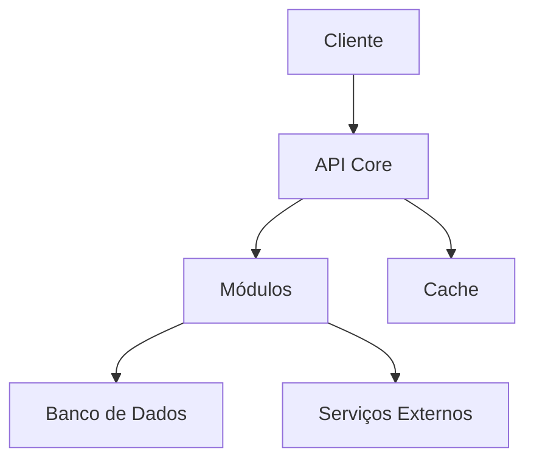

# Introdução

## O que é o ASOF?

ASOF é uma solução Python moderna e eficiente, projetada para simplificar e otimizar seus fluxos de trabalho. Com foco em usabilidade e desempenho, o ASOF oferece uma experiência intuitiva e poderosa.

## Por que usar o ASOF?

- **Simplicidade**: Interface intuitiva e fácil de usar
- **Flexibilidade**: Adaptável a diferentes necessidades e casos de uso
- **Desempenho**: Otimizado para máxima eficiência
- **Confiabilidade**: Testado extensivamente e mantido ativamente

## Para quem é o ASOF?

O ASOF é ideal para:

- Desenvolvedores que precisam de uma solução robusta
- Equipes que buscam melhorar sua produtividade
- Projetos que necessitam de uma base sólida e bem documentada

## Arquitetura

O ASOF segue uma arquitetura modular e bem estruturada:

## Próximos Passos

- Siga para [Primeiros Passos](getting-started.md) para começar a usar o ASOF
- Explore as [Funcionalidades](features.md) disponíveis
- Consulte nossa [documentação da API](../api/overview.md) para integrações 